# Projekte{#projects}

Mithilfe von Projekten können Sie Ressourcen zu einer Einheit gruppieren. Eine gemeinsam genutzte Umgebung erleichtert die Projektverwaltung. Die Ressourcentypen, die Sie mit einem Projekt verknüpfen können, werden in AEM als Kacheln bezeichnet. Kacheln können Projekt- und Team-Informationen, Assets, Workflows und andere Arten von Informationen sein. Ausführliche Informationen finden Sie unter [Projektkacheln](#project-tiles).

>[!CAUTION]
>
>Damit Projektbenutzer andere Benutzer/Gruppen sehen können, während sie die Projektfunktion verwenden, z. B. Projekte erstellen, Aufgaben/Workflows erstellen, das Team anzeigen und verwalten, müssen diese Benutzer Lesezugriff auf **/home/users** und **/home/groups** haben. Die einfachste Möglichkeit, dies zu implementieren, ist, der **projects-users**-Gruppe Lesezugriff auf **/home/users** und***/home/groups* zu gewähren.

Als Benutzer haben Sie folgende Möglichkeiten:

* Erstellen von Projekten
* Zuordnen von Inhalten und Asset-Ordnern zu einem Projekt
* Löschen von Projekten
* Entfernen von Inhaltsverknüpfungen aus einem Projekt

Weitere Informationen finden Sie in folgenden Themen:

* [Verwalten von Projekten](/help/sites-authoring/touch-ui-managing-projects.md)
* [Arbeiten mit Aufgaben](/help/sites-authoring/task-content.md)
* [Arbeiten mit Projekt-Workflows](/help/sites-authoring/projects-with-workflows.md)
* [Creative Project und PIM-Integration](/help/sites-authoring/managing-product-information.md)

## Projektekonsole {#projects-console}

In der Projektekonsole können Sie innerhalb von AEM auf Ihre Projekte zugreifen und diese verwalten.

* Wählen Sie **Zeitleiste** und dann ein Projekt, um seine Zeitleiste anzuzeigen.
* Klicken/tippen Sie auf **Auswählen**, um den Auswahlmodus zu aktivieren.
* Klicken Sie auf **Erstellen**, um Projekte hinzuzufügen.
* Mit **Aktive Projekte ein/aus** können Sie zwischen allen Projekten und nur den aktiven wechseln.
* Mit **Statistikansicht anzeigen** können Sie die Projektstatistiken zu Aufgabenabschlüssen anzeigen.

## Projektkacheln  {#project-tiles}

Sie können verschiedene Arten von Informationen mit Ihren Projekten verknüpfen. Diese werden als **Kacheln** bezeichnet. In diesem Abschnitt werden die einzelnen Kacheln und die enthaltenen Informationen beschrieben.

Sie können die folgenden Kacheln mit Ihrem Projekt verknüpfen. Sie werden in den folgenden Abschnitten beschrieben:

* Assets und Asset-Sammlungen
* Erlebnisse
* Links
* Projektinformationen
* Team
* Landing Pages
* E-Mails
* Workflows
* Launches
* Aufgaben

### Assets {#assets}

In der Kachel **Assets** können Sie alle Assets zusammenstellen, die Sie für ein bestimmtes Projekt verwenden.

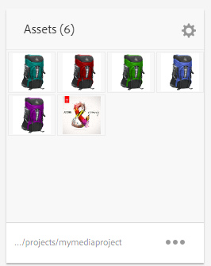

Laden Sie Assets direkt in die Kachel hoch. Darüber hinaus können Sie Bildsets, Rotationssets oder gemischte Mediensets erstellen, wenn Sie über das Zusatzmodul für Dynamic Media verfügen.

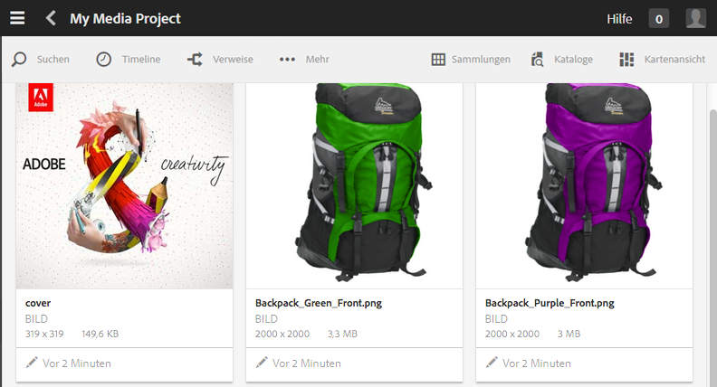

### Asset-Sammlungen {#asset-collections}

[Asset-Sammlungen](/help/assets/manage-collections.md) können Ihrem Projekt ähnlich wie Assets direkt hinzugefügt werden. Sie definieren die Sammlungen unter „Assets“.

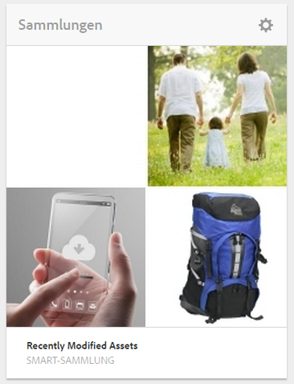

Fügen Sie eine Sammlung hinzu, indem Sie auf **Sammlung hinzufügen** klicken und die entsprechende Sammlung in der Liste auswählen.

### Erlebnisse {#experiences}

Über die Kachel **Erlebnisse** können Sie eine Mobile App, eine Website oder eine Veröffentlichung zum Projekt hinzufügen.

Die Symbole geben an, welche Art von Erlebnis dargestellt wird: Website, mobile Anwendung oder eine Veröffentlichung. Fügen Sie Erlebnisse hinzu, indem Sie auf das Pluszeichen (+) oder auf **Erlebnis hinzufügen** klicken und den Erlebnistyp auswählen.

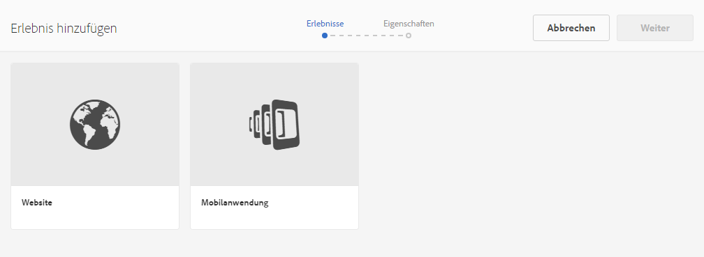

Wählen Sie den Pfad für die Miniaturansichten aus und, falls zutreffend, ändern Sie die Miniaturansicht für das Erlebnis. Erlebnisse werden in der Kachel **Erlebnisse** gruppiert.

### Links {#links}

Über die Kachel „Links“ können Sie externe Links mit Ihrem Projekt verknüpfen.

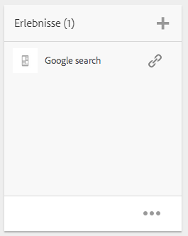

Sie können dem Link einen aussagekräftigen Namen geben und die Miniaturansicht ändern.

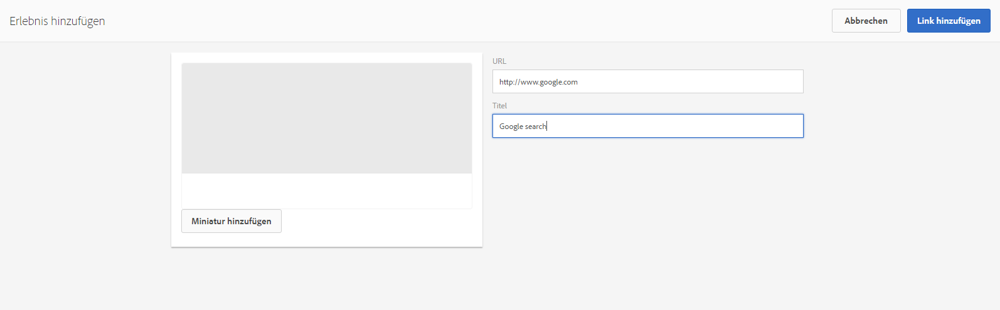

### Projektinformationen {#project-info}

Die Kachel „Projektinformationen“ enthält allgemeine Informationen zum Projekt, einschließlich einer Beschreibung, des Projektstatus (inaktiv oder aktiv), eines Fälligkeitsdatums und der Mitglieder. Darüber hinaus können Sie eine Projektminiaturansicht hinzufügen, die auf der Hauptprojektseite angezeigt wird.

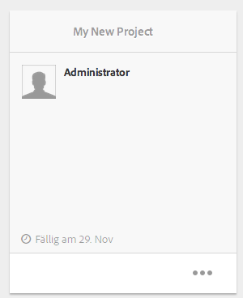

Die Team-Mitglieder können dieser Kachel hinzugefügt oder aus ihr entfernt werden (oder ihre Rollen können geändert werden). Das Gleiche gilt für die Kachel „Team“.

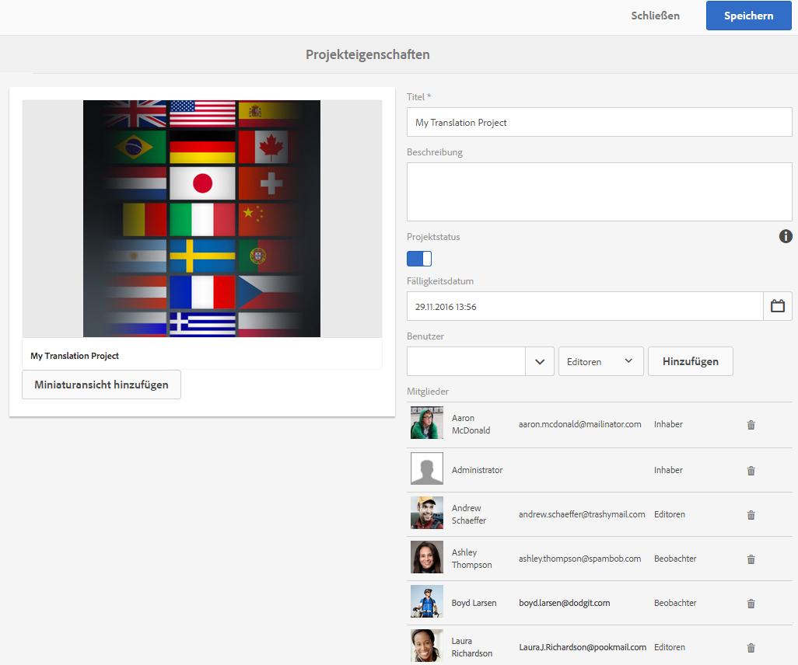

### Übersetzungsauftrag {#translation-job}

In der Kachel „Übersetzungsauftrag“ können Sie eine Übersetzung starten und sehen den jeweiligen Status Ihrer Übersetzungen. Informationen zum Einrichten Ihrer Übersetzung finden Sie unter [Erstellen von Übersetzungsprojekten](/help/assets/translation-projects.md).

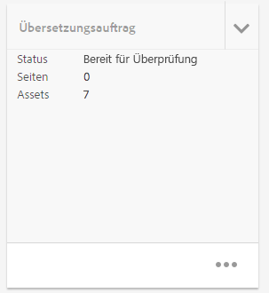

Klicken Sie auf die Auslassungszeichen unten auf der Karte **Übersetzungsauftrag**, um die Assets im Übersetzungs-Workflow anzuzeigen. In der Übersetzungsauftragsliste werden auch Einträge für Asset-Metadaten und -Tags aufgeführt. Diese Einträge geben an, dass die Metadaten und Tags für die Assets ebenfalls übersetzt werden.

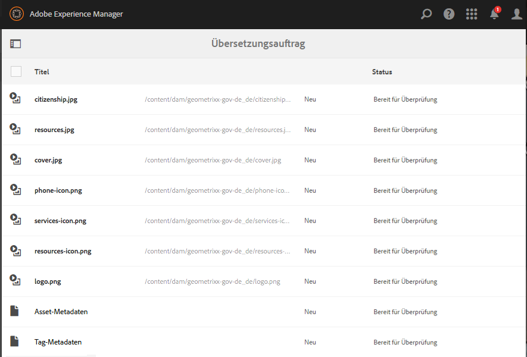

### Team {#team}

In dieser Kachel können Sie die Mitglieder des Projekt-Teams angeben. Geben Sie die Namen der Team-Mitglieder ein und weisen Sie Benutzerrollen zu.

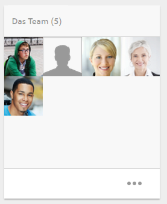

Sie können Team-Mitglieder zum Team hinzufügen und aus ihm löschen. Darüber hinaus können Sie die [Benutzerrolle](#userroles) bearbeiten, die dem jeweiligen Team-Mitglied zugewiesen ist.

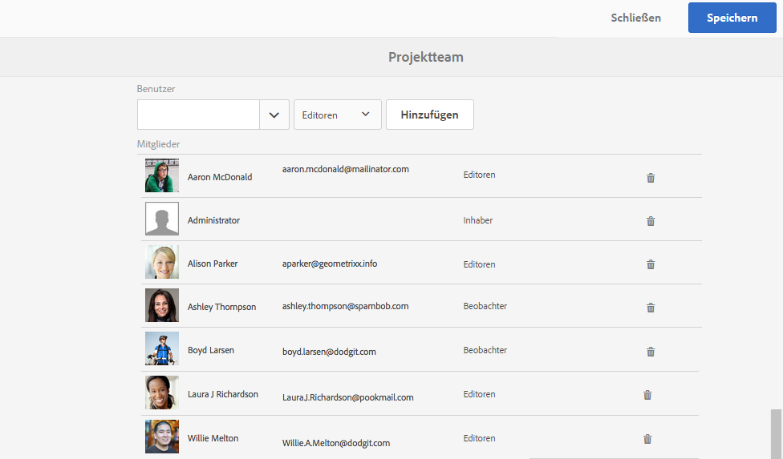

### Landing Pages {#landing-pages}

Über die Kachel **Einstiegsseiten** können Sie eine neue Einstiegsseite anfordern.

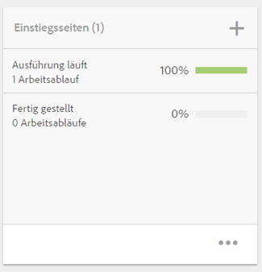

Dieser Workflow wird in [Erstellen eines Einstiegsseiten-Workflows](/help/sites-authoring/projects-with-workflows.md#request-landing-page-workflow) beschrieben.

### E-Mails  {#emails}

In der Kachel **E-Mails** können Sie E-Mail-Anforderungen verwalten. Hierüber lässt sich der auch der Workflow zum Anfordern einer E-Mail starten.

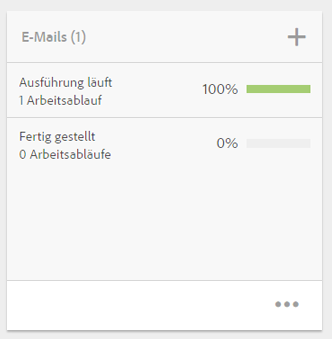

Weitere Informationen finden Sie unter [Workflow „E-Mail anfordern“](/help/sites-authoring/projects-with-workflows.md#request-email-workflow).

### Workflows {#workflows}

Sie können Ihr Projekt bestimmten Workflows zuweisen. Wenn Workflows ausgeführt werden, wird ihr Status in „Projekte“ in der Kachel **Workflows** angezeigt.

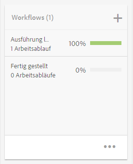

Sie können Ihr Projekt bestimmten Workflows zuweisen. Je nach Projekt stehen verschiedene Workflows zur Verfügung.

Diese werden unter [Arbeiten mit Projekt-Workflows](/help/sites-authoring/projects-with-workflows.md) beschrieben.

### Launches {#launches}

Die Kachel „Launches“ enthält alle Launches, die mit einem [Workflow für die Launch-Anfrage](/help/sites-authoring/projects-with-workflows.md) angefordert wurden.

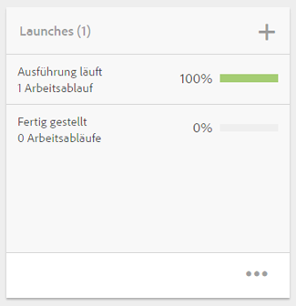

### Aufgaben {#tasks}

Mithilfe von Aufgaben können Sie den Status aller projektbezogenen Aufgaben überwachen, einschließlich Workflows. Aufgaben werden im Detail unter [Arbeiten mit Aufgaben](/help/sites-authoring/task-content.md) beschrieben.

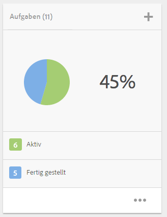

## Projektvorlagen {#project-templates}

Im Lieferumfang von AEM sind drei verschiedene Vorlagen enthalten:

* Ein einfaches Projekt: ein Referenzbeispiel für alle Projekte, die nicht in andere Kategorien passen (ein Allrounder). Es umfasst drei grundlegende Rollen (Inhaber, Bearbeiter und Beobachter) und vier Workflows (Projektbestätigung, Launch anfordern, Landingpage anfordern und E-Mail anfordern).
* Ein Medienprojekt: ein beispielhaftes Referenzprojekt für medienbezogene Aktivitäten. Es umfasst eine Reihe von medienbezogenen Projektrollen (Fotografen, Bearbeiter, Werbetexter, Designer, Inhaber und Beobachter). Es enthält außerdem zwei medienbezogene Workflows: Kopie anfordern (zum Anfordern und Prüfen von Text) und Produkt-Fotoshooting (für die Verwaltung von Produktfotografie).
* [Produktfoto-Projekt](/help/sites-authoring/managing-product-information.md)  - Ein Referenzbeispiel für die Verwaltung der eCommerce-bezogenen Produktfotografie. Es enthält Rollen für Fotografen, Bearbeiter, Fotoretoucheure, Inhaber, Creative Directors, Social-Media-Marketer, Marketing-Manager, Prüfer und Beobachter.
* [Ein Übersetzungsprojekt](/help/sites-administering/translation.md): ein beispielhaftes Referenzprojekt für die Verwaltung von übersetzungsbezogenen Aktivitäten. Es umfasst drei grundlegende Rollen (Inhaber, Bearbeiter und Beobachter). Es enthält zwei Workflows, auf die in der Workflow-Benutzeroberfläche zugegriffen werden kann.

Je nach ausgewählter Vorlage stehen Ihnen verschiedene Optionen für Benutzerrollen und Workflows zur Verfügung.

## Benutzerrollen in einem Projekt   {#user-roles-in-a-project}

Die verschiedenen Benutzerrollen werden in einer Projektvorlage festgelegt und sind vor allem für die folgenden beiden Bereiche wichtig:

1. Berechtigungen. Die Benutzerrollen fallen in eine der drei genannten Kategorien: Beobachter, Bearbeiter, Inhaber. Ein Fotograf oder Werbetexter hat z. B. dieselben Berechtigungen wie ein Bearbeiter. Über die Berechtigungen wird festgelegt, inwiefern ein Benutzer Inhalte in einem Projekt ändern kann.
1. Workflows. Mit Workflows wird festgelegt, wem welche Aufgaben in einem Projekt zugewiesen sind. Die Aufgaben können einer Projektrolle zugeordnet werden. Beispielsweise kann der Rolle „Fotografen“ eine Aufgabe zugewiesen werden, sodass alle Team-Mitglieder mit dieser Rolle die Aufgabe erhalten.

Alle Projekte unterstützen die folgenden Standardrollen, mit denen Sie Sicherheits- und Kontrollberechtigungen verwalten können:

<table>
 <tbody>
  <tr>
   <td>
<strong>Rolle</strong>
 </td>
   <td>
<strong>Beschreibung</strong>
 </td>
   <td>
<strong>Berechtigungen</strong>
 </td>
   <td>
<strong>Gruppenmitgliedschaft</strong>
 </td>
  </tr>
  <tr>
   <td>
Beobachter
 </td>
   <td>
Ein Benutzer mit dieser Rolle kann Projektdetails, einschließlich des Projektstatus, anzeigen.
 </td>
   <td>
Nur-Lese-Zugriff auf ein Projekt
 </td>
   <td>
Gruppe „workflow-users“
 </td>
  </tr>
  <tr>
   <td>
Bearbeiter
 </td>
   <td>
Ein Benutzer mit dieser Rolle kann Inhalt in ein Projekt hochladen und Projektinhalte bearbeiten.
 
 
 </td>
   <td>
    <ul>
     <li>Lese- und Schreibzugriff auf ein Projekt, zugehörige Metadaten und zugehörige Assets</li>
     <li>Berechtigungen zum Hochladen einer Aufnahmenliste oder eines Fotoshootings und Überprüfen und Genehmigen von Assets</li>
     <li>Schreibberechtigung für „/etc/commerce“</li>
     <li>Verändern-Berechtigungen für ein bestimmtes Projekt</li>
    </ul> </td>
   <td>
Gruppe „workflow-users“
 </td>
  </tr>
  <tr>
   <td>
Inhaber
 </td>
   <td>
Ein Benutzer mit dieser Rolle kann ein Projekt starten. Ein Inhaber kann ein Projekt erstellen, Arbeitsschritte in einem Projekt initiieren und genehmigte Assets in den Produktionsordner verschieben. Aber auch alle anderen Aufgaben im Projekt können vom Inhaber angezeigt und ausgeführt werden.
 </td>
   <td>
    <ul>
     <li>Schreibberechtigung für „/etc/commerce“</li>
    </ul> </td>
   <td>
    <ul>
     <li>DAM-Benutzergruppe (um ein Projekt erstellen zu können)</li>
     <li>Gruppe "Projektadministratoren"(um ein Projekt erstellen und Assets verschieben zu können)</li>
    </ul> </td>
  </tr>
 </tbody>
</table>

Für kreative Projekte stehen zusätzliche Rollen, z. B. Fotografen, zur Verfügung. Sie können diese Rollen verwenden, um auf deren Grundlage benutzerdefinierte Rollen für ein bestimmtes Projekt zu erstellen.

>[!NOTE]
>
>Wenn Sie das Projekt erstellen und den verschiedenen Rollen Benutzer hinzufügen, werden mit dem Projekt verknüpfte Gruppen automatisch erstellt, um die zugehörigen Berechtigungen zu verwalten. Ein Projekt mit dem Namen Myproject könnte z. B. drei Gruppen **Myproject-Eigentümer**, **MyProject-Editor**, **MyProject-Beobachter** haben. Wird das Projekt jedoch gelöscht, werden diese Gruppen nicht automatisch gelöscht. Ein Administrator muss die Gruppen unter **Werkzeuge** > **Sicherheit** > **Gruppen** manuell löschen.
