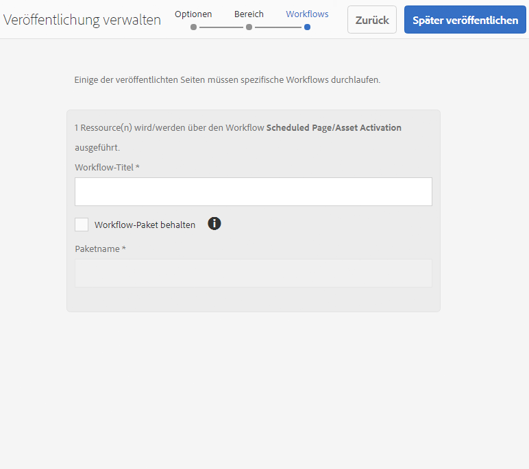

# Veröffentlichen von Seiten {#publishing-pages}

Nachdem Sie Ihren Inhalt in der Autorenumgebung erstellt und geprüft haben, [muss dieser auf der öffentlichen Website (der Veröffentlichungsumgebung) verfügbar gemacht werden](/help/sites-authoring/author.md#concept-of-authoring-and-publishing).

Dies wird als Veröffentlichung einer Seite bezeichnet. Wenn Sie eine Seite aus der Veröffentlichungsumgebung entfernen, wird dies als Rückgängigmachen der Veröffentlichung bezeichnet. Während der Veröffentlichung und des Rückgängigmachens der Veröffentlichung bleibt die Seite so lange in der Bearbeitungsumgebung verfügbar und kann geändert werden, bis Sie sie löschen.

Sie können eine Seite auch sofort oder zu einem vordefinierten künftigen Zeitpunkt (Datum/Uhrzeit) veröffentlichen bzw. ihre Veröffentlichung rückgängig machen.

>[!NOTE]
>
>Manche Begriffe im Zusammenhang mit dem Veröffentlichen können leicht verwechselt werden:
>
>* **Veröffentlichen/Veröffentlichung rückgängig machen**
   >  Dies sind die primären Begriffe für die Aktionen, mit denen Ihre Inhalte in Ihrer Veröffentlichungsumgebung öffentlich verfügbar gemacht werden (oder nicht).
   >
   >
* **Aktivieren/Deaktivieren**
   >  Diese Begriffe sind gleichbedeutend mit Veröffentlichung/Rückgängigmachen der Veröffentlichung.
   >
   >
* **Wiederholen/Replikation**
   >  Dies sind die technischen Begriffe, die die Datenbewegung (z. B. Seiteninhalt, Dateien, Code, Benutzerkommentare) von einer Umgebung in eine andere beschreiben, z. B. wenn Benutzerkommentare veröffentlicht oder rückgängig repliziert werden.
>

>[!NOTE]
>
>Wenn Sie nicht über die erforderlichen Berechtigungen für das Veröffentlichen einer bestimmten Seite verfügen:
>
>* Ein Workflow wird ausgelöst, der die entsprechende Person über Ihre Veröffentlichungsanfrage informiert.
>* Dieser [Workflow wurde möglicherweise von Ihrem Entwicklerteam angepasst](/help/sites-developing/workflows-models.md#main-pars-procedure-6fe6).
>* Sie werden in einer Mitteilung darüber informiert, dass der Workflow ausgelöst wurde.
>

## Veröffentlichen von Seiten {#publishing-pages-1}

Abhängig davon, wo Sie sich gerade befinden, können Sie Veröffentlichungen folgendermaßen vornehmen:

* [Im Seiteneditor](/help/sites-authoring/publishing-pages.md#publishing-from-the-editor)
* [In der Sites-Konsole](/help/sites-authoring/publishing-pages.md#publishing-from-the-console)

### Veröffentlichungen im Editor {#publishing-from-the-editor}

Wenn Sie eine Seite bearbeiten, kann sie direkt im Editor veröffentlicht werden.

1. Select the **Page Information** icon to open the menu and then the **Publish Page** option.

   

1. Je nachdem, ob die Seite Verweise enthält, die veröffentlicht werden müssen, geschieht Folgendes:

   * Die Seite wird direkt veröffentlicht, wenn keine Verweise veröffentlicht werden müssen.
   * Wenn die Seite Verweise enthält, die veröffentlicht werden müssen, werden diese im **Veröffentlichungsassistenten** aufgeführt und Sie können eine der folgenden Aktionen ausführen:

      * Specify which of the assets/tags/etc. you want to publish together with the page, then use **Publish** to complete the process.

      * Mit **Abbrechen** können Sie den Vorgang abbrechen.
   

1. Selecting **Publish** will replicate the page to the publish environment. Im Seiteneditor wird ein Hinweis angezeigt, in dem die Veröffentlichung bestätigt wird.

   

   Wird diese Seite in der Konsole dargestellt, ist der aktualisierte Veröffentlichungsstatus sichtbar.

   

>[!NOTE]
>
>Im Editor kann nur eine teilweise Veröffentlichung vorgenommen werden, d. h. nur die ausgewählten und keine untergeordneten Seiten werden veröffentlicht.

### Veröffentlichungen über die Konsole {#publishing-from-the-console}

In der Sites-Konsole gibt es zwei Möglichkeiten zur Veröffentlichung:

* [Schnell veröffentlichen](/help/sites-authoring/publishing-pages.md#quick-publish)
* [Veröffentlichung verwalten](/help/sites-authoring/publishing-pages.md#manage-publication)

#### Schnell veröffentlichen {#quick-publish}

**Die Schnellveröffentlichung** ist in einfachen Fällen erforderlich und veröffentlicht die ausgewählten Seiten sofort ohne weitere Interaktionen. Aus diesem Grund werden auch alle nicht-veröffentlichten Verweise ebenfalls automatisch veröffentlicht.

So veröffentlichen Sie eine Seite mit der Funktion „Schnell veröffentlichen“:

1. Select the page or pages in the sites console and click on the **Quick Publish** button.

   

1. In the Quick Publish dialogue, confirm the publication by clicking on **Publish** or cancel by clicking on **Cancel**. Beachten Sie, dass auch alle unveröffentlichten Verweise ebenfalls automatisch veröffentlicht werden.

   

1. Bei der Veröffentlichung der Seite erscheint eine Warnmeldung, in der die Veröffentlichung bestätigt wird.

>[!NOTE]
>
>Die Option „Schnell veröffentlichen“ ermöglicht nur die teilweise Veröffentlichung, d. h. nur die ausgewählten und keine untergeordneten Seiten werden veröffentlicht.

#### Veröffentlichung verwalten {#manage-publication}

**Die Funktion &quot;Veröffentlichung** verwalten&quot;bietet mehr Optionen als &quot;Schnelle Veröffentlichung&quot;, was die Aufnahme untergeordneter Seiten, die Anpassung der Verweise und das Starten der jeweiligen Arbeitsabläufe ermöglicht und die Möglichkeit bietet, Inhalte zu einem späteren Zeitpunkt zu veröffentlichen.

So veröffentlichen Sie eine Seite bzw. machen ihre Veröffentlichung rückgängig mit „Veröffentlichung verwalten“:

1. Select the page or pages in the sites console and click on the **Manage Publication** button.

   

1. The **Manage Publication** wizard starts. The first step, **Options**, allows you to:

   * Veröffentlichen Sie die ausgewählte Seite oder machen Sie die Veröffentlichung rückgängig.
   * Führen Sie diese Aktion sofort oder zu einem späteren Zeitpunkt aus.
   Bei der späteren Veröffentlichung wird ein Workflow gestartet, mit dem die ausgewählten Seiten zur angegebenen Zeit veröffentlicht werden. Entsprechend wird durch die Auswahl des Rückgängigmachens der Veröffentlichung zu einem späteren Zeitpunkt der entsprechende Workflow für die ausgewählten Seiten zum angegebenen Zeitpunkt gestartet.

   Wenn Sie eine Veröffentlichung/rückgängig gemachte Veröffentlichung später abbrechen möchten, gehen Sie zur Konsole [Workflow](/help/sites-administering/workflows.md), um den entsprechenden Workflow zu beenden.

   

   Klicken Sie auf **Weiter**, um fortzufahren.

1. In the next step of the Manage Publication wizard, **Scope**, you can define the scope of the publication/unpublication such as including to include child pages and/or including references.

   

   You can use the **Add Content** button to add additional pages to the list of pages to be published in case you neglected to select one before starting the Manage Publication wizard.

   Durch Klicken auf die Schaltfläche „Inhalt hinzufügen“ wird der [Pfadbrowser](/help/sites-authoring/author-environment-tools.md#path-browser) gestartet, mit dem Inhalte ausgewählt werden können.

   Select the required pages and then click **Select** to add the content to the wizard or **Cancel **to cancel the selection and return to the wizard.

   Im Assistenten können Sie dann ein Element in der Liste auswählen, um es weiter zu konfigurieren:

   * Untergeordnete Elemente einschließen
   * Das Element aus der Auswahl entfernen
   * Seine veröffentlichten Verweise verwalten
   

   Clicking **Include Children** opens a dialogue allowing you to:

   * Nur unmittelbar untergeordnete Elemente einbeziehen.
   * Nur geänderte Seiten einbeziehen.
   * Nur bereits veröffentlichte Seiten einbeziehen.
   Click **Add** to add the children pages to the list of pages to be published or unpublished based on the selection options. Click **Cancel** to cancel the selection and return to the wizard.

   

   Dort sehen Sie die hinzugefügten Seiten entsprechend Ihrer Auswahl im Dialogfeld „Untergeordnete Elemente einbeziehen“.

   You can view and modify the references to be published or unpublished for a page by selecting it and then clicking the **Published References** button.

   

   The **Published References** dialogue displayes the references for the selected content. Standardmäßig sind alle ausgewählt und werden veröffentlicht bzw. die Veröffentlichung wird rückgängig gemacht. Sie können sie aber auch deaktivieren, um die Auswahl aufzuheben, sodass sie nicht in die Aktion einbezogen werden.

   Click **Done** to save your changes or **Cancel** to cancel the selction and return to the wizard.

   Im Assistenten wird die Spalte **Verweise** aktualisiert und zeigt Ihre Auswahl von Verweisen an, die veröffentlicht werden sollen bzw. deren Veröffentlichung rückgängig gemacht werden soll.

   

1. Click **Publish** to complete.

   In der Sites-Konsole wird die Veröffentlichung durch eine Benachrichtigung bestätigt.

1. If the published pages are associated with workflows, they may be shown in a final **Workflows** step of the publication wizard.

   >[!NOTE]
   >
   >The **Workflows** step will be shown based on what rights your user may or may not have. See the [previous note on this page](/help/sites-authoring/publishing-pages.md#main-pars-note-0-ejsjqg-refd) regarding publishing privileges as well as [Managing Access to Workflows](/help/sites-administering/workflows-managing.md) and [Applying Workflows to Pages](/help/sites-authoring/workflows-applying.md#main-pars-text-5-bvhbkh-refd) for details.

   Die Ressourcen werden gemäß den ausgelösten Workflows gruppiert, wobei Sie für jede Ressource folgende Möglichkeiten haben:

   * Definieren des Workflow-Titels
   * Keep the workflow package, provided that the workflow has [multi-resource support](/help/sites-developing/workflows-models.md#configuring-a-workflow-for-multi-resource-support).
   * Definieren des Titels des Workflow-Pakets, sofern die Option zum Beibehalten des Workflow-Pakets ausgewählt wurde
   Click **Publish** or **Publish Later** to complete the publication.

   

## Veröffentlichen von Seiten rückgängig machen {#unpublishing-pages}

Wenn Sie die Veröffentlichung einer Seite rückgängig machen, wird sie aus der Veröffentlichungsumgebung gelöscht, sodass sie nicht mehr für Ihre Leser verfügbar ist.

In a [manner similar to publishing](/help/sites-authoring/publishing-pages.md#publishing-pages), one or more pages can be unpublished:

* [Im Seiteneditor](/help/sites-authoring/publishing-pages.md#unpublishing-from-the-editor)
* [In der Sites-Konsole](/help/sites-authoring/publishing-pages.md#unpublishing-from-the-console)

### Rückgängigmachen der Veröffentlichung im Editor {#unpublishing-from-the-editor}

Wenn Sie die Veröffentlichung einer von Ihnen bearbeiteten Seite rückgängig machen möchten, wählen Sie analog zur [Veröffentlichung einer Seite](/help/sites-authoring/publishing-pages.md#publishing-from-the-editor) im Menü **Seiteninformationen** die Option **Veröffentlichung der Seite rückgängig machen** aus.

### Rückgängigmachen der Veröffentlichung in der Konsole {#unpublishing-from-the-console}

Ebenso wie Sie [die Option „Veröffentlichung verwalten“ zur Veröffentlichung verwenden](/help/sites-authoring/publishing-pages.md#manage-publication), können Sie damit auch eine Veröffentlichung rückgängig machen.

1. Select the page or pages in the sites console and click on the **Manage Publication** button.
1. The **Manage Publication** wizard starts. In the first step, **Options**, select to **Unpublish** instead of the default option of **Publish**.

   

   Die Auswahl von „Später veröffentlichen“ startet einen Workflow zur Veröffentlichung der Seite zum angegebenen Zeitpunkt. Entsprechend startet die Auswahl von „Später deaktivieren“ einen Workflow zum Rückgängigmachen der Veröffentlichung der ausgewählten Seiten zum angegebenen Zeitpunkt.

   Wenn Sie eine Veröffentlichung/rückgängig gemachte Veröffentlichung später abbrechen möchten, gehen Sie zur Konsole [Workflow](/help/sites-administering/workflows.md), um den entsprechenden Workflow zu beenden.

1. Um das Rückgängigmachen der Veröffentlichung abzuschließen, fahren Sie mit dem Assistenten ähnlich wie beim [Veröffentlichen der Seite](/help/sites-authoring/publishing-pages.md#manage-publication) fort.

## Veröffentlichen und Rückgängigmachen der Veröffentlichung eines Baums {#publishing-and-unpublishing-a-tree}

Wenn Sie allerdings eine große Zahl von Inhaltsseiten erstellt bzw. aktualisiert haben, die sich alle unter derselben Stammseite befinden, kann es praktischer sein, mit einer einzigen Aktion den gesamten Baum zu veröffentlichen.

Dazu können Sie in der Sites-Konsole die Option [Veröffentlichung verwalten](/help/sites-authoring/publishing-pages.md#manage-publication) verwenden.

1. Wählen Sie in der Sites-Konsole die Stammseite des Baums aus, den Sie veröffentlichen möchten bzw. dessen Veröffentlichung Sie rückgängig machen möchten, und danach **Veröffentlichung verwalten**.
1. The **Manage Publication** wizard starts. Wählen Sie „Veröffentlichen“ oder „Veröffentlichung rückgängig machen“ sowie den Zeitpunkt aus und danach **Weiter**, um fortzufahren.
1. Wählen Sie im Schritt **Bereich** die Stammseite aus und danach **Untergeordnete Elemente einbeziehen**.

   

1. Deaktivieren Sie im Dialogfeld **Untergeordnete Elemente einbeziehen** die folgenden Optionen:

   * Nur unmittelbar untergeordnete Elemente einbeziehen
   * Nur bereits veröffentlichte Seiten einschließen
   Diese Optionen sind standardmäßig ausgewählt. Sie müssen also darauf achten, diese Auswahl aufzuheben. Klicken Sie auf **Hinzufügen**, um den Inhalt beim Veröffentlichen bzw. beim Rückgängigmachen der Veröffentlichung hinzuzufügen.

   

1. Im Assistenten **Veröffentlichung verwalten** wird der Inhalt des Baums zur Überprüfung aufgelistet. Sie können die Auswahl weiter anpassen, indem Sie zusätzliche Seiten hinzuzufügen oder ausgewählte Seiten entfernen.

   

   Remember that you can also review the references to be published via the **Published References** option.

1. [Fahren Sie mit dem Assistenten zum Verwalten von Veröffentlichungen normal](#manage-publication) fort, um die Veröffentlichung der Struktur abzuschließen oder die Veröffentlichung rückgängig zu machen.

## Bestimmen des Veröffentlichungsstatus {#determining-publication-status}

Sie können den Veröffentlichungsstatus einer Seite bestimmen:

* In der [Ressourcenübersicht in der Sites-Konsole](/help/sites-authoring/basic-handling.md#viewing-and-selecting-resources) 

   

   Der Veröffentlichungsstatus wird in der Sites-Konsole in der Ansicht [Karte](/help/sites-authoring/basic-handling.md#card-view), [Spalte](/help/sites-authoring/basic-handling.md#column-view) und [Liste](/help/sites-authoring/basic-handling.md#list-view) angezeigt.

* In the [timeline](/help/sites-authoring/basic-handling.md#timeline)

   

* In the [Page Information menu](/help/sites-authoring/author-environment-tools.md#page-information) when editing a page

   
