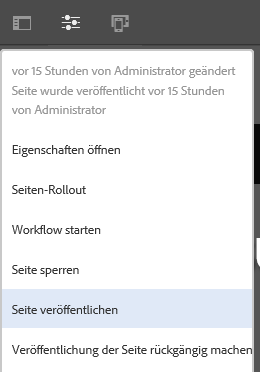

# Kurzanleitung zur Seitenbearbeitung (Authoring){#quick-guide-to-authoring-pages}

Diese Verfahren dienen als schnelle (allgemeine) Anleitung zu den wichtigsten Aktionen beim Bearbeiten von Seiteninhalten in AEM.

Sie:

* Stellen keine umfassende Erläuterung dar
* Enthalten Links zur detaillierten Dokumentation

Genauere Informationen zur Bearbeitung mit AEM finden Sie unter:

* [Erste Schritte für Autoren](/help/sites-authoring/first-steps.md)
* [Bearbeiten von Seiten (Authoring)](/help/sites-authoring/page-authoring.md)

## Tipps {#a-few-quick-hints}

Bevor Sie sich einen Überblick über die Besonderheiten verschaffen, hier eine kleine Sammlung von allgemeinen Tipps und Hinweisen, die Sie beachten sollten.

### Sites-Konsole {#sites-console}

* **Erstellen**

   * Diese Schaltfläche steht in vielen Konsolen zur Verfügung. Die angezeigten Optionen sind kontextabhängig und können je nach Szenario variieren.

* Neuanordnen von Seiten in einem Ordner

   * Dies kann in der [Listenansicht](/help/sites-authoring/basic-handling.md#list-view) durchgeführt werden. Die Änderungen werden angewendet und sind in anderen Ansichten sichtbar.

#### Bearbeiten von Seiten {#page-authoring}

* Navigieren per Links

   * ***Links sind für die Navigation nicht verfügbar***, wenn Sie sich im Modus **Bearbeiten** befinden. Für die Navigation mithilfe von Links müssen Sie [die Seite in einer Vorschau anzeigen](/help/sites-authoring/editing-content.md#previewing-pages), indem Sie eine der folgenden Optionen verwenden:

      * [Vorschaumodus](/help/sites-authoring/editing-content.md#preview-mode)
      * [Als veröffentlicht anzeigen](/help/sites-authoring/editing-content.md#view-as-published)

* Versionen werden nicht aus dem Seiteneditor gestartet/erstellt. Dies erfolgt jetzt über die Sites-Konsole (über **Erstellen** oder [Zeitleiste](/help/sites-authoring/basic-handling.md#timeline) für die jeweilige Ressource).   

>[!NOTE]
>
>Es gibt eine Reihe von Tastaturbefehlen, die die Bearbeitung vereinfachen.
>
>* [Tastaturbefehle bei der Seitenbearbeitung](/help/sites-authoring/page-authoring-keyboard-shortcuts.md)
>* [Tastaturbefehle für Konsolen](/help/sites-authoring/keyboard-shortcuts.md)
>

### Suchen nach Seiten {#finding-your-page}

Es gibt verschiedene Möglichkeiten, eine Seite zu finden: Sie können navigieren und/oder suchen:

1. Öffnen Sie die **Sites-Konsole** mithilfe der Option **Sites** in der [globalen Navigation](/help/sites-authoring/basic-handling.md#global-navigation). Diese wird als Dropdown-Liste angezeigt, wenn Sie links oben den Link „Adobe Experience Manager“ auswählen.

1. Navigieren Sie in der Struktur nach unten, indem Sie auf die entsprechende Seite tippen/klicken. Wie die Seitenressourcen dargestellt werden, hängt von der verwendeten Ansicht ab – [„Karte“, „Liste“ oder „Spalte“](/help/sites-authoring/basic-handling.md#viewing-and-selecting-resources):

   

1. Navigieren Sie über [den Breadcrumb in der Kopfzeile](/help/sites-authoring/basic-handling.md#theheaderwithbreadcrumbs) in der Baumstruktur nach oben, um zum ausgewählten Pfad zurückzukehren:

   

1. Sie können auch nach einer Seite [suchen](/help/sites-authoring/search.md). Sie können Ihre Seite aus den angezeigten Ergebnissen auswählen.

   

### Erstellen einer neuen Seite {#creating-a-new-page}

So [erstellen Sie eine Seite](/help/sites-authoring/managing-pages.md#creating-a-new-page):

1. [Navigieren Sie dorthin](#finding-your-page), wo die neue Seite erstellt werden soll.
1. Verwenden Sie das Symbol **Erstellen** und wählen Sie dann **Seite** aus der Liste:

   

1. Dadurch wird der Assistent geöffnet, der Sie durch das Erfassen der erforderlichen Informationen beim [Erstellen der neuen Seite](/help/sites-authoring/managing-pages.md#creating-a-new-page) führt. Befolgen Sie die Anweisungen auf dem Bildschirm.

### Auswählen Ihrer Seite für weitere Aktionen {#selecting-your-page-for-further-action}

Sie können eine Seite auswählen, um eine Aktion für sie durchzuführen. Wenn Sie eine Seite auswählen, wird die Symbolleiste automatisch aktualisiert, sodass die für diese Ressource relevanten Aktionen angezeigt werden.

Wie Sie eine Seite auswählen, hängt davon ab, welche Ansicht Sie in der Konsole verwenden:

1. Spaltenansicht:

   * Klicken Sie auf die Miniaturansicht für die gewünschte Ressource. Auf der Miniaturansicht wird die ausgewählte Ressource durch ein Häkchen gekennzeichnet

1. Listenansicht:

   * Klicken Sie auf die Miniaturansicht für die gewünschte Ressource. Auf der Miniaturansicht wird die ausgewählte Ressource durch ein Häkchen gekennzeichnet

1. Kartenansicht:

   * Wechseln Sie in den Auswahlmodus durch [Auswählen der gewünschten Ressource](/help/sites-authoring/basic-handling.md#viewingandselectingyourresources) mit:

      * Mobilgerät: auswählen und halten
      * Desktop: [Schnellaktion](/help/sites-authoring/basic-handling.md#quick-actions) – Häkchen:

   

   * Auf der Karte wird die ausgewählte Seite durch ein Häkchen gekennzeichnet.

   >[!NOTE]
   >
   >Wenn Sie sich im Auswahlmodus befinden, ändert sich das Symbol **Auswählen** (ein Häkchen) in das Symbol **Deaktivieren** (ein Kreuz).

### Schnellaktionen (nur Kartenansicht/Desktop) {#quick-actions-card-view-desktop-only}

[Schnellaktionen](/help/sites-authoring/basic-handling.md#quick-actions) sind verfügbar:

1. [Navigieren Sie zu der Seite,](#finding-your-page) mit der Sie eine Aktion ausführen möchten.
1. Bewegen Sie den Mauszeiger über die Karte für die gewünschte Ressource. Die Schnellaktionen werden angezeigt: 

   

### Bearbeiten des Seiteninhalts {#editing-your-page-content}

1. [Navigieren Sie zu der Seite](#finding-your-page), die Sie bearbeiten möchten.
1. [Öffnen Sie die zu bearbeitende Seite](/help/sites-authoring/managing-pages.md#opening-a-page-for-editing) über das Symbol „Bearbeiten“ (Bleistift):

   

   Darauf können Sie zugreifen, indem Sie wahlweise Folgendes verwenden:

   * [Schnellzugriffe (nur Kartenansicht/Desktop)](#quick-actions-card-view-desktop-only) für die jeweilige Ressource
   * Symbolleiste, wenn die [Seite ausgewählt wurde](#selectiingyourpageforfurtheraction)

1. Beim Öffnen des Editors haben Sie folgende Möglichkeiten:

   * [Fügen Sie der Seite eine neue Komponente hinzu](/help/sites-authoring/editing-content.md#inserting-a-component), indem Sie:

      * den Seitenbereich öffnen
      * die Komponentenregisterkarte (den [Komponenten-Browser](/help/sites-authoring/author-environment-tools.md#components-browser)) auswählen
      * die gewünschte Komponente auf Ihre Seite ziehen

     Der Seitenbereich kann mit folgendem Symbol geöffnet (und geschlossen) werden:

     

   * [Den Inhalt einer vorhandenen Komponente](/help/sites-authoring/editing-content.md#edit-configure-copy-cut-delete-paste) auf der Seite bearbeiten:

      * Öffnen Sie die Komponenten-Symbolleiste mit einer der beiden Optionen. Öffnen Sie das Dialogfeld über das Symbol **Bearbeiten** (Bleistift).
      * Öffnen Sie den integrierten Editor für die Komponente entweder durch Auswählen und Halten oder durch einen langsamen Doppelklick. Die verfügbaren Aktionen werden angezeigt (bei einigen Komponenten ist dies eine eingeschränkte Auswahl).
      * Um alle verfügbaren Aktionen anzuzeigen, gehen Sie wie folgt in den Vollbildmodus:

     

   * [Konfigurieren der Eigenschaften einer vorhandenen Komponente](/help/sites-authoring/editing-content.md#component-edit-dialog)

      * Öffnen Sie die Komponenten-Symbolleiste mit einer der beiden Optionen. Verwenden Sie das Symbol **Konfigurieren** (Schraubenschlüssel), um den Dialog zu öffnen.

   * [Verschieben](/help/sites-authoring/editing-content.md#moving-a-component) Sie eine Komponente mit einem der folgenden Verfahren:

      * Ziehen Sie die gewünschte Komponente an die neue Position.
      * Öffnen Sie die Komponenten-Symbolleiste mit einer der beiden Optionen. Verwenden Sie die Symbole **Ausschneiden** und dann **Einfügen**, wo erforderlich.

   * So können Sie eine Komponente [kopieren (und einfügen)](/help/sites-authoring/editing-content.md#edit-configure-copy-cut-delete-paste):

      * Öffnen Sie die Komponenten-Symbolleiste mit einer der beiden Optionen. Verwenden Sie die Symbole **Ausschneiden** und dann **Einfügen**, wo erforderlich.

   >[!NOTE]
   >
   >Sie können Komponenten auf derselben oder einer anderen Seite **einfügen**. Wenn Sie Komponenten auf einer anderen Seite einfügen, die bereits vor dem Ausschneiden und Kopieren geöffnet war, muss diese Seite aktualisiert werden.

   * Eine Komponente [löschen](/help/sites-authoring/editing-content.md#edit-configure-copy-cut-delete-paste):

      * Öffnen Sie die Komponenten-Symbolleiste per Klick. Verwenden Sie dann das Symbol **Löschen**.

   * Fügen Sie der Seite [Anmerkungen](/help/sites-authoring/annotations.md#annotations) hinzu:

      * Wählen Sie den Modus **Anmerken** (Sprechblasensymbol). Fügen Sie Anmerkungen mit dem Symbol **Anmerkung hinzufügen** (Pluszeichen) hinzu. Beenden Sie den Anmerkungsmodus mit dem X oben rechts.

     

   * [Vorschau einer Seite](/help/sites-authoring/editing-content.md#preview-mode) (um ihre Darstellung in der Publishing-Umgebung anzuzeigen)

      * Wählen Sie in der Symbolleiste die Option **Vorschau**.

   * Kehren Sie in den Bearbeitungsmodus zurück (oder wählen Sie einen anderen Modus), indem Sie die Dropdown-Auswahl **Bearbeiten** verwenden.

   >[!NOTE]
   >
   >Verwenden Sie den [Vorschaumodus](/help/sites-authoring/editing-content.md#preview-mode), wenn Sie mithilfe von Links im Inhalt navigieren möchten.

### Bearbeiten der Seiteneigenschaften {#editing-the-page-properties}

Es gibt (im Wesentlichen) zwei Methoden für das [Bearbeiten von Seiteneigenschaften](/help/sites-authoring/editing-page-properties.md):

* In der Konsole **Sites**:

   1. [Navigieren Sie zu der Seite](#finding-your-page), die Sie veröffentlichen möchten.
   1. Wählen Sie das Symbol **Eigenschaften** aus, indem Sie wahlweise Folgendes verwenden:

      * [Schnellzugriffe (nur Kartenansicht/Desktop)](#quick-actions-card-view-desktop-only) für die jeweilige Ressource
      * Symbolleiste, wenn die [Seite ausgewählt wurde](#selectiingyourpageforfurtheraction)

  

   1. Die Seiteneigenschaften werden angezeigt. Sie können nach Bedarf Aktualisierungen vornehmen. Speichern Sie diese anschließend, um sie beizubehalten.

* Beim [Bearbeiten Ihrer Seite](#editing-your-page-content):

   1. Öffnen Sie das Menü **Seiteninformationen**.
   1. Wählen Sie **Eigenschaften öffnen**, um den Dialog zum Bearbeiten der Eigenschaften zu öffnen.

  

### Veröffentlichen Ihrer Seite (oder Rückgängigmachen der Veröffentlichung) {#publishing-your-page-or-unpublishing}

Es gibt im Wesentlichen zwei Methoden zum [Veröffentlichen Ihrer Seite](/help/sites-authoring/publishing-pages.md) (und ebenso zum Rückgängigmachen der Veröffentlichung):

* In der Konsole **Sites**:

   1. [Navigieren Sie zu der Seite](#finding-your-page), die Sie veröffentlichen möchten.
   1. Wählen Sie das Symbol **Quick Publish** aus, indem Sie wahlweise Folgendes verwenden:

      * [Schnellzugriffe (nur Kartenansicht/Desktop)](#quick-actions-card-view-desktop-only) für die jeweilige Ressource
      * Symbolleiste, wenn die [Seite ausgewählt wurde](#selectiingyourpageforfurtheraction) (ermöglicht auch Zugriff auf [Später veröffentlichen](/help/sites-authoring/publishing-pages.md#main-pars-title-12)).

  

* Beim [Bearbeiten Ihrer Seite](#editing-your-page-content):

   1. Öffnen Sie das Menü **Seiteninformationen**.
   1. Wählen Sie **Seite veröffentlichen**.

  

* Das Rückgängigmachen der Veröffentlichung einer Seite in der Konsole kann nur über die Option **Veröffentlichung verwalten** erfolgen, die nur in der Symbolleiste verfügbar ist (nicht über Schnellaktionen).

  Die Option **Veröffentlichung der Seite aufheben** ist weiterhin über das Menü **Seiteninformationen** im Editor verfügbar.

  

  Weitere Informationen finden Sie unter [Veröffentlichen von Seiten](/help/sites-authoring/publishing-pages.md#unpublishing-pages).

### Verschieben, Kopieren und Einfügen oder Löschen Ihrer Seite {#move-copy-and-paste-or-delete-your-page}

Diese Aktionen können alle wie folgt ausgelöst werden:

1. [Navigieren Sie zu der Seite](#finding-your-page), die Sie verschieben, kopieren und einfügen oder löschen möchten.
1. Wählen Sie das Symbol zum Kopieren (und dann Einfügen), Verschieben oder Löschen nach Bedarf aus, indem Sie eine der folgenden Aktionen durchführen:

   * [Schnellaktionen (nur Kartenansicht/Desktop)](#quick-actions-card-view-desktop-only) für die gewünschte Ressource.
   * Symbolleiste, wenn die [Seite ausgewählt wurde](#selecting-your-page-for-further-action)

   Anschließend abhängig von Ihrer Aktion:

   * Kopieren:

      * Zum neuen Speicherort navigieren und dort einfügen.

   * Verschieben:

      * Der Assistent wird geöffnet, um die zum Verschieben der Seite erforderlichen Informationen zu sammeln. Befolgen Sie die Anweisungen auf dem Bildschirm.

   * Löschen:

      * Sie werden aufgefordert, die Aktion zu bestätigen.

   >[!NOTE]
   >
   >Löschen ist nicht als Schnellaktion verfügbar.

### Sperren (und Entsperren) Ihrer Seite  {#locking-your-page-then-unlocking}

[Sperren einer Seite](/help/sites-authoring/editing-content.md#locking-a-page): Verhindert, dass andere Autoren daran arbeiten, während Sie dies tun. Das Symbol bzw. die Schaltfläche „Sperren“ (und „Entsperren“) ist verfügbar:

* Symbolleiste, wenn die [Seite ausgewählt wurde](#selecting-your-page-for-further-action)
* Dropdown-Menü [Seiteninformationen](#editing-the-page-properties) beim Bearbeiten einer Seite
* Seitensymbolleiste beim Bearbeiten einer Seite (wenn die Seite gesperrt ist)

Beispielsweise sieht das Schloss-Symbol folgendermaßen aus:

### Zugreifen auf Seitenverweise {#accessing-page-references}

[Schnellzugriff auf Verweise](/help/sites-authoring/author-environment-tools.md#references) von oder zu einer Seite ist in der Verweisleiste verfügbar.

1. Wählen Sie die Option **Verweise** mithilfe des Symbolleistensymbols (vor oder nach dem [Auswählen Ihrer Seite](#selecting-your-page-for-further-action)):

   

   Ein Liste von Verweistypen wird angezeigt:

   

1. Klicken Sie auf den gewünschten Verweistyp, um weitere Details anzuzeigen und ggf. weitere Aktionen auszuführen.

### Erstellen einer Seitenversion {#creating-a-version-of-your-page}

So erstellen Sie eine [Version](/help/sites-authoring/working-with-page-versions.md) Ihrer Seite:

1. Wählen Sie zum Öffnen der Zeitleiste die Option **[Zeitleiste](/help/sites-authoring/basic-handling.md#timeline)** mithilfe des Symbolleistensymbols (vor oder nach dem [Auswählen Ihrer Seite](#selecting-your-page-for-further-action)):

   

1. Klicken Sie unten rechts in der Spalte „Zeitleiste“ auf den Nach-oben-Pfeil, um weitere Schaltflächen einzublenden, darunter auch **Als Version speichern**.

   

1. Wählen Sie **Als Version speichern**, gefolgt von **Erstellen**.

### Wiederherstellen/Vergleichen einer Seitenversion {#restoring-comparing-a-version-of-your-page}

Beim Wiederherstellen und/oder Vergleichen von Seitenversionen wird dasselbe grundlegende Verfahren eingesetzt:

1. Wählen Sie mithilfe des Symbolleistensymbols die Option **[Zeitleiste](/help/sites-authoring/basic-handling.md#timeline)** (vor oder nach dem [Auswählen Ihrer Seite](#selecting-your-page-for-further-action)):

   

   Wenn bereits eine Version der Seite gespeichert wurde, wird diese in der Timeline aufgeführt.

1. Klicken Sie auf die Version, die Sie wiederherstellen möchten. Dadurch werden zusätzliche Aktionsschaltflächen angezeigt:

   * **Auf diese Version zurücksetzen**

      * Die Version wird wiederhergestellt.

   * **Unterschiede anzeigen**

      * Die Seite wird geöffnet und die Unterschiede (zwischen den beiden Versionen) werden hervorgehoben.
