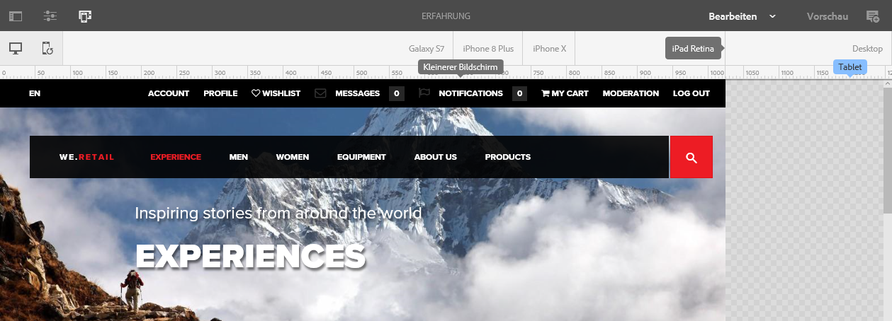
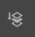

# Responsives Layout{#responsive-layout}

AEM ermöglicht das Erstellen eines responsiven Layouts für Ihre Seiten mithilfe der Komponente **Layout-Container**.

Dies bietet ein Absatzsystem, mit dem Sie Komponenten in einem responsiven Raster positionieren können. Dieses Raster kann das Layout entsprechend der Geräte-/Fenstergröße und dem Format neu anordnen. Die Komponente wird zusammen mit dem [**Layout-Modus**](/help/sites-authoring/responsive-layout.md#defining-layouts-layout-mode) verwendet, in dem Sie Ihr responsives Layout geräteabhängig erstellen und bearbeiten können.

Der Layout-Container:

* Bietet horizontale Ausrichtung am Raster sowie die Möglichkeit, Komponenten nebeneinander im Raster zu platzieren und zu definieren, wann sie reduziert werden/umfließen sollen.
* Verwendet vordefinierte Breakpoints (z. B. für Smartphone, Tablet usw.), mit denen Sie das erforderliche Verhalten von Inhalten für zugehörige Geräte/Ausrichtungen definieren können.

   * Sie können beispielsweise die Komponentengröße anpassen oder festlegen, ob die Komponente auf bestimmten Geräten angezeigt werden soll.

* Kann verschachtelt werden, um die Spaltensteuerung zuzulassen.

Der Benutzer bzw. die Benutzerin kann dann sehen, wie der Inhalt mithilfe des Emulators für bestimmte Geräte gerendert wird.

>[!CAUTION]
>
>Auch wenn die Layout-Container-Komponente in der klassischen Benutzeroberfläche verfügbar ist, steht der vollständige Funktionsumfang nur in der Touch-optimierten Benutzeroberfläche zur Verfügung.

Das responsive Layout für Ihre Seiten wird von AEM durch eine Kombination von Mechanismen ermöglicht:

* [**Layout-Container-Komponente**](#adding-a-layout-container-and-its-content-edit-mode)

  Diese Komponente ist im [Komponenten-Browser](/help/sites-authoring/author-environment-tools.md#components-browser) verfügbar. Sie bietet ein Raster-Absatzsystem, mit dem Sie Komponenten in einem responsiven Raster hinzufügen und positionieren können. Dieses kann auf Ihrer Seite auch als Standardabsatzsystem festgelegt werden.

* [**Layout-Modus**](/help/sites-authoring/responsive-layout.md#defining-layouts-layout-mode)

  Sobald der Layout-Container auf der Seite positioniert ist, können Sie im **Layout**-Modus Inhalte im responsiven Raster positionieren.

* [**Emulator**](#selecting-a-device-to-emulate)
Damit können Sie responsive Websites erstellen und bearbeiten, die ihr Layout durch interaktive Größenanpassung der Komponenten an die Geräte-/Fenstergröße anpassen. Die Benutzerin oder der Benutzer kann sich mit dem Emulator ansehen, wie der Inhalt gerendert wird.

Mit diesen responsiven Rastermechanismen können Sie:

* Breakpoints verwenden, um verschiedene Inhalts-Layouts basierend auf der Gerätebreite (bezogen auf Gerätetyp und Ausrichtung) zu definieren.
* Verwendung derselben Breakpoints und Inhaltslayouts, um sicherzustellen, dass Ihr Inhalt an die Größe des Browser-Fensters auf dem Desktop angepasst wird.
* Mit der horizontalen Ausrichtung am Raster können Sie Komponenten im Raster platzieren, die Größe anpassen und definieren, wann ein Reduzieren/Umfließen daneben oder drüber/darunter erfolgen soll.
* Ausblenden von Komponenten für bestimmte Gerätelayouts.
* Realisieren einer Spaltensteuerung.

Je nach Projekt kann der Layout-Container als standardmäßiges Absatzsystem für Ihre Seiten oder als Komponente verwendet werden, die über den Komponenten-Browser zu Ihrer Seite hinzugefügt werden kann (oder beides).

>[!NOTE]
>
>Adobe stellt eine [GitHub-Dokumentation](https://adobe-marketing-cloud.github.io/aem-responsivegrid/) zum responsiven Layout als Referenz bereit. Diese kann Frontend-Entwicklerinnen und -entwicklern zur Verfügung gestellt werden, damit sie das AEM-Raster außerhalb von AEM verwenden können, um beispielsweise statische HTML-Modelle für künftige AEM Sites zu erstellen.

>[!NOTE]
>
>Die Verwendung des obigen Mechanismus wird durch die Konfiguration der Vorlage aktiviert. Weitere Informationen finden Sie unter [Konfigurieren des responsiven Layouts](/help/sites-administering/configuring-responsive-layout.md).

## Layout-Definitionen, Geräteemulation und Breakpoints {#layout-definitions-device-emulation-and-breakpoints}

Wenn Sie den Inhalt Ihrer Website erstellen, möchten Sie sicherstellen, dass Ihr Inhalt auf dem für die Anzeige verwendeten Gerät angemessen angezeigt wird.

AEM ermöglicht die Definition von Layouts, die von der Breite des Geräts abhängig sind:

* Mit dem Emulator können Sie diese Layouts auf einer Reihe von Geräten emulieren. Abgesehen vom Gerätetyp kann sich auch die durch die Option **Gerät drehen** ausgewählte Ausrichtung auf den ausgewählten Breakpoint auswirken, da sich die Breite ändert.
* Breakpoints sind Punkte, die die Layout-Definitionen trennen.

   * Sie definieren die maximale Breite (in Pixel) der Geräte, die ein bestimmtes Layout verwenden.
   * Breakpoints gelten in der Regel für eine Auswahl an Geräten und hängen von der Breite der Displays ab.
   * Ein Breakpoint reicht nach links bis zum nächsten Breakpoint.
   * Sie können den Breakpoint nicht spezifisch auswählen - durch die Auswahl eines Geräts und einer Ausrichtung wird der entsprechende Breakpoint automatisch ausgewählt.

Das Gerät **Desktop**, das keine bestimmte Breite aufweist und sich auf den Standard-Breakpoint bezieht (d. h. auf alles über dem letzten konfigurierten Breakpoint).

>[!NOTE]
>
>Es wäre möglich, Breakpoints für jedes einzelne Gerät zu definieren. Dies würde jedoch den Aufwand für die Layout-Definition und die Wartung deutlich erhöhen.

Wenn Sie den Emulator verwenden, wählen Sie ein bestimmtes Gerät für die Emulation und Layout-Definition aus und der zugehörige Breakpoint wird ebenfalls hervorgehoben. Alle von Ihnen vorgenommenen Layoutänderungen gelten für andere Geräte, für die der Breakpoint gilt, d. h. alle Geräte, die links neben der aktiven Breakpoint-Markierung, aber vor der nächsten Breakpoint-Markierung positioniert sind.

Wenn Sie z. B. das Gerät **iPhone 6 Plus** für die Emulation und das Layout auswählen (das mit einer Breite von 540 Pixel definiert ist), wird auch der Breakpoint **Telefon** (definiert mit 768 Pixel) aktiviert. Alle Änderungen am Layout, die Sie für das **iPhone 6** durchführen, gelten auch für die anderen Geräte unter dem Breakpoint **Telefone**, wie das **iPhone 5** (mit 320 Pixel definiert).

## Auswahl eines zu emulierenden Geräts {#selecting-a-device-to-emulate}

1. Öffnen Sie die gewünschte Seite zur Bearbeitung. Zum Beispiel:

   `http://localhost:4502/editor.html/content/we-retail/us/en/experience.html`

1. Wählen Sie in der oberen Symbolleiste das Symbol **Emulator** aus:

   

1. Die Emulator-Symbolleiste wird geöffnet.

   

   In der Emulator-Symbolleiste werden zusätzliche Layout-Optionen angezeigt:

   * **Gerät drehen**: Ermöglicht es Ihnen, die vertikale Ausrichtung (Hochformat) eines Geräts in eine horizontale Ausrichtung (Querformat) zu ändern und umgekehrt.

      

   * **Gerät auswählen**: Ermöglicht es Ihnen, ein bestimmtes Gerät anzugeben, das aus einer Liste emuliert werden soll (Einzelheiten dazu werden im nächsten Schritt beschrieben).

     

1. Um ein bestimmtes zu emulierendes Gerät auszuwählen, haben Sie folgende Möglichkeiten:

   * Verwenden Sie das Symbol „Gerät auswählen“ und wählen Sie aus einer Dropdown-Auswahl aus.
   * Klicken Sie in der Emulator-Symbolleiste auf die Geräteanzeige.

   

1. Nachdem Sie ein bestimmtes Gerät ausgewählt haben, sind folgende Möglichkeiten verfügbar:

   * Sie können die aktive Markierung für das ausgewählte Gerät anzeigen, z. B. **iPad**.
   * Sie können die aktive Markierung für den entsprechenden [Breakpoint](/help/sites-authoring/responsive-layout.md#layout-definitions-device-emulation-and-breakpoints) anzeigen, z. B. **Tablet**.

   

   * Die gepunktete blaue Linie stellt den *Falz* für das ausgewählte Gerät dar (in diesem Fall ein **iPhone 6**).

   

   * Der Falz kann auch als Seitenumbruch für den Inhalt betrachtet werden (nicht zu verwechseln mit den [Breakpoints](/help/sites-authoring/responsive-layout.md#layout-definitions-device-emulation-and-breakpoints)). Dies wird angezeigt, um zu veranschaulichen, welchen Teil des Inhalts die Benutzenden vor dem Scrollen auf dem Gerät sehen werden.
   * Die Linie für den Falz wird nicht angezeigt, wenn die Höhe des zu emulierenden Geräts größer als die Bildschirmgröße ist.
   * Der Falz wird aus Komfortgründen für Autorinnen und Autoren angezeigt, aber nicht auf der veröffentlichten Seite.

## Hinzufügen eines Layout-Containers und seiner Inhalte (Bearbeitungsmodus) {#adding-a-layout-container-and-its-content-edit-mode}

Ein **Layout-Container** ist ein Absatzsystem mit folgenden Eigenschaften:

* Enthält andere Komponenten.
* Definiert das Layout.
* Reagiert auf Änderungen.

>[!NOTE]
>
>Falls er noch nicht verfügbar ist, muss der **Layout-Container** explizit [für ein Absatzsystem/eine Seite aktiviert werden](/help/sites-administering/configuring-responsive-layout.md) (z. B. über den [**Design**-Modus](/help/sites-authoring/default-components-designmode.md)).

1. Der **Layout-Container** ist als Standardkomponente im [Komponentenbrowser](/help/sites-authoring/author-environment-tools.md#components-browser) verfügbar. Von hier können Sie ihn an die gewünschte Position auf der Seite ziehen, nach der der Platzhalter **Komponenten hierher ziehen** angezeigt wird.
1. Anschließend können Sie dem Layout-Container Komponenten hinzufügen. Diese Komponenten enthalten den tatsächlichen Inhalt:

   

## Auswählen und Bearbeiten eines Layout-Containers (Bearbeitungsmodus) {#selecting-and-taking-action-on-a-layout-container-edit-mode}

Einen Layout-Container können Sie wie andere Komponenten im **Bearbeitungsmodus** auswählen und anschließend bearbeiten (ausschneiden, kopieren, löschen):

>[!CAUTION]
>
>Da ein Layout-Container ein Absatzsystem ist, werden beim Löschen der Komponente sowohl das Layout-Raster als auch alle Komponenten (und deren Inhalt) gelöscht, die sich im Container befinden.

1. Wenn Sie den Mauszeiger über den Rasterplatzhalter bewegen oder diesen auswählen, wird das Aktionsmenü angezeigt.

   

   Wählen Sie daraufhin die Option **Übergeordnetes Element** aus.

   

1. Wenn die Layout-Komponente geschachtelt ist, bietet die Auswahl der Option **Übergeordnet** eine Dropdown-Auswahl, über die Sie den geschachtelten Layout-Container oder dessen übergeordnete Elemente auswählen können.

   Wenn Sie den Mauszeiger über die Namen der Container in der Dropdown-Liste bewegen, werden deren Umrahmungen auf der Seite angezeigt.

   * Der am wenigsten geschachtelte Layout-Container ist schwarz umrandet.
   * Der nächstniedrige verschachtelte Layout-Container ist dunkelgrau umrandet.
   * Alle folgenden Container sind hellgrau umrandet.

   

1. Dadurch wird das gesamte Raster mit den Inhalten markiert. Die Aktionssymbolleiste wird angezeigt, über die Sie eine Aktion auswählen können, z. B. **Löschen**.

   

## Definieren von Layouts (Layout-Modus) {#defining-layouts-layout-mode}

>[!NOTE]
>
>Sie können für jeden [Breakpoint](#layout-definitions-device-emulation-and-breakpoints) (der durch den emulierten Gerätetyp und die Ausrichtung bestimmt wird) ein eigenes Layout definieren.

Das Layout eines mit dem Layout-Container implementierten responsiven Rasters muss im **Layout**-Modus konfiguriert werden.

Der **Layout**-Modus kann auf zwei Arten aktiviert werden.

* Durch Verwenden des [Modusmenüs in der Symbolleiste](/help/sites-authoring/author-environment-tools.md#page-modes) und Auswählen des **Layout**-Modus

   * Wählen Sie den **Layout**-Modus so aus, wie Sie den Modus **Bearbeiten** oder **Targeting** auswählen.
   * Der **Layout**-Modus wird zunächst automatisch beibehalten. Sie können den **Layout**-Modus nur beenden, indem Sie über die Modusauswahl einen anderen Modus auswählen.

* Beim [Bearbeiten einer einzelnen Komponente.](/help/sites-authoring/editing-content.md#edit-component-layout)

   * Durch Verwendung der Option **Layout** im Schnellaktionsmenü der Komponente können Sie in den **Layout**-Modus wechseln.
   * Der **Layout**-Modus bleibt während der Bearbeitung der Komponente bestehen und kehrt in den Modus **Bearbeiten** zurück, sobald der Fokus zu einer anderen Komponente wechselt.

Im Layout-Modus können Sie verschiedene Aktionen für ein Raster ausführen:

* Ändern Sie die Größe der Inhaltskomponenten mithilfe der blauen Punkte. Die Größenanpassung wird immer am Raster ausgerichtet. Während der Größenanpassung wird im Hintergrund das Raster angezeigt, was die Ausrichtung erleichtert:

  

  >[!NOTE]
  >
  >Wenn Sie die Größe von Komponenten wie **Bildern** ändern, bleiben die Proportionen und Seitenverhältnisse erhalten.

* Klicken Sie auf eine Inhaltskomponente. Über die Symbolleiste können Sie:

   * **Übergeordnetes Element**

     Hierüber können Sie die ganze Layout-Container-Komponente auswählen, um diese insgesamt zu bearbeiten.

   * **In neue Zeile verschieben**

     Die Komponente wird abhängig von dem innerhalb des Rasters verfügbaren Platz in eine neue Zeile verschoben.

   * **Komponente ausblenden**

     Die Komponente wird unsichtbar (sie kann über die Symbolleiste des Layout-Containers wiederhergestellt werden).

  

* In **Layout** -Modus können Sie auf **Komponenten hierher ziehen** , um die gesamte Komponente auszuwählen. Dadurch wird die Symbolleiste für diesen Modus angezeigt.

  Die Symbolleiste bietet je nach Status der Layout-Komponente und der zugehörigen Komponenten unterschiedliche Optionen. Beispiel:

   * **Übergeordnetes Element**: Wählt die übergeordnete Komponente aus.

     

   * **Ausgeblendete Komponenten anzeigen**: Blendet alle oder einzelne Komponenten ein. Die Zahl gibt an, wie viele ausgeblendete Komponenten es derzeit gibt. Der Zähler zeigt an, wie viele Komponenten ausgeblendet sind.

     

   * **Breakpoint-Layout zurücksetzen**: Stellt das Standard-Layout wieder her. Dies bedeutet, dass kein benutzerdefiniertes Layout vorgegeben wird.

     

   * **In neue Zeile verschieben**: Verschiebt die Komponente um eine Position nach oben, wenn der Leerraum dies erlaubt.

     

   * **Komponente ausblenden**: Blendet die aktuelle Komponente aus.

     

     >[!NOTE]
     >
     >Im obigen Beispiel sind die Aktionen zum Verschieben und Ausblenden verfügbar, weil dieser Layout-Container in einem übergeordneten Layout-Container verschachtelt ist.

   * **Komponenten einblenden**: Ermöglicht das Auswählen der übergeordneten Komponenten, um die Aktionssymbolleiste mit der Option **Verborgene Komponenten einblenden** anzuzeigen. In diesem Beispiel gibt es zwei ausgeblendete Komponenten.

     

  Bei Auswahl der Option **Ausgeblendete Komponenten anzeigen** werden die jeweils ausgeblendeten Komponenten in Blau an ihren ursprünglichen Positionen angezeigt.

  

  Bei Auswahl der Option **Alle wiederherstellen** werden alle ausgeblendeten Komponenten eingeblendet.
