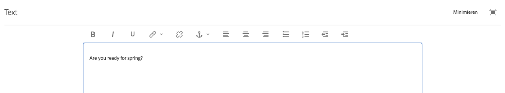
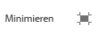

# Verwenden des Rich-Text-Editors zum Erstellen von Inhalten {#use-rich-text-editor-to-author-content}

Der Rich-Text-Editor (RTE) ist ein grundlegendes Mittel für die Eingabe von Textinhalten in AEM. Im Editor können verschiedene Komponenten erstellt werden., einschließlich:

* Text
* Textbild
* Tabelle

## Bearbeiten im Kontext {#in-place-editing}

Bei der Auswahl einer textbasierten Komponente durch einfaches Tippen oder Klicken wird die [Komponenten-Symbolleiste](/help/sites-authoring/editing-content.md#edit-configure-copy-cut-delete-paste) wie bei Komponenten üblich geöffnet.

Wenn Sie nochmals darauf tippen/klicken oder gleich anfangs die Komponente mit einem langsamen Doppeltippen/-klick auswählen, wird die Bearbeitung im Kontext geöffnet, die über eine eigene Symbolleiste verfügt. Hier können Sie den Inhalt bearbeiten und die Formatierung ändern.

Diese Symbolleiste beinhaltet die folgenden Optionen:

* **Format**: Wählen Sie die Optionen „Fett“, „Kursiv“ und „Unterstrichen“ aus.
* **Listen**: Erstellen Sie Stichpunkt- oder Aufzählungslisten oder legen Sie einen Einzug fest.
* **Hyperlink**
* **Verknüpfung aufheben**
* **Vollbild**
* **Schließen**
* **Speichern**

## Bearbeiten im Vollbildmodus  {#full-screen-editing}

Bei textbasierten Komponenten öffnet das Tippen auf den Vollbildmodus in der Symbolleiste  den Rich-Text-Editor und blendet den Rest des Seiteninhalts aus.

Im Vollbildmodus werden alle konfigurierten Optionen angezeigt, die Sie für die Bearbeitung verwenden können. Die Verfügbarkeit der Optionen [hängt von der Konfiguration](/help/sites-administering/rich-text-editor.md) ab.

Zusätzliche Optionen für den Rich-Text-Editor sind:

* **Anker**: Erstellen Sie einen Anker im Text, zu dem Sie später eine Verknüpfung/einen Verweis herstellen können.
* **Text links ausrichten**
* **Text zentrieren**
* **Text rechts ausrichten**

Den Vollbildmodus schließen Sie, indem Sie auf das Symbol zum Minimieren klicken.

>[!NOTE]
>
>Das Kopieren verschachtelter Listen aus Microsoft Word in den RTE kann zu inkonsistenten Ergebnissen führen und erfordert möglicherweise eine manuelle Anpassung, nachdem der Text in den RTE eingefügt wurde.
