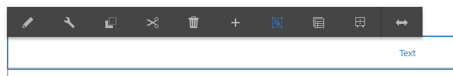

# Verwenden des Rich-Text-Editors zum Erstellen von Inhalten {#use-rich-text-editor-to-author-content}

Der Rich-Text-Editor (RTE) ist ein grundlegendes Mittel für die Eingabe von Textinhalten in AEM. Im Editor können die folgenden Komponenten erstellt werden:

* Text
* Textbild
* Tabelle 

## Bearbeitung im Kontext {#in-place-editing}

Selecting a text-based component with a single tap or click will reveal the [component toolbar](/help/sites-authoring/editing-content.md#editmovecopypastedeletetouchoptimizedui) as with any component.

Wenn Sie nochmals darauf tippen/klicken oder gleich anfangs die Komponente mit einem langsamen Doppeltippen/-klick auswählen, wird die Bearbeitung im Kontext geöffnet, die über eine eigene Symbolleiste verfügt. Hier können Sie den Inhalt bearbeiten und die Formatierung ändern.

Diese Symbolleiste beinhaltet die folgenden Optionen:

* **Format**: Auf diese Weise können Sie Fett, Kursiv und Unterstrichen einstellen.
* **Listen**: Damit können Sie Listen mit Aufzählungszeichen oder Nummerierungen erstellen oder den Einzug einstellen.
* **Hyperlink**
* **Verknüpfung aufheben**
* **Vollbild**
* **Schließen**
* **Speichern**

## Bearbeiten im Vollbildmodus {#full-screen-editing}

For text-based components, tapping the full screen mode from the [toolbar](#componenttoolbar)  opens the rich text editor and hides the rest of the page content.

Im Vollbildmodus werden alle konfigurierten Optionen angezeigt, die Sie zum Authoring verwenden können. Die Verfügbarkeit der Optionen [hängt von der Konfiguration](/help/sites-administering/rich-text-editor.md)ab.

Zusätzliche Optionen für den Rich-Text-Editor sind:

* **Verankerung**: Erstellen Sie einen Anker im Text, zu dem Sie später einen Link/Verweis erstellen können.
* **Text links ausrichten**
* **Text zentrieren**
* **Text rechts ausrichten**

Den Vollbildmodus schließen Sie, indem Sie auf das Symbol zum Minimieren klicken.

>[!NOTE]
>
>Das Kopieren verschachtelter Listen aus Microsoft Word in die RTE kann zu inkonsistenten Ergebnissen führen und erfordert möglicherweise eine manuelle Anpassung, nachdem der Text in die RTE eingefügt wurde.
