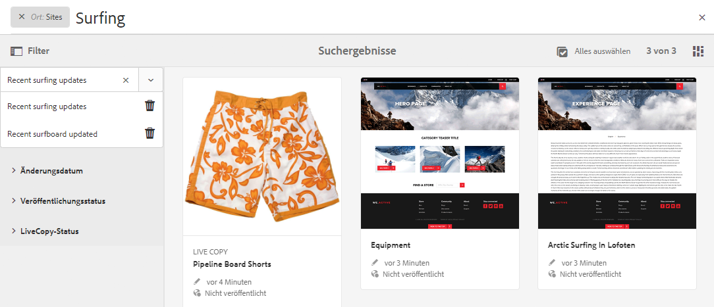

# Suchen{#searching}

Die Autorenumgebung von AEM bietet abhängig vom Ressourcentyp verschiedene Möglichkeiten zur Inhaltssuche.

>[!NOTE]
>
>Außerhalb der Authoring-Umgebung stehen auch andere Verfahren zur Suche zur Verfügung, wie der [Query Builder](/help/sites-developing/querybuilder-api.md) und [CRXDE Lite](/help/sites-developing/developing-with-crxde-lite.md).

## Grundlagen zur Suche {#search-basics}

Die Suchfunktion ist über die obere Symbolleiste verfügbar:

Die Suchleiste bietet Ihnen folgende Möglichkeiten:

* Suchen Sie nach einem bestimmten Keyword, Pfad oder Tag.
* Filtern Sie nach ressourcenspezifischen Kriterien, wie Änderungsdatumsangaben, Seitenstatus und Dateigröße.
* Definieren und Verwenden eines [gespeicherte Suche](#saved-searches) - auf der Grundlage der oben genannten Kriterien.

>[!NOTE]
>
>Sie können die Suche auch aufrufen, indem Sie den Hotkey `/` (Schrägstrich) verwenden, wenn die Suchleiste sichtbar ist.

## Suchen und Filtern {#search-and-filter}

So durchsuchen und filtern Sie Ressourcen:

1. Öffnen Sie die Option **Suchen** (mit der Lupe in der Symbolleiste) und geben Sie den Suchbegriff ein. Es werden Empfehlungen angezeigt, die Sie dann auswählen können:

   

   Standardmäßig sind die Suchergebnisse auf Ihre aktuelle Position beschränkt (d. h. Konsole und Ressourcentyp):

   

1. Bei Bedarf können Sie den Positionsfilter entfernen (wählen Sie für den zu entfernenden Filter das **X** aus), um alle Konsolen-/Ressourcentypen zu durchsuchen.
1. Die Ergebnisse werden gemäß der Konsole und dem zugehörigen Ressourcentyp gruppiert angezeigt.

   Sie können entweder eine spezifische Ressource (für eine spätere Aktion) oder eine Drilldown-Suche auswählen, indem Sie den erforderlichen Ressourcentyp auswählen, z. B. **Alle Sites anzeigen**:

   

1. Wenn Sie einen Drilldown durchführen möchten, wählen Sie das Symbol für die Seitenleiste (oben links) aus, um den Seitenbereich **Filter und Optionen** zu öffnen.

   

   Je nach Ressourcentyp zeigt die Suche eine vordefinierte Auswahl von Such-/Filterkriterien.

   Im seitlichen Bedienfeld können Sie Folgendes auswählen:

   * Gespeicherte Suchvorgänge
   * Verzeichnis durchsuchen
   * Tags
   * Suchkriterien, z. B. Änderungsdatum, Veröffentlichungsstatus, Live Copy-Status.

   >[!NOTE]
   >
   >Die Suchkriterien können variieren:
   >
   >
   >
   >    * in Abhängigkeit von dem von Ihnen ausgewählten Ressourcentyp, wobei z. B. die Kriterien „Assets“ und „Communitys“ verständlicherweise spezialisiert sind.
   >    * je nach Instanz, da die [Suchformulare](/help/sites-administering/search-forms.md) (entsprechend der Stelle innerhalb von AEM) angepasst werden können
   >
   >

   

1. Sie können auch zusätzliche Suchbegriffe hinzufügen:

   

1. Schließen Sie die **Suche** mit dem **X** (oben rechts).

>[!NOTE]
>
>Suchkriterien werden beibehalten, wenn ein Element in den Suchergebnissen ausgewählt wird.
>
>Bei Auswahl eines Elements auf der Seite mit den Suchergebnissen bleiben die Suchkriterien erhalten, wenn Sie über die Zurück-Schaltfläche des Browsers zur Suchseite zurückkehren.

## Gespeicherte Suchvorgänge {#saved-searches}

Sie können nicht nur nach zahlreichen Facetten suchen, sondern auch eine bestimmte Suchkonfiguration speichern, um diese später abzurufen und zu verwenden:

1. Definieren Sie die Suchkriterien und wählen Sie **Speichern**.

   

1. Weisen Sie einen Namen zu und wählen Sie zur Bestätigung **Speichern** aus:

   

1. Die gespeicherte Suche ist außerdem in der Auswahl verfügbar, wenn Sie das nächste Mal auf den Suchbereich zugreifen:

   

1. Nach dem Speichern können Sie:

   * **x** (für den Namen der gespeicherten Suche) verwenden, um eine neue Abfrage zu starten. Die gespeicherte Suche selbst wird nicht gelöscht.
   * die Option **Gespeicherte Suche bearbeiten** verwenden, die Suchbedingungen ändern und dann erneut auf **Speichern** klicken.

Gespeicherte Suchen können geändert werden, indem Sie die gespeicherte Suche auswählen und unten im Suchfeld auf **Gespeicherte Suche bearbeiten** klicken.

