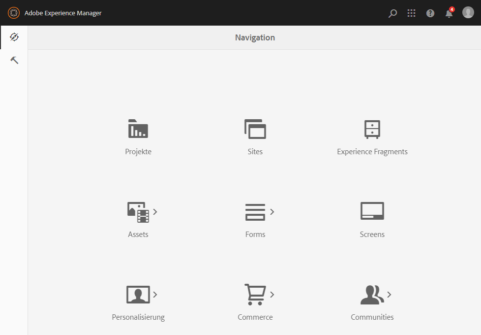
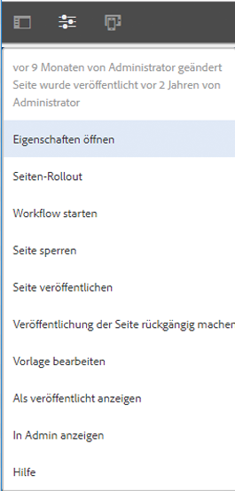

# Auswahl der Benutzeroberfläche{#selecting-your-ui}

Obwohl die Touch-optimierte Benutzeroberfläche inzwischen die Standard-Benutzeroberfläche ist und beim Verwalten und Bearbeiten von Websites fast Funktionsparität erreicht wurde, können Situationen eintreten, in denen Benutzer zur [klassischen Benutzeroberfläche](/help/sites-classic-ui-authoring/classicui.md) wechseln möchten. Dazu stehen mehrere Optionen zur Verfügung.

>[!NOTE]
>
>Weitere Informationen zum Status der Funktionen in der klassischen Benutzeroberfläche finden Sie im Dokument [Funktionsparität bei der Touch-optimierten Benutzeroberfläche](/help/release-notes/touch-ui-features-status.md).

Sie können an verschiedenen Stellen definieren, welche Benutzeroberfläche verwendet werden soll:

* [Konfigurieren der Standard-Benutzeroberfläche für Ihre Instanz](#configuring-the-default-ui-for-your-instance)
Damit wird die Standard-Benutzeroberfläche festgelegt, die bei der Benutzeranmeldung angezeigt wird. Der Benutzer kann dies aber außer Kraft setzen und eine andere Benutzeroberfläche für sein Konto oder die aktuelle Sitzung auswählen.

* [Festlegen der klassischen Autorenbenutzeroberfläche für Ihr Konto](/help/sites-authoring/select-ui.md#setting-classic-ui-authoring-for-your-account) Damit wird die Benutzeroberfläche festgelegt, die bei der Seitenbearbeitung als Standard verwendet wird. Der Benutzer kann diese Einstellung außer Kraft setzen und eine andere Benutzeroberfläche für sein Konto oder die aktuelle Sitzung auswählen.

* [Wechseln zur klassischen Benutzeroberfläche für die aktuelle Sitzung](#switching-to-classic-ui-for-the-current-session)
Damit wird für die aktuelle Sitzung zur klassischen Benutzeroberfläche gewechselt.

* Bei der [Seitenbearbeitung überschreibt das System einige Einstellungen bezüglicher der Benutzeroberfläche](#ui-overrides-for-the-editor).

>[!CAUTION]
>
>Verschiedene Optionen für den Wechsel zur klassischen Benutzeroberfläche sind nicht vorkonfiguriert. Sie müssen speziell für Ihre Instanz konfiguriert werden.
>
>Weitere Informationen finden Sie unter [Aktivieren des Zugriffs auf die klassische Benutzeroberfläche](/help/sites-administering/enable-classic-ui.md) .

>[!NOTE]
>
>Instanzen, bei denen ein Upgrade von einer früheren Version durchgeführt wurde, behalten die klassische Benutzeroberfläche für die Seitenbearbeitung bei.
>
>Nach der Aktualisierung wird die Seitenbearbeitung nicht automatisch auf die Touch-optimierte Benutzeroberfläche umgestellt. Sie können dies jedoch mit der [OSGi-Konfiguration](/help/sites-deploying/configuring-osgi.md) des **WCM Authoring UI Mode Service** ( `AuthoringUIMode`-Dienst) konfigurieren. Weitere Informationen dazu finden Sie unter [Benutzeroberflächenüberschreibung für den Editor](#ui-overrides-for-the-editor).

## Configuring the Default UI for Your Instance {#configuring-the-default-ui-for-your-instance}

Ein Systemadministrator kann die bei Start und Anmeldung angezeigte Benutzeroberfläche mit der [Root-Zuordnung](/help/sites-deploying/osgi-configuration-settings.md#daycqrootmapping) konfigurieren.

Diese Einstellungen kann durch Benutzerstandards oder Sitzungseinstellungen überschrieben werden.

## Festlegen der klassischen Autorenbenutzeroberfläche für Ihr Konto  {#setting-classic-ui-authoring-for-your-account}

Jeder Benutzer kann über seine [Benutzereinstellungen](/help/sites-authoring/user-properties.md#userpreferences) definieren, ob die klassische Benutzeroberfläche (statt der Standard-Benutzeroberfläche) zur Seitenbearbeitung verwendet werden soll.

Diese Einstellung kann durch Sitzungseinstellungen überschrieben werden.

## Wechseln zur klassischen Benutzeroberfläche für die aktuelle Sitzung  {#switching-to-classic-ui-for-the-current-session}

Bei Verwendung der Touch-optimierten Benutzeroberfläche möchten Benutzer vielleicht zur klassischen Benutzeroberfläche (nur für Desktops) zurückzukehren. Es gibt mehrere Methoden, in der aktuellen Sitzung zur klassischen Benutzeroberfläche zu wechseln:

* **Navigationslinks**

   >[!CAUTION]
   >
   >Die Option für den Wechsel zur klassischen Benutzeroberfläche ist nicht vorkonfiguriert. Sie muss speziell für Ihre Instanz konfiguriert werden.
   >
   >
   >Weitere Informationen finden Sie unter [Aktivieren des Zugriffs auf die klassische Benutzeroberfläche](/help/sites-administering/enable-classic-ui.md) .

   Wenn diese Funktion aktiviert ist, erscheint immer, wenn Sie die Maus über eine entsprechende Konsole bewegen, ein Symbol (eines Bildschirms). Wenn Sie darauf tippen/klicken, öffnet sich der entsprechende Bereich in der klassischen Benutzeroberfläche.

   Zum Beispiel die Verknüpfungen von **Sites** zu **siteadmin**: 

   

* **URL**

   Der Zugriff auf die klassische Benutzeroberfläche erfolgt über die URL für den Begrüßungsbildschirm unter `welcome.html`. Beispiel:

   `https://localhost:4502/welcome.html`

   >[!NOTE]
   >
   >Die Touch-optimierte Benutzeroberfläche kann über `sites.html` aufgerufen werden. Beispiel:
   >
   >
   >`https://localhost:4502/sites.html`

### Wechseln zur klassischen Benutzeroberfläche bei der Bearbeitung einer Seite {#switching-to-classic-ui-when-editing-a-page}

>[!CAUTION]
>
>Die Option für den Wechsel zur klassischen Benutzeroberfläche ist nicht vorkonfiguriert. Sie muss speziell für Ihre Instanz konfiguriert werden.
>
>Weitere Informationen finden Sie unter [Aktivieren des Zugriffs auf die klassische Benutzeroberfläche](/help/sites-administering/enable-classic-ui.md) .

Sofern aktiviert, ist die Option **Klassische Benutzeroberfläche öffnen** im Dialogfeld **Seiteninformationen** verfügbar: 

### UI Overrides for the Editor {#ui-overrides-for-the-editor}

Die von einem Benutzer oder Systemadministrator festgelegten Einstellungen können bei der Seitenbearbeitung vom System überschreiben werden.

* Beim Bearbeiten von Seiten:

   * Die Verwendung des klassischen Editors wird erzwungen, wenn auf die Seite über `cf#` in der URL zugegriffen wird. Beispiel:
      `https://localhost:4502/cf#/content/geometrixx/en/products/triangle.html`

   * Die Verwendung des Touch-optimierten Editors wird erzwungen, wenn `/editor.html` in der URL verwendet oder ein Touch-Gerät verwendet wird. Beispiel:
      `https://localhost:4502/editor.html/content/geometrixx/en/products/triangle.html`

* Jede erzwungene Einstellung ist temporär und nur für die aktuelle Browsersitzung gültig.

   * Ein festgelegtes Cookie hängt davon ab, ob Touch-optimierte ( `editor.html`) oder klassische ( `cf#`) Cookies verwendet werden.

* Beim Öffnen von Seiten über `siteadmin` wird nach Folgendem gesucht:

   * dem Cookie
   * einer Benutzervoreinstellung
   * Wenn keines von beiden vorhanden ist, werden standardmäßig die in der [OSGi-Konfiguration](/help/sites-deploying/configuring-osgi.md) des **WCM Authoring UI Mode Service** (`AuthoringUIMode`-Service) festgelegten Definitionen verwendet.

>[!NOTE]
>
>Wenn [ein Benutzer bereits eine Voreinstellung für die Seitenbearbeitung festgelegt hat](#settingthedefaultauthoringuiforyouraccount), wird diese nicht durch Änderung der OSGi-Eigenschaft außer Kraft gesetzt.

>[!CAUTION]
>
>Aufgrund der bereits erläuterten Verwendung von Cookies wird von folgenden Aktionen abgeraten:
>
>* Manuelles Bearbeiten der URL. Eine Nicht-Standard-URL könnte zu einer unbekannten Situation und zu Funktionsausfall führen.
>* Verwendung beider Editoren zur selben Zeit, z. B. in separaten Fenstern

