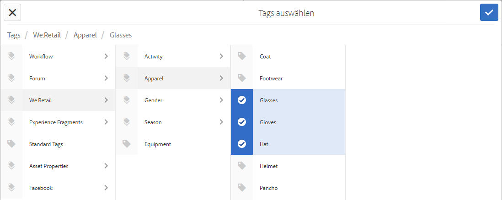

# Verwenden von Tags {#using-tags}

Tags bieten eine schnelle und einfache Methode zur Klassifizierung von Inhalten innerhalb einer Website. Tags können als Keywords oder Beschriftungen betrachtet werden, die an eine Seite, ein Asset oder andere Inhalte angehängt werden können, um Suchen zu ermöglichen, mit denen diese und zugehörige Inhalte gefunden werden können.

* Siehe [Verwalten von Tags](/help/sites-administering/tags.md) für Informationen zum Erstellen und Verwalten von Tags und darüber, auf welche Inhalts-Tags angewendet wurden.
* Unter [Tagging für Entwicklerpersonen](/help/sites-developing/tags.md) finden Sie Informationen über das Tagging-Framework sowie die Einbeziehung und Erweiterung von Tags in benutzerdefinierten Applikationen.

## Zehn Gründe für das Verwenden von Tags {#ten-reasons-to-use-tagging}

1. **Organisieren von Inhalten**: Tagging macht das Leben für Autoren leichter, da sie Inhalte mit wenig Aufwand schnell organisieren können.
1. **Organisieren von Tags**: Während Tags Inhalte organisieren, organisieren hierarchische Taxonomien/Namespaces Tags.
1. **Tief organisierte Tags**: Durch die Fähigkeit zum Erstellen von Tags und Unter-Tags können ganze Taxonomiesysteme aufgestellt werden, die Begriffe, Unterbegriffe und deren Beziehungen darstellen. Dies ermöglicht die Erstellung einer zweiten (oder dritten) Inhaltshierarchie parallel zur offiziellen Inhaltshierarchie.
1. **Kontrolliertes Tagging**: Tagging kann durch Anwenden von Berechtigungen auf Tags und/oder Namespaces zum Steuern der Tag-Erstellung und -Anwendung kontrolliert werden.
1. **Flexibles Tagging**: Tags können viele Namen und Formen annehmen: Tags, Taxonomiebegriffe, Kategorien, Beschriftungen und vieles mehr. Ihr Inhaltsmodell und ihre Verwendung sind flexibel und können an die jeweiligen Bedürfnisse angepasst werden, z. B. bei der Zielgruppendefinition, der Kategorisierung und Bewertung von Inhalten oder bei der Erstellung sekundärer Inhaltshierarchien.
1. **Verbessertes Suchen**: Die Standardsuchkomponente in AEM enthält erstellte Tags und angewendete Tags, auf die Filter angewendet werden können, um die Ergebnisse auf die relevanten einzugrenzen.
1. **SEO-Aktivierung**: Als Seiteneigenschaften angewendete Tags werden automatisch in den Meta-Tags einer Seite angezeigt, damit sie für Suchmaschinen sichtbar sind.
1. **Einfach und intelligent**: Tags können aus einem Wort und durch Berühren einer Schaltfläche ganz einfach erstellt werden. Danach können ein Titel, eine Beschreibung und eine unbegrenzte Anzahl von Beschriftungen hinzugefügt werden, um mehr semantische Informationen für das Tag bereitzustellen.
1. **Kern-Konsistenz**: Das Tagging-System gehört zu den Kernbestandteilen von AEM und wird von allen AEM-Fähigkeiten für die Kategorisierung von Inhalten verwendet. Darüber hinaus ist die Tagging-API für Entwickler zum Erstellen Tagging-fähiger Anwendungen mit Zugriff auf dieselben Taxonomien verfügbar.
1. **Kombiniert Struktur und Flexibilität**: AEM ist für das Arbeiten mit strukturierten Informationen aufgrund der Verschachtelung von Seiten und Pfaden ideal. Aufgrund der integrierten Volltextsuche ist es bei der Arbeit mit unstrukturierten Informationen gleichermaßen leistungsfähig. Tagging kombiniert die Stärken von Struktur und Flexibilität.

Berücksichtigen Sie beim Entwerfen der Inhaltsstruktur für eine Site und des Metadatenschemas für Assets den einfachen und barrierefreien Ansatz, den Tagging bietet.

## Anwenden von Tags {#applying-tags}

In der Autorenumgebung wenden Autoren möglicherweise Tags an, indem sie auf die Seiteneigenschaften zugreifen und ein oder mehrere Tags im Feld **Tags/Keywords** eingeben.

Um [vordefinierte Tags](/help/sites-administering/tags.md) anzuwenden, verwenden Sie im Fenster **Seiteneigenschaften** das Feld **Tags** und das Fenster **Tags auswählen**. Die Registerkarte **Standard-Tags** ist der Standard-Namespace, was bedeutet, dass es kein Präfix `namespace-string:` im Klassifikationsschema gibt.

### Veröffentlichen von Tags {#publishing-tags}

Wie bei Seiten können Sie Folgendes für Tags und Namespaces durchführen:

**Aktivieren**

* Einzelne Tags können aktiviert werden.

  Genau wie bei Seiten müssen neu erstellte Tags aktiviert werden, bevor sie in der Veröffentlichungsumgebung verfügbar sind.

>[!NOTE]
>
>Wenn Sie eine Seite aktivieren, wird automatisch ein Dialogfeld geöffnet, in dem Sie nicht aktivierte Tags, die zu der Seite gehören, aktivieren können.

**Deaktivieren**

* Deaktivieren Sie die ausgewählten Tags.
