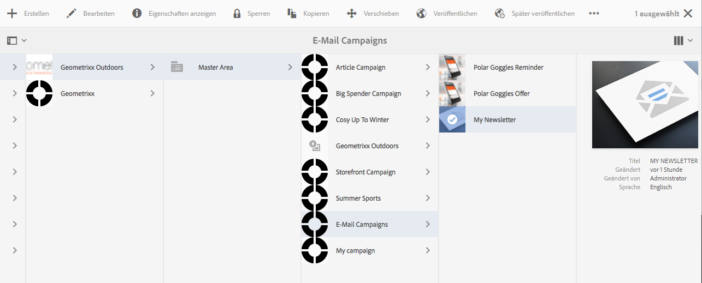
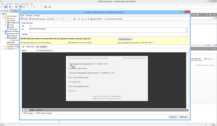

# Targeting von Adobe Campaign{#targeting-your-adobe-campaign}

Um eine Zielgruppe für Ihren Adobe Campaign-Newsletter anzugeben, müssen Sie zuerst die Segmentierung einrichten, die nur in der klassischen Benutzeroberfläche (für Client Context) verfügbar ist. Anschließend können Sie Targeting-Erlebnisse für Adobe Campaign erstellen. Beide Schritte werden in diesem Abschnitt beschrieben.

## Einrichten der Segmentierung in AEM  {#setting-up-segmentation-in-aem}

Möchten Sie die Segmentierung einrichten, müssen Sie mithilfe der klassischen Benutzeroberfläche Segmente erstellen. Die übrigen Schritte können in der Standard-Benutzeroberfläche durchgeführt werden.

Im Rahmen der Einrichtung der Segmentierung werden Segmente erstellt sowie eine Marke, Kampagne und Erlebnisse eingerichtet.

>[!NOTE]
>
>Die Segment-ID muss einer ID in Adobe Campaign zugewiesen werden.

### Erstellen von Segmenten {#creating-segments}

So erstellen Sie Segmente:

1. Öffnen Sie die [Segmentierungskonsole](http://localhost:4502/miscadmin#/etc/segmentation) unter **&lt;host>:&lt;port>/miscadmin#/etc/segmentation**.
1. Erstellen Sie eine neue Seite, geben Sie einen Titel ein (z. B. **AC-Segmente**) und wählen Sie die Vorlage **Segment (Adobe Campaign)** aus.
1. Wählen Sie in der Baumansicht links die erstellte Seite aus.
1. Erstellen Sie ein Segment, mit dem beispielsweise männliche Benutzer angesprochen werden, indem Sie im soeben erstellten Segment eine Seite mit dem Titel „Männlich“ erstellen und die Vorlage **Segment (Adobe Campaign)** auswählen.
1. Öffnen Sie die erstellte Seite und ziehen Sie eine **Segment-ID** aus dem Sidekick auf die Seite.
1. Doppelklicken Sie auf die Eigenschaft, geben Sie die ID ein, die in diesem Fall das in Adobe Campaign definierte männliche Segment darstellt - z. B. **MALE** - und klicken Sie auf **OK**. Die folgende Meldung sollte angezeigt werden: *`targetData.segmentCode == "MALE"`*
1. Wiederholen Sie diese Schritte für ein weiteres Segment, beispielsweise eines, mit dem weibliche Benutzer angesprochen werden.

### Erstellen neuer Marken  {#creating-a-brand}

So erstellen Sie eine Marke:

1. Navigieren Sie unter **Sites** zum Ordner **Kampagnen** (beispielsweise We.Retail).
1. Klicken Sie auf **Seite erstellen**, geben Sie einen Titel für die Seite an (beispielsweise We.Retail-Marke) und wählen Sie die Vorlage **Marke** aus.

### Erstellen einer Kampagne {#creating-a-campaign}

So erstellen Sie eine Kampagne:

1. Öffnen Sie die Seite **Marke**, die Sie soeben erstellt haben.
1. Klicken Sie auf **Seite erstellen**, geben Sie einen Titel für Ihre Seite an (beispielsweise We.Retail-Kampagne), wählen Sie die Vorlage **Kampagne** aus und klicken Sie auf **Erstellen**.

### Erstellen von Erlebnissen {#creating-experiences}

So erstellen Sie Erlebnisse für Segmente:

1. Öffnen Sie die Seite **Kampagne**, die Sie soeben erstellt haben.
1. Erstellen Sie Erlebnisse für Ihre Segmente, indem Sie auf **Seite** erstellen und einen Titel für Ihre Seite eingeben, z. B. &quot;Männlich&quot;, wenn Sie ein Erlebnis für das männliche Segment erstellen, und wählen Sie die Vorlage **Erlebnis** aus.
1. Öffnen Sie die erstellte Erlebnisseite.
1. Klicken Sie auf **Bearbeiten** und unterhalb der Segmente auf **Element hinzufügen**.
1. Geben Sie den Pfad zum männlichen Segment ein, z. B. **/etc/segmentation/ac-segments/male** und klicken Sie auf **OK**. Die folgende Meldung sollte angezeigt werden: *Erlebnis richtet sich an: Männlich*
1. Wiederholen Sie die vorherigen Schritte, um ein Erlebnis für alle Segmente, beispielsweise ein weibliches, zu erstellen.

## Erstellen eines Newsletters mit zielgerichteten Inhalten  {#creating-a-newsletter-with-targeted-content}

Nach der Erstellung von Segmenten, Marke, Kampagne und Erlebnissen können Sie einen Newsletter mit zielgerichtetem Inhalt erstellen. Nach Erstellung des Erlebnisses wird dieses mit Ihren Segmenten verknüpft.

>[!NOTE]
>
>[E-Mail-Muster stehen nur in Geometrixx zur Verfügung](/help/sites-developing/we-retail.md). Laden Sie Geometrixx-Beispielinhalt von Package Share herunter.

So erstellen Sie einen Newsletter mit zielgerichtetem Inhalt:

1. Erstellen Sie einen Newsletter mit zielgerichteten Inhalten: Klicken oder tippen Sie unter &quot;E-Mail-Kampagnen in Geometrixx Outdoors&quot;auf **Erstellen** > **Seite** und wählen Sie eine der Adobe Campaign-E-Mail-Vorlagen aus.

   

1. Fügen Sie dem Newsletter eine Text- und Personalisierungs-Komponente hinzu.
1. Fügen Sie der Text- und Personalisierungs-Komponente Text hinzu, beispielsweise: „Dies ist der Standardtext.“
1. Klicken Sie auf den Pfeil neben **Bearbeiten** und wählen Sie **Targeting** aus.
1. Wählen Sie die entsprechende Marke aus dem Dropdown-Menü aus und klicken Sie auf Ihre Kampagne. (Hierbei handelt es sich um die Marke und Kampagne, die Sie zuvor erstellt haben).
1. Klicken Sie auf **Targeting starten**. Die Segmente werden nun im Zielgruppebereich angezeigt. Sollte ein Besucher nicht in eines der festgelegten Segmente passen, wird er zum Standarderlebnis weitergeleitet.

   >[!NOTE]
   >
   >Standardmäßig verwenden die in AEM enthaltenen E-Mail-Muster Adobe Campaign als Targeting-Engine. Bei benutzerdefinierten Newslettern müssen Sie möglicherweise Adobe Campaign als Targeting-Engine auswählen. Tippen oder klicken Sie während des Targetings in der Symbolleiste auf +, geben Sie einen Namen für die neue Aktivität ein und wählen Sie **Adobe Campaign** als Targeting-Engine aus.

1. Klicken Sie auf **Standard** und wählen Sie die Text- und Personalisierungs-Komponente aus, die Sie hinzugefügt haben. Es erscheint eine Zielscheibe mit darin steckendem Pfeil. Klicken Sie auf das Symbol, um das Targeting dieser Komponente zu starten.

   

1. Navigieren Sie zu einem anderen Segment („Männlich“), klicken Sie auf **Angebot hinzufügen** und klicken Sie auf das Pluszeichen (+). Bearbeiten Sie anschließend das Angebot.
1. Navigieren Sie zu einem anderen Segment („Weiblich“), klicken Sie auf **Angebot hinzufügen** und klicken Sie auf das Pluszeichen (+). Bearbeiten Sie anschließend dieses Angebot.
1. Klicken Sie auf **Weiter**, um die Zuordnung anzuzeigen, und klicken Sie dann auf **Weiter**, um die Einstellungen anzuzeigen, die nicht für Adobe Campaign gelten, und klicken Sie auf **Speichern**.

   AEM generiert automatisch den richtigen Targeting-Code für Adobe Campaign, wenn der Inhalt in Adobe Campaign für eine Bereitstellung genutzt wird.

1. Erstellen Sie in Adobe Campaign eine Bereitstellung: Klicken Sie auf **E-Mail-Bereitstellung mit AEM-Inhalten**, wählen Sie das passende lokale AEM-Konto aus und bestätigen Sie die Änderungen.

   In der HTML-Ansicht befinden sich die verschiedenen Erlebnisse der Targeting-Komponenten, die über Adobe Campaign-Targeting-Code verfügen.

   

   >[!NOTE]
   >
   >Sollten Sie die Segmente auch in Adobe Campaign eingerichtet haben, werden Ihnen beim Klick auf **Vorschau** die Erlebnisse der unterschiedlichen Segmente angezeigt.
