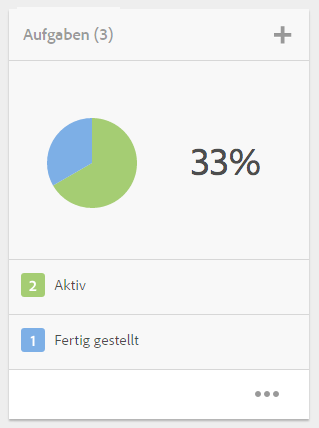
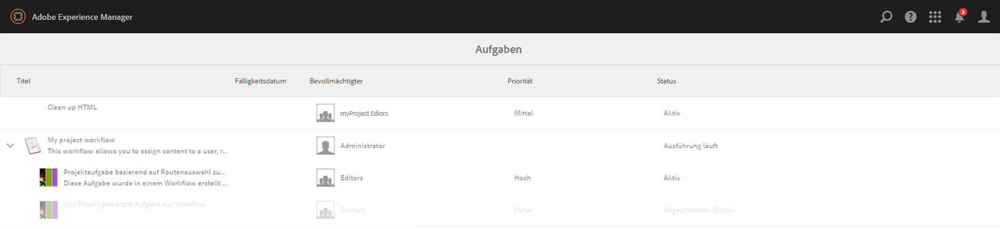
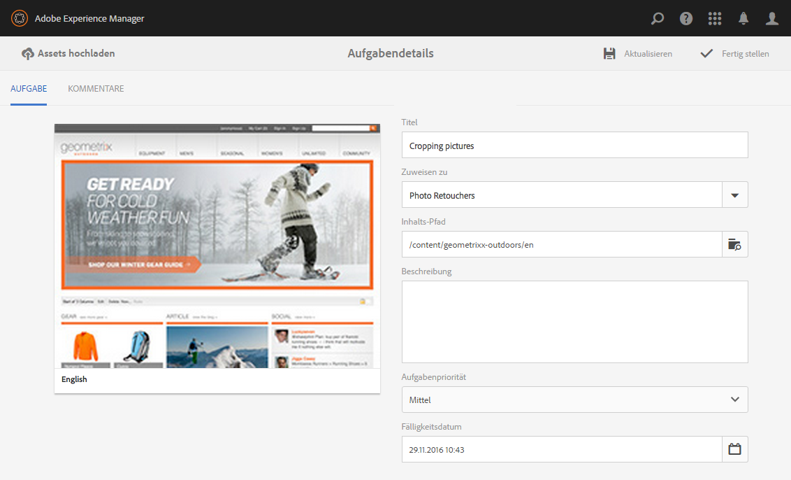
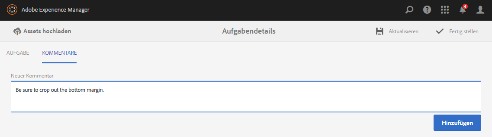
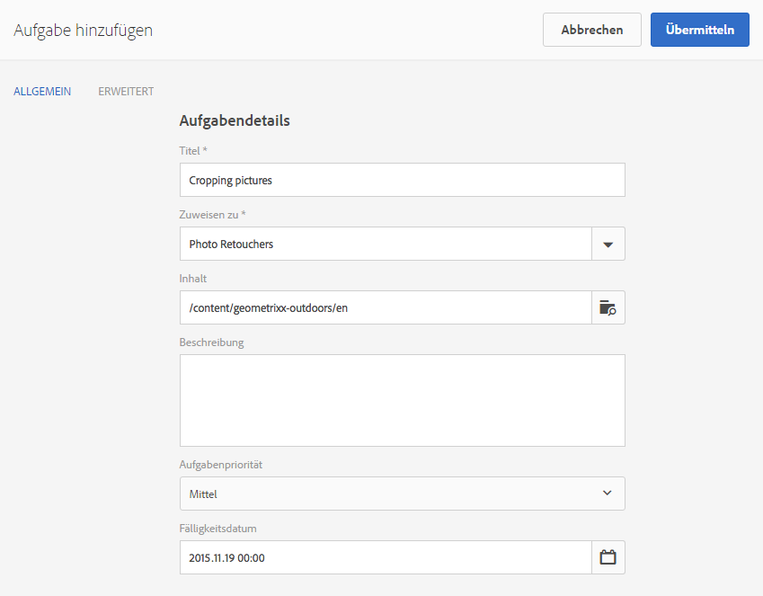
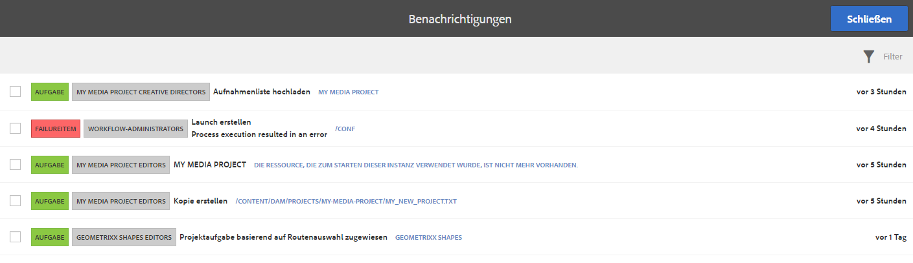

# Arbeiten mit Aufgaben{#working-with-tasks}

Bei Aufgaben handelt es sich um Arbeitsschritte, die auf Inhalt ausgeführt werden. Wenn Ihnen eine Aufgabe zugewiesen wird, wird diese in Ihrem Workflow-Posteingang angezeigt. Aufgabenelemente verfügen in der Spalte „Typ“ über einen Aufgabenwert.

Aufgaben werden auch in Projekten verwendet, um den Grad der Vollständigkeit der aktuellen Aufgaben, einschließlich Workflow-Aufgaben zu bestimmen.

## Verfolgen des Projektfortschritts    {#tracking-project-progress}

Sie können den Projektfortschritt verfolgen, indem Sie die aktiven/abgeschlossenen Aufgaben in einem Projekt betrachten, die auf der Kachel **Aufgaben** dargestellt werden. Der Projektfortschritt kann bestimmt werden durch:

* **Aufgabenkachel:** Ein Gesamtfortschritt des Projekts wird in der Aufgabenkachel dargestellt, die auf der Seite „Projektdetails“ verfügbar ist.

* **Aufgabenliste:** Beim Klicken auf die Aufgabenkachel wird eine Liste von Aufgaben angezeigt. Diese Liste enthält detaillierte Informationen zu allen Aufgaben in Zusammenhang mit dem Projekt.

Beide enthalten sowohl Workflow-Aufgaben als auch Aufgaben, die Sie direkt in der **Aufgabenkachel** erstellen.

### Aufgabenkachel    {#task-tile}

Wenn ein Projekt zugehörige Aufgaben hat, wird eine Aufgabenkachel innerhalb des Projekts angezeigt. Die Aufgabenkachel zeigt den aktuellen Status des Projekts an. Die Anzeige basiert auf den vorhandenen Aufgaben innerhalb des Workflows und beinhaltet keine Aufgaben, die in der Zukunft erzeugt werden, während der Workflow fortgesetzt wird. Die folgenden Informationen sind in der Aufgabenkachel sichtbar:

* Prozentsatz der abgeschlossenen Aufgaben
* Prozentsatz der aktiven Aufgaben
* Prozentsatz der überfälligen Aufgaben

### Anzeigen oder Ändern von Aufgaben in einem Projekt {#viewing-or-modifying-the-tasks-in-a-project}

Zusätzlich zur Verfolgung des Fortschritts möchten Sie vielleicht auch Informationen über das Projekt anzeigen oder es ändern.

#### Aufgabenliste    {#task-list}

Klicken Sie auf das Auslassungszeichen (...) in der Aufgabenkachel, um die Liste der Aufgaben anzuzeigen, die mit dem Projekt verbunden sind. Die Aufgaben werden in übergeordnete Workflows aufgeteilt. Die Aufgabendetails werden zusammen mit Metadaten wie Fälligkeitsdatum, Verantwortlicher, Priorität und Status angezeigt.

#### Aufgabendetails {#task-details}

Tippen/klicken Sie für weitere Informationen über eine bestimmte Aufgabe in der Aufgabenliste auf die Aufgabe und öffnen Sie **Aufgabendetails**.

### Anzeigen und Ändern von Aufgabenkommentaren {#viewing-and-modifying-task-comments}

In den Aufgabendetails können Sie Kommentare bearbeiten oder hinzufügen. Außerdem sind alle Kommentare in einem Projekt im Kommentarbereich sichtbar.

### Hinzufügen von Aufgaben {#adding-tasks}

Sie können neue Aufgaben zu Projekten hinzufügen. Diese Aufgaben werden in der Aufgabenkachel angezeigt und sind im Posteingang für Benachrichtigungen für die Durchführung von Aufgaben verfügbar.

So fügen Sie eine Aufgabe hinzu:

1. Tippen/Klicken Sie im Projekt in der Kachel **Aufgaben** auf das Plussymbol (+). Das Fenster **Aufgabe hinzufügen** wird geöffnet.
1. Geben Sie Informationen über die Aufgabe ein. Der Titel der Aufgabe und die Gruppe, der sie zugewiesen ist, sind obligatorisch. Weitere Informationen wie der Inhaltspfad, Beschreibung, Aufgabenpriorität und Fälligkeitsdatum sind optional. Darüber hinaus können Sie die Registerkarte **Erweitert** auswählen, um den Namen der Aufgabe einzugeben, der zum Benennen der URL verwendet wird.

   

1. Tippen oder klicken Sie auf **Erstellen**.

## Arbeiten mit Aufgaben im Posteingang    {#working-with-tasks-in-the-inbox}

Eine andere Möglichkeit, auf Aufgaben zuzugreifen, bietet der Posteingang. Sie können den Inhalt aus dem Posteingang öffnen, um die erforderlichen Änderungen vorzunehmen. Wenn Sie fertig sind, ändern Sie den Aufgabenstatus in „Fertig gestellt“. Aufgaben werden auch in Ihrem Posteingang angezeigt, wenn sie einer Benutzergruppe zugewiesen werden, der Sie angehören. In diesem Fall kann jedes Mitglied der Gruppe die erforderliche Bearbeitung durchführen und die Aufgabe fertigstellen.

Um eine Aufgabe abzuschließen, wählen Sie die Aufgabe aus und klicken Sie auf **Abschließen**. Fügen Sie Informationen zur Aufgabe hinzu und klicken Sie dann auf **Fertig**. In [Ihrem Posteingang](/help/sites-authoring/inbox.md) finden Sie weitere Informationen.

