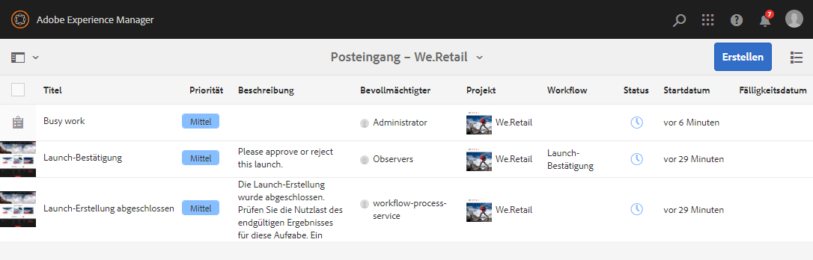
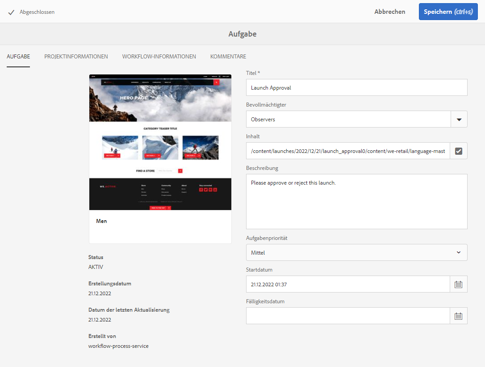
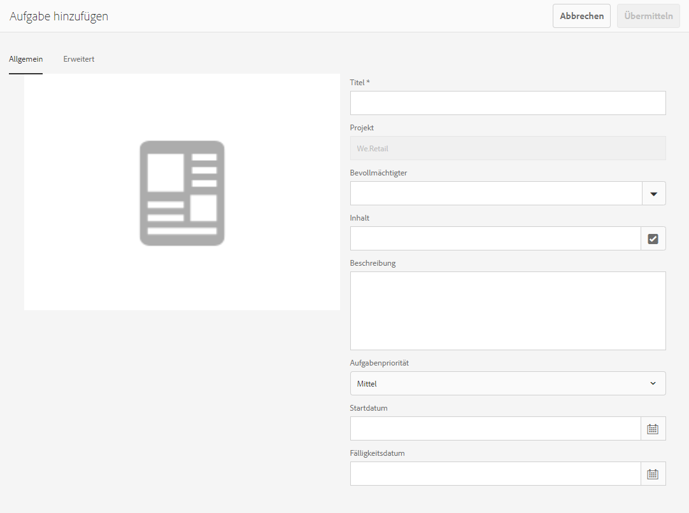
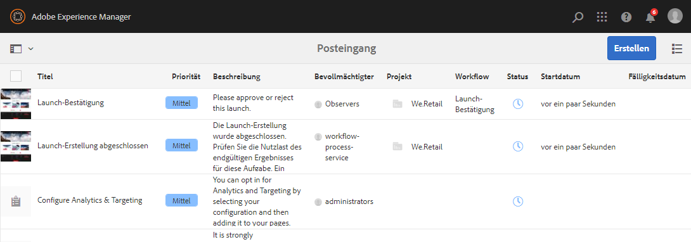

# Arbeiten mit Aufgaben {#working-with-tasks}

Aufgaben stellen Aufgaben dar, die inhaltlich zu erledigen sind. Wenn Ihnen eine Aufgabe zugewiesen wird, wird diese in Ihrem Workflow-Posteingang angezeigt. Aufgabenelemente können von Workflow-Elementen durch den Wert der **Typ** Spalte.

Aufgaben werden auch in Projekten verwendet, um den Grad der Vollständigkeit des Projekts zu bestimmen.

## Verfolgen des Projektfortschritts {#tracking-project-progress}

Sie können den Projektfortschritt verfolgen, indem Sie die aktiven/abgeschlossenen Aufgaben in einem Projekt betrachten, die auf der Kachel **Aufgaben** dargestellt werden. Der Projektfortschritt kann bestimmt werden durch:

* **Aufgabenkachel:** Der Gesamtfortschritt des Projekts wird in der Aufgabenkachel dargestellt, die auf der Seite mit den Projektdetails verfügbar ist.

* **Aufgabenliste:** Beim Klicken auf die Aufgabenkachel wird eine Liste der Aufgaben angezeigt. Diese Liste enthält detaillierte Informationen zu allen Aufgaben in Zusammenhang mit dem Projekt.

Beide Optionen listen Workflow-Aufgaben sowie Aufgaben auf, die Sie direkt in der Aufgabenkachel erstellen.

### Aufgabenkachel {#task-tile}

Wenn ein Projekt verwandte Aufgaben hat, wird innerhalb des Projekts eine Aufgabenkachel angezeigt. Die Aufgabenkachel zeigt den aktuellen Status des Projekts an. Die Anzeige basiert auf den vorhandenen Aufgaben innerhalb des Workflows und beinhaltet keine Aufgaben, die in der Zukunft erzeugt werden, während der Workflow fortgesetzt wird. Die folgenden Informationen sind in der Aufgabenkachel sichtbar:

* Prozentsatz der abgeschlossenen Aufgaben
* Prozentsatz der aktiven Aufgaben
* Prozentsatz der überfälligen Aufgaben

### Anzeigen oder Ändern von Aufgaben in einem Projekt {#viewing-or-modifying-the-tasks-in-a-project}

Zusätzlich zur Verfolgung des Fortschritts möchten Sie vielleicht auch Informationen über das Projekt anzeigen oder es ändern.

#### Aufgabenliste {#task-list}

Klicken Sie unten rechts in der Aufgabenkachel auf die Schaltfläche mit Auslassungspunkten, um den Posteingang anzuzeigen, der nach den mit dem Projekt verbundenen Aufgaben gefiltert wurde. Die Aufgabendetails werden zusammen mit Metadaten wie Fälligkeitsdatum, Verantwortlicher, Priorität und Status angezeigt.

#### Aufgabendetails {#task-details}

Um weitere Informationen zu einer bestimmten Aufgabe zu erhalten, tippen oder klicken Sie im Posteingang auf die Aufgabe, um sie auszuwählen, und tippen oder klicken Sie auf **Öffnen** in der Symbolleiste.

Über verschiedene Registerkarten können Sie Details der Aufgabe anzeigen, bearbeiten oder hinzufügen.

* **Aufgabe** - Allgemeine Aufgabeninformationen
* **Projektinformationen** - Zusammenfassung des Projekts, mit dem die Aufgabe verknüpft ist
* **Workflow-Info** - Zusammenfassung des Workflows, mit dem die Aufgabe verknüpft ist (falls zutreffend)
* **Kommentare** - Allgemeine Bemerkungen zur Aufgabe selbst

### Hinzufügen von Aufgaben {#adding-tasks}

Sie können neue Aufgaben zu Projekten hinzufügen. Diese Aufgaben werden dann in der Aufgabenkachel angezeigt und stehen im Benachrichtigungs-Posteingang zur Verfügung, damit Sie über Ihre noch ausstehenden Aufgaben informiert sind.

So fügen Sie eine Aufgabe hinzu:

1. Suchen Sie im Projekt die **Aufgaben** tile
1. Tippen oder klicken Sie auf den nach unten gerichteten Pfeil oben rechts in der Kachel und wählen Sie **Aufgabe erstellen**.
1. Im **Aufgabe hinzufügen** -Fenster, geben Sie Aufgabendetails wie Priorität, Bevollmächtigten und Fälligkeitsdatum an.

   

1. Tippen oder klicken Sie auf **Einsenden**.

## Arbeiten mit Aufgaben im Posteingang {#working-with-tasks-in-the-inbox}

Anstatt über das Projekt selbst auf Ihre Projektaufgaben zuzugreifen, können Sie direkt über Ihren Posteingang darauf zugreifen. Ihr Posteingang gibt Ihnen einen Überblick über Ihre Aufgaben in allen Projekten, damit Sie Ihren gesamten Workflow verstehen können.

Im Posteingang können Sie die Aufgaben öffnen und den Aufgabenstatus festlegen. Aufgaben werden auch in Ihrem Posteingang angezeigt, wenn sie einer Benutzergruppe zugewiesen werden, der Sie angehören. In diesem Fall kann jedes Mitglied der Gruppe die erforderliche Bearbeitung durchführen und die Aufgabe fertigstellen.

Um eine Aufgabe abzuschließen, wählen Sie die Aufgabe aus und klicken Sie auf **Fertig** in der Symbolleiste. Fügen Sie Informationen zur Aufgabe hinzu und klicken Sie dann auf **Fertig**. In [Ihrem Posteingang](/help/sites-authoring/inbox.md) finden Sie weitere Informationen.
