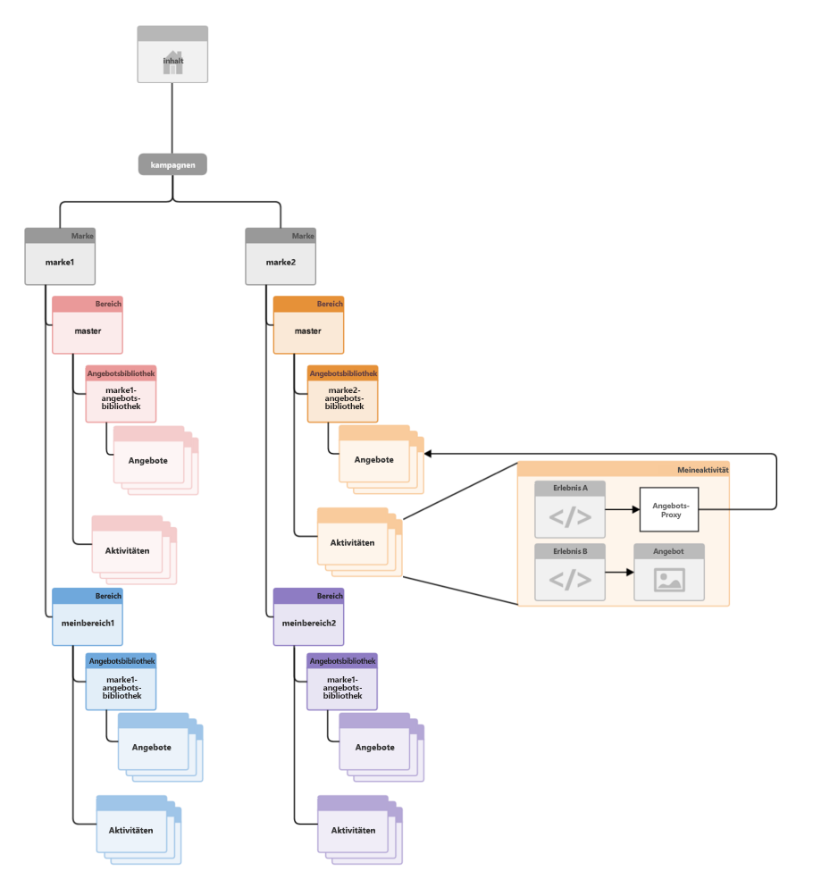
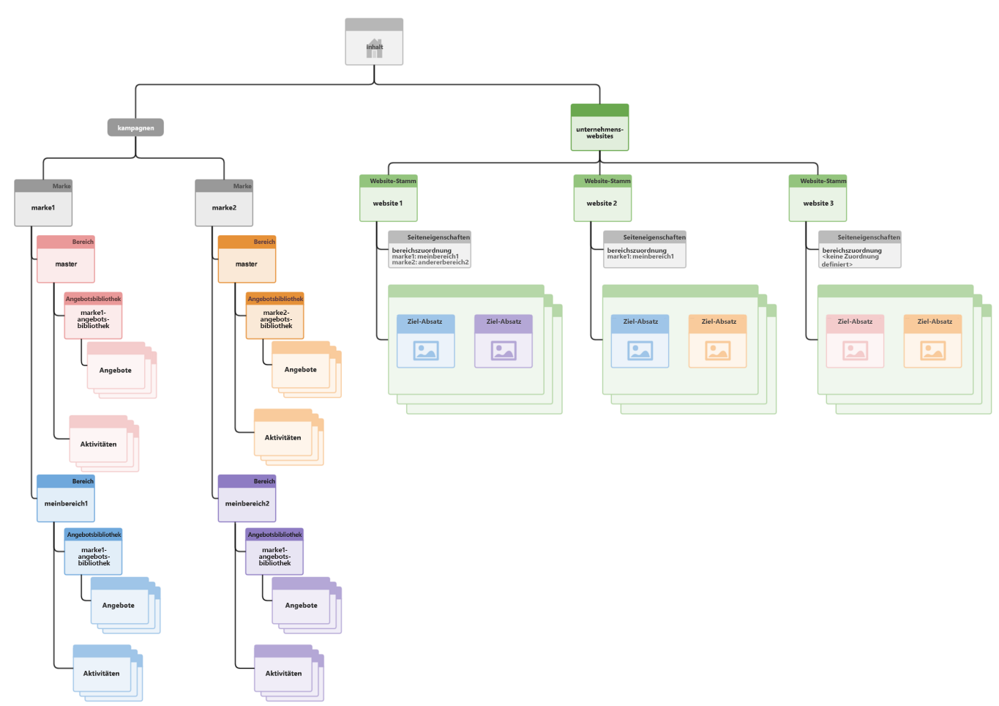

# Strukturierung von Multisite-Management für zielgerichtete Inhalte{#how-multisite-management-for-targeted-content-is-structured}

Im folgenden Diagramm ist der Aufbau der Multisite-Unterstützung für Targeting-Inhalte dargestellt.

Gebiete werden unter **/content/campaigns/&lt;Marke>** eingeordnet und jede Marke verfügt standardmäßig über ein automatisch erstelltes Master-Gebiet. In jedem Gebiet ist ein eigener Satz Aktivitäten, Erlebnisse und Angebote enthalten.

Seiten oder Sites können Gebieten zugeordnet werden, sodass sich Targeting-Inhalte nachschlagen lassen. Sollte kein Gebiet konfiguriert sein, bezieht sich AEM für diese Marke auf das Mastergebiet.

Im folgenden Diagramm finden Sie ein Beispiel dafür, wie die Logik im Falle der drei Sites Site1, Site2 und Site3 funktioniert.

* Site1 bezieht sich für Marke1 auf MeinGebiet1 und für Marke2 auf AnderesGebiet2, basierend auf der Gebietszuordnung.
* Site2 bezieht sich für Marke1 auf MeinGebiet1 und für Marke2 auf das Mastergebiet, da nur für Marke1 Gebiete zugewiesen wurden.
* Site3 bezieht sich für Marke1 und für Marke2 auf das Mastergebiet, weil für diese Site keine Gebietszuordnung vorgenommen wurde.
