# Erstellen von Seitenvorlagen{#creating-page-templates}

Wenn Sie eine Seite erstellen, müssen Sie eine Vorlage auswählen. Diese wird als Grundlage für die Erstellung der neuen Seite verwendet. Die Vorlage definiert die Struktur der Seite, anfängliche Inhalte und die Komponenten, die verwendet werden können.

Mit dem **Vorlageneditor** ist das Erstellen und Verwalten von Vorlagen nicht mehr nur eine Aufgabe für Entwickler. Auch ein Power User, der als **Vorlagenautor** bezeichnet wird, kann einbezogen werden. Entwickler müssen weiterhin die Umgebung einrichten, Clientbibliotheken erstellen und die zu verwendenden Komponenten erstellen. Sobald diese Grundlagen vorhanden sind, hat der **Vorlagenautor** jedoch die Flexibilität, Vorlagen ohne Entwicklungsprojekt zu erstellen und zu konfigurieren.

Mit der **Vorlagenkonsole** können Vorlagenautoren:

* eine neue Vorlage erstellen oder eine vorhandene Vorlage kopieren
* den Lebenszyklus der Vorlage verwalten

Mit dem **Vorlageneditor** können Vorlagenautoren:

* Komponenten zur Vorlage hinzufügen und sie auf einem responsiven Raster positionieren
* die Komponenten vorkonfigurieren
* definieren, welche Komponenten auf den Seiten bearbeitet werden können, die mit der Vorlage erstellt wurden

In diesem Dokument wird erklärt, wie ein **Vorlagenautor** die Vorlagenkonsole und den Vorlageneditor verwenden kann, um bearbeitbare Vorlagen zu erstellen und zu verwalten.

Ausführliche Informationen zur Funktionsweise von bearbeitbaren Vorlagen auf technischer Ebene finden Sie im Entwicklerdokument [Bearbeitbare Seitenvorlagen](/help/sites-developing/page-templates-editable.md).

>[!NOTE]
>
>Der **Vorlageneditor** unterstützt kein Targeting direkt auf Vorlagenstufe. Seiten, die auf Grundlage einer bearbeitbaren Vorlage erstellt wurden, können zielgerichtet sein, die Vorlagen selbst müssen das jedoch nicht sein.

>[!CAUTION]
>
>Seiten und Vorlagen, die mit der **Vorlagenkonsole** erstellt wurden, sind nicht für die Verwendung mit der klassischen Benutzeroberfläche vorgesehen und eine solche Verwendung wird nicht unterstützt.

## Bevor Sie beginnen {#before-you-start}

>[!NOTE]
>
>Ein Administrator muss im **Konfigurations-Browser** einen Vorlagenordner konfigurieren und entsprechende Berechtigungen anwenden, bevor ein Vorlagenautor eine Vorlage in diesem Ordner erstellen kann.

Achten Sie auf Folgendes, bevor Sie beginnen:

* Das Erstellen einer neuen Vorlage erfordert Zusammenarbeit. Aus diesem Grund wird für jede Aufgabe eine [Rolle](#roles) angezeigt.

* Je nach Konfiguration Ihrer Instanz ist es hilfreich zu wissen, dass AEM jetzt [zwei grundlegende Arten von Vorlagen](/help/sites-authoring/templates.md#editable-and-static-templates) bereitstellt. Dies hat keinen Einfluss auf die Art und Weise, wie Sie [eine Seite mit einer Vorlage erstellen](#using-a-template-to-create-a-page), sondern auf die Art von Vorlage, die Sie erstellen können, und wie eine Seite mit ihrer Vorlage in Beziehung steht.

### Rollen {#roles}

Für das Erstellen einer neuen Vorlage mithilfe der **Vorlagenkonsole** und des **Vorlageneditors** ist eine Zusammenarbeit zwischen folgenden Rollen erforderlich:

* **Admin**:

   * Erstellt neue Ordner für Vorlagen, wofür `admin`-Berechtigungen erforderlich sind.

   * Solche Aufgaben können oft von einem Entwickler übernommen werden.

* **Entwickler**:

   * Konzentriert sich auf technische/interne Details.
   * Muss Erfahrung mit der Entwicklungsumgebung haben.
   * Versorgt den Vorlagenautor mit den erforderlichen Informationen.

* **Vorlagenautor**:

   * Dies ist ein bestimmter Autor, der Mitglied der Gruppe `template-authors` ist.

      * Weist die erforderlichen Berechtigungen zu.
   * Kann die Verwendung von Komponenten und andere wichtige Einzelheiten konfigurieren, was Folgendes erfordert:

      * Einige technische Kenntnisse

         * Zum Beispiel bei der Verwendung von Mustern, wenn Pfade definiert werden.
      * Technische Informationen vom Entwickler.

Aufgrund der Natur einiger Aufgaben (etwa dem Erstellen eines Ordners) ist eine Entwicklungsumgebung erforderlich, für die wiederum Wissen/Erfahrung benötigt wird.

Die im vorliegenden Dokument beschriebenen Aufgaben sind zusammen mit der Rolle der Person aufgeführt, die für die Ausführung der Aufgaben verantwortlich ist.

### Bearbeitbare und statische Vorlagen {#editable-and-static-templates}

AEM bietet jetzt zwei grundlegende Arten von Vorlagen:

* [Bearbeitbare Vorlagen](/help/sites-authoring/templates.md#creatingandmanagingnewtemplates)

   * Können von Vorlagenautoren [erstellt](#creatinganewtemplate) und [bearbeitet](#editingatemplate) werden, indem die **Vorlagenkonsole und der Vorlagen-Editor** verwendet werden. Auf die **Vorlagenkonsole** kann im Bereich **Allgemein** der Konsole **Werkzeuge** zugegriffen werden.

   * Nachdem die neue Seite erstellt wurde, wird eine dynamische Verbindung zwischen der Seite und der Vorlage aufrechterhalten. Das bedeutet, dass Änderungen an der Vorlagenstruktur und/oder gesperrten Inhalten auf allen Seiten widergespiegelt werden, die mit dieser Vorlage erstellt werden. Änderungen an nicht gesperrtem (d. h. anfänglichem) Inhalt werden nicht dargestellt.
   * Verwenden Sie die Inhaltsrichtlinien, die Sie im Vorlagen-Editor definieren können, um die Designeigenschaften beizubehalten. Der Designmodus im Seiten-Editor wird nicht mehr für bearbeitbare Vorlagen verwendet.

* Statische Vorlagen

   * Statische Vorlagen sind bereits seit längerem für diverse Versionen von AEM verfügbar.
   * Sie werden [von Ihren Entwicklern bereitgestellt](/help/sites-developing/page-templates-static.md) und können somit nicht von Autoren erstellt oder bearbeitet werden.
   * Sie werden kopiert, um die neue Seite zu erstellen, wobei danach keine dynamische Verbindung besteht (obwohl der Name der Vorlage zu Informationszwecken registriert ist).
   * Verwenden Sie den [Designmodus](/help/sites-authoring/default-components-designmode.md), um Designeigenschaften beizubehalten.
   * Da die Bearbeitung statischer Vorlagen die ausschließliche Aufgabe eines Entwicklers ist, finden Sie im Entwicklerdokument [Seitenvorlagen - Statisch](/help/sites-developing/page-templates-static.md) weitere Informationen.

Laut Definition ermöglichen die Vorlagenkonsole und der Vorlagen-Editor nur das Erstellen und Bearbeiten von bearbeitbaren Vorlagen. Das vorliegende Dokument beschäftigt sich daher nur mit bearbeitbaren Vorlagen.

### Verwenden einer Vorlage, um eine Seite zu erstellen {#using-a-template-to-create-a-page}

Wenn Sie eine Vorlage zum [Erstellen einer neuen Seite](/help/sites-authoring/managing-pages.md#creating-a-new-page) verwenden, ist kein Unterschied zwischen den statischen und bearbeitbaren Vorlagen ersichtlich. Für die Seitenautoren ist der Prozess transparent.

## Erstellen und Verwalten von Vorlagen {#creating-and-managing-templates}

Gehen Sie zum Erstellen einer neuen bearbeitbaren Vorlage wie folgt vor:

* Verwenden Sie die **Vorlagenkonsole**, die im Bereich **Allgemein** der Konsole **Tools** verfügbar ist.

   * Oder direkt unter: [https://localhost:4502/libs/wcm/core/content/sites/templates.html/conf](https://localhost:4502/libs/wcm/core/content/sites/templates.html/conf)

* Erstellen Sie bei Bedarf [einen Ordner für die Vorlagen](#creating-a-template-folder-admin).
* [Erstellen Sie eine neue Vorlage](#creatinganewtemplateauthor), die anfangs leer ist.

* [Definieren Sie bei Bedarf weitere Eigenschaften](#definingtemplatepropertiesauthor) für die Vorlage.
* [Bearbeiten Sie die Vorlage](#editingtemplates), um Folgendes zu definieren:

   * [Struktur](#editingatemplatestructureauthor) – vordefinierter Inhalt, der auf Seiten, die mit der Vorlage erstellt werden, nicht geändert werden kann.
   * [Anfänglicher Inhalt](#editing-a-template-initial-content-author) – vordefinierter Inhalt, der auf den Seiten geändert werden kann, die mit der Vorlage erstellt werden.
   * [Layout](#editingatemplatelayoutauthor) – für eine Vielzahl von Geräten.
   * [Stile](/help/sites-authoring/style-system.md) – zum Definieren der Stile für die Vorlage und ihre Komponenten.

* [Aktivieren Sie die Vorlage](#enablingatemplateauthor) zur Verwendung, wenn Sie eine Seite erstellen.
* [Lassen die Vorlage zu](#allowing-a-template-author), damit sie für die erforderliche Seite oder die Verzweigung Ihrer Website verwendet werden kann.
* [Veröffentlichen Sie die Vorlage](#publishingatemplateauthor), um sie in der Veröffentlichungsumgebung bereitzustellen.

>[!NOTE]
>
>Die **zugelassenen Vorlagen** werden häufig vordefiniert, wenn Sie Ihre Website erstmals einrichten.

>[!CAUTION]
>
>Geben Sie in eine Vorlage nie Informationen ein, die [internationalisiert](/help/sites-developing/i18n.md) werden müssen. Für die Internationalisierung werden die [Lokalisierungsfunktionen der Hauptkomponenten](https://experienceleague.adobe.com/docs/experience-manager-core-components/using/get-started/localization.html?lang=de) empfohlen.

### Erstellen eines Vorlagenordners – Administrator {#creating-a-template-folder-admin}

Für Ihr Projekt sollte ein Vorlagenordner für Ihre projektspezifischen Vorlagen erstellt werden. Dies ist eine Administratoraufgabe, die im Dokument [Bearbeitbare Seitenvorlagen](/help/sites-developing/page-templates-editable.md#template-folders) beschrieben wird.

### Erstellen einer neuen Vorlage – Vorlagenautor {#creating-a-new-template-template-author}

1. Öffnen Sie die **Vorlagenkonsole** (über **Tools >** **Allgemein**) und navigieren Sie zum gewünschten Ordner.

   >[!NOTE]
   >
   >In einer Standard-AEM-Instanz ist der Ordner **Global** bereits in der Vorlagenkonsole vorhanden. Er enthält Standardvorlagen und dient als Ausweichlösung, wenn keine Richtlinien und/oder Vorlagentypen im aktuellen Ordner gefunden werden.
   >
   >
   >Es wird das bewährte Verfahren empfohlen, einen [für Ihr Projekt erstellten Vorlagenordner zu verwenden](/help/sites-developing/page-templates-editable.md#template-folders).

1. Wählen Sie **Erstellen** und anschließend **Vorlage erstellen**, um den Assistenten zu öffnen.

1. Wählen Sie eine **Vorlagenart** aus und klicken Sie dann auf **Weiter**.

   >[!NOTE]
   >
   >Vorlagenarten sind vordefinierte Vorlagen, die als Vorlagen für eine Vorlage betrachtet werden können. Sie werden von Entwicklern oder vom Systemadministrator vordefiniert. Weitere Informationen finden Sie im Entwicklerdokument [Seitenvorlagen – Bearbeitbar](/help/sites-developing/page-templates-editable.md#template-type).

1. Stellen Sie die **Vorlagendetails** fertig:

   * **Vorlagenname**
   * **Beschreibung**

1. Wählen Sie **Erstellen**. Eine Bestätigung wird angezeigt. Wählen Sie **Öffnen**, um die Vorlage zu bearbeiten oder **Fertig**, um zur Vorlagenkonsole zurückzukehren.

   >[!NOTE]
   >
   >Wenn eine neue Vorlage erstellt wird, wird sie in der Konsole als **Entwurf** markiert, was bedeutet, dass sie noch nicht für Seitenautoren zur Verfügung steht.

### Definieren von Vorlageneigenschaften – Vorlagenautor  {#defining-template-properties-template-author}

Eine Vorlage kann die folgenden Eigenschaften haben:

* Bild

   * Bild, das als [Miniaturansicht der Vorlage verwendet wird](/help/sites-authoring/templates.md#template-thumbnail-image), um die Auswahl zu vereinfachen, beispielsweise im Seitenerstellungsassistenten.

      * Kann hochgeladen werden
      * Kann auf der Grundlage des Vorlageninhalts generiert werden

* Titel

   * Ein Titel zum Identifizieren der Vorlage, beispielsweise im **Seitenerstellungsassistenten**.

* Beschreibung

   * Eine optionale Beschreibung mit weiteren Informationen zur Vorlage und deren Verwendung, die beispielsweise im **Seitenerstellungsassistenten** angezeigt werden können.

So zeigen Sie die Eigenschaften an bzw. bearbeiten sie:

1. Wählen Sie in der **Vorlagenkonsole** eine Vorlage aus.
1. Wählen Sie **Eigenschaften anzeigen** in der Symbolleiste oder in den Schnelloptionen aus, um das Dialogfeld zu öffnen.
1. Jetzt können Sie die Vorlageneigenschaften anzeigen oder bearbeiten.

>[!NOTE]
>
>Vorlagen sind leistungsstarke Tools zur Optimierung des Seitenerstellungs-Workflows. Allerdings können zu viele Vorlagen die Autoren überwältigen und das Erstellen von Seiten unübersichtlich machen. Eine gute Faustregel ist, die Anzahl der Vorlagen unter 100 zu halten.
>
>Adobe empfiehlt, aufgrund möglicher Leistungsauswirkungen nicht mehr als 1.000 Vorlagen zu verwenden.

>[!NOTE]
>
>Der Status einer Vorlage („Entwurf“, „Aktiviert“ oder „Deaktiviert“) wird in der Konsole angezeigt.

#### Vorlagenminiaturbild {#template-thumbnail-image}

So definieren Sie eine Vorlagenminiatur:

1. Bearbeiten Sie die Vorlageneigenschaften.
1. Wählen Sie, ob Sie eine Miniatur hochladen oder aus dem Vorlageninhalt erstellen möchten.

   * Wenn Sie eine Miniatur hochladen möchten, klicken oder tippen Sie auf **Bild hochladen**
   * Wenn Sie eine Miniatur erzeugen möchten, klicken oder tippen Sie auf **Vorschau generieren**

1. Bei beiden Methoden wird eine Vorschau der Miniatur angezeigt.

   Wenn Sie mit dem Ergebnis nicht zufrieden sind, klicken oder tippen Sie auf **Löschen**, um ein anderes Bild hochzuladen oder die Miniatur neu zu erzeugen.

1. Wenn Sie mit der Miniatur zufrieden sind, klicken oder tippen Sie auf **Speichern und schließen**.

### Aktivieren und Zulassen einer Vorlage – Vorlagenautor {#enabling-and-allowing-a-template-template-author}

Um beim Erstellen einer Seite eine Vorlage zu verwenden, gehen Sie wie folgt vor:

* [Aktivieren Sie die Vorlage](#enablingatemplate), um sie verfügbar zu machen, wenn Seiten erstellt werden.
* [Lassen Sie die Vorlage zu](#allowingatemplate), um die Inhaltsverzweigungen anzugeben, in denen die Vorlage verwendet werden kann.

#### Aktivieren einer Vorlage – Vorlagenautor {#enabling-a-template-template-author}

Eine Vorlage kann aktiviert oder deaktiviert werden, um sie im Assistenten **Seite erstellen** verfügbar bzw. nicht verfügbar zu machen.

>[!CAUTION]
>
>Sobald eine Vorlage aktiviert ist, wird eine Warnmeldung angezeigt, wenn ein Autor beginnt, die Vorlage weiter zu aktualisieren. Diese dient dazu, den Benutzer zu informieren, dass die Vorlage referenziert wird und damit sämtliche Änderungen die die Vorlage referenzierenden Seiten beeinträchtigen könnten.

1. Wählen Sie in der **Vorlagenkonsole** eine Vorlage aus.
1. Wählen Sie in der Symbolleiste die Option **Aktivieren** oder **Deaktivieren** und bestätigen Sie Ihre Wahl im Bestätigungsdialogfeld.
1. Jetzt können Sie Ihre Vorlage verwenden, wenn Sie [eine neue Seite erstellen](/help/sites-authoring/managing-pages.md#creating-a-new-page), bzw. [die Vorlage bearbeiten](#editingatemplate), um sie an Ihre Anforderungen anzupassen.

>[!NOTE]
>
>Der Status einer Vorlage („Entwurf“, „Aktiviert“ oder „Deaktiviert“) wird in der Konsole angezeigt.

#### Zulassen einer Vorlage – Autor {#allowing-a-template-author}

Eine Vorlage kann für bestimmte Seitenverzweigungen verfügbar oder nicht verfügbar gemacht werden.

1. Öffnen Sie die [Seiteneigenschaften](/help/sites-authoring/editing-page-properties.md) für die Stammseite der Verzweigung, in der die Vorlage verfügbar sein soll.

1. Öffnen Sie die Registerkarte **Erweitert**.

1. Klicken Sie unter **Vorlageneinstellungen** auf **Feld hinzufügen**, um den Pfad/die Pfade zu Ihren Vorlagen anzugeben.

   Der Pfad kann explizit sein oder Muster verwenden. Ein Beispiel:

   `/conf/<your-folder>/settings/wcm/templates/.*`

   Die Reihenfolge der Pfade ist irrelevant, da sämtliche Pfade überprüft und alle Vorlagen abgerufen werden.

   >[!NOTE]
   >
   >Wenn die Liste **Zugelassene Vorlagen** leer ist, wird die Struktur weiter durchsucht, bis ein Wert/eine Liste gefunden wird.
   >
   >
   >Weitere Informationen finden Sie unter [Vorlagenverfügbarkeit](/help/sites-developing/templates.md#template-availability) – die Prinzipien für zugelassene Vorlagen bleiben gleich.

1. Klicken Sie auf **Speichern**, um die Änderungen an den Seiteneigenschaften zu speichern.

>[!NOTE]
>
>Häufig werden die zugelassenen Vorlagen für Ihre gesamte Site vordefiniert, wenn diese eingerichtet wird.

### Veröffentlichen einer Vorlage – Vorlagenautor {#publishing-a-template-template-author}

Da auf die Vorlage verwiesen wird, wenn eine Seite dargestellt wird, muss die voll konfigurierte Vorlage veröffentlicht werden, damit sie in der Veröffentlichungsumgebung verfügbar ist.

1. Wählen Sie in der **Vorlagenkonsole** eine Vorlage aus.
1. Wählen Sie **Veröffentlichen** in der Symbolleiste, um den Assistenten zu öffnen.
1. Wählen Sie die **Inhaltsrichtlinien**, die mit veröffentlicht werden sollen.

1. Wählen Sie **Veröffentlichen** in der Symbolleiste, um den Vorgang abzuschließen.

## Bearbeiten von Vorlagen – Vorlagenautoren {#editing-templates-template-authors}

Beim Erstellen oder Bearbeiten einer Vorlage können Sie diverse Aspekte definieren. Das Bearbeiten von Vorlagen ähnelt dem Erstellen von Seiten.

Die folgenden Aspekte einer Vorlage können bearbeitet werden:

* [Struktur](#editingatemplatestructure)

   Komponenten, die hier eingefügt werden, können nicht von den Seitenautoren von den resultierenden Seiten entfernt/veschoben werden. Wenn Seitenautoren in der Lage sein sollen, neue Komponenten zu resultierenden Seiten hinzuzufügen und daraus zu entfernen, müssen Sie der Vorlage ein Absatzsystem hinzufügen.

   Wenn Komponenten gesperrt sind, können Sie Inhalte hinzufügen, die nicht von den Seitenautoren bearbeitet werden können. Sie können Komponenten entsperren, damit Sie [anfänglichen Inhalt](#editingatemplateinitialcontent) definieren können.

   >[!NOTE]
   >
   >Im Strukturmodus können Komponenten, die einer nicht gesperrten Komponente übergeordnet sind, nicht verschoben, ausgeschnitten oder gelöscht werden.

* [Anfänglicher Inhalt](#editingatemplateinitialcontent)

   Wenn eine Komponente entsperrt wurde, können Sie den anfänglichen Inhalt definieren, der auf die resultierenden Seiten kopiert wird, die aus der Vorlage erstellt werden. Diese entsperrten Komponenten können auf den resultierenden Seiten bearbeitet werden.

   >[!NOTE]
   >
   >Im Modus **Anfänglicher Inhalt** und auf den resultierenden Seiten können alle entsperrten Komponenten, bei denen übergeordnete Elemente verfügbar sind (z. B. Komponenten in einem Layout-Container), gelöscht werden.

* [Layout](#editingatemplatelayout)

   Hier können Sie das Vorlagenlayout für die erforderlichen Geräteformate vordefinieren. Der Modus **Layout** für das Erstellen von Vorlagen bietet dieselben Funktionen wie der Modus [**Layout** für das Erstellen von Seiten](/help/sites-authoring/responsive-layout.md#defining-layouts-layout-mode).

* [Seitenrichtlinien](#editingatemplatepagepolicies)

   Unter „Seitenrichtlinien“ können Sie vordefinierte Seitenrichtlinien für die Seite verknüpfen. Diese Seitenrichtlinien definieren die verschiedenen Design-Konfigurationen.

* [Stile](/help/sites-authoring/style-system.md)

   Das Stilsystem ermöglicht es einem Vorlagenautor, in der Inhaltsrichtlinie für Komponenten Stilklassen festzulegen, die ein Inhaltsautor später bei der Bearbeitung der Komponente auf einer Seite auswählen kann. Diese Stile können alternative visuelle Varianten einer Komponente sein, um das Verfahren flexibler zu gestalten.

   Weitere Informationen finden Sie in der [Dokumentation für das Stilsystem](/help/sites-authoring/style-system.md).

Mit der **Modus**-Auswahl in der Symbolleiste können Sie die jeweiligen Aspekte der Vorlage auswählen und bearbeiten:

* [Struktur](#editingatemplatestructure)
* [Anfänglicher Inhalt](#editingatemplateinitialcontent)
* [Layout](#editingatemplatelayout)

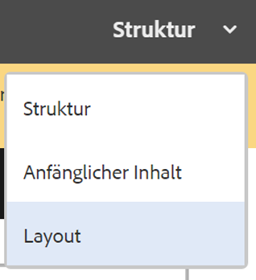

Mit der Option **Seitenrichtlinie** im Menü **Seiteninformationen** können Sie [die erforderlichen Seitenrichtlinien auswählen](#editingatemplatepagepolicies):

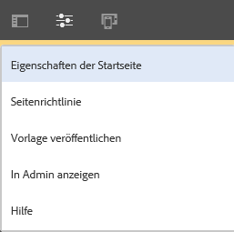

>[!CAUTION]
>
>Wenn ein Autor beginnt, eine bereits aktivierte Vorlage zu bearbeiten, wird eine Warnmeldung angezeigt. Diese dient dazu, den Benutzer zu informieren, dass die Vorlage referenziert wird und damit sämtliche Änderungen die die Vorlage referenzierenden Seiten beeinträchtigen könnten.

### Bearbeiten einer Vorlage – Struktur – Vorlagenautor {#editing-a-template-structure-template-author}

Im **Strukturmodus** definieren Sie Komponenten und Inhalte für Ihre Vorlage sowie Richtlinien für die Vorlage und die zugehörigen Komponenten.

* Komponenten, die in der Vorlagenstruktur definiert sind, können auf resultierenden Seiten nicht verschoben oder gelöscht werden.
* Wenn Seitenautoren die Möglichkeit haben sollen, Komponenten hinzuzufügen und zu entfernen, fügen Sie der Vorlage ein Absatzsystem hinzu.
* Komponenten lassen sich entsperren und erneut sperren, damit Sie den [anfänglichen Inhalt](#editingatemplateinitialcontent) definieren können.

* Die Design-Richtlinien für die Komponenten und die Seite werden definiert.

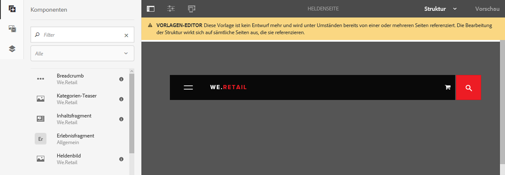

Im Modus **Struktur** des Vorlagen-Editors:

* **Hinzufügen von Komponenten** 

   Es gibt verschiedene Möglichkeiten, Komponenten zur Vorlage hinzuzufügen:

   * aus dem **Komponenten**-Browser im Seitenbereich
   * über die Option **Komponente einfügen** (**Plussymbol**) in der Symbolleiste von Komponenten, die bereits in der Vorlage sind, oder dem Feld **Kompenenten hierher ziehen**

   * durch das Ziehen eines Assets (aus dem **Assets**-Browser im Seitenbereich) direkt auf die Vorlage, um die entsprechende Komponente dort zu generieren

   Sobald sie hinzugefügt wurde, wird jede Komponente markiert mit:

   * einem Rand
   * einer Markierung, die den Komponententyp zeigt
   * einer Markierung, die anzeigt, ob die Komponente entsperrt ist

   >[!NOTE]
   >
   >Wenn Sie eine vordefinierte **Titelkomponente** zur Vorlage hinzufügen, enthält sie den Standardtext **Struktur**.
   >
   >
   >Wenn Sie diesen ändern und Ihren eigenen Text einfügen, wird dieser aktualisierte Text verwendet, wenn eine Seite aus der Vorlage erstellt wird.
   >
   >
   >Wenn Sie den Standardtext (Struktur) nicht ändern, wird der Titel standardmäßig mit dem Namen der nachfolgenden Seite benannt.

   >[!NOTE]
   >
   >Das Hinzufügen von Komponenten und Assets zu einer Vorlage ist zwar nicht dasselbe wie das [Erstellen von Seiten](/help/sites-authoring/editing-content.md), es gibt aber durchaus einige Ähnlichkeiten.

* **Komponenten-Aktionen**

   Arbeiten Sie mit den Komponenten, nachdem sie zur Vorlage hinzugefügt wurden. Jede einzelne Instanz enthält eine Symbolleiste, mit der Sie auf die verfügbaren Aktionen zugreifen können. Die Symbolleiste ist abhängig von der Art der Komponente.

   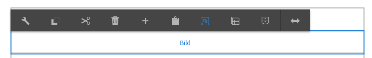

   Sie kann auch von durchgeführten Aktionen abhängig sein. Wenn z. B. eine Richtlinie mit der Komponente verbunden wurde, ist das Design-Konfigurationssymbol verfügbar.

* **Bearbeiten und Konfigurieren**

   Mit diesen zwei Aktionen können Sie Inhalte zu Ihren Komponenten hinzufügen.

* **Rand für die Anzeige der Struktur**

   Wenn Sie im Modus **Struktur** arbeiten, zeigt ein orangefarbener Rand die derzeit ausgewählte Komponente an. Außerdem zeigt eine gepunktete Linie die übergeordnete Komponente an.

   Im Screenshot weiter unten ist beispielsweise die Komponente **Text** in einem **Layout-Container** ausgewählt (responsivegrid).

   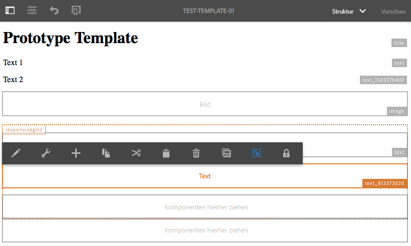

* **Richtlinien und Eigenschaften (allgemein)** 

   Die Richtlinien für Inhalt (oder Design) definieren die Entwurfseigenschaften einer Komponente. Zum Beispiel die verfügbaren Komponenten oder minimale/maximale Abmessungen. Diese sind auf die Vorlage anwendbar (und auf Seiten, die mit der Vorlage erstellt wurden).

   Erstellen Sie für eine Komponente eine Inhaltsrichtlinie oder wählen Sie eine vorhandene. Damit können Sie die Design-Details definieren.

    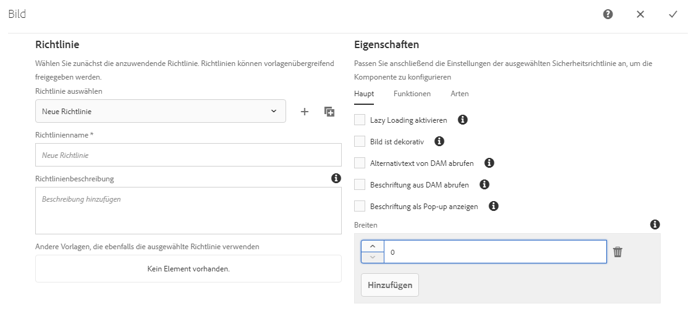

   Das Konfigurationsfenster ist in zwei Hälften geteilt.

   * Auf der linken Seite des Dialogfelds können Sie unter **Richtlinie** eine vorhandene Richtlinie auswählen.
   * Auf der rechten Seite des Dialogfelds können Sie unter **Eigenschaften** die für den Komponententyp spezifischen Eigenschaften festlegen.

   Die verfügbaren Eigenschaften sind von der ausgewählten Komponente abhängig. Beispielsweise definieren die Eigenschaften bei einer Textkomponente u. a. die Optionen „Kopieren“ und „Einfügen“, Formatierungsoptionen und das Absatzformat.

   ***Richtlinie***

   Die Richtlinien für Inhalt (oder Design) definieren die Entwurfseigenschaften einer Komponente. Zum Beispiel die verfügbaren Komponenten oder minimale/maximale Abmessungen. Diese sind auf die Vorlage anwendbar (und auf Seiten, die mit der Vorlage erstellt wurden).

   Unter **Richtlinie** können Sie eine vorhandene Richtlinie auswählen, die über das Dropdown-Menü auf die Komponente angewendet wird.

   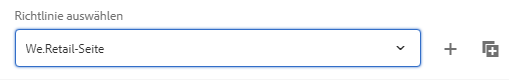

   Sie können eine neue Richtlinie hinzufügen, indem Sie auf die Schaltfläche „Hinzufügen“ klicken, die sich neben dem Dropdown-Menü **Richtlinie auswählen** befindet. Dann muss ein neuer Name in das Feld **Richtlinienname** eingegeben werden.

   

   Die im Dropdown-Menü **Richtlinie auswählen** ausgewählte vorhandene Richtlinie kann mithilfe der Schaltfläche „Kopieren“, die sich neben dem Dropdown-Menü befindet, kopiert werden. Dann muss ein neuer Name in das Feld **Richtlinienname** eingegeben werden. Standardmäßig erhält die kopierte Richtlinie den Namen **Kopie von X**, wobei X der Name der kopierten Richtlinie ist.

   

   Eine Beschreibung der Richtlinie im Feld **Richtlinienbeschreibung** ist optional.

   Im Abschnitt **Andere Vorlagen, die ebenfalls die ausgewählte Richtlinie verwenden** ist leicht ersichtlich, welche anderen Vorlagen die Richtlinie verwenden, die in der Dropdown-Liste **Richtlinie auswählen** ausgewählt wurde.

   

   >[!NOTE]
   >
   >Wenn mehrere Komponenten des gleichen Typs als anfänglicher Inhalt hinzugefügt werden, gilt für alle Komponenten dieselbe Richtlinie. Dies entspricht der Einschränkung für statische Vorlagen im [**Designmodus**](/help/sites-authoring/default-components-designmode.md).

   ***Eigenschaften***

   Unter der Überschrift **Eigenschaften** können Sie die Einstellungen der Komponente definieren. Die Überschrift hat zwei Registerkarten:

   * Allgemein
   * Funktionen

   *Main*

   Auf der Registerkarte **Allgemein** sind die wichtigsten Einstellungen der Komponente definiert.

   Beispielsweise kann die zulässige Breite für eine Bildkomponente zusammen mit der Aktivierung des „Lazy Loading“ (Langsames Laden) definiert werden.

   Wenn eine Einstellung mehrere Konfigurationen erlaubt, klicken oder tippen Sie auf die Schaltfläche **Hinzufügen**, um eine weitere Konfiguration hinzuzufügen.

   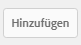

   Um eine Konfiguration zu entfernen, klicken oder tippen Sie auf die Schaltfläche **Löschen**, die sich rechts neben der Konfiguration befindet.

   Um eine Konfiguration zu entfernen, klicken oder tippen Sie auf die Schaltfläche &quot;Löschen&quot;.

   

   *Funktionen*

   Die Registerkarte **Funktionen** erlaubt es Ihnen, zusätzliche Funktionen der Komponente zu aktivieren oder zu deaktivieren.

   Sie können zum Beispiel für eine Bildkomponente die Beschneidungsproportionen, die erlaubten Bildausrichtungen und die erlaubten Uploads definieren.

   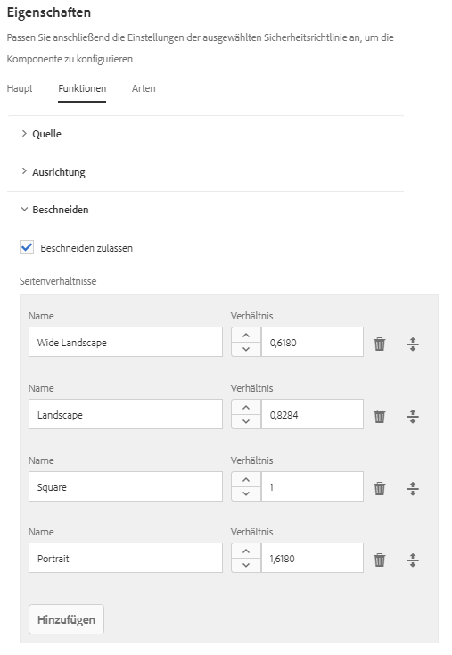

   >[!CAUTION]
   >
   >Beachten Sie, dass in AEM die Beschneidungsverhältnisse als **Höhe/Breite** definiert sind. Dies unterscheidet sich von der herkömmlichen Definition als Breite/Höhe und erfolgt aus Gründen der Legacy-Kompatibilität. Benutzer, die Seiten erstellen, bemerken keinen Unterschied, vorausgesetzt, dass Sie den **Namen** klar definieren, da dieser auf der Benutzeroberfläche angezeigt wird.

   >[!NOTE]
   >
   >[Inhaltsrichtlinien für Komponenten, die den Rich-Text-Editor implementieren](/help/sites-administering/rich-text-editor.md#main-pars-header-206036638), können nur für Optionen definiert werden, die vom RTE über die UI-Einstellungen bereitgestellt werden.  

* **Richtlinien und Eigenschaften (Layout-Container)** 

   Die Richtlinien und Eigenschafteneinstellungen eines Layout-Containers sind der allgemeinen Verwendung ähnlich, es gibt aber einige Abweichungen.

   >[!NOTE]
   >
   >Das Konfigurieren einer Richtlinie ist für Container-Komponenten obligatorisch, da Sie dadurch die Komponenten definieren können, die im Container zur Verfügung stehen.

   Das Konfigurationsfenster ist in zwei Hälften geteilt, ebenso wie bei der allgemeinen Verwendung des Fensters.

   ***Richtlinie***

   Die Richtlinien für Inhalt (oder Design) definieren die Entwurfseigenschaften einer Komponente. Zum Beispiel die verfügbaren Komponenten oder minimale/maximale Abmessungen. Diese sind auf die Vorlage anwendbar (und auf Seiten, die mit der Vorlage erstellt wurden).

   Unter **Richtlinie** können Sie eine vorhandene Richtlinie auswählen, die über das Dropdown-Menü auf die Komponente angewendet wird. Dies funktioniert ebenso wie bei der allgemeinen Verwendung des Fensters.

   ***Eigenschaften***

   Unter der Überschrift **Eigenschaften** können Sie auswählen, welche Komponenten für den Layout-Container verfügbar sein sollen, und Sie können die Einstellungen der Komponenten definieren. Die Überschrift hat drei Registerkarten:

   * Zugelassene Komponenten
   * Standardkomponenten
   * Responsive Einstellungen

   *Zugelassene Komponenten*

   Auf der Registerkarte **Zugelassene Komponenten** definieren Sie, welche Komponenten für den Layout-Container verfügbar sein sollen.

   * Die Komponenten werden anhand ihrer Komponentengruppen gruppiert, die sich ein- und ausblenden lassen.
   * Eine gesamte Gruppe kann durch Aktivieren des Gruppennamens ausgewählt werden und die Auswahl kann durch Deaktivieren aufgehoben werden.
   * Ein Minuszeichen zeigt an, dass mindestens eines, aber nicht alle Elemente in einer Gruppe ausgewählt sind.
   * Eine Suche zum Filtern einer Komponente nach Name ist verfügbar.
   * Die rechts neben dem Namen der Komponentengruppe aufgelisteten Werte stellen die Gesamtanzahl der ausgewählten Komponenten in diesen Gruppen dar (unabhängig vom Filter).

   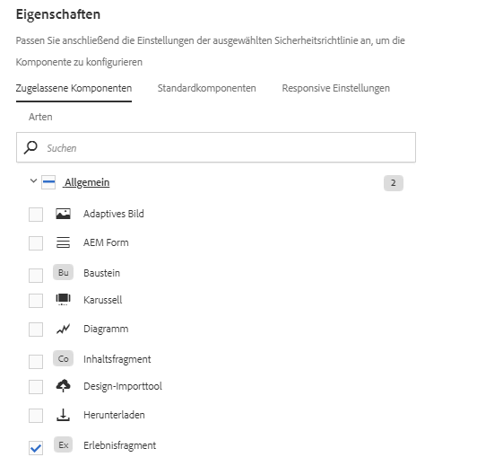

   *Standardkomponenten*

   Auf der Registerkarte **Standardkomponenten** definieren Sie, welche Komponenten automatisch bestimmten Medientypen zugeordnet werden sollen, damit AEM weiß, welche Komponente zuzuordnen ist, wenn ein Autor ein Asset aus dem Asset-Browser zieht. Beachten Sie, dass nur Komponenten mit Ablagebereichen für eine solche Konfiguration verfügbar sind.

   Klicken oder tippen Sie auf **Zuordnung hinzufügen**, um eine völlig neue Komponente und MIME-Typ-Zuordnung hinzuzufügen.

   Wählen Sie eine Komponente in der Liste aus und tippen/klicken Sie auf **Typ hinzufügen**, um einer bereits zugeordneten Komponente einen zusätzlichen MIME-Typ hinzuzufügen. Klicken Sie auf das Symbol **Löschen**, um einen MIME-Typ zu entfernen.

   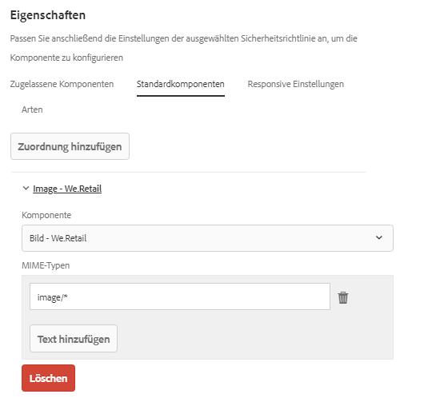

   *Responsive Einstellungen*

   Auf der Registerkarte **Responsive Einstellungen** können Sie die Anzahl der Spalten im resultierenden Raster des Layout-Containers konfigurieren.

* **Sperren/Entsperren von Komponenten**

   Komponenten werden entsperrt/gesperrt, um festzulegen, ob der Inhalt im Modus **Anfänglicher Inhalt** geändert werden darf.

   Wenn eine Komponente entsperrt wurde:

   * wird am Rand ein offenes Vorhängeschloss angezeigt
   * wird die Symbolleiste der Komponente entsprechend angepasst
   * Bereits eingegebener Inhalt wird nicht mehr im **Strukturmodus** angezeigt.

      * Bereits eingegebener Inhalt wird als anfänglicher Inhalt betrachtet und ist nur im Modus **Anfänglicher Inhalt** sichtbar.
   * Die Komponenten, die der entsperrten Komponente übergeordnet sind, können nicht verschoben, ausgeschnitten oder gelöscht werden.

   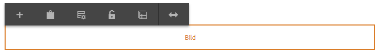

   Dies umfasst das Entsperren von Containerkomponenten, sodass weitere Komponenten hinzugefügt werden können, entweder im **Ursprüngliche Inhalte** oder auf den daraus resultierenden Seiten. Wenn Sie dem Container bereits Komponenten/Inhalte hinzugefügt haben, bevor Sie ihn entsperren, werden diese nicht mehr angezeigt, wenn Sie sich im Modus **Struktur** befinden, sondern im Modus **Ursprüngliche Inhalte**. Im **Strukturmodus** werden nur die Container-Komponente selbst und die zugehörige Liste der **zugelassenen Komponenten** angezeigt.

   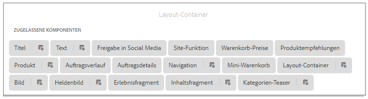

   Der Layout-Container wächst nicht an, um die Liste der zulässigen Komponenten aufzunehmen. Auf diese Weise wird Speicherplatz gespart. Stattdessen wird der Container zu einer bildlauffähigen Liste.

   Komponenten, die konfigurierbar sind, werden mit einem Symbol für **Richtlinien** angezeigt, auf das Sie tippen/klicken können, um die Richtlinie und Eigenschaften dieser Komponente zu bearbeiten.

   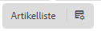

* **Beziehung zu vorhandenen Seiten**

   Auf diesen Seiten werden die Änderungen an der Vorlage widergespiegelt, wenn die Struktur aktualisiert wird, nachdem die Seiten auf der Grundlage der Vorlage erstellt wurden. In der Symbolleiste wird eine Warnung mit einem Bestätigungsdialog angezeigt, um Sie an diese Tatsache zu erinnern.

   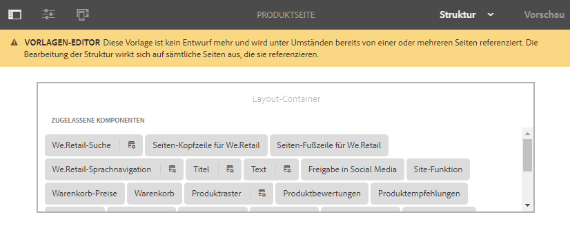

### Bearbeiten einer Vorlage – Anfänglicher Inhalt – Autor {#editing-a-template-initial-content-author}

Der Modus **Anfänglicher Inhalt** wird für definierten Inhalt verwendet, der angezeigt wird, wenn eine Seite anfänglich auf der Grundlage einer Vorlage erstellt wird. Der anfängliche Inhalt kann dann von Seitenautoren bearbeitet werden.

Obwohl der gesamte Inhalt, der im Modus **Struktur** erstellt wird, im Modus **Anfänglicher Inhalt** sichtbar ist, können nur entsperrte Komponenten ausgewählt und bearbeitet werden.

>[!NOTE]
>
>Der Modus **Anfänglicher Inhalt** kann als Bearbeitungsmodus für Seiten betrachtet werden, die mit dieser Vorlage erstellt werden. Daher sind Richtlinien nicht im Modus **Anfänglicher Inhalt**, sondern im [**Strukturmodus** definiert](/help/sites-authoring/templates.md#editing-a-template-structure-template-author).

* Entsperrte Komponenten, die bearbeitet werden können, werden hervorgehoben. Werden sie ausgewählt, erhalten sie einen blauen Rand:

   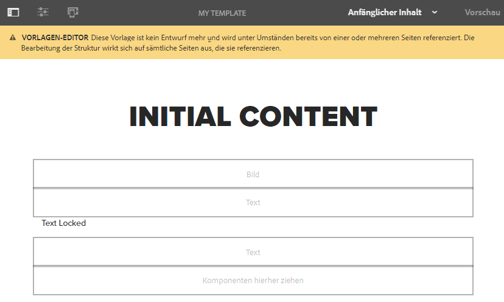

* Entsperrte Komponenten haben eine Symbolleiste, mit der Sie den Inhalt bearbeiten und konfigurieren können:

   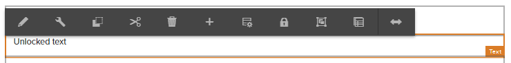

* Wenn eine Container-Komponente (im Modus **Struktur**) entsperrt wurde, können Sie neue Komponenten zum Container hinzufügen (im Modus **Anfänglicher Inhalt**). Komponenten, die im Modus **Anfänglicher Inhalt** hinzugefügt werden, können auf resultierende Seiten verschoben oder von diesen gelöscht werden.

   Sie können Komponenten über den Bereich **Komponenten hierher ziehen** oder mithilfe der Option **Neue Komponente einfügen** in der Symbolleiste des jeweiligen Containers hinzufügen.

   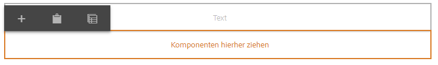 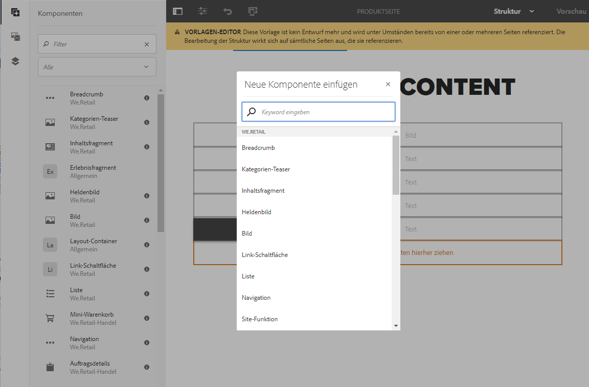

* Wenn der anfängliche Inhalt der Vorlage aktualisiert wird, nachdem Seiten auf der Grundlage der Vorlage erstellt wurden, wirken sich die Änderungen am anfänglichen Inhalt der Vorlage nicht auf diese Seiten aus.

>[!NOTE]
>
>Der ursprüngliche Inhalt dient zum Vorbereiten von Komponenten und dem Seitenlayout, die als Ausgangspunkt für die Erstellung des Inhalts dienen. Dies soll nicht der eigentliche Inhalt sein, der unverändert bleibt. Aus diesem Grund kann der anfängliche Inhalt nicht übersetzt werden.
>
>Wenn Sie in Ihre Vorlage übersetzbaren Text aufnehmen möchten, z. B. in Kopf- oder Fußzeilen, können Sie die [Lokalisierungsfunktionen der Hauptkomponenten](https://docs.adobe.com/content/help/de-DE/experience-manager-core-components/using/get-started/localization.html) verwenden.

### Bearbeiten einer Vorlage – Layout – Vorlagenautor {#editing-a-template-layout-template-author}

Sie können das Vorlagen-Layout für verschiedene Geräte definieren. [Responsives Layout](/help/sites-authoring/responsive-layout.md) funktioniert für Vorlagen ebenso wie für die Seitenbearbeitung.

>[!NOTE]
>
>Änderungen am Layout werden im Modus **Anfänglicher Inhalt** widergespiegelt, doch im **Strukturmodus** sind keine Änderungen zu sehen.

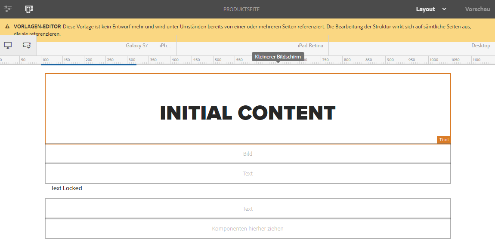

### Bearbeiten einer Vorlage – Seitendesign – Vorlagenautor/Entwickler {#editing-a-template-page-design-template-author-developer}

Der Seitenentwurf, einschließlich der erforderlichen Client-seitigen Bibliotheken und Seitenrichtlinien, wird unter der Option **Seitendesign** im Menü **Seiteninformationen** beibehalten.

So greifen Sie auf das Dialogfeld **Seitendesign** zu:

1. Wählen Sie im **Vorlagen-Editor** **Seiteninformationen** aus der Symbolleiste und dann **Seitendesign** aus, um das Dialogfeld zu öffnen.
1. Das Dialogfeld **Seitendesign** wird geöffnet. Es ist in zwei Abschnitte unterteilt:

   * Die linke Hälfte definiert die [Seitenrichtlinien](/help/sites-authoring/templates.md#page-policies).
   * Die rechte Hälfte definiert die [Seiteneigenschaften](/help/sites-authoring/templates.md#page-properties).

   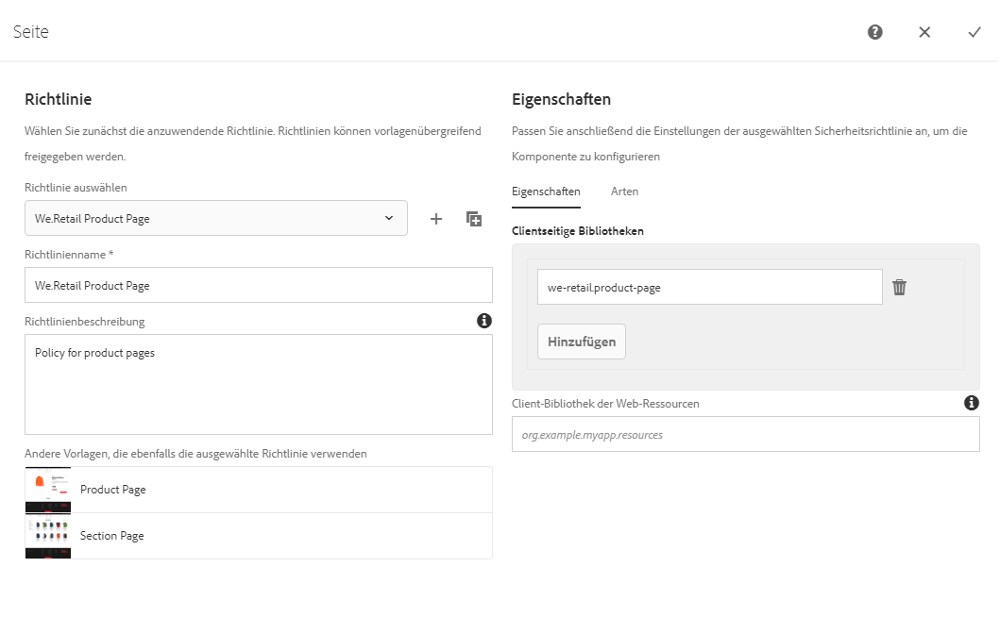

#### Seitenrichtlinien {#page-policies}

Sie können eine Inhaltsrichtlinie auf die Vorlage oder resultierende Seiten anwenden. So wird die Inhaltsrichtlinie für das Hauptabsatzsystem auf der Seite definiert.

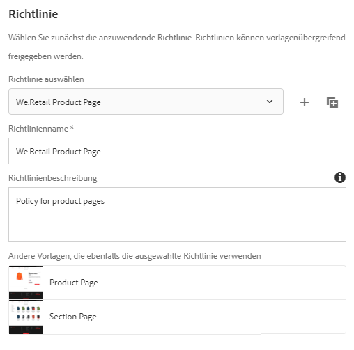

* Sie können eine vorhandene Richtlinie für die Seite im Dropdown-Menü **Richtlinie auswählen** auswählen.

   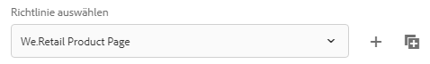

   Sie können eine neue Richtlinie hinzufügen, indem Sie auf die Schaltfläche „Hinzufügen“ klicken, die sich neben dem Dropdown-Menü **Richtlinie auswählen** befindet. Dann muss ein neuer Name in das Feld **Richtlinienname** eingegeben werden.

   

   Die im Dropdown-Menü **Richtlinie auswählen** ausgewählte vorhandene Richtlinie kann mithilfe der Schaltfläche „Kopieren“, die sich neben dem Dropdown-Menü befindet, kopiert werden. Dann muss ein neuer Name in das Feld **Richtlinienname** eingegeben werden. Standardmäßig erhält die kopierte Richtlinie den Namen **Kopie von X**, wobei X der Name der kopierten Richtlinie ist.

   

* Geben Sie im Feld **Richtlinienname** einen Namen für die Richtlinie an. Eine Richtlinie muss einen Namen tragen, damit sie mühelos im Dropdown-Menü **Richtlinie auswählen** ausgewählt werden kann.

   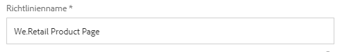

* Eine Beschreibung der Richtlinie im Feld **Richtlinienbeschreibung** ist optional.
* Im Abschnitt **Andere Vorlagen, die ebenfalls die ausgewählte Richtlinie verwenden** ist leicht ersichtlich, welche anderen Vorlagen die Richtlinie verwenden, die in der Dropdown-Liste **Richtlinie auswählen** ausgewählt wurde.

   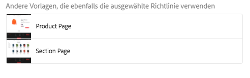

#### Seiteneigenschaften {#page-properties}

Mithilfe der Seiteneigenschaften können Sie die erforderlichen Client-seitigen Bibliotheken definieren, indem Sie das Dialogfeld **Seiten-Design** verwenden. Diese Client-seitigen Bibliotheken enthalten Stylesheets und JavaScript, die zusammen mit der Vorlage und den mit der Vorlage erstellten Seiten geladen werden.

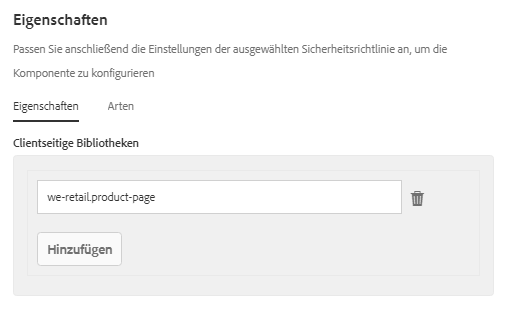

* Geben Sie die Client-seitigen Bibliotheken an, die auf die mit dieser Vorlage erstellten Seiten angewendet werden sollen. Eingabe des Namens einer Bibliothek in das Textfeld im Bereich **Client-Bibliotheken**.

   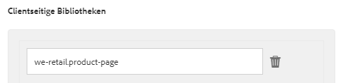

* Wenn mehrere Bibliotheken erforderlich sind, klicken Sie auf die Schaltfläche „Hinzufügen“, um ein zusätzliches Textfeld für den Namen der Bibliothek hinzuzufügen.

   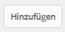

   Fügen Sie für Ihre Client-seitigen Bibliotheken so viele Textfelder wie nötig hinzu.

   

* Definieren Sie bei Bedarf die relative Position der Bibliotheken, indem Sie die Felder mithilfe des Ziehpunkts ziehen.

   

>[!NOTE]
>
>Während der Vorlagenautor die Seitenrichtlinien in der Vorlage festlegt, benötigt er Angaben zu den jeweiligen Client-seitigen Bibliotheken vom Entwickler.

### Bearbeiten einer Vorlage – Anfängliche Seiteneigenschaften – Autor {#editing-a-template-initial-page-properties-author}

Mit der Option **Anfängliche Seiteneigenschaften** können Sie die anfänglichen [Seiteneigenschaften](/help/sites-authoring/editing-page-properties.md) definieren, die bei der Erstellung einer neuen Seite gelten sollen.

1. Wählen Sie im Vorlageneditor **Seiteninformationen** aus der Symbolleiste und anschließend **Anfängliche Seiteneigenschaften**, um das Dialogfeld zu öffnen.

1. Im Dialogfeld können Sie Eigenschaften definieren, die für Seiten gelten sollen, die mit dieser Vorlage erstellt werden.

   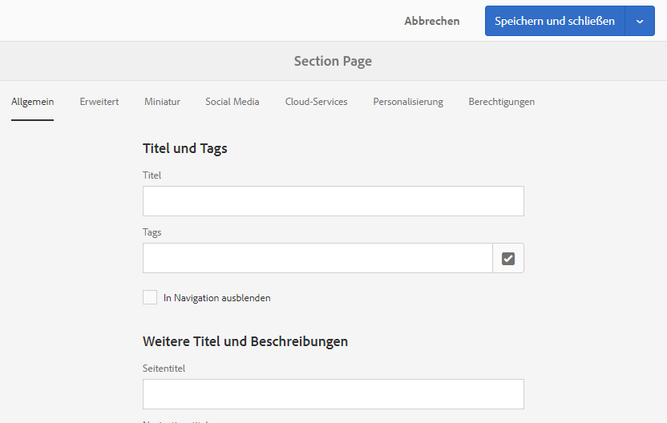

1. Bestätigen Sie Ihre Definitionen mit **Fertig**.

## Best Practices {#best-practices}

Beim Erstellen von Vorlagen sollten Sie Folgendes berücksichtigen:

1. die Auswirkungen von Änderungen an der Vorlage, nachdem Seiten mit dieser Vorlage erstellt wurden

   Im Folgenden finden Sie eine Liste der verschiedenen Vorgänge für Vorlagen sowie deren Auswirkungen auf die Seiten, die aus den Vorlagen erstellt werden:

   * Änderungen an der Struktur:

      * Diese werden sofort auf die resultierenden Seiten angewendet.
      * Die geänderte Vorlage muss veröffentlicht werden, damit Besucher die Änderungen sehen.
   * Änderungen an Inhaltsrichtlinien und Design-Konfigurationen:

      * Diese werden direkt auf die resultierenden Seiten angewendet.
      * Die Änderungen müssen veröffentlicht werden, damit Besucher die Änderungen sehen.
   * Änderungen am anfänglichen Inhalt:

      * Diese werden nur auf Seiten angewendet, die nach den Änderungen an der Vorlage erstellt werden.
   * Änderungen am Layout sind davon abhängig, ob für die geänderte Komponente Folgendes gilt:

      * Nur Struktur – werden sofort übernommen
      * Anfängliche Inhalte enthalten – werden nur auf Seiten übernommen, die nach der Änderung erstellt werden

   Lassen Sie bei folgenden Vorgängen besondere Vorsicht walten:

   * Sperren oder Entsperren von Komponenten in aktivierten Vorlagen.
   * Dies kann Nebeneffekte haben, da die Komponenten bereits von vorhandenen Seiten verwendet werden können. In der Regel gilt:

      * Wenn Komponenten (die gesperrt waren) entsperrt werden, fehlen sie auf vorhandenen Seiten.
      * Wenn Komponenten (die bearbeitbar waren) gesperrt werden, wird der entsprechende Inhalt auf den Seiten ausgeblendet.

   >[!NOTE]
   >
   >AEM warnt ausdrücklich davor, den Sperrstatus von Komponenten in Vorlagen zu ändern, die keine Entwürfe mehr sind.

1. [Erstellen Sie Ihre eigenen Ordner](#creatingatemplatefolderdeveloper) für Ihre sitespezifischen Vorlagen.
1. [Veröffentlichen Sie Ihre Vorlagen](#publishingatemplateauthor) über die **Vorlagenkonsole**.
