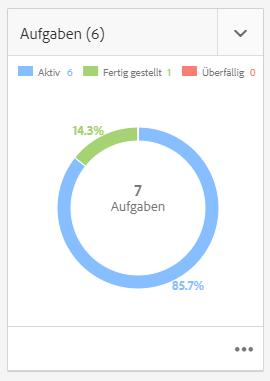
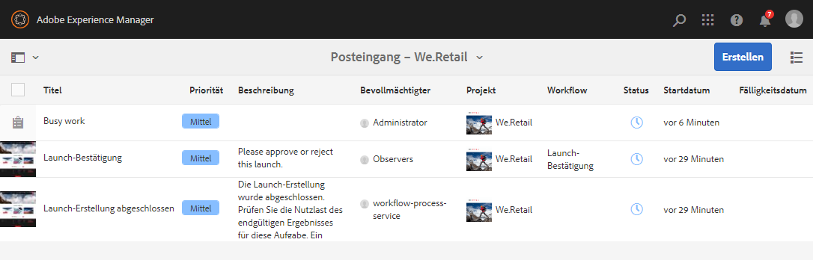

# Verwalten von Projekten {#managing-projects}

Im **Projekte** -Konsole verwenden, können Sie auf Ihre Projekte zugreifen und sie verwalten.

Mithilfe der Konsole können Sie ein Projekt erstellen, Ressourcen mit Ihrem Projekt verknüpfen sowie Projekt- oder Ressourcenlinks löschen.

## Zugriffsanforderungen {#access-requirements}

Erstellt eine standardmäßige AEM und erfordert keine zusätzliche Einrichtung.

Damit Benutzer in Projekten andere Benutzer/Gruppen sehen können, während sie Projekte wie Projekte erstellen, Aufgaben/Workflows erstellen oder das Team anzeigen und verwalten, müssen diese Benutzer jedoch Lesezugriff auf `/home/users` und `/home/groups`.

Am einfachsten ist es, die **projects-users** GruppenLesezugriff auf `/home/users` und `/home/groups`.

## Erstellen eines Projekts {#creating-a-project}

Führen Sie diese Schritte aus, um ein neues Projekt zu erstellen.

1. Im **Projekte** Konsole, tippen oder klicken Sie auf **Erstellen** , um **Projekt erstellen** Assistent.
1. Wählen Sie eine Vorlage aus und klicken Sie auf **Weiter**. Weitere Informationen zu den standardmäßigen Projektvorlagen finden Sie [hier.](/help/sites-authoring/projects.md#project-templates)

   

1. Definieren Sie den **Titel** und die **Beschreibung** und fügen Sie eine **Miniatur** hinzu, falls erforderlich. Hier können Sie auch Benutzer und deren Gruppenzugehörigkeit hinzufügen oder löschen.

   

1. Tippen oder klicken Sie auf **Erstellen**. Daraufhin werden Sie gefragt, ob Sie ein neues Projekt öffnen oder zur Konsole zurückkehren möchten.

Die Vorgehensweise zum Erstellen eines Projekts ist für alle Projektvorlagen identisch. Der Unterschied zwischen den Projekttypen hängt von den verfügbaren [Benutzerrollen](/help/sites-authoring/projects.md) und [Workflows.](/help/sites-authoring/projects-with-workflows.md)

### Zuordnen von Ressourcen zu Ihrem Projekt {#associating-resources-with-your-project}

Projekte ermöglichen es Ihnen, Ressourcen zu einer Einheit zu gruppieren, um sie insgesamt zu verwalten. Daher müssen Sie Ressourcen mit Ihrem Projekt verknüpfen. Diese Ressourcen werden innerhalb des Projekts als **Kacheln**. Die Ressourcentypen, die Sie mit einem Projekt verknüpfen können, werden unter [Projektkacheln](/help/sites-authoring/projects.md#project-tiles) beschrieben.

So ordnen Sie Ihrem Projekt Ressourcen zu:

1. Öffnen Sie das Projekt in der **Projektekonsole**.
1. Tippen/klicken Sie auf **Bereich hinzufügen** und wählen Sie die gewünschte Kachel aus. Sie können mehrere Arten von Kacheln auswählen.

   

1. Tippen oder klicken Sie auf **Erstellen**. Die Ressource wird mit Ihrem Projekt verknüpft und danach können Sie über Ihr Projekt auf sie zugreifen.

### Hinzufügen von Elementen zu einer Kachel {#adding-items-to-a-tile}

In einigen Kacheln benötigen Sie möglicherweise mehr als ein Element. Dies ist zum Beispiel der Fall, wenn Sie mehr als einen gleichzeitig ausgeführten Workflow oder mehr als ein Erlebnis haben.

So fügen Sie einer Kachel Elemente hinzu:

1. In **Projekte**, navigieren Sie zum Projekt, klicken Sie oben rechts in der Kachel, der Sie ein Element hinzufügen möchten, auf das Symbol nach unten und wählen Sie die entsprechende Option aus.

   * Die Option hängt vom Typ der Kachel ab. Zum Beispiel kann es **Aufgabe erstellen** für **Aufgaben** Baustein oder **Workflow starten** für **Workflows** Kachel.

   

1. Fügen Sie das Element wie beim Erstellen einer neuen Kachel zur Kachel hinzu. Projektkacheln werden [hier](/help/sites-authoring/projects.md#project-tiles) beschrieben.

## Anzeigen von Projektinformationen {#viewing-project-info}

Der Hauptzweck von Projekten besteht darin, verknüpfte Informationen an einem Ort zu gruppieren, um sie leichter zugänglich und umsetzbar zu machen. Sie haben verschiedene Möglichkeiten, auf diese Informationen zuzugreifen.

### Öffnen einer Kachel {#opening-a-tile}

Manchmal kann es nötig sein zu wissen, welche Elemente in einer aktuellen Kachel enthalten sind, oder die Elemente in einer Kachel zu ändern oder zu löschen.

Dazu öffnen Sie die Kachel, sodass Sie ihre Elemente anzeigen und ändern können:

1. Tippen oder klicken Sie unten rechts in der Kachel auf das Symbol mit den Auslassungspunkten.

   

1. AEM öffnet die Konsole für die Typen von Elementen, die mit der Kachel verknüpft sind, und Filtern, die auf dem ausgewählten Projekt basieren.

   

### Anzeigen einer Projekt-Zeitleiste {#viewing-a-project-timeline}

Die Projekt-Zeitleiste enthält Informationen dazu, wann Assets des Projekts zuletzt verwendet wurden. Gehen Sie wie folgt vor, um die Projekt-Timeline anzuzeigen.

1. Im **Projekte** Konsole, klicken oder tippen Sie auf **Timeline** in der Schienenauswahl oben links in der Konsole.
   
2. Wählen Sie in der Konsole das Projekt aus, dessen Timeline Sie anzeigen möchten.
   

Assets werden in der Leiste angezeigt. Verwenden Sie die Schienenauswahl, um nach Abschluss zur normalen Ansicht zurückzukehren.

### Anzeigen inaktiver Projekte {#viewing-active-inactive-projects}

So wechseln Sie zwischen aktiven und [inaktive Projekte,](#making-projects-inactive-or-active) im **Projekte** klicken Sie auf die **Aktivieren aktiver Projekte** in der Symbolleiste.

Standardmäßig zeigt die Konsole aktive Projekte an. Klicken Sie auf **Aktivieren aktiver Projekte** -Symbol ein, um zur Ansicht inaktiver Projekte zu wechseln. Klicken Sie erneut darauf, um zu aktiven Projekten zurückzukehren.

## Organisieren von Projekten {#organizing-projects}

Es stehen verschiedene Optionen zur Verfügung, mit denen Sie Ihre Projekte organisieren können, um die **Projekte** Konsolenverwaltung.

### Projektordner {#project-folders}

Sie können Ordner im **Projekte** -Konsole, um ähnliche Projekte zu gruppieren und zu organisieren.

1. Im **Projekte** Klicken oder tippen in der Konsole **Erstellen** und dann **Ordner erstellen**.

   

1. Geben Sie dem Ordner einen Titel und klicken Sie auf **Erstellen**.

1. Der Ordner wird der Konsole hinzugefügt.

Sie können jetzt Projekte im Ordner erstellen. Sie können mehrere Ordner erstellen und auch Ordner verschachteln.

### Inaktivieren von Projekten {#making-projects-inactive-or-active}

Sie können ein Projekt nach Abschluss als inaktiv markieren, aber dennoch die Informationen zum Projekt beibehalten. [Inaktive Projekte werden jetzt angezeigt](#viewing-active-inactive-projects) standardmäßig im **Projekte** Konsole.

Gehen Sie wie folgt vor, um ein Projekt inaktiv zu machen.

1. Öffnen Sie die **Projekteigenschaften** des Projekts.
   * Sie können dies über die Konsole tun, indem Sie das Projekt auswählen oder innerhalb des Projekts über die **Projektinformationen** Kachel.
1. Im **Projekteigenschaften** ändern Sie die **Projektstatus** Regler aus **Aktiv** nach **Inaktiv**.

   

1. Tippen oder klicken Sie auf **Speichern und schließen** , um Ihre Änderungen zu speichern.

### Löschen von Projekten {#deleting-a-project}

Führen Sie die folgenden Schritte aus, um ein Projekt zu löschen.

1. Navigieren Sie zur obersten Ebene der **Projekte** Konsole.
1. Wählen Sie Ihr Projekt in der Konsole aus.
1. Tippen oder klicken Sie auf **Löschen** in der Symbolleiste.
1. AEM können beim Löschen des Projekts die zugehörigen Projektdaten entfernen/ändern. Wählen Sie die gewünschten Optionen in der **Projekt löschen** angezeigt.
   * Projektgruppen und -rollen entfernen
   * Ordner für Projekt-Assets löschen
   * Projekt-Workflows beenden

   
1. Tippen oder klicken Sie auf **Löschen** , um das Projekt mit den ausgewählten Optionen zu löschen.

Weitere Informationen zu automatisch von Projekten erstellten Gruppen finden Sie unter [Automatische Gruppenerstellung](/help/sites-authoring/projects.md#auto-group-creation) für Details.
