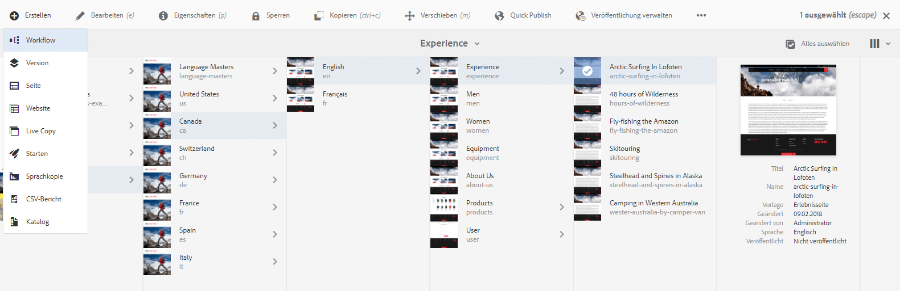
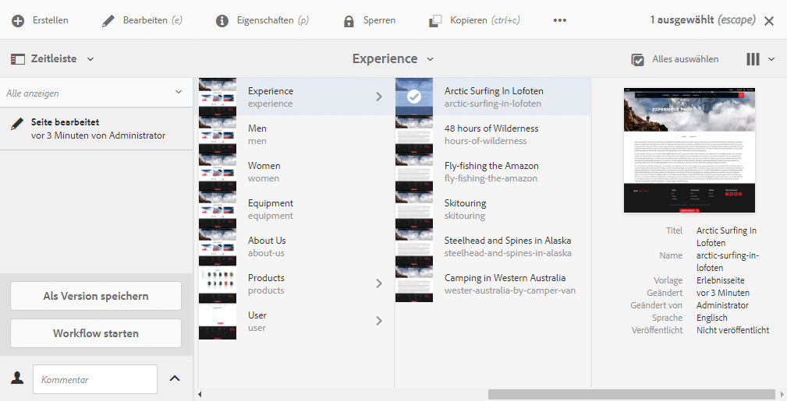
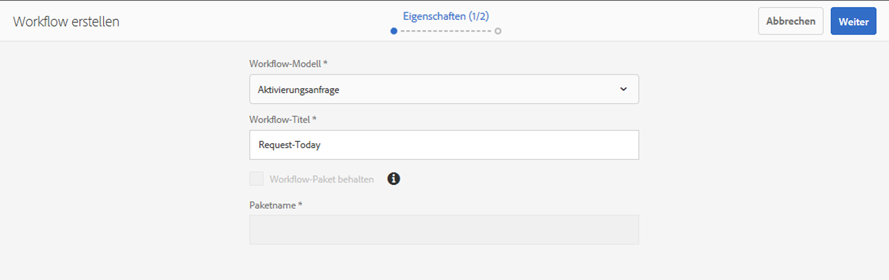
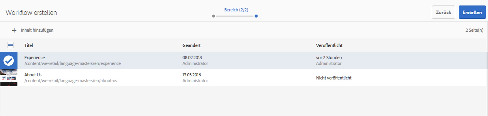
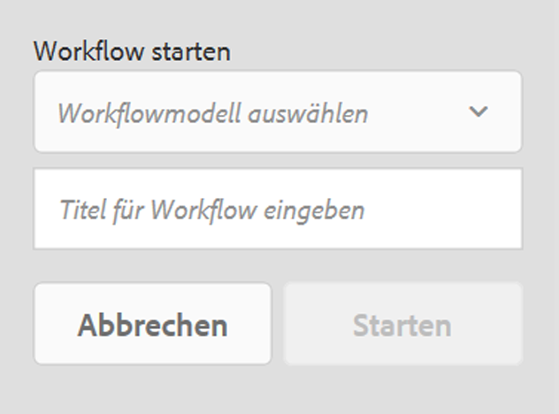

# Anwenden von Workflows auf Seiten{#applying-workflows-to-pages}

Beim Authoring können Sie Workflows aufrufen, um auf Ihren Seiten Maßnahmen zu ergreifen. Es ist auch möglich, mehrere Workflows anzuwenden.

Wenn Sie den Workflow anwenden, geben Sie die folgenden Informationen an:

* Der anzuwendende Workflow.
Sie können jeden beliebigen Workflow anwenden (auf den Sie Zugriff haben, wie von Ihrem AEM-Administrator zugewiesen).
* Optional ein Titel, der zur Identifizierung der Workflow-Instanz im Posteingang einer Benutzerin oder eines Benutzers dient.
* Die Workflow-Payload. Hierbei kann es sich um eine oder mehrere Seiten handeln.

Workflows können wie folgt gestartet werden:

* [von der Sites-Konsole aus](#starting-a-workflow-from-the-sites-console).
* [beim Bearbeiten einer Seite von den Seiteninformationen](#starting-a-workflow-from-the-page-editor) aus.

>[!NOTE]
>
>Siehe auch:
>
>* [Anwenden von Workflows auf DAM-Assets](/help/assets/assets-workflow.md).
>* [Arbeiten mit Projekt-Workflows](/help/sites-authoring/projects-with-workflows.md).
>

>[!NOTE]
>
>AEM-Admins können [Workflows unter Verwendung von mehreren anderen Methoden starten](/help/sites-administering/workflows-starting.md).

## Starten eines Workflows von der Sites-Konsole aus {#starting-a-workflow-from-the-sites-console}

Sie können einen Workflow wie folgt starten:

* [die Option Erstellen der Sites-Symbolleiste.](#starting-a-workflow-from-the-sites-toolbar)
* [die Zeitleiste der Sites-Konsole](#starting-a-workflow-from-the-timeline).

In beiden Fällen müssen Sie Folgendes vornehmen:

* [Angeben der Workflow-Details im Assistenten „Workflow erstellen“](#specifying-workflow-details-in-the-create-workflow-wizard)

### Starten eines Workflows von der Sites-Symbolleiste aus {#starting-a-workflow-from-the-sites-toolbar}

Sie können einen Workflow von der Symbolleiste der **Sites**-Konsole aus starten:

1. Gehen Sie zur gewünschten Seite und wählen Sie sie aus.

1. Von der Option **Erstellen** in der Symbolleiste aus können Sie jetzt **Workflow** auswählen.

   

1. Der Assistent **Workflow erstellen** hilft Ihnen, [die Workflow-Details anzugeben](#specifying-workflow-details-in-the-create-workflow-wizard).

### Starten eines Workflows aus der Zeitleiste {#starting-a-workflow-from-the-timeline}

Aus der **Zeitleiste** können Sie einen Workflow starten, der auf Ihre ausgewählte Ressource angewendet werden soll.

1. [Wählen Sie die Ressource aus](/help/sites-authoring/basic-handling.md#viewingandselectingyourresources) und öffnen Sie die [Zeitleiste](/help/sites-authoring/basic-handling.md#timeline) (oder öffnen Sie die Zeitleiste und wählen Sie dann die Ressource aus).
1. Der Pfeil neben dem Kommentarfeld kann verwendet werden, um **Workflow starten** anzuzeigen:

   

1. Der Assistent **Workflow erstellen** hilft Ihnen, [die Workflow-Details anzugeben](#specifying-workflow-details-in-the-create-workflow-wizard).

### Angeben von Workflow-Details im Assistenten „Workflow erstellen“ {#specifying-workflow-details-in-the-create-workflow-wizard}

Der Assistent **Workflow erstellen** hilft Ihnen, den Workflow auszuwählen und die erforderlichen Details anzugeben.

Sie können der Assistenten **Workflow erstellen** auf zwei Arten öffnen, nämlich über:

* [die Option Erstellen der Sites-Symbolleiste.](#starting-a-workflow-from-the-sites-toolbar)
* [die Zeitleiste der Sites-Konsole](#starting-a-workflow-from-the-timeline).

Details können Sie angeben wie folgt:

1. Im Schritt **Eigenschaften** werden die grundlegenden Optionen des Workflows definiert:

   * **Workflow-Modell**
   * **Workflow-Titel**

      * Sie können einen Titel für diese Instanz angeben, damit Sie sie später identifizieren können.

   Je nach Workflow-Modell stehen auch die folgenden Optionen zur Verfügung. Dadurch kann das als Payload erstellte Paket nach Abschluss des Workflows beibehalten werden.

   * **Workflow-Paket beibehalten**
   * **Paketname**

      * Sie können einen Titel für das Paket angeben, um die Identifizierung zu erleichtern.

   >[!NOTE]
   >
   >Die Option **Workflow-Paket behalten** ist verfügbar, wenn der Workflow für Unterstützung für mehrere [Ressourcen konfiguriert](/help/sites-developing/workflows-models.md#configuring-a-workflow-for-multi-resource-support) wurde und mehrere Ressourcen ausgewählt wurden.

   Wenn Sie fertig sind, klicken Sie auf **Weiter**, um fortzufahren.

   

1. Im Schritt **Umfang** können Sie Folgendes auswählen:

   * **Fügen Sie Inhalte hinzu**, um den [Pfad-Browser](/help/sites-authoring/author-environment-tools.md#path-browser) zu öffnen und zusätzliche Ressourcen auszuwählen. Klicken Sie im Browser auf **Auswählen**, um den Inhalt zur Workflow-Instanz hinzuzufügen.

   * Eine vorhandene Ressource, um weitere Aktionen zu sehen:

      * **Untergeordnete Elemente einbeziehen**, um anzugeben, dass untergeordnete Elemente der betreffenden Ressource im Workflow enthalten sind.
Ein Dialogfeld wird geöffnet, in dem Sie die Auswahl wie folgt verfeinern können:

         * Nur unmittelbar untergeordnete Elemente einbeziehen.
         * Nur geänderte Seiten einbeziehen.
         * Nur bereits veröffentlichte Seiten einbeziehen.

        Alle angegebenen untergeordneten Elemente werden der Liste der Ressourcen hinzugefügt, auf die der Workflow angewendet werden soll.

      * **Auswahl entfernen**, um die betreffende Ressource aus dem Workflow zu entfernen.

   

   >[!NOTE]
   >
   >Wenn Sie zusätzliche Ressourcen hinzufügen, können Sie **Zurück** verwenden, um die Einstellung für **Workflow-Paket behalten** im Schritt **Eigenschaften** anzupassen.

1. Verwenden Sie **Erstellen**, um den Assistenten zu schließen und die Workflow-Instanz zu erstellen. In der Sites-Konsole wird eine Benachrichtigung angezeigt.

## Starten eines Workflows aus dem Seiten-Editor {#starting-a-workflow-from-the-page-editor}

Wenn Sie eine Seite bearbeiten, können Sie die **Seiteninformationen** von der Symbolleiste aus aufrufen. Das Dropdown-Menü enthält die Option **In Workflow starten**. Ein Dialogfeld wird geöffnet, in dem Sie den gewünschten Workflow bei Bedarf zusammen mit einem Titel angeben können:

