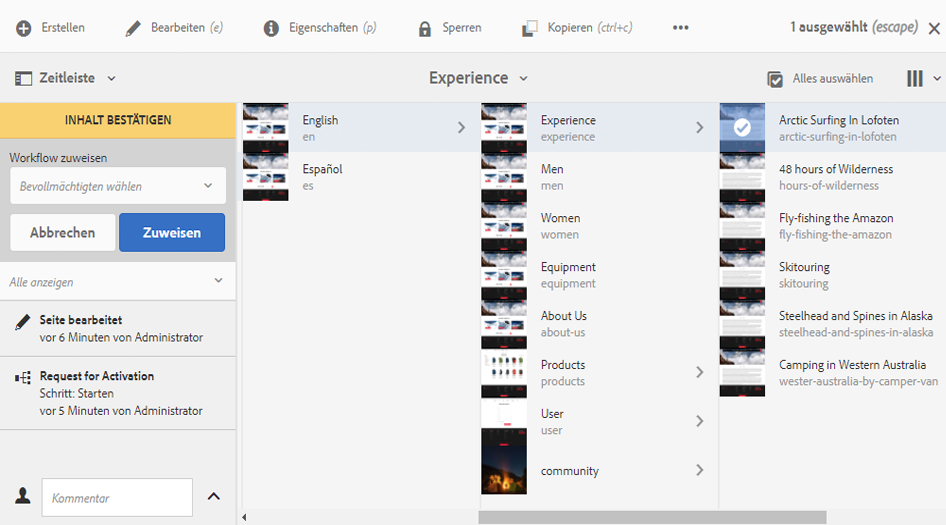

# Teilnehmen an Workflows{#participating-in-workflows}

Workflows enthalten normalerweise Schritte, bei denen eine Person eine Aktivität auf einer Seite oder in einem Asset ausführen muss. Der Workflow wählt einen Benutzer oder eine Gruppe zum Durchführen der Aktivität aus und weist dieser Person oder Gruppe ein Arbeitselement zu. Der Benutzer erhält eine Benachrichtigung und kann dann die entsprechende Aktion ausführen:

* [Ansehen der Benachrichtigungen](#notifications-of-available-workflow-actions)
* [Fertigstellen eines Teilnehmerschritts ](#completing-a-participant-step)
* [Delegieren eines Teilnehmerschritts ](#delegating-a-participant-step)
* [Wechseln zu einem vorherigen Teilnehmerschritt: ](#performing-step-back-on-a-participant-step)
* [Öffnen eines Workflow-Elements, um Details anzuzeigen (und Maßnahmen zu ergreifen) ](#opening-a-workflow-item-to-view-details-and-take-actions)
* [Anzeigen der Workflow-Nutzlast (mehrere Ressourcen) ](#viewing-the-workflow-payload-multiple-resources)

## Benachrichtigungen über verfügbare Workflow-Aktionen    {#notifications-of-available-workflow-actions}

Wenn Ihnen ein Arbeitselement zugewiesen wird (z. B. **Inhalte genehmigen**), werden verschiedene Warnungen und/oder Benachrichtigungen angezeigt:

* In der [Benachrichtigungsanzeige](/help/sites-authoring/inbox.md) (Symbolleiste) werden weitere Elemente angezeigt:

   

* Das Element wird in Ihrem Benachrichtigungs-[Posteingang](/help/sites-authoring/inbox.md) aufgeführt:

   

* Wenn Sie den Seiten-Editor verwenden, zeigt die Statusleiste Folgendes an:

   * Den Namen des Workflows, der für die Seite verwendet wird. z. B. „Aktivierungsanfrage“.
   * Alle Aktionen, die dem momentanen Benutzer für den aktuellen Workflow-Schritt zur Verfügung stehen, z. B. „Fertig stellen“, „Delegieren“ oder „Details anzeigen“.
   * Die Anzahl der Workflows, die für diese Seite verwendet werden. Sie haben folgende Möglichkeiten:

      * die Nach-links-/Nach-rechts-Taste verwenden, um durch die Statusinformationen der verschiedenen Workflows zu navigieren.
      * auf die Zahl klicken/tippen, um eine Dropdown-Liste mit allen verwendeten Workflows zu öffnen, und den Workflow auswählen, der in der Statusleiste angezeigt werden soll.

   

   >[!NOTE]
   >
   >ie Statusleiste ist nur für Benutzer mit Workflow-Privilegien sichtbar, z. B. Mitglieder der Gruppe `workflow-users`.
   >
   >
   >Wenn der momentane Benutzer unmittelbar am aktuellen Workflow-Schritt beteiligt ist, werden Aktionen angezeigt.

* Wenn **Timeline** für die Ressource geöffnet ist, wird der Workflow-Schritt angezeigt. Wenn Sie auf das Warnbanner klicken/tippen, werden die verfügbaren Aktionen ebenfalls angezeigt:

   

### Fertigstellen eines Teilnehmerschritts {#completing-a-participant-step}

Sie können ein Element abschließen, damit der Workflow zum nächsten Schritt übergehen kann.

Bei dieser Aktion können Sie Folgendes angeben:

* **Nächster Schritt**: den nächsten Schritt, der durchgeführt werden soll. Sie können ihn aus einer Liste auswählen.
* **Kommentar**: optional

Die Durchführung eines Teilnehmerschritts ist möglich:

* [im Posteingang](#completing-a-participant-step-inbox)
* [im Seiten-Editor](#completing-a-participant-step-page-editor)
* [Zeitleiste](#completing-a-participant-step-timeline)
* beim [Öffnen eines Workflow-Elements zur Ansicht von Details](#opening-a-workflow-item-to-view-details-and-take-actions)

#### Durchführen eines Teilnehmerschritts: Posteingang {#completing-a-participant-step-inbox}

Gehen Sie folgendermaßen vor, um das Arbeitselement abzuschließen:

1. Öffnen Sie den **[AEM-Posteingang](/help/sites-authoring/inbox.md)**.
1. Wählen Sie das Workflow-Element aus, das Sie durchführen möchten (tippen/klicken Sie auf die Miniaturansicht).
1. Wählen Sie in der Symbolleiste die Option **Fertig stellen** aus.
1. Das Dialogfeld **Arbeits-Element fertig stellen** wird geöffnet. Wählen Sie im Dropdown-Selektor die Option **Nächster Schritt** aus und fügen Sie bei Bedarf einen **Kommentar** hinzu.
1. Verwenden Sie **OK**, um den Schritt abzuschließen (oder **Abbrechen**, um den Vorgang abzubrechen).

#### Durchführen eines Teilnehmerschritts: Seiten-Editor {#completing-a-participant-step-page-editor}

Gehen Sie folgendermaßen vor, um das Arbeitselement abzuschließen:

1. Öffnen Sie die [Seite für die Bearbeitung](/help/sites-authoring/managing-pages.md#opening-a-page-for-editing).
1. Wählen Sie in der Statusleiste oben im Bild **Fertig stellen** aus.
1. Das Dialogfeld **Arbeits-Element fertig stellen** wird geöffnet. Wählen Sie im Dropdown-Selektor die Option **Nächster Schritt** aus und fügen Sie bei Bedarf einen **Kommentar** hinzu.
1. Verwenden Sie **OK**, um den Schritt abzuschließen (oder **Abbrechen**, um den Vorgang abzubrechen).

#### Durchführen eines Teilnehmerschritts: Timeline {#completing-a-participant-step-timeline}

Sie können auch die Timeline verwenden, um einen Schritt abzuschließen und zum nächsten Schritt zu gelangen:

1. Wählen Sie die entsprechende Seite aus und öffnen Sie die **Timeline** (oder öffnen Sie die **Timeline** und wählen Sie die Seite aus):

   

1. Klicken/tippen Sie auf das Warnbanner, um die verfügbaren Aktionen anzuzeigen. Wählen Sie **Voranbringen**:

   

1. Je nach Workflow können Sie den nächsten Schritt auswählen:

   

1. Wählen Sie **Voranbringen**, um die Aktion zu bestätigen.

### Delegieren eines Teilnehmerschritts    {#delegating-a-participant-step}

Wenn Ihnen ein Schritt zugewiesen wurde, Sie aber aus irgendeinem Grund keine entsprechende Maßnahme ergreifen können, können Sie den Schritt an einen anderen Benutzer oder eine Gruppe delegieren.

An welche Benutzer delegiert werden kann, hängt davon ab, wem das Arbeitselement zugewiesen wurde:

* Wenn das Arbeitselement einer Gruppe zugewiesen wurde, sind die Gruppenmitglieder verfügbar.
* Wenn das Arbeitselement einer Gruppe zugewiesen und dann an einen Benutzer delegiert wurde, sind die Gruppenmitglieder und die Gruppe verfügbar.
* Wenn das Arbeitselement einem einzelnen Benutzer zugewiesen wurde, kann es nicht delegiert werden.

Bei dieser Aktion können Sie Folgendes angeben:

* **Benutzer**: den Benutzer, an den Sie delegieren möchten. Sie können aus einer Liste auswählen.
* **Kommentar**: optional

Das Delegieren eines Teilnehmerschritts ist möglich:

* [im Posteingang](#delegating-a-participant-step-inbox)
* [im Seiten-Editor](#delegating-a-participant-step-page-editor)
* [Zeitleiste](#delegating-a-participant-step-timeline)
* beim [Öffnen eines Workflow-Elements zur Ansicht von Details](#opening-a-workflow-item-to-view-details-and-take-actions)

#### Delegieren eines Teilnehmerschritts: Posteingang {#delegating-a-participant-step-inbox}

Gehen Sie folgendermaßen vor, um ein Arbeitselement zu delegieren:

1. Öffnen Sie den **[AEM-Posteingang](/help/sites-authoring/inbox.md)**.
1. Wählen Sie das Workflow-Element aus, das Sie durchführen möchten (tippen/klicken Sie auf die Miniaturansicht).
1. Wählen Sie in der Symbolleiste die Option **Delegieren** aus.
1. Das Dialogfeld wird geöffnet. Wählen Sie im Dropdown-Selektor den **Benutzer** aus (dabei kann es sich auch um eine Gruppe handeln) und fügen Sie bei Bedarf einen **Kommentar** hinzu.
1. Verwenden Sie **OK**, um den Schritt abzuschließen (oder **Abbrechen**, um den Vorgang abzubrechen).

#### Delegieren eines Teilnehmerschritts: Seiten-Editor {#delegating-a-participant-step-page-editor}

Gehen Sie folgendermaßen vor, um ein Arbeitselement zu delegieren:

1. Öffnen Sie die [Seite für die Bearbeitung](/help/sites-authoring/managing-pages.md#opening-a-page-for-editing).
1. Wählen Sie in der Statusleiste oben im Bild **Delegieren** aus.
1. Das Dialogfeld wird geöffnet. Wählen Sie im Dropdown-Selektor den **Benutzer** aus (dabei kann es sich auch um eine Gruppe handeln) und fügen Sie bei Bedarf einen **Kommentar** hinzu.
1. Verwenden Sie **OK**, um den Schritt abzuschließen (oder **Abbrechen**, um den Vorgang abzubrechen).

#### Delegieren eines Teilnehmerschritts: Timeline {#delegating-a-participant-step-timeline}

Sie können auch die Timeline verwenden, um einen Schritt zu delegieren und/oder zuzuweisen:

1. Wählen Sie die entsprechende Seite aus und öffnen Sie die **Timeline** (oder öffnen Sie die **Timeline** und wählen Sie die Seite aus).
1. Klicken/tippen Sie auf das Warnbanner, um die verfügbaren Aktionen anzuzeigen. Wählen Sie **Bevollmächtigten ändern**:

   

1. Legen Sie einen neuen Bevollmächtigten fest:

   

1. Wählen Sie **Zuweisen** aus, um die Aktion zu bestätigen.

### Wechseln zu einem vorherigen Teilnehmerschritt {#performing-step-back-on-a-participant-step}

Wenn Sie erkennen, dass ein Schritt oder eine Reihe von Schritten wiederholt werden muss, können Sie zu einem vorherigen Schritt zurückkehren. Auf diese Weise können Sie einen früheren Schritt im Workflow zur erneuten Verarbeitung auswählen. Der Workflow kehrt zum angegebenen Schritt zurück und wird ab dieser Stelle fortgesetzt.

Bei dieser Aktion können Sie Folgendes angeben:

* **Vorheriger Schritt**: der Schritt, zu dem Sie zurückkehren möchten; Sie können aus einer Liste auswählen
* **Kommentar**: optional

Das Wechseln zu einem vorherigen Teilnehmerschritt ist möglich:

* [im Posteingang](#performing-step-back-on-a-participant-step-inbox)
* [im Seiten-Editor](#performing-step-back-on-a-participant-step-page-editor)
* [Zeitleiste](#performing-step-back-on-a-participant-step-timeline)
* beim [Öffnen eines Workflow-Elements zur Ansicht von Details](#opening-a-workflow-item-to-view-details-and-take-actions)

#### Wechseln zu einem vorherigen Teilnehmerschritt: Posteingang {#performing-step-back-on-a-participant-step-inbox}

Gehen Sie dazu folgendermaßen vor:

1. Öffnen Sie den **[AEM-Posteingang](/help/sites-authoring/inbox.md)**.
1. Wählen Sie das Workflow-Element aus, das Sie durchführen möchten (tippen/klicken Sie auf die Miniaturansicht).
1. Wählen Sie **Schritt zurück** aus, um das Dialogfeld zu öffnen.

1. Wählen Sie **Vorheriger Schritt** aus und fügen Sie bei Bedarf einen **Kommentar** hinzu.
1. Verwenden Sie **OK**, um den Schritt abzuschließen (oder **Abbrechen**, um den Vorgang abzubrechen).

#### Wechseln zu einem vorherigen Teilnehmerschritt: Seiten-Editor {#performing-step-back-on-a-participant-step-page-editor}

Gehen Sie dazu folgendermaßen vor:

1. Öffnen Sie die [Seite für die Bearbeitung](/help/sites-authoring/managing-pages.md#opening-a-page-for-editing).
1. Wählen Sie in der Symbolleiste oben im Bild **Schritt zurück** aus.
1. Wählen Sie **Vorheriger Schritt** aus und fügen Sie bei Bedarf einen **Kommentar** hinzu.
1. Verwenden Sie **OK**, um den Schritt abzuschließen (oder **Abbrechen**, um den Vorgang abzubrechen).

#### Wechseln zu einem vorherigen Teilnehmerschritt: Timeline {#performing-step-back-on-a-participant-step-timeline}

Sie können auch die Timeline verwenden, um zu einem vorherigen Schritt zurückzukehren:

1. Wählen Sie die entsprechende Seite aus und öffnen Sie die **Timeline** (oder öffnen Sie die **Timeline** und wählen Sie die Seite aus).
1. Klicken/tippen Sie auf das Warnbanner, um die verfügbaren Aktionen anzuzeigen. Wählen Sie **Zurücksetzen**:

   

1. Geben Sie den Schritt an, an den der Workflow zurückkehren soll:

   

1. Wählen Sie **Zurücksetzen** aus, um die Aktion zu bestätigen.

### Öffnen eines Workflow-Elements, um Details anzuzeigen (und Maßnahmen zu ergreifen) {#opening-a-workflow-item-to-view-details-and-take-actions}

Gehen Sie folgendermaßen vor, um Details des Workflow-Elements anzuzeigen und entsprechende Maßnahmen zu ergreifen.

Die Workflow-Details werden in Registerkarten angezeigt und die entsprechenden Aktionen können in der Symbolleiste ausgewählt werden:

* Registerkarte **ARBEITSELEMENT**:

   

* Registerkarte **WORKFLOW-INFORMATIONEN**:

   

   Wenn für das Modell die Option [Workflow-Status](/help/sites-developing/workflows.md#workflow-stages) konfiguriert wurde, können Sie den Fortschritt entsprechend dem Status anzeigen:

   

* Registerkarte **KOMMENTARE**:

   

Das Öffnen der Details der Arbeitselemente ist möglich:

* [im Posteingang](#performing-step-back-on-a-participant-step-inbox)
* [im Seiten-Editor](#performing-step-back-on-a-participant-step-page-editor)

#### Öffnen der Workflow-Details: Posteingang {#opening-workflow-details-inbox}

Gehen Sie folgendermaßen vor, um ein Workflow-Element zu öffnen und die Details anzusehen:

1. Öffnen Sie den **[AEM-Posteingang](/help/sites-authoring/inbox.md)**.
1. Wählen Sie das Workflow-Element aus, das Sie durchführen möchten (tippen/klicken Sie auf die Miniaturansicht).
1. Wählen Sie **Öffnen** aus, um die Informationsregisterkarten zu öffnen.

1. Wählen Sie bei Bedarf die geeignete Aktion aus, geben Sie etwaige Details ein und bestätigen Sie mit **OK** (oder **Abbrechen**).
1. Mit **Speichern** oder **Abbrechen** schließen Sie das Dialogfeld.

#### Öffnen von Workflow-Details: Seiten-Editor {#opening-workflow-details-page-editor}

Gehen Sie folgendermaßen vor, um ein Workflow-Element zu öffnen und die Details anzusehen:

1. Öffnen Sie die [Seite für die Bearbeitung](/help/sites-authoring/managing-pages.md#opening-a-page-for-editing).
1. Wählen Sie aus der Statusleiste **Details anzeigen** aus, um die Informationsregisterkarten zu öffnen.

1. Wählen Sie bei Bedarf die geeignete Aktion aus, geben Sie etwaige Details ein und bestätigen Sie mit **OK** (oder **Abbrechen**).
1. Mit **Speichern** oder **Abbrechen** schließen Sie das Dialogfeld.

### Ansicht der Workflow-Nutzlast (mehrere Ressourcen) {#viewing-the-workflow-payload-multiple-resources}

Sie können sich Details zur Nutzlast anzeigen lassen, die mit der Workflow-Instanz verbunden ist. Zunächst werden die Ressourcen im Paket gezeigt, Sie können diese aber weiter aufschlüsseln und die einzelnen Seiten anzeigen.

Gehen Sie folgendermaßen vor, um die Nutzdaten und Ressourcen der Workflow-Instanz anzuzeigen:

1. Öffnen Sie den **[AEM-Posteingang](/help/sites-authoring/inbox.md)**.
1. Wählen Sie das Workflow-Element aus, das Sie durchführen möchten (tippen/klicken Sie auf die Miniaturansicht).
1. Wählen Sie in der Symbolleiste **Nutzdaten anzeigen** aus, um den Dialog zu öffnen.

   Da ein Workflow-Paket nur eine Sammlung von Referenzen auf Pfade innerhalb des Repositorys ist, können Sie die Einträge hier hinzuzufügen, entfernen oder anpassen, um zu ändern, was vom Workflow-Paket referenziert werden soll. Verwenden Sie die Komponente **Ressourcendefinition**, um neue Einträge hinzuzufügen.

   

1. Mit den Links können die einzelnen Seiten geöffnet werden.
