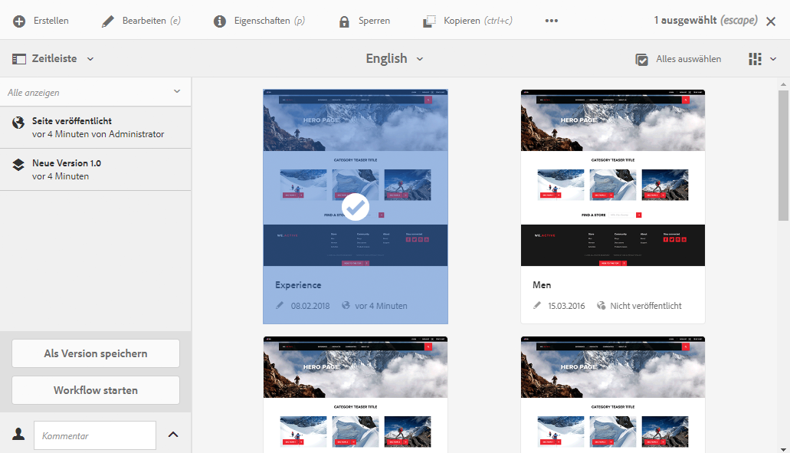
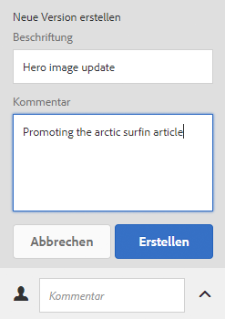
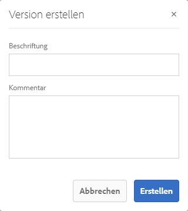
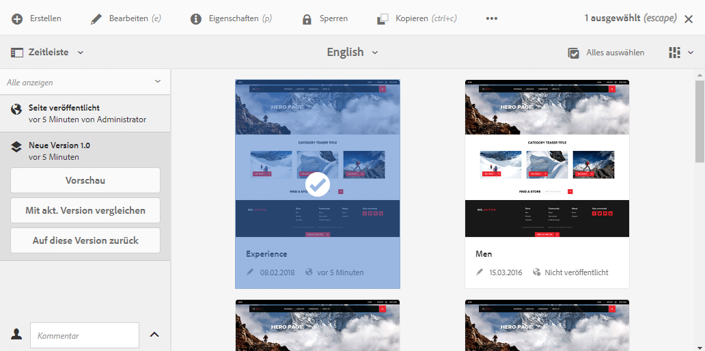
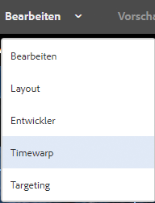
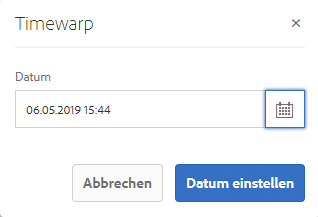
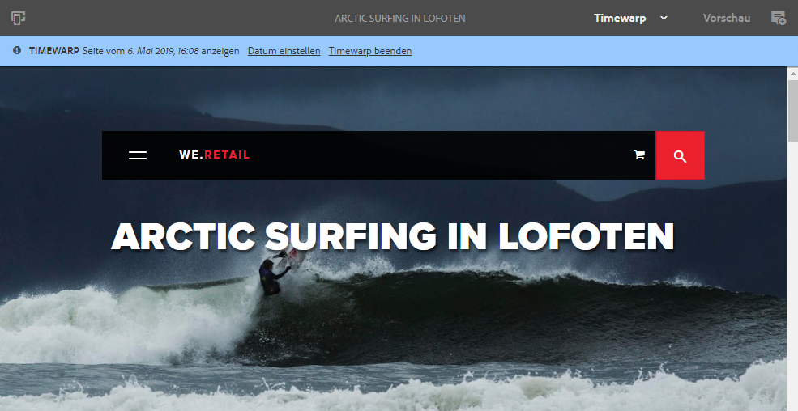

# Arbeiten mit Seitenversionen{#working-with-page-versions}

Durch die Versionierung wird die „Momentaufnahme“ einer Seite zu einem bestimmten Zeitpunkt festgehalten. Bei der Versionierung können Sie die folgenden Aktionen durchführen:

* Erstellen Sie eine Version einer Seite.
* Wiederherstellen einer früheren Version einer Seite; Beispiel:
   * , um eine Änderung rückgängig zu machen, die Sie an der Seite vorgenommen haben.
* Vergleichen der aktuellen Version einer Seite mit einer früheren Version:
   * , um Unterschiede in Text und Bildern hervorzuheben.

## Erstellen einer neuen Version {#creating-a-new-version}

Sie können eine Version Ihrer Ressource folgendermaßen erstellen:

* über die [Zeitleiste](#creating-a-new-version-timeline)
* mithilfe der Option [Erstellen](#creating-a-new-version-create-with-a-selected-resource) (wenn eine Ressource ausgewählt ist)

### Erstellen einer neuen Version – Zeitleiste {#creating-a-new-version-timeline}

1. Navigieren Sie zu der Seite, für die Sie eine Version erstellen möchten.
1. Wählen Sie die Seite im [Auswahlmodus](/help/sites-authoring/basic-handling.md#viewing-and-selecting-resources).
1. Öffnen Sie die Spalte **Zeitleiste**.
1. Klicken/tippen Sie auf die Pfeilspitze neben dem Kommentarfeld, um die Optionen anzuzeigen:

   

1. Wählen Sie **Als Version speichern**.
1. Geben Sie eine **Beschriftung** an und ggf. einen **Kommentar** ein.

   

1. Bestätigen Sie die neue Version, indem Sie auf **Erstellen** klicken.

   Die Informationen in der Timeline werden entsprechend der neuen Version aktualisiert.

### Erstellen einer neuen Version – Erstellen mit einer ausgewählten Ressource {#creating-a-new-version-create-with-a-selected-resource}

1. Navigieren Sie zu der Seite, für die Sie eine Version erstellen möchten.
1. Wählen Sie die Seite im [Auswahlmodus](/help/sites-authoring/basic-handling.md#viewing-and-selecting-resources).
1. Wählen Sie die **Erstellen** in der Symbolleiste, um das Dialogfeld zu öffnen.
1. Im Dialogfeld können Sie eine **Titel** und **Kommentar**, falls erforderlich:

   

1. Bestätigen Sie die neue Version, indem Sie auf **Erstellen** klicken.

   Die Informationen in der Timeline werden entsprechend der neuen Version aktualisiert.

## Reaktivierung von Versionen {#reinstating-versions}

Nachdem Sie eine Version Ihrer Seite erstellt haben, gibt es verschiedene Methoden, eine ältere Version zu reaktivieren:

* die Option **Auf diese Version zurück** in der [Zeitleiste](/help/sites-authoring/basic-handling.md#timeline).

  Reaktivieren Sie eine frühere Version einer ausgewählten Seite.

* die Optionen zum **Wiederherstellen** in der oberen [Symbolleiste für Aktionen](/help/sites-authoring/basic-handling.md#actions-toolbar)

   * **Version wiederherstellen**

     Reaktivieren Sie Versionen bestimmter Seiten im derzeit ausgewählten Ordner; dies kann auch die Wiederherstellung von zuvor gelöschten Seiten umfassen.

   * **Baum wiederherstellen**

     Reaktivieren Sie eine Version eines gesamten Baums zu einem bestimmten Datum und einer bestimmten Uhrzeit; dies kann Seiten umfassen, die zuvor gelöscht wurden.

>[!NOTE]
>
>Wenn eine Seite reaktiviert wird, gehört die erstellte Version zu einem neuen Zweig.
>
>Beispiel:
>
>1. Erstellen Sie Versionen einer beliebigen Seite.
>1. Die anfänglichen Beschriftungen und Versionsknotennamen lauten 1.0, 1.1, 1.2 usw.
>1. Reaktivieren Sie die erste Version. in diesem Fall 1.0.
>1. Erstellen Sie erneut Versionen.
>1. Die generierten Bezeichnungen und Knotennamen lauten jetzt 1.0.0, 1.0.1, 1.0.2 usw.

### Auf eine Version zurücksetzen {#revert-to-a-version}

So können Sie die ausgewählte Seite in einer früheren Version **wiederherstellen**:

1. Navigieren Sie zu der Seite, die Sie zu einer früheren Version wiederherstellen möchten.
1. Wählen Sie die Seite im [Auswahlmodus](/help/sites-authoring/basic-handling.md#viewing-and-selecting-resources).
1. Öffnen Sie die **Zeitleiste** und wählen Sie entweder **Alle anzeigen** oder **Versionen** aus. Die Seitenversionen für die ausgewählte Seite werden aufgelistet.
1. Wählen Sie die Version aus, zu der Sie zurückkehren möchten. Die möglichen Optionen werden angezeigt:

   

1. Wählen Sie **Auf diese Version zurück**. Die ausgewählte Version wird wiederhergestellt und die Informationen in der Timeline aktualisiert.

### Version wiederherstellen {#restore-version}

Mit dieser Methode können Versionen bestimmter Seiten im aktuellen Ordner wiederhergestellt werden. Dies kann auch die Wiederherstellung von Seiten umfassen, die zuvor gelöscht wurden:

1. Navigieren Sie zum gewünschten Ordner und [wählen](/help/sites-authoring/basic-handling.md#viewing-and-selecting-resources) Sie ihn aus.

1. Wählen Sie **Wiederherstellen** und dann **Version wiederherstellen** in der oberen [Symbolleiste für Aktionen](/help/sites-authoring/basic-handling.md#actions-toolbar).

   >[!NOTE]
   >
   >Wenn eine der folgenden Optionen:
   >
   >* Sie eine einzelne Seite ausgewählt haben, die noch nie untergeordnete Seiten hatte,
   >* oder keine der Seiten im Ordner Versionen enthält,
   >
   >Dann ist die Anzeige leer, da keine Versionen verfügbar sind.

1. Die verfügbaren Versionen sind aufgeführt:

   

1. Verwenden Sie für eine bestimmte Seite die Dropdown-Auswahl unter **WIEDERHERSTELLEN ZUR VERSION** , um die erforderliche Version für diese Seite auszuwählen.

   

1. Wählen Sie in der Hauptanzeige die zu wiederherzustellende Seite aus:

   

1. Wählen Sie für die ausgewählte Version der ausgewählten Seite, die als aktuelle Version wiederhergestellt werden soll, die Option **Wiederherstellen**.

>[!NOTE]
>
>Die Reihenfolge, in der Sie eine erforderliche Seite und die zugehörige Version auswählen, ist austauschbar.

### Baum wiederherstellen {#restore-tree}

Diese Methode kann verwendet werden, um eine Version eines Baums, wie er zu einem bestimmten Datum und zu einer bestimmten Zeit war, wiederherzustellen; dies kann Seiten umfassen, die zuvor gelöscht wurden:

1. Navigieren Sie zum gewünschten Ordner und [wählen](/help/sites-authoring/basic-handling.md#viewing-and-selecting-resources) Sie ihn aus.

1. Wählen Sie **Wiederherstellen** und dann **Baum wiederherstellen** in der oberen [Symbolleiste für Aktionen](/help/sites-authoring/basic-handling.md#actions-toolbar). Die neueste Version des Baums wird angezeigt:

   

1. Verwenden Sie die Datums- und Uhrzeitauswahl unter **Neueste Versionen am Datum**, um eine andere Version des Baums auszuwählen – und zwar die, die wiederhergestellt werden soll.

1. Setzen Sie bei Bedarf das Flag **Seiten ohne Versionsangabe beibehalten**:

   * Wenn diese Option aktiviert (ausgewählt) ist, werden alle Seiten ohne Versionierung beibehalten und von der Wiederherstellung nicht beeinflusst.

   * Wenn diese Option deaktiviert (nicht ausgewählt) ist, werden alle Seiten ohne Versionierung entfernt, da sie nicht in der versionierten Struktur vorhanden waren.

1. Wählen Sie **Wiederherstellen** für die ausgewählte Version des Baums, die als *aktuelle* Version wiederhergestellt werden soll.

## Vorschau einer Version {#previewing-a-version}

Sie können eine Vorschau einer bestimmten Version anzeigen:

1. Navigieren Sie zu der Seite, die Sie vergleichen möchten.
1. Wählen Sie die Seite im [Auswahlmodus](/help/sites-authoring/basic-handling.md#viewing-and-selecting-resources).
1. Öffnen Sie die **Zeitleiste** und wählen Sie entweder **Alle anzeigen** oder **Versionen** aus.
1. Die Seitenversionen werden aufgelistet. Wählen Sie die Version aus, die Sie in der Vorschau anzeigen möchten:

   

1. Wählen Sie **Vorschau**. Die Seite wird auf einer neuen Registerkarte angezeigt.

   >[!CAUTION]
   >
   >Wenn eine Seite verschoben wurde, können Sie keine Vorschau von Versionen mehr anzeigen, die vor dem Verschieben erstellt wurden.
   >
   >* Wenn Probleme bei der Vorschau auftreten, überprüfen Sie in der [Zeitleiste](/help/sites-authoring/basic-handling.md#timeline) der Seite, ob die Seite verschoben wurde.

## Vergleichen einer Version mit der aktuellen Seite {#comparing-a-version-with-current-page}

So vergleichen Sie eine frühere Version mit der aktuellen Seite:

1. Navigieren Sie zu der Seite, die Sie vergleichen möchten.
1. Wählen Sie die Seite im [Auswahlmodus](/help/sites-authoring/basic-handling.md#viewing-and-selecting-resources).
1. Öffnen Sie die **Zeitleiste** und wählen Sie entweder **Alle anzeigen** oder **Versionen** aus.
1. Die Seitenversionen werden aufgelistet. Wählen Sie die Version aus, die Sie vergleichen möchten:

   

1. Wählen Sie **Mit aktueller Version vergleichen** aus. Die [Seitenvergleich](/help/sites-authoring/page-diff.md) geöffnet, um die Unterschiede anzuzeigen.

## Timewarp {#timewarp}

Timewarp ist eine Funktion, die den *Veröffentlichungsstatus* einer Seite zu einer bestimmten Zeit in der Vergangenheit simuliert.

>[!TIP]
>
>[Timewarp kann auch mit Launches verwendet werden, um eine Vorschau der Zukunft anzuzeigen](/help/sites-authoring/launches.md), wenn AEM 6.5.10.0 oder höher ausgeführt wird.

Die Inhaltserstellung ist ein fortlaufender und kollaborativer Prozess. Timewarp ermöglicht es Autoren, die veröffentlichte Website im Laufe der Zeit zu verfolgen, damit sie besser verstehen können, wie sich der Inhalt verändert hat. Diese Funktion verwendet die Seitenversionen, um den Zustand der Veröffentlichungsumgebung zu bestimmen:

* Das System sucht nach der Seitenversion, die zum ausgewählten Zeitpunkt aktiv war.
   * Diese Seitenversion wurde erstellt/aktiviert. *before* den in Timewarp ausgewählten Zeitpunkt.
* Wenn Sie zu einer gelöschten Seite navigieren, wird diese ebenfalls gerendert, solange die alten Versionen der Seite noch im Repository verfügbar sind.
* Wenn keine veröffentlichte Version gefunden wird, kehrt Timewarp zum aktuellen Status der Seite in der Autorenumgebung zurück (um einen Fehler/404-Seite zu verhindern, der das Durchsuchen verhindert).

### Verwenden von Timewarp {#using-timewarp}

Timewarp ist ein [Modus](/help/sites-authoring/author-environment-tools.md#page-modes) des Seiteneditors. Um ihn zu starten, aktivieren Sie ihn einfach wie jeden anderen Modus.

1. Starten Sie den Editor für die Seite, auf der Timewarp ausgeführt werden soll, und wählen Sie in der Modusauswahl **Timewarp** aus.

   

1. Legen Sie im Dialogfeld ein Zieldatum und eine Zielzeit fest und klicken oder tippen Sie auf **Datum festlegen**. Wenn Sie keine Zeit auswählen, wird die aktuelle Zeit als Standardzeit verwendet.

   

1. Die Seite wird basierend auf dem festgelegten Datum angezeigt. Der Timewarp-Modus ist durch die blaue Statusleiste am oberen Fensterrand gekennzeichnet. Verwenden Sie die Links in der Statusleiste, um ein neues Zieldatum auszuwählen oder den Timewarp-Modus zu verlassen.

   

### Timewarp-Beschränkungen {#timewarp-limitations}

Timewarp versucht, eine Seite zu einem bestimmten Zeitpunkt zu reproduzieren. Aufgrund der Komplexität der kontinuierlichen Inhaltserstellung in AEM ist dies jedoch nicht immer möglich. Diese Einschränkungen sollten bei der Verwendung von Timewarp beachtet werden.

* **Timewarp funktioniert auf veröffentlichten Seiten** - Timewarp funktioniert nur dann vollständig, wenn Sie die Seite bereits veröffentlicht haben. Andernfalls zeigt Timewarp die aktuelle Seite in der Autorenumgebung an.
* **Timewarp verwendet Seitenversionen** - Wenn Sie zu einer Seite navigieren, die aus dem Repository entfernt/gelöscht wurde, wird sie ordnungsgemäß gerendert, wenn alte Versionen der Seite weiterhin im Repository verfügbar sind.
* **Entfernte Versionen wirken sich auf Timewarp**: Wenn Versionen aus dem Repository entfernt wurden, kann Timewarp die korrekte Ansicht nicht anzeigen.

* **Timewarp ist schreibgeschützt**: Sie können die alte Version der Seite nicht bearbeiten. Sie kann nur angezeigt werden. Wenn Sie die ältere Version wiederherstellen möchten, müssen Sie dies manuell tun, indem Sie [Wiederherstellen](#reverting-to-a-page-version).

* **Timewarp basiert nur auf dem Seiteninhalt** - Wenn sich Elemente zum Rendern der Website geändert haben, unterscheidet sich die Ansicht von der ursprünglichen Ansicht, da diese Elemente nicht im Repository versioniert werden. Zu diesen Elementen gehören u. a. Code, CSS, Assets/Bilder.

>[!CAUTION]
>
>Timewarp wurde als Tool entwickelt, um Autoren beim Verstehen und Erstellen ihres Inhalts zu unterstützen. Es ist nicht als Prüfprotokoll oder zu rechtlichen Zwecken gedacht.
