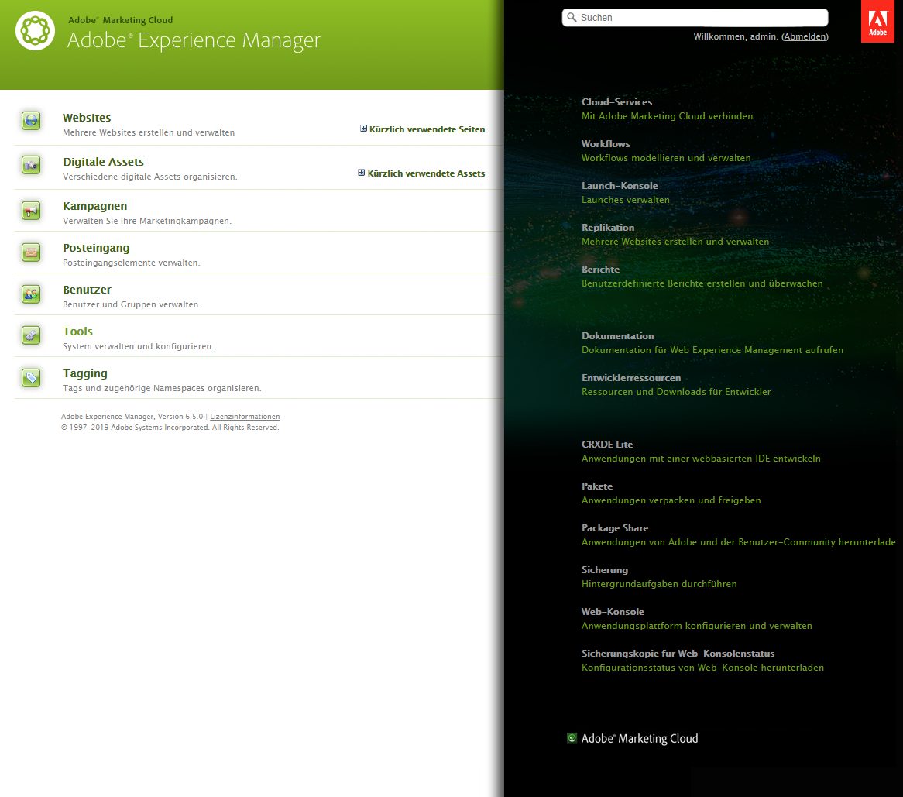
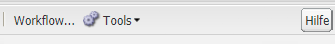
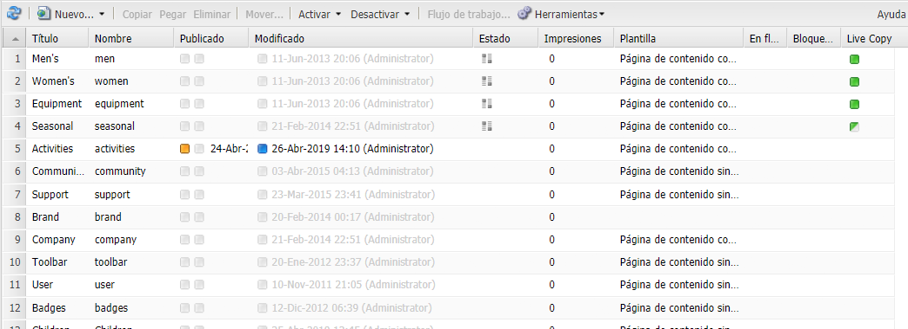
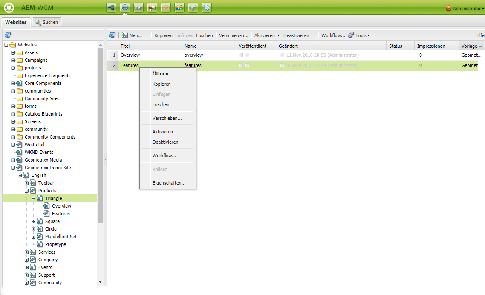

# Grundlegende Handhabung{#basic-handling}

>[!NOTE]
>
>* Diese Seite soll einen Überblick über die grundlegende Handhabung der AEM-Autorenumgebung geben. Als Grundlage wird die **Sites-Konsole** verwendet.
   >
   >
* Einige Funktionen stehen nicht in allen Konsolen zur Verfügung bzw. in einigen Konsolen können zusätzliche Funktionen zur Verfügung stehen. Detaillierte Informationen zu den einzelnen Konsolen und ihren jeweiligen Funktionen finden Sie auf den anderen Seiten.
>* In AEM stehen verschiedene Tastaturbefehle zur Verfügung, insbesondere bei [der Verwendung von Konsolen](/help/sites-classic-ui-authoring/author-env-keyboard-shortcuts.md) und [der Bearbeitung von Seiten](/help/sites-classic-ui-authoring/classic-page-author-keyboard-shortcuts.md).

>

## Der Startbildschirm {#the-welcome-screen}

Die klassische Benutzeroberfläche bietet eine Auswahl an Konsolen anhand von bekannten Verfahren zum Navigieren und Starten von Aktionen, einschließlich Klicken, Doppelklicken und [Kontextmenüs](#context-menus).

Nach der Anmeldung wird der Begrüßungsbildschirm angezeigt, der eine Liste von Links zu Konsolen und Services aufweist:

## Konsolen {#consoles}

Die Hauptkonsolen sind: 

<table>
 <tbody>
  <tr>
   <td><strong>Konsole</strong></td>
   <td><strong>Zweck</strong></td>
  </tr>
  <tr>
   <td><strong>Willkommen</strong></td>
   <td>Bietet einen Überblick über und (über Links) direkten Zugriff auf die Hauptfunktionen von AEM.</td>
  </tr>
  <tr>
   <td><strong>Digitale Assets</strong>  </td>
   <td>In diesen Konsolen können Sie digitale Assets, wie Bilder, Videos, Dokumente und Audiodateien, importieren und <a href="/help/sites-classic-ui-authoring/classicui-assets.md">verwalten</a>. Diese Assets können dann von jeder Website verwendet werden, die auf derselben AEM-Instanz ausgeführt wird. </td>
  </tr>
  <tr>
   <td><strong>Launches</strong></td>
   <td>Hier können Sie Ihre <a href="/help/sites-classic-ui-authoring/classic-launches.md">Launches</a> verwalten. Damit können Sie Inhalte für eine künftige Version einer oder mehrerer aktivierter Webseiten entwickeln.  <i>Hinweis: In der Touch-optimierten Benutzeroberfläche ist ein Großteil der gleichen Funktionalität in der Sites-Konsole verfügbar, zusammen mit der Leiste Verweise .</i><i>Bei Bedarf ist diese Konsole über die Konsole „Tools“ erreichbar. Wählen Sie „Vorgänge“ gefolgt von „Launches“.</i></td>
  </tr>
  <tr>
   <td><strong>Posteingang </strong></td>
   <td>In vielen Fällen sind mehrere Personen an den Unteraufgaben eines Workflows beteiligt, wobei jede Person ihren Schritt abschließen muss, bevor die Arbeit an die nächste Person weitergegeben werden kann. Im Posteingang können Sie Benachrichtigungen zu solchen Aufgaben einsehen. Siehe <a href="/help/sites-administering/workflows.md">Arbeiten mit Workflows</a>.   </td>
  </tr>
  <tr>
   <td><strong>Tagging</strong></td>
   <td>In der Konsole „Tagging“ können Sie Tags verwalten. Bei Tags handelt es sich um kurze Namen oder Begriffe, mit denen Sie Inhaltsbereiche kommentieren können, sodass diese leichter gefunden und organisiert werden können. Weitere Informationen dazu finden Sie unter <a href="/help/sites-classic-ui-authoring/classic-feature-tags.md">Verwenden und Verwalten von Tags</a>.</td>
  </tr>
  <tr>
   <td><strong>Tools</strong></td>
   <td>Die Konsolen <a href="/help/sites-administering/tools-consoles.md">Tools</a> bieten Zugriff auf eine Vielzahl spezialisierter Tools und Konsolen, mit denen Sie Websites, digitale Assets und andere Bereiche Ihres Inhalts-Repositorys verwalten können.</td>
  </tr>
  <tr>
   <td><strong>Benutzer</strong></td>
   <td>Mit diesen Konsolen können Sie Zugriffsrechte für Benutzer und Gruppen verwalten. Nähere Informationen dazu finden Sie unter <a href="/help/sites-administering/security.md">Benutzerverwaltung und Sicherheit</a>.  </td>
  </tr>
  <tr>
   <td><strong>Websites</strong></td>
   <td>Mit der Konsole „Sites/Websites“ können Sie <a href="/help/sites-classic-ui-authoring/classic-page-author.md">Websites erstellen, anzeigen und verwalten</a>, die auf Ihrer AEM-Instanz ausgeführt werden. In diesen Konsolen können Sie Website-Seiten erstellen, kopieren und verschieben, Workflows starten und Seiten aktivieren (veröffentlichen). Sie können auch eine Seite zur Bearbeitung öffnen.  </td>
  </tr>
  <tr>
   <td><strong>Workflows</strong></td>
   <td>Bei einem Workflow handelt es sich um eine definierte Abfolge von Schritten, die zum Ausführen einer bestimmten Aufgabe erforderlich sind. In vielen Fällen sind mehrere Personen an einer Aufgabe beteiligt und jede Person muss Ihren Schritt abschließen, bevor die Arbeit an die nächste Person weitergegeben wird. In der Konsole „Workflow“ können Sie Workflow-Modelle erstellen und Workflow-Instanzen verwalten, die ausgeführt werden. Siehe <a href="/help/sites-administering/workflows.md">Arbeiten mit Workflows</a>.  </td>
  </tr>
 </tbody>
</table>

Die Konsole **Websites** enthält zwei Bereiche, in denen Sie Ihre Seiten verwalten und darin navigieren können:

* Linker Bereich

   Dies zeigt die Baumstruktur Ihrer Websites und die Seiten innerhalb dieser Websites.

   Er enthält außerdem Informationen zu anderen Optionen in AEM, einschließlich Projekten, Blueprints und Assets.

* Rechter Bereich

   Dies zeigt die Seiten (an der im linken Bereich ausgewählten Stelle) an und kann für Aktionen verwendet werden.

Hier können Sie [Ihre Seiten verwalten](/help/sites-authoring/managing-pages.md). Dabei können Sie die Symbolleiste oder ein Kontextmenü verwenden oder eine Seite für weitere Aktionen öffnen.

>[!NOTE]
>
>Die grundlegende Handhabung ist in allen Konsolen gleich. Dieser Abschnitt konzentriert sich auf die Konsole **Websites**, da diese bei der Bearbeitung die Hauptkonsole ist.

## Aufrufen der Hilfe {#accessing-help}

In verschiedenen Konsolen (z. B. „Websites“) finden Sie auch die Schaltfläche **Hilfe**, mit der Sie entweder Package Share oder die Dokumentations-Website öffnen können.

Beim Bearbeiten einer Seite enthält der [Sidekick ebenfalls eine Schaltfläche, mit der Sie auf die Hilfe zugreifen können](/help/sites-classic-ui-authoring/classic-page-author-env-tools.md#accessing-help).

## Navigieren mit der Websites-Konsole {#navigating-with-the-websites-console}

In der Konsole **Websites** werden die Inhaltsseiten im linken Fenster in einer Baumstruktur aufgelistet. Um die Navigation zu vereinfachen, können einzelne Abschnitte der Baumstruktur je nach Bedarf eingeblendet (+) bzw. ausgeblendet (-) werden:

* Ein einfacher Klick auf den Namen einer Seite im linken Fenster hat folgende Auswirkungen:

   * Die untergeordneten Seiten werden im rechten Fenster angezeigt.
   * Die Baumstruktur im linken Fenster wird eingeblendet. 

      Zur Vermeidung von Leistungsproblemen hängt diese Option von der Anzahl der untergeordneten Knoten ab. Bei einer Standardinstallation wird die Baumstruktur eingeblendet, wenn höchstens `30` untergeordnete Knoten vorhanden sind.

* Durch Doppelklicken auf den Seitennamen (linker Bereich) wird die Baumstruktur ebenfalls eingeblendet, durch das gleichzeitige Öffnen der Seite ist dieser Effekt aber nicht so offensichtlich.

>[!NOTE]
>
>Der Standardwert (`30`) kann konsolenweise in den anwendungsspezifischen Konfigurationen des SiteAdmin-Widgets geändert werden:
>
>Führen Sie im SiteAdmin-Knoten folgende Aktionen durch:
>
>Ändern Sie den Wert der Eigenschaft:
>`treeAutoExpandMax`
>in:
>`/apps/wcm/core/content/siteadmin`
>
>Sie können die Einstellung auch global im Thema ändern:
>Ändern Sie den Wert von:
>`TREE_AUTOEXPAND_MAX`
>in:
>`/apps/cq/ui/widgets/themes/default/widgets/wcm/SiteAdmin.js`
>
>Weitere Einzelheiten hierzu finden Sie unter [SiteAdmin in der CQ Widget-API](https://helpx.adobe.com/experience-manager/6-5/sites/developing/using/reference-materials/widgets-api/index.html?class=CQ.wcm.SiteAdmin).

## Seiteninformationen in der Websites-Konsole {#page-information-on-the-websites-console}

Im rechten Bereich der Konsole **Websites** finden Sie eine Listenansicht mit Informationen zu den Seiten:

Die folgenden sind verfügbar, ein Teil dieser Felder wird standardmäßig angezeigt:

<table>
 <tbody>
  <tr>
   <td><strong>Spalte</strong></td>
   <td><strong>Beschreibung</strong></td>
  </tr>
  <tr>
   <td>Miniaturansicht</td>
   <td>Zeigt eine Miniatur der Seite an.</td>
  </tr>
  <tr>
   <td>Titel</td>
   <td>Der Titel, der auf der Seite erscheint.</td>
  </tr>
  <tr>
   <td>Name</td>
   <td>Der Name, unter dem AEM auf die Seite verweist.</td>
  </tr>
  <tr>
   <td>Veröffentlicht</td>
   <td>Zeigt an, ob die Seite veröffentlicht wurde, und liefert Datum und Uhrzeit der Veröffentlichung.</td>
  </tr>
  <tr>
   <td>Geändert</td>
   <td>Zeigt an, ob die Seite geändert wurde, und liefert Datum und Uhrzeit der Änderung. Um Änderungen zu speichern, müssen Sie die Seite aktivieren.</td>
  </tr>
  <tr>
   <td>Scene7-Veröffentlichungsstatus</td>
   <td>Zeigt an, ob die Seite in Scene7 veröffentlicht wurde.  </td>
  </tr>
  <tr>
   <td>Status</td>
   <td>Zeigt aktuelle Statusinformationen über die Seite an, z. B. ob sie Teil eines Workflows bzw. einer Live Copy oder derzeit gesperrt ist.</td>
  </tr>
  <tr>
   <td>Impressionen</td>
   <td>Zeigt die Aktivität auf einer Seite anhand der Zahl der Seitenaufrufe (Impressionen).</td>
  </tr>
  <tr>
   <td>Vorlage</td>
   <td>Zeigt die Vorlage, auf der die Seite basiert.</td>
  </tr>
  <tr>
   <td>In Workflow</td>
   <td>Zeigt an, ob die Seite sich in einem Workflow befindet.</td>
  </tr>
  <tr>
   <td>Gesperrt durch</td>
   <td>Zeigt an, ob eine Seite gesperrt wurde und von welchem Benutzerkonto sie gesperrt wurde.</td>
  </tr>
  <tr>
   <td>Live Copy</td>
   <td>Zeigt an, ob die Seite Teil einer Live Copy ist.</td>
  </tr>
 </tbody>
</table>

>[!NOTE]
>
>Um die sichtbaren Spalten auszuwählen, bewegen Sie den Mauszeiger auf einen Spaltenkopf. Ein Dropdown-Menü wird angezeigt, in dem Sie die Option **Spalten** finden.

Die Farben neben den Seiten in den Spalten **Veröffentlicht** und **Geändert** zeigen den jeweiligen Veröffentlichungsstatus an:

| **Spalte** | **Farbe** | **Beschreibung** |
|---|---|---|
| Veröffentlicht | Grün | Erfolgreich veröffentlicht. Der Inhalt ist veröffentlicht. |
| Veröffentlicht | Gelb | Veröffentlichung steht aus. Die Veröffentlichung wurde nicht bestätigt. |
| Veröffentlicht | Rot | Keine Veröffentlichung. Es besteht keine Verbindung zur Veröffentlichungsinstanz. Dieser Status kann auch bedeuten, dass der Inhalt deaktiviert wurde. |
| Veröffentlicht | *leer* | Diese Seite war noch nie veröffentlicht. |
| Geändert | Blau | Seite wurde seit der letzten Veröffentlichung geändert. |
| Geändert | *leer* | Diese Seite wurde noch nie geändert, auch nicht seit der letzten Veröffentlichung. |

## Context Menus {#context-menus}

Die klassische Benutzeroberfläche nutzt für die Navigation und für das Starten von Aktionen vertraute Mechanismen wie Klicks oder Doppelklicks. Abhängig von der aktuellen Situation ist außerdem eine Reihe von Kontextmenüs verfügbar (diese werden im Allgemeinen per Rechtsklick aufgerufen):

