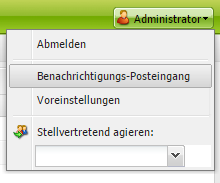
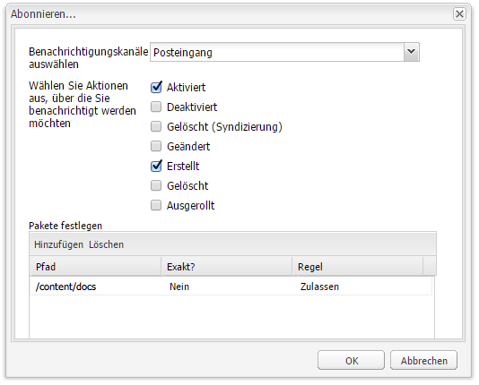
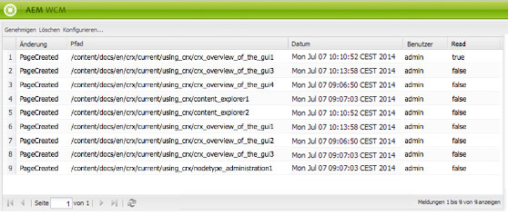

# Ihr Posteingang{#your-inbox}

Sie können Benachrichtigungen aus verschiedenen Bereichen von AEM erhalten, z. B. Benachrichtigungen zu Arbeitselementen oder Aufgaben, die Aktionen darstellen, die Sie für Seiteninhalte ausführen müssen.

Diese Benachrichtigungen werden je nach Benachrichtigungstyp in zwei verschiedene Posteingänge zugestellt:

* Ein Posteingang, in dem Sie die Benachrichtigungen sehen können, die Sie durch Abonnements erhalten, wird im folgenden Abschnitt beschrieben.
* Ein spezieller Posteingang für Workflow-Elemente wird im Dokument [Teilnehmen an Workflows](/help/sites-classic-ui-authoring/classic-workflows-participating.md) beschrieben.

## Anzeigen Ihrer Benachrichtigungen {#viewing-your-notifications}

So zeigen Sie Ihre Benachrichtigungen an:

1. Öffnen Sie den Benachrichtigungs-Posteingang: im **Websites** Konsole, klicken Sie auf die Benutzerschaltfläche oben rechts und wählen Sie **Benachrichtigungs-Posteingang**.

   

   >[!NOTE]
   >
   >Sie können auch direkt im Browser auf die Konsole zugreifen. Beispiel:
   >
   >
   >` https://<host>:<port>/libs/wcm/core/content/inbox.html`

1. Ihre Benachrichtigungen werden aufgelistet. Sie können nach Bedarf Aktionen durchführen:

   * [Abonnieren von Benachrichtigungen](#subscribing-to-notifications)
   * [Verarbeiten von Benachrichtigungen](#processing-your-notifications)

   

## Abonnieren von Benachrichtigungen {#subscribing-to-notifications}

So abonnieren Sie Benachrichtigungen:

1. Öffnen Sie den Benachrichtigungs-Posteingang: im **Websites** Konsole, klicken Sie auf die Benutzerschaltfläche oben rechts und wählen Sie **Benachrichtigungs-Posteingang**.

   

   >[!NOTE]
   >
   >Sie können auch direkt im Browser auf die Konsole zugreifen. Beispiel:
   >
   >
   >`https://<host>:<port>/libs/wcm/core/content/inbox.html`

1. Klicks **Konfigurieren...** in der oberen linken Ecke, um das Konfigurationsdialogfeld zu öffnen.

   

1. Wählen Sie den Benachrichtigungskanal aus:

   * **Posteingang**: Benachrichtigungen werden in Ihrem AEM Posteingang angezeigt.
   * **Email**: Benachrichtigungen werden per E-Mail an die in Ihrem Benutzerprofil definierte E-Mail-Adresse gesendet.

   >[!NOTE]
   >
   >Einige Einstellungen müssen konfiguriert werden, um per E-Mail benachrichtigt zu werden. Außerdem können Sie die E-Mail-Vorlage anpassen oder eine E-Mail-Vorlage für eine neue Sprache hinzufügen. Informationen zum Konfigurieren von E-Mail-Benachrichtigungen in AEM finden Sie unter [Konfigurieren von E-Mail-Benachrichtigungen](/help/sites-administering/notification.md#configuringemailnotification).

1. Wählen Sie die Seitenaktionen aus, für die Sie eine Benachrichtigung erhalten möchten:

   * Aktiviert: wenn eine Seite aktiviert wurde.
   * Deaktiviert: wenn eine Seite deaktiviert wurde.
   * Gelöscht (Syndikation): wenn eine Seite gelöscht/repliziert wurde, d. h. wenn eine auf einer Seite ausgeführte Löschaktion repliziert wird.
Wenn eine Seite gelöscht oder verschoben wird, wird automatisch eine Löschaktion repliziert: Die Seite wird in der Quellinstanz, in der die Löschaktion durchgeführt wurde, und in der von den Replikationsagenten definierten Zielinstanz gelöscht.

   * Geändert: wenn eine Seite geändert wurde.
   * Erstellt: wenn eine Seite erstellt wurde.
   * Gelöscht: wenn eine Seite durch eine Seitenlöschaktion gelöscht wurde.
   * Ausgerollt: wenn ein Rollout einer Seite durchgeführt wurde.

1. Definieren Sie die Pfade der Seiten, für die Sie benachrichtigt werden wollen:

   * Klicken Sie auf **Hinzufügen**, um der Tabelle eine neue Zeile hinzuzufügen.
   * Klicken Sie auf **Pfad** Tabellenzelle und geben Sie den Pfad ein, beispielsweise `/content/docs`.

   * Um über alle Seiten des Unterbaums benachrichtigt zu werden, legen Sie **Exakt?** auf **Nein**.
Um über nur über die angegebene Seite Benachrichtigungen zu erhalten, setzen Sie **Exakt?** auf **Ja**.

   * Um die Regel zuzulassen, legen Sie **Regel** auf **Zulassen** fest. Wenn dies auf **Ablehnen** festgelegt ist, wird die Regel deaktiviert, aber nicht entfernt und kann später zugelassen werden.

   Um eine Definition zu entfernen, wählen Sie die Zeile aus, indem Sie auf eine Tabellenzelle klicken, und klicken Sie auf **Löschen**.

1. Klicken Sie auf **OK**, um die Konfiguration zu speichern.

## Verarbeiten von Benachrichtigungen {#processing-your-notifications}

Wenn Sie sich für den Erhalt von Benachrichtigungen in Ihrem AEM-Posteingang entschieden haben, werden in Ihrem Posteingang Benachrichtigungen angezeigt. Sie können [Anzeigen von Benachrichtigungen](#viewing-your-notifications)und wählen Sie dann die erforderlichen Benachrichtigungen aus, um:

* Genehmigen durch Klicken auf **Genehmigen**, woraufhin der Wert in der Spalte **Lesen** auf **true** gesetzt wird.

* Löschen durch Klicken auf **Löschen**.

