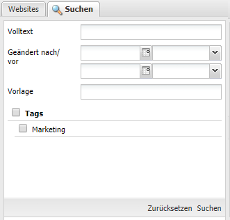
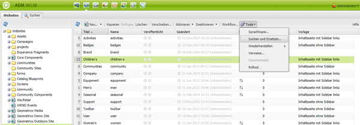
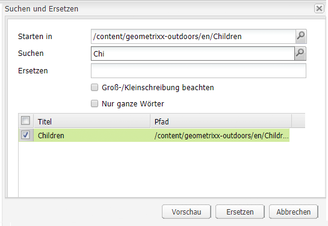

# Suchen{#searching}

Die Autorenumgebung von AEM bietet abhängig vom Ressourcentyp verschiedene Möglichkeiten zur Inhaltssuche.

>[!NOTE]
>
>Außerhalb der Autorenumgebung stehen auch andere Mechanismen für die Suche zur Verfügung, z. B. die [Query Builder](/help/sites-developing/querybuilder-api.md) und [CRXDE Lite](/help/sites-developing/developing-with-crxde-lite.md).

## Grundlagen zur Suche {#search-basics}

Um den Suchbereich aufzurufen, klicken Sie in der jeweiligen Konsole im linken Bereich oben auf die Registerkarte **Suchen**.

Im Suchbereich können Sie alle Seiten Ihrer Website durchsuchen. Er enthält Felder und Widgets für folgende Zwecke:

* **Volltext**: Nach dem angegebenen Text suchen
* **Geändert nach/vor**: Suchen Sie nur die Seiten, die zwischen den spezifischen Datumsangaben geändert wurden.
* **Vorlage**: Suche nur nach den Seiten, die auf der angegebenen Vorlage basieren
* **Tags**: Suche nur nach Seiten mit den angegebenen Tags

>[!NOTE]
>
>Wenn Ihre Instanz für die [Lucene-Recherche](/help/sites-deploying/queries-and-indexing.md) konfiguriert ist, können Sie folgende Elemente unter **Volltext** verwenden:
>
>* [Platzhalter](https://lucene.apache.org/core/5_3_1/queryparser/org/apache/lucene/queryparser/classic/package-summary.html#Wildcard_Searches) 
>* [Boolesche Operatoren](https://lucene.apache.org/core/5_3_1/queryparser/org/apache/lucene/queryparser/classic/package-summary.html#Boolean_operators)
>
>* [Reguläre Ausdrücke](https://lucene.apache.org/core/5_3_1/queryparser/org/apache/lucene/queryparser/classic/package-summary.html#Regexp_Searches)
>* [Feld-Gruppierung](https://lucene.apache.org/core/5_3_1/queryparser/org/apache/lucene/queryparser/classic/package-summary.html#Field_Grouping) 
>* [Verstärken](https://lucene.apache.org/core/5_3_1/queryparser/org/apache/lucene/queryparser/classic/package-summary.html#Boosting_a_Term)
>

Starten Sie die Suche, indem Sie unten im Bereich auf **Suchen** klicken. Klicken **Zurücksetzen** , um die Suchkriterien zu löschen.

## Filter {#filter}

An verschiedenen Stellen kann ein Filter festgelegt (und gelöscht) werden, um Ihre Ansicht weiter aufzuschlüsseln und zu verfeinern:

## Suchen und Ersetzen {#find-and-replace}

Im **Websites** Konsole **Suchen und Ersetzen** -Menüoption können Sie innerhalb eines Bereichs der Website nach mehreren Instanzen einer Zeichenfolge suchen und diese ersetzen.

1. Wählen Sie die Stammseite bzw. den Ordner aus, in dem die Aktion &quot;Suchen und Ersetzen&quot;stattfinden soll.
1. Auswählen **Instrumente** then **Suchen und Ersetzen**:

   

1. Die **Suchen und Ersetzen** Das Dialogfeld führt Folgendes aus:

   * bestätigt den Stammpfad, an dem die Suchaktion beginnen soll
   * definiert den zu suchenden Begriff
   * definiert den Begriff, der ihn ersetzen soll
   * gibt an, ob bei der Suche die Groß-/Kleinschreibung beachtet werden soll
   * gibt an, ob nur ganze Wörter gefunden werden sollen (andernfalls werden auch Unterzeichenfolgen gefunden)

   Durch Klicken auf **Vorschau** werden die Stellen aufgelistet, an denen der Begriff gefunden wurde. Sie können bestimmte Instanzen markieren bzw. deren Markierung aufheben:

   

1. Klicken **Ersetzen** , um alle Instanzen zu ersetzen. Sie werden aufgefordert, den Vorgang zu bestätigen.

Der Standardumfang für das Servlet „Suchen und Ersetzen“ deckt die folgenden Eigenschaften ab:

* `jcr:title`
* `jcr:description`
* `jcr:text`
* `text`

Dieser Bereich kann mithilfe der Apache Felix Web Management Console geändert werden (z. B. unter`https://localhost:4502/system/console/configMgr`). Wählen Sie `CQ WCM Find Replace Servlet (com.day.cq.wcm.core.impl.servlets.FindReplaceServlet)` aus und konfigurieren Sie den Bereich nach Bedarf.

>[!NOTE]
>
>In einer standardmäßigen AEM-Installation verwendet &quot;Suchen und Ersetzen&quot;Lucene für die Suchfunktion.
>
>Lucene indiziert Zeichenfolgen mit bis zu 16K Länge. Mehr Zeichenfolgen werden nicht durchsucht.
