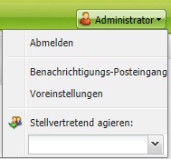
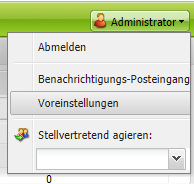
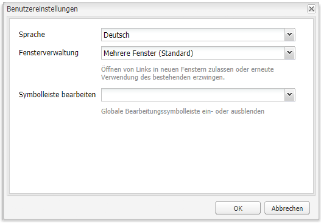

# Konfigurieren der Kontoumgebung{#configuring-your-account-environment}

AEM bietet Ihnen die Möglichkeit, Ihr Konto und bestimmte Aspekte der Autorenumgebung zu konfigurieren.

Über die [Kontoeinstellungen](#account-settings) und [Benutzereinstellungen](#user-preferences) können die folgenden Optionen und Einstellungen definiert werden:

* **Bearbeitungssymbolleiste** Legen Sie fest, ob die globale Bearbeitungssymbolleiste angezeigt werden soll. Diese Symbolleiste, die oben im Browser-Fenster angezeigt wird, bietet Ihnen 
**Kopieren**,  **Ausschneiden**,  **Einfügen**,  **** Löschen für die Verwendung mit den Absatzkomponenten auf dieser Seite:

   * Bei Bedarf anzeigen (Standardeinstellung)
   * Immer anzeigen
   * Ausblendung beibehalten

* **Identität annehmen als**
Mit der Funktion [Identität annehmen als](/help/sites-administering/security.md#impersonating-another-user) kann ein Benutzer im Namen eines anderen Benutzers arbeiten.

* ****
SpracheDie Sprache, die für die Benutzeroberfläche der Authoring-Umgebung verwendet werden soll. Wählen Sie in der Liste die gewünschte Sprache aus.

* **Fensterverwaltung**
Wählen Sie entweder:

   * Mehrere Fenster (Standard)
Seiten werden in einem neuen Fenster geöffnet.
   * Einfaches Fenster
Seiten werden im aktuellen Fenster geöffnet.

## Kontoeinstellungen {#account-settings}

Über das Benutzersymbol haben Sie Zugang zu den folgenden Optionen:

* Abmelden
* [Identität annehmen als](/help/sites-administering/security.md#impersonating-another-user)
* [Benutzereinstellungen](#user-preferences)
* [Benachrichtigungs-Posteingang](/help/sites-classic-ui-authoring/author-env-inbox.md)

### Benutzereinstellungen {#user-preferences}

Jeder Benutzer kann bestimmte Eigenschaften für sich selbst festlegen. Der Zugriff auf diese Funktion erfolgt über das Dialogfeld **Voreinstellungen** in der oberen rechten Ecke der Konsolen. 

Im Dialogfeld finden Sie die folgenden Optionen:

