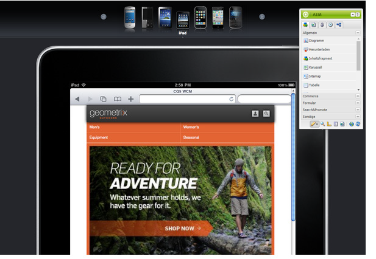

# Verfassen einer Seite für Mobilgeräte{#authoring-a-page-for-mobile-devices}

Wenn Sie eine Seite für Mobilgeräte bearbeiten, wird die Seite so angezeigt, dass das Mobilgerät emuliert wird. Beim Bearbeiten der Seite können Sie zwischen verschiedenen Emulatoren wechseln, um zu sehen, was der Endbenutzer sieht, wenn auf er die Seite zugreift.

Geräte sind entsprechend ihrer Fähigkeit zur Wiedergabe einer Seite in die Kategorien „Feature“, „Smart“ und „Touch“ eingeteilt. Wenn der Endbenutzer auf eine Seite für Mobilgeräte zugreift, ermittelt AEM das entsprechende Gerät und sendet die zu der entsprechenden Gerätegruppe gehörige Version der Seite.

>[!NOTE]
>
>Zur Erstellung einer Website für Mobilgeräte auf der Grundlage einer bestehenden Standard-Site erstellen Sie eine Live Copy der Standard-Site. (Siehe [Erstellen einer Live Copy für verschiedene Kanäle](/help/sites-administering/msm-livecopy.md).)
>
>AEM-Entwickler können neue Gerätegruppen erstellen. (Siehe [Erstellen von Gerätegruppenfiltern.](/help/sites-developing/groupfilters.md))

Gehen Sie wie folgt vor, um eine Seite für Mobilgeräte zu erstellen:

1. Rufen Sie im Browser die Konsole **Siteadmin** auf.
1. Öffnen Sie die Seite **Produkte** unterhalb von **Websites** >> **Geometrixx Mobile Demo Site**  >>  **Englisch**.

1. Wechseln Sie zu einem anderen Emulator. Dazu haben Sie folgende Möglichkeiten:

   * Klicken auf das Gerätesymbol am oberen Seitenrand.
   * Klicken auf die Schaltfläche **Bearbeiten** im **Sidekick** und Auswahl des Geräts im Dropdown-Menü.

1. Ziehen Sie die Komponente **Text &amp; Bild** aus der Registerkarte „Mobil“ des Sidekicks der Seite und legen Sie sie ab.
1. Bearbeiten Sie die Komponente und fügen Sie Text hinzu. Klicken Sie auf **OK**, um die Änderungen zu speichern.

Die Seite nimmt die folgende Gestalt an:

>[!NOTE]
>
>Die Emulatoren sind deaktiviert, wenn eine Seite in der Autoreninstanz von einem Mobilgerät aus aufgerufen wird. Die Bearbeitung kann dann über die Touch-optimierte Benutzeroberfläche erfolgen.
