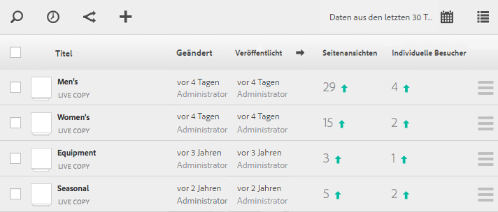

# Anzeigen von Seitenanalysedaten{#seeing-page-analytics-data}

Verwenden Sie Seitenanalysedaten, um die Wirkung des Seiteninhalts zu messen.

Seitenanalysedaten werden in der Sites-Konsole angezeigt. Wenn Websites im Listenformat angezeigt werden, sind die folgenden Spalten standardmäßig verfügbar:

* Seitenansichten
* Individuelle Besucher
* Zeit auf Seite

>[!NOTE]
>
>Die Anzeige der Site-Analysedaten direkt in der Konsole ist nur in der Touch-optimierten Benutzeroberfläche möglich. Weitere Informationen finden Sie unter [Anzeigen von Seitenanalysedaten](/help/sites-authoring/page-analytics-using.md) in der Standarddokumentation für die Bearbeitung.
