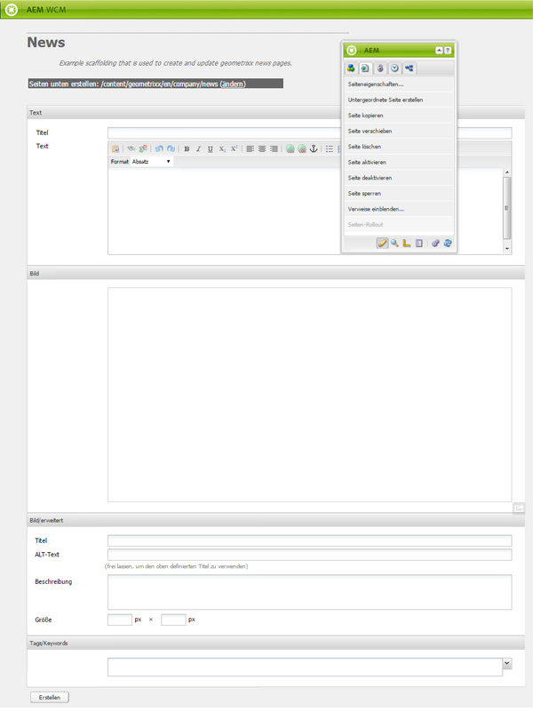
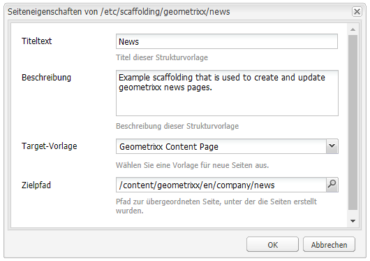
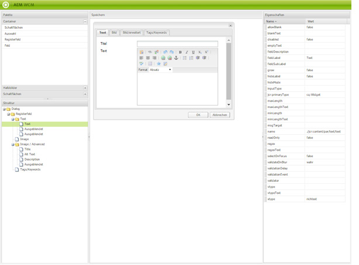
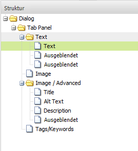
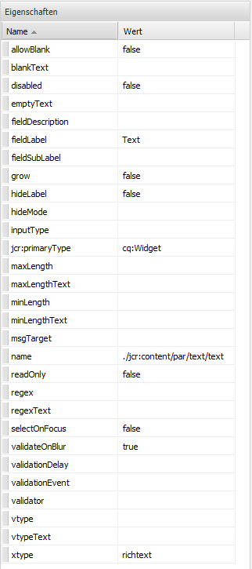
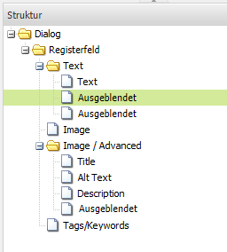
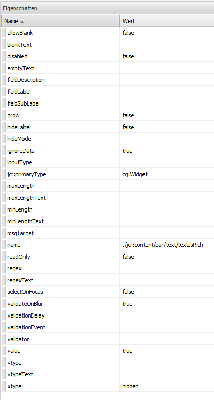
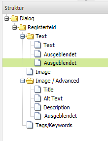
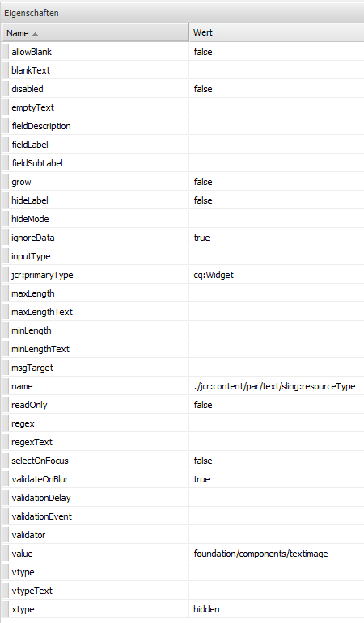
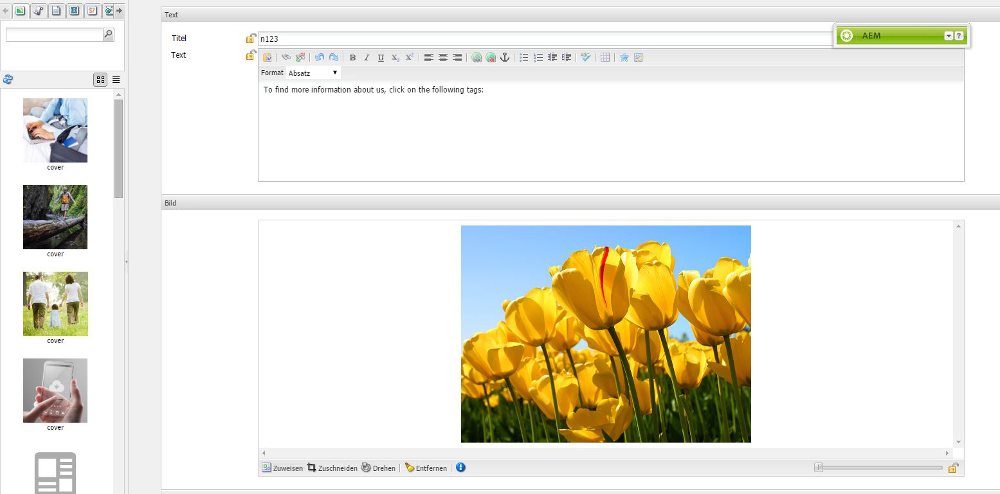

# Strukturvorlage{#scaffolding}

Oftmals muss eine große Zahl von Seiten erstellt werden, die unterschiedliche Inhalte, aber eine einheitliche Struktur aufweisen sollen. In der Standard-Benutzeroberfläche von AEM müssten Sie jede Seite neu erstellen, die entsprechenden Komponenten auf die Seiten ziehen und sie jedes Mal einzeln mit Inhalten füllen.

Eine Strukturvorlage dient zur Erstellung eines Formulars (einer Struktur), dessen Felder die gewünschte Seitenstruktur bilden. Anhand dieses Formulars können Sie ganz einfach auf dieser Struktur basierende Seiten erstellen.

>[!NOTE]
>
>Bei Strukturvorlagen (auf der klassischen Benutzeroberfläche) [wird die MSM-Vererbung berücksichtigt](#scaffolding-with-msm-inheritance).

## Funktionsweise von Strukturvorlagen {#how-scaffolding-works}

Strukturvorlagen sind über die **Tools**-Konsole des SiteAdmin-Bereichs verfügbar.

* Öffnen Sie die **Tools-Konsole** und klicken Sie auf **Standardseiten-Strukturvorlage**.
* Klicken Sie darunter auf **geometrixx**.
* Unter **geometrixx** sollte eine *Grundlagenseite* mit dem Namen **News** verfügbar sein. Doppelklicken Sie auf die Seite, um sie zu öffnen.

Die Strukturvorlage besteht aus einem Formular mit einem Feld für jedes Inhaltselement, mit dem die zu erstellende Seite gefüllt werden soll. Außerdem wird das Aussehen der Seite durch vier wichtige Parameter bestimmt, die in den **Seiteneigenschaften** der Strukturvorlagenseite festgelegt werden.

Es handelt sich dabei um die folgenden Eigenschaften:

* **Titeltext**: Dies ist der Name der Strukturvorlagen-Seite selbst. In diesem Beispiel lautet der Name „Nachrichten“.
* **Beschreibung**: Dieser Text wird unterhalb des Titels der Stukturvorlagen-Seite angezeigt.
* **Target-Vorlage**: Diese Vorlage wird von der Grundlage für die Erstellung einer neuen Seite verwendet. In diesem Beispiel ist das die Vorlage *Geometrixx-Inhaltsseite*.
* **Zielpfad**: Dies ist der Pfad der übergeordneten Seite, unterhalb derer die Grundlage neue Seiten anlegt. In diesem Beispiel lautet der Pfad */content/geometrixx/de/news*.

Der Textkörper der Strukturvorlage ist das Formular. Wenn ein Benutzer eine Seite mithilfe der Strukturvorlage erstellen möchte, füllt er das Formular aus und klickt unten auf *Erstellen*. Im Beispiel **Nachrichten** oben weist das Formular die folgenden Felder auf:

* **Titel**: Dies ist der Name der zu erstellenden Seite. Dieses Feld ist für jede Grundlage vorhanden.
* **Text**: Dieses Feld stellt eine Text-Komponente für die zu erstellende Seite dar.
* **Bild**: Dieses Feld stellt eine Bildkomponente für die zu erstellende Seite dar.
* **Bild/erweitert**: **Titel**: Der Titel des Bildes.
* **Bild/erweitert**: **ALT-Text**: Der Alt-Text des Bildes.
* **Bild/Erweitert**: **Beschreibung**: Die Beschreibung des Bildes.
* **Bild/erweitert**: **Größe**: Die Größe des Bildes.
* **Tags/Keywords**: Metadaten, die der jeweiligen Seite zugeordnet werden sollen. Dieses Feld ist für jede Grundlage vorhanden.

### Erstellen von Grundlagen {#creating-a-scaffold}

Um eine Strukturvorlage zu erstellen, wählen Sie in der **Tools**-Konsole die Option **Standardseiten-Strukturvorlage** aus und erstellen Sie eine neue Seite. Eine *Strukturvorlagen-Vorlage* ist als einseitige Vorlage verfügbar.

Legen Sie in den **Seiteneigenschaften** der neuen Seite die Optionen *Titeltext*, *Beschreibung*, *Zielvorlage* und *Zielpfad* wie oben beschrieben fest.

Als nächstes müssen Sie die Struktur der Seite festlegen, die mithilfe der Strukturvorlage erstellt wird. Um dies zu tun, wechseln Sie auf der Strukturvorlagenseite in den **[Designmodus](/help/sites-authoring/page-authoring.md#sidekick)**. Es wird ein Link angezeigt, mit dessen Hilfe Sie die Strukturvorlage im **Dialog-Editor** bearbeiten können.

Im Dialog-Editor legen Sie die Eigenschaften fest, die für jede Seite gelten, die mithilfe der Strukturvorlage erstellt wird.

Die Dialogdefinition einer Strukturvorlage wird ähnlich wie bei einer Komponente durchgeführt (siehe [Komponenten](/help/sites-developing/components.md)). Es gibt allerdings einige wichtige Unterschiede:

* Dialogdefinition von Komponenten werden als normale Dialogfelder angezeigt (wie beispielsweise im mittleren Fenster des Dialog-Editors gezeigt), während Dialogdefinitionen von Grundlagen zwar als normale Dialogfelder im Dialog-Editor erscheinen, auf der Grundlagenseite aber als Grundlagenformular angezeigt werden (wie in der Grundlage **Nachrichten** oben).
* In Dialogfeldern für Komponenten sind nur solche Werte enthalten, die für die Definition des Inhalts einer bestimmten einzelnen Komponente erforderlich sind. Im Dialogfeld für eine Grundlage sind Felder für alle Eigenschaften in allen Absätzen der zu erstellenden Seite enthalten.
* Bei Dialogfeldern für Komponenten ist die Komponente, die für das Rendern des angegebenen Inhalts verwendet wird, implizit, und daher wird die Eigenschaft `sling:resourceType` eines Absatzes automatisch bei dessen Erstellung eingefügt. Bei der Arbeit mit Grundlagen müssen alle Informationen bezüglich des Inhalts und der zugewiesenen Komponente für einen bestimmten Absatz explizit im Dialogfeld selbst angegeben werden. In müssen diese Informationen durch Felder des Typs *Ausgeblendet* angegeben werden, um bei der Erstellung einer Seite wirksam zu werden.

Ein Blick auf das für **Nachrichten** im Dialog-Editor hilft bei der Erläuterung dieser Vorgehensweise. Wechseln Sie auf der Grundlagenseite in den Designmodus und klicken Sie auf den Link für den Dialog-Editor.

Klicken Sie nun auf das Dialogfeld **Dialogfeld > Registerfeld > Text > Text**, wie in der folgenden Abbildung zu sehen:

Daraufhin wird die Eigenschaftenliste für dieses Feld auf der rechten Seite des Dialog-Editors wie folgt angezeigt:

Beachten Sie die Eigenschaft „Name“ für dieses Feld. Sie weist folgenden Wert auf:

`./jcr:content/par/text/text`

Dies ist der Name der Eigenschaft, in die der Inhalt dieses Feldes geschrieben wird, wenn die Grundlage für die Erstellung einer neuen Seite verwendet wird. Diese Eigenschaft wird als relativer Pfad in Bezug auf den Knoten der die zu erstellende Seite darstellt, angegeben. Sie gibt die Eigenschaft „text“ unterhalb des Knotens „text“ an, der unterhalb des Knotens „par“ liegt, der wiederum ein untergeordnetes Element des Knotens „jcr:content“ unterhalb des Seitenknotens darstellt.

Dadurch wird der Speicherort für den Inhalt festgelegt, der in dieses Feld eingegeben wird. Allerdings sind noch zwei weitere Eigenschaften für die Charakterisierung des Inhalts erforderlich:

* Zum einen muss angegeben werden, dass die hier gespeicherte Zeichenfolge als *Rich-Text* zu interpretieren ist,
* zum anderen muss die Komponente festgelegt werden, die für das Rendern des Inhalts auf der Seite verwendet wird.

Beachten Sie, dass Sie diese Informationen in einem normalen Komponentendialogfeld nicht angeben müssen, weil sie durch die Tatsache, dass das Dialogfeld an eine bestimmte Komponente gebunden ist, bereits vorgegeben sind.

Zur Angabe dieser beiden Informationen verwenden Sie ausgeblendete Felder. Klicken Sie auf das erste ausgeblendete Feld **Dialogfeld > Registerfeld > Text > Ausgeblendet**, wie in der folgenden Abbildung zu sehen:

Dieses ausgeblendete Feld weist folgende Eigenschaften auf:

Die Namenseigenschaft dieses ausgeblendeten Felds lautet:

`./jcr:content/par/text/textIsRich`

Hierbei handelt es sich um eine boolesche Eigenschaft für die Auswertung der Textzeichenfolge, die unter `./jcr:content/par/text/text` gespeichert ist.

Da wir wissen, dass der Text als Rich-Text ausgewertet werden soll, setzen wir die Eigenschaft `value` dieses Felds auf `true`.

>[!CAUTION]
>
>Der Dialog-Editor ermöglicht die Änderung der Werte *bestehender* Eigenschaften in der Dialogdefinition. Um eine neue Eigenschaft hinzuzufügen, muss der Benutzer [CRXDE Lite](/help/sites-developing/developing-with-crxde-lite.md) verwenden. Wird beispielsweise einer Dialogdefinition mit dem Dialog-Editor ein neues ausgeblendetes Feld hinzugefügt, weist dieses keine Eigenschaft *value* auf (d. h. keine Eigenschaft mit diesem Namen). Wenn für das betreffende ausgeblendete Feld standardmäßig eine Eigenschaft *value* festgelegt werden muss, kann dies nur manuell mithilfe eines der CRX-Werkzeuge erfolgen. Der Wert kann nicht im Dialog-Editor selbst hinzugefügt werden. Sobald allerdings die Eigenschaft vorhanden ist, kann der Wert im Dialog-Editor geändert werden.

Das zweite ausgeblendete Feld kann angezeigt werden, indem Sie wie folgt darauf klicken:

Dieses ausgeblendete Feld weist folgende Eigenschaften auf:

Die Namenseigenschaft dieses ausgeblendeten Felds lautet:

`./jcr:content/par/text/sling:resourceType`

Der feste Wert für diese Eigenschaft lautet:

`foundation/components/textimage`

 Dadurch wird festgelegt, dass die für das Rendern des Textinhalts verwendete Komponente vom Typ *Textbild* ist. Zusammen mit dem booleschen Wert `isRichText` in dem anderen ausgeblendeten Feld kann die Komponente die eigentliche unter `./jcr:content/par/text/text` gespeicherte Textzeichenfolgen wie gewünscht rendern.

### Strukturvorlagen mit MSM-Vererbung {#scaffolding-with-msm-inheritance}

Auf der klassischen Benutzeroberfläche sind Strukturvorlagen vollständig in die MSM-Vererbung integriert (sofern verfügbar).

Wenn Sie eine Seite im **Strukturvorlagenmodus** öffnen (über das Symbol im unteren Sidekick-Bereich), werden alle Komponenten, für die Vererbung gilt, folgendermaßen gekennzeichnet:

* ein Vorhängeschloss-Symbol (für die meisten Komponenten, z. B. Text und Titel)
* eine Maske mit dem Text **Klicken Sie, um die Vererbung abzubrechen** (für Bildkomponenten)

Diese zeigen an, dass die Komponente erst bearbeitet werden kann, wenn die Vererbung abgebrochen wird.

>[!NOTE]
>
>Dies ist mit [vererbten Komponenten bei der Bearbeitung von Seiteninhalten vergleichbar](/help/sites-authoring/editing-content.md#inheritedcomponentsclassicui).

Durch Klicken auf das Vorhängeschloss-Symbol oder auf das Bildsymbol können Sie die Vererbung aufheben:

* Das Symbol ändert sich in ein geöffnetes Vorhängeschloss.
* Nach erfolgter Entsperrung können Sie den Inhalt bearbeiten.

Nach dem Entsperren können Sie die Vererbung wiederherstellen, indem Sie auf das Symbol des geöffneten Vorhängeschlosses klicken. Dabei gehen jedoch alle vorgenommenen Änderungen verloren.

>[!NOTE]
>
>Wenn die Vererbung auf Seitenebene (über die Registerkarte „Live Copy“ der Seiteneigenschaften) abgebrochen wird, können alle Komponenten im **Strukturvorlagenmodus** bearbeitet werden (sie werden in entsperrtem Status angezeigt).
