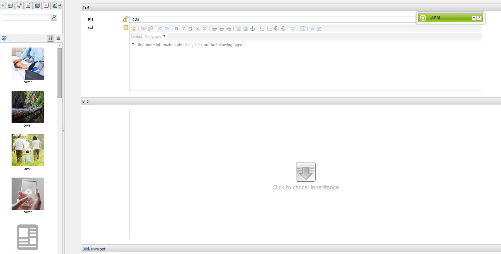

# Strukturvorlage{#scaffolding}

Manchmal müssen Sie eine große Anzahl von Seiten erstellen, die zwar die gleiche Struktur, aber unterschiedliche Inhalte aufweisen. Über die standardmäßige AEM-Benutzeroberfläche müssten Sie jede Seite erstellen, die entsprechenden Komponenten auf die Seite ziehen und sie einzeln ausfüllen.

Mit Strukturvorlage können Sie ein Formular (eine Grundlage) mit Feldern erstellen, die die gewünschte Struktur für Ihre Seiten widerspiegeln. Mithilfe dieses Formulars können Sie dann einfach Seiten erstellen, die auf dieser Struktur basieren.

>[!NOTE]
>
>Bei Strukturvorlagen (auf der klassischen Benutzeroberfläche) [wird die MSM-Vererbung berücksichtigt](#scaffolding-with-msm-inheritance).

## Funktionsweise von Strukturvorlagen {#how-scaffolding-works}

Strukturvorlagen sind über die **Tools**-Konsole des SiteAdmin-Bereichs verfügbar.

* Öffnen Sie die **Instrumente** Konsole und klicken Sie auf **Strukturvorlage der Standardseite**.
* Klicken Sie unter diesem auf **geometrixx**.
* under **geometrixx** finden Sie *Strukturseite* aufgerufen **Nachrichten**. Doppelklicken Sie, um diese Seite zu öffnen.

Die Strukturvorlage besteht aus einem Formular mit einem Feld für jedes Inhaltselement, mit dem die zu erstellende Seite gefüllt werden soll. Außerdem wird das Aussehen der Seite durch vier wichtige Parameter bestimmt, die in den **Seiteneigenschaften** der Strukturvorlagenseite festgelegt werden.

Die Eigenschaften der Strukturvorlagen-Seite sind:

* **Titeltext**: Dies ist der Name dieser Strukturvorlagen-Seite selbst. In diesem Beispiel heißt es &quot;News&quot;.
* **Beschreibung**: Dieser wird unter dem Titel auf der Strukturvorlagen-Seite angezeigt.
* **Zielvorlage**: Dies ist die Vorlage, die diese Grundlage beim Erstellen einer neuen Seite verwenden wird. In diesem Beispiel handelt es sich um eine *Geometrixx-Inhaltsseite* Vorlage.
* **Zielpfad**: Dies ist der Pfad der übergeordneten Seite, unter der diese Grundlage neue Seiten erstellt. In diesem Beispiel lautet der Pfad */content/geometrixx/de/news*.

Der Textkörper der Strukturvorlage ist das Formular. Wenn ein Benutzer eine Seite mithilfe der Strukturvorlage erstellen möchte, füllt er das Formular aus und klickt unten auf *Erstellen*. Im Beispiel **Nachrichten** oben weist das Formular die folgenden Felder auf:

* **Titel**: Dies ist der Name der zu erstellenden Seite. Dieses Feld ist immer auf jeder Grundlage vorhanden.
* **Text**: Dieses Feld entspricht einer Textkomponente auf der resultierenden Seite.
* **Bild**: Dieses Feld stellt eine Bildkomponente für die zu erstellende Seite dar.
* **Bild/Erweitert**: **Titel**: Der Titel des Bildes.
* **Bild/Erweitert**: **Alternativtext**: Der Alternativtext für das Bild.
* **Bild/Erweitert**: **Beschreibung**: Die Beschreibung des Bildes.
* **Bild/Erweitert**: **Größe**: Die Größe des Bildes.
* **Tags/Keywords**: Metadaten, die dieser Seite zugewiesen werden sollen. Dieses Feld ist immer auf jeder Grundlage vorhanden.

### Erstellen einer Grundlage {#creating-a-scaffold}

Um eine Strukturvorlage zu erstellen, wählen Sie in der **Tools**-Konsole die Option **Standardseiten-Strukturvorlage** aus und erstellen Sie eine neue Seite. Eine *Strukturvorlagen-Vorlage* ist als einseitige Vorlage verfügbar.

Legen Sie in den **Seiteneigenschaften** der neuen Seite die Optionen *Titeltext*, *Beschreibung*, *Zielvorlage* und *Zielpfad* wie oben beschrieben fest.

Als nächstes müssen Sie die Struktur der Seite festlegen, die mithilfe der Strukturvorlage erstellt wird. Um dies zu tun, wechseln Sie auf der Strukturvorlagenseite in den **[Designmodus](/help/sites-authoring/page-authoring.md#sidekick)**. Es wird ein Link angezeigt, mit dessen Hilfe Sie die Strukturvorlage im **Dialog-Editor** bearbeiten können.

Im Dialog-Editor legen Sie die Eigenschaften fest, die für jede Seite gelten, die mithilfe der Strukturvorlage erstellt wird.

Die Dialogdefinition für eine Grundlage funktioniert ähnlich wie bei einer Komponente (siehe [Komponenten](/help/sites-developing/components.md)). Es gibt jedoch einige wichtige Unterschiede:

* Komponenten-Dialogfelddefinitionen werden als normale Dialogfelder gerendert (wie z. B. im mittleren Bereich des Dialogfeldeditors angezeigt), während grundlegende Dialogfelddefinitionen zwar als normale Dialogfelder im Dialogfeldeditor angezeigt werden, aber auf der Strukturseite als Grundlagenformular wiedergegeben werden (wie in der **Nachrichten** Gerüst oben).
* Komponentendialogfelder enthalten nur Felder für die Werte, die zum Definieren des Inhalts einer einzelnen bestimmten Komponente erforderlich sind. Ein Gerüst-Dialogfeld muss Felder für jede Eigenschaft in jedem Absatz der zu erstellenden Seite enthalten.
* Bei Dialogfeldern für Komponenten ist die Komponente, die für das Rendern des angegebenen Inhalts verwendet wird, implizit, und daher wird die Eigenschaft `sling:resourceType` eines Absatzes automatisch bei dessen Erstellung eingefügt. Bei einer Grundlage müssen alle Informationen, die sowohl den Inhalt als auch die zugewiesene Komponente für einen bestimmten Absatz definieren, vom Dialogfeld selbst bereitgestellt werden. In Gerüst-Dialogfeldern müssen diese Informationen bereitgestellt werden, indem Sie *Ausgeblendet* -Felder, um diese Informationen bei der Seitenerstellung zu übermitteln.

Ein Beispiel **Nachrichten** scaffold dialog im Dialog-Editor hilft zu erklären, wie dies funktioniert. Wechseln Sie in den Designmodus auf der Gerüst-Seite und klicken Sie auf den Link Dialogfeldeditor .

Klicken Sie nun auf das Dialogfeld **Dialogfeld > Registerfeld > Text > Text**, wie in der folgenden Abbildung zu sehen:

Daraufhin wird die Eigenschaftenliste für dieses Feld auf der rechten Seite des Dialog-Editors wie folgt angezeigt:

Beachten Sie die Eigenschaft name für dieses Feld. Sie hat den Wert

`./jcr:content/par/text/text`

Dies ist der Name der Eigenschaft, in die der Inhalt dieses Feldes geschrieben wird, wenn die Grundlage für die Erstellung einer neuen Seite verwendet wird. Die Eigenschaft wird als relativer Pfad zu dem Knoten angegeben, der die zu erstellende Seite darstellt. Sie gibt den Eigenschaftstext unter dem Knotentext an, der sich unter dem Knoten par befindet, der wiederum ein untergeordnetes Element des Knotens jcr:content unter dem Seitenknoten ist.

Dies definiert den Speicherort des Inhalts-Speichers für den Text, der in dieses Feld eingegeben wird. Für diesen Inhalt müssen jedoch zwei weitere Eigenschaften angegeben werden:

* Die Tatsache, dass die hier gespeicherte Zeichenfolge als *Rich-Text* und
* welche Komponente zum Rendern dieses Inhalts auf der resultierenden Seite verwendet werden soll.

Beachten Sie, dass Sie in einem normalen Komponentendialogfeld diese Informationen nicht angeben müssen, da dies dadurch impliziert wird, dass das Dialogfeld bereits an eine bestimmte Komponente gebunden ist.

Zur Angabe dieser beiden Informationen verwenden Sie ausgeblendete Felder. Klicken Sie auf das erste ausgeblendete Feld **Dialogfeld > Registerfeld > Text > Ausgeblendet**, wie in der folgenden Abbildung zu sehen:

Dieses ausgeblendete Feld weist folgende Eigenschaften auf:

Die Namenseigenschaft dieses ausgeblendeten Felds lautet:

`./jcr:content/par/text/textIsRich`

Hierbei handelt es sich um eine boolesche Eigenschaft für die Auswertung der Textzeichenfolge, die unter `./jcr:content/par/text/text` gespeichert ist.

Da wir wissen, dass der Text als Rich-Text ausgewertet werden soll, setzen wir die Eigenschaft `value` dieses Felds auf `true`.

>[!CAUTION]
>
>Der Dialog-Editor ermöglicht die Änderung der Werte *bestehender* Eigenschaften in der Dialogdefinition. Um eine neue Eigenschaft hinzuzufügen, muss der Benutzer [CRXDE Lite](/help/sites-developing/developing-with-crxde-lite.md). Wenn beispielsweise ein neues ausgeblendetes Feld zu einer Dialogfelddefinition mit dem Dialogfeldeditor hinzugefügt wird, verfügt es über keine *value* -Eigenschaft (d. h. eine Eigenschaft mit dem Namen &quot;value&quot;). Wenn das betreffende ausgeblendete Feld eine Standardeinstellung erfordert *value* -Eigenschaft festgelegt ist, muss diese Eigenschaft manuell mit einem der CRX-Tools hinzugefügt werden. Der Wert kann nicht mit dem Dialogfeldeditor selbst hinzugefügt werden. Sobald die Eigenschaft jedoch vorhanden ist, kann ihr Wert mit dem Dialogfeldeditor bearbeitet werden.

Das zweite ausgeblendete Feld kann wie folgt angezeigt werden, indem Sie darauf klicken:

Dieses ausgeblendete Feld weist folgende Eigenschaften auf:

Die Namenseigenschaft dieses ausgeblendeten Felds lautet:

`./jcr:content/par/text/sling:resourceType`

Der feste Wert für diese Eigenschaft lautet:

`foundation/components/textimage`

 Dadurch wird festgelegt, dass die für das Rendern des Textinhalts verwendete Komponente vom Typ *Textbild* ist. Zusammen mit dem booleschen Wert `isRichText` in dem anderen ausgeblendeten Feld kann die Komponente die eigentliche unter `./jcr:content/par/text/text` gespeicherte Textzeichenfolgen wie gewünscht rendern.

### Strukturvorlagen mit MSM-Vererbung {#scaffolding-with-msm-inheritance}

Auf der klassischen Benutzeroberfläche sind Strukturvorlagen vollständig in die MSM-Vererbung integriert (sofern verfügbar).

Wenn Sie eine Seite im **Strukturvorlagenmodus** öffnen (über das Symbol im unteren Sidekick-Bereich), werden alle Komponenten, für die Vererbung gilt, folgendermaßen gekennzeichnet:

* ein Vorhängeschloss-Symbol (für die meisten Komponenten, z. B. Text und Titel)
* eine Maske mit dem Text **Klicken Sie, um die Vererbung abzubrechen** (für Bildkomponenten)

Diese zeigen an, dass die Komponente erst bearbeitet werden kann, wenn die Vererbung abgebrochen wird.

>[!NOTE]
>
>Dies ist vergleichbar mit [geerbte Komponenten beim Bearbeiten des Seiteninhalts](/help/sites-authoring/editing-content.md#inheritedcomponentsclassicui).

Durch Klicken auf das Sperrsymbol oder das Bildsymbol können Sie die Vererbung unterbrechen:

* Das Symbol ändert sich in ein geöffnetes Vorhängeschloss.
* Nach erfolgter Entsperrung können Sie den Inhalt bearbeiten.

Nach dem Entsperren können Sie die Vererbung wiederherstellen, indem Sie auf das Symbol des geöffneten Vorhängeschlosses klicken. Dabei gehen jedoch alle vorgenommenen Änderungen verloren.

>[!NOTE]
>
>Wenn die Vererbung auf Seitenebene (über die Registerkarte „Live Copy“ der Seiteneigenschaften) abgebrochen wird, können alle Komponenten im **Strukturvorlagenmodus** bearbeitet werden (sie werden in entsperrtem Status angezeigt).
