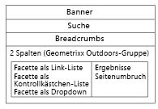

# Hinzufügen von Search&amp;Promote-Funktionen zu Ihrer Seite{#adding-search-promote-features-to-your-page}

Um Search&amp;Promote-Funktionen in Ihre Website zu integrieren, verwenden Sie die Search&amp;Promote-Komponenten zum Hinzufügen der folgenden Funktionen zu Ihren Seiten:

* Keyword-Suche
* Seite mit Suchergebnissen
* Präzisierung der Suche
* Banner

Beachten Sie, dass Sie Search&amp;Promote-Funktionen nur dann verwenden können, wenn Ihr AEM-Administrator sie aktiviert hat. Weitere Informationen finden Sie unter [Integration in Adobe Search&amp;Promote](/help/sites-administering/search-and-promote.md).

Facetten werden auf dem Search&amp;Promote-Server konfiguriert, genau wie die von jeder Komponente bereitgestellten Informationen. Die folgende Tabelle enthält eine kurze Beschreibung der einzelnen Komponenten. Die nachfolgenden Abschnitte enthalten ausführliche Informationen zu deren Verwendung.

<table>
 <tbody>
  <tr>
   <th>Search&amp;Promote-Komponente</th>
   <th>Beschreibung</th>
  </tr>
  <tr>
   <td>Banner</td>
   <td>Anzeige von Bannerwerbung. Banner werden auf Grundlage der Daten ausgewählt, die von Search&amp;Promote erfasst werden.  </td>
  </tr>
  <tr>
   <td>Breadcrumb</td>
   <td>Zeigt den Suchbegriff und die Reihenfolge der Filter an, die der Benutzer auf Suchergebnisse angewendet hat.</td>
  </tr>
  <tr>
   <td>Facette als Kontrollkästchen-Liste</td>
   <td>Eine Liste mit Kontrollkästchen zur Auswahl von Facetten für das Filtern von Suchergebnissen.</td>
  </tr>
  <tr>
   <td>Facette als Dropdown</td>
   <td>Eine Dropdown-Liste von Facetten für das Filtern von Suchergebnissen.</td>
  </tr>
  <tr>
   <td>Facette als Link-Liste</td>
   <td>Eine Liste der Facetten-Links für das Filtern von Suchergebnissen.</td>
  </tr>
  <tr>
   <td>Seitenumbruch</td>
   <td>Steuerelemente für die Navigation durch die Seiten von Suchergebnissen.</td>
  </tr>
  <tr>
   <td>Ergebnisse</td>
   <td>Zeigt die Ergebnisse einer Suche nach Begriffen an.</td>
  </tr>
  <tr>
   <td>Suchen</td>
   <td>Fügt ein Suchfeld in die Seite ein.</td>
  </tr>
 </tbody>
</table>

## Erstellen der Suchergebnisseite  {#creating-the-search-results-page}

Verwenden Sie die WCM-Websites-Konsole, um eine Seite für die Anzeige von Suchergebnissen zu erstellen. Die Suchergebnisse aus einer beliebigen Suchkomponente können auf dieser Seite angezeigt werden, sofern für sie dieselben Search&amp;Promote-Services verwendet werden.

Die Komponenten, die es Benutzern ermöglichen, Suchergebnisse zu überprüfen, sind „Ergebnisse“ und „Seitenumbruch“. Die Komponente **Ergebnisse** weist weder im Bearbeitungs- noch im Designmodus konfigurierbare Eigenschaften auf. Die Komponente „Ergebnisse“ listet lediglich Suchergebnisse auf, die Links zu anderen Seiten enthalten, und zeigt die Anzahl der Ergebnisse für jeden Suchbegriff an.

Die Komponente **Seitenumbruch** ermöglicht Benutzern die Navigation durch mehrere Seiten mit Suchergebnissen. Benutzer können die Anzahl der Seiten einsehen, zur nächsten oder vorherigen Seite wechseln, eine zu öffnende Seite auswählen und alle Ergebnisse auf einer Seite zusammenfassen.

Sie können die folgenden Komponenteneigenschaften im Bearbeitungsmodus konfigurieren, um das Verhalten zur Laufzeit zu steuern:

* Ausblenden einer einzelnen Ergebnisseite: Wählen Sie diese Option, um die Seitennavigationssteuerelemente auszublenden, wenn die Suche eine einzelne Ergebnisseite zurückgibt.
* Erste/Letzte ausblenden: Wenn Sie diese Option auswählen, können Benutzer nicht zur ersten oder letzten Suchergebnisseite wechseln.
* Vorherige/Nächste ausblenden: Legt fest, ob Benutzer zu Ergebnisseiten relativ zur aktuellen Seite navigieren können.
* „Alle anzeigen“ ausblenden: Legt fest, ob Benutzer alle Suchergebnisse auf einer einzigen Seite zusammenfassen können. In der Regel erfolgt die Nutzung von Serverressourcen bei Daten mit Seitenaufteilung effizienter. Wählen Sie diese Option aus, um die Übertragung großer Datenmengen in einer einzelnen Antwortmeldung zu verhindern.

### Aktivieren der Filterung von Ergebnissen durch Facetten  {#enabling-the-filtering-of-results-by-facets}

Sie können Benutzern die Filterung von Suchergebnissen durch Facetten ermöglichen. Die Komponenten **Checkbox List Facet**, **Dropdown-Facette** und **Link List Facet** ermöglichen es Benutzern, eine oder mehrere Facetten für die Filterung auszuwählen. Bei Verwendung dieser Komponenten sollten Sie auch die Komponente **Breadcrumbs** einschließen. Breadcrumbs zeigen die aktuell verwendeten Filter an.

Die Komponenten **Checkbox List Facet**, **Dropdown Facet** und **Link List Facet** verfügen jeweils über die folgenden Eigenschaften, die Sie im Modus **Bearbeiten** konfigurieren:

* **Facettenname**: Der Name der zur Filterung verwendeten Facette.

Die Komponente **Facette als Kontrollkästchen-Liste** zeigt eine Liste von Facetten an, die jeweils ein Kontrollkästchen aufweisen. Verwenden Sie **Facette als Kontrollkästchen-Liste**, damit Benutzer eine Untergruppe von Ergebnissen anzeigen können, die Elemente aus mehreren Facetten enthalten. Beispielsweise ist die **Marken-Facette geeignet, da mehrere Marken dieselbe Art von Produkt anbieten.**

Ein Kontrollkästchen wird für jede Facette angezeigt, die mit einem Suchergebnis verbunden ist. Wenn ein Benutzer ein Kontrollkästchen aktiviert, wird die Seite mit einem aktualisierten Ergebnissatz neu geladen. Alle Kontrollkästchen verbleiben auf der Seite, damit Kunden jederzeit zur weiteren Filterung Facetten hinzufügen oder entfernen können:

Die Komponente **Facette als Dropdown** ermöglicht es Kunden, ein Facettenelement in einer Dropdown-Liste auszuwählen. Diese Komponente ist hilfreich, wenn Sie möchten, dass Kunden sich umgehend auf ein einzelnes Facettenelement konzentrieren können. Beispielsweise ist die Facette „Abteilung“ dafür geeignet, Kunden die Einschränkung von Produktsuchen nach Abteilung zu ermöglichen. John sucht *Jeans* und schränkt danach die Suche auf die Herrenabteilung ein.

Die Dropdown-Liste wird mit den Facetten gefüllt, die mit allen Suchergebnissen verbunden sind. Bei Auswahl eines Elements in der Dropdown-Liste wird die Seite mit einem aktualisierten Ergebnissatz neu geladen. Die Elemente in der Dropdown-Liste ändern sich nicht, sodass Kunden jederzeit zwischen verschiedenen Facetten wechseln können.

Mit der Komponente **Facette als Link-Liste** können Kunden ihren Fokus immer stärker auf Elemente beschränken, die unter mehreren Facettenmitgliedern bzw. Facetten kategorisiert sind.

Facettenmitglieder werden als Liste von Links angezeigt. Der Text eines Links entspricht dem Namen des jeweiligen Facettenmitglieds, das mit den aktuellen Suchergebnissen verbunden ist. Wenn ein Kunde auf einen solchen Link klickt, wird die Seite neu geladen und eine Untergruppe der Suchergebnisse wird angezeigt. Die Liste der Links wird entsprechend aktualisiert, sodass der Fokus noch weiter eingeschränkt werden kann.

Die Links in der Liste ändern sich auch, wenn ein Filter von einem anderen Typ der Search&amp;Promote-Komponente angewendet wird. Durch die Verwendung von Filterkomponenten mehrerer Typen sind effektive Filterkombinationen möglich.

Die Komponente **Breadcrumbs** ermöglicht es Kunden, die aktuell auf Suchergebnisse angewendeten Filter in der Reihenfolge, in der sie angewendet wurden, einzusehen. Kunden können auf die Elemente im Breadcrumb klicken, um die entsprechende Filterkombination wiederherzustellen.

Sie können die folgenden Eigenschaften für Breadcrumbs im Bearbeitungsmodus konfigurieren, um das Erscheinungsbild der Komponente anzupassen:

* Trennzeichen: Definieren Sie das Zeichen oder die Zeichenfolge für die Verwendung als Trennzeichen zwischen den einzelnen Breadcrumbs. Für das Feld „Trennzeichen“ ist jede beliebige Zeichenfolge als Eingabe zulässig. Die Standardeinstellung ist: „>“ (ohne die Anführungszeichen)
* Nachfolgende Trennzeichen: Definieren Sie ein Zeichen oder eine Zeichenfolge für die Anzeige am Ende der Breadcrumbs. Für das Feld „Nachfolgende Trennzeichen“ ist jede beliebige Zeichenfolge als Eingabe zulässig. Die Standardeinstellung hierfür ist *leer* (d. h. am Ende der Breadcrumb-Zeile wird nichts angezeigt).

### Hinzufügen von Suchfeldern  {#adding-search-boxes}

Mit der Suchkomponente können Kunden Suchvorgänge auf Grundlage von Suchbegriffen durchführen. Fügen Sie Suchkomponenten zu jeder Seite hinzu, auf der die Suchfunktion verfügbar sein soll.

Konfigurieren Sie die folgenden Eigenschaften im Bearbeitungsmodus, um das Verhalten zur Laufzeit zu steuern:

* Pfad zur Ergebnisseite: Der Pfad zu der Seite, auf der die Suchergebnisse anzeigt werden.
* „Automatisch auffüllen“ aktivieren: Wählen Sie diese Option aus, um Vorschläge für Suchbegriffe anzuzeigen, wenn der Kunde mit der Eingabe im Suchfeld beginnt.

### Hinzufügen von Bannern {#adding-banners}

Die Banner-Komponente zeigt Bannerwerbung entsprechend den Search&amp;Promote des Kunden an. Logik auf dem Search&amp;Replace-Server ermittelt, welches Banner angezeigt wird. Beispielsweise könnte bei einer Suche nach Jeans ein Banner angezeigt werden, das mit Mode zu tun hat. Durch Filtern auf die Herrenabteilung könnte die Auswahl des Banners noch weiter verfeinert werden.

Die Komponente „Banner“ weist die konfigurierbare Eigenschaft „Banner-Bereich“ auf. Klicken Sie im Bearbeitungsmodus auf einen der Eigenschaftswerte, um die Darstellungsweise des Banners festzulegen. Der Search&amp;Promote-Service legt die Liste der Werte fest, aus denen Sie auswählen können.

### Beispiel für Search&amp;Promote-Suchseite {#example-search-promote-search-page}

Dieses Diagramm zeigt die Komponenten an, die zu einer Seite hinzugefügt werden, um die voll funktionsfähige Search&amp;Promote-Ergebnisseite wie abgebildet zu erstellen.

 
