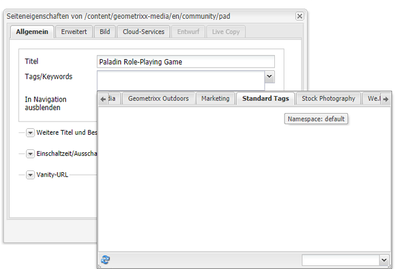
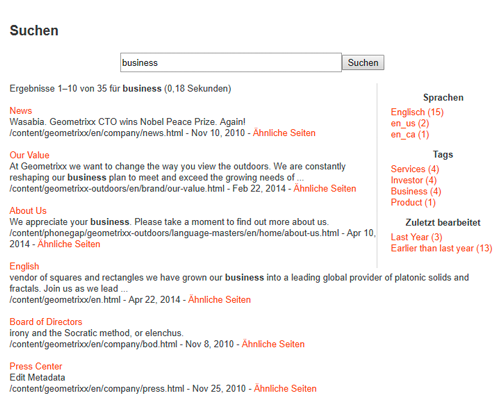

# Verwenden von Tags{#using-tags}

Tags bieten eine schnelle und einfache Methode zur Klassifizierung von Inhalten innerhalb einer Website. Tags können als Suchbegriffe oder Beschriftungen betrachtet werden, die an eine Seite, ein Asset oder andere Inhalte angehängt werden können, um Suchen zu ermöglichen, mit denen diese Inhalte und zugehörigen Inhalte gefunden werden können.

* Informationen zur Erstellung und Verwaltung von Tags sowie dazu, auf welche Inhalte Tags angewendet wurden, finden Sie unter [Verwalten von Tags](/help/sites-administering/tags.md).
* Unter [Tagging für Entwickler](/help/sites-developing/tags.md) finden Sie Informationen über das Tagging-Framework sowie die Einbeziehung und Erweiterung von Tags in benutzerdefinierten Anwendungen.

## Zehn Gründe für das Verwenden von Tags {#ten-reasons-to-use-tagging}

1. Organisieren von Inhalten : Tagging erleichtert Autoren das Leben, da sie Inhalte mit wenig Aufwand schnell organisieren können.
1. Organisieren von Tags : Während Tags Inhalte organisieren, organisieren hierarchische Taxonomien/Namespaces Tags.
1. Tief organisierte Tags : durch die Möglichkeit, Tags und Unter-Tags zu erstellen, wird es möglich, komplette Taxonomiesysteme auszudrücken, die Begriffe, Unterbegriffe und deren Beziehungen abdecken. Dies ermöglicht die Erstellung einer zweiten (oder dritten) Inhaltshierarchie parallel zur offiziellen Inhaltshierarchie.
1. Kontrolliertes Tagging : Tagging kann durch Anwenden von Berechtigungen auf Tags und/oder Namespaces zur Steuerung der Tag-Erstellung und -Anwendung gesteuert werden.
1. Flexibles Tagging: Tags können viele Namen und Formen annehmen: Tags, Taxonomiebegriffe, Kategorien, Beschriftungen und vieles mehr. Ihr Inhaltsmodell und ihre Verwendung sind flexibel und können an die jeweiligen Bedürfnisse angepasst werden, z. B. bei der Zielgruppendefinition, der Kategorisierung und Bewertung von Inhalten oder der Erstellung sekundärer Inhaltshierarchien.
1. Verbesserte Suche : Die standardmäßige Suchkomponente in AEM enthält erstellte Tags und angewendete Tags, auf die Filter angewendet werden können, um die Ergebnisse auf die relevanten einzugrenzen.
1. SEO-Aktivierung : Tags, die als Seiteneigenschaften angewendet werden, werden automatisch in den Metatags der Seite angezeigt, sodass sie für Suchmaschinen sichtbar sind.
1. Einfach und intelligent : -Tags können einfach aus einem Wort und dem Berühren einer Schaltfläche erstellt werden. Danach können ein Titel, eine Beschreibung und eine unbegrenzte Anzahl von Beschriftungen hinzugefügt werden, um mehr semantische Informationen für das Tag bereitzustellen.
1. Hauptkonsistenz : Das Tagging-System ist eine Kernkomponente von AEM und wird von allen AEM Funktionen zur Kategorisierung von Inhalten verwendet. Darüber hinaus ist die Tagging-API für Entwickler zum Erstellen Tagging-fähiger Anwendungen mit Zugriff auf dieselben Taxonomien verfügbar.
1. Kombiniert Struktur und Flexibilität : AEM eignet sich aufgrund der Verschachtelung von Seiten und Pfaden ideal für die Arbeit mit strukturierten Informationen. Aufgrund der integrierten Volltextsuche ist sie bei der Arbeit mit unstrukturierten Informationen gleichermaßen leistungsfähig. Tagging kombiniert die Stärken von Struktur und Flexibilität.

Berücksichtigen Sie beim Entwerfen der Inhaltsstruktur für eine Site und des Metadatenschemas für Assets die einfache und barrierefreie Ansätze, die Tagging bietet.

## Anwenden von Tags {#applying-tags}

In der Autorenumgebung wenden Autoren möglicherweise Tags an, indem sie auf die Seiteneigenschaften zugreifen und ein oder mehrere Tags im Feld **Tags/Keywords** eingeben.

Um [vordefinierte Tags](/help/sites-administering/tags.md) im Fenster **Seiteneigenschaften** anzuwenden, wählen Sie im Pulldown-Feld `Tags/Keywords` ein Tag aus der Liste der für diese Seite zugelassenen Tags aus. Die Registerkarte **Standard-Tags** ist der Standard-Namespace, was bedeutet, dass es kein Präfix `namespace-string:` in der Taxonomie gibt.

### Veröffentlichen von Tags {#publishing-tags}

Wie bei Seiten können Sie Folgendes für Tags und Namespaces durchführen:

**Aktivieren**

* Einzelne Tags können aktiviert werden.

   Genau wie Seiten müssen neu erstellte Tags zuerst aktiviert werden, bevor sie in einer Veröffentlichungsumgebung verfügbar sind.

>[!NOTE]
>
>Wenn Sie eine Seite aktivieren, wird automatisch ein Dialogfeld geöffnet, in dem Sie nicht aktivierte Tags, die zu der Seite gehören, aktivieren können.

**Deaktivieren**

* Deaktivieren Sie die ausgewählten Tags.

## Tag-Clouds {#tag-clouds}

Tag-Clouds zeigen eine Cloud von Tags, entweder für die aktuelle Seite, die gesamte Website oder die beliebtesten Seiten. Tag-Clouds sind eine Möglichkeit für das Hervorheben von Themen, die für die Benutzer von Interesse sind (oder waren). Die Textgröße der einzelnen Tags spiegelt die Häufigkeit der Verwendung wider.

Die [Tag Cloud](/help/sites-classic-ui-authoring/classic-page-author-edit-mode.md#tag-cloud) -Komponente (allgemeine Komponentengruppe) verwendet wird, um einer Seite eine Tag-Cloud hinzuzufügen.

## Suchen nach Tags {#searching-on-tags}

Sie können sowohl in der Autoren- als auch in der Veröffentlichungsumgebung nach Tags suchen.

### Verwenden der Suchkomponente {#using-search-component}

Das Hinzufügen einer [Suchkomponente](/help/sites-classic-ui-authoring/classic-page-author-edit-mode.md#search) zu einer Seite liefert eine Suchfunktion, die Tags umfasst und sowohl in der Autoren- als auch in der Veröffentlichungsumgebung verwendet werden kann.

