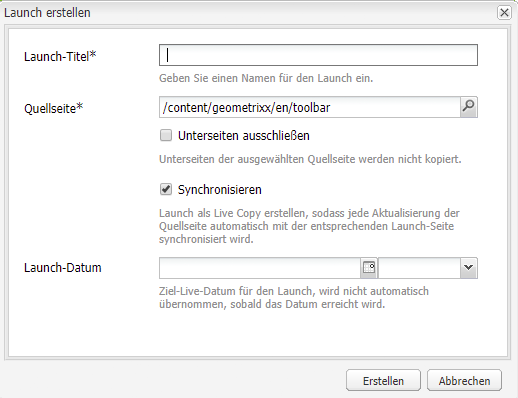

# Erstellen von Launches{#creating-launches}

Erstellen Sie einen Launch, um die Aktualisierung einer neuen Version bestehender Web-Seiten für die zukünftige Aktivierung zu aktivieren. Wenn Sie einen Launch erstellen, können Sie einen Titel und die Quellseite angeben:

* Der Titel wird im **Sidekick** angezeigt, wo Autoren ihn bearbeiten können.
* Die untergeordneten Seiten der Quellseiten werden standardmäßig in den Launch eingeschlossen. Sie können bei Bedarf nur die Quellseite verwenden.
* Standardmäßig aktualisiert [Live Copy](/help/sites-administering/msm.md) automatisch die Launch-Seiten, wenn sich die Quellseiten ändern. Zur Vermeidung automatischer Änderungen können Sie festlegen, dass eine statische Kopie erstellt wird.

Optional können Sie das **Launch-Datum** (und die Uhrzeit) für die Bewerbung und Aktivierung der Launch-Seiten angeben. Das **Launch-Datum** funktioniert allerdings nur in Kombination mit der Kennzeichnung **Produktionsbereit** (siehe [Bearbeiten einer Launch-Konfiguration](/help/sites-classic-ui-authoring/classic-launches-editing.md#editing-a-launch-configuration)). Damit die Aktionen automatisch erfolgen, muss beides festgelegt werden.

## Erstellen eines Launches {#creating-a-launch}

Ein Launch wird mit dem folgenden Verfahren erstellt.

1. Öffnen Sie die Verwaltungsseite für die Website ([http://localhost:4502/siteadmin](http://localhost:4502/siteadmin)).
1. Klicken Sie auf **Neu…**, dann auf **Neuer Launch…**.
1. Geben Sie im Dialogfeld **Launch erstellen** Werte für die folgenden Eigenschaften an:

   * **Launch-Titel**: Der Name des Launches. Der Name sollte für Autorinnen und Autoren aussagekräftig sein.
   * **Quellseite**: Der Pfad zu der Seite, für die der Launch erstellt werden soll. Standardmäßig sind alle untergeordneten Seiten mit eingeschlossen.
   * **Unterseiten ausschließen**: Wählen Sie diese Option, um den Launch nur für die Quellseite und nicht für die untergeordneten Seiten zu erstellen. Standardmäßig ist diese Option nicht aktiviert.
   * **Synchronisieren**: Wählen Sie diese Option, um den Inhalt von Launch-Seiten automatisch zu aktualisieren, wenn die Quellseiten sich ändern. Dies wird erreicht, indem der Launch zu einer [Live Copy](/help/sites-administering/msm.md) gemacht wird.
   * **Launch-Datum**: Das Datum und die Uhrzeit für die Aktivierung der Launch-Kopie (abhängig von der Markierung **Produktionsbereit**. Siehe [Launches: Reihenfolge von Ereignissen](/help/sites-authoring/launches.md#launches-the-order-of-events)).

   

1. Klicken Sie auf **Erstellen**.

## Löschen von Launches {#deleting-a-launch}

Sie können einen Launch auch löschen.

1. Wählen Sie den erforderlichen Launch in der [Launch-Konsole](/help/sites-classic-ui-authoring/classic-launches.md) aus.
1. Klicken Sie auf **Löschen**. Der Vorgang muss bestätigt werden:

   

   >[!CAUTION]
   >
   >Beim Löschen von verschachtelten Launches sollten Sie zuerst die niedrigeren Ebenen löschen.
