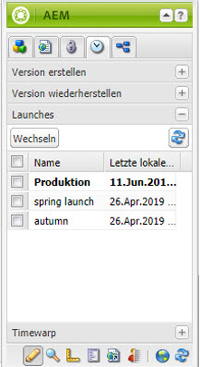
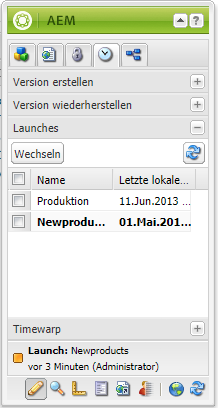

# Bearbeiten von Launches{#editing-launches}

## Bearbeiten von Launch-Seiten {#editing-launch-pages}

Wenn ein Launch für eine Seite (oder eine Reihe von Seiten) erstellt wurde, können Sie den Inhalt in der Launch Copy der Seiten bearbeiten.

1. Öffnen Sie die Seite für die Bearbeitung.
1. Wählen Sie im Sidekick die Registerkarte **Versionierung** aus und erweitern Sie dann die Gruppe **Launches**. Der Titel des Launches, der zurzeit bearbeitet wird, ist fett hervorgehoben.

   

1. Wählen Sie den Launch aus, an dem Sie arbeiten möchten, und klicken Sie dann auf **Wechseln**.
1. Starten Sie die Bearbeitung.

   >[!NOTE]
   >
   >Sie können die Registerkarte **Seite** des Sidekicks verwenden, um Aktionen wie **Untergeordnete Seite erstellen** durchzuführen. 

## Bearbeiten einer Launch-Konfiguration  {#editing-a-launch-configuration}

Wenn Sie einen Launch erstellt haben, können Sie den Namen und das Datum des Launches ändern. Sie können auch ein Bild angeben, das Sie dem Launch zuweisen möchten.

1. Öffnen Sie die Verwaltungsseite „Launches“ ([http://localhost:4502/libs/launches/content/admin.html](http://localhost:4502/libs/launches/content/admin.html)). 

1. Wählen Sie den gewünschten Launch aus und klicken Sie auf **Bearbeiten**, um das Dialogfeld zu öffnen:

   * Auf der Registerkarte **Allgemein** können Sie Folgendes bearbeiten:

      * **Titel**
      * **Live-Datum**: dieses entspricht dem Launch-Datum 
      * **Produktionsbereit**

      Unter [Launches: Reihenfolge von Ereignissen](/help/sites-authoring/launches.md#launches-the-order-of-events) finden Sie Informationen über den Zweck und die Interaktion dieser Felder.

   * Auf der Registerkarte **Bild** können Sie eine Bilddatei hochladen.

1. Klicken Sie auf **Speichern**.

## Ermitteln des Launch-Status einer Seite  {#discovering-the-launch-status-of-a-page}

Wenn Sie den Launch einer Seite bearbeiten, werden unten auf der Registerkarte **Versionierung** des Sidekicks Informationen zum Launch angezeigt:

* Der Name des Launches.
* Die Zeit, die seit der letzten Änderung vergangen ist.
* Der Benutzer, der die letzte Änderung vorgenommen hat.
* Der Status des Flags **Produktionsbereit** (orange = nicht festgelegt; grün = festgelegt). 

