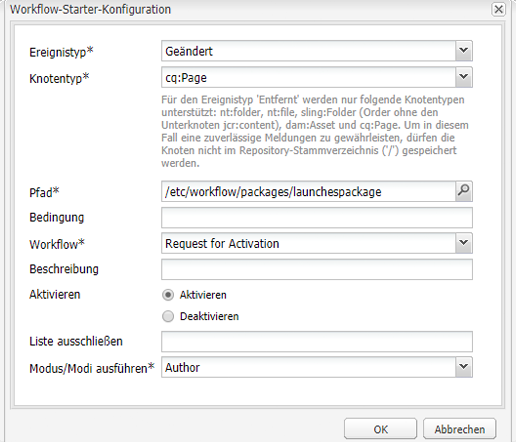

# Weiterleiten von Launches{#promoting-launches}

Sie müssen Launch-Seiten weiterleiten (bewerben), damit der Inhalt vor der Veröffentlichung wieder in die Quelle (Produktion) verschoben wird. Beim Weiterleiten einer Launch-Seite wird die entsprechende Seite der Quellseiten mit dem Inhalt der weitergeleiteten Seite aktualisiert. Die folgenden Optionen sind beim Weiterleiten einer Launch-Seite verfügbar:

* Soll nur die aktuelle Seite weitergeleitet werden oder der gesamte Launch?
* Sollen die untergeordneten Seiten der aktuellen Seite weitergeleitet werden?
* Soll der vollständige Launch weitergeleitet werden oder die nur Seiten, die geändert wurden?

## Weiterleiten von Launch-Seiten {#promoting-launch-pages}

Führen Sie beim Bearbeiten der weiterzuleitenden Launch-Seite die folgenden Schritte aus, um Seiten weiterzuleiten:

1. Klicken Sie im Sidekick auf der Registerkarte **Seite** auf **Launch bewerben**.
1. Geben Sie die Seiten an, die weitergeleitet werden sollen:

   * (Standard) Um nur die aktuelle Seite weiterzuleiten, wählen Sie **Seitenänderungen in Produktionsversion weiterleiten**.
   * Um auch die untergeordneten Seiten der aktuellen Seite weiterzuleiten, wählen Sie **Unterseiten einschließen** aus.
   * Um alle Seiten im Launch weiterzuleiten, wählen Sie **Vollständigen Launch in Produktionsversion weiterleiten**.

1. Um die Produktionsseiten einem Workflow-Paket hinzuzufügen, wählen Sie zunächst **Zu Workflow-Paket hinzufügen** und wählen Sie dann das Workflow-Paket.
1. Klicken Sie auf **Bewerben**.

## Bearbeiten weitergeleiteter Seiten mit einem AEM-Workflow {#processing-promoted-pages-using-aem-workflow}

Verwenden Sie Workflow-Modelle, um eine Stapelverarbeitung weitergeleiteter Launch-Seiten durchzuführen:

1. Erstellen Sie ein Workflow-Paket.
1. Wenn Autoren Launch-Seiten weiterleiten, speichern sie sie in einem Workflow-Paket.
1. Starten Sie ein Workflow-Modell mit dem Paket als Payload.

Um einen Workflow automatisch zu starten, wenn Seiten weitergeleitet werden, [konfigurieren Sie einen Workflow-Starter](/help/sites-administering/workflows-starting.md#workflows-launchers) für den Paketknoten.

Sie können z. B. automatisch Seitenaktivierungsanfragen generieren, wenn Autoren Launches-Seiten weiterleiten. Konfigurieren Sie einen Workflow-Starter, um den Workflow zur Anfrageaktivierung zu starten, wenn der Paketknoten geändert wird.

