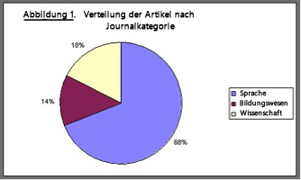
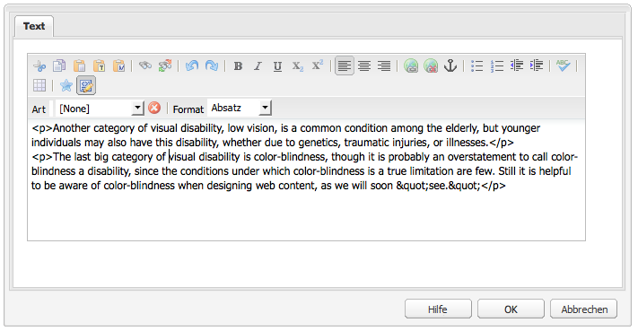
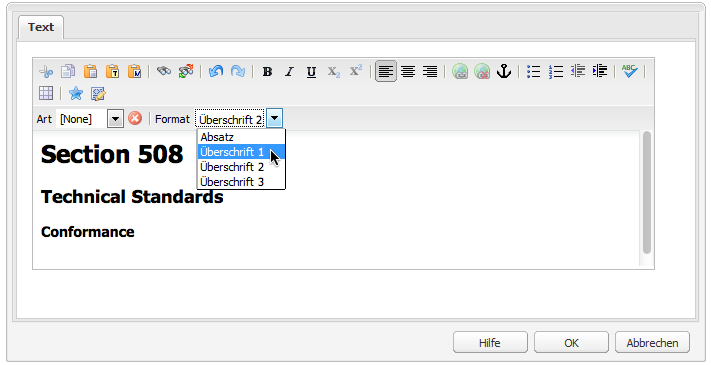
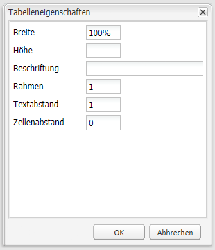
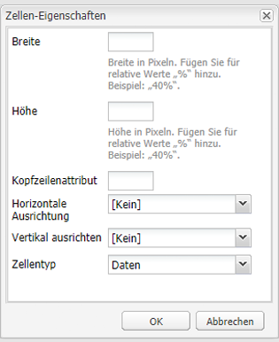
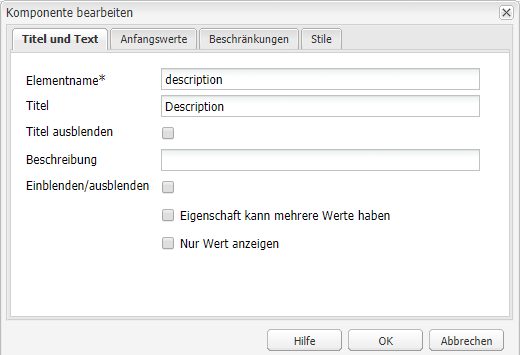
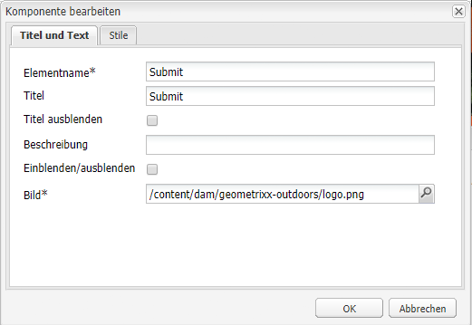
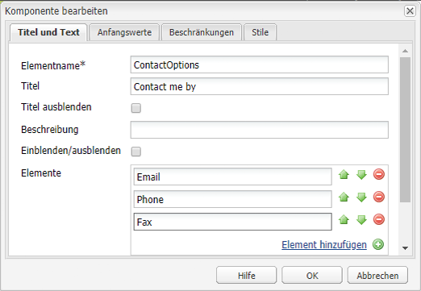
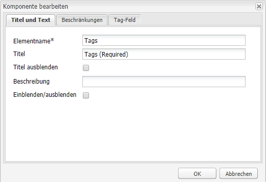

# Erstellung barrierefrei zugänglicher Inhalte (in Übereinstimmung mit den WCAG 2.0-Richtlinien){#creating-accessible-content-wcag-conformance}

>[!CAUTION]
>
>Da die klassische Benutzeroberfläche in AEM 6.4 nicht mehr unterstützt wird, wurde der Inhalt auf dieser Seite nicht für WCAG 2.1 aktualisiert.
>
>Auf den folgenden Seiten finden Sie Details zu AEM und WCAG 2.1:
>
>* [AEM und Richtlinien für barrierefreien Webzugang](/help/managing/web-accessibility.md)
* [Kurzanleitung zu WCAG 2.1](/help/managing/qg-wcag.md)
* [Erstellung barrierefrei zugänglicher Inhalte (in Übereinstimmung mit den WCAG 2.1-Richtlinien)](/help/sites-authoring/creating-accessible-content.md)


WCAG 2.0 umfasst eine Reihe technologieunabhängiger Richtlinien und Erfolgskriterien, die Sie bei der Erstellung von Web-Inhalten unterstützen, die für Personen mit Behinderungen barrierefrei zugänglich sind.

>[!NOTE]
Siehe auch:
* den [Quick Guide zu WCAG 2.0](/help/managing/qg-wcag.md), um weitere Details zu erhalten.
* [Konfigurieren des Rich-Text-Editors (RTE) für die Erstellung von barrierefrei zugänglichen Inhalten](/help/sites-administering/rte-accessible-content.md)


Diese sind in drei Konformitätslevel abgestuft: Level A (niedrigstes), Level AA und Level AAA (höchstes). Die Levels sind kurz definiert wie folgt:

* **Stufe A:** Ihre Site erreicht eine einfache, minimale Barrierefreiheit. Bei Erreichen dieser Stufe sind alle Kategorie-A-Erfolgskriterien erfüllt.
* **Level AA:** Dies ist ein ideales Level der Barrierefreiheit, das Sie anstreben sollten. Auf diesem Level erreicht Ihre Site ein höheres Maß an Barrierefreiheit, da sie für die meisten Menschen in den meisten Situationen mit den meisten Technologien barrierefrei zugänglich ist. Um dieses Level zu erreichen, müssen alle Erfolgskriterien von Level A und Level AA erfüllt sein.
* **Stufe AAA:** Ihre Site erreicht eine sehr hohe Barrierefreiheit. Bei Erreichen dieser Stufe sind alle Kategorie-A-, -AA- und -AAA-Erfolgskriterien erfüllt.

Bei der Erstellung der Site sollten Sie festlegen, welchen Level Ihre Site insgesamt erfüllen soll.

Im folgenden Abschnitt finden Sie die [WCAG 2.0-Richtlinien](https://www.w3.org/TR/WCAG20/#guidelines) mit den entsprechenden Erfolgskriterien für die [Konformitäts-Level](https://www.w3.org/TR/UNDERSTANDING-WCAG20/conformance.html) Level A und Level AA.

>[!NOTE]
Da bestimmte Inhalte die Erfolgskriterien von Level AAA unmöglich erreichen können, ist es nicht empfehlenswert, dieses Konformitätslevel als allgemeine Richtlinie festzulegen.

>[!NOTE]
In diesem Dokument verwenden wir Folgendes:
* Die Kurznamen für die [WCAG 2.0-Richtlinien](https://www.w3.org/TR/WCAG20/#guidelines).
* Die Nummerierung der [WCAG 2.0-Richtlinien](https://www.w3.org/TR/WCAG20/#guidelines) zur Erleichterung von Querverweisen zur WCAG-Website.


## Grundsatz 1: Erkennbar      {#principle-perceivable}

[Grundsatz 1: Erkennbar – Informationen und Komponenten der Benutzeroberfläche müssen für die Benutzer so dargestellt sein, dass sie sie erkennen können.](https://www.w3.org/TR/WCAG20/#perceivable)

### Textalternativen (1.1)   {#text-alternatives}

[Richtlinie 1.1 Textalternativen: Bieten Sie Textalternativen für nichttextliche Inhalte, damit sie in andere Formate geändert werden, die von bestimmten Personen benötigt werden, wie zum Beispiel Großdruck, Braille, Sprache, Symbole oder einfachere Sprache.](https://www.w3.org/TR/WCAG20/#text-equiv)

### Nichttextlicher Inhalt (1.1.1)   {#non-text-content}

* Erfolgskriterium 1.1.1
* Level A
* Nichttextlicher Inhalt: Alle nichttextlichen Inhalte, die Benutzern präsentiert werden, haben eine Textalternative, die dem jeweiligen Zweck entspricht, ausgenommen die unten aufgeführten Situationen.

#### Zweck: Nichttextlicher Inhalt (1.1.1) {#purpose-non-text-content}

Informationen auf einer Web-Seite können in vielen verschiedenen nichttextlichen Formaten dargestellt werden, wie zum Beispiel als Bilder, Videos, Animationen und Diagramme. Menschen, die blind sind oder deren Sicht erheblich eingeschränkt ist, können nichttextliche Inhalte nicht sehen, doch sie können Textinhalte erfassen, wenn sie ihnen von einem Bildschirmleser vorgelesen oder in haptischer Form auf einem Braille-Anzeigegerät präsentiert werden. Somit kann es durch Bereitstellung von Textalternativen zu Inhalten in grafischem Format ermöglicht werden, dass Menschen, die die grafischen Inhalte nicht sehen können, auf eine gleichwertige Version der Informationen des Inhalts zugreifen können.

Ein nützlicher weiterer Vorteil besteht darin, dass es durch Textalternativen möglich ist, nichttextliche Inhalte durch die Suchmaschinentechnologie zu indizieren.

#### Erfüllen: Nichttextlicher Inhalt (1.1.1)   {#how-to-meet-non-text-content}

Bei statischen Grafiken besteht die Grundanforderung darin, eine gleichwertige Textalternative für die Grafik bereitzustellen. Dies kann im Feld **ALT-Text** durchgeführt werden:

>[!NOTE]
Einige integrierte Komponenten wie **Karussell** und **Dia-Show** bieten keine Möglichkeit zum Hinzufügen von alternativen Textbeschreibungen zu Bildern. Wenn Sie Versionen davon für Ihre AEM-Instanz implementieren, muss Ihr Entwickler-Team diese Komponenten so konfigurieren, dass das `alt`-Attribut unterstützt wird, damit Autoren es dem Inhalt hinzufügen können (siehe [Hinzufügen von Support für weitere HTML-Elemente und -Attribute](/help/sites-administering/rte-accessible-content.md#add-support-for-more-html-elements-and-attributes)).

Das Feld **ALT-Text** ist im Komponentendialogfeld **Bild** auf der Registerkarte **Erweitert** verfügbar:


AEM fügt Ihren Bildern standardmäßig einen **ALT-Text** hinzu. Bei der klassischen Benutzeroberfläche gibt es zwei verschiedene Szenarien zur Methode der Erstellung des Standardattributs (obwohl der Standardwert als Alternative möglicherweise nicht ausreicht und höchstwahrscheinlich auf der Registerkarte **Erweitert** für die Bildeigenschaften bearbeitet werden muss):

* File:

   Ein Bild wird von der Festplatte des Benutzers hochgeladen. Wenn Sie einer Seite eine Bildkomponente hinzufügen und dann ein Bild von Ihrer Festplatte oder einer anderen Quelle auswählen, lautet der Standardwert für **ALT-Text** `file`. Dies muss auf der Registerkarte **Erweitert** für die Bildeigenschaften geändert werden. Dieser Wert wird wiederum nicht im Feld **ALT-Text** angezeigt, doch wenn der Wert geändert wird, ist der neue Wert im Feld zu sehen.

* Asset:

   Ein Bild wird vom digitalen Asset-Repository hinzugefügt. Wenn Sie ein Bild vom digitalen Asset-Repository zu einer Webseite ziehen, dann werden die Werte **Titel** und **ALT-Text** für dieses Bild den Metadaten für dieses Bild entnommen.

>[!NOTE]
In beiden obigen Szenarien ist der Standardwert **ALT-Text** auf der Registerkarte **Erweiterte Bildeigenschaften** nicht sichtbar. Um den Standardwert zu ändern, geben Sie einfach einen neuen Wert in das Feld **Alt-Text** ein.

>[!NOTE]
Wenn Ihr Bild nur Dekorationszwecken dient (siehe [Erstellen guter Textalternativen](#creating-good-text-alternatives)), dann können Sie im Feld **ALT-Text** durch Drücken der Leertaste ein Leerzeichen einfügen. Dadurch wird ein leeres `alt` -Attribut erstellt, wodurch ein Bildschirmleser das Bild ignoriert.

#### Erstellen guter Textalternativen {#creating-good-text-alternatives}

Es gibt verschiedene Arten von nichttextlichem Inhalt. Daher hängt der Wert der Textalternative von der Rolle ab, die die Grafik auf der Web-Seite spielt. Nachfolgend sehen Sie einige Faustregeln:

* Textalternativen sollten kurz und bündig sein, aber dennoch klar die wesentlichen Informationen erfassen, die der nichttextliche Inhalt vermittelt.
* Übermäßig lange Beschreibungen (mit mehr als 100 Zeichen) sollten vermieden werden. Wenn für eine Textalternative mehr Details erforderlich sind:

   * Geben Sie im Alternativtext eine kurze Beschreibung an
   * und fügen Sie irgendwo anders auf der entsprechenden Seite oder auf einer anderen Web-Seite eine längere Beschreibung ein. Verlinken Sie auf diese separate Beschreibung, indem Sie das Bild mit einem Link unterlegen oder indem Sie neben das Bild einen Text-Link platzieren.

* Alternativtext sollte keinen Inhalt replizieren, der bereits in Textform auf derselben Seite vorhanden ist. Denken Sie daran, dass viele Bilder Darstellungen von Punkten sind, die bereits der Text einer Seite abdeckt. Somit ist möglicherweise bereits eine Textalternative vorhanden.
* Wenn es sich bei dem nichttextlichen Inhalt um einen Link zu einer anderen Seite oder einem anderen Dokument handelt und kein anderer Text vorhanden ist, der Teil desselben Links ist, dann muss der Alternativtext für das Bild das Ziel des Links angeben und braucht das Bild nicht zu beschreiben.
* Wenn sich der nichttextliche Inhalt in einem Schaltflächenelement befindet und kein Text vorhanden ist, der Teil derselben Schaltfläche ist, dann muss der Alternativtext des Bildes die Funktion der Schaltfläche angeben statt das Bild zu beschreiben.
* Es ist völlig in Ordnung, wenn für ein Bild ein leerer Alternativtext (null) angegeben wird, allerdings nur dann, wenn das Bild keinen Alternativtext hat (wenn es sich beispielsweise nur um eine dekorative Grafik handelt) oder der entsprechende Text bereits im Seitentext vorhanden ist.

Der [W3C-Entwurf: HTML5-Techniken zur Bereitstellung nützlicher Textalternativen](https://dev.w3.org/html5/alt-techniques/) bietet mehr Details und Beispiele für die Bereitstellung von angemessenem Alternativtext für unterschiedliche Arten von Bildern.

Bestimmte Arten von nichttextlichem Inhalt, für den Textalternativen erforderlich sind:

* Veranschaulichende Fotos:

   Das sind Bilder von Menschen, Objekten oder Orten. Denken Sie an die Rolle des Fotos auf der Seite. Eine entsprechende Textäquivalenz ist wahrscheinlich *Foto von [Objekt]*, kann jedoch vom umliegenden Text abhängig sein.

* Symbole:

   Dies sind kleine Piktogramme (Grafiken), die bestimmte Informationen vermitteln. Sie müssen durchgängig auf einer Seite und Site verwendet werden. Alle Instanzen des Symbols auf einer Seite oder Site sollten dieselbe kurze und knappe Textalternative haben, es sei denn, dass dadurch eine unnötige Verdoppelung von bereits vorhandenem Text erzeugt würde.

* Diagramme:

   Diese stellen normalerweise numerische Daten dar. So könnte als eine Möglichkeit zur Bereitstellung von Alternativtext eine kurze Zusammenfassung der im Diagramm gezeigten Haupttrends eingefügt werden. Geben Sie bei Bedarf auch mithilfe des Felds **Beschreibung** auf der Registerkarte **Erweiterte Bildeigenschaften** eine detailliertere Textbeschreibung ein. Außerdem könnten Sie die Quelldaten an anderer Stelle auf der Seite oder Site als Tabelle zur Verfügung stellen.

   

   Zur Bereitstellung einer Alternative für dieses Beispieldiagramm können Sie dem Bild selbst einen knappen `alt` -Text hinzufügen und dann dem Bild eine vollständige Textalternative folgen lassen.

   ```xml
   <p></p>
   <p> Figure 1. Distribution of Articles by Journal Category.
   Pie chart: Language=68%, Education=14% and Science=18%.</p>
   ```

   >[!NOTE]
   Der obige Ausschnitt dient nur zur Veranschaulichung der Reihenfolge. Es wird empfohlen, die Komponente **Bild** (statt des oben verwendeten `img src` -Verweises) zu verwenden.

   In AEM können Sie dies anhand einer Kombination der Felder **ALT-Text** und **Beschreibung** im Konfigurationsdialogfeld des Bildes erreichen, wie in [Erfüllen: Nichttextlicher Inhalt (1.1.1)](#how-to-meet-non-text-content).

* Karten, Diagramme, Flussdiagramme:

   Für Grafiken mit räumlichen Daten (z. B. um Beziehungen zwischen Objekten oder einem Prozess zu beschreiben), stellen Sie sicher, dass die Schlüsselmeldung im Textformat bereitgestellt wird. Bei Karten ist die Bereitstellung eines Volltextäquivalents wahrscheinlich nicht praktikabel, aber wenn die Karte bereitgestellt wird, um den Weg zu einer bestimmten Position zu erleichtern, kann der Alternativtext des Kartenbildes kurz *Karte von X* angeben und dann Anweisungen für diese Position im Text an einer anderen Stelle auf der Seite oder über das Feld **Beschreibung** auf der Registerkarte **Erweitert** der Komponente **Bild** geben.

* CAPTCHAs:

   Ein CAPTCHA ist ein *vollautomatischer öffentlicher Turing-Test zur Unterscheidung von Computern und Menschen*. Es handelt sich um eine Sicherheitsprüfung auf Webseiten, um Menschen von schädlicher Software zu unterscheiden, die allerdings die Barrierefreiheit einschränken kann. Sie bestehen aus Bildern, bei denen Benutzer beschreiben sollen, was sie sehen, um einen Sicherheitstest zu bestehen. Die Bereitstellung einer Textalternative für das Bild ist offensichtlich nicht möglich, daher müssen Sie stattdessen alternative nichtgrafische Lösungen in Betracht ziehen.

   Das W3C bietet eine Reihe von Vorschlägen wie: Diese Ansätze haben jedoch sowohl Vor- als auch Nachteile.

   * Logik-Puzzles
   * Audio statt Bilder
   * Eingeschränkte Benutzerkonten und Spam-Filter

* Hintergrundbilder:

   Diese werden mithilfe von Cascading Style Sheets (CSS) statt in HTML erreicht. Dies bedeutet, dass es nicht möglich ist, einen Wert für Alternativtext anzugeben. Daher sollten Hintergrundbilder keine wichtigen textlichen Informationen enthalten. Wenn sie dies tun, müssen diese Informationen auch im Text der Seite angegeben werden.

   Es ist jedoch wichtig, dass ein alternativer Hintergrund angezeigt wird, wenn das Bild nicht angezeigt werden kann.

   >[!NOTE]
   Es sollte ein Mindestmaß an Kontrast zwischen dem Hintergrund- und dem Vordergrundtext vorhanden sein; weitere Details hierzu finden Sie unter [Kontrast (Minimum) (1.4.3)](#contrast-minimum).

#### Weitere Informationen: Nichttextlicher Inhalt (1.1.1)   {#more-information-non-text-content}

* [Erfolgskriterien 1.1.1 verstehen](https://www.w3.org/TR/UNDERSTANDING-WCAG20/text-equiv-all.html)
* [Erfolgskriterien 1.1.1 erfüllen](https://www.w3.org/WAI/WCAG20/quickref/#text-equiv)
* [W3C: HTML5-Techniken zur Bereitstellung nützlicher Textalternativen (Entwurf)](https://dev.w3.org/html5/alt-techniques/)
* [W3C-Erklärung und Alternativen zu CAPTCHAs](https://www.w3.org/TR/turingtest/)

### Zeitbasierte Medien (1.2)   {#time-based-media}

[Richtlinie 1.2 Zeitbasierte Medien: Bereitstellung von Alternativen für zeitbasierte Medien.](https://www.w3.org/TR/WCAG20/#text-equiv)

Diese Richtlinie behandelt Webinhalte, die *zeitbasiert* sind. Es handelt sich um Inhalte, die der Benutzer abspielen kann (wie Video, Audio und animierte Inhalte) und die entweder vorher aufgezeichnet wurden oder als Live-Stream verfügbar sind.

### Nur-Audio und Nur-Video (aufgezeichnet) (1.2.1)      {#audio-only-and-video-only-pre-recorded}

* Erfolgskriterium 1.2.1
* Stufe A
* Nur-Audio und Nur-Video (aufgezeichnet): Für aufgezeichnete Nur-Audio und Nur-Video-Medien gilt Folgendes, außer wenn das Audio oder Video eine Medienalternative für Text und als solche ausdrücklich gekennzeichnet ist:

   * Aufgezeichnetes Nur-Audio: Eine Alternative für zeitbasierte Medien wird bereitgestellt, die gleichwertige Informationen für aufgezeichnete Nur-Audio-Inhalte darstellt.
   * Aufgezeichnetes Nur-Video: Es wird entweder eine Alternative für zeitbasierte Medien oder ein Audio-Track bereitgestellt, die/der gleichwertige Informationen für aufgezeichnete Nur-Video-Inhalte darstellt.

#### Zweck: Nur-Audio und Nur-Video (aufgezeichnet) (1.2.1)      {#purpose-audio-only-and-video-only-pre-recorded}

Für folgende Personen kann der barrierefreie Zugang für Video und Audio eingeschränkt sein:

* Personen mit eingeschränktem Sehvermögen, wenn es keinen Soundtrack gibt oder wenn der Soundtrack nicht ausreicht, um sie über die Vorgänge im Video oder in der Animation zu informieren;
* Personen mit eingeschränktem Hörvermögen oder gehörlose Personen, die den Soundtrack nicht hören können.
* Personen, die den Soundtrack zwar hören können, doch den gesprochenen Inhalt nicht verstehen (weil er beispielsweise in einer Sprache aufgezeichnet ist, die sie nicht verstehen).

Video oder Audio kann auch für Personen unzugänglich sein, die Browser oder Geräte verwenden, die die Wiedergabe von Inhalt in bestimmten Medienformaten wie zum Beispiel Adobe Flash nicht unterstützen.

Wenn diese Informationen in einem anderen Format bereitgestellt werden, wie zum Beispiel als Text (oder Audio für Video ohne Audio), können die Informationen für die Personen barrierefrei zugänglich sein, die nicht auf den ursprünglichen Inhalt zugreifen können

#### Erfüllen: Nur-Audio und Nur-Video (aufgezeichnet) (1.2.1)      {#how-to-meet-audio-only-and-video-only-pre-recorded}

* Wenn es sich bei dem Inhalt um aufgezeichnetes Audio ohne Video (wie zum Beispiel einen Podcast) handelt:

   * Stellen Sie direkt vor oder nach dem Inhalt einen Link zu einem Text-Transkript des Audioinhalts bereit.

      Das Transkript sollte eine HTML-Seite mit einer Textentsprechung aller gesprochenen und wichtigen nicht gesprochenen Inhalte sein und den Sprecher, eine Beschreibung der Szenerie, Gesänge und eine Beschreibung anderer wichtiger Audioinhalte angeben.

* Wenn es sich bei dem Inhalt um eine Animation oder ein aufgezeichnetes Video ohne Audio handelt:

   * Stellen Sie direkt vor oder nach dem Inhalt einen Link zu einer entsprechenden Textbeschreibung der Informationen im Video bereit.
   * Es kann auch eine entsprechende Audiobeschreibung in einem häufig verwendeten Audioformat wie MP3 sein.

>[!NOTE]
Wenn der Audio- oder Videoinhalt als Alternative zu Inhalten bereitgestellt wird, die bereits in einem anderen Format auf einer Webseite vorhanden sind, müssen die oben genannten Anforderungen nicht erfüllt werden. Wenn beispielsweise ein Video eine Liste von Textanweisungen veranschaulicht, dann ist für dieses Video kein Alternativtext erforderlich, weil die Textanweisungen bereits als Alternative für das Video dienen.

Das Einfügen von Multimedia wie Flash-Inhalten auf Ihren AEM-Webseiten entspricht in etwa dem Einfügen eines Bildes. Da Multimedia jedoch weit mehr ist als ein Standbild, gibt es eine Vielzahl von verschiedenen Einstellungen und Optionen zur Steuerung, wie die Multimedia-Inhalte abgespielt werden.

>[!NOTE]
Wenn Sie Multimedia mit informativem Inhalt verwenden, müssen Sie auch Links zu Alternativen erstellen. Beispielsweise müssen Sie zum Hinzufügen eines Texttranskripts eine HTML-Seite für die Anzeige des Transkripts erstellen und dann neben oder unter dem Audioinhalt einen Link hinzufügen.

#### Weitere Informationen: Nur-Audio und Nur-Video (aufgezeichnet) (1.2.1) {#more-information-audio-only-and-video-only-pre-recorded}

* [Erfolgskriterien 1.2.1 verstehen](https://www.w3.org/TR/UNDERSTANDING-WCAG20/media-equiv-av-only-alt.html)
* [Erfolgskriterien 1.2.1 erfüllen](https://www.w3.org/WAI/WCAG20/quickref/#media-equiv)

### Untertitel (aufgezeichnet) (1.2.2)      {#captions-pre-recorded}

* Erfolgskriterium 1.2.2
* Stufe A
* Untertitel (aufgezeichnet): Untertitel werden für alle aufgezeichneten Audioinhalte in synchronisierten Medien bereitgestellt, außer wenn das Medium eine Medienalternative für Text und als solche ausdrücklich gekennzeichnet ist.

#### Zweck: Untertitel (aufgezeichnet) (1.2.2)      {#purpose-captions-pre-recorded}

Gehörlose oder schwerhörige Menschen können Audioinhalte gar nicht oder nur schwer verstehen. Untertitel sind Textentsprechungen für gesprochene und nicht gesprochene Audioinhalte; sie werden im Video zum richtigen Zeitpunkt auf dem Bildschirm angezeigt. Sie ermöglichen es Menschen, die das Audio nicht hören können, zu verstehen, was vor sich geht.

>[!NOTE]
Untertitel sind nicht erforderlich, wenn passender Text oder nichttextliche Entsprechungen (die direkt entsprechende Informationen vermitteln) auf derselben Seite wie das Video oder die Animation verfügbar sind.

#### Erfüllen: Untertitel (aufgezeichnet) (1.2.2)      {#how-to-meet-captions-pre-recorded}

Es gibt zwei Arten von Untertiteln:

* Offen: Immer sichtbar, wenn das Video abgespielt wird)
* Geschlossen: Benutzer können die Untertitel ein- oder ausschalten

Verwenden Sie möglichst geschlossene Untertitel, da Benutzer so wählen können, ob die Untertitel angezeigt werden.

Für geschlossene Untertitel müssen Sie eine synchronisierte Untertiteldatei in einem entsprechenden Format (wie [SMIL](https://www.w3.org/AudioVideo/)) erstellen und zusammen mit der Videodatei bereitstellen (Details dazu, wie dieser Vorgang ausgeführt wird, sind im Rahmen dieses Leitfadens nicht möglich, doch wir haben Ihnen Links zu einigen Lernprogrammen unter [Weitere Informationen: Untertitel (aufgezeichnet) (1.2.2)](#more-information-captions-pre-recorded) zusammengestellt). Geben Sie Benutzern auf jeden Fall einen Hinweis, dass Untertitel für das Video verfügbar sind.

Wenn Sie offene Untertitel verwenden müssen, betten Sie den Text im Videotrack ein. Dies erreichen Sie mithilfe von Programmen zur Videobearbeitung, die die Überlagerung von Untertiteln im Video ermöglichen.

#### Weitere Informationen: Untertitel (aufgezeichnet) (1.2.2)      {#more-information-captions-pre-recorded}

* [Erfolgskriterium 1.2.2 verstehen](https://www.w3.org/TR/UNDERSTANDING-WCAG20/media-equiv-captions.html):
* [Erfolgskriterien 1.2.2 erfüllen](https://www.w3.org/WAI/WCAG20/quickref/#media-equiv)
* [W3C: Synchronisiertes Multimedia](https://www.w3.org/AudioVideo/)
* [Untertitel, Transkripte und Audiobeschreibungen – mit WebAIM](https://webaim.org/techniques/captions/)

### Audiobeschreibung oder Medienalternative (aufgezeichnet) (1.2.3)      {#audio-description-or-media-alternative-pre-recorded}

* Erfolgskriterium 1.2.3
* Stufe A
* Audiobeschreibung oder Medienalternative (aufgezeichnet): Eine Alternative für zeitbasierte Medien oder eine Audiobeschreibung des aufgezeichneten Videoinhalts wird für synchronisierte Medien bereitgestellt, außer wenn das Medium eine Medienalternative für Text und als solche ausdrücklich gekennzeichnet ist.

#### Zweck: Audiobeschreibung oder Medienalternative (aufgezeichnet) (1.2.3)      {#purpose-audio-description-or-media-alternative-pre-recorded}

Blinde Menschen oder Menschen mit eingeschränktem Sehvermögen haben keinen Zugang zu Informationen in einem Video oder einer Animation, wenn diese nur visuell vermittelt werden oder wenn der Soundtrack nicht genügend Informationen bietet, damit sie verstehen können, was visuell gezeigt wird.

#### Erfüllen: Audiobeschreibung oder Medienalternative (aufgezeichnet) (1.2.3)      {#how-to-meet-audio-description-or-media-alternative-pre-recorded}

Es gibt zwei Ansätze zur Erfüllung dieses Erfolgskriteriums. Beide sind akzeptabel:

1. Hinzufügen einer weiteren Audiobeschreibung für den Videoinhalt. Hierzu gibt es drei verschiedene Möglichkeiten:

   * Fügen Sie in Pausen im vorhandenen Dialog Informationen zu den Änderungen der Szene ein, die nicht als Teil des vorhandenen Audiotracks präsentiert werden:
   * Stellen Sie einen neuen, zusätzlichen und optionalen Audio-Track bereit, der den ursprünglichen Soundtrack und zudem weitere Audioinformationen zu den Änderungen in der Szene enthält.

      * Dadurch können Benutzer zwischen dem vorhandenen Audio-Track (der *keine* Audiobeschreibung enthält) und dem neuen Audio-Track (*mit* einer Audiobeschreibung) wechseln.
      * Dadurch wird verhindert, dass Benutzer, die die zusätzliche Beschreibung nicht benötigen, gestört werden.
   * Erstellen Sie eine zweite Version des Videoinhalts, um erweiterte Audiobeschreibungen zu ermöglichen. Dies verringert die Schwierigkeiten, die sich durch Einfügen von detaillierten Audiobeschreibungen in Lücken zwischen dem vorhandenen Dialog ergeben, weil das Audio und Video an passenden Stellen unterbrochen werden muss. Als Ergebnis kann eine viel längere Audiobeschreibung gegeben werden, bevor die Aktion erneut startet. Wie im vorigen Beispiel wird dies am besten als optionaler eigener Audio-Track bereitgestellt, um eine Störung der Benutzer zu verhindern, die keine zusätzliche Beschreibung benötigen.


1. Stellen Sie ein Text-Transkript bereit, das eine angemessene Textentsprechung der Audio- und Bildelemente des Videos oder der Animation ist. Es sollte möglichst den Sprecher, eine Beschreibung der Szenerie und den sprachlichen Ausdruck angeben. Abhängig von der Länge können Sie das Transkript auf derselben Seite wie das Video oder die Animation einfügen, oder auch auf einer separaten Seite. In diesem Fall müssen Sie einen Link zu dem Transkript neben dem Video oder der Animation bereitstellen.

Genaue Details zur Erstellung von Audiobeschreibungen für Video würden den Rahmen dieses Leitfadens sprengen. Die Erstellung von Audiobeschreibungen können zeitaufwendig sein, doch andere Adobe-Produkte helfen Ihnen bei diesen Aufgaben. Wenn Sie Inhalte in Adobe Flash Professional erstellen, sollten Sie auch ein Skript erstellen, um den Benutzer aufzufordern, das entsprechende Plug-in herunterzuladen. Zudem sollten Sie eine Textalternative anhand des Elements `<noscript>` bereitstellen.

#### Weitere Informationen: Audiobeschreibung oder Medienalternative (aufgezeichnet) (1.2.3) {#more-information-audio-description-or-media-alternative-pre-recorded}

* [Erfolgskriterien 1.2.3 verstehen](https://www.w3.org/TR/UNDERSTANDING-WCAG20/media-equiv-audio-desc.html):
* [Erfolgskriterien 1.2.3 erfüllen](https://www.w3.org/WAI/WCAG20/quickref/#qr-media-equiv-audio-desc)
* [Adobe Encore CS5](https://www.adobe.com/products/premiere/encore/)

### Untertitel (live) (1.2.4)           {#captions-live}

* Erfolgskriterium 1.2.4
* Level AA
* Untertitel (Live): Untertitel werden für alle Live-Audioinhalte in synchronisierten Medien bereitgestellt.

#### Zweck: Untertitel (Live) (1.2.4)   {#purpose-captions-live}

Dieses Erfolgskriterium entspricht dem Erfolgskriterium zu [Untertitel (aufgezeichnet)](#captions-pre-recorded) insofern, als es Zugangsbarrieren behandelt, die gehörlose oder schwerhörige Menschen erfahren; der Unterschied besteht darin, dass dieses Erfolgskriterium Live-Präsentationen wie Webcasts behandelt.

#### Erfüllen: Untertitel (Live) (1.2.4) {#how-to-meet-captions-live}

Befolgen Sie die Anleitungen, die oben unter [Untertitel (aufgezeichnet)](#captions-pre-recorded) genannt wurden. Da die Medien live übermittelt werden, muss die Bereitstellung so schnell wie möglich erfolgen und sofort auf das reagieren, was passiert. Daher sollten Sie Tools für die Echtzeit-Untertitelung oder für Speech-to-Text in Erwägung ziehen.

Detaillierte Anweisungen dazu würden den Rahmen dieses Dokuments sprengen, doch in den folgenden Ressourcen finden Sie nützliche Informationen:

* [WebAIM: Echtzeit-Untertitelung](https://www.webaim.org/techniques/captions/realtime.php)
* [AccessIT (University of Washington): Können Untertitel automatisch über die Spracherkennung erstellt werden?](https://www.washington.edu/accessit/articles?1209)

#### Weitere Informationen: Untertitel (Live) (1.2.4)      {#more-information-captions-live}

* [Erfolgskriterien 1.2.4 verstehen](https://www.w3.org/TR/UNDERSTANDING-WCAG20/media-equiv-real-time-captions.html)
* [Erfolgskriterien 1.2.4 erfüllen](https://www.w3.org/WAI/WCAG20/quickref/#qr-media-equiv-real-time-captions)

### Audiobeschreibung (aufgezeichnet) (1.2.5)           {#audio-description-pre-recorded}

* Erfolgskriterium 1.2.5
* Level AA
* Audiobeschreibung (aufgezeichnet): Audiobeschreibungen werden für alle aufgezeichneten Videoinhalte in synchronisierten Medien bereitgestellt.

#### Zweck: Audiobeschreibung (aufgezeichnet) (1.2.5)      {#purpose-audio-description-pre-recorded}

Dieses Erfolgskriterium entspricht dem Erfolgskriterium zu [Audiobeschreibung oder Medienalternative (aufgezeichnet)](#audio-description-or-media-alternative-pre-recorded), mit dem Unterschied, dass Autoren eine wesentlich detailliertere Audiobeschreibung verfassen müssen, um Level AA zu erfüllen.

#### Erfüllen: Audiobeschreibung (aufgezeichnet) (1.2.5)      {#how-to-meet-audio-description-pre-recorded}

Befolgen Sie die Anweisungen für [Audiobeschreibung oder Medienalternative (aufgezeichnet)](#audio-description-or-media-alternative-pre-recorded).

#### Weitere Informationen: Audiobeschreibung (aufgezeichnet) (1.2.5)      {#more-information-audio-description-pre-recorded}

* [Erfolgskriterien 1.2.5 verstehen](https://www.w3.org/TR/UNDERSTANDING-WCAG20/media-equiv-audio-desc-only.html)
* [Erfolgskriterien 1.2.5 erfüllen](https://www.w3.org/WAI/WCAG20/quickref/#qr-media-equiv-audio-desc-only)

### Anpassbar (1.3)  {#adaptable}

[Richtlinie 1.3 Anpassbar: Erstellen von Inhalten, die auf verschiedene Arten präsentiert werden können (zum Beispiel mit einfacherem Layout) ohne Informationen oder die Struktur zu verlieren.](https://www.w3.org/TR/WCAG20/#content-structure-separation)

Diese Richtlinie behandelt die Anforderungen zur Unterstützung folgender Personen:

* Personen, die nicht auf Informationen zugreifen können, die von einem Autor in einem standardmäßigen zweidimensionalen, mehrspaltigen, farbigen Web-Seiten-Layout präsentiert werden;

* Personen, die eine Nur-Audio-Darstellung oder alternative visuelle Darstellung wie Großdruck oder hohen Kontrast verwenden wollen.

### Informationen und Beziehungen (1.3.1)               {#info-and-relationships}

* Erfolgskriterium 1.3.1
* Stufe A
* Informationen und Beziehungen: Informationen, Struktur und Beziehungen, die durch die Präsentation vermittelt werden, können programmatisch festgelegt werden oder sind im Text verfügbar.

#### Zweck: Informationen und Beziehungen (1.3.1)   {#purpose-info-and-relationships}

Viele Hilfstechnologien, die von Menschen mit Behinderungen verwendet werden, verlassen sich auf Strukturinformationen zur effektiven Anzeige oder Ausgabe von Inhalten. Diese Strukturinformationen können in Form von Seitenüberschriften, Tabellenzeilen und Spaltenüberschriften sowie Listentypen vorliegen. Beispielsweise könnte ein Benutzer mit einem Bildschirmleser von Überschrift zu Überschrift durch eine Seite navigieren. Wenn Seiteninhalte jedoch nur über visuelles Styling statt das zugrundeliegende HTML strukturiert wurden, stehen den Hilfstechnologien keine Strukturinformationen zur Verfügung und deren Fähigkeit zur Unterstützung eines leichteren Browsings ist erheblich eingeschränkt.

Dieses Erfolgskriterium besteht, um sicherzustellen, dass derartige Strukturinformationen über HTML bereitgestellt werden, damit die Browser und Hilfstechnologien auf die Informationen zugreifen und davon profitieren können.

#### Erfüllen: Informationen und Beziehungen (1.3.1)        {#how-to-meet-info-and-relationships}

AEM erleichtert den Aufbau von Web-Seiten mit den entsprechenden HTML-Elementen. Öffnen Sie Ihren Seiteninhalt im RTE (eine Text-Komponente), und geben Sie im Menü **Format** das entsprechende Strukturelement (zum Beispiel Absatz, Überschrift etc.) an.

Das folgende Bild zeigt einen Text, der als Absatztext gestylt wurde. Der verwendete Quellcode zeigt die korrekten Anfangs- und End-Tags &lt;p> und &lt;/p>.



Sie können folgendermaßen sicherstellen, dass Ihre Web-Seiten die entsprechende Struktur erhalten:

* **Verwendung von Überschriften:**

   Solange die Barrierefreiheitsfunktionen des RTE aktiviert sind (siehe [AEM und Barrierefreiheit](/help/sites-administering/rte-accessible-content.md)), bietet AEM drei Ebenen für Seitenüberschriften. Sie können diese verwenden, um Abschnitte und Unterabschnitte des Inhalts zu identifizieren. Überschrift 1 ist die höchste Überschriftenebene, Überschrift 3 die niedrigste. Der Systemadministrator kann das System so konfigurieren, dass mehr Überschriftenebenen verwendet werden können.

   Im folgenden Bild ist ein Beispiel der verschiedenen Überschriftentypen zu sehen.

   

* **Hervorgehobener Text**:

   Verwenden Sie das Element &lt;strong> oder &lt;em>, um eine Hervorhebung anzugeben. Verwenden Sie keine Überschriften zum Hervorheben von Text in Absätzen.

   * Markieren Sie den Text, den Sie hervorheben möchten.
   * Klicken Sie auf das Symbol **B** (für &lt;strong>) oder das Symbol **I** (für &lt;em>), das im Bedienfeld **Eigenschaften** angezeigt wird (vergewissern Sie sich, dass HTML ausgewählt ist).

   >[!NOTE]
   RTE ist in einer Standardinstallation von AEM mit den folgenden Symbolen eingerichtet:
   * &lt;b> für &lt;strong>
   * &lt;i> für &lt;em>

   Sie haben die gleiche Wirkung, doch &lt;strong> und &lt;em> sollten bevorzugt werden, weil sie semantisch korrekt für HTML sind. Bei der Entwicklung Ihrer Projektinstanz kann Ihr Entwicklungsteam den RTE zur Verwendung von &lt;strong> und &lt;em> (anstelle von &lt;b> und &lt;i>) konfigurieren.

* **Listen verwenden**: Mit HTML können Sie drei verschiedene Arten von Listen angeben:

   * Das Element `<ul>` wird für *ungeordnete* Listen (mit Aufzählungszeichen) verwendet. Einzelne Listenelemente werden mit dem Element `<li>` gekennzeichnet.

      Verwenden Sie im RTE das Symbol **Aufzählungsliste** .

   * Das Element `<ol>` wird für *nummerierte* Listen verwendet. Einzelne Listenelemente werden mit dem Element `<li>` gekennzeichnet.

      Verwenden Sie in RTE das Symbol **Nummerierte Liste**.
   Wenn Sie einen bestimmten Inhalt in einen bestimmten Listentyp ändern möchten, markieren Sie den entsprechenden Text und wählen Sie den entsprechenden Listentyp aus. Wie in dem obigen Beispiel, in dem gezeigt wird, wie Absatztext eingegeben wird, werden die entsprechenden Listenelemente automatisch zum HTML hinzugefügt, doch Sie können dies in der Ansicht zur Bearbeitung des Quellcodes anzeigen.

   >[!NOTE]
   `<dl>` wird vom RTE nicht unterstützt.

* **Verwenden SIe Tabellen**:

   Datentabellen müssen mit HTML-Tabellenelementen gekennzeichnet sein:

   * Ein Element `<table>`
   * Ein Element `<tr>` für jede Tabellenzeile
   * Ein Element `<th>` für jede Zeilen- und Spaltenüberschrift
   * Ein Element `<td>` für jede Datenzelle

   >[!NOTE]
   Tabellen sollten mit der Komponente **Tabelle** umgesetzt werden. Obwohl Tabellen in der Textkomponente erstellt werden können, wird dieses Verfahren nicht empfohlen.

   Außerdem nutzen barrierefrei zugängliche Tabellen die folgenden Elemente und Attribute:

   * Das Element `<caption>` wird verwendet, um für die Tabelle eine sichtbare Tabellenbeschriftung bereitzustellen. Beschriftungen werden standardmäßig zentriert über der Tabelle angezeigt, können jedoch mit CSS entsprechend positioniert werden. Die Beschriftung ist programmatisch mit der Tabelle verknüpft und ist daher eine nützliche Methode zur Angabe einer Einführung in den Inhalt.
   * Das Element `<h3 class="summary">` unterstützt blinde Benutzer dabei, die in einer Tabelle dargestellten Informationen zu verstehen, weil ihnen damit eine Inhaltsangabe dessen geboten wird, was sehende Benutzer sehen können. Dies ist besonders nützlich bei komplexen oder unkonventionellen Tabellen-Layouts (dieses Attribut wird nicht im Browser angezeigt, sondern nur für Hilfstechnologien ausgelesen).
   * Das Attribut `scope` des Elements `<th>` wird verwendet, um anzugeben, ob eine Zelle eine Überschrift für eine bestimmte Zeile oder eine bestimmte Spalte darstellt. Auf ähnliche Weise können die Überschrift und ID-Attribute in komplexen Tabellen verwendet werden, bei denen Datenzellen mit einer oder mehreren Überschriften verknüpft sein können.

   >[!NOTE]
   Diese Elemente und Attribute sind standardmäßig nicht direkt verfügbar, doch der Systemadministrator kann Support für diese Werte im Dialogfeld **Tabelleneigenschaften** hinzufügen (siehe [Hinzufügen von Support für zusätzliche HTML-Elemente und -Attribute](/help/sites-administering/rte-accessible-content.md#add-support-for-more-html-elements-and-attributes)).

   Wenn Sie eine **Tabelle** hinzufügen, können Sie die **Tabelleneigenschaften** im entsprechenden Dialogfeld konfigurieren.

   * Eine entsprechende **Beschriftung**.
   * Im Idealfall entfernen Sie alle Standardwerte für **Breite**, **Höhe**, **Rand**, **Zellauffüllung**, **Zellabstand**, da diese Eigenschaften in einem globalen Stylesheet festgelegt werden können.

   

   Sie können dann die **Zellen-Eigenschaften** verwenden, um festzulegen, ob es sich bei der Zelle um eine Daten- oder Kopfzeilenzelle handelt und, falls eine Kopfzeilenzelle eine Zeile, eine Spalte oder beides betrifft:

   

* **Komplexe Datentabellen:**

   In einigen Fällen, in denen komplexe Tabellen mit zwei oder mehr Überschriftebenen vorhanden sind, reicht das normale Dialogfeld „Tabelleneigenschaften“ nicht aus, um alle benötigten Strukturinformationen anzugeben. Für diese Arten von komplexen Tabellen müssen direkte Beziehungen zwischen den Überschriften und deren dazugehörigen Zellen erstellt werden. Zu diesem Zweck werden die Attribute **Überschrift** und **ID** verwendet. Beispielsweise werden in der Tabelle unten Überschriften und IDs zugeordnet, um eine programmatische Verbindung für Benutzer von Hilfstechnologien herzustellen.

   >[!NOTE]
   Das ID-Attribut ist in Standardinstallationen nicht verfügbar. Es kann durch Konfigurieren von HTML-Regeln und des Serialisierungsprogramms im RTE aktiviert werden.

   >[!NOTE]
   Tabellen sollten mit der Komponente **Tabelle** umgesetzt werden. Obwohl Tabellen in der Textkomponente erstellt werden können, wird dieses Verfahren nicht empfohlen.

   ```xml
   <table>
      <tr>
        <th rowspan="2" id="h">Homework</th>
        <th colspan="3" id="e">Exams</th>
        <th colspan="3" id="p">Projects</th>
      </tr>
      <tr>
        <th id="e1" headers="e">1</th>
        <th id="e2" headers="e">2</th>
        <th id="ef" headers="e">Final</th>
        <th id="p1" headers="p">1</th>
        <th id="p2" headers="p">2</th>
        <th id="pf" headers="p">Final</th>
      </tr>
      <tr>
       <td headers="h">15%</td>
       <td headers="e e1">15%</td>
       <td headers="e e2">15%</td>
       <td headers="e ef">20%</td>
       <td headers="p p1">10%</td>
       <td headers="p p2">10%</td>
       <td headers="p pf">15%</td>
      </tr>
     </table>
   ```

   Um dies in AEM zu erreichen, müssen Sie das Markup hinzufügen, indem Sie direkt den Modus zur Bearbeitung des Quell-Codes verwenden.

   >[!NOTE]
   Diese Funktion ist in einer Standardinstallation nicht sofort verfügbar. Dazu ist die Konfiguration des RTE, der HTML-Regeln und des Serialisierungsprogramms erforderlich.

#### Weitere Informationen: Informationen und Beziehungen (1.3.1) {#more-information-info-and-relationships}

* [Erfolgskriterien 1.3.1 verstehen](https://www.w3.org/TR/UNDERSTANDING-WCAG20/content-structure-separation-programmatic.html)
* [Erfolgskriterien 1.3.1 erfüllen](https://www.w3.org/WAI/WCAG20/quickref/#qr-content-structure-separation-programmatic)

### Sensorische Eigenschaften (1.3.3)           {#sensory-characteristics}

* Erfolgskriterium 1.3.3
* Stufe A
* Sensorische Eigenschaften: Anweisungen, die zum Verstehen und Bedienen von Inhalt verfügbar sind, beziehen sich nicht nur auf sensorische Eigenschaften der Komponenten wie Form, Größe, visuelle Position, Ausrichtung oder Klang.

#### Zweck: Sensorische Eigenschaften (1.3.3)   {#purpose-sensory-characteristics}

Entwickler konzentrieren sich bei der Präsentation von Informationen oft auf visuelle Design-Funktionen wie Farbe, Form, Textstil oder die absolute oder relative Position eines Inhaltselements. Diese können zwar sehr wirkungsvolle Entwicklungsmethoden zur Vermittlung von Informationen sein, doch blinde Menschen oder Menschen mit eingeschränktem Sehvermögen können nicht auf Informationen zugreifen, für die die visuelle Erkennung von Attributen wie Position, Farbe oder Form erforderlich ist.

Entsprechend sind Informationen, für die zwischen verschiedenen Klängen (z. B. Inhalten, die von einer Frau oder einem Mann gesprochen werden) unterschieden werden muss, für Menschen mit eingeschränktem Hörvermögen nicht verfügbar, wenn sie nicht in Textalternativen für den Audioinhalt umgesetzt wurden.

>[!NOTE]
Die Anforderungen, die sich auf die Alternativen für Farben beziehen, finden Sie unter [Verwendung von Farbe](#use-of-color).

#### Erfüllen: Sensorische Eigenschaften (1.3.3)   {#how-to-meet-sensory-characteristics}

Stellen Sie sicher, dass Informationen, die sich auf visuelle Eigenschaften von Seiteninhalten beziehen, auch in alternativen Formaten präsentiert werden.

* Verlassen Sie sich nicht auf die visuelle Position, um Informationen bereitzustellen. Wenn Sie beispielsweise Benutzer auf ein Menü rechts auf der Seite verweisen möchten, über das sie auf weitere Informationen zugreifen können, beziehen Sie sich nicht auf *das Menü rechts*, sondern geben Sie den Namen für das Menü an (zum Beispiel über eine Überschrift) und beziehen Sie sich im Text auf diesen Namen.
* Verlassen Sie sich nicht auf den Textstil (z. B. fett oder kursiv gedruckter Text) als einzige Methode zur Vermittlung von Informationen.

>[!NOTE]
Die Verwendung beschreibender Begriffe ist dann akzeptabel, wenn diese auch in einem nicht visuellen Kontext eine Bedeutung haben. So ist z. B. die Verwendung von *oben* und *unten* in der Regel akzeptabel, da diese jeweils Inhalt vor und nach einem bestimmten Inhaltselement implizieren. Dabei bleibt die Bedeutung auch erhalten, wenn der Inhalt laut ausgesprochen wird.

#### Weitere Informationen – Sensorische Eigenschaften (1.3.3) {#more-information-sensory-characteristics}

* [Erfolgskriterien 1.3.3 verstehen](https://www.w3.org/TR/UNDERSTANDING-WCAG20/content-structure-separation-understanding.html)
* [Erfolgskriterien 1.3.3 erfüllen](https://www.w3.org/WAI/WCAG20/quickref/#qr-content-structure-separation-understanding)

### Unterscheidbar (1.4)  {#distinguishable}

[Richtlinie 1.4 Unterscheidbar: Erleichtern Sie den Benutzern das Sehen und Hören von Inhalt einschließlich der Unterscheidung von Vorder- und Hintergrund.](https://www.w3.org/TR/WCAG20/#visual-audio-contrast)

### Verwendung von Farbe (1.4.1)     {#use-of-color}

* Erfolgskriterium 1.4.1
* Stufe A
* Verwendung von Farbe: Farbe wird nicht als einziges visuelles Mittel eingesetzt, um Informationen zu vermitteln, eine Aktion zu kennzeichnen, eine Antwort einzuholen oder ein visuelles Element zu unterscheiden.

>[!NOTE]
Dieses Erfolgskriterium bezieht sich speziell auf die Farbwahrnehmung. Andere Wahrnehmungsformen werden unter [Anpassbar (1.3)](#adaptable) behandelt. Hierzu gehören der programmtechnische Zugriff auf Farbe und andere visuelle Darstellungskodierungen.

#### Zweck - Verwendung von Farbe (1.4.1)   {#purpose-use-of-color}

Farbe bietet sichtbar eine effektive Möglichkeit, die Ästhetik von Web-Seiten zu verbessern, und kann auch die Vermittlung von Informationen unterstützen. Es gibt jedoch eine Vielzahl visueller Beeinträchtigungen, von Farbenblindheit bis zur Beeinträchtigung der Farbwahrnehmung, die dazu führt, dass manche Menschen zwischen bestimmten Farben nicht unterscheiden können. Aus diesem Grund ist die farbliche Kodierung ein unzuverlässiges Mittel für die Bereitstellung von Informationen.

Jemand mit einer Rot-Grün-Sehschwäche kann z. B. nicht zwischen Grünschattierungen und Rotschattierungen unterscheiden. Er sieht möglicherweise beide Farben als eine dritte Farbe (z. B. braun) und kann daher nicht zwischen rot, grün und braun unterscheiden.

Außerdem können Menschen, die einen reinen Textbrowser, monochrome Anzeigen oder einen Schwarzweiß-Ausdruck auf Papier nutzen, keine Farben wahrnehmen.

#### Erfüllen - Verwendung von Farbe (1.4.1)        {#how-to-meet-use-of-color}

Immer wenn Farbe verwendet wird, um Informationen zu vermitteln, müssen Sie sicherstellen, dass die verfügbaren Informationen auch verfügbar sind, wenn die Farbe nicht sichtbar ist.

Stellen Sie z. B. sicher, dass die durch die Farbe vermittelte Information auch explizit im Text enthalten ist. Die folgende Abbildung zeigt, wie sowohl die Farbe als auch der Text die Verfügbarkeit von Sitzplätzen für eine Vorstellung anzeigen:

<table>
 <tbody>
  <tr>
   <td><p><strong>Leistung</strong></p> </td>
   <td><p><strong>Verfügbarkeit</strong></p> </td>
  </tr>
  <tr>
   <td><p><sup>Dienstag, 16. März</sup></p> </td>
   <td><p>SITZPLÄTZE VERFÜGBAR</p> </td>
  </tr>
  <tr>
   <td><p>Mittwoch, 17. März</p> </td>
   <td><p>SITZPLÄTZE VERFÜGBAR</p> </td>
  </tr>
  <tr>
   <td><p><sup>Donnerstag, 18. März</sup></p> </td>
   <td><p>AUSVERKAUFT</p> </td>
  </tr>
 </tbody>
</table>

Wenn Farbe als Hinweis für Informationen verwendet wird, sollten Sie für einen zusätzlichen visuellen Hinweis sorgen, z. B. durch Ändern des Stils (z. B. fett, kursiv) oder der Schriftart. So können auch Personen mit Seh- oder Farbschwäche die Informationen erkennen. Man darf sich jedoch nicht vollständig auf diese Maßnahmen verlassen, da sie für Menschen, die die Seite überhaupt nicht sehen können, keine Hilfe bieten.

#### Weitere Informationen – Verwendung von Farbe (1.4.1) {#more-information-use-of-color}

* [Erfolgskriterien 1.4.1 verstehen](https://www.w3.org/TR/2008/NOTE-WCAG20-TECHS-20081211/working-examples/G183/link-contrast.html)
* [Erfolgskriterien 1.4.1 erfüllen](https://www.w3.org/TR/2008/NOTE-WCAG20-TECHS-20081211/working-examples/G183/link-contrast.html)
* [Anleitung für das Erzielen eines Kontrastverhältnisses von 3:1 mit einer Liste Web-sicherer Farben](https://www.w3.org/TR/2008/NOTE-WCAG20-TECHS-20081211/working-examples/G183/link-contrast.html)

### Kontrast (Minimum) (1.4.3)      {#contrast-minimum}

* Erfolgskriterium 1.4.3
* Level AA
* Kontrast (Minimum): Die visuelle Darstellung von Text und Bildern von Text hat ein Kontrastverhältnis von mindestens 4,5:1 mit folgenden Ausnahmen:

   * Großer Text: Großer Text und Bilder von großem Text haben ein Kontrastverhältnis von mindestens 3:1.
   * Beiläufig: Für Text oder Textbilder, die Teil einer inaktiven Komponente der Benutzeroberfläche sind, die reine Dekoration darstellen, die für niemanden sichtbar sind oder die Teil eines Bildes sind, das signifikanten anderen visuellen Inhalt enthält, ist kein Kontrast erforderlich.
   * Firmenschriftzüge: Für Text, der Teil eines Logos oder eines Markennamens ist, gibt es keine Kontrastanforderungen.

#### Zweck - Kontrast (Minimum) (1.4.3)        {#purpose-contrast-minimum}

Manche Menschen mit einem beeinträchtigten Sehvermögen können nicht zwischen bestimmten Farbpaaren mit geringem Kontrast unterscheiden. Die Barrierefreiheit ist für diese Menschen in folgenden Situationen eingeschränkt:

* Wenn zwischen dem Text und der Hintergrundfarbe nur wenig Kontrast besteht.
* Wenn die Farbkodierung des Textes (wie Link-Text und Text ohne Link) für die Unterscheidung der Informationen wichtig ist.

>[!NOTE]
Text, der ausschließlich zu dekorativen Zwecken verwendet wird, ist von diesem Erfolgskriterium nicht betroffen.

#### Erfüllen - Kontrast (Minimum) (1.4.3)   {#how-to-meet-contrast-minimum}

Stellen Sie sicher, dass zwischen dem Text und der Hintergrundfarbe ausreichend Kontrast besteht. Das Kontrastverhältnis hängt von der Größe und dem Schriftschnitt des betroffenen Textes ab:

* Für Text mit einer Größe von weniger als 18 Punkt (oder 14 Punkt bei Fettschrift) sollte das Kontrastverhältnis zwischen Text/Bildern mit Text und dem Hintergrund mindestens 4,5:1 betragen.
* Für Text mit einer Größe von mindestens 18 Punkt (oder 14 Punkt bei Fettschrift) sollte das Kontrastverhältnis mindestens 3:1 betragen.
* Falls der Hintergrund gemustert ist, sollte der Hintergrund um alle Texte abgestuft sein, damit das Verhältnis von 4,5:1 oder 3:1 beibehalten wird.

Verwenden Sie ein Farbkontrast-Tool, um das Kontrastverhältnis zu prüfen, z. B. den [Color Contrast Analyser von Paciello Group](https://www.paciellogroup.com/resources/contrast-analyser.html) oder den [Color Contrast Checker von WebAIM](https://www.webaim.org/resources/contrastchecker/). Mit diesen Tools können Sie Farbpaare prüfen und erkennen mögliche Kontrastprobleme.

Wenn es für Sie nicht so wichtig ist, das Aussehen Ihrer Seite festzulegen, können Sie alternativ keine Farben für den Hintergrund und den Text im Vordergrund festlegen. Dann brauchen Sie den Kontrast nicht zu prüfen, weil der Browser des Benutzers die Farbe für den Text und den Hintergrund ermittelt.

Falls es nicht möglich ist, die geforderten Kontraststufen zu erfüllen, müssen Sie einen Link zu einer alternativen, identischen Version der Seite bereitstellen (auf der keine Farbkontrastprobleme vorliegen) oder dem Benutzer die Anpassung des Kontrasts des Farbschemas der Seite an seine eigenen Anforderungen ermöglichen.

#### Weitere Informationen - Kontrast (Minimum) (1.4.3)   {#more-information-contrast-minimum}

* [Erfolgskriterien 1.4.3 verstehen](https://www.w3.org/TR/UNDERSTANDING-WCAG20/visual-audio-contrast-contrast.html)
* [Erfolgskriterien 1.4.3 erfüllen](https://www.w3.org/WAI/WCAG20/quickref/#qr-visual-audio-contrast-contrast)

### Bilder von Text (1.4.5)      {#images-of-text}

* Erfolgskriterium 1.4.5
* Level AA
* Bilder von Text: Falls die verwendeten Technologien die visuelle Präsentation realisieren können, wird für die Vermittlung von Informationen Text verwendet – keine Bilder von Text. Dabei gelten folgende Ausnahmen:

   * Anpassbar: Das Bild des Texts kann visuell an die Anforderungen des Benutzers angepasst werden.
   * Erforderlich: Eine bestimmte Präsentation von Text ist für die zu vermittelnden Informationen erforderlich.

>[!NOTE]
Firmenschriftzüge (Texte, die Teil eines Logos oder eines Markennamens sind) werden als erforderlich angesehen.

#### Zweck - Bilder von Text (1.4.5)   {#purpose-images-of-text}

Bilder von Text werden häufig verwendet, wenn ein bestimmter Textstil bevorzugt wird. Z. B. bei einem Firmenschriftzug oder wenn der Text aus einer anderen Quelle generiert wurde (z. B. ein eingescanntes Papierdokument). Im Vergleich mit in HTML dargestelltem Text, dessen Stil mittels CSS festgelegt wird, fehlt Bildern von Text jedoch die Flexibilität, die Größe oder das Erscheinungsbild zu ändern, was für Menschen mit Beeinträchtigungen der Sehfähigkeit oder mit Leseschwäche erforderlich sein kann.

#### Erfüllen - Bilder von Text (1.4.5)   {#how-to-meet-images-of-text}

Wenn Bilder von Text verwendet werden müssen, nutzen Sie CSS, um die Bilder von Text in HTML durch einen identischen Text zu ersetzen, damit der Text in einer anpassbaren Version verfügbar ist. Ein Beispiel hierfür finden Sie unter [C30: Verwenden von CSS, um Text durch Bilder von Text zu ersetzen und ein Steuerelement zum Umschalten auf der Benutzeroberfläche bereitzustellen](https://www.w3.org/TR/2008/NOTE-WCAG20-TECHS-20081211/C30).

#### Weitere Informationen - Bilder von Text (1.4.5)   {#more-information-images-of-text}

* [Erfolgskriterien 1.4.5 verstehen](https://www.w3.org/TR/UNDERSTANDING-WCAG20/visual-audio-contrast-text-presentation.html)
* [Erfolgskriterien 1.4.5 erfüllen](https://www.w3.org/WAI/WCAG20/quickref/#qr-visual-audio-contrast-text-presentation)

## Grundsatz 2: Bedienbar   {#principle-operable}

[Grundsatz 2: Bedienbar – Komponenten der Benutzerschnittstelle und der Navigation müssen bedienbar sein.](https://www.w3.org/TR/WCAG20/#operable)

### Pausieren, Beenden, Ausblenden (2.2.2)           {#pause-stop-hide}

* Erfolgskriterium 2.2.2
* Stufe A
* Pausieren, Beenden, Ausblenden: Für sich bewegende, blinkende, scrollende oder sich automatisch aktualisierende Informationen gelten folgenden Regeln:

   * Sich bewegend, blinkend, scrollend: Für alle sich bewegenden, blinkenden oder scrollenden Informationen, die (a) automatisch starten, (b) länger als 5 Sekunden dauern und (c) parallel zu anderen Inhalten dargestellt werden, muss es einen Mechanismus für den Benutzer geben, um diese zu pausieren, zu beenden oder auszublenden, sofern die Bewegung, das Blinken oder das Scrollen nicht Teil einer Aktivität ist, bei der dies erforderlich ist.
   * Automatische Aktualisierung: Für alle sich automatisch aktualisierenden Informationen, die (a) automatisch starten und (b) parallel mit anderen Inhalten dargestellt werden, muss es einen Mechanismus geben, damit der Benutzer die Aktualisierung pausieren, beenden oder ausblenden oder die Häufigkeit der Aktualisierung kontrollieren kann, sofern die automatische Aktualisierung nicht Teil einer Aktivität ist, bei der dies erforderlich ist.

Folgendes sollte beachtet werden:

1. Die Anforderungen für flackernden oder blinkenden Inhalt finden Sie unter [Gestalten Sie Inhalte nicht auf Arten, von denen bekannt ist, dass sie zu Anfällen führen (2.3)](#seizures).
1. Jeglicher Inhalt, der dieses Erfolgskriterium nicht erfüllt, kann die Möglichkeit eines Benutzers beeinträchtigen, die gesamte Seite zu nutzen. Daher muss jeglicher Inhalt auf einer Web-Seite (egal ob er dazu dient, andere Erfolgskriterien zu erfüllen oder nicht) dieses Erfolgskriterium erfüllen. Siehe [Konformitätsanforderung 5: Nicht störend](https://www.w3.org/TR/WCAG20/#cc5).
1. Inhalt, der regelmäßig durch Software aktualisiert wird oder der auf den Benutzer-Agenten gestreamt wird, darf keine Informationen bewahren oder darstellen, die zwischen dem Initiieren des Anhaltens und dem Fortsetzen der Darstellung generiert oder empfangen wurden, da dies technisch möglicherweise nicht machbar ist und in vielen Situationen irreführend sein kann.
1. Eine Animation, die Teil einer Ladephase oder eines ähnlichen Szenarios ist, kann als erforderlich erachtet werden, wenn während dieser Phase keine Benutzerinteraktion möglich ist und wenn das Fehlen einer Fortschrittsanzeige Benutzer verwirren oder zu der Annahme verleiten kann, der Inhalt sei eingefroren oder beschädigt.

#### Zweck - Pausieren, Beenden, Ausblenden (2.2.2)   {#purpose-pause-stop-hide}

Manche Benutzer empfinden Inhalte, die sich bewegen, als störend und haben Schwierigkeiten sich auf andere Bereiche der Seite zu konzentrieren. Darüber hinaus sind solche Inhalte für Menschen schwierig, die beim Lesen Probleme haben, bewegtem Text zu folgen.

#### Erfüllen - Pausieren, Beenden, Ausblenden (2.2.2)   {#how-to-meet-pause-stop-hide}

Abhängig von der Art des Inhalts können Sie beim Erstellen von Web-Seiten mit sich bewegendem, blitzendem oder blinkendem Inhalt die folgenden Empfehlungen beachten:

* Bieten Sie die Möglichkeit, das Scrollen des Inhalts anzuhalten, um Benutzern Zeit zum Lesen zu geben; z. B. Nachrichten-Ticker oder automatisch aktualisierten Text.
* Stellen Sie sicher, dass blinkende Inhalte maximal fünf Sekunden lang blinken.
* Nutzen Sie Technologien, mit denen die Anzeige von blinkenden Inhalten im Browser deaktiviert werden kann, z. B. Dateien im GIF- (Graphics Interchange Format) oder APNG-Format (Animated Portable Network Graphics).
* Bieten Sie auf der Webseite ein Formularsteuerelement an, über das Benutzer sämtliche blinkenden Inhalte auf der Seite deaktivieren können.
* Falls eine der obigen Maßnahmen nicht möglich ist, bieten Sie einen Link zu einer Seite, die alle Inhalte ohne Blinken zeigt.

#### Weitere Informationen - Pausieren, Beenden, Ausblenden (2.2.2)        {#more-information-pause-stop-hide}

* [Erfolgskriterium 2.2.2 verstehen](https://www.w3.org/TR/UNDERSTANDING-WCAG20/time-limits-pause.html)
* [Erfolgskriterium 2.2.2 erfüllen](https://www.w3.org/WAI/WCAG20/quickref/#qr-time-limits-pause)

### Anfälle (2.3)     {#seizures}

[Richtlinie 2.3 Anfälle: Gestalten Sie Inhalt nicht auf Arten, von denen bekannt ist, dass sie zu Anfällen führen.](https://www.w3.org/TR/WCAG20/#seizure)

### Grenzwert von maximal dreimaligem Blitzen (2.3.1)      {#three-flashes-or-below-threshold}

* Erfolgskriterium 2.3.1
* Stufe A
* Grenzwert von maximal dreimaligem Blitzen: Web-Seiten dürfen nichts enthalten, das in einem Zeitraum von einer Sekunde öfter als dreimal blitzt oder dessen Blitz unterhalb der allgemeinen Grenzwerte für Blitze und rote Blitze liegt.

>[!NOTE]
Jeglicher Inhalt, der dieses Erfolgskriterium nicht erfüllt, kann die Möglichkeit eines Benutzers beeinträchtigen, die gesamte Seite zu nutzen. Daher muss jeglicher Inhalt auf einer Web-Seite (egal ob er dazu dient, andere Erfolgskriterien zu erfüllen oder nicht) dieses Erfolgskriterium erfüllen. Siehe [Konformitätsanforderung 5: Nicht störend](https://www.w3.org/TR/WCAG20/#cc5).

#### Zweck – Grenzwert von maximal dreimaligem Blitzen (2.3.1) {#purpose-three-flashes-or-below-threshold}

In bestimmten Fällen können blitzende Inhalte photosensitive Anfälle auslösen. Dieses Erfolgskriterium ermöglicht Benutzern den Zugriff und die Nutzung des gesamten Inhalts ohne Beeinträchtigung durch blitzende Inhalte.

#### Erfüllen - Grenzwert von maximal dreimaligem Blitzen (2.3.1)   {#how-to-meet-three-flashes-or-below-threshold}

Stellen Sie sicher, dass die folgenden Techniken zur Anwendung kommen:

* Stellen Sie sicher, dass Komponenten in einem Zeitraum von einer Sekunde nicht öfter als dreimal blitzen.
* Falls die obige Bedingung nicht erfüllt werden kann, platzieren Sie den blitzenden Inhalt in einem *kleinen sicheren Bereich* in Pixel auf dem Bildschirm. Dieser Bereich wird anhand einer komplexen Formel berechnet, die unter [G176: Blitzende Bereiche ausreichend klein halten](https://www.w3.org/TR/2008/NOTE-WCAG20-TECHS-20081211/G176) behandelt wird. Diese Technik sollte ausschließlich dann angewendet werden, wenn ein blitzender Inhalt *unbedingt* erforderlich ist.

#### Weitere Informationen – Grenzwert von maximal dreimaligem Blitzen (2.3.1) {#more-information-three-flashes-or-below-threshold}

* [Erfolgskriterium 2.3.1 verstehen](https://www.w3.org/TR/UNDERSTANDING-WCAG20/seizure-does-not-violate.html)
* [Erfolgskriterium 2.3.1 erfüllen](https://www.w3.org/WAI/WCAG20/quickref/#seizure)

### Seite mit Titel versehen (2.4.2)           {#page-titled}

* Erfolgskriterium 2.4.2
* Stufe A
* Seite mit Titel versehen: Web-Seiten haben einen Titel, der das Thema oder den Zweck beschreibt

#### Zweck - Seite mit Titel versehen (2.4.2)   {#purpose-page-titled}

Dieses Erfolgskriterium ist für alle Benutzer hilfreich - unabhängig von etwaigen Beeinträchtigungen - um schnell den Inhalt einer Web-Seite zu ermitteln, ohne die Seite vollständig zu lesen. Dies ist insbesondere dann nützlich, wenn mehrere Web-Seiten in Browsertabs geöffnet sind, da der Seitentitel auf den Tabs angezeigt wird, was die Seiten schnell auffindbar macht.

#### Erfüllen - Seite mit Titel versehen (2.4.2)   {#how-to-meet-page-titled}

Wenn Sie im AEM eine neue HTML-Seite erstellen, können Sie den Seitentitel angeben. Stellen Sie sicher, dass der Titel den Inhalt der Seite so beschreibt, dass Besucher schnell feststellen können, ob der Inhalt für ihre Anforderungen relevant ist oder nicht.

Sie können den Seitentitel auch beim Bearbeiten einer Seite bearbeiten. Öffnen Sie dazu die Registerkarte **Sidekick** - **Seite** - **Seiteneigenschaften..**

#### Weitere Informationen – Seite mit Titel versehen (2.4.2) {#more-information-page-titled}

* [Erfolgskriterium 2.4.2 verstehen](https://www.w3.org/TR/UNDERSTANDING-WCAG20/navigation-mechanisms-title.html)
* [Erfolgskriterium 2.4.2 erfüllen](https://www.w3.org/WAI/WCAG20/quickref/#qr-navigation-mechanisms-title)

### Link-Zweck (im Kontext) (2.4.4)           {#link-purpose-in-context}

* Erfolgskriterium 2.4.4
* Stufe A
* Link-Zweck (im Kontext): Der Zweck jedes Links kann allein durch den Link-Text oder durch den Link-Text zusammen mit dem programmatisch festgelegten Link-Kontext bestimmt werden. Ausgenommen sind Fälle, in denen der Zweck des Links für Benutzer generell mehrdeutig ist.

#### Zweck - Link-Zweck (im Kontext) (2.4.4)   {#purpose-link-purpose-in-context}

Unabhängig von etwaigen Beeinträchtigungen ist es für alle Benutzer von entscheidender Bedeutung, dass durch einen passenden Link-Text klar erkenntlich ist wohin ein Link führt. Dies erleichtert Benutzern die Entscheidung, ob sie einem Link folgen möchten oder nicht. Für sehende Benutzer ist ein aussagekräftiger Link-Text ausgesprochen nützlich, wenn sich auf einer Seite mehrere Links befinden (vor allem, wenn eine Seite sehr viel Text enthält), da ein aussagekräftiger Link-Text einen deutlicheren Hinweis auf die Funktion der Zielseite liefert. Gleichzeitig können Benutzer von Eingabehilfentechnologien, mit denen eine Liste aller Links auf einer Seite erstellt werden kann, den Linktext außerhalb des Kontextes einfacher nachvollziehen.

#### Erfüllen - Link-Zweck (im Kontext) (2.4.4)        {#how-to-meet-link-purpose-in-context}

Stellen Sie vor allem sicher, dass der Link-Text den Zweck eines Links eindeutig beschreibt.

* Schlechtes Beispiel:

   * Text: Einzelheiten zu unseren Abendkursen im Herbst 2010 finden Sie hier.
   * Grund: Es geht nicht deutlich und unmissverständlich hervor wohin der Link führt.

* Gutes Beispiel:

   * Text: Abendkurse im Herbst 2010 – Details.
   * Grund: Durch eine kleine Anpassung des Textes und der Position des Linkelements lässt sich der Link-Text verbessern:

Links sollten auf den Seiten eine konsistente Bezeichnung erhalten. Dies gilt insbesondere für Navigationsleisten. Wenn ein Link zu einer bestimmten Seite z. B. auf einer Seite **Publikationen** heißt, dann sollte er auch auf allen anderen Seiten denselben Namen erhalten.

Zum Zeitpunkt des Schreibens gibt es jedoch einige Probleme mit der Verwendung von Titeln:

* Im Title-Attribut enthaltener Text ist in der Regel nur für Mausbenutzer als QuickInfo-Popup verfügbar. Über eine Tastatur ist kein Zugriff möglich.
* Die Sprachausgabe kann Title-Attribute auslesen, diese Funktion ist jedoch nicht unbedingt standardmäßig aktiviert. Daher ist es für Benutzer eventuell nicht ersichtlich, dass ein Title-Attribut vorhanden ist.
* Es ist schwierig das Erscheinungsbild des Titeltextes anzupassen, weshalb es für manche Menschen schwierig oder unmöglich sein kann, diesen zu lesen.

Das Title-Attribut kann also genutzt werden, um zusätzlichen Kontext zu einem Link bereitzustellen, Sie sollten aber diese Einschränkungen bedenken und es daher nicht als Alternative für einen geeigneten Link-Text nutzen.

Wenn ein Link aus einem Bild besteht, müssen Sie sicherstellen, dass der alternative Text für das Bild das Ziel des Links beschreibt. Wenn z. B. ein Bild eines Bücherregals als Link zu den Publikationen einer Person festgelegt wird, sollte der alternative Text **Publikationen von John Smith** lauten und nicht **Bücherregal**.

Falls der Link-Anker Text enthält, der ergänzend zum Bildelement den Zweck des Links beschreibt (und dieser Text neben dem Bild angezeigt wird), können Sie für das Bild alternativ ein leeres Alt-Attribut verwenden:

```xml
<a href="publications.html">

John Smith’s publications
</a>
```

>[!NOTE]
Der obige Ausschnitt dient der Illustration. Es wird empfohlen, die Komponente **Bild** zu verwenden.

Auch wenn es angeraten ist, einen Link-Text bereitzustellen, der den Zweck des Links verdeutlicht, ohne zusätzlichen Kontext zu benötigen, gibt es Fälle, in denen dies nicht möglich ist. Links ohne Kontext können in den folgenden Fällen verwendet werden. HTML-Beispiele hierzu finden Sie unter [Erfolgskriterium 2.4.4 erfüllen](https://www.w3.org/WAI/WCAG20/quickref/#qr-navigation-mechanisms-refs).

* Wenn der Link-Text zu einer Liste eng zusammenhängender Links gehört und das den Link umgebende Listenelement ausreichend Kontext liefert.
* Wenn der Zweck eines Links aus dem *vorangehenden* (nicht dem nachfolgenden) Text des Absatzes klar hervorgeht.
* Wenn der Link in einer Datentabelle enthalten ist und der Zweck über die zugehörigen Überschriften deutlich erkennbar ist.
* Wenn eine Liste mit Links in einem Satz Überschriften enthalten ist und die Überschrift einen ausreichenden Kontext liefert.
* Wenn eine Liste mit Links in einem geschachtelten Link enthalten ist und das übergeordnete Listenelement des geschachtelten Links einen ausreichenden Kontext liefert.

In einigen Fällen, in denen sich mehrere Links auf einer Seite befinden (von denen jeder das Ziel des Links durch komplexe, aber erforderliche Details angibt), kann es sinnvoll sein, eine alternative Version der Web-Seite anzubieten, die denselben Inhalt anzeigt, auf der der Link-Text jedoch weniger ausführlich ist.

Alternativ können Skripts verwendet werden. Dabei wird im Link selbst ein minimaler Text bereitgestellt. Bei der Aktivierung des entsprechenden Steuerelements im oberen Bereich der Seite wird der Link-Text jedoch *erweitert* und es werden mehr Details angezeigt. Einen ähnlichen Ansatz bietet die Verwendung von CSS, um den vollständigen Link für sehende Benutzer *auszublenden*, ihn für Benutzer der Sprachausgabe jedoch auszugeben. Dies überschreitet jedoch den Rahmen dieses Dokuments; weitere Informationen hierzu finden Sie jedoch unter [Weitere Informationen – Link-Zweck (im Kontext) (2.4.4)](#more-information-link-purpose-in-context).

#### Weitere Informationen – Link-Zweck (im Kontext) (2.4.4) {#more-information-link-purpose-in-context}

* [Erfolgskriterium 2.4.4 verstehen](https://www.w3.org/TR/UNDERSTANDING-WCAG20/navigation-mechanisms-refs.html)
* [Erfolgskriterium 2.4.4 erfüllen](https://www.w3.org/WAI/WCAG20/quickref/#qr-navigation-mechanisms-refs)
* [C7: Verwendung von CSS, um einen Teil des Link-Textes auszublenden](https://www.w3.org/TR/2008/NOTE-WCAG20-TECHS-20081211/C7)

## Grundsatz 3: Verständlich      {#principle-understandable}

[Grundsatz 3: Verständlich – Informationen und die Bedienung der Benutzerschnittstelle müssen verständlich sein.](https://www.w3.org/TR/WCAG20/#understandable)

### Machen Sie Inhalt lesbar und verständlich (3.1)   {#make-text-content-readable-and-understandable}

[Richtlinie 3.1 Lesbar: Machen Sie Inhalt lesbar und verständlich.](https://www.w3.org/TR/WCAG20/#meaning)

### Sprache der Seite (3.1.1)   {#language-of-page}

* Erfolgskriterium 3.1.1
* Stufe A
* Sprache der Seite: Die voreingestellte menschliche Sprache einer Web-Seite kann programmatisch bestimmt werden.

#### Zweck - Sprache der Seite (3.1.1)   {#purpose-language-of-page}

Der Zweck dieses Erfolgskriteriums besteht darin, sicherzustellen, dass Texte und andere linguistische Inhalte fehlerfrei gerendert werden. Für Benutzer der Sprachausgabe stellt dies sicher, dass der Inhalt korrekt ausgesprochen wird, während bei visuellen Browsern die Wahrscheinlichkeit höher ist, dass bestimmte Zeichensätze richtig angezeigt werden.

#### Erfüllen - Sprache der Seite (3.1.1)   {#how-to-meet-language-of-page}

Um dieses Erfolgskriterium zu erfüllen, kann die Standardsprache einer Web-Seite über das Attribut `lang` innerhalb des Elements `<html>` am Anfang der Seite festgelegt werden. Beispiel:

* Wenn eine Seite z. B. in britischem Englisch verfasst ist, sollte das Element `<html>` wie folgt angegeben werden:

   `<html lang = “en-gb”>`

* Wenn eine Seite hingegen als Seite in US-Englisch gerendert werden soll, ist folgende Angabe erforderlich:

   `<html lang = “en-us”>`

In AEM wird die Standardsprache einer Seite bei ihrer Erstellung festgelegt, kann aber auch bei ihrer Bearbeitung geändert werden. Öffnen Sie dazu den **Sidekick** > Registerkarte **Seite** > **Seiteneigenschaften…** > Registerkarte **Erweitert**.

#### Weitere Informationen – Sprache der Seite (3.1.1) {#more-information-language-of-page}

* [Erfolgskriterium 3.1.1 verstehen](https://www.w3.org/TR/UNDERSTANDING-WCAG20/meaning-doc-lang-id.html)
* [Erfolgskriterium 3.1.1 erfüllen](https://www.w3.org/WAI/WCAG20/quickref/#qr-meaning-doc-lang-id)
* Die Codes basieren auf ISO 639-1. Eine umfangreichere Liste der Codes für die einzelnen Sprachen finden Sie auf der [W3 Schools-Website](https://www.w3schools.com/tags/ref_language_codes.asp).

### Sprache von Teilen (3.1.2)     {#language-of-parts}

* Erfolgskriterium 3.1.2
* Level AA
* Sprache von Teilen: Die menschliche Sprache aller Abschnitte und Sätze im Inhalt kann programmatisch bestimmt werden. Ausgenommen sind Eigennamen, technische Fachbegriffe, Wörter einer unbestimmten Sprache und Wörter oder Wendungen, die Teil des Jargons des direkt umliegenden Textes sind.

#### Zweck - Sprache von Teilen (3.1.2)   {#purpose-language-of-parts}

Der Zweck dieses Erfolgskriteriums ähnelt dem Zweck des Erfolgskriteriums [Sprache der Seite](#language-of-page). Es gilt jedoch für Web-Seiten, die auf einer Seite Inhalte im mehreren Sprachen enthalten (z. B. in Form von Zitaten oder wenig geläufigen Lehnwörtern).

Seiten, die dieses Erfolgskriterium erfüllen, bieten folgende Möglichkeiten:

* Software für die Braille-Übersetzung kann akzentuierte Zeichen einfügen.
* Die Sprachausgabe kann betroffene Wörter außerhalb der Standardsprache korrekt aussprechen.
* Übersetzungs-Tools wie der Google Übersetzer können Inhalt korrekt von einer Sprache in eine andere übersetzen.

#### Erfüllen - Sprache von Teilen (3.1.2)   {#how-to-meet-language-of-parts}

Mit dem Attribut `lang` können Änderungen der Sprache des Inhalts ermittelt werden. Ein deutschsprachiges Zitat (ISO 639-1-Code „de“) kann z. B. wie folgt angezeigt werden:

```xml
<blockquote cite = "John F. Kennedy" lang = "de">
     <p>Ich bin ein Berliner</p>
 </blockquote>
```

>[!NOTE]
Blockzitate werden in standardmäßigen Instanzen nicht unterstützt. Sie können eine benutzerdefinierte Komponente entwickeln, um dieses Feature zu unterstützen.

Auf ähnliche Weise kann der Browser ein wenig geläufiges Lehnwort oder eine Redewendung korrekt rendern, wenn das Element `span` wie folgt verwendet wird:

```xml
<p>The only French phrase I know is <span lang = “fr”>je ne sais quoi</span>.</p>
```

>[!NOTE]
Dieses Erfolgskriterium muss nicht beachtet werden, wenn Namen oder Städte in verschiedenen Sprachen vorkommen oder wenn Sie Lehnwörter oder Redewendungen nutzen, die in der Standardsprache gängig geworden sind (wie *Schadenfreude* im Englischen).

Um ein span-Element mit der entsprechenden Sprache hinzuzufügen, können Sie Ihren HTML-Code im Bearbeitungsmodus für den Quelltext im RTE manuell bearbeiten, damit er wie oben aussieht. Alternativ kann ein Systemadministrator das `lang`-Attribut im RTE einfügen (siehe [Unterstützung für zusätzliche HTML-Elemente und -Attribute hinzufügen](/help/sites-administering/rte-accessible-content.md#add-support-for-more-html-elements-and-attributes)).

#### Weitere Informationen – Sprache von Teilen (3.1.2) {#more-information-language-of-parts}

* [Erfolgskriterium 3.1.2 verstehen](https://www.w3.org/TR/UNDERSTANDING-WCAG20/meaning-other-lang-id.html)
* [Erfolgskriterium 3.1.2 erfüllen](https://www.w3.org/WAI/WCAG20/quickref/#qr-meaning-other-lang-id)

### Helfen Sie Benutzern, Fehler zu vermeiden und zu korrigieren (3.3)      {#help-users-avoid-and-correct-mistakes}

[Richtlinie 3.3 Hilfestellung bei der Eingabe: Helfen Sie Benutzern, Fehler zu vermeiden und zu korrigieren.](https://www.w3.org/TR/WCAG20/#minimize-error)

### Beschriftungen oder Anweisungen (3.3.2)      {#labels-or-instructions}

* Erfolgskriterium 3.3.2
* Stufe A
* Beschriftungen oder Anweisungen: Wenn der Inhalt eine Eingabe durch den Benutzer erfordert, werden Beschriftungen oder Anweisungen bereitgestellt.

#### Zweck - Beschriftungen oder Anweisungen (3.3.2)   {#purpose-labels-or-instructions}

Das Bereitstellen von Anweisungen, die Menschen beim Ausfüllen von Formularen unterstützen, bildet einen entscheidenden Bestandteil der bewährten Verfahrenspraxis für eine benutzerfreundliche Oberfläche. Dies ist insbesondere für Menschen mit visuellen oder kognitiven Einschränkungen hilfreich, die das Layout eines Formulars und die Art der in einem bestimmten Formularfeld anzugebenden Daten andernfalls nur schwer nachvollziehen können.

Im AEM wird eine Standardbeschriftung eingefügt, wenn Sie eine Formularkomponente zur Seite hinzufügen, z. B. ein **Textfeld.** Dieser Standardtitel beruht auf dem Typ der Komponente. Auf der Registerkarte **Titel und Text** des Bearbeitungsdialogfelds für das Feld können Sie Ihren eigenen Titel angeben. Es ist wichtig, dass Sie sicherstellen, dass Benutzer mithilfe von Beschriftungen leichter nachvollziehen können welche Daten in den einzelnen Formularkomponenten erwartet werden.



Das Feld **Titel** muss für Feldelemente verwendet werden, weil es eine Beschriftung bereitstellt, die für Sprachausgabetechnologien verfügbar ist. Es reicht nicht aus, einfach nur eine Beschriftung im Text neben dem Feld anzugeben.

Für einige Komponenten können Beschriftungen auch über das Kontrollkästchen **Titel ausblenden** ausgeblendet werden. Auf diesem Weg ausgeblendete Beschriftungen sind für Sprachausgabetechnologien weiterhin verfügbar, werden auf dem Bildschirm jedoch nicht angezeigt. Auch wenn dies in einigen Situationen einen guten Ansatz bilden kann, ist es in der Regel besser, möglichst immer eine sichtbare Beschriftung hinzuzufügen, da manche Benutzer nur einen sehr kleinen Ausschnitt des Bildschirms sehen (jeweils ein Feld) und die Felder nur anhand der Beschriftung richtig zuordnen können.

#### Bild-Schaltflächen {#image-buttons}

Wenn Bild-Schaltflächen verwendet werden (z. B. die Komponente **Bild-Schaltfläche**) liefert das Feld **Titel** auf der Registerkarte **Titel und Text** des Bearbeitungsdialogfelds den Alt-Text für das Bild und nicht die Beschriftung. Im folgenden Beispiel wurde daher für das Bild mit dem Text `Submit` im Bearbeitungsdialogfeld der Alt-Text `Submit` über das Feld **Titel** hinzugefügt.



#### Gruppen von Formularfeldern {#groups-of-form-fields}

Bei einer Gruppe miteinander verbundener Steuerelemente, z. B. **Optionsfeldgruppe**, kann ein Titel für die Gruppe sowie einzelne Steuerelemente erforderlich sein. Wenn Sie im AEM ein Set Optionsschaltflächen hinzufügen, enthält das Feld **Titel** diesen Gruppentitel, während die Titel der einzelnen Schaltflächen beim Erstellen der Optionsschaltflächen (**Elemente**) angegeben werden.



Es gibt jedoch keine programmatische Zuordnung zwischen dem Gruppentitel und den Optionsschaltflächen. Der Titel muss beim Bearbeiten der Vorlage in die erforderlichen Tags `fieldset` und `legend` gesetzt werden, um diese Zuordnung herzustellen. Dies kann ausschließlich über die Bearbeitung des Seitenquell-Codes erfolgen. Alternativ kann ein Systemadministrator die Unterstützung für diese Elemente hinzufügen, damit sie im Dialogfeld **Feldeigenschaften** angezeigt werden (siehe [Unterstützung für zusätzliche HTML-Elemente und -Attribute hinzufügen](/help/sites-administering/rte-accessible-content.md#add-support-for-more-html-elements-and-attributes)).

#### Weitere Aspekte für Formulare {#additional-considerations-for-forms}

Wenn Daten in einem bestimmten Format eingegeben werden müssen, sollten Sie dies in der Beschriftung deutlich machen. Wenn z. B. ein Datum im Format `DD-MM-YYYY` eingegeben werden soll, fügen Sie diese Angabe in die Beschriftung ein. Dies führt dazu, dass die Beschriftung automatisch zusammen mit dem gewünschten Format ausgegeben wird, wenn Benutzer der Sprachausgabe auf das Feld treffen.

Wenn die Eingabe für ein Formularfeld obligatorisch ist, machen Sie dies deutlich, indem Sie das erforderliche Wort als Teil der Bezeichnung verwenden. AEM fügt ein Sternchen hinzu, wenn ein Feld erforderlich ist. Idealerweise sollte jedoch das Wort `required` (erforderlich) direkt in die Beschriftung eingefügt werden (im Feld **Titel** im Bearbeitungsdialogfeld).



Auch die Positionierung von Beschriftungen ist wichtig, da sie das Auffinden der entsprechenden Felder erleichtert. Dies ist besonders wichtig, wenn es sich um komplexe Formulare handelt. Halten Sie sich an folgende Richtlinien:

* Kontrollkästchen oder Optionsfelder:

   Beschriftungen werden direkt rechts neben dem Feld positioniert.

* Alle anderen Formularkomponenten (z. B. Textfelder, Kombinationsfelder):

   Beschriftungen werden entweder direkt über dem Feld oder direkt links vom Feld positioniert.

In einfachen Formularen mit wenigen Funktionen kann die Beschriftung einer Schaltfläche mit `Submit` als Beschriftung für das angrenzende Feld dienen (z. B. `Search`). Dies ist in Situationen nützlich, in denen wenig Platz für die Beschriftung vorhanden ist.

#### Weitere Informationen – Beschriftungen oder Anweisungen (3.3.2)   {#more-information-labels-or-instructions}

* [Erfolgskriterium 3.3.2 verstehen](https://www.w3.org/TR/UNDERSTANDING-WCAG20/minimize-error-cues.html)
* [Erfolgskriterium 3.3.2 erfüllen](https://www.w3.org/WAI/WCAG20/quickref/#qr-minimize-error-cues)
