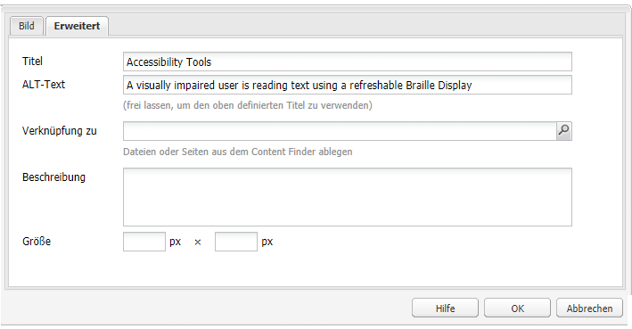

# Erstellen barrierefrei zugänglicher Inhalte (in Übereinstimmung mit den WCAG 2.0-Richtlinien){#creating-accessible-content-wcag-conformance}

>[!CAUTION]
>
>Da die klassische Benutzeroberfläche in AEM 6.4 nicht mehr unterstützt wird, wurde der Inhalt auf dieser Seite nicht für WCAG 2.1 aktualisiert.
>
>Auf den folgenden Seiten finden Sie Details zu AEM und WCAG 2.1:
>
>* [AEM und die Richtlinien für barrierefreies Webdesign](/help/managing/web-accessibility.md)
>* [Kurzanleitung zu WCAG 2.1](/help/managing/qg-wcag.md)
>* [Erstellen barrierefrei zugänglicher Inhalte (in Übereinstimmung mit den WCAG 2.1-Richtlinien)](/help/sites-authoring/creating-accessible-content.md)


WCAG 2.0 umfasst eine Reihe technologieunabhängiger Richtlinien und Erfolgskriterien, die Sie bei der Erstellung von Web-Inhalten unterstützen, die für Personen mit Behinderungen barrierefrei zugänglich sind.

>[!NOTE]
>
>Siehe auch:
>
>* [Kurzanleitung zu WCAG 2.0](/help/managing/qg-wcag.md)
>* [Konfigurieren des Rich-Text-Editors (RTE) für die Erstellung von barrierefrei zugänglichen Inhalten](/help/sites-administering/rte-accessible-content.md)
>


Diese Richtlinien werden nach drei Konformitätsstufen bewertet: Level A (niedrigste), Level AA und Level AAA (höchste). Die Ebenen werden kurz wie folgt definiert:

* **Stufe A:** Ihre Site erreicht eine einfache, minimale Barrierefreiheit. Bei Erreichen dieser Stufe sind alle Kategorie-A-Erfolgskriterien erfüllt.
* **Level AA:** Das ideale Level der Barrierefreiheit, das Sie anstreben sollten, bei dem Ihre Site ein höheres Maß an Barrierefreiheit erreicht, sodass sie für die meisten Menschen in den meisten Situationen mit den meisten Technologien zugänglich ist. Bei Erreichen dieser Stufe sind alle Erfolgskriterien der Ebenen A und AA erfüllt.
* **Ebene AAA:** Ihre Site erreicht ein sehr hohes Maß an Barrierefreiheit. Bei Erreichen dieser Stufe sind alle Kategorie-A-, -AA- und -AAA-Erfolgskriterien erfüllt.

Bei der Erstellung der Site sollten Sie festlegen, welchen Level Ihre Site insgesamt erfüllen soll.

Im folgenden Abschnitt finden Sie die [WCAG 2.0-Richtlinien](https://www.w3.org/TR/WCAG20/#guidelines) mit den entsprechenden Erfolgskriterien für die [Konformitäts-Level](https://www.w3.org/TR/UNDERSTANDING-WCAG20/conformance.html) Level A und Level AA.

>[!NOTE]
>
>Da es nicht möglich ist, alle Erfolgskriterien der Stufe AAA für bestimmte Inhaltstypen zu erfüllen, wird davon abgeraten, diese Konformität als allgemeine Richtlinie zu verlangen.

>[!NOTE]
>
>Dieses Dokument verwendet Folgendes:
>
>* Die Kurznamen für die [WCAG 2.0-Richtlinien](https://www.w3.org/TR/WCAG20/#guidelines).
>* Die Nummerierung der [WCAG 2.0-Richtlinien](https://www.w3.org/TR/WCAG20/#guidelines) zur Erleichterung von Querverweisen zur WCAG-Website.
>


## Grundsatz 1: Erkennbar     {#principle-perceivable}

[Grundsatz 1: Erkennbar – Informationen und Komponenten der Benutzeroberfläche müssen für die Benutzer so dargestellt sein, dass sie sie erkennen können.](https://www.w3.org/TR/WCAG20/#perceivable)

### Textalternativen (1.1) {#text-alternatives}

[Richtlinie 1.1 Textalternativen: Bieten Sie Textalternativen für nichttextliche Inhalte, damit sie in andere Formate geändert werden können, die von bestimmten Personen benötigt werden, wie zum Beispiel Großdruck, Braille, Sprache, Symbole oder einfachere Sprache.](https://www.w3.org/TR/WCAG20/#text-equiv)

### Nichttextlicher Inhalt (1.1.1) {#non-text-content}

* Erfolgskriterium 1.1.1
* Level A
* Nichttextlicher Inhalt: Alle nichttextlichen Inhalte, die Benutzern präsentiert werden, haben eine Textalternative, die dem jeweiligen Zweck entspricht, ausgenommen die unten aufgeführten Situationen.

#### Zweck: Nichttextliche Inhalte (1.1.1) {#purpose-non-text-content}

Informationen auf einer Web-Seite können in vielen verschiedenen nichttextlichen Formaten bereitgestellt werden, z. B. in Bildern, Videos, Animationen, Diagrammen und Diagrammen. Blinde Personen oder Personen mit schweren Sehbehinderungen können keinen nichttextlichen Inhalt anzeigen, können jedoch auf Textinhalte zugreifen, indem sie ihn von einer Bildschirmlesehilfe lesen lassen oder von einem Braille-Anzeigegerät in taktiler Form präsentiert werden. Indem Sie also Textalternativen zu Inhalten im grafischen Format bereitstellen, können Personen, die diesen grafischen Inhalt nicht sehen können, auf eine äquivalente Version der Informationen zugreifen, die der Inhalt bereitstellt.

Ein nützlicher weiterer Vorteil besteht darin, dass Textalternativen es ermöglichen, nichttextliche Inhalte durch Suchmaschinentechnologie zu indizieren.

#### Erfüllen: Nichttextlicher Inhalt (1.1.1) {#how-to-meet-non-text-content}

Bei statischen Grafiken besteht die Grundanforderung darin, eine gleichwertige Textalternative für die Grafik bereitzustellen. Diese Methode erfolgt im **Alternativtext** -Feld:

>[!NOTE]
>
>Einige integrierte Komponenten wie **Karussell** und **Dia-Show** bieten keine Möglichkeit zum Hinzufügen von alternativen Textbeschreibungen zu Bildern. Wenn Sie Versionen dieser Komponenten für Ihre AEM-Instanz implementieren, sollte Ihr Entwicklungsteam diese Komponenten so konfigurieren, dass die `alt` -Attribut. Dadurch wird sichergestellt, dass Autoren ihn zum Inhalt hinzufügen können (siehe [Hinzufügen der Unterstützung für weitere HTML-Elemente und -Attribute](/help/sites-administering/rte-accessible-content.md#add-support-for-more-html-elements-and-attributes)).

Das Feld **ALT-Text** ist im Komponentendialogfeld **Bild** auf der Registerkarte **Erweitert** verfügbar:



AEM fügt Ihren Bildern standardmäßig einen **ALT-Text** hinzu. Für die klassische Benutzeroberfläche gibt es zwei verschiedene Szenarien, in denen beschrieben wird, wie das Standardattribut erstellt wird. Der Standardwert reicht als Alternative möglicherweise nicht aus und muss wahrscheinlich im **Erweitert** Registerkarte &quot;Bildeigenschaften&quot;:

* Datei:

Ein Bild wird von der Festplatte des Benutzers hochgeladen. Wenn Sie einer Seite eine Bildkomponente hinzufügen und dann ein Bild von Ihrer Festplatte oder einer anderen Quelle auswählen, lautet der Standardwert für **ALT-Text** `file`. Dieser Wert muss im **Erweitert** Registerkarte &quot;Bildeigenschaften&quot;. Auch hier wird dieser Wert nicht im **Alternativtext** festgelegt ist, wird jedoch bei Änderung des Werts der neue Wert im Feld angezeigt.

* Asset:

Ein Bild wird aus dem digitalen Asset-Repository hinzugefügt. Wenn Sie ein Bild aus dem digitalen Asset-Repository auf eine Web-Seite ziehen, wird die **Titel** und **Alternativtext** -Werte für dieses Bild werden aus den Metadaten für dieses Bild übernommen.

>[!NOTE]
>
>In beiden oben genannten Szenarien ist der Wert **ALT-Text** nicht auf der Registerkarte **Erweiterte Bildeigenschaften** sichtbar. Geben Sie zur Änderung des Standardwerts im Feld **ALT-Text** einfach einen neuen Wert ein.

>[!NOTE]
>
>Wenn Ihr Bild nur Dekorationszwecken dient (siehe [Erstellen guter Textalternativen](#creating-good-text-alternatives)), dann können Sie im Feld **ALT-Text** durch Drücken der Leertaste ein Leerzeichen einfügen. Dadurch wird ein leeres `alt` -Attribut, das eine Bildschirmlesehilfe auffordert, das Bild zu ignorieren.

#### Erstellen guter Textalternativen {#creating-good-text-alternatives}

Es gibt verschiedene Arten von nichttextlichem Inhalt. Daher hängt der Wert der Textalternative von der Rolle ab, die die Grafik auf der Web-Seite spielt. Zu den allgemeinen Faustregeln gehören:

* Textalternativen sollten kurz sein, doch sollten sie die wesentlichen Informationen, die durch den nichttextlichen Inhalt bereitgestellt werden, eindeutig erfassen.
* Übermäßig lange Beschreibungen (über 100 Zeichen) sollten vermieden werden. Wenn eine Textalternative mehr Details erfordert:

   * Geben Sie im Alternativtext eine kurze Beschreibung an
   * und fügen Sie irgendwo anders auf der entsprechenden Seite oder auf einer anderen Web-Seite eine längere Beschreibung ein. Verknüpfen Sie diese separate Beschreibung, indem Sie das Bild zu einem Link machen oder indem Sie einen Textlink neben dem Bild platzieren.

* Alternativer Text sollte keine Inhalte replizieren, die in Textformularen bereitgestellt werden, die sich in der Nähe auf derselben Seite befinden. Beachten Sie, dass viele Bilder Abbildungen von Punkten sind, die bereits im Text einer Seite behandelt werden, sodass bereits eine detaillierte Textalternative vorhanden sein kann.
* Wenn der nichttextliche Inhalt ein Link zu einer anderen Seite oder zu einem anderen Dokument ist und kein anderer Text Teil desselben Links ist, muss der alternative Text für das Bild das Ziel des Links angeben. Das Bild darf nicht beschrieben werden.
* Wenn der nichttextliche Inhalt in einem Schaltflächenelement enthalten ist und kein Text Teil derselben Schaltfläche ist, muss der alternative Text des Bildes die Funktionalität der Schaltfläche angeben, nicht das Bild beschreiben.
* Es ist zulässig, dass ein Bild leeren (null) Alternativtext erhält, jedoch nur, wenn das Bild keinen alternativen Text aufweist. Es handelt sich beispielsweise um eine rein dekorative Grafik. Oder wenn der entsprechende Text bereits im Seitentext vorhanden ist.

Die [W3C-Entwurf: HTML5 Techniken zur Bereitstellung nützlicher Textalternativen](https://html.spec.whatwg.org/multipage/images.html#alt) verfügt über weitere Details und Beispiele für die Bereitstellung geeigneter alternativer Texte für Bilder unterschiedlicher Typen.

Bestimmte Arten von nichttextlichem Inhalt, für den Textalternativen erforderlich sind:

* Veranschaulichende Fotos:

Dies sind Bilder von Menschen, Objekten oder Orten. Denken Sie an die Rolle des Fotos auf der Seite. ein angemessenes Textäquivalent wahrscheinlich *Foto von [Objekt]*, kann jedoch vom umliegenden Text abhängen.

* Symbole:

Kleine Piktogramme (Grafiken), die bestimmte Informationen vermitteln. Sie müssen konsistent auf einer Seite und Site verwendet werden. Alle Instanzen des Symbols auf einer Seite oder Site sollten dieselbe kurze und knappe Textalternative haben, es sei denn, dies führt zu einer unnötigen Duplizierung von angrenzendem Text.

* Diagramme:

Diese stellen normalerweise numerische Daten dar. So könnte als eine Möglichkeit zur Bereitstellung von Alternativtext eine kurze Zusammenfassung der im Diagramm gezeigten Haupttrends eingefügt werden. Fall nötig, können Sie eine detailliertere Beschreibung im Text im Feld **Beschreibung** auf der Registerkarte **Erweiterte Bildeigenschaften** einfügen. Sie können die Quelldaten auch an anderer Stelle auf der Seite oder Site in Tabellenform bereitstellen.


Zur Bereitstellung einer Alternative für dieses Beispieldiagramm können Sie dem Bild selbst einen knappen `alt`-Text hinzufügen und dann dem Bild eine vollständige Textalternative folgen lassen.

```xml
<p></p>
<p> Figure 1. Distribution of Articles by Journal Category.
Pie chart: Language=68%, Education=14% and Science=18%.</p>
```

>[!NOTE]
>
>Der obige Ausschnitt dient nur zur Veranschaulichung der Reihenfolge. Verwenden Sie die **Bild** -Komponente anstatt der `img src` oben verwendete Referenz.

In AEM können Sie eine Kombination aus **Alternativtext** und **Beschreibung** Felder im Konfigurationsdialogfeld des Bildes - wie in [Erfüllen: Nichttextlicher Inhalt (1.1.1)](#how-to-meet-non-text-content).

* Karten, Diagramme, Flussdiagramme:

Für Grafiken mit räumlichen Daten (z. B. um Beziehungen zwischen Objekten oder einem Prozess zu beschreiben), stellen Sie sicher, dass die Schlüsselmeldung im Textformat bereitgestellt wird. Bei Karten ist die Bereitstellung eines Volltextäquivalents wahrscheinlich nicht sinnvoll. Wenn aber eine Karte den Weg zu einem bestimmten Ort zeigen soll, kann der Alternativtext des Kartenbildes kurz *Karte von X* einblenden und dann an einer anderen Stelle auf der Seite oder im Feld **Beschreibung** auf der Registerkarte **Erweitert** der Komponente **Bild** eine Wegbeschreibung zu dem Ort bereitstellen.

* CAPTCHAs:

Ein CAPTCHA ist ein *vollautomatischer öffentlicher Turing-Test zur Unterscheidung von Computern und Menschen*. Es handelt sich dabei um eine Sicherheitsprüfung, die auf Webseiten verwendet wird, um Menschen von böswilliger Software zu unterscheiden, was jedoch Barrierefreiheitsbarrieren verursachen kann. Es handelt sich um Bilder, bei denen Benutzer beschreiben müssen, was sie sehen, um einen Sicherheitstest zu bestehen. Es ist nicht möglich, eine Textalternative für das Bild bereitzustellen. Daher müssen Sie stattdessen alternative nichtgrafische Lösungen in Betracht ziehen.

Das W3C bietet verschiedene Vorschläge, wie z. B. die folgenden. Jeder dieser Ansätze hat seine eigenen Vorteile und Nachteile.

    * Logische Puzzles
    * Verwendung der Tonausgabe anstelle von Bildern
    * Eingeschränkte Benutzerkonten und Spamfilter.

* Hintergrundbilder:

Diese Bilder werden mit Cascading Style Sheets (CSS) statt mit HTML erstellt. Es ist nicht möglich, einen alternativen Textwert anzugeben. Daher sollten Hintergrundbilder keine wichtigen Textinformationen bereitstellen - wenn dies der Fall ist, müssen diese Informationen auch im Text der Seite angegeben werden.

Es ist jedoch wichtig, dass ein alternativer Hintergrund angezeigt wird, wenn das Bild nicht angezeigt werden kann.

>[!NOTE]
>
>Es sollte ein angemessenes Kontrastniveau zwischen dem Hintergrund- und dem Vordergrundtext vorhanden sein. Dieser Kontrast wird im Abschnitt [Kontrast (Minimum) (1.4.3)](#contrast-minimum).

#### Weitere Informationen: Nichttextlicher Inhalt (1.1.1) {#more-information-non-text-content}

* [Erfolgskriterien 1.1.1 verstehen](https://www.w3.org/TR/UNDERSTANDING-WCAG20/text-equiv-all.html)
* [Erfolgskriterien 1.1.1 erfüllen](https://www.w3.org/WAI/WCAG21/quickref/?versions=2.0#text-alternatives)
* [W3C: HTML5 Techniken zur Bereitstellung nützlicher Textalternativen](https://html.spec.whatwg.org/multipage/images.html#alt)
* [W3C-Erklärung und Alternativen zu CAPTCHAs](https://www.w3.org/TR/turingtest/)

### Zeitbasierte Medien (1.2) {#time-based-media}

[Richtlinie 1.2 Zeitbasierte Medien: Stellen Sie Alternativen für zeitbasierte Medien bereit.](https://www.w3.org/TR/WCAG20/#text-equiv)

Diese Informationen behandeln Web-Inhalte, die *zeitbasiert*. Hier werden Inhalte behandelt, die der Benutzer abspielen kann (z. B. Video, Audio und animierte Inhalte) und die entweder voraufgezeichnet oder als Live-Stream wiedergegeben werden können.

### Nur-Audio und Nur-Video (aufgezeichnet) (1.2.1) {#audio-only-and-video-only-pre-recorded}

* Erfolgskriterium 1.2.1
* Level A
* Nur-Audio und Nur-Video (aufgezeichnet): Für aufgezeichnete Nur-Audio- und aufgezeichnete Nur-Video-Medien ist Folgendes wahr, es sei denn, das Audio oder Video ist eine Medienalternative für Text und als solche eindeutig gekennzeichnet:

   * Nur aufgezeichnete Audio-Dateien: Es wird eine Alternative für zeitbasierte Medien bereitgestellt, die gleichwertige Informationen für aufgezeichnete Nur-Audio-Inhalte bereitstellen.
   * Nur aufgezeichnetes Video: Es wird entweder eine Alternative für zeitbasierte Medien oder ein Audio-Track bereitgestellt, der gleichwertige Informationen für aufgezeichnete Nur-Video-Inhalte enthält.

#### Zweck: Nur-Audio und Nur-Video (aufgezeichnet) (1.2.1)     {#purpose-audio-only-and-video-only-pre-recorded}

Probleme bei der Barrierefreiheit von Video und Audio können auftreten bei:

* Personen mit eingeschränkter Sehkraft, wenn kein Soundtrack vorhanden ist oder der Soundtrack nicht ausreicht, um sie über die Ereignisse im Video oder der Animation zu informieren;
* Menschen mit Hörbehinderungen oder taub, die den Soundtrack nicht hören können;
* Personen, die den Soundtrack hören können, aber nicht verstehen, was gesprochen wird (z. B. weil er in einer Sprache ist, die sie nicht verstehen).

Video- oder Audioinhalte stehen u. U. auch Personen nicht zur Verfügung, die Browser oder Geräte verwenden, die die Wiedergabe von Inhalten in bestimmten Medienformaten, z. B. Adobe Flash, nicht unterstützen.

Wenn Sie diese Informationen in einem anderen Format bereitstellen, z. B. Text (oder Audio für Video ohne Audio), können Sie sie für Personen verfügbar machen, die nicht auf den ursprünglichen Inhalt zugreifen können.

#### Erfüllen: Nur-Audio und Nur-Video (aufgezeichnet) (1.2.1)     {#how-to-meet-audio-only-and-video-only-pre-recorded}

* Wenn es sich bei dem Inhalt um aufgezeichnetes Audio ohne Video (wie zum Beispiel einen Podcast) handelt:

   * Stellen Sie direkt vor oder nach dem Inhalt einen Link zu einem Texttranskript des Audioinhalts bereit.

   Das Transkript sollte eine HTML-Seite mit einem Textäquivalent zu allen gesprochenen und wichtigen nicht gesprochenen Inhalten sein. Es sollte auch angeben, wer spricht, eine Beschreibung der Einstellung, Stimmausdrücke und eine Beschreibung anderer wichtiger Audioinhalte.

* Wenn es sich bei dem Inhalt um eine Animation oder ein aufgezeichnetes Video ohne Audio handelt:

   * Stellen Sie unmittelbar vor oder nach dem Inhalt einen Link zu einer entsprechenden Textbeschreibung der vom Video bereitgestellten Informationen bereit
   * Oder eine gleichwertige Audiobeschreibung in einem häufig verwendeten Audioformat wie MP3.

>[!NOTE]
>
>Wenn der Audio- oder Videoinhalt als Alternative zu Inhalten bereitgestellt wird, die in einem anderen Format auf einer Web-Seite vorhanden sind, müssen die oben genannten Anforderungen nicht erfüllt werden. Wenn ein Video beispielsweise eine Liste von Textanweisungen veranschaulicht, ist für dieses Video keine Alternative erforderlich, da die Textanweisungen bereits als Alternative zum Video dienen.

Das Einfügen von Multimedia-Inhalten, insbesondere Flash-Inhalten, in Ihre AEM Webseiten ist ähnlich wie das Einfügen eines Bildes. Da Multimedia-Inhalte jedoch viel mehr als ein Standbild sind, gibt es verschiedene Einstellungen und Optionen, um zu steuern, wie Multimedia wiedergegeben wird.

>[!NOTE]
>
>Wenn Sie Multimedia mit informativem Inhalt verwenden, müssen Sie auch Links zu Alternativen erstellen. Beispielsweise müssen Sie zum Hinzufügen eines Texttranskripts eine HTML-Seite für die Anzeige des Transkripts erstellen und dann neben oder unter dem Audioinhalt einen Link hinzufügen.

#### Weitere Informationen: Nur-Audio und Nur-Video (aufgezeichnet) (1.2.1) {#more-information-audio-only-and-video-only-pre-recorded}

* [Erfolgskriterien 1.2.1 verstehen](https://www.w3.org/TR/UNDERSTANDING-WCAG20/media-equiv-av-only-alt.html)
* [Erfolgskriterien 1.2.1 erfüllen](https://www.w3.org/WAI/WCAG21/quickref/?versions=2.0#time-based-media)

### Untertitel (aufgezeichnet) (1.2.2)     {#captions-pre-recorded}

* Erfolgskriterium 1.2.2
* Level A
* Untertitel (aufgezeichnet): Untertitel werden für alle aufgezeichneten Audioinhalte in synchronisierten Medien bereitgestellt, außer wenn das Medium eine Medienalternative für Text und als solche ausdrücklich gekennzeichnet ist.

#### Zweck: Untertitel (aufgezeichnet) (1.2.2)     {#purpose-captions-pre-recorded}

Personen, die taub oder schwerhörig sind, sind nicht in der Lage oder haben große Schwierigkeiten, Audioinhalte aufzurufen. Untertitel sind Textäquivalente für gesprochene und nicht gesprochene Audioinhalte, die zum richtigen Zeitpunkt während des Videos auf dem Bildschirm angezeigt werden. Sie ermöglichen es Menschen, die das Audio nicht hören können, zu verstehen, was passiert.

>[!NOTE]
>
>Untertitel sind nicht erforderlich, wenn auf derselben Seite wie das Video oder die Animation geeignete Text- oder Nicht-Text-Entsprechungen (die direkt gleichwertige Informationen bereitstellen) verfügbar sind.

#### Erfüllen: Untertitel (aufgezeichnet) (1.2.2)     {#how-to-meet-captions-pre-recorded}

Es gibt zwei Arten von Untertiteln:

* Offen: Immer sichtbar, wenn das Video abgespielt wird
* Geschlossen: Benutzer können die Untertitel ein- oder ausschalten

Verwenden Sie nach Möglichkeit verdeckte Untertitel. Benutzer können wählen, ob Untertitel angezeigt werden sollen.

Erstellen und geben Sie für geschlossene Beschriftungen eine synchronisierte Untertiteldatei in einem geeigneten Format an, z. B. [SMIL](https://www.w3.org/AudioVideo/), zusammen mit der Videodatei.

Weitere Informationen finden Sie in den Tutorials unter [Weitere Informationen: Untertitel (aufgezeichnet) (1.2.2)](#more-information-captions-pre-recorded). Stellen Sie sicher, dass Sie einen Hinweis bereitstellen, um den Benutzern mitzuteilen, dass Untertitel für das Video verfügbar sind.

Wenn Sie offene Untertitel verwenden müssen, betten Sie den Text in die Videospur ein. Diese Methode wird mithilfe von Videobearbeitungsanwendungen erreicht, die die Überlagerung von Titeln auf das Video ermöglichen.

#### Weitere Informationen: Untertitel (aufgezeichnet) (1.2.2)     {#more-information-captions-pre-recorded}

* [Erfolgskriterium 1.2.2 verstehen](https://www.w3.org/TR/UNDERSTANDING-WCAG20/media-equiv-captions.html):
* [Erfolgskriterien 1.2.2 erfüllen](https://www.w3.org/WAI/WCAG21/quickref/?versions=2.0#time-based-media)
* [W3C: Synchronisiertes Multimedia](https://www.w3.org/AudioVideo/)
* [Untertitel, Transkripte und Audiobeschreibungen – mit WebAIM](https://webaim.org/techniques/captions/)

### Audiobeschreibung oder Medienalternative (aufgezeichnet) (1.2.3)     {#audio-description-or-media-alternative-pre-recorded}

* Erfolgskriterium 1.2.3
* Level A
* Audiobeschreibung oder Medienalternative (aufgezeichnet): Eine Alternative für zeitbasierte Medien oder Audiobeschreibung des aufgezeichneten Videoinhalts wird für synchronisierte Medien bereitgestellt, es sei denn, das Medium ist eine Medienalternative für Text und ist als solche eindeutig gekennzeichnet.

#### Zweck: Audiobeschreibung oder Medienalternative (aufgezeichnet) (1.2.3)     {#purpose-audio-description-or-media-alternative-pre-recorded}

Blinde oder sehbehinderte Menschen erleben Barrierefreiheit, wenn die Informationen in einem Video oder einer Animation nur visuell bereitgestellt werden. Oder wenn der Soundtrack nicht genügend Informationen bereitstellt, um zu verstehen, was visuell geschieht.

#### Erfüllen: Audiobeschreibung oder Medienalternative (aufgezeichnet) (1.2.3)     {#how-to-meet-audio-description-or-media-alternative-pre-recorded}

Es gibt zwei Ansätze, die angewendet werden können, um dieses Erfolgskriterium zu erfüllen. Beide sind zulässig:

1. Fügen Sie zusätzliche Audiobeschreibungen für den Videoinhalt hinzu. Sie können diesen Ansatz auf eine von drei Arten durchführen:

   * Geben Sie während der Pausen im vorhandenen Dialogfeld Informationen zu Änderungen in der Szene an, die nicht als Teil des vorhandenen Audio-Tracks angezeigt werden.
   * Stellen Sie einen neuen, zusätzlichen und optionalen Audio-Track bereit, der den ursprünglichen Soundtrack enthält, aber auch zusätzliche Audioinformationen über Änderungen in der Szene enthält.

      * Benutzer können zwischen dem vorhandenen Audio-Track (der *nicht* enthalten eine Audiobeschreibung) und den neuen Audio-Track (der *does* enthalten eine Audiobeschreibung).
      * Diese Methode verhindert Unterbrechungen für Benutzer, die die zusätzliche Beschreibung nicht benötigen.
   * Erstellen Sie eine zweite Version des Videoinhalts, um erweiterte Audiobeschreibungen zu ermöglichen. Dadurch werden die Schwierigkeiten bei der Bereitstellung detaillierter Audiobeschreibungen innerhalb der Lücken zwischen dem bestehenden Dialog verringert, indem Audio und Video an geeigneten Punkten vorübergehend angehalten werden. Daher kann eine wesentlich längere Audiobeschreibung gegeben werden, bevor die Aktion erneut gestartet wird. Wie im vorherigen Beispiel ist dies am besten als optionaler zusätzlicher Audiotrack bereitgestellt, um eine Unterbrechung für Benutzer zu verhindern, die die zusätzliche Beschreibung nicht benötigen.


1. Geben Sie ein Text-Transkript an, das den Audio- und visuellen Elementen des Videos oder der Animation entspricht. Es sollte gegebenenfalls eine Beschreibung der Sprecher, eine Beschreibung der Einstellung, lautstarke Ausdrücke enthalten. Je nach Länge können Sie das Transkript auf derselben Seite wie das Video oder die Animation oder auf einer separaten Seite platzieren. Wenn Sie die zweite Option wählen, geben Sie einen Link zum Transkript neben dem Video oder der Animation an.

Genaue Details zum Erstellen von Audiobeschreibungen für Videos werden in diesem Handbuch nicht behandelt. Die Erstellung von Audiobeschreibungen kann zeitaufwendig sein, doch andere Adobe-Produkte helfen Ihnen bei diesen Aufgaben. Wenn Sie Inhalte in Adobe Flash Professional erstellen, sollten Sie auch ein Skript erstellen, um den Benutzer aufzufordern, das entsprechende Plug-in herunterzuladen. Zudem sollten Sie eine Textalternative anhand des Elements `<noscript>` bereitstellen.

#### Weitere Informationen: Audiobeschreibung oder Medienalternative (aufgezeichnet) (1.2.3) {#more-information-audio-description-or-media-alternative-pre-recorded}

* [Erfolgskriterien 1.2.3 verstehen](https://www.w3.org/TR/UNDERSTANDING-WCAG20/media-equiv-audio-desc.html):
* [Erfolgskriterien 1.2.3 erfüllen](https://www.w3.org/WAI/WCAG21/quickref/?versions=2.0#qr-media-equiv-audio-desc)
* [Adobe Encore CS5](https://helpx.adobe.com/premiere-pro/using/whats-new.html)

### Untertitel (live) (1.2.4)          {#captions-live}

* Erfolgskriterium 1.2.4
* Level AA
* Untertitel (Live): Untertitel werden für alle Live-Audioinhalte in synchronisierten Medien bereitgestellt.

#### Zweck: Untertitel (Live) (1.2.4) {#purpose-captions-live}

Dieses Erfolgskriterium entspricht dem Erfolgskriterium zu [Untertitel (aufgezeichnet)](#captions-pre-recorded) insofern, als es Zugangsbarrieren behandelt, die gehörlose oder schwerhörige Menschen erfahren; der Unterschied besteht darin, dass dieses Erfolgskriterium Live-Präsentationen wie Webcasts behandelt.

#### Erfüllen: Untertitel (Live) (1.2.4) {#how-to-meet-captions-live}

Befolgen Sie die Anleitungen für [Untertitel (aufgezeichnet)](#captions-pre-recorded) höher. Aufgrund der Live-Natur der Medien muss die Bereitstellung von Untertiteln jedoch so schnell wie möglich und entsprechend dem, was passiert, erstellt werden. Daher sollten Sie Tools für die Echtzeit-Untertitelung oder für Speech-to-Text in Erwägung ziehen.

Detaillierte Anweisungen dazu würden den Rahmen dieses Dokuments sprengen, doch in den folgenden Ressourcen finden Sie nützliche Informationen:

* [WebAIM: Echtzeit-Untertitelung](https://webaim.org/techniques/captions/realtime)
* [AccessIT (University of Washington): Können Untertitel automatisch über die Spracherkennung erstellt werden?](https://www.washington.edu/doit/programs/accessit?1209)

#### Weitere Informationen: Untertitel (Live) (1.2.4)     {#more-information-captions-live}

* [Erfolgskriterien 1.2.4 verstehen](https://www.w3.org/TR/UNDERSTANDING-WCAG20/media-equiv-real-time-captions.html)
* [Erfolgskriterien 1.2.4 erfüllen](https://www.w3.org/WAI/WCAG21/quickref/?versions=2.0#qr-media-equiv-real-time-captions)

### Audiobeschreibung (aufgezeichnet) (1.2.5)          {#audio-description-pre-recorded}

* Erfolgskriterium 1.2.5
* Level AA
* Audiobeschreibung (aufgezeichnet): Audiobeschreibung wird für alle aufgezeichneten Videoinhalte in synchronisierten Medien bereitgestellt.

#### Zweck: Audiobeschreibung (aufgezeichnet) (1.2.5)     {#purpose-audio-description-pre-recorded}

Dieses Erfolgskriterium entspricht dem Erfolgskriterium zu [Audiobeschreibung oder Medienalternative (aufgezeichnet)](#audio-description-or-media-alternative-pre-recorded), mit dem Unterschied, dass Autoren eine wesentlich detailliertere Audiobeschreibung verfassen müssen, um Level AA zu erfüllen.

#### Erfüllen: Audiobeschreibung (aufgezeichnet) (1.2.5)     {#how-to-meet-audio-description-pre-recorded}

Befolgen Sie die Anweisungen für [Audiobeschreibung oder Medienalternative (aufgezeichnet)](#audio-description-or-media-alternative-pre-recorded).

#### Weitere Informationen: Audiobeschreibung (aufgezeichnet) (1.2.5)     {#more-information-audio-description-pre-recorded}

* [Erfolgskriterien 1.2.5 verstehen](https://www.w3.org/TR/UNDERSTANDING-WCAG20/media-equiv-audio-desc-only.html)
* [Erfolgskriterien 1.2.5 erfüllen](https://www.w3.org/WAI/WCAG21/quickref/?versions=2.0#qr-media-equiv-audio-desc-only)

### Anpassbar (1.3) {#adaptable}

[Richtlinie 1.3 Anpassbar: Erstellen Sie Inhalte, die auf unterschiedliche Weise präsentiert werden können (z. B. einfacheres Layout), ohne Informationen oder Struktur zu verlieren.](https://www.w3.org/TR/WCAG20/#content-structure-separation)

Diese Richtlinie deckt die Anforderungen ab, die zur Unterstützung von Personen erforderlich sind, die:

* kann möglicherweise nicht auf Informationen zugreifen, die von einem Autor in einer *standard* zweidimensionales, mehrspaltiges, farbiges Webseitenlayout

* Personen, die eine Nur-Audio-Darstellung oder alternative visuelle Darstellung wie Großdruck oder hohen Kontrast verwenden wollen.

### Informationen und Beziehungen (1.3.1)              {#info-and-relationships}

* Erfolgskriterium 1.3.1
* Level A
* Informationen und Beziehungen: Informationen, Struktur und Beziehungen, die durch die Präsentation vermittelt werden, können programmatisch bestimmt werden oder sind im Text verfügbar.

#### Zweck: Informationen und Beziehungen (1.3.1) {#purpose-info-and-relationships}

Viele Hilfstechnologien, die von Menschen mit Behinderungen genutzt werden, sind auf strukturelle Informationen angewiesen, um Inhalte effektiv anzuzeigen oder auszugeben. Diese Strukturinformationen können in Form von Seitenüberschriften, Tabellenzeilen und Spaltenüberschriften sowie Listentypen vorliegen. Beispielsweise könnte eine Bildschirmlesehilfe einem Benutzer die Navigation von einer Überschrift zur nächsten ermöglichen. Wenn Seiteninhalte jedoch nur über visuelles Design und nicht über das zugrunde liegende HTML strukturiert zu sein scheinen, stehen für Hilfstechnologien keine Strukturinformationen zur Verfügung, sodass sie das Browsen beschränken können.

Dieses Erfolgskriterium besteht darin sicherzustellen, dass solche Strukturinformationen über HTML bereitgestellt werden, damit Browser und Hilfstechnologien auf die Informationen zugreifen und diese nutzen können.

#### Erfüllen: Informationen und Beziehungen (1.3.1)       {#how-to-meet-info-and-relationships}

AEM erleichtert den Aufbau von Web-Seiten mit den entsprechenden HTML-Elementen. Öffnen Sie den Seiteninhalt im RTE (eine Textkomponente) und verwenden Sie die **Format** -Menü, um das entsprechende Strukturelement anzugeben (z. B. Absatz und Überschrift).

Die folgende Abbildung zeigt Text, der als Absatztext formatiert wurde. Die verwendete Quellcode-Ansicht zeigt an, dass sie das richtige Öffnen und Schließen aufweist &lt;p> und &lt;/p> Tags.


Stellen Sie sicher, dass Ihre Webseiten die entsprechende Struktur erhalten, indem Sie:

* **Verwendung von Überschriften:**  

Solange die Barrierefreiheitsfunktionen des RTE aktiviert sind (siehe [AEM und Zugänglichkeit](/help/sites-administering/rte-accessible-content.md)), bietet AEM drei Ebenen für Seitenüberschriften. Sie können diese verwenden, um Abschnitte und Unterabschnitte des Inhalts zu identifizieren. Überschrift 1 ist die höchste Überschriftenstufe und Stufe 3 die niedrigste. Der Systemadministrator kann das System so konfigurieren, dass mehr Überschriftenstufen verwendet werden können.

Im folgenden Bild ist ein Beispiel der verschiedenen Überschriftentypen zu sehen.


* **Hervorgehobener Text**:

Verwenden Sie das - oder -Element, um eine Hervorhebung anzugeben. Verwenden Sie keine Überschriften zum Hervorheben von Text in Absätzen.

    * Markieren Sie den Text, den Sie hervorheben möchten.
    * Klicken Sie auf das Symbol **B** (für &amp;lt;strong&amp;gt;) oder das Symbol **I** (für &amp;lt;em&amp;gt;), das im Bedienfeld **Eigenschaften** angezeigt wird (vergewissern Sie sich, dass HTML ausgewählt ist).

>[!NOTE]
>
>RTE ist in einer Standardinstallation von AEM wie folgt eingerichtet:
>
>* &lt;b> für &lt;strong>
* &lt;i> für &lt;em>
  >
Sie sind im Grunde identisch, aber und sind vorzuziehen, da sie semantisch korrekt HTML sind. Ihr Entwicklungsteam kann den RTE für die Verwendung und (anstelle von und) bei der Entwicklung Ihrer Projektinstanz konfigurieren.

* **Listen verwenden**: Mit HTML können Sie drei verschiedene Arten von Listen angeben:

   * Das Element `<ul>` wird für *nicht geordnete* Listen (Aufzählungslisten) verwendet. Einzelne Listenelemente werden mit dem Element `<li>` gekennzeichnet.

   Verwenden Sie in RTE das Symbol **Aufzählung**.

   * Das Element `<ol>` wird für *nummerierte* Listen verwendet. Einzelne Listenelemente werden mit dem Element `<li>` gekennzeichnet.

   Verwenden Sie in RTE das Symbol **Nummerierte Liste**.

Wenn Sie vorhandenen Inhalt in einen bestimmten Listentyp ändern möchten, markieren Sie den entsprechenden Text und wählen Sie den entsprechenden Listentyp aus. Wie im vorherigen Beispiel, das zeigt, wie Absatztext eingegeben wird, werden die entsprechenden Listenelemente automatisch zu Ihrer HTML hinzugefügt. Sie können dies jedoch in der Ansicht der Quellbearbeitung anzeigen.

>[!NOTE]
Die `<dl>` -Element wird vom RTE nicht unterstützt.

* **Tabellen verwenden**:

Datentabellen müssen mithilfe von HTML-Tabellenelementen identifiziert werden:

    * one `&lt;table>` element
    * a `&lt;tr>&quot;-Element für jede Tabellenzeile
    * a `&lt;th>`-Element für jede Zeilen- und Spaltenüberschrift
    * a `&lt;td>&quot;-Element für jede Datenzelle

>[!NOTE]
Tabellen sollten mit der Komponente **Tabelle** umgesetzt werden. Obwohl Tabellen in der Textkomponente erstellt werden können, wird dieses Verfahren nicht empfohlen.

Barrierefreie Tabellen verwenden außerdem die folgenden Elemente und Attribute:

    * Der &quot;&lt;caption>Das Element &quot;&quot;wird verwendet, um eine sichtbare Beschriftung für die Tabelle bereitzustellen. Beschriftungen werden standardmäßig zentriert über der Tabelle angezeigt, können jedoch mithilfe von CSS entsprechend positioniert werden. Die Beschriftung wird programmatisch mit der Tabelle verknüpft. Daher ist sie eine nützliche Methode, um eine Einführung in Inhalte bereitzustellen.
    * Der &quot;&lt;h3 class=&quot;summary&quot;>Mit &quot;element&quot;können nicht sehende Benutzer die in einer Tabelle dargestellten Informationen leichter verstehen, indem sie eine Übersicht darüber bereitstellen, was sehende Benutzer sehen können. Dies ist besonders nützlich bei komplexen oder unkonventionellen Tabellen-Layouts (dieses Attribut wird nicht im Browser angezeigt, sondern nur für Hilfstechnologien ausgelesen).
    * Das Attribut &quot;scope&quot;des `&lt;th>&quot;&quot;-Element wird verwendet, um anzugeben, ob eine Zelle eine Kopfzeile für eine bestimmte Zeile oder für eine bestimmte Spalte darstellt. Auf ähnliche Weise können die Überschrift und ID-Attribute in komplexen Tabellen verwendet werden, bei denen Datenzellen mit einer oder mehreren Überschriften verknüpft sein können.

>[!NOTE]
Diese Elemente und Attribute sind standardmäßig nicht direkt verfügbar, doch der Systemadministrator kann Support für diese Werte im Dialogfeld **Tabelleneigenschaften** hinzufügen (siehe [Hinzufügen von Support für zusätzliche HTML-Elemente und -Attribute](/help/sites-administering/rte-accessible-content.md#add-support-for-more-html-elements-and-attributes)).

Beim Hinzufügen von **Verzeichnis** können Sie **Tabelleneigenschaften** über das Dialogfeld.

    * eine geeignete **Beschriftung**.
    * Idealerweise sollten Sie alle Standardwerte für **Breite*, **Höhe*, **Rand**, **Textabstand**, **Zellenabstand**, **Zellenabstand** entfernen. da diese Eigenschaften in einem globalen Stylesheet festgelegt werden können.


Anschließend können Sie im Dialogfeld **Zelleneigenschaften** auswählen, ob die Zelle eine Daten- oder Überschriftzelle ist und ob im Fall einer Überschriftzelle sich diese auf eine Zeile oder Spalte oder beides bezieht:


* **Komplexe Datentabellen:**

Manchmal reichen bei komplexen Tabellen mit zwei oder mehr Kopfzeilen die grundlegenden Tabelleneigenschaften möglicherweise nicht aus, um alle erforderlichen Strukturinformationen bereitzustellen. Für diese Arten komplexer Tabellen müssen direkte Beziehungen zwischen den Kopfzeilen und den zugehörigen Zellen mithilfe der Variablen **header** und **id** -Attribute. Beispielsweise werden in der Tabelle unten Überschriften und IDs zugeordnet, um eine programmgesteuerte Verbindung für Benutzer von Hilfstechnologien herzustellen.

>[!NOTE]
Das id-Attribut ist in einer nativen Installation nicht verfügbar. Sie kann durch die Konfiguration von HTML-Regeln und des Serialisierungsprogramms im RTE aktiviert werden.

>[!NOTE]
Tabellen sollten mit der Komponente **Tabelle** umgesetzt werden. Obwohl Tabellen in der Textkomponente erstellt werden können, wird dieses Verfahren nicht empfohlen.

```xml
<table>
   <tr>
     <th rowspan="2" id="h">Homework</th>
     <th colspan="3" id="e">Exams</th>
     <th colspan="3" id="p">Projects</th>
   </tr>
   <tr>
     <th id="e1" headers="e">1</th>
     <th id="e2" headers="e">2</th>
     <th id="ef" headers="e">Final</th>
     <th id="p1" headers="p">1</th>
     <th id="p2" headers="p">2</th>
     <th id="pf" headers="p">Final</th>
   </tr>
   <tr>
    <td headers="h">15%</td>
    <td headers="e e1">15%</td>
    <td headers="e e2">15%</td>
    <td headers="e ef">20%</td>
    <td headers="p p1">10%</td>
    <td headers="p p2">10%</td>
    <td headers="p pf">15%</td>
   </tr>
  </table>
```

Um dies in AEM zu erreichen, müssen Sie das Markup direkt im Quellbearbeitungsmodus hinzufügen.

>[!NOTE]
Diese Funktion ist in einer Standardinstallation nicht sofort verfügbar. Dies erfordert die Konfiguration des RTE; HTML-Regeln und Serialisierungsprogramm.

#### Weitere Informationen: Informationen und Beziehungen (1.3.1) {#more-information-info-and-relationships}

* [Erfolgskriterien 1.3.1 verstehen](https://www.w3.org/TR/UNDERSTANDING-WCAG20/content-structure-separation-programmatic.html)
* [Erfolgskriterien 1.3.1 erfüllen](https://www.w3.org/WAI/WCAG21/quickref/?versions=2.0#qr-content-structure-separation-programmatic)

### Sensorische Eigenschaften (1.3.3)          {#sensory-characteristics}

* Erfolgskriterium 1.3.3
* Level A
* Sensorische Eigenschaften: Anweisungen, die zum Verstehen und Bedienen von Inhalt verfügbar sind, beziehen sich nicht nur auf sensorische Eigenschaften der Komponenten wie Form, Größe, visuelle Position, Ausrichtung oder Klang.

#### Zweck: Sensorische Eigenschaften (1.3.3) {#purpose-sensory-characteristics}

Entwickler nutzen bei der Präsentation von Informationen oft visuelle Design-Mittel wie Farbe, Form, Textstil oder die absolute oder relative Position eines Inhaltselements. Hierbei kann es sich um leistungsstarke Design-Techniken zur Informationsübermittlung handeln. Blinde oder Sehbehinderte können jedoch möglicherweise nicht auf Informationen zugreifen, die eine visuelle Identifizierung von Attributen wie Position, Farbe oder Form erfordern.

Auf ähnliche Weise stellen Informationen, bei denen zwischen verschiedenen Klängen unterschieden werden muss (z. B. Inhalte, die von Männern oder Frauen gesprochen werden), Barrierefreiheit für Personen mit eingeschränktem Hörvermögen dar, wenn sie nicht in einer Textalternative für den Audioinhalt berücksichtigt werden.

>[!NOTE]
Die Anforderungen, die sich auf die Alternativen für Farben beziehen, finden Sie unter [Verwendung von Farbe](#use-of-color).

#### Erfüllen: Sensorische Eigenschaften (1.3.3) {#how-to-meet-sensory-characteristics}

Stellen Sie sicher, dass alle Informationen, die sich auf visuelle Eigenschaften des Seiteninhalts stützen, auch in einem alternativen Format angezeigt werden.

* Verlassen Sie sich nicht auf die visuelle Position, um Informationen anzugeben. Wenn Sie beispielsweise Benutzer auf ein Menü rechts auf der Seite verweisen möchten, über das sie auf weitere Informationen zugreifen können, verweisen Sie auf *das Menü rechts*; Benennen Sie stattdessen das Menü (z. B. über eine Überschrift) und verweisen Sie im Text auf diesen Namen.
* Verlassen Sie sich nicht auf den Textstil (z. B. fett oder kursiv gedruckter Text) als einzige Methode zur Vermittlung von Informationen.

>[!NOTE]
Die Verwendung beschreibender Begriffe ist zulässig, wenn sie in einem nicht visuellen Kontext eine Bedeutung haben. Verwenden Sie beispielsweise *above* und *below* im Allgemeinen akzeptabel sein, da sie Inhalte vor und nach einem bestimmten Inhaltselement implizieren. Es wäre immer noch sinnvoll, wenn der Inhalt laut gesprochen wird.

#### Weitere Informationen – Sensorische Eigenschaften (1.3.3) {#more-information-sensory-characteristics}

* [Erfolgskriterien 1.3.3 verstehen](https://www.w3.org/TR/UNDERSTANDING-WCAG20/content-structure-separation-understanding.html)
* [Erfolgskriterien 1.3.3 erfüllen](https://www.w3.org/WAI/WCAG21/quickref/?versions=2.0#qr-content-structure-separation-understanding)

### Unterscheidbar (1.4) {#distinguishable}

[Richtlinie 1.4 Unterscheidbar: Erleichtern Sie den Benutzern das Sehen und Hören von Inhalt einschließlich der Unterscheidung von Vorder- und Hintergrund.](https://www.w3.org/TR/WCAG20/#visual-audio-contrast)

### Verwendung von Farbe (1.4.1)  {#use-of-color}

* Erfolgskriterium 1.4.1
* Level A
* Verwendung von Farbe: Farbe wird nicht als einziges visuelles Mittel zur Informationsübermittlung, zur Angabe einer Aktion, zur Aufforderung einer Antwort oder zur Unterscheidung eines visuellen Elements verwendet.

>[!NOTE]
Dieses Erfolgskriterium bezieht sich speziell auf die Farbwahrnehmung. Andere Wahrnehmungsformen werden unter [Anpassbar (1.3)](#adaptable); einschließlich programmatischer Zugriff auf Farbe und andere visuelle Darstellungskodierungen.

#### Zweck - Verwendung von Farbe (1.4.1) {#purpose-use-of-color}

Farbe ist eine effektive Methode, um die ästhetische Anziehungskraft von Webseiten zu verbessern, und auch bei der Vermittlung von Informationen nützlich. Es gibt jedoch eine Reihe visueller Beeinträchtigungen, von Blindheit bis hin zu Sehschwäche, was bedeutet, dass einige Menschen nicht in der Lage sind, zwischen bestimmten Farben zu unterscheiden. Dieses Problem macht die Farbcodierung zu einer unzuverlässigen Methode zur Bereitstellung von Informationen.

So kann beispielsweise jemand mit einem rot-grünen Sehmangel nicht zwischen Grün- und Rottönen unterscheiden. Sie können beide Farben als dritte Farbe sehen (z. B. braun), in diesem Fall können sie nicht zwischen rot, grün und braun unterscheiden.

Außerdem kann die Farbe nicht von Personen wahrgenommen werden, die reinen Text-Browsern, monochromen Anzeigegeräten oder einen Schwarzweiß-Ausdruck auf der Seite verwenden.

#### Erfüllen - Verwendung von Farbe (1.4.1) {#how-to-meet-use-of-color}

Immer wenn Farbe verwendet wird, um Informationen zu vermitteln, müssen Sie sicherstellen, dass die verfügbaren Informationen auch verfügbar sind, wenn die Farbe nicht sichtbar ist.

Stellen Sie z. B. sicher, dass die durch die Farbe vermittelte Information auch explizit im Text enthalten ist. Die folgende Abbildung zeigt, wie Farbe und Text sowohl die Sitzverfügbarkeit für eine Leistung anzeigen:

<table>
 <tbody>
  <tr>
   <td><p><strong>Leistung</strong></p> </td>
   <td><p><strong>Verfügbarkeit</strong></p> </td>
  </tr>
  <tr>
   <td><p>Dienstag, 16. März<sup>th</sup></p> </td>
   <td><p>VERFÜGBARE SITZE</p> </td>
  </tr>
  <tr>
   <td><p>Mittwoch, 17. März<sup>th</p> </td>
   <td><p>VERFÜGBARE SITZE</p> </td>
  </tr>
  <tr>
   <td><p>Donnerstag 18. März<sup>th</sup></p> </td>
   <td><p>VERKAUFT</p> </td>
  </tr>
 </tbody>
</table>

Wenn Farbe als Hinweis für Informationen verwendet wird, sollten Sie einen zusätzlichen visuellen Hinweis bereitstellen, z. B. eine Änderung des Stils (z. B. fett, kursiv) oder der Schriftart. Dies hilft Menschen mit schlechtem Sehvermögen oder einer beeinträchtigten Farbwahrnehmung, die Information zu erkennen. Sie kann sich jedoch nicht vollständig darauf verlassen, da sie Personen, die die Seite überhaupt nicht sehen können, nicht hilft.

#### Weitere Informationen – Verwendung von Farbe (1.4.1) {#more-information-use-of-color}

* [Erfolgskriterien 1.4.1 verstehen](https://www.w3.org/TR/2008/NOTE-WCAG20-TECHS-20081211/working-examples/G183/link-contrast.html)
* [Erfolgskriterien 1.4.1 erfüllen](https://www.w3.org/TR/2008/NOTE-WCAG20-TECHS-20081211/working-examples/G183/link-contrast.html)
* [Anleitung für das Erzielen eines Kontrastverhältnisses von 3:1 mit einer Liste Web-sicherer Farben](https://www.w3.org/TR/2008/NOTE-WCAG20-TECHS-20081211/working-examples/G183/link-contrast.html)

### Kontrast (Minimum) (1.4.3) {#contrast-minimum}

* Erfolgskriterium 1.4.3
* Level AA
* Kontrast (Minimum): Die visuelle Darstellung von Text und Bildern von Text hat ein Kontrastverhältnis von mindestens 4,5:1, mit Ausnahme der folgenden:

   * Großer Text: Großformatigen Text und Bilder von großformatigem Text weisen ein Kontrastverhältnis von mindestens 3:1 auf.
   * Beiläufig: Für Text oder Textbilder, die Teil einer inaktiven Komponente der Benutzeroberfläche sind, die reine Dekoration darstellen, die für niemanden sichtbar sind oder die Teil eines Bildes sind, das signifikanten anderen visuellen Inhalt enthält, ist kein Kontrast erforderlich.
   * Firmenschriftzüge: Für Text, der Teil eines Logos oder eines Markennamens ist, gibt es keine Kontrastanforderungen.

#### Zweck - Kontrast (Minimum) (1.4.3)       {#purpose-contrast-minimum}

Personen mit bestimmten Sehbehinderungen können möglicherweise nicht zwischen bestimmten Farbpaaren mit geringem Kontrast unterscheiden. Für diese Personen können Probleme mit der Barrierefreiheit auftreten, wenn

* Wenn zwischen dem Text und der Hintergrundfarbe nur wenig Kontrast besteht.
* Die Farbkodierung von Text (z. B. Linktext und Nicht-Link-Text) ist für die Unterscheidung von Informationen wichtig.

>[!NOTE]
Text, der ausschließlich für Dekorationszwecke verwendet wird, ist von diesem Erfolgskriterium ausgeschlossen.

#### Erfüllen - Kontrast (Minimum) (1.4.3) {#how-to-meet-contrast-minimum}

Stellen Sie sicher, dass der Text ausreichend mit dem Hintergrund kontrastiert. Die Kontrastverhältnisse hängen von der Größe und dem Stil des betreffenden Textes ab:

* Für Text mit einer Größe von weniger als 18 Punkt (oder 14 Punkt bei Fettschrift) sollte das Kontrastverhältnis zwischen Text/Bildern mit Text und dem Hintergrund mindestens 4,5:1 betragen.
* Für Text mit einer Größe von mindestens 18 Punkt (oder 14 Punkt fett) sollte das Kontrastverhältnis mindestens 3:1 betragen.
* Wenn ein Hintergrund gemustert ist, sollte der Hintergrund um einen beliebigen Text schattiert werden, sodass das Verhältnis 4,5:1 oder 3:1 beibehalten wird.

Verwenden Sie ein Farbkontrasttool, z. B. die [Paciello Group Color Contrast Analyzer](https://www.paciellogroup.com/resources/contrast-analyser.html) oder [WebAIM-Farbkontrastprüfer](https://webaim.org/resources/contrastchecker/). Mit diesen Tools können Sie Farbpaare überprüfen und über Kontrastprobleme berichten.

Wenn Sie sich weniger Gedanken darüber machen, das Erscheinungsbild Ihrer Seite festzulegen, können Sie auch festlegen, dass keine Farben für Hintergrund- und Vordergrundtext festgelegt werden. Es ist keine Kontrastprüfung erforderlich, da der Browser des Benutzers die Farben des Texts und des Hintergrunds bestimmt.

Wenn es nicht möglich ist, die empfohlenen Kontraststufen zu erreichen, stellen Sie einen Link zu einer alternativen, gleichwertigen Version der Seite bereit (die keine Farbkontrastprobleme aufweist). Oder lassen Sie den Benutzer den Kontrast des Seitenfarbschemas an seine eigenen Anforderungen anpassen.

#### Weitere Informationen - Kontrast (Minimum) (1.4.3) {#more-information-contrast-minimum}

* [Erfolgskriterien 1.4.3 verstehen](https://www.w3.org/TR/UNDERSTANDING-WCAG20/visual-audio-contrast-contrast.html)
* [Erfolgskriterien 1.4.3 erfüllen](https://www.w3.org/WAI/WCAG21/quickref/?versions=2.0#qr-visual-audio-contrast-contrast)

### Bilder von Text (1.4.5)     {#images-of-text}

* Erfolgskriterium 1.4.5
* Level AA
* Bilder von Text: Falls die verwendeten Technologien die visuelle Präsentation realisieren können, wird für die Vermittlung von Informationen Text verwendet – keine Bilder von Text. Dabei gelten folgende Ausnahmen:

   * Anpassbar: Das Textbild kann visuell an die Anforderungen des Benutzers angepasst werden.
   * Wesentlich: Eine besondere Textdarstellung ist für die vermittelte Information von wesentlicher Bedeutung.

>[!NOTE]
Logotypen (Text, der Teil eines Logos oder Markennamen ist) werden als wesentlich betrachtet.

#### Zweck - Bilder von Text (1.4.5) {#purpose-images-of-text}

Bilder von Text werden häufig verwendet, wenn ein bestimmter Textstil bevorzugt wird, z. B. bei einem Firmenschriftzug oder wenn der Text aus einer anderen Quelle generiert wurde (etwa ein eingescanntes Papierdokument). Im Vergleich zu Text, der im HTML vorgestellt und mit CSS formatiert wird, haben Textbilder jedoch nicht die Flexibilität, die Größe oder das Erscheinungsbild zu ändern, die für Personen mit Sehbehinderungen oder Leseschwächen erforderlich sein könnten.

#### Erfüllen - Bilder von Text (1.4.5) {#how-to-meet-images-of-text}

Wenn Bilder von Text verwendet werden müssen, nutzen Sie CSS, um die Bilder von Text in HTML durch einen identischen Text zu ersetzen, damit der Text in einer anpassbaren Version verfügbar ist. Ein Beispiel finden Sie unter [C30: Verwenden von CSS zum Ersetzen von Text durch Bilder von Text und Bereitstellen von Steuerelementen für die Benutzeroberfläche zum Wechseln](https://www.w3.org/TR/2008/NOTE-WCAG20-TECHS-20081211/C30).

#### Weitere Informationen - Bilder von Text (1.4.5) {#more-information-images-of-text}

* [Erfolgskriterien 1.4.5 verstehen](https://www.w3.org/TR/UNDERSTANDING-WCAG20/visual-audio-contrast-text-presentation.html)
* [Erfolgskriterien 1.4.5 erfüllen](https://www.w3.org/WAI/WCAG21/quickref/?versions=2.0#qr-visual-audio-contrast-text-presentation)

## Grundsatz 2: Bedienbar {#principle-operable}

[Grundsatz 2: Bedienbar – Komponenten der Benutzerschnittstelle und der Navigation müssen bedienbar sein.](https://www.w3.org/TR/WCAG20/#operable)

### Pausieren, Beenden, Ausblenden (2.2.2)          {#pause-stop-hide}

* Erfolgskriterium 2.2.2
* Level A
* Pausieren, Beenden, Ausblenden: Für sich bewegende, blinkende, scrollende oder sich automatisch aktualisierende Informationen gelten folgenden Regeln:

   * Verschieben, blinken, scrollen: Für bewegte, blinkende oder scrollende Informationen, die (a) automatisch gestartet werden, (b) länger als fünf Sekunden dauern und (c) parallel zu anderen Inhalten präsentiert werden, gibt es einen Mechanismus, mit dem der Benutzer sie anhalten, stoppen oder verbergen kann, es sei denn, die Bewegung, das Blinken oder Scrollen ist Teil einer Aktivität, in der sie wichtig ist.
   * Automatische Aktualisierung: Für alle automatisch aktualisierten Informationen, die (a) automatisch gestartet und (b) parallel zu anderen Inhalten angezeigt werden, gibt es einen Mechanismus, mit dem der Benutzer sie anhalten, stoppen oder ausblenden oder die Häufigkeit der Aktualisierung steuern kann, es sei denn, die automatische Aktualisierung ist Teil einer Aktivität, in der sie wichtig ist.

Beachten Sie Folgendes:

1. Die Anforderungen für flackernden oder blinkenden Inhalt finden Sie unter [Gestalten Sie Inhalte nicht auf Arten, von denen bekannt ist, dass sie zu Anfällen führen (2.3)](#seizures).
1. Jeglicher Inhalt, der dieses Erfolgskriterium nicht erfüllt, kann die Möglichkeit eines Benutzers beeinträchtigen, die gesamte Seite zu nutzen. Daher muss jeglicher Inhalt auf einer Web-Seite (egal ob er dazu dient, andere Erfolgskriterien zu erfüllen oder nicht) dieses Erfolgskriterium erfüllen. Siehe [Konformitätsanforderung 5: Nichtinterferenz](https://www.w3.org/TR/WCAG20/#cc5).
1. Inhalte, die regelmäßig durch Software aktualisiert werden oder an den Benutzeragenten gestreamt werden, müssen Informationen, die zwischen der Initiierung der Pause und der Wiederaufnahme der Präsentation generiert oder empfangen wurden, nicht beibehalten oder präsentieren, da dies technisch möglicherweise nicht möglich ist und in vielen Situationen irreführend sein könnte.
1. Eine Animation, die im Rahmen einer Vorausladephase oder einer ähnlichen Situation auftritt, kann als wesentlich angesehen werden, wenn während dieser Phase keine Interaktion für alle Benutzer stattfinden kann und wenn kein Hinweis auf Fortschritt angezeigt wird, Benutzer verwirren könnte oder sie glauben lässt, dass der Inhalt eingefroren oder beschädigt wurde.

#### Zweck - Pausieren, Beenden, Ausblenden (2.2.2) {#purpose-pause-stop-hide}

Manche Benutzer können Inhalte, die sich bewegen, ablenkend finden und es schwierig machen, sich auf andere Teile der Seite zu konzentrieren. Außerdem können solche Inhalte für Personen, die Schwierigkeiten haben, bewegten Text zu halten, schwierig zu lesen sein.

#### Erfüllen - Pausieren, Beenden, Ausblenden (2.2.2) {#how-to-meet-pause-stop-hide}

Je nach Art des Inhalts können Sie beim Erstellen von Webseiten, die bewegten, blitzenden oder blinkenden Inhalt enthalten, eine oder mehrere der folgenden Vorschläge anwenden:

* Bieten Sie die Möglichkeit, das Scrollen von Inhalten anzuhalten, damit Benutzer genügend Zeit zum Lesen haben. Beispielsweise Nachrichten-Ticker oder automatisch aktualisierter Text.
* Stellen Sie sicher, dass blinkende Inhalte maximal fünf Sekunden lang blinken.
* Nutzen Sie Technologien, mit denen die Anzeige von blinkenden Inhalten im Browser deaktiviert werden kann, z. B. Dateien im GIF- (Graphics Interchange Format) oder APNG-Format (Animated Portable Network Graphics).
* Stellen Sie ein Formularsteuerelement auf der Web-Seite bereit, damit der Benutzer alle blinkenden Inhalte auf der Seite deaktivieren kann.
* Wenn einer der oben genannten Punkte nicht möglich ist, stellen Sie einen Link zu einer Seite bereit, die den gesamten Inhalt enthält, jedoch ohne Blinken.

#### Weitere Informationen - Pausieren, Beenden, Ausblenden (2.2.2)       {#more-information-pause-stop-hide}

* [Erfolgskriterium 2.2.2 verstehen](https://www.w3.org/TR/UNDERSTANDING-WCAG20/time-limits-pause.html)
* [Erfolgskriterium 2.2.2 erfüllen](https://www.w3.org/WAI/WCAG21/quickref/?versions=2.0#qr-time-limits-pause)

### Anfälle (2.3)     {#seizures}

[Richtlinie 2.3 Anfälle: Gestalten Sie Inhalt nicht auf Arten, von denen bekannt ist, dass sie zu Anfällen führen.](https://www.w3.org/TR/WCAG20/#seizure)

### Grenzwert von maximal dreimaligem Blitzen (2.3.1)     {#three-flashes-or-below-threshold}

* Erfolgskriterium 2.3.1
* Level A
* Grenzwert von maximal drei Flashs: Webseiten enthalten nichts, das in einem Zeitraum von einer Sekunde öfter als dreimal blinkt oder der Blitz unterhalb der allgemeinen Flash- und roten Blitzschwellen liegt.

>[!NOTE]
Da Inhalte, die dieses Erfolgskriterium nicht erfüllen, die Fähigkeit eines Benutzers beeinträchtigen können, die gesamte Seite zu verwenden, muss jeder Inhalt auf der Webseite (unabhängig davon, ob er zur Erfüllung anderer Erfolgskriterien verwendet wird oder nicht) dieses Erfolgskriterium erfüllen. Siehe [Konformitätsanforderung 5: Nichtinterferenz](https://www.w3.org/TR/WCAG20/#cc5).

#### Zweck – Grenzwert von maximal dreimaligem Blitzen (2.3.1) {#purpose-three-flashes-or-below-threshold}

In bestimmten Fällen kann ein blitzender Inhalt zu photosensiblen Anfällen führen. Mit diesem Erfolgskriterium können diese Benutzer auf alle Inhalte zugreifen und diese erleben, ohne sich Gedanken über blitzende Inhalte machen zu müssen.

#### Erfüllen - Grenzwert von maximal dreimaligem Blitzen (2.3.1) {#how-to-meet-three-flashes-or-below-threshold}

Gehen Sie wie folgt vor:

* Stellen Sie sicher, dass die Komponenten während eines Zeitraums von einer Sekunde maximal dreimal blitzen;
* Wenn die obige Bedingung nicht erfüllt werden kann, zeigen Sie blitzende Inhalte in einem *kleine Sicherheitsfläche* in Pixel auf dem Bildschirm. Dieser Bereich wird anhand einer komplexen Formel berechnet, die unter [G176: Blitzende Bereiche ausreichend klein halten](https://www.w3.org/TR/2008/NOTE-WCAG20-TECHS-20081211/G176), daher sollte diese Technik nur angewendet werden, wenn blitzende Inhalte erforderlich sind.

#### Weitere Informationen – Grenzwert von maximal dreimaligem Blitzen (2.3.1) {#more-information-three-flashes-or-below-threshold}

* [Erfolgskriterium 2.3.1 verstehen](https://www.w3.org/TR/UNDERSTANDING-WCAG20/seizure-does-not-violate.html)
* [Erfolgskriterium 2.3.1 erfüllen](https://www.w3.org/WAI/WCAG21/quickref/?versions=2.0#seizure)

### Seite mit Titel versehen (2.4.2)          {#page-titled}

* Erfolgskriterium 2.4.2
* Level A
* Seite mit Titel versehen: Web-Seiten haben einen Titel, der das Thema oder den Zweck beschreibt

#### Zweck - Seite mit Titel versehen (2.4.2) {#purpose-page-titled}

Dieses Erfolgskriterium ist für alle Benutzer hilfreich - unabhängig von etwaigen Beeinträchtigungen - um schnell den Inhalt einer Web-Seite zu ermitteln, ohne die Seite vollständig zu lesen. Dieses Design ist nützlich, wenn mehrere Web-Seiten in Browser-Registerkarten geöffnet werden, da der Seitentitel auf der Registerkarte angezeigt wird und daher schnell gefunden werden kann.

#### Erfüllen - Seite mit Titel versehen (2.4.2) {#how-to-meet-page-titled}

Wenn Sie in AEM eine neue HTML-Seite erstellen, können Sie den Seitentitel angeben. Stellen Sie sicher, dass der Titel den Inhalt der Seite angemessen beschreibt, damit Besucher schnell erkennen können, ob der Inhalt für ihre Anforderungen relevant ist.

Sie können den Seitentitel auch gemeinsam mit der Seite bearbeiten, indem Sie **Sidekick** > Registerkarte **Seite** > **Seiteneigenschaften...** auswählen.

#### Weitere Informationen – Seite mit Titel versehen (2.4.2) {#more-information-page-titled}

* [Erfolgskriterium 2.4.2 verstehen](https://www.w3.org/TR/UNDERSTANDING-WCAG20/navigation-mechanisms-title.html)
* [Erfolgskriterium 2.4.2 erfüllen](https://www.w3.org/WAI/WCAG21/quickref/?versions=2.0#qr-navigation-mechanisms-title)

### Link-Zweck (im Kontext) (2.4.4)          {#link-purpose-in-context}

* Erfolgskriterium 2.4.4
* Level A
* Link-Zweck (im Kontext): Der Zweck jedes Links kann allein durch den Link-Text oder durch den Link-Text zusammen mit dem programmatisch festgelegten Linkkontext bestimmt werden. Die Ausnahme besteht darin, dass der Zweck des Links für Benutzer im Allgemeinen mehrdeutig ist.

#### Zweck - Link-Zweck (im Kontext) (2.4.4) {#purpose-link-purpose-in-context}

Unabhängig von etwaigen Beeinträchtigungen ist es für alle Benutzer von entscheidender Bedeutung, dass durch einen passenden Link-Text klar erkenntlich ist wohin ein Link führt. Dieses Design hilft Benutzern bei der Entscheidung, ob sie einem Link folgen möchten. Für sehende Benutzer ist ein aussagekräftiger Linktext nützlich, wenn sich auf einer Seite mehrere Links befinden (insbesondere wenn die Seite textbezogen ist), da ein aussagekräftiger Linktext einen deutlicheren Hinweis auf die Funktionalität der Zielseite bietet. Benutzer von Hilfstechnologien, die eine Liste aller Links auf einer Seite generieren können, können den Link-Text zwar außerhalb des Kontexts leichter verstehen.

#### Erfüllen - Link-Zweck (im Kontext) (2.4.4)       {#how-to-meet-link-purpose-in-context}

Stellen Sie vor allem sicher, dass der Link-Text den Zweck eines Links eindeutig beschreibt.

* Schlechtes Beispiel:

   * Text: Details zu Abendkursen im Herbst 2010 finden Sie hier.
   * Grund: Es geht nicht deutlich und unmissverständlich hervor wohin der Link führt.

* Gutes Beispiel:

   * Text: Abendkurse im Herbst 2010 – Details.
   * Grund: Durch eine kleine Anpassung des Textes und der Position des Linkelements lässt sich der Link-Text verbessern:

Links sollten auf den Seiten eine konsistente Bezeichnung erhalten. Dies gilt insbesondere für Navigationsleisten. Wenn ein Link zu einer bestimmten Seite z. B. auf einer Seite **Publikationen** heißt, dann sollte er auch auf allen anderen Seiten denselben Namen erhalten.

Zum Zeitpunkt des Schreibens gibt es jedoch einige Probleme im Zusammenhang mit der Verwendung von Titeln:

* Im Titelattribut enthaltener Text steht nur Mausbenutzern als QuickInfo-Popup zur Verfügung und kann nicht über die Tastatur aufgerufen werden.
* Bildschirmlesehilfen können Titelattribute auslesen, diese Funktion ist jedoch möglicherweise nicht standardmäßig aktiviert. sodass Benutzer möglicherweise nicht wissen, dass ein Titelattribut vorhanden ist.
* Es ist schwierig, das Erscheinungsbild des Titeltextes zu ändern, was bedeutet, dass es für einige Personen schwierig oder unmöglich sein könnte, ihn zu lesen.

Das Title-Attribut kann also genutzt werden, um zusätzlichen Kontext zu einem Link bereitzustellen, Sie sollten aber diese Einschränkungen bedenken und es daher nicht als Alternative für einen geeigneten Link-Text nutzen.

Wenn ein Link aus einem Bild besteht, müssen Sie sicherstellen, dass der Alternativtext für das Bild tatsächlich das Ziel des Links beschreibt. Wenn z. B. ein Bild eines Bücherregals als Link zu den Publikationen einer Person festgelegt wird, sollte der Alternativtext **Publikationen von John Smith** lauten und nicht **Bücherregal**.

Wenn der Link-Anker alternativ Text enthält, der den Zweck des Links zusätzlich zum Bildelement beschreibt (und der Text daher neben dem Bild angezeigt wird), verwenden Sie ein leeres ALT-Attribut für das Bild:

```xml
<a href="publications.html">

John Smith's publications
</a>
```

>[!NOTE]
Das obige Snippet ist eine Illustration. Es wird empfohlen, die **Bild** -Komponente.

Es wird zwar empfohlen, einen Link-Text bereitzustellen, der den Zweck des Links angibt, ohne zusätzlichen Kontext zu benötigen, doch wird erkannt, dass dies nicht immer möglich ist. Links ohne Kontext können in den folgenden Fällen verwendet werden. HTML-Beispiele hierzu finden Sie unter [Erfolgskriterium 2.4.4 erfüllen](https://www.w3.org/WAI/WCAG21/quickref/?versions=2.0#qr-navigation-mechanisms-refs).

* Wenn der Link-Text zu einer Liste eng zusammenhängender Links gehört und das den Link umgebende Listenelement ausreichend Kontext liefert.
* Wenn der Zweck eines Links aus dem *vorangehenden* (nicht dem nachfolgenden) Text des Absatzes klar hervorgeht.
* Wenn die Relation in einer Datentabelle enthalten ist und der Zweck daher aus den zugehörigen Überschriften eindeutig identifiziert werden kann.
* Wenn eine Liste von Links in einem Satz von Überschriften enthalten ist und die Überschrift selbst einen geeigneten Kontext bietet.
* Wenn eine Liste von Links in einem verschachtelten Link enthalten ist und das übergeordnete Listenelement über dem verschachtelten Link einen geeigneten Kontext bietet.

Manchmal kann es bei mehreren Links auf einer Seite (von denen jeder die Richtung eines Links in komplexen, aber notwendigen Details liefert) sinnvoll sein, eine alternative Version der Webseite bereitzustellen, die exakt denselben Inhalt anzeigt, bei der der Linktext jedoch nicht so detailliert ist.

Alternativ können Skripte verwendet werden, sodass eine minimale Textmenge innerhalb des Links selbst bereitgestellt wird. Beim Aktivieren eines entsprechenden Steuerelements, das sich oben auf der Seite befindet, lautet der Link-Text jedoch *erweitert* detailliert beschrieben. Ein ähnlicher Ansatz ist die Verwendung von CSS für *ausblenden* den vollständigen Link von sehenden Benutzern, geben ihn aber dennoch vollständig für Benutzer der Bildschirmlesehilfe aus. Dies fällt nicht in den Geltungsbereich dieses Dokuments, doch weitere Informationen dazu, wie dies erreicht werden kann, finden Sie im Abschnitt [Weitere Informationen - Link-Zweck (im Kontext) (2.4.4)](#more-information-link-purpose-in-context) Abschnitt.

#### Weitere Informationen – Link-Zweck (im Kontext) (2.4.4) {#more-information-link-purpose-in-context}

* [Erfolgskriterium 2.4.4 verstehen](https://www.w3.org/TR/UNDERSTANDING-WCAG20/navigation-mechanisms-refs.html)
* [Erfolgskriterium 2.4.4 erfüllen](https://www.w3.org/WAI/WCAG21/quickref/?versions=2.0#qr-navigation-mechanisms-refs)
* [C7: Verwendung von CSS, um einen Teil des Link-Textes auszublenden](https://www.w3.org/TR/2008/NOTE-WCAG20-TECHS-20081211/C7)

## Grundsatz 3: Verständlich     {#principle-understandable}

[Grundsatz 3: Verständlich – Informationen und die Bedienung der Benutzerschnittstelle müssen verständlich sein.](https://www.w3.org/TR/WCAG20/#understandable)

### Machen Sie Inhalt lesbar und verständlich (3.1) {#make-text-content-readable-and-understandable}

[Richtlinie 3.1 Lesbar: Machen Sie Inhalt lesbar und verständlich.](https://www.w3.org/TR/WCAG20/#meaning)

### Sprache der Seite (3.1.1) {#language-of-page}

* Erfolgskriterium 3.1.1
* Level A
* Sprache der Seite: Die voreingestellte menschliche Sprache einer Web-Seite kann programmatisch bestimmt werden.

#### Zweck - Sprache der Seite (3.1.1) {#purpose-language-of-page}

Mit diesem Erfolgskriterium soll sichergestellt werden, dass Text und andere sprachliche Inhalte korrekt wiedergegeben werden. Für Benutzer von Bildschirmlesehilfen wird dadurch sichergestellt, dass der Inhalt korrekt ausgesprochen wird, während bei visuellen Browsern die Wahrscheinlichkeit höher ist, dass bestimmte Zeichensätze korrekt angezeigt werden.

#### Erfüllen - Sprache der Seite (3.1.1) {#how-to-meet-language-of-page}

Um dieses Erfolgskriterium zu erfüllen, kann die Standardsprache einer Web-Seite über das Attribut `lang` innerhalb des Elements `<html>` am Anfang der Seite festgelegt werden. Beispiel:

* Wenn eine Seite z. B. in britischem Englisch verfasst ist, sollte das Element `<html>` wie folgt angegeben werden:

`<html lang = "en-gb">`

* Eine Seite, die als US-Englisch gerendert werden soll, sollte dagegen den folgenden Standard annehmen:

`<html lang = "en-us">`

In AEM wird die Standardsprache einer Seite bei ihrer Erstellung festgelegt, kann aber auch bei ihrer Bearbeitung geändert werden. Öffnen Sie dazu den **Sidekick** > Registerkarte **Seite** > **Seiteneigenschaften…** > Registerkarte **Erweitert**.

#### Weitere Informationen – Sprache der Seite (3.1.1) {#more-information-language-of-page}

* [Erfolgskriterium 3.1.1 verstehen](https://www.w3.org/TR/UNDERSTANDING-WCAG20/meaning-doc-lang-id.html)
* [Erfolgskriterium 3.1.1 erfüllen](https://www.w3.org/WAI/WCAG21/quickref/?versions=2.0#qr-meaning-doc-lang-id)
* Die Codes basieren auf ISO 639-1. Eine ausführlichere Liste der Codes für jede Sprache finden Sie im [Website der W3-Schulen](https://www.w3schools.com/tags/ref_language_codes.asp).

### Sprache von Teilen (3.1.2)  {#language-of-parts}

* Erfolgskriterium 3.1.2
* Level AA
* Sprache von Teilen: Die menschliche Sprache eines jeden Passes oder Satzes im Inhalt kann programmatisch bestimmt werden, mit Ausnahme von Eigennamen, technischen Begriffen, Wörtern unbestimmter Sprache und Wörtern oder Redewendungen, die Teil des Wörterbuchs des unmittelbar umgebenden Textes geworden sind.

#### Zweck - Sprache von Teilen (3.1.2) {#purpose-language-of-parts}

Der Zweck dieses Erfolgskriteriums ähnelt dem Zweck des Erfolgskriteriums [Sprache der Seite](#language-of-page). Es gilt jedoch für Web-Seiten, die auf einer Seite Inhalte im mehreren Sprachen enthalten (z. B. in Form von Zitaten oder wenig geläufigen Lehnwörtern).

Seiten, die dieses Erfolgskriterium anwenden, ermöglichen Folgendes:

* Braille-Transition-Software zum Einfügen von Akzentzeichen.
* Bildschirmlesehilfen können Wörter, die nicht in der Standardsprache enthalten sind, korrekt aussprechen.
* Übersetzungs-Tools wie der Google Übersetzer können Inhalt korrekt von einer Sprache in eine andere übersetzen.

#### Erfüllen - Sprache von Teilen (3.1.2) {#how-to-meet-language-of-parts}

Die `lang` -Attribut verwendet werden, um Änderungen in der Sprache des Inhalts zu identifizieren. Ein deutschsprachiges Zitat (ISO 639-1-Code „de“) kann z. B. wie folgt angezeigt werden:

```xml
<blockquote cite = "John F. Kennedy" lang = "de">
     <p>Ich bin ein Berliner</p>
 </blockquote>
```

>[!NOTE]
Blockzitate werden in einer nativen Instanz nicht unterstützt. Eine benutzerdefinierte Komponente kann entwickelt werden, um die Funktion zu unterstützen.

Auf ähnliche Weise kann der Browser ein wenig geläufiges Lehnwort oder eine Redewendung korrekt rendern, wenn das Element `span` wie folgt verwendet wird:

```xml
<p>The only French phrase I know is <span lang = "fr">je ne sais quoi</span>.</p>
```

>[!NOTE]
Dieses Erfolgskriterium muss nicht beachtet werden, wenn Namen oder Städte in verschiedenen Sprachen vorkommen oder wenn Sie Lehnwörter oder Redewendungen nutzen, die in der Standardsprache gängig geworden sind (wie *Schadenfreude* im Englischen).

Um ein span-Element mit der entsprechenden Sprache hinzuzufügen, können Sie Ihren HTML-Code im Bearbeitungsmodus für den Quelltext im RTE manuell bearbeiten, damit er wie oben aussieht. Alternativ kann ein Systemadministrator das `lang`-Attribut im RTE einfügen (siehe [Unterstützung für zusätzliche HTML-Elemente und -Attribute hinzufügen](/help/sites-administering/rte-accessible-content.md#add-support-for-more-html-elements-and-attributes)).

#### Weitere Informationen – Sprache von Teilen (3.1.2) {#more-information-language-of-parts}

* [Erfolgskriterium 3.1.2 verstehen](https://www.w3.org/TR/UNDERSTANDING-WCAG20/meaning-other-lang-id.html)
* [Erfolgskriterium 3.1.2 erfüllen](https://www.w3.org/WAI/WCAG21/quickref/?versions=2.0#qr-meaning-other-lang-id)

### Helfen Sie Benutzern, Fehler zu vermeiden und zu korrigieren (3.3)     {#help-users-avoid-and-correct-mistakes}

[Richtlinie 3.3 Hilfestellung bei der Eingabe: Helfen Sie Benutzern, Fehler zu vermeiden und zu korrigieren.](https://www.w3.org/TR/WCAG20/#minimize-error)

### Beschriftungen oder Anweisungen (3.3.2)     {#labels-or-instructions}

* Erfolgskriterium 3.3.2
* Level A
* Beschriftungen oder Anweisungen: Beschriftungen oder Anweisungen werden bereitgestellt, wenn Inhalte Benutzereingaben erfordern.

#### Zweck - Beschriftungen oder Anweisungen (3.3.2) {#purpose-labels-or-instructions}

Die Bereitstellung von Anweisungen, die den Personen beim Ausfüllen von Formularen helfen, ist ein grundlegender Bestandteil der bewährten Verfahren für die Benutzerfreundlichkeit der Benutzeroberfläche. Es ist hilfreich für Personen mit visuellen oder kognitiven Beeinträchtigungen, die andernfalls Schwierigkeiten haben, das Layout eines Formulars und die Art der Daten zu verstehen, die in einem bestimmten Formularfeld bereitgestellt werden sollen.

In AEM wird eine Standardbeschriftung hinzugefügt, wenn Sie eine Formularkomponente hinzufügen, z. B. eine **Textfeld**, um zur Seite zu gelangen. Dieser Standardtitel hängt vom Komponententyp ab. Sie können einen eigenen Titel in der **Titel und Text** Registerkarte des Bearbeitungsdialogfelds für dieses Feld. Es ist wichtig sicherzustellen, dass Benutzer anhand von Bezeichnungen die mit den einzelnen Formularkomponenten verknüpften Daten besser verstehen können.


Diese **Titel** -Feld muss für Feldelemente verwendet werden, da es eine Beschriftung bereitstellt, die für Hilfstechnologien verfügbar ist. Das einfache Schreiben einer Beschriftung in Text neben dem Feld reicht nicht aus.

Bei einigen Formularkomponenten ist es auch möglich, Beschriftungen mithilfe der **Titel ausblenden** aktivieren. Auf diese Weise ausgeblendete Beschriftungen sind weiterhin für Hilfstechnologien verfügbar, werden jedoch nicht auf dem Bildschirm angezeigt. Auch wenn dies in einigen Fällen ein guter Ansatz sein kann, ist es am besten, möglichst eine visuelle Bezeichnung einzufügen. Einige Benutzer sehen sich möglicherweise einen kleinen Bereich des Bildschirms an (ein Feld nach dem anderen) und benötigen die Beschriftungen, um das Feld korrekt zu identifizieren.

#### Bild-Schaltflächen {#image-buttons}

Wenn Bild-Schaltflächen verwendet werden (z. B. die Komponente **Bild-Schaltfläche**) liefert das Feld **Titel** auf der Registerkarte **Titel und Text** des Bearbeitungsdialogfelds den Alt-Text für das Bild und nicht die Beschriftung. Im folgenden Beispiel wurde daher für das Bild mit dem Text `Submit` im Bearbeitungsdialogfeld der Alt-Text `Submit` über das Feld **Titel** hinzugefügt.


#### Gruppen von Formularfeldern {#groups-of-form-fields}

Wenn eine Gruppe miteinander verbundener Kontrollen vorliegt, z. B. **Optionsfeldgruppe**, kann ein Titel für die Gruppe und einzelne Steuerelemente erforderlich sein. Wenn Sie einen Satz Optionsfelder in AEM hinzufügen, gibt das Feld **Titel** diesen Gruppentitel an, während die einzelnen Titel beim Erstellen der Optionsfelder (**Elemente**) angegeben werden.


Es gibt jedoch keine programmatische Zuordnung zwischen dem Gruppentitel und den Optionsschaltflächen. Vorlagen-Editoren müssen den Titel in die erforderlichen `fieldset` und `legend` -Tags, um diese Zuordnung zu erstellen. Dies kann nur durch Bearbeiten des Seitenquellcodes erfolgen. Alternativ kann ein Systemadministrator die Unterstützung für diese Elemente hinzufügen, damit sie im Dialogfeld **Feldeigenschaften** angezeigt werden (siehe [Unterstützung für zusätzliche HTML-Elemente und -Attribute hinzufügen](/help/sites-administering/rte-accessible-content.md#add-support-for-more-html-elements-and-attributes)).

#### Weitere Aspekte für Formulare {#additional-considerations-for-forms}

Wenn Daten in einem bestimmten Format eingegeben werden müssen, sollten Sie dies in der Beschriftung deutlich machen. Wenn z. B. ein Datum im Format `DD-MM-YYYY` eingegeben werden soll, fügen Sie diese Angabe in die Beschriftung ein. Wenn Benutzer der Sprachausgabe auf das Feld stoßen, wird daher automatisch die Beschriftung zusammen mit den zusätzlichen Informationen zum Format angezeigt.

Wenn die Eingabe für ein Formularfeld obligatorisch ist, machen Sie dies deutlich, indem Sie das erforderliche Wort als Teil der Bezeichnung verwenden. AEM fügt ein Sternchen hinzu, wenn ein Feld erforderlich ist. Idealerweise sollte jedoch das Wort `required` (erforderlich) direkt in die Beschriftung eingefügt werden (im Feld **Titel** im Bearbeitungsdialogfeld).


Die Positionierung von Bezeichnungen ist ebenfalls wichtig, da sie ihnen beim Suchen nach geeigneten Feldern helfen. Dies ist besonders wichtig, wenn der Benutzer mit einem komplexen Formular konfrontiert ist. Befolgen Sie die unten stehende Konvention:

* Kontrollkästchen oder Optionsfelder:

Beschriftungen werden direkt rechts neben dem Feld positioniert.

* Alle anderen Formularkomponenten (z. B. Textfelder, Kombinationsfelder):

Beschriftungen werden entweder direkt über dem Feld oder direkt links vom Feld platziert.

In einfachen Formularen mit eingeschränkter Funktionalität müssen Sie eine `Submit` -Schaltfläche kann als Beschriftung für das angrenzende Feld dienen (z. B. `Search`). Dies ist in Situationen nützlich, in denen wenig Platz für die Beschriftung vorhanden ist.

#### Weitere Informationen – Beschriftungen oder Anweisungen (3.3.2) {#more-information-labels-or-instructions}

* [Erfolgskriterium 3.3.2 verstehen](https://www.w3.org/TR/UNDERSTANDING-WCAG20/minimize-error-cues.html)
* [Erfolgskriterium 3.3.2 erfüllen](https://www.w3.org/WAI/WCAG21/quickref/?versions=2.0#qr-minimize-error-cues)
