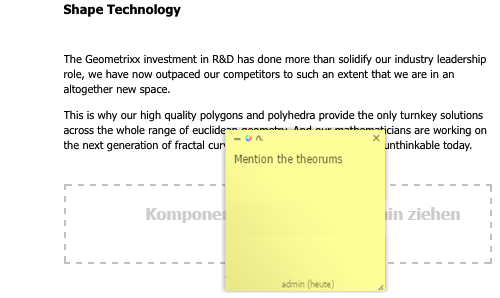

# Anmerkungen beim Bearbeiten einer Seite{#annotations-when-editing-a-page}

Oft muss das Hinzufügen von Inhalten zu den Seiten Ihrer Website vor der tatsächlichen Veröffentlichung besprochen werden. Um diesen Vorgang zu erleichtern, können Sie in vielen Komponenten, die direkt mit Inhalt (und nicht mit dem Layout) in Verbindung stehen, Anmerkungen hinzufügen.

Bei einer Anmerkung wird eine farbige Markierung/Haftnotiz auf der Seite platziert. Mit einer Anmerkung können Sie (oder andere Benutzer) Kommentare und/oder Fragen für andere Autoren/Prüfer hinterlassen.

>[!NOTE]
>
>Die Definition einer einzelnen Komponente bestimmt, ob Anmerkungen in Instanzen dieser Komponente möglich sind oder nicht.

>[!NOTE]
>
>Anmerkungen, die in der klassischen Benutzeroberfläche erstellt wurden, werden auch in der Touch-optimierten Benutzeroberfläche angezeigt. Zeichnungen sind jedoch benutzeroberflächenspezifisch und werden nur in der Benutzeroberfläche angezeigt, in der sie erstellt wurden.

>[!CAUTION]
>
>Durch Löschen einer Ressource (z. B. eines Absatzes) werden alle Anmerkungen und Zeichnungen gelöscht, die mit dieser Ressource verbunden sind (unabhängig von ihrer Position auf der Seite als Ganzes).

>[!NOTE]
>
>Je nach Ihren Anforderungen können Sie auch einen Workflow entwickeln, um Benachrichtigungen zu senden, wenn Anmerkungen hinzugefügt, aktualisiert oder gelöscht werden.

## Anmerkungen {#annotations}

In Abhängigkeit vom Absatzdesign sind Anmerkungen entweder als Option im Kontextmenü (in der Regel über die rechte Maustaste aufrufbar, wenn sich die Maus über dem entsprechenden Absatz befindet) oder als Schaltfläche auf der Bearbeitungsleiste für Absätze verfügbar.

Wählen Sie in beiden Fällen **Anmerken** aus. Daraufhin wird ein farbiger Notizzettel im Absatz platziert. Sie befinden sich unmittelbar im Bearbeitungsmodus und können direkt Text hinzufügen:

Sie können die Anmerkung an eine neue Position auf der Seite verschieben. Klicken Sie auf den oberen Rahmenbereich, halten Sie die Maustaste gedrückt und ziehen Sie gleichzeitig die Anmerkung an die neue Position. Dies kann eine beliebige Stelle auf der Seite sein, es bietet sich in der Regel jedoch an, die Anmerkung in der Nähe des Absatzes zu platzieren.

Anmerkungen (einschließlich zugehöriger Zeichnungen) sind auch in allen Kopier-, Ausschneide- oder Löschvorgängen enthalten, die in dem Absatz ausgeführt werden, mit dem sie verbunden sind. Bei Kopier- oder Ausschneidevorgängen wird die Position der Anmerkung (und der zugehörigen Zeichnungen) in Relation zu dem ursprünglichen Absatz beibehalten.

Die Größe der Anmerkung kann auch erhöht oder verringert werden, indem Sie die untere rechte Ecke ziehen.

Aus Gründen der Nachverfolgung werden in der Fußzeile der Benutzer, der die Anmerkung erstellt hat, sowie das Datum angegeben. Nachfolgende Autoren können dieselbe Anmerkung bearbeiten (die Fußzeile wird dann aktualisiert) oder eine neue Anmerkung für denselben Absatz erstellen.

Wenn Sie die Anmerkung löschen möchten, müssen Sie den Vorgang bestätigen (durch Löschen einer Anmerkung werden auch alle mit dieser Anmerkung verbundenen Zeichnungen gelöscht).

Über die drei Symbole oben links können Sie die Anmerkung (zusammen mit allen damit verbundenen Zeichnungen) minimieren, die Farbe ändern und Zeichnungen hinzufügen.

>[!NOTE]
>
>Anmerkungen sind nur im Bearbeitungsmodus der Autorenumgebung sichtbar. 
>
>In einer Veröffentlichungsumgebung oder im Vorschau- oder Entwurfsmodus einer Autorenumgebung sind sie nicht sichtbar.

>[!NOTE]
>
>Anmerkungen können nicht zu einer Seite hinzugefügt werden, die von einem anderen Benutzer gesperrt wurde.

## Anmerkungszeichnungen {#annotation-sketches}

>[!NOTE]
>
>Zeichnungen sind in Internet Explorer nicht verfügbar, daher:
>
>* Wird das Symbol nicht angezeigt.
>* Werden vorhandene Zeichnungen, die in anderen Browsern erstellt wurden, nicht angezeigt.

>

Zeichnungen sind eine Funktion von Anmerkungen, über die Sie einfache Liniengrafiken an einer beliebigen Stelle im Browserfenster (sichtbarer Bereich) erstellen können:

* Wenn Sie sich im Zeichenmodus befinden, wird der Cursor in ein Kreuz geändert. Sie können mehrere separate Linien zeichnen.
* Die Zeichnungslinie hat die gleiche Farbe wie die Anmerkung und kann Folgendes sein:

   * Freihand:

      (der Standardmodus; beenden Sie das Zeichnen, indem Sie die Maustaste loslassen.)

   * Gerade:

      Halten Sie die `ALT`-Taste gedrückt, und klicken Sie auf die Start- und Endpunkte; schließen Sie den Vorgang mit einem Doppelklick ab.

* Nachdem Sie den Designmodus verlassen haben, können Sie auf eine Zeichnungslinie klicken, um diese Zeichnung auszuwählen.
* Verschieben Sie eine Zeichnung, indem Sie die Zeichnung auswählen und sie dann an die gewünschte Position ziehen.
* Eine Zeichnung überlagert den Inhalt. Dies bedeutet, dass sie innerhalb der vier Ecken der Zeichnung nicht auf den darunter liegenden Absatz klicken können, wenn Sie beispielsweise einen Link bearbeiten oder darauf zugreifen möchten. Wenn dies zu einem Problem wird (weil die Zeichnung beispielsweise einen großen Bereich der Seite bedeckt), minimieren Sie die entsprechende Anmerkung, da dadurch auch alle zugehörigen Zeichnungen minimiert werden, sodass Sie auf den darunter liegenden Bereich zugreifen können.
* Um eine einzelne Zeichnung zu löschen, wählen Sie die erforderliche Zeichnung aus und drücken dann die Taste **Entf.**(**fn**-**Rücktaste** auf einem MAC).

* Wenn Sie einen Absatz verschieben oder kopieren, werden auch alle damit verbundenen Anmerkungen und deren Zeichnungen verschoben oder kopiert; ihre Position in Relation zu dem Absatz bleibt gleich.
* Wenn Sie eine Anmerkung löschen, werden auch alle Zeichnungen gelöscht, die mit dieser Anmerkung verbunden sind.
