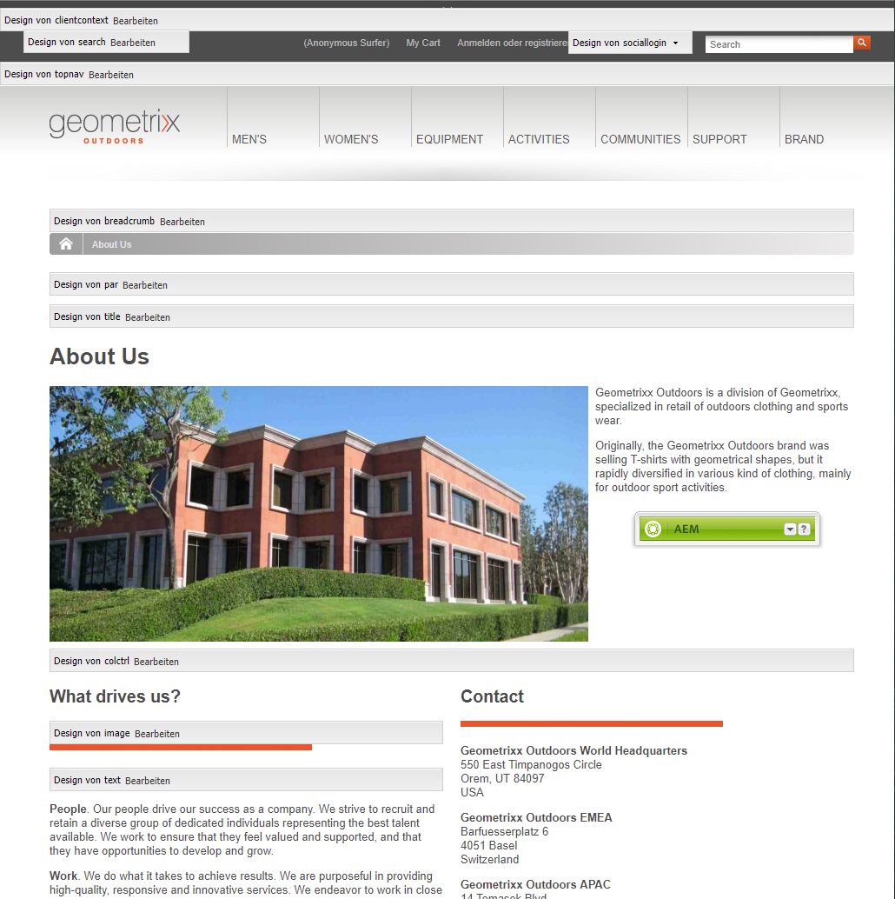
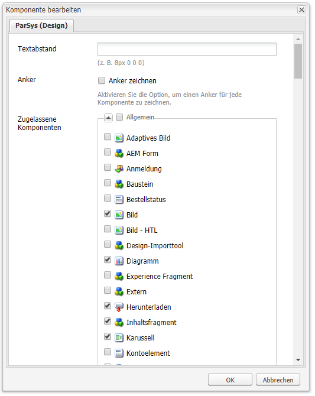
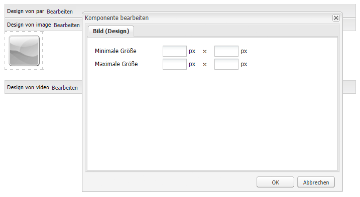

# Konfigurieren von Komponenten im Designmodus{#configuring-components-in-design-mode}

Wenn die AEM-Instanz direkt installiert wird, steht im Sidekick umgehend eine Auswahl von Komponenten zur Verfügung.

Darüber hinaus sind auch verschiedene weitere Komponenten verfügbar. Mit dem [Designmodus](#enabledisablecomponentsusingdesignmode) können Sie diese Komponenten aktivieren/deaktivieren. Wenn Sie den Designmodus aktivieren und sich auf der Seite befinden, können Sie damit [Aspekte des Komponentendesigns konfigurieren](#configuringcomponentsusingdesignmode), indem Sie die Attributparameter bearbeiten.

>[!NOTE]
>
>Bei der Bearbeitung dieser Komponenten ist Vorsicht geboten. Die Designeinstellungen sind häufig ein wesentlicher Bestandteil des Designs der gesamten Website. Daher sollten sie nur von einer Person mit den entsprechenden Berechtigungen (und der erforderlichen Erfahrung) geändert werden (meist ein Administrator oder Entwickler). Weitere Informationen finden Sie unter [Entwicklung von Komponenten](/help/sites-developing/components.md).

Dazu müssen die zulässigen Komponenten im Absatzsystem für die Seite hinzugefügt oder entfernt werden. Das Absatzsystem (`parsys`) ist eine zusammengesetzte Komponente, die alle anderen Absatzkomponenten enthält. Mit dem Absatzsystem können Autoren Komponenten unterschiedlicher Typen zu einer Seite hinzufügen, da es alle anderen Absatzkomponenten enthält. Jeder Absatztyp wird als eine Komponente dargestellt.

Der Inhalt einer Produktseite kann beispielsweise ein Absatzsystem mit Folgendem enthalten:

* Ein Bild des Produkts (in Form eines image- oder textimage-Absatzes)
* Die Produktbeschreibung (als text-Absatz)
* Eine Tabelle mit technischen Daten (als table-Absatz)
* Ein Formular, das Benutzer ausfüllen (als forms begin-, forms element- und forms end-Absatz)

>[!NOTE]
>
>Unter [Entwicklung von Komponenten](/help/sites-developing/components.md#paragraphsystem) und [Richtlinien für die Verwendung von Vorlagen und Komponenten](/help/sites-developing/dev-guidelines-bestpractices.md#guidelines-for-using-templates-and-components) finden Sie weitere Informationen zu `parsys`.

## Aktivieren/Deaktivieren von Komponenten {#enable-disable-components}

Im Designmodus ist der Sidekick minimiert dargestellt und Sie haben die Möglichkeit, die für die Bearbeitung verfügbaren Komponenten zu konfigurieren:

1. Um in den Designmodus zu wechseln, öffnen Sie eine Seite zur Bearbeitung und verwenden Sie das Sidekick-Symbol:

   

1. Klicken Sie im Absatzsystem (**Design von par**) auf **Bearbeiten**.

   

1. Ein Dialogfeld wird geöffnet, in dem die im Sidekick gezeigten Komponentengruppen zusammen mit den darin enthaltenen individuellen Komponenten aufgeführt sind.

   Markieren Sie die gewünschten Komponenten nach Bedarf, um sie dem Sidekick hinzuzufügen oder daraus zu entfernen.

   

1. Der Sidekick wird im Designmodus minimiert. Durch Klicken auf den Pfeil wird der Sidekick maximiert, und die Ansicht kehrt zum Bearbeitungsmodus zurück.

   

## Konfigurieren des Designs von Komponenten  {#configuring-the-design-of-a-component}

Im Designmodus können Sie auch Attribute für die einzelnen Komponenten konfigurieren. Jede Komponente verfügt über eigene Parameter. Im folgenden Beispiel wird die **Bildkomponente** gezeigt:

1. Um in den Designmodus zu wechseln, öffnen Sie eine Seite zur Bearbeitung und verwenden Sie das Sidekick-Symbol:

   

1. Sie können das Design von Komponenten konfigurieren.

   Wenn Sie beispielsweise auf **Bearbeiten** in der Bildkomponente (**Bilddesign**) klicken, können Sie die komponentenspezifischen Parameter konfigurieren:

   

1. Klicken Sie auf **OK**, um die Änderungen zu speichern.

1. Der Sidekick wird im Designmodus minimiert. Durch Klicken auf den Pfeil wird der Sidekick maximiert, und die Ansicht kehrt zum Bearbeitungsmodus zurück.

   
