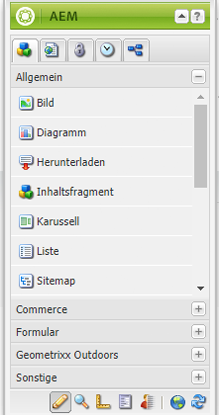
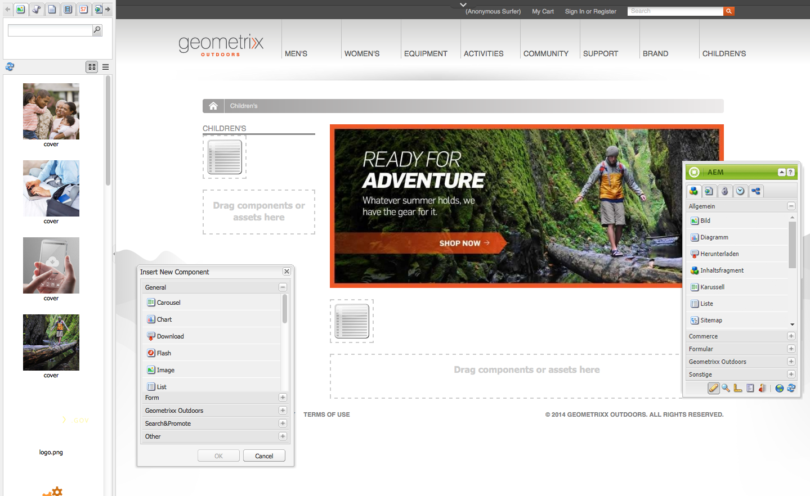
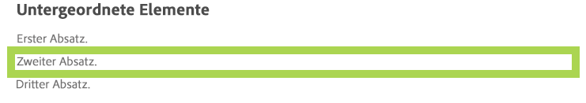
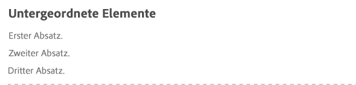
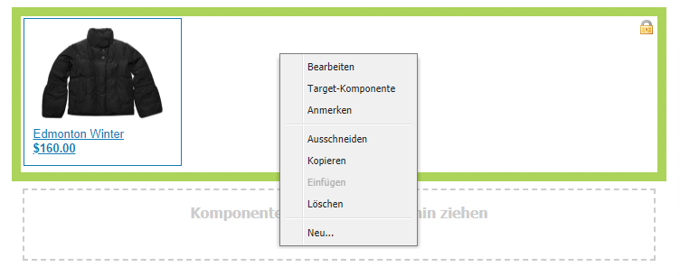
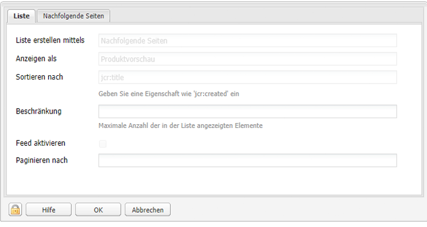
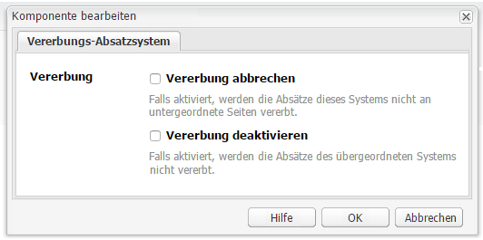
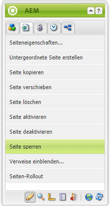
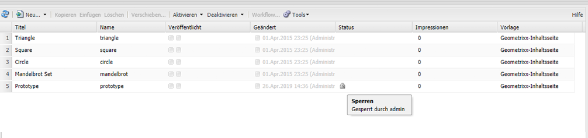

# Bearbeiten des Seiteninhalts{#editing-page-content}

Sobald Ihre Seite erstellt ist (neu oder im Rahmen eines Launch oder einer Live Copy), können Sie den Inhalt bearbeiten und die erforderlichen Aktualisierungen vornehmen.

Der Inhalt wird mit mithilfe von (zum Inhaltstyp passenden) [Komponenten](/help/sites-classic-ui-authoring/classic-page-author-default-components.md) hinzugefügt, die auf die Seite gezogen werden können. Dort können sie dann bearbeitet, verschoben oder gelöscht werden.

>[!NOTE]
>
>Damit Sie Seiten bearbeiten können, muss Ihr Konto über die [entsprechenden Zugriffsrechte](/help/sites-administering/security.md) und [Berechtigungen](/help/sites-administering/security.md#permissions) verfügen. Z. B. damit Sie Komponenten hinzufügen, bearbeiten oder löschen, kommentieren, entsperren können.
>
>Wenn Sie auf Probleme stoßen, empfehlen wir Ihnen, sich an den Systemadministrator zu wenden.

## Sidekick {#sidekick}

Beim Sidekick handelt es sich um ein wichtiges Tool für die Bearbeitung von Seiten. Er ist beim Bearbeiten einer Seite nicht verankert und dadurch immer sichtbar.

Unter anderem sind folgende Registerkarten und Symbole verfügbar:

* Komponenten 
* Seite 
* Informationen
* Versionierung
* Workflow
* Modi
* Strukturvorlage
* ClientContext
* Websites

Diese bieten Zugriff auf eine Vielzahl von Funktionen, zu denen unter anderem folgende gehören:

* [Auwählen der Komponenten](/help/sites-classic-ui-authoring/classic-page-author-env-tools.md#sidekick)
* [Anzeigen der Verweise](/help/sites-classic-ui-authoring/classic-page-author-env-tools.md#showing-references)
* [Zugriff auf das Auditprotokoll](/help/sites-classic-ui-authoring/classic-page-author-env-tools.md#audit-log)
* [Umschalten zwischen Modi](/help/sites-classic-ui-authoring/classic-page-author-env-tools.md#page-modes)
* [Erstellen](/help/sites-classic-ui-authoring/classic-page-author-work-with-versions.md#creating-a-new-version), [Wiederherstellen](/help/sites-classic-ui-authoring/classic-page-author-work-with-versions.md#restoring-a-page-version-from-sidekick) und [Vergleichen](/help/sites-classic-ui-authoring/classic-page-author-work-with-versions.md#comparing-with-a-previous-version) von Versionen

* [Veröffentlichen einer Seite](/help/sites-classic-ui-authoring/classic-page-author-publish-pages.md#publishing-a-page), [Veröffentlichen rückgängig machen](/help/sites-classic-ui-authoring/classic-page-author-publish-pages.md#unpublishing-a-page)

* [Bearbeiten der Seiteneigenschaften](/help/sites-classic-ui-authoring/classic-page-author-edit-page-properties.md)

* [Strukturvorlagen](/help/sites-authoring/scaffolding.md)

* [Client-Kontext](/help/sites-administering/client-context.md)

## Einfügen einer Komponente {#inserting-a-component}

### Einfügen einer Komponente {#inserting-a-component-1}

Nachdem Sie die Seite geöffnet haben, können Sie beginnen, Inhalte hinzuzufügen. Dies erfolgt durch Hinzufügen von Komponenten (auch Absätze genannt).

So fügen Sie eine neue Komponente ein:

1. Es gibt verschiedene Methoden für die Auswahl der Art des einzufügenden Absatzes:

   * Doppelklicken Sie auf den mit **Komponenten oder Assets hierhin ziehen** bezeichneten Bereich. Die Symbolleiste **Neue Komponente einfügen** wird geöffnet. Wählen Sie eine Komponente aus und klicken Sie auf **OK**.

   * Ziehen Sie eine Komponente aus der unverankerten Symbolleiste (auch Sidekick genannt), um einen neuen Absatz einzufügen.
   * Klicken Sie mit der rechten Maustaste auf einen bestehenden Absatz und wählen Sie **Neu...**. Die Symbolleiste „Neue Komponente einfügen“ wird geöffnet. Wählen Sie eine Komponente aus und klicken Sie auf **OK**.

   

1. Sowohl im Sidekick als auch in der Symbolleiste **Neue Komponente einfügen** wird eine Liste der verfügbaren Komponenten (Absatztypen) angezeigt. Diese Liste kann gegliedert sein (z. B. in Allgemein, Spalten usw.), und Sie können die Gliederungen nach Bedarf aus- oder einblenden.

   Je nach der tatsächlichen Produktionsumgebung können hierbei Abweichungen auftreten. Alle Details zu Komponenten finden Sie im Beitrag zu den [Standardkomponenten](/help/sites-classic-ui-authoring/classic-page-author-default-components.md)

1. Fügen Sie die gewünschte Komponente in die Seite ein. Doppelklicken Sie dann auf den Absatz, und ein Fenster wird geöffnet, in dem Sie den Absatz konfigurieren und Inhalte einfügen können.

### Einfügen einer Komponente mit dem Content Finder  {#inserting-a-component-using-the-content-finder}

Sie können eine neue Komponente zur Seite hinzufügen, indem Sie ein Asset aus dem [Content Finder](/help/sites-classic-ui-authoring/classic-page-author-env-tools.md#the-content-finder) ziehen. Dadurch wird automatisch eine neue Komponente des entsprechenden Typs erstellt, die das Asset enthält.

Dies gilt für folgende Asset-Typen (einige sind von der Seite/dem Absatzsystem abhängig):

| Asset-Typ | Resultierender Komponententyp |
|---|---|
| Bild | Bild |
| Dokument | Download |
| Produkt | Produkt |
| Video | Flash   |

>[!NOTE]
>
>Dieses Verhalten kann für Ihre Installation konfiguriert werden. Weitere Informationen finden Sie unter [Konfigurieren eines Absatzsystems zum Erstellen einer Komponenteninstanz infolge des Ziehens eines Assets](/help/sites-developing/developing-components.md#configuring-a-paragraph-system-so-that-dragging-an-asset-creates-a-component-instance).

So erstellen Sie eine Komponente, indem Sie einen der obigen Asset-Typen ziehen:

1. Öffnen Sie die Seite im Modus [**Bearbeiten**](/help/sites-classic-ui-authoring/classic-page-author-env-tools.md#page-modes).
1. Öffnen Sie den [Content Finder](/help/sites-classic-ui-authoring/classic-page-author-env-tools.md#the-content-finder).
1. Ziehen Sie das gewünschte Asset an die passende Position. Der [Komponenten-Platzhalter](#componentplaceholder) zeigt an, wo die Komponente platziert wird.

   Am entsprechenden Ort wird eine zum Asset-Typ passende Komponente erstellt, die das ausgewählte Asset enthält.

1. [Bearbeiten](#editmovecopypastedelete) Sie die Komponente.

## Bearbeiten einer Komponente (Inhalt und Eigenschaften)  {#editing-a-component-content-and-properties}

Um einen bestehenden Absatz zu bearbeiten, führen Sie eine der folgenden Aktionen aus:

* **Doppelklick** auf den Absatz, um ihn zu öffnen. Es wird dasselbe Fenster angezeigt wie bei der Erstellung des Absatzes mit dem vorhandenen Inhalt. Fügen Sie die gewünschten Änderungen durch und klicken Sie auf **OK**.

* **Rechtsklick** auf den Absatz und Klicken auf **Bearbeiten**.

* **Zweifacher Klick** auf den Absatz (langsamer Doppelklick), um die Bearbeitung im Kontext zu starten. Sie können nun den Text direkt auf der Seite bearbeiten, anstatt ein Dialogfenster aufrufen zu müssen. In diesem Modus steht am oberen Rand der Seite eine Werkzeugleiste zur Verfügung. Alle Änderungen werden sofort automatisch gespeichert.

## Verschieben einer Komponente {#moving-a-component}

So verschieben Sie einen Absatz:

>[!NOTE]
>
>Sie können eine Komponente auch durch [Ausschneiden und Einfügen](#cut-copy-paste-a-component) verschieben.

1. Wählen Sie den Absatz, den Sie verschieben möchten:

   

1. Ziehen Sie den Absatz an die neue Stelle. AEM zeigt durch ein grünes Häkchen an, wohin der Absatz verschoben werden kann. Legen Sie den Absatz an der gewünschten Stelle ab.
1. Der Absatz wird verschoben:

   

## Löschen einer Komponente {#deleting-a-component}

So löschen Sie einen Absatz:

1. Wählen Sie einen Absatz und **klicken Sie mit der rechten Maustaste** darauf:

   

1. Wählen Sie **Löschen** im Kontextmenü. AEM WCM fordert Sie auf, den Löschvorgang zu bestätigen, da er nicht mehr rückgängig gemacht werden kann.
1. Klicken Sie auf **OK**.

>[!NOTE]
>
>Wenn Sie in den [Benutzereigenschaften festgelegt haben, dass die globale Bearbeitungssymbolleiste](/help/sites-classic-ui-authoring/author-env-user-props.md) angezeigt werden soll, können Sie die verfügbaren Schaltflächen **Kopieren**, **Ausschneiden**, **Einfügen** und **Löschen** verwenden.
>
>Es stehen auch verschiedene [Tastaturbefehle](/help/sites-classic-ui-authoring/classic-page-author-keyboard-shortcuts.md) zur Verfügung.

## Ausschneiden/Kopieren/Einfügen einer Komponente {#cut-copy-paste-a-component}

Wie beim [Löschen einer Komponente](#deleting-a-component) können Sie das Kontextmenü nutzen, um eine Komponente zu kopieren, auszuschneiden und/oder einzufügen

>[!NOTE]
>
>Wenn Sie in den [Benutzereigenschaften festgelegt haben, dass die globale Bearbeitungssymbolleiste](/help/sites-classic-ui-authoring/author-env-user-props.md) angezeigt werden soll, können Sie die verfügbaren Schaltflächen **Kopieren**, **Ausschneiden**, **Einfügen** und **Löschen** verwenden.
>
>Es stehen auch verschiedene [Tastaturbefehle](/help/sites-classic-ui-authoring/classic-page-author-keyboard-shortcuts.md) zur Verfügung.

>[!NOTE]
>
>Das Ausschneiden, Kopieren und Einfügen von Inhalt wird nur innerhalb derselben Seite unterstützt. 

## Vererbte Komponenten {#inherited-components}

Vererbte Komponenten können sich aus diversen Szenarien ergeben, wie:

* [Multi-Site-Management](/help/sites-administering/msm.md); auch in Verbindung mit [Strukturvorlagen](/help/sites-classic-ui-authoring/classic-feature-scaffolding.md#scaffolding-with-msm-inheritance)

* [Launch](/help/sites-classic-ui-authoring/classic-launches.md) (wenn er auf Live Copy basiert).
* Spezifische Komponenten, z. B. das Vererbungs-Absatzsystem in Geometrixx.

Sie können die Vererbung deaktivieren (und dann wieder aktivieren). Abhängig von der Komponente ist dies wie folgt verfügbar:

1. **Live Copy**

   Wenn eine Komponente Teil einer Live Copy oder eines Launches ist, wird dies durch ein Schlosssymbol angezeigt. Sie können auf das Vorhängeschloss klicken, um die Vererbung abzubrechen.

   * Das Schlosssymbol wird angezeigt, wenn die Komponente ausgewählt wird. Beispiel:

   

   * Das Schloss wird ebenfalls im Dialogfeld von Komponenten angezeigt. Beispiel:

   

1. **Vererbungs-Absatzsystem**

   Das Konfigurationsdialogfeld. Z. B. wie mit dem Vererbungs-Absatzsystem in Geometrixx:

   

## Hinzufügen von Anmerkungen {#adding-annotations}

[Anmerkungen](/help/sites-classic-ui-authoring/classic-page-author-annotations.md) bieten anderen Autoren die Möglichkeit Feedback zu Ihrem Inhalt zu erteilen. Dies wird häufig zu Korrektur- oder Überprüfungszwecken verwendet.

## Anzeigen einer Seitenvorschau   {#previewing-pages}

Für die Vorschau von Seiten sind zwei Symbole am unteren Rand des Sidekicks von Bedeutung:

* Das Bleistiftsymbol zeigt an, dass Sie sich zurzeit im Bearbeitungsmodus befinden, in dem Sie Inhalt hinzufügen, bearbeiten, verschieben oder löschen können.

   

* Mit dem Lupensymbol können Sie den Vorschaumodus auswählen, in dem die Seite so angezeigt wird, wie sie später in der Veröffentlichungsumgebung zu sehen ist (gelegentlich muss die Seite auch aktualisiert werden).

   

   Im Vorschaumodus wird der Sidekick minimiert. Klicken Sie auf den Pfeil nach unten, um in den Bearbeitungsmodus zurückzukehren:

   

## Suchen und Ersetzen {#find-replace}

Bei umfangreicheren Bearbeitungen desselben Begriffs ermöglicht die Menüoption **[Suchen und Ersetzen](/help/sites-classic-ui-authoring/author-env-search.md#find-and-replace)** die Suche nach mehreren Instanzen einer Zeichenfolge innerhalb eines Abschnitts der Website und deren Ersetzung.

## Sperren einer Seite {#locking-a-page}

AEM bietet Ihnen die Möglichkeit, eine Seite zu sperren, sodass niemand außer Ihnen den Inhalt bearbeiten kann. Dies ist hilfreich, wenn Sie eine Vielzahl von Bearbeitungen an einer bestimmten Seite vornehmen oder wenn Sie eine Seite für eine kurze Zeit einfrieren möchten.

>[!CAUTION]
>
>Gehen Sie beim Sperren einer Seite mit Bedacht vor, da nur die Person, die eine Seite gesperrt hat, diese auch wieder entsperren kann (oder ein Benutzer mit Administratorrechten).

So sperren Sie eine Seite:

1. Wählen Sie auf der Registerkarte **Websites** die zu sperrende Seite.
1. Doppelklicken Sie auf die Seite, um sie zur Bearbeitung zu öffnen.
1. Wählen Sie auf der Registerkarte **Seite** des Sidekick die Option **Seite sperren**:

   

   Eine Nachricht über die Sperrung der Seite für andere Benutzer wird angezeigt. Darüber hinaus wird die Seite im rechten Fenster der Konsole **Websites** von AEM WCM als gesperrt angezeigt. Daneben wird auch der Benutzer angegeben, der die Seite gesperrt hat.

   

## Entsperren einer Seite {#unlocking-a-page}

So entsperren Sie eine Seite:

1. Wählen Sie in der Konsole **Websites** die zu entsperrende Seite.
1. Doppelklicken Sie auf die Seite, um sie zu öffnen.
1. Wählen Sie auf der Registerkarte **Seite** des Sidekick die Option **Seite entsperren** aus:

## Rückgängigmachen und Wiederholen von Seitenbearbeitungen {#undoing-and-redoing-page-edits}

Verwenden Sie die folgenden Tastaturbefehle, während der Inhalts-Frame der Seite den Fokus hat:

* Rückgängig: Strg+Z (Windows) bzw. Befehl+Z (Mac) 
* Wiederholen: Strg+Y (Windows) bzw. Befehl+Y (Mac) 

Wenn Sie das Entfernen, Hinzufügen oder Verschieben von Absätzen rückgängig machen bzw. wiederholen, werden die betroffenen Absätze (standardmäßig) durch Markierungen hervorgehoben.

>[!NOTE]
>
>Siehe [Rückgängigmachen und Wiederholen von Seitenbearbeitungen - Die Theorie](#undoing-and-redoing-page-edits-the-theory); dort erfahren Sie, was beim Rückgängigmachen und Wiederholen von Seitenbearbeitungen möglich ist.

## Rückgängigmachen und Wiederholen von Seitenbearbeitungen - Die Theorie {#undoing-and-redoing-page-edits-the-theory}

>[!NOTE]
>
>Ihr Systemadministrator kann [verschiedene Aspekte der Funktionen zum Rückgängig machen/Wiederholen](/help/sites-administering/config-undo.md) den Anforderungen Ihrer Instanz entsprechend konfigurieren.

AEM speichert einen Verlauf der Aktionen, die Sie ausführen, sowie die Reihenfolge der Ausführung. Sie können also mehrere Aktionen in der umgekehrten Reihenfolge ihrer Ausführung rückgängig machen. Dann können Sie den Befehl zum Wiederholen verwenden, um eine oder mehrere Aktionen zu wiederholen. 

Wenn ein Element auf der Inhaltsseite ausgewählt wird, gelten die Befehle „Rückgängig“ und „Wiederholen“ für das ausgewählte Element, also z. B. für eine Text-Komponente.

Das Rückgängigmachen und Wiederholen von Befehlen funktioniert ähnlich wie in anderen Softwareprogrammen. Verwenden Sie die Befehle, um beim Treffen von Entscheidungen über den Inhalt ihrer Webseite zu einem vorherigen Zustand der Seite zurückzukehren. Wenn Sie beispielsweise einen Textabsatz an eine Stelle auf der Seite verschoben haben, können Sie ihn mithilfe des Befehls zum Rückgängigmachen wieder zurück an die ursprüngliche Stelle verschieben. Wenn Sie den Absatz dann doch an die neue Stelle verschieben möchten, können Sie einfach den Befehl zum Wiederholen verwenden.

>[!NOTE]
>
>Sie haben folgende Möglichkeiten:
>
>* Aktionen wiederholen, solange Sie seit dem letzten Rückgängigmachen einer Aktion keine Seitenbearbeitungen durchgeführt haben.
>* maximal 20 Bearbeitungsaktionen rückgängig machen (Standardeinstellung).
>* Für das Rückgängigmachen und Wiederholen stehen auch verschiedene [Tastaturbefehle](/help/sites-classic-ui-authoring/classic-page-author-keyboard-shortcuts.md) zur Verfügung.

>

Die können die folgenden Arten von Seitenbearbeitungen rückgängig machen bzw. wiederholen:

* Hinzufügen, Bearbeiten, Entfernen und Verschieben von Absätzen
* Bearbeitung von Absatzinhalten im Kontext
* Kopieren, Ausschneiden und Einfügen von Elementen innerhalb einer Seite
* Kopieren, Ausschneiden und Einfügen von Elementen über Seiten hinweg
* Hinzufügen, Entfernen und Ändern von Bildern
* Hinzufügen, Entfernen und Ändern von Anmerkungen und Zeichnungen
* Änderungen an Grundlage
* Hinzufügen und Entfernen von Verweisen
* Ändern von Eigenschaftswerten in Komponenten-Dialogfeldern.

Für Formularfelder, die durch Formular-Komponenten erzeugt werden, dürfen beim Erstellen von Seiten keine Werte angegeben werden. Folglich haben die Befehle „Rückgängig“ und „Wiederholen“ keine Auswirkungen auf Änderungen, die Sie an den Werten dieser Komponententypen vornehmen. Sie können z. B. nicht die Auswahl eines Wertes in einer Dropdown-Liste rückgängig machen.

>[!NOTE]
>
>Spezielle Berechtigungen sind erforderlich, um Änderungen rückgängig zu machen bzw. wiederherzustellen, die an Dateien und Bildern vorgenommen wurden. Außerdem kann das Rückgängigmachen Änderungen an Dateien und Bildern nur einige Stunden garantiert werden. Bei länger zurückliegenden Änderungen ist dies unter Umständen nicht mehr möglich. Der zuständige Administrator kann Berechtigungen erteilen und die Standarddauer von zehn Stunden ändern.
