# Komponenten für die Seitenbearbeitung{#components-for-page-authoring}

Die folgenden Komponenten sind für das Erstellen von Inhalten für eine Standard-Web-Seite vorgesehen. Die Komponenten bilden eine Teilmenge der Komponenten, die vorkonfiguriert für eine Standard-Installation von AEM verfügbar sind.

Einige sind sofort über den Sidekick verfügbar, andere sind auch verfügbar, indem Sie den [Design-Modus](/help/sites-classic-ui-authoring/classic-page-author-design-mode.md) verwenden, um sie zu aktivieren/deaktivieren.

>[!CAUTION]
>
>In diesem Abschnitt werden nur Komponenten behandelt, die vorkonfiguriert in einer AEM-Standardinstallation verfügbar sind.
>
>Je nach Ihrer Instanz verfügen Sie möglicherweise über benutzerdefinierte Komponenten, die explizit für Ihre Anforderungen entwickelt wurden. Diese benutzerdefinierten Komponenten haben möglicherweise sogar denselben Namen wie einige der hier behandelten Komponenten.

Die Komponenten stehen beim [Bearbeiten einer Seite](/help/sites-classic-ui-authoring/classic-page-author-edit-content.md) über die Registerkarte **Komponenten** des Sidekicks und die Auswahl **Neue Komponente einfügen** zur Verfügung (wenn Sie im Bereich **Komponenten oder Assets hierhin ziehen** doppelklicken).

Sie können eine Komponente auswählen und sie an die erforderliche Position auf der Seite ziehen und anschließend [Inhalte und Eigenschaften bearbeiten](/help/sites-classic-ui-authoring/classic-page-author-edit-content.md#editing-a-component-content-and-properties).

Komponenten werden nach verschiedenen Kategorien (Komponentengruppen) sortiert, darunter (für die Seitenbearbeitung):

* [Allgemein](#general): Enthält grundlegende Komponenten wie Text, Bilder, Tabellen, Diagramme usw.
* [Spalten](#columns): Enthält Komponenten, die für die Organisation des Inhalts-Layouts benötigt werden.
* [Formular](#formgroup): Umfasst alle Komponenten, die zum Erstellen eines Formulars benötigt werden.

## Allgemein {#general}

Die allgemeinen Komponenten sind die grundlegenden Komponenten, die Sie zum Erstellen von Inhalten verwenden.

### Kontoelement {#account-item}

Sie können einen Link mit Titel und Beschreibung definieren.


### Adaptives Bild {#adaptive-image}

Die Komponente der Adaptive Image Foundation erzeugt Bilder, die in das Fenster eingepasst werden, in dem die Webseite geöffnet wird. Um die Komponente zu verwenden, geben Sie eine Bildressource entweder im Dateisystem oder im DAM an. Wenn die Web-Seite geöffnet wird, lädt der Webbrowser eine Kopie des Bildes herunter, die so in der Größe angepasst wurde, dass sie in das aktuelle Fenster passt.

Die Größe des Fensters kann von den folgenden Eigenschaften abhängen:

* Geräte-Display: Auf Mobilgeräten werden Web-Seiten im Allgemeinen so angezeigt, dass das komplette Display ausgefüllt ist.
* Fenstergröße des Webbrowsers: Benutzerinnen und Benutzer von Laptop- und Desktop-Computern können die Größe von Webbrowser-Fenstern ändern.

Die Komponente erzeugt zum Beispiel ein kleines Bild, wenn die Webseite auf einem Mobiltelefon geöffnet wird, und ein mittelgroßes Bild, wenn sie auf einem Tablet geöffnet wird. Auf einem Laptop erzeugt die Komponente ein großes Bild, wenn die Seite in einem maximierten Webbrowser geöffnet wird. Wenn der Webbrowser so angepasst wird, dass er nur noch einen Teil des Bildschirms ausfüllt, passt die Komponente das Bild in der Größe an und aktualisiert die Ansicht.

#### Unterstützte Bildformate {#supported-image-formats}

Mit der Adaptive Image-Komponente können Sie Bilddateien mit den folgenden Dateinamenerweiterungen verwenden:

* .jpg
* .jpeg
* .png
* .gif &#42;&#42;

>[!CAUTION]
>
>&#42;&#42; Animierte GIF-Dateien werden in AEM für adaptive Ausgabedarstellungen nicht unterstützt.

#### Bildgrößen und -qualität {#images-sizes-and-quality}

In der folgenden Tabelle wird die Breite des Bildes aufgeführt, die für die jeweilige Anzeigebreite erzeugt wird. Die Höhe des erzeugten Bildes wird so berechnet, dass ein konstantes Seitenverhältnis erhalten bleibt und innerhalb des Bildrandes keine weißen Bereiche auftreten. Das Zuschneiden kann verwendet werden, um leere Bereiche zu vermeiden.

Wenn es sich bei dem Bild um ein JPEG-Bild handelt, kann die Anzeigegröße sich auch auf die JPEG-Qualität auswirken. Die folgenden JPEG-Qualitäten sind möglich:

* Niedrig (0,42)
* Mittel (0,82)
* Hoch (1,00)

| Breitenbereich des Darstellungsfelds (Pixel) | Bildbreite (Pixel) | JPEG-Qualität | Zielgerätetyp |
|---|---|---|---|
| Breite &lt;= 319 | 320 | niedrig |  |
| Breite = 320 | 320 | mittel | Smartphone (Hochformat) |
| 320 &lt; Breite &lt; 481 | 480 | mittel | Smartphone (Querformat) |
| 480 &lt; Breite &lt; 769 | 476 | hoch | Tablet (Hochformat) |
| 768 &lt; Breite &lt; 1025 | 620 | hoch | Tablet (Querformat) |
| Breite &lt;= 1025 | Vollbild (Originalgröße) | hoch | Desktop |

#### Eigenschaften {#properties}

Das Dialogfeld erlaubt das Bearbeiten der Eigenschaften Ihrer Instanz der adaptiven Bildkomponente, von denen viele mit denen der Bildkomponente übereinstimmen, auf der sie basieren. Diese Eigenschaften sind auf zwei Registerkarten verfügbar:

* **Bild**

   * **Bild**
Ziehen Sie ein Bild aus dem Content Finder oder klicken Sie, um ein Browserfenster zu öffnen, in dem Sie ein Bild laden können. Nachdem das Bild geladen wurde, können Sie es beschneiden, drehen oder löschen. Verwenden Sie den Regler unter dem Bild (und über den Schaltflächen „OK“ und „Abbrechen“), um das Bild ein- und auszuzoomen.

   * **Zuschneiden**
Hiermit können Sie Teile eines Bildes abschneiden. Ziehen Sie den Rahmen, um das Bild zuzuschneiden.

   * **Drehen**
Klicken Sie mehrfach auf „Drehen“, bis das Bild in die gewünschte Ausrichtung gedreht ist.

   * **Entfernen**
Damit entfernen Sie das aktuelle Bild.

* **Erweitert**

   * **Titel**
Die Adaptive Image-Komponente nutzt diese Eigenschaft nicht.

   * **Alt-Text**
Der alternative Text für das Bild.

   * **Verknüpfung zu**
Die Adaptive Image-Komponente nutzt diese Eigenschaft nicht.

   * **Beschreibung**
Die Adaptive Image-Komponente nutzt diese Eigenschaft nicht.

#### Vergrößern der Adaptive Image-Komponente {#extending-the-adaptive-image-component}

Informationen zum Anpassen der Adaptive Image-Komponente finden Sie unter [Grundlegendes zur Adaptive Image-Komponente](/help/sites-developing/responsive.md#using-adaptive-images).

### Karussell {#carousel}

Mit der Karussellkomponente können Sie Bilder anzeigen, die einzelnen Seiten zugeordnet sind:

* jeweils eines
* für eine kurze Zeit
* in einer von Ihnen festgelegten Reihenfolge
* mit einer von Ihnen festgelegten Zeitverzögerung

Durch klickbare Steuerelemente können Benutzerinnen und Benutzer bei Bedarf auch in Echtzeit durch die angezeigten Seiten navigieren. Wenn das derzeit sichtbare Seitenbild ausgewählt wird, gelangt man zu dieser Seite. Das heißt, das Karussell dient als Navigationssteuerung.

#### Eigenschaften {#properties-1}

Die Eigenschaften sind auf zwei Registerkarten verfügbar:

* **Karussell**
Hier geben Sie an wie das Karussell arbeitet:

   * Abspielgeschwindigkeit
Die Zeit in Millisekunden bis zur Anzeige des nächsten Dias.
   * Übergangszeit
Die Zeit in Millisekunden für den Übergang zwischen zwei Folien.
   * Steuerelemente-Stil
Über ein Pulldown-Menü sind verschiedene Optionen verfügbar: z. B. Zurück-/Weiter-Schaltflächen, Schalter oben rechts.

* **Liste**
Hier legen Sie fest, wie Seiten in Ihr Karussell eingeschlossen werden:

   * **Erstellen einer Liste mittels**
Es gibt verschiedene Möglichkeiten, eine Seitenliste zu erstellen: untergeordnete Seiten, feste Liste, Suche oder erweiterte Suche (alle unten beschrieben).
Unabhängig von der gewählten Methode sollte jeder Seite, die Sie in Ihre Liste aufnehmen, bereits ein Bild zugeordnet sein. Dieses Bild wird im Karussell angezeigt. Wenn unter den Seiteneigenschaften dieser Seite kein Bild für eine Seite vorhanden ist, sollten Sie ein Bild mit der Seite verknüpfen, bevor Sie beginnen. Andernfalls wird im Karussell eine leere Seite angezeigt. Weitere Informationen finden Sie unter [Bearbeiten der Seiteneigenschaften](/help/sites-classic-ui-authoring/classic-page-author-edit-page-properties.md).
Je nach ausgewähltem Element wird ein neues Panel angezeigt:

      * **Optionen für untergeordnete Seiten**

         * **Übergeordnete Seite**
Geben Sie den Pfad entweder manuell oder mithilfe der Auswahl an. Wenn Sie nichts angeben, wird die aktuelle Seite als übergeordnete Seite verwendet.

      * **Optionen für Liste fester Werte**

         * **Seiten**
Wählen Sie eine Liste mit Seiten aus. Fügen Sie mit `+` weitere Einträge hinzu und passen Sie mit den Schaltflächen nach oben und unten die Reihenfolge an.

      * **Optionen für die Suche**

         * **Starten in**
Geben Sie manuell oder über die Auswahl einen Startpfad ein.

         * **Suchabfrage**
Sie können eine Textsuchabfrage eingeben.

      * **Optionen für die erweiterte Suche**

         * **Querybuilder-Eigenschafts-Notation**
Sie können eine Suchabfrage mit der Querybuilder-Eigenschafts-Notation eingeben. Sie können beispielsweise &quot;fulltext=Marketing&quot;eingeben, damit alle Seiten mit &quot;Marketing&quot;in ihrem Inhalt im Karussell angezeigt werden.
Unter [„QueryBuilder API“](/help/sites-developing/querybuilder-api.md) finden Sie eine umfassende Übersicht über Abfrageausdrücke sowie weitere Beispiele.

   * **Sortierreihenfolge**
Auswählen `jcr:title`, `jcr:created`, `cq:lastModified`oder `cq:template` aus dem Dropdown-Menü aus.

   * **Limit**
Optional. Die maximale Anzahl von Elementen, die Sie im Karussell verwenden möchten.

>[!NOTE]
>
>Sie können eine benutzerdefinierte Karussellkomponente für Adobe Experience Manager erstellen, in der die im AEM DAM vorhandenen digitalen Assets angezeigt werden.

### Diagramm {#chart}

Mit der Komponente „Diagramm“ können Sie ein Balken-, Linien- oder Tortendiagramm hinzufügen. AEM erstellt aus den von Ihnen bereitgestellten Daten ein Diagramm. Sie können Daten direkt in die Registerkarte „Daten“ eingeben oder eine Tabelle kopieren und einfügen.

* **Daten**

   * **Diagrammdaten**
Geben Sie die Diagrammdaten im CSV-Format ein; das CSV-Format (kommagetrennte Werte) verwendet ein Komma (,) als Feldtrennzeichen.

* **Erweitert**

   * **Diagrammtyp**
Wählen Sie ein Torten-, Linien- oder Balkendiagramm aus.

   * **Alternativtext**
Alternativer Text, der anstelle des Diagramms angezeigt wird.

   * **Breite**
Die Breite des Diagramms in Pixeln.

   * **Höhe**
Die Höhe des Diagramms in Pixeln.

Im Folgenden sehen Sie ein Beispiel für Diagrammdaten und das daraus resultierende Balkendiagramm:

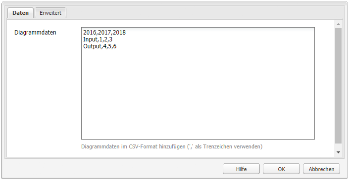 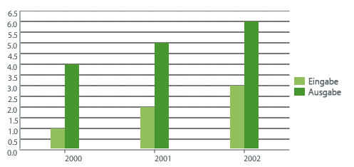


### Inhaltsfragment {#content-fragment}

>[!CAUTION]
>
>Die vollständige Funktionalität der Inhaltsfragmentverwaltung ist nur in der Touch-optimierten Benutzeroberfläche verfügbar.
>
>Die Inhaltsfragmentkomponente kann im Sidekick der klassischen Benutzeroberfläche angezeigt werden. Es stehen jedoch keine weiteren Funktionen zur Verfügung.

[Inhaltsfragmente](/help/sites-classic-ui-authoring/classic-page-author-content-fragments.md) werden als seitenunabhängige Assets erstellt und verwaltet. Sie können diese Fragmente und ihre Varianten bei der Erstellung Ihrer Inhaltsseiten verwenden.

### Design-Import-Tool {#design-importer}

Ermöglicht das Hochladen einer ZIP-Datei mit einem Design-Paket.

### Download {#download}

Über die Download-Komponente wird auf der ausgewählten Webseite ein Link erstellt, über den eine spezifische Datei heruntergeladen werden kann. Sie können ein Asset entweder aus dem Content Finder ziehen oder eine Datei hochladen.

* **Download**

   * **Beschreibung**
Eine kurze Beschreibung, die mit dem Download-Link angezeigt wird.

   * **Datei**
Die Datei, die auf der resultierenden Web-Seite zum Download verfügbar ist. Ziehen Sie ein Asset aus der Inhaltssuche herüber oder wählen Sie den Bereich aus, damit Sie die Datei hochladen können, die Sie zum Download bereitstellen möchten.

Das folgende Beispiel zeigt die Download-Komponente in Geometrixx:


### Extern {#external}

Die Komponente zur Integration externer Anwendungen (**Extern**) bietet Ihnen die Möglichkeit, externe Anwendungen mit einem iframe in Ihre AEM-Seite zu integrieren.

* **Extern**

   * **Target-Anwendung**

     Geben Sie die URL der zu integrierenden Web-Anwendung an, z. B.:

     ```
     https://en.wikipedia.org/wiki/Main_Page
     ```

   * **Parameter weiterleiten**

     Markieren Sie bei Bedarf das Kontrollkästchen für das Weiterleiten von Parametern an die Anwendung.

   * **Breite und Höhe**

     Definieren Sie die Größe des iframe

Die externe Anwendung wird in das Absatzsystem der AEM-Seite integriert. Beispiel: Wenn Sie als Zielanwendung `https://en.wikipedia.org/wiki/Main_Page` verwenden:


>[!NOTE]
>
>Je nach Anwendungsfall stehen weitere Optionen zur Integration externer Anwendungen zur Verfügung, zum Beispiel die [Integration von Portlets](/help/sites-administering/aem-as-portal.md).

### Flash {#flash}

Mithilfe der Flash-Komponente können Sie einen Flash-Film laden. Sie können ein Flash-Asset aus dem Content Finder auf die Komponente ziehen oder das Dialogfeld verwenden:

* **Flash**

   * **Flash-Movie**

     Die Flash-Film-Datei. Ziehen Sie ein Asset aus dem Content Finder oder klicken Sie, um ein Suchfenster zu öffnen.

   * **Größe**

     Die Abmessungen des Anzeigebereichs für den Film in Pixel.

* **Alternativbild**

  Ein alternatives Bild, das angezeigt werden soll.

* **Erweitert**

   * **Kontextmenü**

     Gibt an, ob das Kontextmenü ein- oder ausgeblendet werden soll.

   * **Fenstermodus**

     Darstellung des Fensters, z. B. als undurchsichtiges, transparentes oder als eigenständiges (solides) Fenster.

   * **Hintergrundfarbe**

     Eine aus dem Farbdiagramm ausgewählte Hintergrundfarbe.

   * **Minimum-Version**

     Die zum Abspielen des Films erforderliche Mindestversion von Adobe Flash Player. Der Standardwert lautet 9.0.0.

   * **Attribute**

     Alle weiteren erforderlichen Attribute.

### Bild {#image}

Die Komponente „Bild“ zeigt ein Bild und begleitenden Text gemäß den festgelegten Parametern an.

Sie können ein Bild hochladen und dieses anschließend bearbeiten und anpassen (beispielsweise zuschneiden, drehen oder Links/Titel/Text hinzufügen).

Sie können ein Bild aus der [Inhaltssuche](/help/sites-classic-ui-authoring/classic-page-author-env-tools.md#the-content-finder) per Drag-and-Drop direkt auf die Komponente oder ihren Bearbeitungsdialog ziehen. Sie können auch im zentralen Bereich des Bearbeitungsdialogs doppelklicken, um Ihr lokales Dateisystem zu durchsuchen und ein Bild hochzuladen. Die beiden Registerkarten des Bearbeitungsdialogs steuern auch alle Definitionen und Bearbeitungen des Bildes:

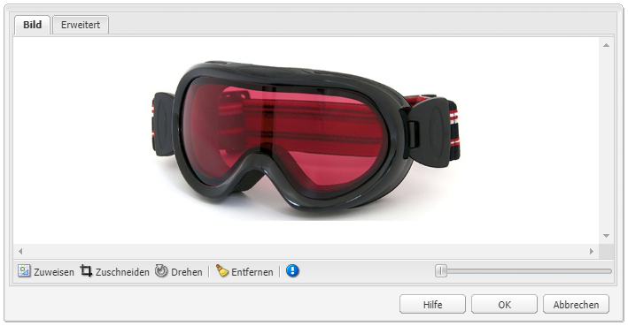

>[!NOTE]
>
>Der Upload-Fortschritt kann in Internet Explorer nicht verfolgt werden.
>
>Benutzerinnen und Benutzer von Internet Explorer müssen das Bild hochladen, auf **OK** klicken und anschließend das Bild erneut öffnen, um die hochgeladene Datei in der Vorschau zu sehen und Änderungen (z. B. Zuschneiden) vornehmen zu können.
>
>Weitere Informationen zu den von AEM verwendeten HTML5-Features finden Sie im Abschnitt [Zertifizierte Plattformen](/help/release-notes/release-notes.md#certifiedplatforms).

Wenn ein Bild geladen wird, können folgende Konfigurationen durchgeführt werden:

* **Zuweisen**

  Wählen Sie „Zuweisen“ aus, um ein Bild zuzuweisen. Sie legen fest, wie die Imagemap (Rechteck, Polygon usw.) erstellt werden soll, und geben an, worauf der Bereich verweisen soll.

* **Zuschneiden**

  Wählen Sie „Zuschneiden“ aus, damit Sie einen Teil eines Bildes abschneiden können. Verwenden Sie die Maus, um das Bild zuzuschneiden.

* **Drehen**

  Wählen Sie „Drehen“ aus, um ein Bild zu drehen. Wiederholen Sie das Drehen so lange, bis das Bild die gewünschte Ausrichtung hat.

* **Entfernen**

  Damit entfernen Sie das aktuelle Bild.

* **Zoom-Leiste**

  Verwenden Sie den Regler unter dem Bild (und über den Schaltflächen „OK“ und „Abbrechen“), um das Bild ein- und auszuzoomen.

* **Titel**

  Der Titel des Bildes.

* **Alt-Text**

  Ein alternativer Text, der beim Erstellen barrierefreier Inhalte verwendet wird.

* **Verknüpfung zu**

  Erstellt einen Link zu Assets oder anderen Seiten innerhalb Ihrer Website.

* **Beschreibung**

  Eine Beschreibung des Bildes.

* **Größe**

  Legt die Höhe und Breite des Bildes fest.

Das endgültige Bild (mit **Titel** und **Beschreibung**) sieht beispielsweise wie folgt aus:


### Layout-Container {#layout-container}

>[!CAUTION]
>
>Auch wenn die Layout-Container-Komponente in der klassischen Benutzeroberfläche verfügbar ist, steht der vollständige Funktionsumfang nur in der Touch-optimierten Benutzeroberfläche zur Verfügung. Weitere Einzelheiten dazu finden Sie unter [Responsives Layout](/help/sites-classic-ui-authoring/classic-page-author-responsive-layout.md).

### Liste {#list}

Mit der Listenkomponente können Sie Suchkriterien zur Anzeige einer Liste konfigurieren:

* **Liste**

   * **Liste erstellen mittels**

     Hier legen Sie fest, woher die Liste den Inhalt abruft. Es gibt verschiedene Methoden:

   * Je nach ausgewähltem Element wird ein neues Panel angezeigt:

      * **Optionen für untergeordnete Seiten**

         * **Untergeordnete Elemente von (übergeordnete Seite)**
Geben Sie den Pfad entweder manuell oder mithilfe der Auswahl an. Wenn Sie nichts angeben, wird die aktuelle Seite als übergeordnete Seite verwendet.

      * **Optionen für Liste fester Werte**

         * **Seiten**

           Wählen Sie eine Liste mit Seiten aus. Fügen Sie mit + weitere Einträge hinzu und passen Sie mit den Schaltflächen nach oben und unten die Reihenfolge an.

      * **Optionen für die Suche**

         * **Starten in**

           Geben Sie manuell oder über die Auswahl einen Startpfad ein.

         * **Suchanfrage**

           Sie können eine Textsuchanfrage eingeben.

      * **Optionen für die erweiterte Suche**

         * **Querybuilder-Eigenschafts-Notation**

           Geben Sie mit der QueryBuilder-Eigenschaftsnotation eine Suchanfrage ein. Sie können beispielsweise „fulltext=Marketing“ eingeben, um alle Seiten, deren Inhalt das Wort „Marketing“ enthält, in Ihrem Karussell anzuzeigen.

           Unter [„QueryBuilder API“](/help/sites-developing/querybuilder-api.md) finden Sie eine umfassende Übersicht über Abfrageausdrücke sowie weitere Beispiele.

      * **Tags**

        Legen Sie die **übergeordnete Seite**, **Tags/Schlüsselwörter** sowie Ihre erforderlichen Übereinstimmungskriterien fest.

   * **Anzeigen als**

     Angabe, wie die Elemente aufgeführt werden sollen; umfasst Links, Teaser und Nachrichten.

   * **Sortieren nach**

     Gibt an, ob die Liste sortiert und nach welchen Kriterien sie sortiert sein soll. Sie können Kriterien eingeben oder aus der Dropdown-Liste auswählen.

   * **Beschränkung**

     Legen Sie die maximale Anzahl an Elementen fest, die in der Liste angezeigt werden sollen.

   * **Feed aktivieren**

     Gibt an, ob für die Liste ein RSS-Feed aktiviert werden soll.

   * **Paginieren nach**

     Hier können Sie die Anzahl der Listenelemente festlegen, die gleichzeitig angezeigt werden sollen. Bei einer Liste mit mehr Elementen als festgelegt wird ein Seitenumbruch durchgeführt, um die Liste in mehrere Gruppen aufzuteilen.

Das folgende Beispiel zeigt, wie eine **Listenkomponente** eine Liste von untergeordneten Seiten anzeigen würde, wobei das Layout durch die benutzerdefinierten CSS-Definitionen eines Site-Designs gesteuert wird.

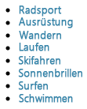

### Anmeldung {#login}

Stellt die Felder für den Benutzernamen und das Passwort bereit.


Sie können Folgendes konfigurieren:

* Anmelden

   * Bereichsbeschriftung

     Einleitender Text für die Eingabefelder.

   * Benutzername-Beschriftung

     Text zur Beschriftung des Benutzernamenfelds.

   * Kennwortaufschrift

     Text zur Beschriftung des Kennwortfelds.

   * Beschriftung für Anmelde-Schaltfläche

     Text für die Anmelde-Schaltfläche.

   * Umleiten zu

     Sie können die Seite Ihrer Website angeben, die geöffnet wird, nachdem sich der Benutzer angemeldet hat.

* Bereits angemeldet

   * Schaltflächenbeschriftung fortsetzen

     Text, der angibt, dass die Benutzerin bzw. der Benutzer bereits angemeldet ist.

### Auftragsstatus {#order-status}

* **Titel**

   * **Titel**

     Geben Sie den Titeltext an, der angezeigt werden soll.

   * **Verknüpfung**

     
Geben Sie die Seite (das Produkt) an, für das der Auftragsstatus angezeigt werden soll.

   * **Typ/Größe**

     Wählen Sie aus der bereitgestellten Auswahl aus.


### Verweis {#reference}

Mit der Komponente **Verweis** können Sie auf Text in einem anderen Teil einer AEM-basierten Website (innerhalb der aktuellen Instanz) verweisen. Der Inhalt des referenzierten Absatzes wird dann so angezeigt, als befände er sich auf der aktuellen Seite. Der Inhalt wird aktualisiert, wenn sich der Quellabsatz ändert (möglicherweise muss die Seite aktualisiert werden).

* **Absatzverweis**

   * **Verweis**

     Geben Sie den Pfad zu der Seite und den Absatz an, auf die bzw. den Sie verweisen möchten (einschließlich Inhalt).

Um den Pfad zu einem Absatz anzugeben, muss das folgende Suffix an den Pfad (zur Seite) angehängt werden:

`.../jcr:content/par/<paragraph-ID>`

Beispiel:

`/content/geometrixx-outdoors/en/equipment/biking/cajamara/jcr:content/par/similar-products`

Der Pfad kann auf einen bestimmten Absatz verweisen, aber er kann auch geändert werden, um ein ganzes PAR-System anzugeben. Fügen Sie dem Pfad folgendes Suffix hinzu:

`/jcr:content/par`

Beispiel:

`/content/geometrixx-outdoors/en/equipment/biking/cajamara/jcr:content/par`

Nach der Konfiguration wird der Inhalt genau wie auf der Quellseite angezeigt. Dass es sich um einen Verweis handelt, sehen Sie erst, wenn Sie die Komponente zur Bearbeitung öffnen:

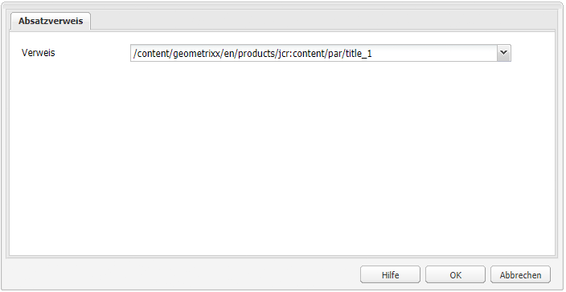

### Suchen {#searching}

Die Komponente „Suche“ stellt für Ihre Seite eine Suchfunktion zur Verfügung.

Sie können Folgendes konfigurieren:

* Suchen

   * **Knotentypen**

     Wenn die Suche für den bestimmten Knotentyp zu restriktiv ist, führen Sie sie hier auf, beispielsweise `cq:Page`.

   * **Suchpfad**

     Geben Sie die Stammseite der Verzweigung an, die Sie suchen möchten.

   * **Text auf Such-Schaltfläche**

     Der auf der Suchschaltfläche tatsächlich angezeigte Name.

   * **Text für Statistiken**

     Der über den Suchergebnissen angezeigte Text.

   * **Text für Keine Ergebnisse**

     Wenn keine Ergebnisse vorliegen, wird der hier eingegebene Text angezeigt.

   * **Text für Rechtschreibprüfung**

     Wenn jemand einen ähnlichen Begriff eingibt, wird dieser Text vor dem Begriff angezeigt.
Wenn Sie zum Beispiel `Geometrixxe` eingeben, zeigt das System „Meinten Sie? Geometrixx“.

   * **Text für Ähnliche Seiten**

     Der Text, der für ähnliche Seiten neben dem Ergebnis angezeigt wird. Um einen Teil eines Bildes abzuschneiden, klicken Sie auf diesen Link.

   * **Text für Verwandte Suche**

     Der Text, der neben Suchen nach verwandten Begriffen und Themen angezeigt wird.

   * **Text für Such-Trends**

     Der Titel über den Suchbegriffen, die eine Benutzerin oder ein Benutzer eingibt.

   * **Beschriftung: Ergebnisseiten**

     Der Text, der am Ende dieser Liste mit Links zu anderen Ergebnisseiten angezeigt wird.

   * **Beschriftung: Vorherige**

     Der Name, der für den Link zu vorherigen Suchseiten angezeigt wird.

   * **Beschriftung: Weiter**

     Der Name, der für den Link zu nachfolgenden Suchseiten angezeigt wird.

Das folgende Beispiel zeigt die Suchkomponente, nachdem im Stammverzeichnis der Standardinstallation das Wort *`geometrixx`* gesucht wurde. Es zeigt außerdem die Paginierung der Ergebnisse:


Das folgende Beispiel zeigt einen falsch geschriebenen und nicht verfügbaren Suchbegriff:

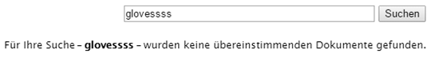

### Sitemap {#sitemap}

Eine automatische Sitemap-Auflistung, in der (bei Standardeinstellungen) alle Seiten (als aktive Links) in der aktuellen Website aufgeführt werden: Ein Auszug zeigt zum Beispiel:

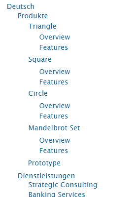

Sie können bei Bedarf Folgendes konfigurieren:

* **Sitemap**

   * **Stammverzeichnis**

     Pfad, von dem aus die Auflistung beginnen soll.

### Bildschirmpräsentation {#slideshow}

Mit dieser Komponente können Sie eine Reihe von Bildern laden, die als Bildschirmpräsentation auf Ihrer Seite angezeigt werden. Sie können Bilder hinzufügen oder entfernen und jedem einen Titel zuweisen. Unter „Erweitert“ können Sie auch die Größe des Anzeigebereichs angeben.

Sie können Folgendes konfigurieren:

* **Folien**

   * **Neue Folie**

     Über die Schaltflächen **Hinzufügen** (und **Entfernen**) können Sie eine Auswahl von Folien festlegen.

   * **Titel**

     Geben Sie bei Bedarf einen Titel an. Dieser Titel wird auf der entsprechenden Folie überlagert.

* **Erweitert**

   * **Größe**

     Geben Sie die Breite und die Höhe in Pixel an.

Die Bildschirmpräsentation-Komponente zeigt dann wiederholt der Reihe nach die einzelnen Folien für kurze Zeit an, bevor sie jeweils zur nächsten Folie überblendet.


### Tabelle {#table}

>[!NOTE]
>
>Die **Tabellenkomponente** basiert auf dem [Rich-Text-Editor](/help/sites-classic-ui-authoring/classic-page-author-rich-text-editor.md), ebenso wie die **[Textkomponente](#text)**.
>
>Adobe empfiehlt, für Tabellen die **Tabellenkomponente** zu verwenden. Sie können jedoch auch mit der **Textkomponente** erstellt werden.

Die **Tabellenkomponente** ist für das Erstellen, Ausfüllen und Formatieren einer Tabelle schon vorkonfiguriert. Mithilfe des Dialogfelds können Sie Ihre Tabelle konfigurieren und den Inhalt von Grund auf neu erstellen oder eine Tabelle aus einem externen Editor, wie Excel, OpenOffice oder Notepad, kopieren und einfügen.


Der folgende Screenshot zeigt ein Beispiel für den Einsatz der Tabellenkomponente. Das Design wird durch das Site-spezifische CSS bestimmt:


### Tag-Cloud {#tag-cloud}

Eine Tag-Cloud zeigt eine grafisch dargestellte Auswahl der Tags, die auf Inhalte auf Ihrer Website angewendet werden:


Beim Konfigurieren der Tag-Cloud-Komponente können Sie Folgendes festlegen:

* **Tags für Anzeige**
Ort, aus dem die anzuzeigenden Tags erfasst werden sollen. Wählen Sie dafür eine Seite, eine Seite mit allen untergeordneten Seiten oder alle Tags aus.

* **Seite**
Wählen Sie die Seite für den Verweis aus.

* **Keine Einschränkung bezüglich Tags**
Ob die angezeigten Tags als Links fungieren sollen.

Weitere Informationen zum Anwenden von Tags finden Sie unter [Verwenden von Tags](/help/sites-classic-ui-authoring/classic-feature-tags.md).

### Text {#text}

>[!NOTE]
>
>Die **Textkomponente** basiert ebenso wie die **[Tabellenkomponente](#table)** auf dem [Rich-Text-Editor](/help/sites-classic-ui-authoring/classic-page-author-rich-text-editor.md).
>
>Adobe empfiehlt, für Tabellen die **Tabellenkomponente** zu verwenden. Sie können jedoch auch mit der **Textkomponente** erstellt werden.

Mit der Textkomponente können Sie einen Textblock unter Verwendung eines WYSIWYG-Editors eingeben, dessen Funktionalität vom [Rich-Text-Editor](/help/sites-classic-ui-authoring/classic-page-author-rich-text-editor.md) bereitgestellt wird. Mit einer Reihe von Symbolen können Sie Ihren Text formatieren, einschließlich Schriftart, Ausrichtung, Links, Listen und Einzug.

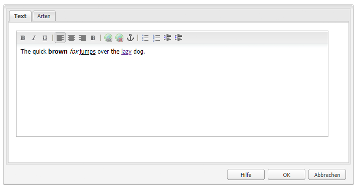

Wenn Sie die Registerkarte **Stile** des Dialogfelds **Bearbeiten** öffnen, können Sie auch Folgendes festlegen:

* **Abstand**
* **Textstil**

Der formatierte Text wird dann auf der Seite angezeigt. Das eigentliche Design hängt von der Site-CSS ab:

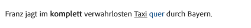

Weitere Informationen zur Text-Komponente und den vom Rich-Text-Editor bereitgestellten Funktionen finden Sie auf der Seite zum [Rich-Text-Editor.](/help/sites-classic-ui-authoring/classic-page-author-rich-text-editor.md) 

#### Kontext-Bearbeitung {#inplace-editing}

Zusätzlich zu der Bearbeitung in Dialogfeldern durch den Rich-Text-Editor bietet AEM noch die Möglichkeit einer [Bearbeitung im Kontext](/help/sites-authoring/editing-content.md), bei der Sie den Text direkt so bearbeiten, wie er im Layout der Seite erscheint.

### Text und Bild {#text-image}

Mit der Komponente „Text und Bild“ werden ein Textblock und ein Bild hinzugefügt. Sie können auch Text und Bilder separat hinzufügen und bearbeiten. Weitere Einzelheiten finden Sie bei den Komponenten [Text](#text) und [Bild](#image).

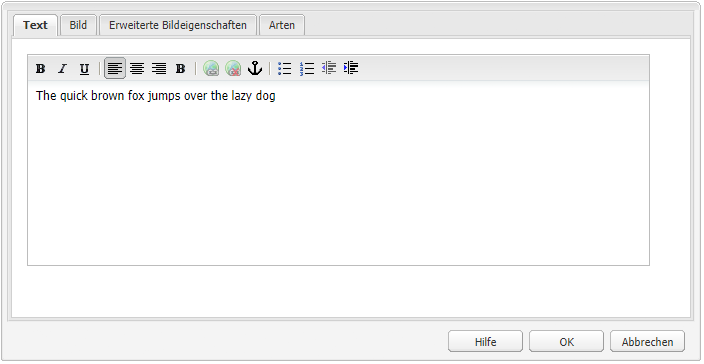 

Sie können Folgendes konfigurieren:

* **Komponentenstile** (**Stile**)

  Mit dieser Option können Sie das Bild rechts- oder linksbündig ausrichten. Standardmäßig wird das Bild **linksbündig** ausgerichtet.

* **Bildeigenschaften** (**Erweiterte Bildeigenschaften**)

  Hiermit können Sie Folgendes festlegen:

   * **Bild-Asset**

     Laden Sie das gewünschte Bild hoch.

   * **Titel**

     Der Titel des Blocks. Er wird durch Bewegen des Mauszeigers angezeigt.

   * **Alt-Text**

     Alternativer Text, der angezeigt wird, wenn das Bild nicht dargestellt werden kann. Wenn dies leer gelassen wird, wird der Titel verwendet.

   * **Verknüpfung zu**

     Geben Sie einen Zielpfad an.

   * **Beschreibung**

     Eine Beschreibung des Bildes.

   * **Größe**

     Legt die Höhe und Breite des Bildes fest.

Das folgende Beispiel zeigt eine Text-Bild-Komponente, die das Bild linksbündig anzeigt:

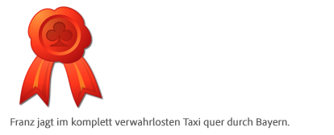

### Titel {#title}

Die Komponente „Titel“ kann Folgendes tun:

* Den Namen der aktuellen Seite anzeigen, indem Sie das Feld „Titel“ leer lassen.
* Einen Text anzeigen, den Sie im Feld „Titel“ angeben.

Sie können Folgendes konfigurieren:

* **Titel**

  Wenn Sie einen anderen Namen als den Seitentitel verwenden möchten, geben Sie ihn hier ein.

* **Verknüpfung**

  Die URI, wenn der Titel als Link fungieren soll.

* **Typ/Größe**

  Wählen Sie aus der Dropdown-Liste die Option „Klein“ oder „Groß“. „Klein“ wird als Bild generiert. „Groß“ wird als Text generiert.

Das folgende Beispiel zeigt die Anzeige einer Komponente **Titel**. Das Design wird durch das Site-spezifische CSS bestimmt.

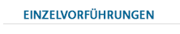

### Video  {#video}

Mit der **Video**-Komponente können Sie ein vordefiniertes, vorkonfiguriertes Videoelement auf Ihrer Seite platzieren.

Siehe auch [Konfigurieren Ihrer Videoprofile](/help/sites-administering/config-video.md#configuringvideoprofiles) zur Verwendung mit HTML5-Elementen.

Nachdem Sie eine Instanz der Komponente auf Ihrer Seite platziert haben, können Sie Folgendes konfigurieren:

* Video 

   * **Video-Asset**

     Video-Asset hochladen oder ablegen.

   * **Größe**

     Die native Größe des Videos (Breite x Höhe in Pixeln) wird in den Feldern neben „Größe“ angezeigt (siehe oben). Geben Sie hier manuell die Breite und Höhe ein, wenn Sie die systemeigenen Abmessungen des Videos überschreiben möchten. Durch Auswahl von **OK** wird der Dialog beendet.

>[!NOTE]
>
>Unterstützte Formate:
>
>* `.mp4`
>* `Ogg`
>* `FLV` (Flash-Video)
>

## Spalten {#columns}

Spalten sind ein Mechanismus zur Steuerung des Inhalts-Layouts in AEM. In einer Standardinstallation werden Komponenten zum Erstellen von zwei und/oder drei Spalten bereitgestellt.

Das folgende Beispiel zeigt die Komponenten für zwei und drei Spalten im Einsatz. Sie können die Platzhalter für neue Komponenten verwenden:

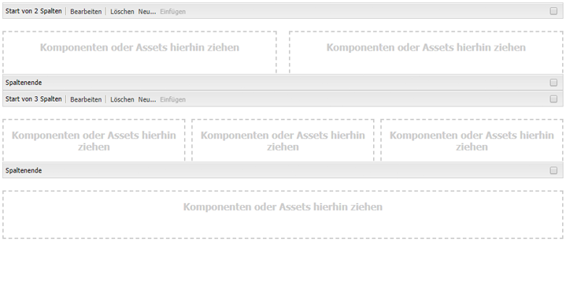

### 2 Spalten {#columns-1}

Eine Spalten-Steuerungs-Komponente, die standardmäßig auf zwei gleiche Spalten eingestellt ist.

### 3 Spalten {#columns-2}

Eine Spalten-Steuerungs-Komponente, die standardmäßig auf drei gleiche Spalten eingestellt ist.

### Spalten-Steuerung {#column-control}

Mit der Komponente „Spalten-Steuerung“ können Benutzerinnen und Benutzer auswählen, wie der Inhalt im Hauptbereich der Web-Seite in mehrere Spalten aufgeteilt werden soll. Benutzerinnen und Benutzer können die Anzahl der erforderlichen Spalten aus einer vordefinierten Liste auswählen und dann Inhalte in jeder der Spalten erstellen, löschen oder verschieben.

* **Spalten-Steuerung**

   * **Spalten-Layout**

     Wählen Sie die Anzahl der Spalten aus, die gerendert werden sollen. Nach der Erstellung verfügt jede Spalte über einen eigenen Link, um Inhalte hinzuzufügen, indem Komponenten oder Assets dorthin gezogen werden.

## Formular {#form}

Mit Formular-Komponenten können Sie Formulare erstellen, damit Besucher Eingaben vornehmen können. Formulare und Formularkomponenten können verwendet werden, um Informationen, einschließlich Benutzer-Feedback (z. B. ein Fragebogen zur Kundenzufriedenheit) und Benutzerinformationen (z. B. Benutzerregistrierung), zu erfassen.

>[!NOTE]
>
>Informationen zu AEM Forms finden Sie in der [AEM Forms-Hilfe](/help/forms/using/introduction-aem-forms.md).

Formulare bestehen aus mehreren verschiedenen Komponenten:

* **Formular**

  Die Formular-Komponente definiert den Beginn und das Ende eines neuen Formulars auf einer Seite. Zwischen diesen Elementen können dann andere Komponenten wie Tabellen und Downloads eingefügt werden.

* **Formularfelder und -elemente**

  Formularfelder und -elemente können etwa Textfelder, Optionsschaltflächen und Bilder umfassen. Der Benutzer führt oft eine Aktion in einem Formularfeld aus, z. B. Eingabe von Text. Weitere Informationen finden Sie unter den einzelnen Formularelementen.

* **Profilkomponenten**

  Profilkomponenten beziehen sich auf Besucherprofile, die für soziale Zusammenarbeit und andere Bereiche verwendet werden, für die eine Personalisierung erforderlich ist.

Im Folgenden finden Sie ein Beispielformular. Es setzt sich zusammen aus der **Formularkomponente** (Anfang und Ende) mit zwei **Formular**-**Textfeldern**, einem **allgemeinen** **Textfeld**, das für den Einführungstext verwendet wird, und einer **Senden**-Schaltfläche.

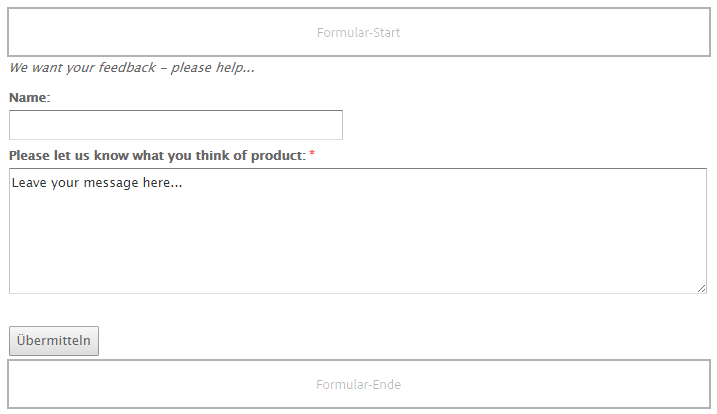

>[!NOTE]
>
>Informationen zum Entwickeln und Anpassen Ihrer Formulare finden Sie auf der Seite zum [Entwickeln von Formularen](/help/sites-developing/developing-forms.md). Diese Anpassung von Formularen umfasst u. a. das Hinzufügen von Aktionen, Einschränkungen, das Vorausfüllen von Feldern und die Verwendung von Skripten, um einen Dienst für eine Aktion aufzurufen.

### Gemeinsame Einstellungen für (viele) Formularkomponenten {#settings-common-to-many-form-components}

Obwohl jede Formularkomponente einen anderen Zweck hat, bestehen viele aus ähnlichen Optionen und Parametern.

Beim Konfigurieren einer jeden Formularkomponente sind die folgenden Registerkarten im Dialogfeld verfügbar:

* **Titel und Text**

  Hier müssen Sie grundlegende Informationen angeben, wie den Titel des Formulars und begleitenden Text. Gegebenenfalls können Sie hier auch andere wichtige Informationen definieren, z. B. ob das Feld mehrfach auswählbar ist und welche Elemente zur Auswahl stehen.

* **Anfangswerte**

  Hier können Sie einen Standardwert angeben.

* **Begrenzungen**

  Hier können Sie angeben, ob ein Feld erforderlich ist und welche Beschränkungen für dieses Feld gelten, z. B. ob nur numerische Werte zulässig sind.

* **Stile**

  Gibt die Größe und den Stil der Felder an.

>[!NOTE]
>
>Die angezeigten Felder können je nach Komponente sehr unterschiedlich sein.

Diese Registerkarten bieten die notwendigen Parameter. Die Registerkarten hängen vom jeweiligen Komponententyp ab und können Folgendes umfassen:

* **Titel und Text**

   * **Elementname**

     Name des Formularelements. Gibt an, wo im Repository die Daten gespeichert werden.
Dieses Feld ist erforderlich und sollte nur die folgenden Zeichen enthalten:

      * alphanumerische Zeichen
      * `_ . / : -`

   * **Titel**

     Der Titel, der mit dem Feld angezeigt wird. Wenn das Feld leer gelassen wird, wird der Standardtitel angezeigt.

   * **Beschreibung**

     Bietet Ihnen die Möglichkeit, bei Bedarf weitere Informationen für die Benutzerin bzw. den Benutzer anzugeben. Im Formular wird diese Beschreibung unter dem Feld in einer kleineren Schriftart als der Titel angezeigt.

   * **Einblenden/ausblenden**

     Bestimmt, wann das Feld sichtbar ist.

* **Anfangswerte**

   * **Standardwert**

     Der Wert, der im Feld beim Öffnen des Formulars angezeigt wird. Das heißt, bevor die Benutzerin bzw. der Benutzer eine Eingabe vornimmt.

* **Begrenzungen**

   * **Erforderlich**

     Diese Beschränkung hängt vom Typ der Formularkomponente ab, bietet jedoch ein oder mehrere Kontrollkästchen, die anzeigen, dass das entsprechende Feld oder bestimmte Teile des Felds erforderlich sind.

   * **Meldung: Erforderlich**

     Eine Meldung, die Benutzerinnen und Benutzer darüber informiert, dass dieses Feld erforderlich ist. Ein erforderliches Feld wird mit einem Sternchen gekennzeichnet.

   * **Beschränkung**

     Welche Beschränkungen für die Auswahl verfügbar sind, hängt vom Typ der Formularkomponente ab.

   * **Beschränkungsmeldung**

     Eine Meldung, die den Benutzer über erforderliche Eingaben informiert.

* **Stile**

   * **Größe**

     In Zeilen und Spalten.

   * **Breite**

     In Pixeln.

   * **CSS**

### Formular (Komponente) {#form-component}

Die Formular-Komponente definiert den Beginn und das Ende eines Formulars mithilfe der Elemente **Formular-Start** und **Formular-Ende**. Die Anfangs- und Endelemente werden immer gepaart, um sicherzustellen, dass das Formular korrekt definiert ist.

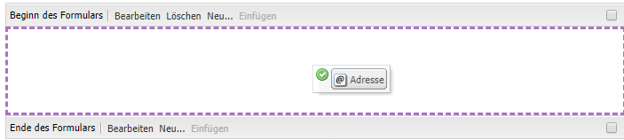

Zwischen dem Start und dem Ende eines Formulars können Sie Formular-Komponenten hinzufügen, die die eigentlichen Eingabefelder für die Benutzer definieren.

#### Beginn des Formulars {#start-of-form}

Diese erforderliche Komponente definiert den Beginn eines neuen Formulars auf einer Seite. Sie können Folgendes konfigurieren:

* **Formular**

   * **Dankeseite**

     Die Seite, auf die verwiesen wird, um Besuchern für ihre Eingabe zu danken. Wenn dies leer gelassen wird, wird das Formular nach der Übermittlung erneut angezeigt.

   * **Workflow starten**

     Bestimmt, welcher Workflow ausgelöst wird, sobald ein Formular übermittelt wird.

* **Erweitert**

   * **Aktionstyp**

     Für ein Formular ist eine Aktion erforderlich. Die Aktion bestimmt den Vorgang, dessen Ausführung mit den vom Benutzer übermittelten Daten ausgelöst wird (ähnlich wie „action=“ in HTML). Teilweise erfordert dies eine entsprechende **Aktionskonfiguration**.

     Einige Aktionstypen sind in einer Standard-AEM-Installation enthalten:

      * **Kontoabfrage**
      * **Inhalt erstellen**
      * **Lead erstellen**
      * **Konto erstellen und aktualisieren**
      * **E-Mail-Dienst: Abonnenten erstellen und zu Liste hinzufügen**
      * **E-Mail-Dienst: Abwesenheitsnachricht senden**
      * **E-Mail-Dienst: Benutzer von Liste entfernen**
      * **Community bearbeiten**
      * **Ressourcen bearbeiten**
      * **Workflow-gesteuerte Ressourcen bearbeiten**
      * **E-Mail**
      * **Details für platzierten Auftrag**
      * **Profilaktualisierung**
      * **Kennwort zurücksetzen**
      * **Kennwort festlegen**
      * **Inhalt speichern**

        Der standardmäßige Aktionstyp.

      * **Inhalt mit Uploads speichern**
      * **Bestellung übermitteln**
      * **Abonnenten löschen**
      * **Auftrag aktualisieren**

   * **Formular-ID**

     Mit der Formular-ID wird das Formular eindeutig gekennzeichnet. Verwenden Sie die Formular-ID, wenn sich mehrere Formulare auf einer Seite befinden. Achten Sie darauf, dass die Formulare unterschiedliche IDs haben.

   * **Ladepfad**

     Der Pfad zu den Knoteneigenschaften, mit denen vordefinierte Werte in die Formularfelder geladen werden.
Dieses Feld ist optional und gibt den Pfad zu einem Knoten im Repository an. Wenn dieser Knoten Eigenschaften hat, die den Feldnamen entsprechen, werden die jeweiligen Felder im Formular vorab mit den Werten dieser Eigenschaften ausgefüllt. Wenn keine Übereinstimmung besteht, steht im Feld der Standardwert.
Mit **Ladepfad** können Sie das Formular mit Werten in den erforderlichen Feldern vorab laden. Siehe den Beitrag zum [Vorabladen von Formularwerten](/help/sites-developing/developing-forms.md#preloading-form-values).

   * **Client-Validierung**

     Gibt an, ob für dieses Formular eine Client-Überprüfung erforderlich ist (eine Server-Überprüfung findet *immer* statt). Die Validierung erfolgt mit der **Captcha-Formularkomponente**.

   * **Validierungsressourcentyp**

     Hiermit wird der Ressourcentyp für die Formularvalidierung definiert, wenn Sie das gesamte Formular (anstelle von einzelnen Feldern) überprüfen möchten. Wenn Sie das gesamte Formular überprüfen, führen Sie auch eine der folgenden Aufgaben aus:

      * Ein Skript zur Client-Überprüfung:

        `/apps/<myApp>/form/<myValidation>/formclientvalidation.jsp`

      * Ein Skript zur Überprüfung auf der Server-Seite:

        `/apps/<myApp>/form/<myValidation>/formservervalidation.jsp`

   * **Aktionskonfiguration**

     Die in **Aktionskonfiguration** verfügbaren Optionen hängen vom ausgewählten **Aktionstyp** ab:

      * **Kontoabfrage**

         * **Kontoseite erstellen**
Die Seite, die beim Erstellen eines Kontos verwendet wird.

      * **Inhalt erstellen**

         * Inhaltspfad Der Inhaltspfad für alle Inhalte, die im Formular ausgegeben werden. Geben Sie einen Pfad ein, der mit einem Schrägstrich (`/`) endet. Der Schrägstrich zeigt an, dass für jeden Formular-Port ein neuer Knoten unter dem angegebenen Verzeichnis erstellt wird. Beispiel:
           `/forms/feedback/`

         * **Typ**

           Wählen Sie den erforderlichen Typ aus.

         * **Formular**

           Geben Sie das Formular an.

         * **Rendern mit**

           Wählen Sie die gewünschte Option aus der Liste aus.

         * **Ressourcentyp**

           Wenn festgelegt, wird dies zu jedem Kommentar als `sling:resourceType` hinzugefügt.

         * **Ansichtselektor**

      * **Lead erstellen**

         * **Lead wird dieser Liste hinzugefügt**
Geben Sie die erforderliche Lead-Liste an.

      * **Konto erstellen und aktualisieren**

         * **Anfangsgruppe**

           Gruppe, der neue Benutzerinnen und Benutzer zugewiesen werden sollen.

         * **Home**

           Seite, die nach erfolgreicher Anmeldung angezeigt werden soll.

         * **Pfad**

           Der Pfad (relativ), in dem das neue Konto erstellt und gespeichert wird.

         * **Daten anzeigen…**

           Wählen Sie die Schaltfläche aus, um auf die Informationen zu den Formularergebnissen im Bulk-Editor zugreifen zu können. Von hier aus können Sie die Informationen in eine `.tsv`-Datei (durch Tabulatoren getrennt) exportieren, die Sie z. B. in einer Excel-Tabelle öffnen können.

      * **E-Mail**

         * **Von**

           Geben Sie die E-Mail-Adresse ein, von der die E-Mail stammen soll.

         * **Mailto**

           Geben Sie eine oder mehrere E-Mail-Adressen ein, an die das Formular gesendet wird.

         * **CC**

           Geben Sie eine oder mehrere E-Mail-Adressen in CC ein.

         * **BCC**

           Geben Sie eine oder mehrere E-Mail-Adressen in BCC ein.

         * **Betreff**

           Geben Sie einen Betreff für die E-Mail ein.

      * **Kennwort zurücksetzen**

         * **Passwort ändern (Seite)**

           Die Seite, die beim Ändern des Passworts verwendet wird.

      * **Inhalt speichern**

         * **Inhalts-Pfad**

           Der Inhaltspfad zu Inhalten, die aus dem Formular ausgegeben werden. Geben Sie einen Pfad ein, der mit einem Schrägstrich (`/`) endet. Der Schrägstrich zeigt an, dass für jeden Formular-Port ein neuer Knoten unter dem angegebenen Verzeichnis erstellt wird. Beispiel:
           `/forms/feedback/`

         * **Daten anzeigen…**

           Wählen Sie die Schaltfläche aus, um auf die Informationen zu den Formularergebnissen im Bulk-Editor zugreifen zu können. Von hier aus können Sie die Informationen in eine TSV-Datei (durch Tabulatoren getrennt) exportieren, die Sie z. B. in einer Excel-Tabelle öffnen können.

      * **Inhalt mit Uploads speichern**

        Hat die gleichen Optionen wie **Inhalt speichern**.

      * **Abonnentin bzw. Abonnent abmelden**

         * **Lead wird aus dieser Liste gelöscht**

           Geben Sie die gewünschte Lead-Liste an.

#### Ende des Formulars {#end-of-form}

Markiert das Ende des Formulars. Sie können Folgendes konfigurieren:

* **Formular-Ende**

   * **Senden-Schaltfläche einblenden**

     Gibt an, ob eine Senden-Schaltfläche angezeigt werden soll.

   * **Senden-Name**

     Eine ID, die erforderlich ist, wenn Sie mehrere Senden-Schaltflächen in einem Formular verwenden.

   * **Senden-Titel**

     Der Name, der auf der Schaltfläche angezeigt wird, z. B. „Senden“ oder „Übermitteln“.

   * **Zurücksetzen-Schaltfläche einblenden**

     Wenn Sie das Kontrollkästchen aktivieren, wird die Schaltfläche „Zurücksetzen“ angezeigt.

   * **Titel zurücksetzen**

     Der Name, der auf der Schaltfläche zum Zurücksetzen angezeigt wird.

   * **Beschreibung**

     Informationen, die unter der Schaltfläche angezeigt werden.

### Kontoname {#account-name}

Ermöglicht der Benutzerin bzw. dem Benutzer die Eingabe eines Kontonamens:

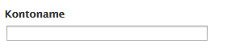

### Adresse {#address}

Hiermit kann ein Feld für internationale Adressen im folgenden Format hinzugefügt werden:


Die Komponente ist für den unmittelbaren Einsatz konfiguriert, Sie können die Konfiguration jedoch bei Bedarf ändern. Es können z. B. Beschränkungen für die einzelnen Elemente der Adresse hinzugefügt werden. Wenn Felder leer gelassen werden, werden Standardeinstellungen verwendet.

### Captcha {#captcha}

Bei der Captcha-Komponente muss der Benutzer eine alphanumerische Zeichenfolge eingeben, die am Bildschirm angezeigt wird. Die Zeichenfolge ändert sich bei jeder Aktualisierung.


Sie können verschiedene Parameter für diese Komponente konfigurieren, einschließlich einer Meldung, die angezeigt wird, wenn die Captcha-Zeichenfolge ungültig ist.

### Kontrollkästchen-Gruppe {#checkbox-group}

Mit einem Kontrollkästchen können Sie eine Liste aus einem oder mehreren Kontrollkästchen erstellen, von denen mehrere gleichzeitig aktiviert werden können.


Sie können verschiedene Parameter angeben, darunter einen Titel, eine Beschreibung und einen Elementnamen. Mithilfe der Schaltflächen „+“ und „-“ können Sie Elemente hinzufügen oder entfernen und sie dann mit den Pfeilen nach oben/unten positionieren.

>[!NOTE]
>
>Mit **Element-Ladepfad** können Sie die Kontrollkästchengruppen-Liste vorab mit Werten laden.
>
>Siehe [Vorabladen von Formularfeldern mit mehreren Werten](/help/sites-developing/developing-forms.md#preloading-form-fields-with-multiple-values).

### Kreditkartendetails {#credit-card-details}

Hier können Sie die Felder angeben, die für die Eingabe der Kreditkartendetails erforderlich sind. Sie können sie so konfigurieren, dass die akzeptierten Arten von Karten und die erforderlichen Informationen (z. B. Sicherheits-Code) angegeben werden.


### Dropdown-Liste {#dropdown-list}

Eine Dropdown-Liste kann so konfiguriert werden, dass Sie eine Reihe von Werten zur Auswahl haben:

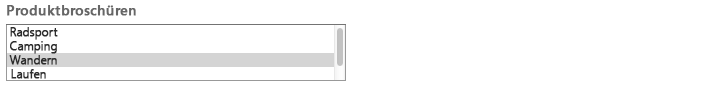

Sie können einen Titel und Elemente angeben, die in der Liste angezeigt werden sollen. Mit den Schaltflächen „+“ und „-“ können Sie Listenelemente hinzufügen oder entfernen und sie dann mit den Nach-oben- und Nach-unten-Tasten positionieren. Sie können angeben, ob Benutzerinnen und Benutzer mehrere Elemente aus der Liste auswählen dürfen, sowie alle Elemente, die beim ersten Öffnen der Liste automatisch ausgewählt sein sollen (Anfangswerte).

>[!NOTE]
>
>Mit dem **Element-Ladepfad** können Sie die Dropdown-Liste vorab mit Werten laden.
>
>Siehe [Vorabladen von Formularfeldern mit mehreren Werten](/help/sites-developing/developing-forms.md#preloading-form-fields-with-multiple-values).

### Datei-Upload {#file-upload}

Die Komponente „Datei-Upload“ bietet Benutzern die Möglichkeit, eine Datei auszuwählen und hochzuladen.

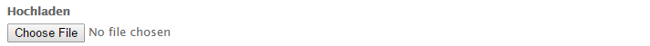


### Ausgeblendetes Feld {#hidden-field}

Mit dieser Komponente können Sie ein ausgeblendetes Feld erstellen. Diese ausgeblendeten Felder können für verschiedene Zwecke verwendet werden, z. B. wenn Sie nach dem Senden des Formulars eine Aktion durchführen müssen oder wenn in der Nachbearbeitung ausgeblendete Daten erforderlich sind.

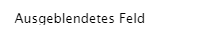

>[!NOTE]
>
>Sie können das Formular auch so anpassen, dass bestimmte Formular-Komponenten abhängig vom Wert anderer auf dem Formular befindlichen Felder ein- oder ausgeblendet werden. Das Ändern der Sichtbarkeit eines Formularfelds ist nützlich, wenn das Feld nur unter besonderen Bedingungen erforderlich ist.
>
>Siehe [Ein- und Ausblenden von Formularkomponenten](/help/sites-developing/developing-forms.md#showing-and-hiding-form-components).

### Bild-Schaltfläche {#image-button}

Mit einer Bild-Schaltfläche können Sie eine Schaltfläche mit Ihrem eigenen Bild und Text erstellen:

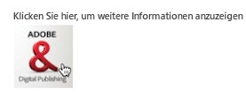

### Bild-Upload {#image-upload}

Die Bild-Upload-Komponente bietet Benutzern die Möglichkeit, eine Bilddatei auszuwählen und hochzuladen.


### Verknüpfungsfeld {#link-field}

Im Verknüpfungsfeld können Benutzende eine URL angeben:

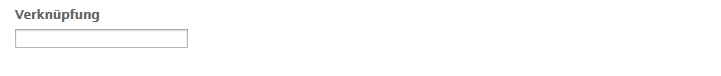

Wird am häufigsten für das Kalenderereignisformular verwendet, wo es für das URL-/Link-Feld eines Ereignisses verwendet wird.

### Kennwortfeld {#password-field}

Ermöglicht Benutzenden die Eingabe ihres Passworts:


### Kennwort zurücksetzen {#password-reset}

Diese Komponente bietet Ihrer Benutzerin oder Ihrem Benutzer zwei Felder für:

* die Eingabe eines Passworts
* die wiederholte Eingabe des Passworts, um zu bestätigen, dass die Eingabe korrekt ist.

Bei den Standardeinstellungen wird die Komponente wie folgt angezeigt:

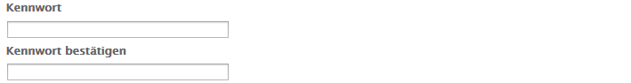

### Optionsfeldgruppe {#radio-group}

Eine Optionsfeldgruppe stellt Ihnen eine Liste mit einem oder mehreren Optionsfeldern zur Verfügung, von denen jeweils nur eines ausgewählt werden kann.

Sie können den Elementnamen zusammen mit einem Titel und einer Beschreibung angeben. Mithilfe der Schaltflächen „+“ und „–“ können Sie Elemente hinzufügen oder entfernen, sie mit den Pfeiltasten nach oben und unten positionieren und bei Bedarf einen Standardwert festlegen:


>[!NOTE]
>
>Mit dem **Element-Ladepfad** können Sie die Optionsfeld-Gruppe vorab mit Werten laden.
>
>Siehe [Vorabladen von Formularfeldern mit mehreren Werten](/help/sites-developing/developing-forms.md#preloading-form-fields-with-multiple-values).

### Senden-Schaltfläche {#submit-button}

Mit dieser Komponente können Sie eine Senden-Schaltfläche mit Standardtext erstellen:

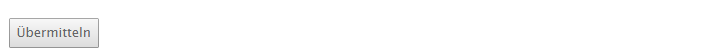

Oder Sie können Ihren eigenen Text eingeben:


### Feld „Tags“ {#tags-field}

In diesem Feld können Sie Tags auswählen:


Sie können verschiedene Parameter, einschließlich der zu verwendenden Namespaces, auf der spezialisierten Registerkarte angeben:

* **Tag-Feld**

   * **Zugelassene Namespaces**

      * **Geometrixx Outdoors**
      * **Arbeitsablauf**
      * **Forum**
      * **Bildarchiv**
      * **Geometrixx Media**
      * **Standard-Tags**
      * **Marketing**
      * **Asset-Eigenschaften**

   * **Breite in Pixel**
   * **Popup-Größe**

### Textfeld {#text-field}

Das Standardtextfeld kann an die erforderliche Größe angepasst werden und kann den eigenen Lead in der Nachricht enthalten:

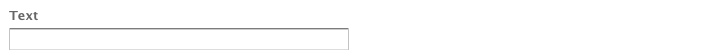

### Workflow-Senden-Schaltflächen {#workflow-submit-button-s}

Lassen Sie uns eine Senden-Schaltfläche zur Verwendung in einem Workflow erstellen.

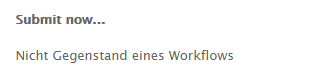
