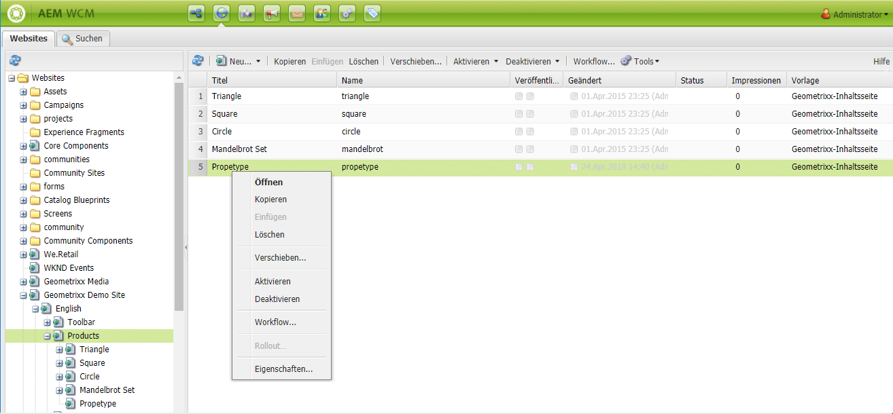
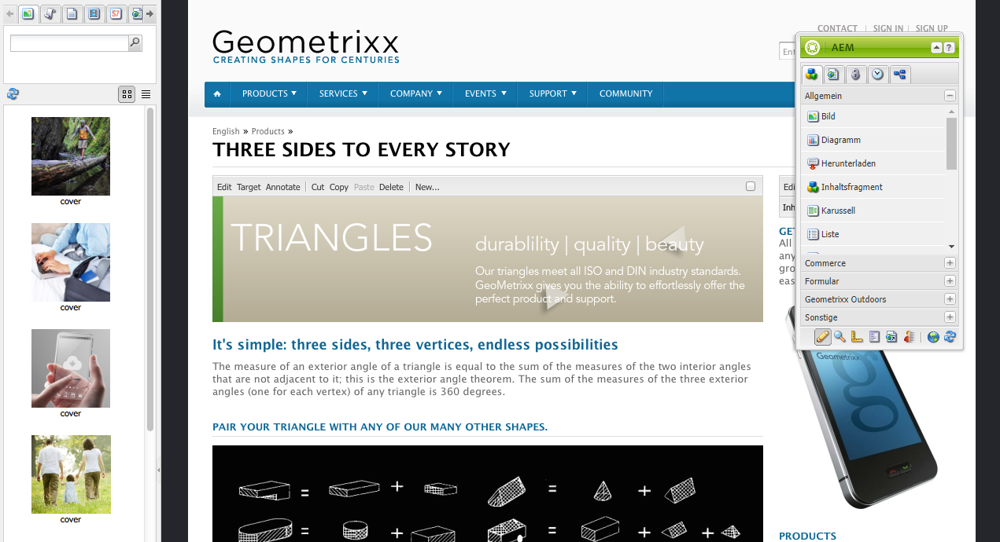
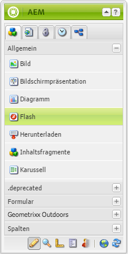
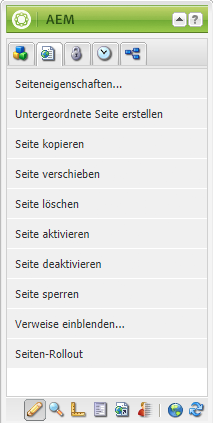
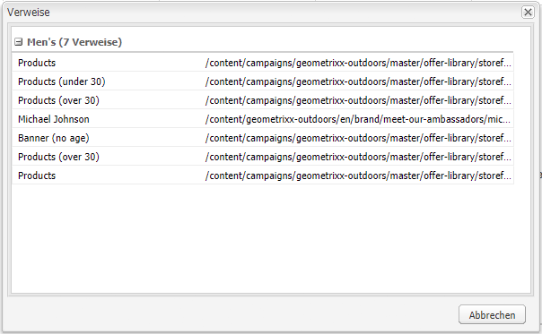
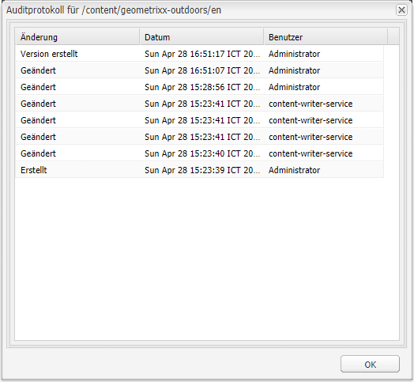

# Bearbeiten– Umgebung und Tools {#authoring-the-environment-and-tools}

Die Autorenumgebung von AEM bietet verschiedene Mechanismen für das Organisieren und Bearbeiten von Inhalten. Die verfügbaren Tools können über verschiedene Konsolen und Seiteneditoren aufgerufen werden.

## Site-Administration {#site-administration}

Die Konsole **Websites** ermöglicht es Ihnen, Ihre Website zu verwalten und darin zu navigieren. Mithilfe der beiden Bereiche können die Struktur Ihrer Website erweitert und Aktionen für das gewünschte Element durchgeführt werden:

## Bearbeiten des Seiteninhalts {#editing-your-page-content}

Es gibt einen separaten Seiteneditor in der klassischen Benutzeroberfläche, der die Inhaltssuche und den Sidekick verwendet:

`https://localhost:4502/cf#/content/geometrixx/en/products/triangle.html`

## Aufrufen der Hilfe {#accessing-help}

Verschiedene **Hilfe**-Ressourcen sind direkt in AEM zugänglich:

Neben der [Hilfe über die Konsolen-Symbolleisten](/help/sites-classic-ui-authoring/author-env-basic-handling.md#accessing-help) können Sie auch über den Sidekick auf die Hilfe zugreifen (mithilfe des Fragezeichensymbols), während Sie eine Seite bearbeiten.

Alternativ können Sie die Schaltfläche **Hilfe** im Bearbeitungsdialogfeld bestimmter Komponenten verwenden. Dadurch wird die kontextsensitive Hilfe angezeigt.

## Sidekick {#sidekick}

Auf der Registerkarte **Komponenten** im Sidekick können Sie die Komponenten durchsuchen, die Sie der aktuellen Seite hinzufügen können. Sie können die gewünschte Gruppe erweitern und anschließend eine Komponente an die gewünschte Position auf der Seite ziehen.

## Die Inhaltssuche {#the-content-finder}

Die Inhaltssuche bietet einen schnellen und einfachen Weg, beim Bearbeiten einer Seite nach Assets und/oder Inhalten innerhalb des Repositorys zu suchen.

Sie können die Inhaltssuche verwenden, um eine Reihe von Ressourcen zu ermitteln. Anschließend können Sie bei Bedarf ein Element per Drag-and-Drop auf einen Absatz ihrer Seite ziehen:

* [Bilder](#finding-images)
* [Dokumente](#finding-documents)
* [Filme](#finding-movies)
* [Dynamic Media-Browser](/help/sites-administering/scene7.md#scene7contentbrowser)
* [Seiten](#finding-pages)

* [Absätze](#referencing-paragraphs-from-other-pages)
* [Produkte](#products)
* Oder um [die Website gemäß der Repository-Struktur zu durchsuchen](#the-content-finder)

Bei allen Optionen können Sie [nach bestimmten Elementen suchen](#the-content-finder).

### Suchen von Bildern {#finding-images}

Auf dieser Registerkarte werden alle Bilder im Repository aufgelistet.

Nachdem Sie einen Absatz des Typs „Bild“ auf einer Seite erstellt haben, können Sie ein Element auf den Absatz ziehen und dort ablegen.

### Suchen von Dokumenten {#finding-documents}

Auf dieser Registerkarte werden alle Dokumente im Repository aufgelistet.

Nachdem Sie einen Absatz des Typs „Download“ auf einer Seite erstellt haben, können Sie ein Element auf den Absatz ziehen und dort ablegen.

### Suchen von Filmen {#finding-movies}

Auf dieser Registerkarte werden alle Filme (z. B. Flash-Elemente) im Repository aufgelistet.

Nachdem Sie einen geeigneten Absatz (z. B. „Flash“) auf einer Seite erstellt haben, können Sie ein Element auf den Absatz ziehen und dort ablegen.

### Produkte {#products}

In dieser Registerkarte werden sämtliche Produkte aufgeführt. Nachdem Sie einen geeigneten Absatz (z. B. „Produkt“) auf einer Seite erstellt haben, können Sie ein Element auf den Absatz ziehen und dort ablegen.

### Suchen nach Seiten {#finding-pages}

Auf dieser Registerkarte werden alle Seiten aufgelistet. Doppelklicken Sie auf eine beliebige Seite, um diese zur Bearbeitung zu öffnen.

### Verweisen auf Absätze von anderen Seiten {#referencing-paragraphs-from-other-pages}

Auf dieser Registerkarte können Sie nach einer anderen Seite suchen. Alle Absätze der betreffenden Seite werden aufgelistet. Anschließend können Sie einen Absatz auf die aktuelle Seite ziehen. Dadurch wird ein Verweis auf den ursprünglichen Absatz erstellt.

### Verwenden der Repository-Gesamtansicht {#using-the-full-repository-view}

Auf dieser Registerkarte werden alle Ressourcen im Repository angezeigt.

### Suche mithilfe des Inhalts-Browsers {#using-search-with-the-content-browser}

Bei allen Optionen können Sie nach bestimmten Elementen suchen. Alle Tags und Ressourcen, die dem Suchmuster entsprechen, werden aufgelistet:

Sie können auch Platzhalter für die Suche verwenden. Folgende Platzhalter werden unterstützt:

* `*`
entspricht einer Sequenz mit null oder mehr Zeichen.

* `?`
entspricht einem einzelnen Zeichen.

>[!NOTE]
>
>Es gibt eine Pseudoeigenschaft „name“, die für eine Platzhalter-Suche verwendet werden muss.

Wenn z. B. ein Bild mit folgendem Namen verfügbar ist:

`ad-nmvtis.jpg`

wird dies mit dem folgenden Suchmuster gefunden (und ebenso alle anderen Bilder, die dem Muster entsprechen):

* `name:*nmv*`
* `name:AD*`
beim Zeichenabgleich wird *nicht* zwischen Groß- und Kleinschreibung unterschieden.

* `name:ad?nm??is.*`
Sie können in einer Suchabfrage eine beliebige Anzahl an Platzhaltern verwenden.

>[!NOTE]
>
>Sie können auch die [SQL2](https://helpx.adobe.com/experience-manager/6-5/sites/developing/using/reference-materials/javadoc/org/apache/jackrabbit/commons/query/sql2/package-summary.html)-Suche verwenden.

## Anzeigen von Verweisen {#showing-references}

In AEM können Sie anzeigen, welche Seiten mit der aktuell bearbeiteten Seite verknüpft sind.

So zeigen Sie direkte Seitenverweise an:

1. Wählen Sie im Sidekick das Registerkartensymbol **Seite** aus.

   

1. Wählen Sie **Verweise einblenden...** aus. AEM öffnet das Fenster „Verweise“ und zeigt an, welche Seiten auf die ausgewählte Seite verweisen, einschließlich deren Pfadangaben.

   

In bestimmten Situationen sind weitere Aktionen im Sidekick verfügbar:

* [Launches](/help/sites-classic-ui-authoring/classic-launches.md)
* [Live Copies](/help/sites-administering/msm.md)

* [Blueprint](/help/sites-administering/msm-best-practices.md)

Andere [Beziehungen zwischen Seiten können in der Konsole „Websites“ angezeigt werden](/help/sites-classic-ui-authoring/author-env-basic-handling.md#page-information-on-the-websites-console).

## Auditprotokoll {#audit-log}

Das **Auditprotokoll** kann über die Registerkarte **Informationen** im Sidekick aufgerufen werden. Dort werden die kürzlich durchgeführten Aktionen für die aktuelle Seite aufgeführt. Beispiel:

## Seiteninformationen {#page-information}

Die Website-Konsole enthält auch [Informationen zum aktuellen Status der Seite](/help/sites-classic-ui-authoring/author-env-basic-handling.md#page-information-on-the-websites-console), wie zum Beispiel Veröffentlichung, Bearbeitung, gesperrt und Live Copy.

## Seitenmodi {#page-modes}

Beim Bearbeiten einer Seite in der klassischen Benutzeroberfläche können Sie verschiedene Modi über die Symbole unten im Sidekick aufrufen:

Die Reihe von Symbolen am unteren Rand des Sidekick wird verwendet, um den Bearbeitungsmodus für Seiten umzuschalten:

* [Bearbeiten:](/help/sites-classic-ui-authoring/classic-page-author-edit-mode.md)
Dies ist der Standardmodus; er ermöglicht die Bearbeitung der Seite durch Hinzufügen oder Entfernen von Komponenten sowie andere Änderungen.

* [Vorschau:](/help/sites-classic-ui-authoring/classic-page-author-edit-content.md#previewing-pages)
In diesem Modus können Sie eine Seite in der finalen Form betrachten, in der sie auf der Website erscheint.

* [Design:](/help/sites-classic-ui-authoring/classic-page-author-design-mode.md#main-pars-procedure-0)
In diesem Modus können Sie das Design der Seite bearbeiten, indem Sie die verfügbaren Komponenten konfigurieren.

>[!NOTE]
>
>Es sind weitere Optionen verfügbar:
>
>* [Strukturvorlage](/help/sites-classic-ui-authoring/classic-feature-scaffolding.md)
>* [ClientContext](/help/sites-administering/client-context.md)
>* Websites – öffnet die Konsole „Websites“.
>* Neu laden – aktualisiert die Seite.

## Tastaturbefehle {#keyboard-shortcuts}

Für die Bedienung stehen verschiedene [Tastaturbefehle](/help/sites-classic-ui-authoring/classic-page-author-keyboard-shortcuts.md) zur Verfügung.
