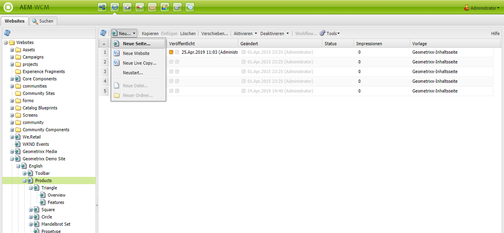
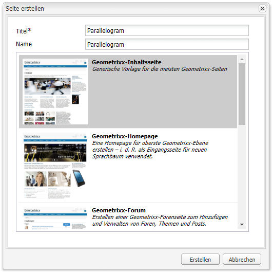
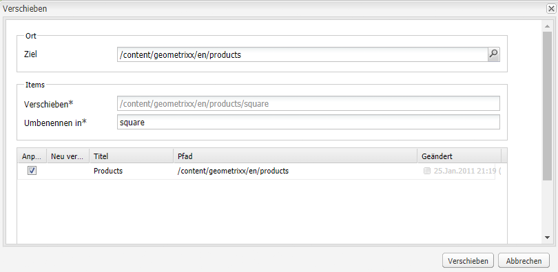
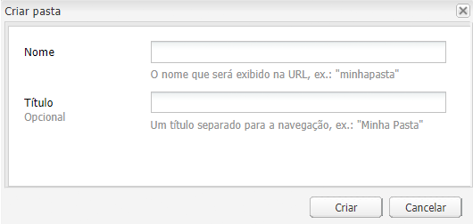

# Erstellen und Organisieren von Seiten{#creating-and-organizing-pages}

In diesem Abschnitt wird beschrieben, wie Sie mit Adobe Experience Manager (AEM) Seiten erstellen und verwalten, um auf diesen Seiten [Inhalte zu erstellen](/help/sites-classic-ui-authoring/classic-page-author-edit-content.md).

>[!NOTE]
>
>Ihr Konto muss über die [erforderlichen Zugriffsrechte](/help/sites-administering/security.md) und [Brechtigungen](/help/sites-administering/security.md#permissions) verfügen, damit Sie Aktionen auf Seiten durchführen können, wie das Erstellen, Kopieren, Verschieben, Bearbeiten oder Löschen.
>
>Wenn Sie auf Probleme stoßen, empfehlen wir Ihnen, sich an den Systemadministrator zu wenden.

## Website-Organisation {#organizing-your-website}

Als Autor müssen Sie Ihre Website in AEM organisieren. Aus diesem Grund müssen Sie Ihre Inhaltsseiten entsprechend folgenden Richtlinien erstellen und benennen:

* Sie müssen leicht in der Autorenumgebung auffindbar sein.
* Besucher der Website müssen sie einfach in der Veröffentlichungsumgebung durchsuchen können.

Sie können Ihre Inhalte auch mithilfe von [Ordnern](#creating-a-new-folder) organisieren.

Die Struktur einer Website kann als *Baumstruktur* gesehen werden, die die Inhaltsseiten enthält. Die Namen dieser Inhaltsseiten werden zur Bildung der URLs verwendet. Der Titel wird zusammen mit dem Seiteninhalt angezeigt.

Nachstehend finden Sie einen Auszug aus der Geometrixx. wo beispielsweise auf die Seite `Triangle` zugegriffen wird:

* Autorenumgebung

   `http://localhost:4502/cf#/content/geometrixx/en/products/triangle.html`

* Veröffentlichungsumgebung

   `http://localhost:4503/content/geometrixx/en/products/triangle.html`

   Je nach Konfiguration Ihrer Instanz kann die Verwendung von `/content` in der Veröffentlichungsumgebung optional sein.

```xml
  /content
    /geometrixx
      /en
        /toolbar...
        /products
          /triangle
            /overview
            /features
          /square...
          /circle...
          /...
        /...
      /fr...
      /de...
      /es...
      /...
    /...
```

Diese Struktur kann über die Websites-Konsole angezeigt werden, die Sie verwenden können, um [durch die Baumstruktur](/help/sites-classic-ui-authoring/author-env-basic-handling.md#main-pars-text-15) zu navigieren.


### Seitenbenennungskonventionen {#page-naming-conventions}

Beim Erstellen einer neuen Seite gibt es zwei Schlüsselfelder:

* **[Titel](#title)**:

   * Dieses Feld wird dem Benutzer bei der Bearbeitung im oberen Teil des Seiteninhalts in der Konsole angezeigt.
   * Dieses Feld ist obligatorisch.

* **[Name](#name)**:

   * Mit diesem Wert wird der URI generiert.
   * Benutzereingaben sind für dieses Feld optional. Wenn kein Name angegeben ist, wird er vom Titel abgeleitet.

Beim Erstellen einer neuen Seite validiert AEM [den Seitennamen entsprechend den Konventionen](/help/sites-developing/naming-conventions.md), die von AEM und JCR vorgeschrieben sind.

Die Implementierung und die Liste der zulässigen Zeichen unterscheiden sich je nach Benutzeroberfläche geringfügig (sie ist für die Touch-optimierte Benutzeroberfläche umfassender). Es ist jedoch mindestens Folgendes zulässig:

* „a“ bis „z“
* „A“ bis „Z“
* „0“ bis „9“
* _ (Unterstrich)
* `-` (Bindestrich/Minus)

Verwenden Sie nur diese Zeichen, wenn Sie sicher sein möchten, dass sie akzeptiert/verwendet werden (weitere Informationen zu allen zulässigen Zeichen finden Sie in den [Benennungskonventionen](/help/sites-developing/naming-conventions.md)).

#### Titel {#title}

Wenn Sie für eine neu erstellte Seite nur den **Titel** angeben, leitet AEM den **Namen** für die Seite von dieser Zeichenfolge ab und [validiert den Namen entsprechend den Konventionen von AEM und JCR. ](/help/sites-developing/naming-conventions.md) In beiden Benutzeroberflächen werden ungültige Zeichen im Feld **Titel** akzeptiert, wobei die ungültigen Zeichen im abgeleiteten Namen jedoch ersetzt werden. Beispiel:

| Titel | Abgeleiteter Name |
|---|---|
| Schön | schoen.html |
| SC%&amp;&amp;ast;ç+ | sc---c-.html |

#### Name {#name}

Wenn Sie beim Erstellen einer neuen Seite einen **Namen** für die Seite angeben, [validiert AEM den Namen entsprechend den Konventionen von AEM und JCR](/help/sites-developing/naming-conventions.md).

In der klassischen Benutzeroberfläche können Sie **keine ungültigen Zeichen** im Feld **Name** eingeben.

>[!NOTE]
>In der Touch-optimierten Benutzeroberfläche können Sie **keine ungültigen Zeichen** im Feld **Name** senden. Wenn AEM ungültige Zeichen erkennt, wird das Feld markiert und eine erklärende Meldung angezeigt, die auf zu entfernende/ersetzende Zeichen verweist.

>[!NOTE]
>
>Sie sollten die Verwendung eines zweistelligen Codes gemäß ISO-639-1 vermeiden, es sei denn, es handelt sich um eine Sprachwurzel.
>
>Weitere Informationen finden Sie unter [Vorbereiten von Inhalten für die Übersetzung](/help/sites-administering/tc-prep.md).

### Vorlagen {#templates}

In AEM sind bestimmte Seitentypen in Vorlagen gespeichert. Eine Vorlage wird als Basis für jede neue erstellte Seite verwendet.

Die Vorlage definiert die Seitenstruktur, u. a. eine Miniaturansicht und andere Eigenschaften. Beispielsweise könnten Sie unterschiedliche Vorlagen für Produktseiten, Sitemaps und Kontaktangaben verwenden. Vorlagen bestehen aus [Komponenten](#components).

Im Lieferumfang von AEM sind diverse Vorlagen enthalten. Die angebotenen Vorlagen hängen von der einzelnen Website ab. Welche Informationen (beim Erstellen der neuen Seite) angegeben werden müssen, hängt von der verwendeten Benutzeroberfläche ab. Die wichtigsten Felder sind:

* **Titel**
Der Titel, der auf der resultierenden Web-Seite angezeigt wird.

* **Name**
Wird beim Benennen der Seite verwendet.

* **Vorlage**
Eine Liste von Vorlagen, die für das Erstellen neuer Seiten verwendet werden können.

### Komponenten  {#components}

Komponenten sind die Elemente, die von AEM bereitgestellt werden, damit Sie bestimmte Inhaltstypen hinzufügen können. AEM ist mit einsatzbereiten Komponenten ausgestattet, die umfangreiche Funktionen bieten, wie:

* Text
* Bild
* Diashow
* Video
* viele weitere

Nachdem Sie eine Seite erstellt und geöffnet haben, können Sie [Inhalte mithilfe der Komponenten](/help/sites-classic-ui-authoring/classic-page-author-edit-content.md#insertinganewparagraph) hinzufügen, die über den [Sidekick](/help/sites-classic-ui-authoring/classic-page-author-env-tools.md#sidekick) verfügbar sind.

## Verwalten von Seiten {#managing-pages}

### Erstellen einer neuen Seite {#creating-a-new-page}

Sofern nicht alle Seiten für Sie im Voraus erstellt wurden, müssen Sie vor dem Einfügen von Inhalten zunächst eine Seite erstellen:

1. Wählen Sie in der Konsole **Websites** die Ebene aus, auf der die neue Seite erstellt werden soll.

   Im folgenden Beispiel erstellen Sie die Seite auf der Ebene **Produkte** - diese Ebene wird im linken Fenster angezeigt, im rechten Fenster sehen Sie die bereits auf der Ebene **Produkte** angelegten Seiten.

   

1. Klicken Sie im Menü **Neu...** (auf den Pfeil neben **Neu...** klicken) auf **Neue Seite...**. Das Fenster **Seite erstellen** wird geöffnet.

   Wenn Sie einfach auf **Neu...** klicken, wird ebenfalls die Option **Neue Seite...** gewählt.

1. Im Dialogfeld **Seite erstellen** haben Sie folgende Möglichkeiten:

   * Angabe eines **Titels**, der für den Benutzer angezeigt wird.
   * Angabe eines **Namens**, der für die Erzeugung des URI verwendet wird. Wenn kein Name angegeben ist, wird er vom Titel abgeleitet.

      * Wenn Sie beim Erstellen einer neuen Seite einen **Namen** für die Seite angeben, validiert AEM[ den Namen entsprechend den Konventionen](/help/sites-developing/naming-conventions.md) von AEM und JCR.
      * In der klassischen Benutzeroberfläche ist **die Eingabe von ungültigen Zeichen** im Feld **Name** unzulässig.
   * Klicken Sie auf die Vorlage, die für die Erstellung der neuen Seite verwendet werden soll.

      Die Vorlage wird als Grundlage für die neue Seite verwendet, z. B. um die grundlegende Formatierung für die neue Seite festzulegen.
   >[!NOTE]
   >
   >Weitere Informationen finden Sie unter [Benennungskonventionen für Seiten](#page-naming-conventions).

   Das Minimum an Informationen für das Erstellen einer neuen Seite sind der **Titel** und die erforderliche Vorlage.

   

   >[!NOTE]
   >
   >Wenn Sie in den URLs Unicode-Zeichen verwenden möchten, richten Sie die Eigenschaft „Alias“`sling:alias`() ) ein ([Seiteneigenschaften](/help/sites-classic-ui-authoring/classic-page-author-edit-page-properties.md)).

1. Klicken Sie auf **Erstellen**, um die Seite zu erstellen. Dann kehren Sie zur Konsole **Websites** zurück, wo Sie den Eintrag für die neue Seite sehen können.

   Die Konsole enthält Informationen über die Seite (z. B. Datum und Uhrzeit und Verursacher der letzten Änderung), die nach Bedarf aktualisiert werden.

   >[!NOTE]
   >
   >Sie können auch eine Seite erstellen, wenn Sie eine vorhandene Seite bearbeiten. Mit der Option &quot;Untergeordnete Seite erstellen&quot;auf der Registerkarte **Seite** des Sidekicks wird eine neue Seite direkt unter der bearbeiteten Seite erstellt.

### Öffnen einer Seite zur Bearbeitung {#opening-a-page-for-editing}

Sie haben verschiedene Möglichkeiten, um eine Seite zur [Bearbeitung](/help/sites-classic-ui-authoring/classic-page-author-edit-content.md#editing-a-component-content-and-properties) zu öffnen:

* Sie können in der Konsole **Websites** auf den Titel der Seite **doppelklicken**, um sie für die Bearbeitung zu öffnen.

* In der **Websites**-Konsole können Sie mit der **rechten Maustaste** (Kontextmenü) auf das Seitenelement klicken und dann im Kontextmenü die Option **Öffnen** wählen.

* Nachdem Sie eine Seite geöffnet haben, können Sie zu anderen Seiten innerhalb der Website navigieren, um sie zu bearbeiten, indem Sie auf die zugehörigen Hyperlinks klicken.

### Kopieren und Einfügen einer Seite  {#copying-and-pasting-a-page}

Beim Kopieren können Sie entweder

* eine einzelne Seite
* oder eine Seite zusammen mit allen Unterseiten kopieren.

1. Wählen Sie in der Konsole **Websites** die zu kopierende Seite aus.

   >[!NOTE]
   >
   >Zu diesem Zeitpunkt ist es unerheblich, ob Sie eine einzelne Seite oder auch alle Unterseiten kopieren möchten.

1. Klicken Sie auf **Kopieren**.

1. Navigieren Sie zum neuen Speicherort und klicken Sie auf eine der folgenden Optionen:

   * **Einfügen** - um die Seite zusammen mit allen Unterseiten einzufügen
   * **Umschalt + Einfügen** - um nur die ausgewählte Seite einzufügen

   Die Seite bzw. die Seiten werden am neuen Speicherort eingefügt.

   >[!NOTE]
   >
   >Wenn eine bestehende Seite bereits denselben Namen hat, wird der Seitenname möglicherweise automatisch angepasst.

   >[!NOTE]
   >
   >Sie können auch **Seite kopieren** auf der Registerkarte **Seite** des Sidekicks verwenden. Ein Dialogfeld wird geöffnet, in dem Sie unter anderem das Ziel angeben können.

### Verschieben oder Umbenennen einer Seite {#moving-or-renaming-page}

>[!NOTE]
>
>Beim Umbenennen einer Seite gelten ebenfalls die [Benennungskonventionen für Seiten](#page-naming-conventions), wenn der neue Seitenname angegeben wird.

Das Verfahren für das Verschieben oder Umbenennen einer Seite ist identisch. Mit derselben Aktion können Sie:

* eine Seite an eine neue Position verschieben
* eine Seite an derselben Position umbenennen
* eine Seite an eine andere Position verschieben und sie gleichzeitig umbenennen

AEM bietet die Möglichkeit, interne Links zu aktualisieren, die zu einer Seite führen, die umbenannt oder verschoben wird. Dies kann seitenweise erfolgen, um die volle Flexibilität zu ermöglichen.

So verschieben Sie eine Seite oder benennen sie um:

1. Es gibt verschiedene Methoden, eine Verschiebung auszulösen:

   * Klicken Sie in der **Websites**-Konsole auf die gewünschte Seite und wählen Sie **Verschieben...**.
   * In der Konsole **Websites** können Sie auch das Seitenelement auswählen, dann **mit der rechten Maustaste klicken** und **Verschieben...** auswählen.
   * Beim Bearbeiten einer Seite können Sie im Sidekick auf der Registerkarte **Seite** die Option **Seite verschieben** auswählen.

1. Das Fenster **Verschieben** wird geöffnet, in dem Sie entweder einen neuen Speicherort oder einen neuen Namen oder beides angeben können.

   

   Auf der Seite werden außerdem alle Seiten aufgelistet, die auf die zu verschiebende Seite verweisen. Je nach Status der verweisenden Seite können Sie diese Links möglicherweise anpassen und/oder die Seiten neu veröffentlichen.

1. Machen Sie je nach Bedarf Angaben in den folgenden Feldern:

   * **Destination**

      Verwenden Sie die Sitemap (verfügbar über die Dropdownliste), um den Speicherort zu wählen, an den die Seite verschoben werden soll.

      Wenn Sie die Seite nur umbenennen, ignorieren Sie dieses Feld.

   * **Verschieben**

      Geben Sie die zu verschiebende Seite an - dieses Feld ist in der Regel bereits ausgefüllt, je nachdem, wie Sie den Verschiebevorgang gestartet haben.

   * **Umbenennen in**

      Standardmäßig wird das aktuelle Etikett angezeigt. Geben Sie, falls erforderlich, ein neues Seitenetikett an.

   * **Anpassen**

      Aktualisieren Sie die Links, die auf die zu verschiebende Seite verweisen. Wenn beispielsweise Seite A auf Seite B verweist, passt AEM die Links an, wenn Sie Seite B verschieben.

      Diese Funktion kann für jede Seite einzeln aktiviert bzw. deaktiviert werden.

   * **Neu veröffentlichen**

      Veröffentlichen Sie die verweisende Seite neu. Diese Funktion kann ebenfalls für jede Seite einzeln aktiviert bzw. deaktiviert werden.
   >[!NOTE]
   >
   >Wenn die Seite bereits aktiviert war, wird sie durch Verschieben automatisch deaktiviert. Standardmäßig wird sie nach dem Verschieben wieder aktiviert. Dies lässt sich jedoch ändern, indem Sie im Fenster **Verschieben** das Kontrollkästchen **Neu veröffentlichen** für die Seite deaktivieren.

1. Klicken Sie auf **Verschieben**. Für den Vorgang ist eine Bestätigung erforderlich. Klicken Sie hierfür auf **OK**.

   >[!NOTE]
   >
   >Der Seitentitel wird nicht aktualisiert.

### Löschen einer Seite {#deleting-a-page}

1. Sie können eine Seite von verschiedenen Stellen aus löschen:

   * Klicken Sie in der Konsole **Websites** auf die gewünschte Seite, klicken Sie mit der rechten Maustaste darauf und wählen Sie dann im Kontextmenü **Löschen** aus.
   * Klicken Sie in der Konsole **Websites** auf die gewünschte Seite und wählen Sie dann im Symbolleistenmenü **Löschen** aus.
   * Verwenden Sie im Sidekick die Registerkarte **Seite** und wählen Sie dort **Seite löschen** aus. Die aktuell geöffnete Seite wird gelöscht.

1. Nachdem Sie das Löschen einer Seite ausgewählt haben, müssen Sie den Vorgang bestätigen, da dieser nicht rückgängig gemacht werden kann.

   >[!NOTE]
   >
   >Falls eine Seite bereits veröffentlicht wurde, können Sie nach ihrem Löschen die neueste (oder eine bestimmte andere) Version der Seite wiederherstellen, aber möglicherweise enthält diese Version nicht die zuletzt durchgeführten Änderungen. Weitere Einzelheiten finden Sie im Beitrag zum [Wiederherstellen von Seiten](/help/sites-classic-ui-authoring/classic-page-author-work-with-versions.md#restoringpages).

>[!NOTE]
>
>Wenn eine Seite bereits aktiviert ist, wird sie vor dem Löschen automatisch deaktiviert.

### Sperren einer Seite {#locking-a-page}

Sie können entweder in einer Konsole oder beim Bearbeiten einer Seite eine [Seite sperren/entsperren](/help/sites-classic-ui-authoring/classic-page-author-edit-content.md#locking-a-page). Auch Angaben dazu, ob eine Seite gesperrt ist, werden in beiden Fällen angezeigt.

### Erstellen eines neuen Ordners {#creating-a-new-folder}

>[!NOTE]
>
>Für Ordner gelten ebenfalls die [Benennungskonventionen für Seiten](#page-naming-conventions), wenn der neue Ordnername angegeben wird.

1. Öffnen Sie die Konsole **Sites** und navigieren Sie zum gewünschten Ort.
1. Klicken Sie im Menü **Neu...** (auf den Pfeil neben **Neu...** klicken) auf **Neuer Ordner...**
1. Das Dialogfeld **Ordner erstellen** wird geöffnet. Hier können Sie den **Namen** und den **Titel** eingeben:

   

1. Wählen Sie **Erstellen**, um den Ordner zu erstellen.
