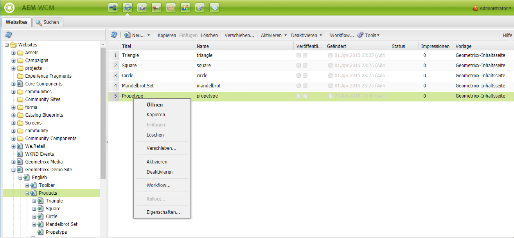

# Erstellen und Organisieren von Seiten{#creating-and-organizing-pages}

In diesem Abschnitt wird beschrieben, wie Sie mit Adobe Experience Manager (AEM) Seiten erstellen und verwalten können, damit Sie anschließend auf diesen Seiten [Inhalte erstellen](/help/sites-classic-ui-authoring/classic-page-author-edit-content.md) können.

>[!NOTE]
>
>Ihr Konto benötigt die [erforderlichen Zugriffsrechte](/help/sites-administering/security.md) und [Berechtigungen](/help/sites-administering/security.md#permissions), um Aktionen auf Seiten durchzuführen, wie das Erstellen, Kopieren, Verschieben, Bearbeiten oder Löschen.
>
>Wenn Sie auf Probleme stoßen, empfehlen wir Ihnen, sich an die bzw. den Systemadmin zu wenden.

## Website-Organisation {#organizing-your-website}

Als Autor müssen Sie Ihre Website in AEM organisieren. Dazu gehört die Erstellung und Benennung von Inhaltsseiten, sodass Folgendes zutrifft:

* Sie müssen leicht in der Autorenumgebung auffindbar sein.
* Besucher der Website müssen sie einfach in der Veröffentlichungsumgebung durchsuchen können.

Sie können Ihre Inhalte auch mithilfe von [Ordnern](#creating-a-new-folder) organisieren.

Die Struktur einer Website kann als *Baumstruktur* gesehen werden, die die Inhaltsseiten enthält. Die Namen dieser Inhaltsseiten werden zur Bildung der URLs verwendet, während der Titel angezeigt wird, wenn der Inhalt der Seite aufgerufen wird.

Der folgende Auszug stammt aus der Geometrixx-Website, über die z. B. die `Triangle`-Seite aufgerufen wird.

* Autorenumgebung

   `http://localhost:4502/cf#/content/geometrixx/en/products/triangle.html`

* Publishing-Umgebung

   `http://localhost:4503/content/geometrixx/en/products/triangle.html`

   Abhängig von der Konfiguration Ihrer Instanz kann die Verwendung von `/content` in der Veröffentlichungsumgebung optional sein.

```xml
  /content
    /geometrixx
      /en
        /toolbar...
        /products
          /triangle
            /overview
            /features
          /square...
          /circle...
          /...
        /...
      /fr...
      /de...
      /es...
      /...
    /...
```

Diese Struktur kann über die Websites-Konsole angezeigt werden, die Sie verwenden können, um [durch die Baumstruktur zu navigieren](/help/sites-classic-ui-authoring/author-env-basic-handling.md#main-pars-text-15).



### Seitenbenennungskonventionen {#page-naming-conventions}

Beim Erstellen einer neuen Seite gibt es zwei Schlüsselfelder:

* **[Titel](#title)**:

   * Dieses Feld wird dem Benutzer bei der Bearbeitung im oberen Teil des Seiteninhalts in der Konsole angezeigt.
   * Dieses Feld ist obligatorisch.

* **[Name](#name)**:

   * Mit diesem Wert wird der URI generiert.
   * Benutzereingaben sind für dieses Feld optional. Wenn kein Name angegeben ist, wird der Name vom Titel abgeleitet.

Wenn Sie eine neue Seite erstellen, validiert AEM [den Seitennamen gemäß den Konventionen](/help/sites-developing/naming-conventions.md) von AEM und JCR.

Die Implementierung und die Liste von zulässigen Zeichen variieren entsprechend der Benutzeroberfläche (umfangreicher für die Touch-optimierte Benutzeroberfläche). Das zulässige Minimum ist:

* „a“ bis „z“
* „A“ bis „Z“
* „0“ bis „9“
* _ (Unterstrich)
* `-` (Bindestrich/Minus)

Verwenden Sie nur diese Zeichen, wenn Sie sicherstellen möchten, dass sie akzeptiert/verwendet werden (wenn Sie vollständige Details zu allen zulässigen Zeichen benötigen, lesen Sie die [Namenskonventionen](/help/sites-developing/naming-conventions.md)).

#### Titel {#title}

Wenn Sie für eine neu erstellte Seite nur den **Titel** angeben, leitet AEM den **Namen** für die Seite von dieser Zeichenfolge ab und [validiert den Namen entsprechend den Konventionen](/help/sites-developing/naming-conventions.md) von AEM und JCR. In beiden Benutzeroberflächen wird ein Feld **Titel**, das ungültige Zeichen enthält, akzeptiert, aber in dem abgeleiteten Namen werden die ungültigen Zeichen ersetzt. Beispiel:

| Titel | Abgeleiteter Name |
|---|---|
| Schön | schoen.html |
| SC%&amp;&amp;ast;ç+ | sc---c-.html |

#### Name {#name}

Wenn Sie beim Erstellen einer neuen Seite einen **Namen** für die Seite angeben, [validiert AEM den Namen entsprechend den Konventionen von AEM und JCR](/help/sites-developing/naming-conventions.md).

In der klassischen Benutzeroberfläche ist **die Eingabe von ungültigen Zeichen** im Feld **Name** unzulässig.

>[!NOTE]
>In der Touch-optimierten Benutzeroberfläche ist **die Eingabe von ungültigen Zeichen** im Feld **Name** unzulässig. Wenn AEM ungültige Zeichen erkennt, wird das Feld markiert und eine erklärende Meldung angezeigt, die auf zu entfernende/ersetzende Zeichen verweist.

>[!NOTE]
>
>Sie sollten die Verwendung eines zweistelligen Codes gemäß ISO-639-1 vermeiden, es sei denn, es handelt sich um einen Sprachstamm.
>
>Weitere Informationen finden Sie unter [Vorbereiten von Inhalten für die Übersetzung](/help/sites-administering/tc-prep.md).

### Vorlagen {#templates}

In AEM gibt eine Vorlage einen speziellen Seitentyp an. Eine Vorlage wird als Grundlage für jede neue Seite verwendet, die erstellt wird.

Die Vorlage definiert die Seitenstruktur, u. a. eine Miniaturansicht und andere Eigenschaften. Beispielsweise könnten Sie unterschiedliche Vorlagen für Produktseiten, Sitemaps und Kontaktangaben verwenden. Vorlagen bestehen aus [Komponenten](#components).

Im Lieferumfang von AEM sind diverse Vorlagen enthalten. Die angebotenen Vorlagen hängen von der einzelnen Website ab. Welche Informationen (beim Erstellen der neuen Seite) angegeben werden müssen, hängt von der verwendeten Benutzeroberfläche ab. Die wichtigsten Felder sind:

* **Titel**
Der Titel, der auf der resultierenden Web-Seite angezeigt wird.

* **Name**
Wird beim Benennen der Seite verwendet.

* **Vorlage**
Eine Liste von Vorlagen, die für das Erstellen neuer Seiten verwendet werden können.

### Komponenten {#components}

Komponenten sind die Elemente, die von AEM bereitgestellt werden, damit Sie bestimmte Inhaltstypen hinzufügen können. AEM ist mit einsatzbereiten Komponenten ausgestattet, die umfangreiche Funktionen bieten, wie:

* Text
* Bild
* Bildschirmpräsentation
* Video
* viele weitere

Sobald Sie eine Seite erstellt und geöffnet haben, können Sie mithilfe der Komponenten, die im [Sidekick](/help/sites-classic-ui-authoring/classic-page-author-env-tools.md#sidekick) verfügbar sind, [Inhalt hinzufügen](/help/sites-classic-ui-authoring/classic-page-author-edit-content.md#insertinganewparagraph).

## Verwalten von Seiten {#managing-pages}

### Erstellen einer neuen Seite {#creating-a-new-page}

Falls nicht alle Seiten für Sie erstellt wurden, müssen Sie eine Seite erstellen, bevor Sie mit der Erstellung von Inhalten beginnen können:

1. Wählen Sie aus der Konsole **Websites** die Ebene aus, auf der Sie eine neue Seite erstellen möchten.

   Im folgenden Beispiel erstellen Sie eine Seite auf der Ebene **Produkte**, die im linken Bereich angezeigt wird. Der rechte Bereich zeigt Seiten, die bereits auf der Ebene unter **Produkte** existieren.

   

1. Wählen Sie im Menü **Neu…** (klicken Sie auf den Pfeil neben **Neu…**) die Option **Neue Seite…**. Das Fenster **Seite erstellen** wird geöffnet.

   Wenn Sie einfach auf **Neu…** klicken, wird ebenfalls die Option **Neue Seite…** ausgewählt.

1. Im Dialogfeld **Seite erstellen** haben Sie folgende Möglichkeiten:

   * Angabe eines **Titels**, der für die Benutzenden angezeigt wird.
   * Angabe eines **Namens**, der für die Erzeugung des URI verwendet wird. Wenn kein Name angegeben wird, wird der Name aus dem Titel abgeleitet.

      * Wenn Sie beim Erstellen einer neuen Seite einen **Namen** für die Seite angeben, validiert AEM [den Namen entsprechend den Konventionen](/help/sites-developing/naming-conventions.md) von AEM und JCR.
      * In der klassischen Benutzeroberfläche ist **die Eingabe von ungültigen Zeichen** im Feld **Name** unzulässig.
   * Klicken Sie auf die Vorlage, die Sie zum Erstellen der neuen Seite verwenden möchten.

      Die Vorlage wird als Grundlage für die neue Seite verwendet, z. B. um das grundlegende Layout einer Inhaltsseite zu bestimmen.
   >[!NOTE]
   >
   >Siehe [Seitenbenennungskonventionen](#page-naming-conventions).

   Zum Erstellen einer neuen Seite sind mindestens ein **Titel** und die Vorlage erforderlich.

   

   >[!NOTE]
   >
   >Wenn Sie in den URLs Unicode-Zeichen verwenden möchten, richten Sie die Eigenschaft „Alias“(`sling:alias`) ein ([Seiteneigenschaften](/help/sites-classic-ui-authoring/classic-page-author-edit-page-properties.md)).

1. Klicken Sie auf **Erstellen**, um die Seite zu erstellen. Dann kehren Sie zur Konsole **Websites** zurück, wo Sie den Eintrag für die neue Seite sehen können.

   Die Konsole enthält Informationen über die Seite (z. B. wann und von wem sie zuletzt bearbeitet wurde), die nach Bedarf aktualisiert werden.

   >[!NOTE]
   >
   >Sie können auch eine Seite erstellen, wenn Sie eine vorhandene Seite bearbeiten. Mit **Untergeordnete Seite erstellen** auf der Registerkarte **Seite** im Sidekick erstellen Sie eine neue Seite direkt unter der Seite, die Sie bearbeiten.

### Öffnen einer Seite zur Bearbeitung {#opening-a-page-for-editing}

Sie haben verschiedene Möglichkeiten, um eine Seite zur [Bearbeitung](/help/sites-classic-ui-authoring/classic-page-author-edit-content.md#editing-a-component-content-and-properties) zu öffnen:

* Sie können in der Konsole **Websites** auf den Titel der Seite **doppelklicken**, um sie für die Bearbeitung zu öffnen.

* In der **Websites**-Konsole können Sie mit der **rechten Maustaste** (Kontextmenü) auf das Seitenelement klicken und dann im Kontextmenü die Option **Öffnen** auswählen.

* Nachdem Sie eine Seite geöffnet haben, können Sie zu anderen Seiten innerhalb der Website navigieren, um sie zu bearbeiten, indem Sie auf die zugehörigen Hyperlinks klicken.

### Kopieren und Einfügen einer Seite {#copying-and-pasting-a-page}

Beim Kopieren können Sie Folgendes kopieren:

* eine einzelne Seite
* eine Seite mit allen Unterseiten

1. Wählen Sie in der Konsole **Websites** die zu kopierende Seite aus.

   >[!NOTE]
   >
   >In dieser Phase ist es nicht relevant, ob Sie eine einzelne Seite oder die zugrunde liegenden Unterseiten kopieren möchten.

1. Klicken Sie auf **Kopieren**.

1. Navigieren Sie zum neuen Speicherort und klicken Sie auf:

   * **Einfügen** – um die Seite mit allen Unterseiten einzufügen
   * **Umschalt+Einfügen** – um nur die ausgewählte Seite einzufügen

   Die Seiten werden an der neuen Position eingefügt.

   >[!NOTE]
   >
   >Der Seitenname wird möglicherweise automatisch angepasst, wenn eine vorhandene Seite bereits denselben Namen hat.

   >[!NOTE]
   >
   >Sie können auch **Seite kopieren** auf der Registerkarte **Seite** des Sidekicks verwenden. Dadurch wird ein Dialogfeld geöffnet, in dem Sie das Ziel usw. angeben können.

### Verschieben oder Umbenennen einer Seite {#moving-or-renaming-page}

>[!NOTE]
>
>Das Umbenennen einer Seite unterliegt auch den [Seitenbenennungskonventionen](#page-naming-conventions) beim Angeben des neuen Seitennamens.

Das Verfahren zum Verschieben oder Umbenennen einer Seite ist identisch. Mit derselben Aktion können Sie:

* eine Seite an eine neue Position verschieben
* eine Seite an derselben Position umbenennen
* eine Seite an eine andere Position verschieben und sie gleichzeitig umbenennen

AEM bietet die Möglichkeit, interne Links zu aktualisieren, die zu einer Seite führen, die umbenannt oder verschoben wird. Dies kann seitenweise erfolgen, um volle Flexibilität zu bieten.

So verschieben oder benennen Sie eine Seite um:

1. Es gibt verschiedene Methoden, einen Verschiebevorgang auszulösen:

   * Klicken Sie in der **Websites**-Konsole auf die gewünschte Seite und wählen Sie **Verschieben...** aus.
   * Aus der Konsole **Websites** können Sie auch das Seitenelement auswählen und dann **mit der rechten Maustaste klicken** und **Verschieben…** wählen.
   * Beim Bearbeiten einer Seite können Sie im Sidekick auf der Registerkarte **Seite** die Option **Seite verschieben** auswählen.

1. Das Fenster **Verschieben** wird geöffnet, in dem Sie entweder einen neuen Speicherort oder einen neuen Namen oder beides angeben können.

   

   Die Seite listet auch alle Seiten auf, die auf die verschobene Seite verweisen. Je nach Status der referenzierenden Seite können Sie diese Links möglicherweise anpassen und/oder die Seiten erneut veröffentlichen.

1. Füllen Sie je nach Bedarf die folgenden Felder aus:

   * **Ziel**

      Verwenden Sie die Sitemap (verfügbar über die Dropdown-Auswahl), um den Ort auszuwählen, an den die Seite verschoben werden soll.

      Wenn Sie die Seite nur umbenennen, ignorieren Sie dieses Feld.

   * **Verschieben**

      Geben Sie die zu verschiebende Seite an. Dieses Feld ist in der Regel bereits ausgefüllt, je nachdem, wie Sie den Verschiebevorgang gestartet haben.

   * **Umbenennen in**

      Die aktuelle Seitenbeschriftung wird standardmäßig angezeigt. Geben Sie bei Bedarf die neue Seitenbeschriftung an.

   * **Anpassen**

      Aktualisieren Sie die Links auf der aufgelisteten Seite, die auf die verschobene Seite verweisen: Wenn beispielsweise Seite A über Links zu Seite B verfügt, passt AEM die Links auf Seite A an, falls Sie Seite B verschieben.

      Diese Option kann für jede einzelne verweisende Seite ausgewählt/deaktiviert werden.

   * **Neu veröffentlichen**

      Veröffentlichen Sie die verweisende Seite neu. Diese Funktion kann ebenfalls für jede Seite einzeln aktiviert bzw. deaktiviert werden.
   >[!NOTE]
   >
   >Wenn die Seite bereits aktiviert war, wird sie durch Verschieben automatisch deaktiviert. Standardmäßig wird sie nach dem Verschieben wieder aktiviert. Dies lässt sich jedoch ändern, indem Sie im Fenster **Verschieben** das Kontrollkästchen **Neu veröffentlichen** für die Seite deaktivieren.

1. Klicken Sie auf **Verschieben**. Für den Vorgang ist eine Bestätigung erforderlich. Klicken Sie zur Bestätigung auf **OK**.

   >[!NOTE]
   >
   >Der Seitentitel wird nicht aktualisiert.

### Löschen einer Seite {#deleting-a-page}

1. Sie können eine Seite aus verschiedenen Speicherorten löschen:

   * Klicken Sie in der Konsole **Websites** auf die gewünschte Seite, klicken Sie mit der rechten Maustaste darauf und wählen Sie dann im Kontextmenü **Löschen**.
   * Klicken Sie in der Konsole **Websites** auf die gewünschte Seite und wählen Sie dann im Symbolleistenmenü **Löschen** aus.
   * Verwenden Sie im Sidekick die Registerkarte **Seite** und wählen Sie dort **Seite löschen**. Dadurch wird die aktuell geöffnete Seite gelöscht.

1. Nachdem Sie das Löschen einer Seite ausgewählt haben, müssen Sie die Anforderung bestätigen, da die Aktion nicht rückgängig gemacht werden kann.

   >[!NOTE]
   >
   >Nach dem Löschen können Sie, wenn die Seite veröffentlicht wurde, die neueste (oder eine bestimmte) Version wiederherstellen. Diese Version enthält jedoch möglicherweise nicht den gleichen Inhalt wie die letzte Version, wenn weitere Änderungen vorgenommen wurden. Siehe [Wiederherstellen von Seiten](/help/sites-classic-ui-authoring/classic-page-author-work-with-versions.md#restoringpages) für weitere Informationen.

>[!NOTE]
>
>Wenn eine Seite bereits aktiviert ist, wird sie vor dem Löschen automatisch deaktiviert.

### Sperren einer Seite {#locking-a-page}

Sie können entweder in einer Konsole oder beim Bearbeiten einer Seite eine [Seite sperren/entsperren](/help/sites-classic-ui-authoring/classic-page-author-edit-content.md#locking-a-page). Informationen darüber, ob eine Seite gesperrt ist, werden ebenfalls an beiden Stellen angezeigt.

### Erstellen eines neuen Ordners {#creating-a-new-folder}

>[!NOTE]
>
>Ordner unterliegen ebenfalls den [Seitenbenennungskonventionen](#page-naming-conventions), wenn ein neuer Ordnername angegeben wird.

1. Öffnen Sie die Konsole **Websites** und navigieren Sie zum gewünschten Ort.
1. Klicken Sie im Menü **Neu...** (klicken Sie auf den Pfeil neben **Neu...**) auf **Neuer Ordner...**
1. Das Dialogfeld **Ordner erstellen** wird geöffnet. Hier können Sie den **Namen** und den **Titel** eingeben:

   

1. Wählen Sie **Erstellen** aus, um den Ordner zu erstellen.
