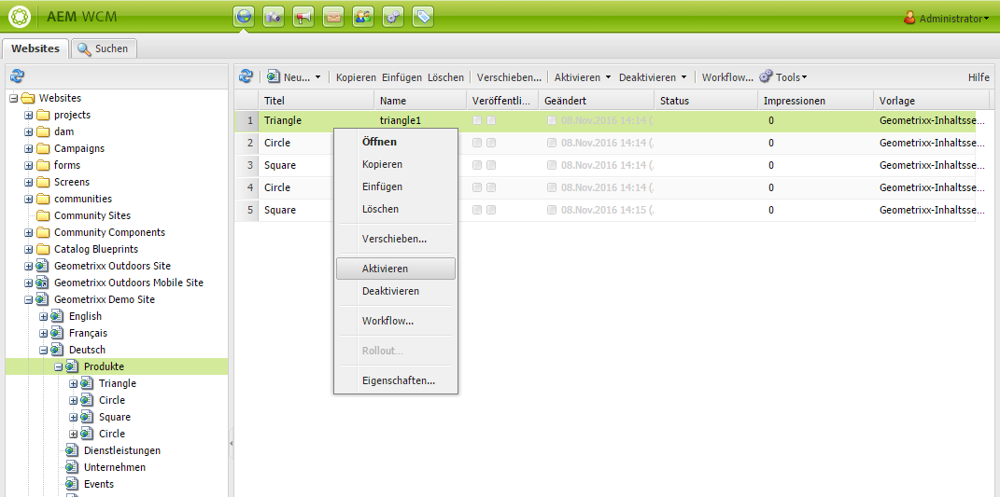
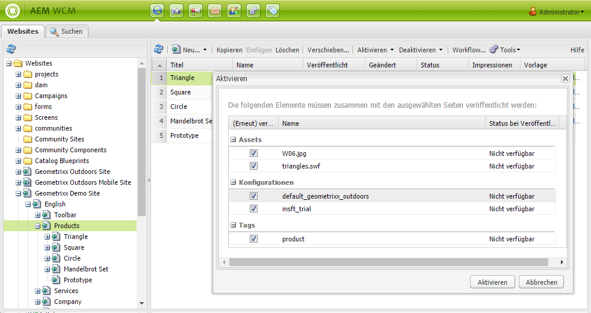
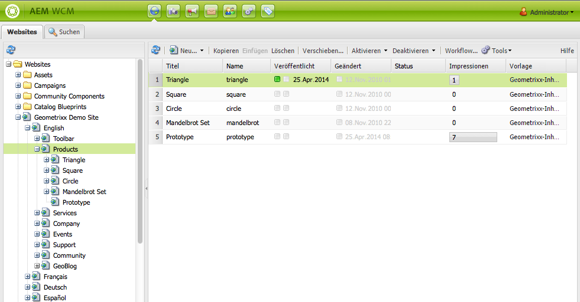
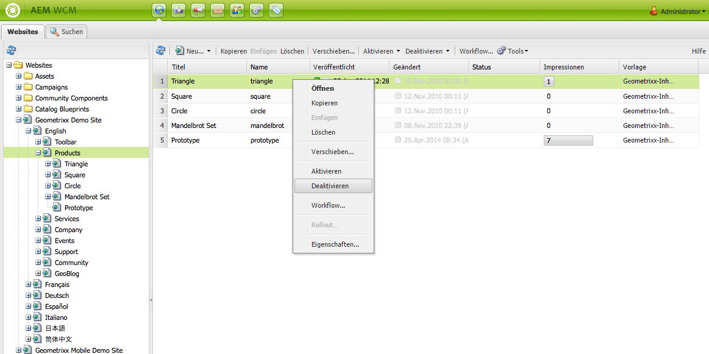
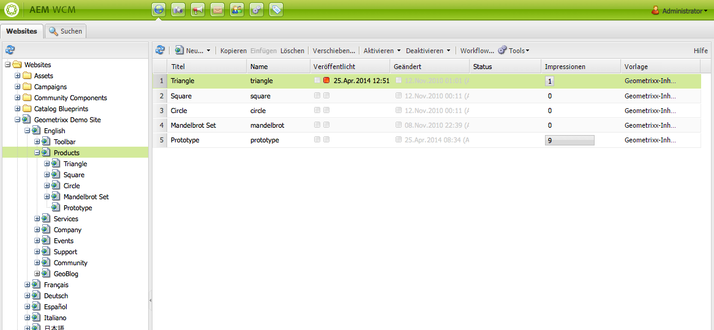
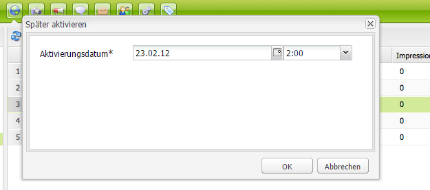
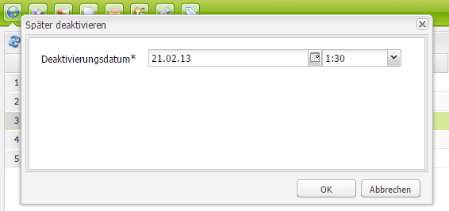
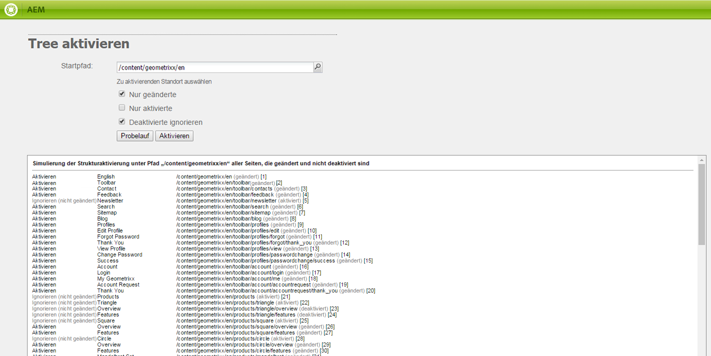

# Veröffentlichen von Seiten{#publishing-pages}

Nachdem Sie Ihren Inhalt in der Authoring-Umgebung erstellt und geprüft haben, muss dieser auf der öffentlichen Website (der Publishing-Umgebung) verfügbar gemacht werden.

Dies wird als Publishing einer Seite bezeichnet. Wenn Sie eine Seite aus der Publishing-Umgebung entfernen möchten, wird dies als Aufheben der Veröffentlichung bezeichnet. Beim „Publishing“ und „Veröffentlichung aufheben“ bleibt die Seite in der Authoring-Umgebung für weitere Änderungen verfügbar, bis Sie diese löschen.

Sie können eine Seite auch sofort oder zu einem vordefinierten Datum/Zeitpunkt in der Zukunft veröffentlichen oder die Veröffentlichungen aufheben.

>[!NOTE]
>
>Bestimmte Begriffe im Zusammenhang mit Publishing sind leicht zu verwechseln:
>
>* **Veröffentlichen/Veröffentlichung rückgängig machen**
>  Dies sind die Hauptbegriffe für die Aktionen, mit denen Sie Ihren Inhalt in Ihrer Veröffentlichungsumgebung verfügbar machen (oder dies rückgängig machen).
>
>* **Aktivieren/Deaktivieren**
>  Diese Begriffe sind Synonyme für das Veröffentlichen/Rückgängigmachen der Veröffentlichung.
>
>* **Replizieren/Replikation**
>  Dies sind technische Begriffe, die für die Verschiebung von Daten (z. B. Seiteninhalten, Dateien, Code, Benutzerkommentaren) zwischen Umgebungen verwendet werden, etwa beim Veröffentlichen oder Zurückreplizieren von Benutzerkommentaren.
>

>[!NOTE]
>
>Wenn Sie nicht über die erforderlichen Berechtigungen zum Veröffentlichen einer bestimmten Seite verfügen, dann:
>
>* wird ein Workflow ausgelöst, der die entsprechende Person über Ihre Veröffentlichungsanfrage informiert.
>* wird (für einen kurzen Zeitraum) eine Meldung angezeigt, um Sie darüber zu informieren.
>

## Veröffentlichen einer Seite {#publishing-a-page}

Für die Aktivierung einer Seite stehen zwei Methoden zur Verfügung:

* [Mit der Websites-Konsole](#activating-a-page-from-the-websites-console)
* [Mit dem Sidekick auf der Seite selbst](#activating-a-page-from-sidekick)

>[!NOTE]
>
>Mit [Tree aktivieren](#howtoactivateacompletesectiontreeofyourwebsite) in der Tools-Konsole können Sie auch eine Unterbaumstruktur mit mehreren Seiten aktivieren.

### Aktivieren einer Seite über die Websites-Konsole {#activating-a-page-from-the-websites-console}

Sie können Seiten in der Websites-Konsole aktivieren. Nachdem Sie eine Seite geöffnet und deren Inhalt geändert haben, kehren Sie zur Websites-Konsole zurück:

1. Wählen Sie in der Websites-Konsole die Seite aus, die Sie aktivieren möchten.
1. Wählen Sie **Aktivieren** aus, entweder über das obere Menü oder das Dropdown-Menü bei dem ausgewählten Seitenelement.

   Um den Inhalt einer Seite und alle zugehörigen Unterseiten zu aktivieren, verwenden Sie die [**Tools**-Konsole](/help/sites-classic-ui-authoring/classic-page-author-publish-pages.md#howtoactivateacompletesectiontreeofyourwebsite).

   

   >[!NOTE]
   >
   >Gegebenenfalls werden Sie von AEM aufgefordert, alle Assets zu aktivieren bzw. zu reaktivieren, die mit der Seite verknüpft sind. Sie können die Aktivierung der Assets steuern, indem Sie die zugehörigen Kontrollkästchen markieren bzw. die Markierung aufheben.
   >
   >

1. Gegebenenfalls werden Sie von AEM aufgefordert, alle Assets zu aktivieren bzw. zu reaktivieren, die mit der Seite verknüpft sind. Sie können die Aktivierung der Assets steuern, indem Sie die zugehörigen Kontrollkästchen markieren bzw. die Markierung aufheben.

   

1. AEM WCM aktiviert den ausgewählten Inhalt. Die veröffentlichten Seiten werden in der [Websites-Konsole](/help/sites-classic-ui-authoring/author-env-basic-handling.md#page-information-on-the-websites-console) angezeigt (grün markiert), zusammen mit Informationen darüber, wer den Inhalt aktiviert hat, sowie Datum und Uhrzeit der Aktivierung.

   

### Aktivieren einer Seite über den Sidekick {#activating-a-page-from-sidekick}

Sie können eine Seite auch aktivieren, wenn sie zur Bearbeitung geöffnet ist.

Nachdem Sie die Seite geöffnet und ihren Inhalt geändert haben, tun Sie Folgendes:

1. Wählen Sie die Registerkarte **Seite** im Sidekick aus.
1. Klicken Sie auf **Seite aktivieren**.
Oben rechts im Fenster wird eine Meldung angezeigt, die die Aktivierung der Seite bestätigt.

## Rückgängigmachen der Veröffentlichung einer Seite {#unpublishing-a-page}

Um eine Seite aus der Publishing-Umgebung zu entfernen, deaktivieren Sie den Inhalt.

So deaktivieren Sie eine Seite:

1. Wählen Sie in der Websites-Konsole die Seite aus, die Sie deaktivieren möchten.
1. Wählen Sie entweder über das obere Menü oder das Dropdown-Menü bei dem ausgewählten Seitenelement **Deaktivieren** aus. Sie werden aufgefordert, den Löschvorgang zu bestätigen.

   

1. Aktualisieren Sie die [Websites-Konsole](/help/sites-classic-ui-authoring/author-env-basic-handling.md#page-information-on-the-websites-console). Der Inhalt wird rot hervorgehoben, wodurch angezeigt wird, dass er nicht mehr veröffentlicht ist.

   

## Später aktivieren/deaktivieren {#activate-deactivate-later}

### Später aktivieren {#activate-later}

So planen Sie die Aktivierung einer Seite für einen späteren Zeitpunkt:

1. Öffnen Sie in der Websites-Konsole das Menü **Aktivieren** und wählen Sie die Option **Später aktivieren** aus.
1. Geben Sie in dem daraufhin angezeigten Dialogfeld Datum und Uhrzeit für die Aktivierung ein und klicken Sie auf **OK**. Dadurch wird eine Version der Seite erstellt, die zum angegebenen Zeitpunkt aktiviert wird.

   

Durch Auswahl der Option „Später aktivieren“ wird ein Workflow gestartet, mit dem diese Seitenversion zum angegebenen Zeitpunkt aktiviert wird. Entsprechend wird durch Auswahl der Option „Später deaktivieren“ ein Workflow gestartet, mit dem die Seitenversion zum angegebenen Zeitpunkt deaktiviert wird.

Wenn Sie diese Aktivierung/Deaktivierung später abbrechen möchten, gehen Sie zur [Workflow-Konsole](/help/sites-administering/workflows-administering.md#main-pars_title_3-yjqslz-refd), um den entsprechenden Workflow zu beenden.

### Später deaktivieren {#deactivate-later}

So planen Sie die Deaktivierung einer Seite für einen späteren Zeitpunkt:

1. Öffnen Sie in der Websites-Konsole das Menü **Deaktivieren** und wählen Sie die Option **Später deaktivieren** aus.

1. Geben Sie in dem daraufhin angezeigten Dialogfeld Datum und Uhrzeit für die Deaktivierung ein und klicken Sie auf **OK**.

   

Mit **Später deaktivieren** wird ein Workflow zur Deaktivierung der Seite zum angegebenen Zeitpunkt gestartet.

Wenn Sie diese spätere Deaktivierung abbrechen möchten, gehen Sie zur [Workflow-Konsole](/help/sites-administering/workflows-administering.md#main-pars_title_3-yjqslz-refd), um den entsprechenden Workflow zu beenden.

## Geplante Aktivierung/Deaktivierung (Einschaltzeit/Ausschaltzeit) {#scheduled-activation-deactivation-on-off-time}

Über die Optionen **Einschaltzeit** und **Ausschaltzeit** können Sie Zeiten auswählen, zu denen eine Seite veröffentlicht bzw. ihre Veröffentlichung rückgängig gemacht werden soll. Diese Optionen können in den [Seiteneigenschaften](/help/sites-classic-ui-authoring/classic-page-author-edit-page-properties.md) definiert werden.

### Bestimmen des Seitenveröffentlichungsstatus {#determining-page-publication-status-classic-ui}

Der Status wird in der [Websites-Konsole](/help/sites-classic-ui-authoring/author-env-basic-handling.md#page-information-on-the-websites-console) angezeigt. Die Farben geben den Veröffentlichungsstatus an.

## Aktivieren einer kompletten Baumstruktur Ihrer Website {#activating-a-complete-section-tree-of-your-website}

Von der Registerkarte **Websites** aus können Sie die einzelnen Seiten aktivieren. Wenn Sie allerdings eine große Anzahl von Inhaltsseiten eingegeben oder aktualisiert haben, die sich alle unterhalb derselben Stammseite befinden, kann es einfacher sein, die gesamte Baumstruktur mit einer einzigen Aktion zu aktivieren. Sie können auch einen Probelauf durchführen, um eine Aktivierung zu emulieren und hervorzuheben, welche Seiten aktiviert würden.

1. Öffnen Sie die **Tools**-Konsole, indem Sie sie auf dem **Startbildschirm** auswählen, und doppelklicken Sie dann auf **Replikation**, um die Konsole zu öffnen (`https://localhost:4502/etc/replication.html`).

   

1. Klicken Sie in der Konsole **Replikation** auf **Tree aktivieren**.

   Das folgende Fenster (`https://localhost:4502/etc/replication/treeactivation.html`) wird angezeigt.

   

1. Geben Sie den **Startpfad** ein. Dies ist der Pfad zum Stammverzeichnis des Abschnitts, den Sie aktivieren (veröffentlichen) möchten. Diese Seite und alle darunter liegenden Seiten werden bei der Aktivierung (bzw. bei der Emulation, falls ein Probelauf ausgewählt wurde) berücksichtigt.
1. Aktivieren Sie die Auswahlkriterien nach Bedarf:

   * **Nur geänderte**: nur Seiten aktivieren, die geändert wurden.
   * **Nur aktivierte**: nur Seiten aktivieren, die bereits vorher aktiviert waren. Dies stellt eine Art von Reaktivierung dar.
   * **Deaktivierte ignorieren**: alle deaktivierten Seiten ignorieren.

1. Wählen Sie die Aktion aus, die Sie durchführen möchten:

   1. Wählen Sie **Probelauf** aus, wenn Sie überprüfen möchten, welche Seiten aktiviert *würden*. Dabei handelt es sich lediglich um eine Emulation, bei der keine Seiten tatsächlich aktiviert werden.

   1. Wählen Sie **Aktivieren** aus, wenn die Seiten aktiviert werden sollen.
