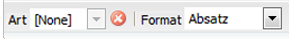
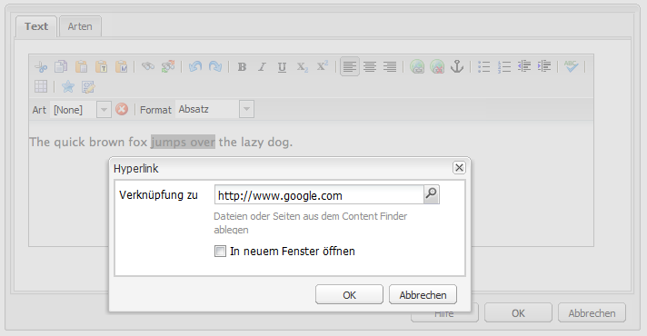

# Rich-Text-Editor {#rich-text-editor}

Der Rich-Text-Editor ist ein grundlegendes Mittel für die Eingabe von Textinhalten in AEM. Im Editor können die folgenden Komponenten erstellt werden:

* Text
* Textbild
* Tabelle

## Rich-Text-Editor {#rich-text-editor-1}

Das Editor-Dialogfeld arbeitet nach dem WYSIWYG-Prinzip und bietet eine Vielzahl von Funktionen.

>[!NOTE]
>
>Welche Features verfügbar sind, richtet sich nach dem jeweiligen Projekt, Ihre spezielle Installation kann also Abweichungen aufweisen.

## Bearbeiten im Kontext {#in-place-editing}

Zusätzlich zu der Bearbeitung in Dialogfeldern durch den Rich-Text-Editor bietet AEM noch die Möglichkeit einer Bearbeitung im Kontext, bei der Sie den Text so bearbeiten, wie er im Layout der Seite erscheint.

Klicken Sie zwei Mal langsam auf einen Absatz (kein Doppelklick), um die Bearbeitung im Kontext zu starten. Der Rahmen der Komponente wird nun orange dargestellt.

Sie können nun den Text direkt auf der Seite bearbeiten, anstatt ein Dialogfenster aufrufen zu müssen. Alle Änderungen werden sofort automatisch gespeichert.

>[!NOTE]
>
>Wenn der Content Finder geöffnet ist, wird oben auf der Registerkarte eine Symbolleiste mit den RTE-Formatierungsoptionen angezeigt (siehe oben).
>
>Wenn der Content Finder nicht geöffnet ist, wird die Symbolleiste nicht angezeigt.

Derzeit ist die Bearbeitung im Kontext für Seitenelemente möglich, die durch die Komponenten **Text** und **Titel** erzeugt wurden.

>[!NOTE]
>
>Die [!UICONTROL Titel]-Komponente wurde konzipiert, um kurzen Text ohne Zeilenumbrüche zu enthalten. Wenn Sie einen Titel im kontextbasierten Bearbeitungsmodus bearbeiten, wird durch Einfügen eines Zeilenumbruchs eine neue **Text**-Komponente unter dem Titel geöffnet.

## Funktionen des Rich-Text-Editors  {#features-of-the-rich-text-editor}

Der Rich-Text-Editor bietet eine Reihe von Funktionen, diese [hängen von der Konfiguration](/help/sites-administering/rich-text-editor.md) der einzelnen Komponente ab. Die Funktionen sind sowohl für die Touch-optimierte als auch für die klassische Benutzeroberfläche verfügbar.

### Grundlegende Zeichenformate {#basic-character-formats}

Hier können Sie Formatierungen auf ausgewählte (markierte) Zeichen anwenden, für einige Optionen gibt es auch Tastaturkürzel:

* Fett (Strg+B)
* Kursiv (Strg+I)
* Unterstrichen (Strg+U)
* Tiefgestellt
* Hochgestellt

Alle Funktionen arbeiten als Schalter, wenn Sie also erneut darauf klicken, wird die Formatierung wieder entfernt.

### Vordefinierte Stile und Formate  {#predefined-styles-and-formats}

Ihre Installation kann außerdem vordefinierte Stile und Formate aufweisen, die in den Dropdownlisten **[!UICONTROL Art]** (also Stil) und **[!UICONTROL Format]** zur Verfügung stehen und auf von Ihnen ausgewählten Text angewendet werden können.

Ein Stil kann auf eine bestimmte Zeichenfolge angewendet werden (ein Stil ist CSS-basiert).

Ein Format hingegen wird auf einen gesamt Textabsatz angewendet (Format sind HTML-basiert):

Ein spezifisches Format kann nur geändert werden (der Standardwert lautet **[!UICONTROL Absatz]**).

Ein Stil kann entfernt werden. Platzieren Sie dafür den Cursor innerhalb des Textes, auf den der Stil angewendet wurde, und klicken Sie dann auf das Löschsymbol:

>[!CAUTION]
>
>Markieren Sie keine Textbereiche in dem Text, auf den der Stil angewendet wurde, da ansonsten das Symbol nicht verfügbar ist.

### Ausschneiden, Kopieren, Einfügen  {#cut-copy-paste}

Die Standardfunktionen **[!UICONTROL Ausschneiden]** und **[!UICONTROL Kopieren]** stehen zur Verfügung. Verschiedene Optionen für **[!UICONTROL Einfügen]** erleichtern die Arbeit mit unterschiedlichen Formaten.

* Ausschneiden (Strg+X)
* Kopieren (Strg-C)
* Einfügen
Dies ist der standardmäßige Einfügemechanismus (Strg+V) für die Komponente. Wenn Sie vorkonfiguriert installiert haben, ist dies auf [!UICONTROL Aus Word einfügen] konfiguriert.

* Als Text einfügen: Entfernt alle Stile und Formatierungen, um nur den Nur-Text einzufügen.

* Aus Word einfügen: Dadurch wird der Inhalt als HTML eingefügt (mit einigen erforderlichen Neuformatierungen).

### Rückgängig/Wiederholen {#undo-redo}

AEM speichert die jeweils letzten 50 Aktionen in der aktuellen Komponente in chronologischer Reihenfolge. Diese Aktionen können ggf. rückgängig gemacht werden, aber nur in der Reihenfolge ihrer Durchführung.

>[!CAUTION]
>
>Der Bearbeitungsverlauf wird nur für die aktuelle Bearbeitungssitzung beibehalten. Er wird jedes Mal neu erstellt, wenn Sie die Komponente zur Bearbeitung öffnen.

>[!NOTE]
>
>Standardmäßig sind fünfzig Aktionen vorgesehen. Die Anzahl kann bei Ihrer Installation abweichen.

### Ausrichtung {#alignment}

Text kann entweder linksbündig, mittig oder rechtsbündig ausgerichtet sein.

### Einzug {#indentation}

Der Einzug eines Absatzes kann erhöht oder verringert werden. Der ausgewählte Absatz wird eingerückt und jeder weitere eingegebene Text behält diesen Einzug bei.

### Listen {#lists}

Sie können sowohl Stichpunkt- als auch nummerierte Listen im Text erstellen. Wählen Sie entweder den Listentyp und geben Sie die Listenpunkte ein oder markieren Sie zuerst den umzuwandelnden Text. In beiden Fällen führt ein Zeilenwechsel dazu, dass ein neuer Listenpunkt erstellt wird.

Verschachtelte Listen lassen sich durch Einrücken eines oder mehrerer Listenpunkte erstellen.

Der Stil der Liste kann einfach dadurch geändert werden, dass Sie den Cursor innerhalb der Liste platzieren und einen anderen Stil wählen. Außerdem kann eine Unterliste einen anderen Stil aufweisen als die übergeordnete Liste. Dieser Stil kann angewendet werden, sobald Sie die Unterliste (durch Einrücken) erstellt haben.

### Links {#links}

Ein Link zu einer URL (entweder innerhalb Ihrer Website oder an einer externen Position) wird durch Hervorhebung des erforderlichen Texts und anschließendes Klicken auf das Hyperlink-Symbol generiert:

Daraufhin wird ein Dialogfeld angezeigt, in dem Sie die Ziel-URL angeben können, außerdem ob sie in einem neuen Fenster geöffnet werden soll.

Sie haben folgende Möglichkeiten:

* Direktes Eingeben eines URI
* Verwenden Sie die Sitemap, um eine Seite innerhalb Ihrer Website auszuwählen.
* Geben Sie den URI ein und hängen Sie dann den Zielanker an. z. B. `www.TargetUri.org#AnchorName`
* Geben Sie nur einen Anker ein (um auf &quot;die aktuelle Seite&quot;zu verweisen). Beispiel: `#anchor`
* Suchen Sie im Content Finder nach einer Seite und ziehen Sie dann das Seitensymbol in das Dialogfeld &quot;Hyperlink&quot;.

>[!NOTE]
>
>Der URI kann jedes der Protokolle vorangestellt werden, die für die jeweilige Installation konfiguriert sind. In einer Standardinstallation sind dies `https://`, `ftp://` und `mailto:`. Protokolle, die nicht für die jeweilige Installation konfiguriert sind, werden zurückgewiesen und als ungültig markiert.

Um den Hyperlink zu entfernen, klicken Sie auf eine beliebige Stelle innerhalb des Link-Texts und klicken Sie auf das Symbol[!UICONTROL Verknüpfung aufheben]:

### Anker {#anchors}

Ein Anker kann an einer beliebigen Stelle des Texts erstellt werden, indem Sie entweder den Cursor an diese Stelle setzen oder einen Textbereich markieren. Klicken Sie dann auf das Symbol **Anker**, um das Dialogfeld zu öffnen.

Geben Sie einen Namen für den Anker ein und klicken Sie auf **OK**, um die Änderung zu speichern.

Der Anker wird beim Bearbeiten der Komponente angezeigt und kann nun als Sprungziel für Links verwendet werden.

### Suchen und Ersetzen {#find-and-replace}

AEM enthält die Funktion **Suchen** und die Funktion **Ersetzen** („Suchen und Ersetzen“).

Bei beiden Funktionen ermöglicht die Schaltfläche **Weitersuchen** die Suche nach dem angegebenen Text innerhalb der geöffneten Komponente. Sie können außerdem angeben, ob Groß-/Kleinschreibung beachtet werden soll.

Die Suche startet immer an der aktuellen Cursorposition im Text. Wird das Ende der Komponente erreicht, erhalten Sie eine Meldung, dass der Vorgang ab dem Beginn der Komponente fortgesetzt wird.

Mit der Option **Ersetzen** können Sie **Suchen** und dann **Ersetzen** auf eine einzelne Instanz des angegebenen Texts oder **Alles ersetzen** auf alle Instanzen des angegebenen Texts innerhalb der aktuellen Komponente anwenden.

### Bilder {#images}

Bilder können aus dem Content Finder gezogen und in den Text eingefügt werden.

>[!NOTE]
>
>AEM bietet auch spezielle Komponenten für eine detailliertere Bildkonfiguration. Beispielsweise stehen Ihnen die Komponenten **Bild** und **Textbild** zur Verfügung.

### Rechtschreibprüfung {#spelling-checker}

Die Rechtschreibprüfung überprüft den gesamten Text innerhalb der aktuellen Komponente.

Alle falschen Schreibweisen werden hervorgehoben:

>[!NOTE]
>
>Die Rechtschreibprüfung erfolgt in der Sprache der Website. Dazu wird entweder die Spracheigenschaft der Unterstruktur übernommen oder die Sprache aus der URL extrahiert. Beispielsweise erfolgt die Prüfung für den Zweig `en` in Englisch und für den Zweig `de` in Deutsch.

### Tabellen {#tables}

Tabellen können auf zwei Arten eingefügt werden:

* Als Komponente **Tabelle**

   

* Innerhalb der Komponente **Text**

   

   >[!NOTE]
   >
   >Obwohl Tabellen im RTE verfügbar sind, wird empfohlen, beim Erstellen von Tabellen die Komponente **Tabelle** zu verwenden.

Sowohl in der Komponente **Text** als auch in der Komponente **Tabelle** sind die Tabellenoptionen über das Kontextmenü verfügbar, das in der Regel durch Klicken mit der rechten Maustaste auf die Tabelle aufgerufen wird. Beispiel:

>[!NOTE]
>
>In der Komponente **Tabelle** ist außerdem eine spezielle Werkzeugleiste verfügbar, die neben den Standard-Funktionen für die Bearbeitung von Rich-Text auch eine Untergruppe tabellenspezifischer Funktionen enthält.

Dies sind die tabellenspezifischen Funktionen:

* [Tabelleneigenschaften](#table-properties)
* [Zellen-Eigenschaften](#cell-properties)
* [Zeilen hinzufügen oder löschen](#add-or-delete-rows)
* [Spalten hinzufügen oder löschen](#add-or-delete-columns)
* [Ganze Zeilen oder Spalten auswählen](#selecting-entire-rows-or-columns)
* [Zellen verbinden](#merge-cells)
* [Zellen teilen](#split-cells)
* [Verschachtelte Tabellen](#creating-nested-tables)
* [Tabelle entfernen](#remove-table)

#### Table Properties {#table-properties}

Sie können die grundlegenden Eigenschaften der Tabelle angeben und dann auf **OK** klicken, um die Angaben zu speichern:

* **Breite**: Die Gesamtbreite der Tabelle.

* **Höhe**: Die Gesamthöhe der Tabelle.

* **Rahmen**: Die Größe des Tabellenrahmens.

* **Zellauffüllung**: Dadurch wird der Leerraum zwischen dem Zelleninhalt und den Rändern definiert.

* **Zellenabstand**: Dies definiert den Abstand zwischen den Zellen.

>[!NOTE]
>
>Einige Zelleneigenschaften wie Breite und Höhe können als Pixel oder Prozentwerte definiert werden.

>[!CAUTION]
>
>Adobe empfiehlt, eine Tabellenbreite zu definieren.

#### Zellen-Eigenschaften {#cell-properties}

Die Eigenschaften einer Zelle bzw. einer Reihe von Zellen können konfiguriert werden:

* **Breite**
* **Höhe**
* **Horizontale Ausrichtung**  - Links, Mitte oder Rechts
* **Vertikale Ausrichtung**  - oben, Mitte, unten oder Grundlinie
* **Zellentyp** - Daten oder Kopfzeile
* **Anwenden auf:** Einzelne Zelle, gesamte Zeile, gesamte Spalte

#### Zeilen hinzufügen oder löschen {#add-or-delete-rows}

Zeilen können entweder über oder unter der aktuellen Zeile eingefügt werden.

Die aktuelle Zeile kann außerdem gelöscht werden.

#### Spalten hinzufügen oder löschen  {#add-or-delete-columns}

Spalten können entweder links oder rechts von der aktuellen Spalte eingefügt werden.

Die aktuelle Spalte kann außerdem gelöscht werden.

#### Ganze Zeilen oder Spalten auswählen  {#selecting-entire-rows-or-columns}

Dadurch wird die gesamte Zeile bzw. Spalte ausgewählt. Dann sind bestimmte Aktionen (z. B. „Zusammenführen“) verfügbar.

#### Zellen verbinden {#merge-cells}

 

* Wenn Sie eine Gruppe von Zellen ausgewählt haben, können Sie sie zu einer einzigen Zelle zusammenführen.
* Wenn Sie nur eine Zelle ausgewählt haben, können Sie diese Zelle mit der Zelle rechts davon oder der Zelle unterhalb davon zusammenführen.

#### Zellen teilen  {#split-cells}

Einzelne Zelle auswählen und teilen 

* Durch die horizontale Teilung einer Zelle wird eine neue Zelle rechts von der aktuellen Zelle und innerhalb der aktuellen Spalte eingefügt.
* Durch die vertikale Teilung einer Zelle wird eine neue Zelle unterhalb der aktuellen Zelle und innerhalb der aktuellen Zeile eingefügt.

#### Erstellen verschachtelter Tabellen  {#creating-nested-tables}

Durch Erstellen einer verschachtelten Tabelle wird eine neue separate Tabelle innerhalb der aktuellen Zelle eingefügt.

>[!NOTE]
>
>Bestimmte weitere Optionen sind browserabhängig.
>
>* Windows IE: Verwenden Sie Strg+primäre Maustaste (in der Regel linke Maustaste) zur Auswahl mehrerer Zellen.
>* Firefox: Ziehen Sie den Mauszeiger, um einen Zellenbereich auszuwählen.

#### Remove Table {#remove-table}

Verwenden Sie die Option, um die Tabelle aus der Komponente **[!UICONTROL Text]** zu entfernen.

### Sonderzeichen {#special-characters}

Je nach Installation können in Ihrem Rich-Text-Editor auch Sonderzeichen verfügbar sein.

Halten Sie den Mauszieger über ein bestimmtes Zeichen, um eine vergrößerte Vorschau anzuzeigen, und klicken Sie dann darauf, um es an der aktuellen Position in den Text einzufügen.

### Quellbearbeitungsmodus  {#source-editing-mode}

Im Quellbearbeitungsmodus können Sie den HTML-Code, der der aktuellen Komponente zugrunde liegt, anzeigen und bearbeiten.

Betrachten Sie z. B. folgenden Text:

Im Quellmodus hat nimmt dieser Text folgende Gestalt an (oft ist der HTML-Quelltext wesentlich länger und Sie müssen einen Bildlauf durchführen):

>[!CAUTION]
>
>Beim Verlassen des Quellmodus führt AEM bestimmte Prüfungen durch (z. B. ob der Text ordnungsgemäß in Blöcken enthalten bzw. verschachtelt ist). Dies kann zu Änderungen an den Bearbeitungen führen.
