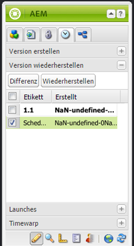
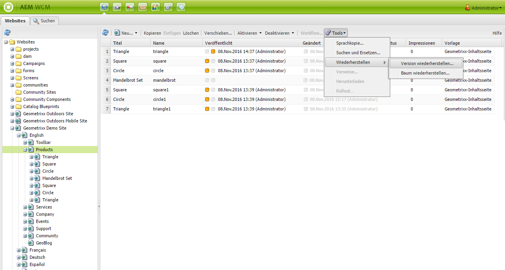
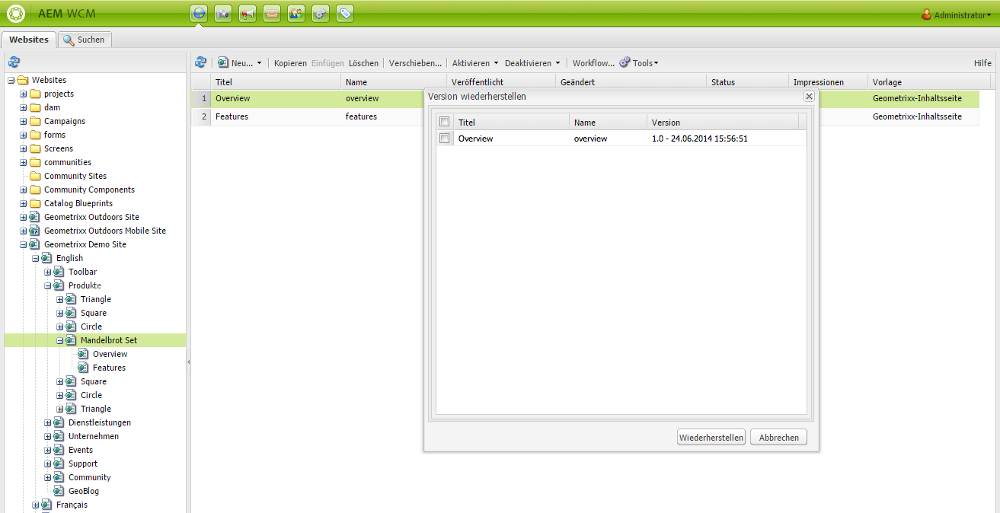
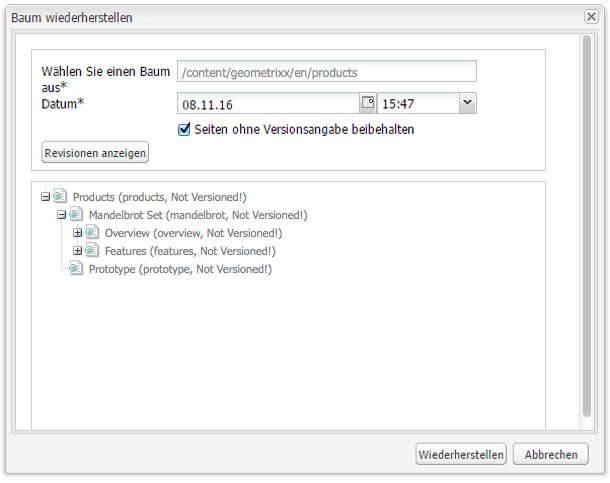
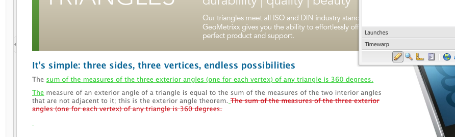
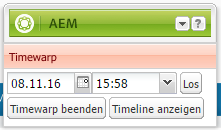
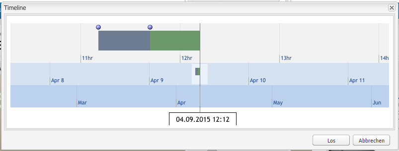
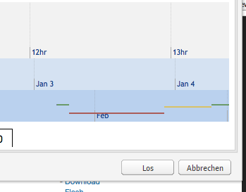

# Arbeiten mit Seitenversionen{#working-with-page-versions}

Durch die Versionierung wird die „Momentaufnahme“ einer Seite zu einem bestimmten Zeitpunkt festgehalten. Bei der Versionierung sind die folgenden Aktionen verfügbar:

* Erstellen einer Version einer Seite
* Wiederherstellen einer früheren Seitenversion, um z. B. eine Änderung rückgängig zu machen
* Vergleichen der aktuellen Version einer Seite mit einer früheren Version, wobei die Unterschiede in Text und Bildern hervorgehoben sind

## Erstellen einer neuen Version    {#creating-a-new-version}

So erstellen Sie die neue Version einer Seite:

1. Öffnen Sie im Browser die Seite, für die eine neue Version erstellt werden soll.
1. Wählen Sie im Sidekick die Registerkarte **Versionierung** und dann die Unter-Registerkarte **Version erstellen**.

   

1. Geben Sie einen **Kommentar** ein (optional).
1. Um eine Bezeichnung für die Version festzulegen (optional), klicken Sie auf die Schaltfläche **Mehr >>** und legen Sie die **Beschriftung** fest, um die Version zu benennen. Wenn der Titel nicht festgelegt ist, ist die Version eine automatisch inkrementierte Zahl.
1. Klicken Sie auf **Version erstellen**. Auf der Seite wird eine grau hinterlegte Nachricht eingeblendet, z. B.:
Version 1.2 erstellt für: Hemden.

>[!NOTE]
>
>Eine Version wird automatisch bei Aktivierung einer Seite erstellt.

## Wiederherstellen einer Seitenversion über den Sidekick  {#restoring-a-page-version-from-sidekick}

So stellen Sie die frühere Version einer Seite wieder her:

1. Öffnen Sie die Seite, für die Sie eine frühere Version wiederherstellen möchten.
1. Wählen Sie im Sidekick die Registerkarte **Versionierung** und dann die Unter-Registerkarte **Version wiederherstellen** aus.

   

1. Wählen Sie die Version, die Sie wiederherstellen möchten, und wählen Sie **Wiederherstellen**.

## Wiederherstellen einer Seitenversion über die Konsole {#restoring-a-page-version-from-the-console}

Sie können diese Methode verwenden, um eine Seitenversion wiederherzustellen. Sie können sie außerdem verwenden, um Seiten wiederherzustellen, die gelöscht wurden.

1. Navigieren Sie in der Konsole **Websites** zu der wiederherzustellenden Seite und wählen Sie diese aus.
1. Wählen Sie im oberen Menü die Optionen **Tools** und dann **Wiederherstellen** aus:

   

1. Wenn Sie **Version wiederherstellen...** auswählen, werden die Versionen der Dokumente im aktuellen Ordner aufgelistet. Auch wenn eine Seite gelöscht wurde, wird ihre letzte Version aufgeführt:

   

1. Wählen Sie die Version, die Sie wiederherstellen möchten, und wählen Sie **Wiederherstellen**. AEM stellt die Version(en) bzw. den Baum/die Bäume wieder her, die Sie ausgewählt haben.

### Wiederherstellen einer Baumstruktur über die Konsole  {#restoring-a-tree-from-the-console}

Sie können diese Methode verwenden, um eine Seitenversion wiederherzustellen. Sie können sie außerdem verwenden, um Seiten wiederherzustellen, die gelöscht wurden.

1. Navigieren Sie in der Konsole **Websites** zu dem wiederherzustellenden Ordner und wählen Sie ihn aus.
1. Wählen Sie im oberen Menü die Optionen **Tools** und dann **Wiederherstellen** aus:
1. Wenn Sie **Baum wiederherstellen...** auswählen, wird ein Dialogfeld geöffnet, in dem Sie den wiederherzustellenden Baum auswählen können:

   

1. Klicken Sie auf **Wiederherstellen**. AEM stellt den ausgewählten Baum wieder her.

## Vergleichen mit einer früheren Version {#comparing-with-a-previous-version}

So vergleichen Sie die aktuelle Version einer Seite mit einer früheren Version:

1. Öffnen Sie im Browser die Seite, die mit einer früheren Version verglichen werden soll.
1. Wählen Sie im Sidekick die Registerkarte **Versionierung** und dann die Unterregisterkarte **Version wiederherstellen** n aus.

   

1. Markieren Sie die Version, die Sie vergleichen möchten, und klicken Sie auf die Schaltfläche **Differenz**.
1. Die Unterschiede zwischen der aktuellen Version und der ausgewählten Version werden wie folgt angezeigt:

   * Gelöschter Text wird rot und durchgestrichen angezeigt.
   * Hinzugefügter Text wird grün und hervorgehoben angezeigt.
   * Bilder, die hinzugefügt oder gelöscht wurden, werden grün umrahmt angezeigt.

   

1. Wählen Sie im Sidekick die Unter-Registerkarte **Version wiederherstellen** aus und klicken Sie auf **&lt;&lt;Zurück**, um die aktuelle Version anzuzeigen.

## Timewarp  {#timewarp}

Timewarp ist eine Funktion, die den ***Veröffentlichungsstatus*** einer Seite zu einer bestimmten Zeit in der Vergangenheit simuliert.

Ziel ist es, Ihnen die Nachverfolgung der veröffentlichten Website zu einem bestimmten Zeitpunkt zu ermöglichen. Hierbei werden die Seitenaktivierungen verwendet, um den Status der Veröffentlichungsumgebung zu ermitteln.

Gehen Sie hierfür wie folgt vor:

* Das System sucht die Seitenversion, die zum gewählten Zeitpunkt aktiv war.
* Dies bedeutet, dass die angezeigte Version *vor* dem in Timewarp ausgewählten Zeitpunkt erstellt/aktiviert wurde.
* Wenn Sie zu einer inzwischen gelöschten Seite navigieren, wird diese ebenfalls wiedergegeben, sofern die alten Versionen der Seite nach wie vor im Repository verfügbar sind.
* Wenn keine veröffentlichte Version gefunden wird, kehrt Timewarp zum aktuellen Status der Seite in der Autorenumgebung zurück (dadurch wird eine Fehler/404-Seite vermieden, die dazu führen würde, dass Sie nicht weiterbrowsen können).

>[!NOTE]
>
>Wenn Versionen aus dem Repository entfernt wurden, kann Timewarp die korrekte Ansicht nicht anzeigen. Außerdem unterscheidet sich die Ansicht von der ursprünglichen Ansicht, wenn Elemente (Code, CSS, Bilder usw.) für die Anzeige der Website geändert wurden, da diese Elemente nicht im Repository versioniert werden.

### Verwenden des Timewarp-Kalenders  {#using-the-timewarp-calendar}

Timewarp ist im Sidekick verfügbar.

Die Kalenderversion wird verwendet, wenn Sie einen bestimmten Tag anzeigen möchten.

1. Öffnen Sie die Registerkarte **Versionierung** und klicken Sie auf **Timewarp** (unten im Sidekick). Das folgende Dialogfeld wird angezeigt.

   

1. Legen Sie über die Datum- und Uhrzeitauswahl das gewünschte Datum und die gewünschte Uhrzeit fest und klicken Sie auf **Los**.

   Timewarp zeigt die Seite in dem Status, in dem sie vor/an dem gewählten Datum veröffentlicht war.

   >[!NOTE]
   >
   >Timewarp funktioniert nur dann vollständig, wenn Sie die Seite zuvor veröffentlicht haben. Andernfalls zeigt Timewarp die aktuelle Seite in der Autorenumgebung.

   >[!NOTE]
   >
   >Wenn Sie zu einer inzwischen aus dem Repository gelöschten Seite navigieren, wird diese ebenfalls korrekt wiedergegeben, sofern die alten Versionen der Seite nach wie vor im Repository verfügbar sind.

   >[!NOTE]
   >
   >Sie können die alte Version der Seite nicht bearbeiten. Sie kann nur angezeigt werden. Wenn Sie die ältere Version wiederherstellen möchten, müssen Sie dies über [Wiederherstellen](/help/sites-classic-ui-authoring/classic-page-author-work-with-versions.md#restoring-a-page-version-from-sidekick) manuell ausführen.

1. Wenn Sie die Seite wieder verlassen möchten, klicken Sie auf eine der folgenden Optionen:

   * Mit **Timewarp beenden** verlassen Sie Timewarp und kehren zur aktuellen Autorenseite zurück.
   * [Timeline anzeigen](#using-the-timewarp-timeline), um die Timeline anzuzeigen.

   

### Verwenden der Timewarp-Timeline {#using-the-timewarp-timeline}

Die Timeline-Version wird verwendet, wenn Sie eine Übersicht über die Veröffentlichungsaktivitäten auf der Seite anzeigen möchten.

Wenn Sie die Timeline im Dokument anzeigen möchten:

1. Sie können die Timeline wie folgt anzeigen:

   1. Öffnen Sie die Registerkarte **Versionierung** und klicken Sie auf **Timewarp** (unten im Sidekick).

   1. Über das Sidekick-Dialogfeld, das nach [der Verwendung des Timewarp-Kalenders angezeigt wird](#using-the-timewarp-calendar).

1. Klicken Sie auf **Timeline anzeigen**, die Timeline des Dokuments wird angezeigt. Beispiel:

   

1. Wählen und verschieben Sie (durch Gedrückthalten und Ziehen) die Timeline, um sich durch die Timeline des Dokuments zu bewegen.

   * Jede Linie steht für eine veröffentlichte Version.
Wenn eine Seite aktiviert wird, beginnt eine neue Linie. Jedes Mal, wenn das Dokument bearbeitet wird, wird eine neue Farbe angezeigt.
Im Beispiel unten zeigt die rote Linie an, dass die Seite während des Zeitraums der ursprünglichen grünen Version bearbeitet wurde, und die gelbe Linie zeigt an, dass die Seite während der roten Version bearbeitet wurde usw.

   

1. Klicken Sie auf:

   1. **Los**, um den Inhalt der veröffentlichten Seite zum ausgewählten Zeitpunkt anzuzeigen.
   1. Wenn der Inhalt angezeigt wird, verwenden Sie **Timewarp beenden**, um Timewarp zu verlassen und zur aktuellen Autorenseite zurückzukehren.

### Timewarp-Beschränkungen {#timewarp-limitations}

Timewarp versucht, eine Seite zu einem bestimmten Zeitpunkt zu reproduzieren. Aufgrund der Komplexität der kontinuierlichen Bearbeitung von Inhalten in AEM ist dies jedoch nicht immer möglich. Diese Einschränkungen sollten bei der Verwendung von Timewarp beachtet werden.

* **Timewarp funktioniert auf veröffentlichten Seiten**: Timewarp funktioniert nur dann vollständig, wenn Sie die Seite bereits veröffentlicht haben. Andernfalls zeigt Timewarp die aktuelle Seite in der Autorenumgebung.
* **Timewarp verwendet Seitenversionen**: Wenn Sie zu einer inzwischen aus dem Repository gelöschten Seite navigieren, wird diese ebenfalls korrekt wiedergegeben, sofern die alten Versionen der Seite nach wie vor im Repository verfügbar sind.
* **Entfernte Versionen wirken sich auf Timewarp**: Wenn Versionen aus dem Repository entfernt wurden, kann Timewarp die korrekte Ansicht nicht anzeigen.

* **Timewarp ist schreibgeschützt**: Sie können die alte Version der Seite nicht bearbeiten. Sie kann nur angezeigt werden. Wenn Sie die ältere Version wiederherstellen möchten, müssen Sie dies über [Wiederherstellen](#main-pars-title-1) manuell ausführen.

* **Timewarp basiert nur auf dem Seiteninhalt**: Die Ansicht unterscheidet sich von der ursprünglichen Ansicht, wenn Elemente (Code, CSS, Assets/Bilder usw.) für die Anzeige der Website geändert wurden, da diese Elemente nicht im Repository versioniert werden.

>[!CAUTION]
>
>Timewarp wurde als Tool entwickelt, um Autoren beim Verstehen und Erstellen ihrer Inhalte zu unterstützen. Es ist nicht als Prüfprotokoll oder zu rechtlichen Zwecken gedacht.
