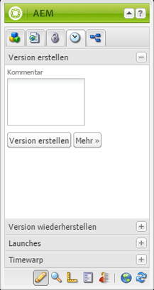
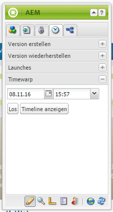

# Arbeiten mit Seitenversionen{#working-with-page-versions}

Durch die Versionierung wird die „Momentaufnahme“ einer Seite zu einem bestimmten Zeitpunkt festgehalten. Bei der Versionierung können Sie die folgenden Aktionen durchführen:

* Erstellen einer Version einer Seite.
* Wiederherstellen einer früheren Version einer Seite, damit Sie eine Änderung rückgängig machen können, die Sie an einer Seite vorgenommen haben.
* Vergleichen Sie anhand von hervorgehobenen Unterschieden in Text und Bildern die aktuelle Version einer Seite mit einer früheren Version.

## Erstellen einer Version {#creating-a-new-version}

So erstellen Sie eine Seitenversion:

1. Öffnen Sie in Ihrem Browser die Seite, für die Sie eine Version erstellen möchten.
1. Wählen Sie auf der Sidekick die **Versionierung** Registerkarte, dann die **Version erstellen** unterregistrieren.

   

1. Geben Sie einen **Kommentar** ein (optional).
1. Um eine Bezeichnung für die Version anzugeben (optional), klicken Sie auf die Schaltfläche **Mehr >>** und geben Sie unter **Bezeichnung** einen Namen für die Version ein. Wird keine Bezeichnung festgelegt, wird die Version automatisch nummeriert.
1. Klicken Sie auf **Version erstellen**. Auf der Seite wird eine grau unterlegte Meldung angezeigt, z. B.: Version 1.2 erstellt für: Hemden.

>[!NOTE]
>
>Eine Version wird automatisch bei Aktivierung einer Seite erstellt.

## Wiederherstellen einer Seitenversion über den Sidekick {#restoring-a-page-version-from-sidekick}

So können Sie die Seite in einer früheren Version wiederherstellen:

1. Öffnen Sie die Seite, für die Sie eine frühere Version wiederherstellen möchten.
1. Wählen Sie im Sidekick die **Versionierung** Registerkarte, dann die **Version wiederherstellen** unterregistrieren.

   

1. Wählen Sie die Version aus, die Sie wiederherstellen möchten, und wählen Sie **Wiederherstellen**.

## Wiederherstellen einer Seitenversion über die Konsole {#restoring-a-page-version-from-the-console}

Sie können diese Methode verwenden, um eine Seitenversion wiederherzustellen. Sie kann auch verwendet werden, um zuvor gelöschte Seiten wiederherzustellen:

1. Navigieren Sie in der Konsole **Websites** zu der Seite, die Sie wiederherstellen möchten, und wählen Sie diese aus.
1. Wählen Sie im oberen Menü **Instrumente**, dann **Wiederherstellen**:

   

1. Wenn Sie **Version wiederherstellen...** auswählen, werden die Versionen der Dokumente im aktuellen Ordner aufgelistet. Selbst wenn eine Seite gelöscht wurde, wird die letzte Version aufgelistet:

   

1. Wählen Sie die wiederherzustellende Version aus und klicken Sie auf **Wiederherstellen**. AEM stellt die ausgewählten Versionen (bzw. Bäume) wieder her.

### Wiederherstellen einer Baumstruktur über die Konsole {#restoring-a-tree-from-the-console}

Sie können diese Methode verwenden, um eine Seitenversion wiederherzustellen. Sie kann auch verwendet werden, um zuvor gelöschte Seiten wiederherzustellen:

1. Navigieren Sie in der Konsole **Websites** zu dem Ordner, den Sie wiederherstellen möchten, und wählen Sie ihn aus.
1. Wählen Sie im oberen Menü **Instrumente**, dann **Wiederherstellen**.
1. Auswählen **Baum wiederherstellen...** öffnet das Dialogfeld, in dem Sie die Struktur auswählen können, die Sie wiederherstellen möchten:

   

1. Klicken Sie auf **Wiederherstellen**. AEM stellt den ausgewählten Baum wieder her.

## Vergleich mit einer früheren Version {#comparing-with-a-previous-version}

So vergleichen Sie die aktuelle Version einer Seite mit einer früheren Version:

1. Öffnen Sie in Ihrem Browser die Seite, für die Sie einen Vergleich mit einer früheren Version vornehmen möchten.
1. Wählen Sie auf der Sidekick die **Versionierung** Registerkarte, dann die **Version wiederherstellen** n Untertab.

   

1. Wählen Sie die Version aus, die Sie vergleichen möchten, und klicken Sie auf die **Diff** Schaltfläche.
1. Die Unterschiede zwischen der aktuellen Version und der ausgewählten Version werden wie folgt dargestellt:

   * Gelöschter Text wird rot und durchgestrichen angezeigt.
   * Hinzugefügter Text wird grün und hervorgehoben angezeigt.
   * Bilder, die hinzugefügt oder gelöscht wurden, werden grün umrahmt angezeigt.

   

1. Wählen Sie auf der Sidekick die **Version wiederherstellen** und klicken Sie auf **&lt;&lt;back span=&quot;&quot; id=&quot;3&quot; translate=&quot;no&quot; /> -Schaltfläche, um die aktuelle Version anzuzeigen.**

## Timewarp {#timewarp}

Timewarp ist eine Funktion, die den ***Veröffentlichungsstatus*** einer Seite zu einer bestimmten Zeit in der Vergangenheit simuliert.

Damit können Sie die veröffentlichte Website zum ausgewählten Zeitpunkt verfolgen. Hierbei werden die Seitenaktivierungen verwendet, um den Status der Publishing-Umgebung zu ermitteln.

Gehen Sie hierfür wie folgt vor:

* Das System sucht nach der Seitenversion, die zum ausgewählten Zeitpunkt aktiv war.
* Dies bedeutet, dass die angezeigte Version *vor* dem Zeitpunkt erstellt/aktiviert wurde, der in Timewarp ausgewählt wurde.
* Beim Navigieren zu einer Seite, die gelöscht wurde, wird dies ebenfalls gerendert, sofern die alten Versionen der Seite noch im Repository verfügbar sind.
* Wenn keine veröffentlichte Version gefunden wird, kehrt Timewarp zum aktuellen Status der Seite in der Autorenumgebung zurück (um einen Fehler/404-Seite zu verhindern, was bedeutet, dass Sie nicht mehr durchsuchen können).

>[!NOTE]
>
>Wenn Versionen aus dem Repository entfernt werden, kann Timewarp die richtige Ansicht nicht anzeigen. Wenn sich Elemente (wie Code, CSS und Bilder) zum Rendern der Website geändert haben, unterscheidet sich die Ansicht von der ursprünglichen Ansicht, da diese Elemente nicht im Repository versioniert werden.

### Verwenden des Timewarp-Kalenders {#using-the-timewarp-calendar}

Timewarp ist im Sidekick verfügbar.

Die Kalenderversion wird verwendet, wenn Sie einen bestimmten Tag anzeigen möchten.

1. Öffnen Sie die Registerkarte **Versionierung** und klicken Sie auf **Timewarp** (unten im Sidekick). Das folgende Dialogfeld wird angezeigt:

   

1. Legen Sie mithilfe der Datum- und Uhrzeitauswahl das gewünschte Datum und die gewünschte Uhrzeit fest und klicken Sie auf **Los**.

   Timewarp zeigt die Seite so an, wie sie vor/am gewählten Datum veröffentlicht wurde.

   >[!NOTE]
   >
   >Timewarp funktioniert nur dann vollständig, wenn Sie die Seite bereits veröffentlicht haben. Andernfalls zeigt Timewarp die aktuelle Seite in der Authoring-Umgebung an.

   >[!NOTE]
   >
   >Wenn Sie zu einer Seite navigieren, die aus dem Repository entfernt oder gelöscht wurde, wird sie ordnungsgemäß gerendert, wenn alte Versionen der Seite weiterhin im Repository verfügbar sind.

   >[!NOTE]
   >
   >Sie können die alte Version der Seite nicht bearbeiten. Sie kann nur angezeigt werden. Wenn Sie die ältere Version wiederherstellen möchten, können Sie dies manuell mithilfe von [Wiederherstellen](/help/sites-classic-ui-authoring/classic-page-author-work-with-versions.md#restoring-a-page-version-from-sidekick).

1. Wenn Sie die Seite wieder verlassen möchten, klicken Sie auf eine der folgenden Optionen:

   * Mit **Timewarp beenden** verlassen Sie Timewarp und kehren zur aktuellen Autorenseite zurück.
   * [Timeline anzeigen](#using-the-timewarp-timeline) damit Sie die Timeline anzeigen können.

   

### Verwenden der Timewarp-Zeitleiste {#using-the-timewarp-timeline}

Die Zeitleistenversion wird verwendet, wenn Sie eine Übersicht über die Veröffentlichungsaktivitäten auf der Seite anzeigen möchten.

Wenn Sie die Zeitleiste im Dokument anzeigen möchten:

1. Führen Sie einen der folgenden Schritte aus, um die Timeline anzuzeigen:

   1. Öffnen Sie die **Versionierung** und klicken Sie auf **Timewarp** (unten im Sidekick).

   1. Verwenden Sie das Sidekick-Dialogfeld, das nach [Verwenden des Timewarp-Kalenders](#using-the-timewarp-calendar).

1. Klicks **Timeline anzeigen** - Die Timeline des Dokuments wird angezeigt, z. B.:

   

1. Wählen Sie (durch Gedrückthalten und Ziehen) die Zeitleiste aus und verschieben Sie sie, um sich durch die Zeitleiste des Dokuments zu bewegen.

   * Jede Linie steht für eine veröffentlichte Version.
Wenn eine Seite aktiviert wird, beginnt eine neue Linie. Jedes Mal, wenn das Dokument bearbeitet wird, wird eine neue Farbe angezeigt.
Im folgenden Beispiel zeigt die rote Linie an, dass die Seite während des Zeitrahmens der ursprünglichen grünen Version bearbeitet wurde. Die gelbe Linie zeigt an, dass die Seite während der roten Version bearbeitet wurde usw.

   

1. Klicken Sie auf:

   1. **Los** , um den Inhalt der veröffentlichten Seite zum ausgewählten Zeitpunkt anzuzeigen.
   1. Verwenden Sie bei der Anzeige dieses Inhalts **Timewarp beenden** , um zur aktuellen Autorenseite zurückzukehren.

### Timewarp-Beschränkungen {#timewarp-limitations}

Timewarp bemüht sich nach Kräften, eine Seite zu einem bestimmten Zeitpunkt zu reproduzieren. Aufgrund der Komplexität der kontinuierlichen Bearbeitung von Inhalten in AEM ist dies jedoch nicht immer möglich. Diese Einschränkungen sollten bei der Verwendung von Timewarp beachtet werden.

* **Timewarp arbeitet auf der Grundlage veröffentlichter Seiten**: Timewarp funktioniert nur dann vollständig, wenn Sie die Seite bereits veröffentlicht haben. Andernfalls zeigt Timewarp die aktuelle Seite in der Authoring-Umgebung an.
* **Timewarp verwendet Seitenversionen**: Wenn Sie zu einer inzwischen aus dem Repository gelöschten Seite navigieren, wird diese ebenfalls korrekt wiedergegeben, sofern die alten Versionen der Seite noch im Repository verfügbar sind.
* **Entfernte Versionen wirken sich auf Timewarp**: Wenn Versionen aus dem Repository entfernt wurden, kann Timewarp die korrekte Ansicht nicht anzeigen.

* **Timewarp ist schreibgeschützt**: Sie können die alte Version der Seite nicht bearbeiten. Sie kann nur angezeigt werden. Wenn Sie die ältere Version wiederherstellen möchten, können Sie dies manuell mithilfe von [Wiederherstellen](#main-pars-title-1).

* **Timewarp basiert nur auf dem Seiteninhalt** - Wenn sich Elemente wie Code, CSS und Bild-Assets für die Wiedergabe der Website geändert haben, unterscheidet sich die Ansicht von der ursprünglichen Ansicht. Der Grund dafür ist, dass diese Elemente im Repository nicht versioniert sind.

>[!CAUTION]
>
>Timewarp unterstützt Autoren beim Verständnis und Erstellen ihrer Inhalte. Es ist nicht als Prüfprotokoll oder zu rechtlichen Zwecken gedacht.
