# Arbeiten mit Adobe Campaign 6.1 und Adobe Campaign Standard{#working-with-adobe-campaign-and-adobe-campaign-standard}

Sie können E-Mail-Inhalte in AEM erstellen und diese in Adobe Campaign-E-Mails verarbeiten. Gehen Sie dazu wie folgt vor:

1. Erstellen Sie in AEM mithilfe einer für Adobe Campaign spezifischen Vorlage einen neuen Newsletter.
1. Wählen Sie [einen Adobe Campaign-Service](#selectingtheadobecampaigncloudservice) aus, bevor Sie die Inhalte bearbeiten, um Zugriff auf alle Funktionen zu erhalten.
1. Bearbeiten Sie den Inhalt.
1. Überprüfen Sie den Inhalt. 

Der Inhalt kann anschließend mit einer Bereitstellung in Adobe Campaign synchronisiert werden. Eine ausführliche Anleitung finden Sie in diesem Dokument.

>[!NOTE]
>
>Bevor Sie diese Funktion verwenden können, müssen Sie AEM so konfigurieren, dass es sich entweder mit [Adobe Campaign](/help/sites-administering/campaignonpremise.md) oder [Adobe Campaign Standard](/help/sites-administering/campaignstandard.md) integrieren lässt.

## Versenden von E-Mail-Inhalten mit Adobe Campaign  {#sending-email-content-via-adobe-campaign}

Nach der Konfiguration von AEM und Adobe Campaign können Sie E-Mail-Inhalte direkt in AEM erstellen und sie anschließend in Adobe Campaign verarbeiten.

Wenn Sie Adobe Campaign-Inhalte in AEM erstellen, müssen Sie einen Link zu einem Adobe Campaign-Dienst erstellen, bevor Sie den Inhalt bearbeiten, um auf alle Funktionen zugreifen zu können.

Es gibt zwei mögliche Fälle:

* Der Inhalt kann mit einer Bereitstellung in Adobe Campaign synchronisiert sein. So lassen sich AEM-Inhalte in einer Bereitstellung verwenden.
* (nur Adobe Campaign On Premise) Inhalte können direkt an Adobe Campaign gesendet werden, wodurch automatisch eine neue E-Mail-Bereitstellung generiert wird. Diese Methode hat jedoch Einschränkungen.

Eine ausführliche Anleitung finden Sie in diesem Dokument.

### Erstellen neuer E-Mail-Inhalte  {#creating-new-email-content}

>[!NOTE]
>
>Stellen Sie beim Hinzufügen von E-Mail-Vorlagen sicher, dass Sie sie unter **/content/campaigns** hinzufügen, um sie verfügbar zu machen.

1. Wählen Sie in AEM den Ordner **Websites** aus und durchsuchen Sie Ihren Explorer, um herauszufinden, wo Ihre E-Mail-Kampagnen verwaltet werden. Im folgenden Beispiel handelt es sich um den betroffenen Knoten **Websites** > **Kampagnen** > **Geometrixx Outdoors** > **E-Mail-Kampagnen**.

   >[!NOTE]
   >
   >[E-Mail-Muster stehen nur in Geometrixx zur Verfügung](/help/sites-developing/we-retail.md#weretail). Laden Sie Geometrixx-Beispielinhalt von Package Share herunter.

   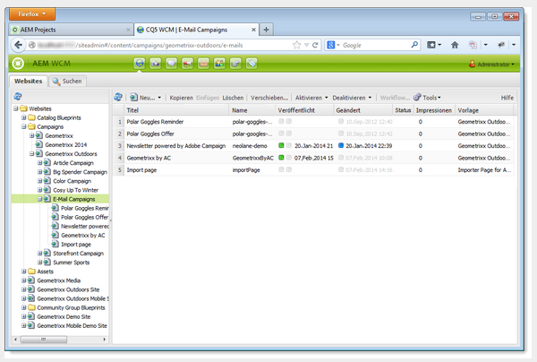

1. Wählen Sie **Neu** > **Neue Seite** aus, um neuen E-Mail-Inhalt zu erstellen.
1. Wählen Sie eine der drei spezifischen Adobe Campaign-Vorlagen aus und legen Sie die allgemeinen Eigenschaften der Seite fest. Standardmäßig sind drei Vorlagen verfügbar:

   * **Adobe Campaign-E-Mail (AC 6.1)**: Hiermit können Sie einer Vorlage eigene Inhalte hinzufügen, bevor sie zur Bereitstellung an Adobe Campaign 6.1 übermittelt wird.
   * **Adobe Campaign-E-Mail (ACS)**: Hiermit können Sie einer Vorlage eigene Inhalte hinzufügen, bevor sie zur Bereitstellung an Adobe Campaign Standard weitergeleitet wird.

   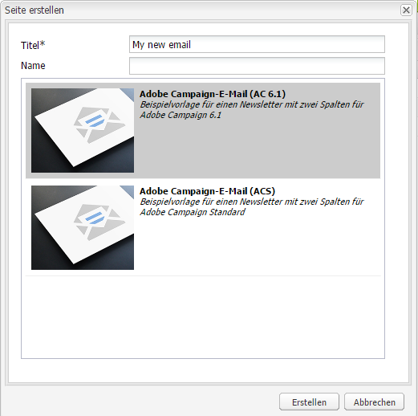

1. Klicken Sie auf **Erstellen** , um Ihre E-Mail oder Ihren Newsletter zu erstellen.

### Auswählen von Adobe Campaign-Cloud-Service und Vorlagen {#selecting-the-adobe-campaign-cloud-service-and-template}

Möchten Sie eine Integration mit Adobe Campaign durchführen, müssen Sie der Seite einen Adobe Campaign-Service hinzufügen. Somit verfügen Sie über Zugriff auf Personalisierung und andere Daten aus Adobe Campaign.

Des Weiteren müssen Sie möglicherweise auch eine Adobe Campaign-Vorlage auswählen und den Betreff ändern und normalen Text für Benutzer einfügen, die die E-Mail nicht im HTML-Format anzeigen.

1. Wählen Sie die Registerkarte **Seite** im Sidekick und dann **Seiteneigenschaften.**
1. Wählen Sie im Popup-Fenster auf der Registerkarte **Cloud-Services** die Option **Dienst hinzufügen** aus, um den Adobe Campaign-Dienst hinzuzufügen, und klicken Sie auf **OK**.

   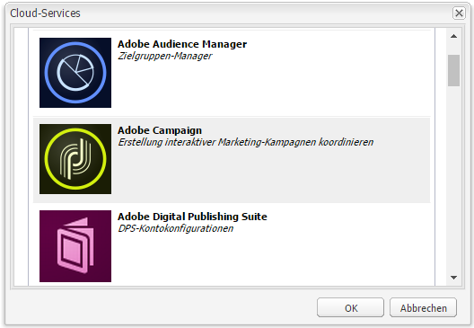

1. Wählen Sie aus einer Dropdown-Liste die Konfiguration aus, die Ihrer Adobe Campaign-Konfiguration entspricht, und bestätigen Sie Ihre Auswahl durch einen Klick auf **OK**.

   >[!NOTE]
   >
   >Stellen Sie sicher, dass Sie nach dem Hinzufügen des Cloud-Service auf **OK** oder **Anwenden** tippen oder klicken. Nur so funktioniert die Registerkarte **Adobe Campaign** ordnungsgemäß.

1. Wenn Sie eine bestimmte E-Mail-Versandvorlage (aus Adobe Campaign) anwenden möchten, die nicht die Standardvorlage **mail** ist, wählen Sie erneut **Seiteneigenschaften** aus. Geben Sie im Tab **Adobe Campaign** den internen Namen der E-Mail-Versandvorlage in die zugehörige Adobe Campaign-Instanz ein.

   In Adobe Campaign Standard lautet die Vorlage **Bereitstellung mit AEM-Inhalten**. In Adobe Campaign 6.1 lautet die Vorlage **E-Mail-Bereitstellung mit AEM-Inhalten**.

   Wenn Sie die Vorlage auswählen, aktiviert AEM automatisch die Komponenten **Adobe Campaign Newsletter**.

### Bearbeiten von E-Mail-Inhalten {#editing-email-content}

E-Mail-Inhalte können entweder in der klassischen oder in der Touch-optimierten Benutzeroberfläche bearbeitet werden.

1. Geben Sie den Betreff und die Textversion der E-Mail ein, indem Sie **Seiteneigenschaften** > **E-Mail** aus der Toolbox auswählen.

   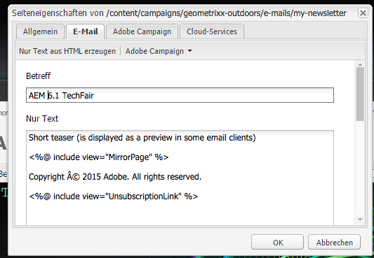

1. Bearbeiten Sie die E-Mail-Inhalte, indem Sie die gewünschten Elemente durch die im Sidekick verfügbaren Optionen hinzufügen. Hierzu ziehen Sie die Komponenten einfach in die E-Mail. Klicken Sie anschließend doppelt auf das Element, das Sie bearbeiten möchten.

   Sie können beispielsweise Text hinzufügen, der Personalisierungsfelder enthält.

   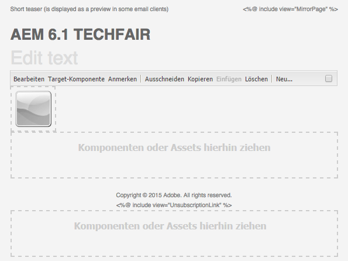

   Eine Beschreibung der für Adobe Campaign-Newsletter/-E-Mails verfügbaren Komponenten finden Sie unter [Adobe Campaign-Komponenten](/help/sites-classic-ui-authoring/classic-personalization-ac-components.md).

   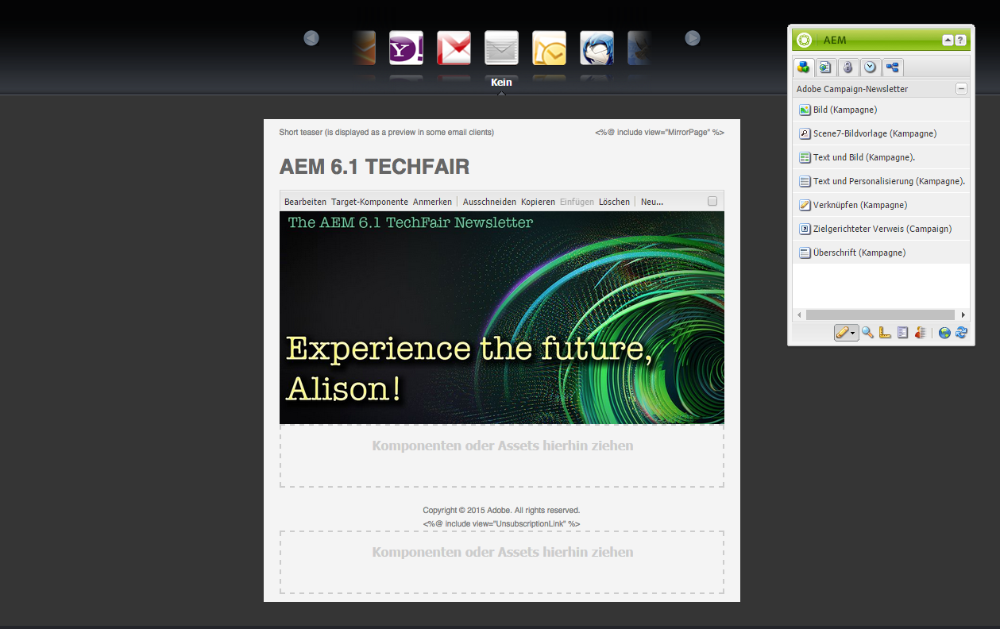

### Einfügen von Personalisierung {#inserting-personalization}

Beim Bearbeiten Ihres Inhalts können Sie Folgendes einfügen:

* Adobe Campaign-Kontextfelder. Hierbei handelt es sich um Felder, die Sie in Ihren Text einfügen können und die entsprechend den Empfängerdaten angepasst werden (z. B. Vorname, Nachname oder beliebige Daten der Zieldimension).
* Adobe Campaign-Personalisierungsblöcke. Hierbei handelt es sich um Blöcke vordefinierter Inhalte, die nicht mit den Empfängerdaten in Zusammenhang stehen, wie z. B. ein Markenlogo oder ein Link zu einer Mirrorseite.

Detaillierte Beschreibungen der Komponenten von Adobe Campaign finden Sie unter [Adobe Campaign-Komponenten](/help/sites-classic-ui-authoring/classic-personalization-ac-components.md).

>[!NOTE]
>
>* Es werden nur die Felder der Adobe Campaign-**Profile** der Targeting-Dimension berücksichtigt.
>* Beim Anzeigen von Eigenschaften über **Sites** haben Sie keinen Zugriff auf die Adobe Campaign-Kontextfelder. Sie können bei deren Bearbeitung direkt aus E-Mails darauf zugreifen.

>

1. Fügen Sie eine neue Komponente **Newsletter** > **Text und Personalisierung (Kampagne)** ein.
1. Öffnen Sie die Komponente, indem Sie doppelt darauf klicken. Im Fenster **Bearbeiten** stehen Ihnen Funktionen zur Verfügung, mit deren Hilfe Sie personalisierte Inhalte einfügen können.

   >[!NOTE]
   >
   >Die verfügbaren Kontextfelder entsprechen den **Profilen** der Targeting-Dimension in Adobe Campaign.
   >
   >Siehe [Verknüpfen einer AEM Seite mit einer Adobe Campaign-E-Mail](/help/sites-classic-ui-authoring/classic-personalization-ac-campaign.md#linkinganaempagetoanadobecampaignemail).

   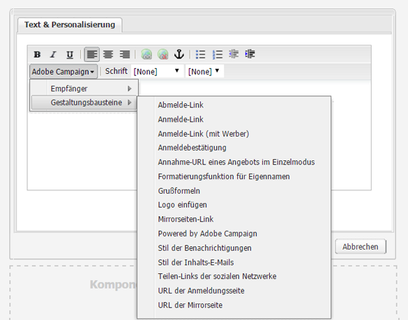

1. Wählen Sie **ClientContext** im Sidekick aus, um die Personalisierungsfelder mithilfe der Daten in den Persona-Profilen zu testen.

   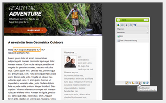

1. Es öffnet sich ein Fenster, in dem das gewünschte Profil ausgewählt werden kann. Personalisierungsfelder werden automatisch mit Daten des ausgewählten Profils bestückt.

   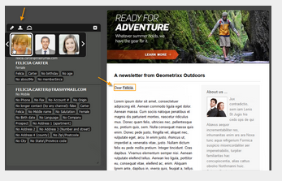

### Newslettervorschau {#previewing-a-newsletter}

Sie können sich eine Vorschau des Newsletters und der Personalisierung anzeigen lassen.

1. Öffnen Sie den Newsletter, dessen Vorschau angezeigt werden soll, und klicken Sie auf Vorschau (Lupe), um den Sidekick zu verkleinern.
1. Klicken Sie auf eines der E-Mail-Client-Symbole, um herauszufinden, wie der Newsletter von verschiedenen Clients angezeigt wird.

   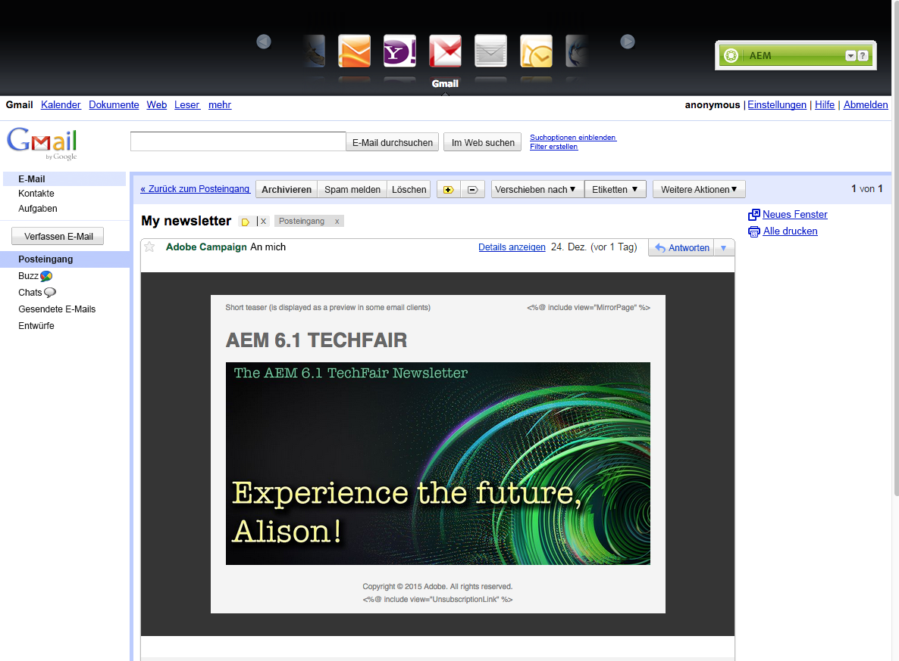

1. Erweitern Sie den Sidekick, um die E-Mail erneut zu bearbeiten.

### Genehmigen von Inhalten in AEM  {#approving-content-in-aem}

Nach der Bearbeitung der Inhalte kann mit deren Genehmigung begonnen werden. Gehen Sie zur Registerkarte **Workflow** der Toolbox und wählen Sie den Workflow **Für Adobe Campaign genehmigen** aus.

Dieser Standardarbeitsablauf besteht aus zwei Schritten: Prüfung und Genehmigung oder Prüfung und Ablehnung. Der Arbeitsablauf kann jedoch auch ausgeweitet oder an komplexere Prozesse angepasst werden.

Möchten Sie Inhalte für Adobe Campaign genehmigen, wenden Sie den Arbeitsablauf an, indem Sie **Workflow** im Sidekick auswählen, die Option **Für Adobe Campaign genehmigen** wählen und auf **Workflow starten klicken**. Führen Sie die vorgegebenen Schritte aus und genehmigen Sie den Inhalt. Sie können Inhalte auch ablehnen, indem Sie im letzten Schritt des Arbeitsablaufs statt **Genehmigen** die Option **Ablehnen** wählen.

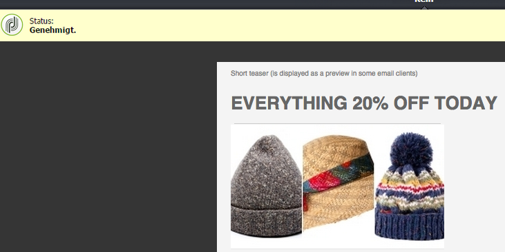

Nach der Genehmigung des Inhalts wird dieser in Adobe Campaign als genehmigt gekennzeichnet. Die E-Mail kann nun verschickt werden.

In Adobe Campaign Standard:

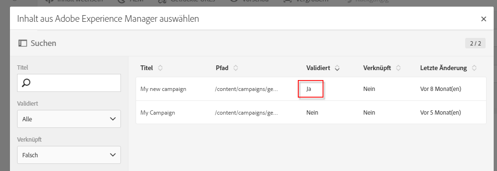

In Adobe Campaign 6.1:

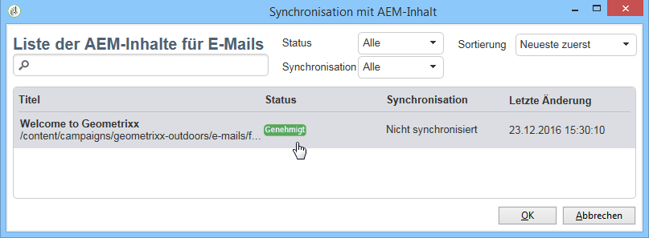

>[!NOTE]
>
>Nicht genehmigte Inhalte können in Adobe Campaign mit einer Bereitstellung synchronisiert werden, diese Bereitstellung lässt sich jedoch nicht durchführen. Mit Campaign-Bereitstellungen lassen sich nur genehmigte Inhalte versenden.

## Verknüpfen von AEM mit Adobe Campaign Standard und Adobe Campaign 6.1  {#linking-aem-with-adobe-campaign-standard-and-adobe-campaign}

>[!NOTE]
>
>Weitere Informationen finden Sie unter [Verknüpfen von AEM mit Adobe Campaign Standard und Adobe Campaign 6.1](/help/sites-authoring/campaign.md#linking-aem-with-adobe-campaign-standard-and-adobe-campaign-classic) unter [Arbeiten mit Adobe Campaign 6.1 und Adobe Campaign Standard](/help/sites-authoring/campaign.md) in der Standarddokumentation für die Bearbeitung.
