# Adobe Campaign-Komponenten{#adobe-campaign-components}

Bei einer Integration mit Adobe Campaign stehen Ihnen für die Arbeit mit Newslettern und Formularen Komponenten zur Verfügung. Beide Optionen, Newsletter und Formulare, werden in diesem Dokument näher beschrieben.

>[!CAUTION]
>
>Die AEM E-Mail-Komponenten werden nicht mehr unterstützt. Aufgrund der Art der E-Mail, in der Inhalt und Stil zusammengeführt werden, werden die standardmäßig von AEM bereitgestellten E-Mail-Komponenten für Kunden nur eingeschränkt wiederverwendet, da benutzerdefinierte Stile in alle für Projekte erforderlichen Komponenten implementiert werden müssen.
>
>E-Mail-Komponenten können auf Projektebene implementiert werden. Die veralteten E-Mail-AEM veranschaulichen, wie dies erreicht werden kann. Diese veralteten Komponenten sollten jedoch nicht für Projekte verwendet werden.

## Adobe Campaign-Newsletter-Komponenten {#adobe-campaign-newsletter-components}

Folgen Sie in den Campaign-Komponenten den Best Practices, die Sie unter [Best Practices für E-Mail-Vorlagen](/help/sites-administering/best-practices-for-email-templates.md) finden und die auf der Adobe-Markupsprache [HTL](https://helpx.adobe.com/de/experience-manager/htl/using/overview.html) basieren.

Öffnen Sie eine E-Mail oder einen Newsletter, der oder die für die Integration mit Adobe Campaign konfiguriert wurde, werden Ihnen im Abschnitt **Adobe Campaign-Newsletter** folgende Optionen angezeigt:

* Überschrift (Kampagne)
* Bild (Kampagne)
* Link (Kampagne)
* Scene7-Bildvorlage (Kampagne)
* Zielgerichteter Verweis (Kampagne)
* Text und Bild (Kampagne)
* Text und Personalisierung (Kampagne)

Eine Beschreibung dieser Komponenten finden Sie im folgenden Abschnitt.

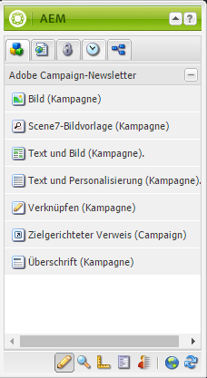

### Überschrift (Kampagne) {#heading-campaign}

Für die Titel-Komponente gilt Folgendes:

* Anzeigen des Namens der aktuellen Seite, indem das Feld **Titel** leer gelassen wird; oder
* Anzeigen des Textes, der im Feld **Titel** angegeben wurde.

Die Komponente **Überschrift (Kampagne)** kann direkt bearbeitet werden. Frei lassen, um den Seitentitel zu verwenden.

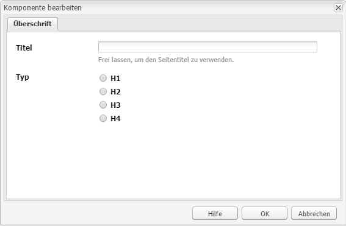

Sie können Folgendes konfigurieren:

* **Titel** Wenn Sie einen anderen Namen als den Seitentitel verwenden möchten, geben Sie ihn hier ein.

* **Überschriftenebene (1, 2, 3, 4)** Die Überschriftenebene basierend auf der HTML-Überschriftgröße (1–4).

Im folgenden Beispiel sehen Sie, wie die Komponente „Überschrift (Kampagne)“ dargestellt wird.

### Image (Campaign) {#image-campaign}

Die Komponente „Bild (Kampagne)“ zeigt ein Bild und begleitenden Text gemäß den festgelegten Parametern an.

Sie können ein Bild hochladen und anschließend bearbeiten und anpassen (z. B. zuschneiden, drehen oder Links/Titel/Text hinzufügen).

Sie können ein Bild hochladen und dieses anschließend bearbeiten und manipulieren (beispielsweise zuschneiden, drehen oder Links/Titel/Text hinzufügen). Sie können ein Bild aus dem [Content Finder](/help/sites-authoring/author-environment-tools.md#thecontentfinderclassicui) direkt auf die Komponente oder auf deren Bearbeitungsdialogfeld ziehen. Sie können im zentralen Bereich des Bearbeitungsdialogfelds doppelklicken, um Ihr lokales Dateisystem zu durchsuchen und ein Bild hochzuladen. Die beiden Registerkarten des Bearbeitungsdialogfelds steuern auch alle Definitionen und Bearbeitungen des Bildes:

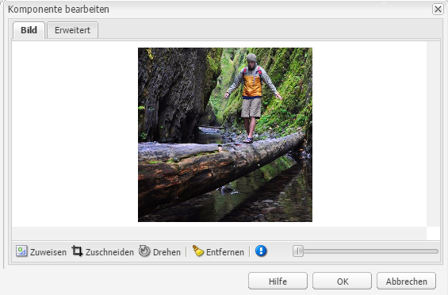

Wenn ein Bild geladen wird, können folgende Konfigurationen durchgeführt werden:

* **Zuweisen**
Wählen Sie „Zuweisen“ aus, um ein Bild zuzuweisen. Sie legen fest, wie die Imagemap (Rechteck, Polygon usw.) erstellt werden soll, und geben an, worauf der Bereich verweisen soll.

* **Zuschneiden**
Wählen Sie „Zuschneiden“ aus, um ein Bild zuzuschneiden. Verwenden Sie die Maus, um das Bild zuzuschneiden.

* **Drehen**
Wählen Sie „Drehen“ aus, um ein Bild zu drehen. Wiederholen Sie das Drehen so lange, bis das Bild die gewünschte Ausrichtung hat.

* **Entfernen**
Damit entfernen Sie das aktuelle Bild.

* Zoomleiste (nur klassische Benutzeroberfläche)
Verwenden Sie den Regler unter dem Bild (und über den Schaltflächen „OK“ und „Abbrechen“), um das Bild ein- und auszuzoomen.
* **Titel**
Der Titel des Bildes.

* **Alt-Text**
Ein alternativer Text, der für barrierefreie Inhalte verwendet wird.

* **Verknüpfen mit**
Erstellen Sie einen Link zu Assets oder anderen Seiten innerhalb Ihrer Website.

* **Beschreibung**
Eine Beschreibung des Bildes.

* **Größe**
Legt die Höhe und Breite des Bildes fest.

>[!NOTE]
>
>Sie müssen im Feld **ALT-Text** der Registerkarte **Erweitert** Informationen eingeben, da das Bild sonst nicht gespeichert werden kann und die folgende Fehlermeldung ausgegeben wird:
>
>`Validation failed. Verify the values of the marked fields.`

Im folgenden Beispiel sehen Sie, wie die Komponente „Bild (Kampagne)“ dargestellt wird.

### Link (Kampagne) {#link-campaign}

Über die Komponente „Link (Kampagne)“ können Sie Ihrem Newsletter einen Link hinzufügen. Diese Komponente ist nur in der klassischen Benutzeroberfläche verfügbar, sie kann jedoch auch in der Touch-optimierten Benutzeroberfläche hinzugefügt und im Kompatibilitätsmodus geöffnet werden.

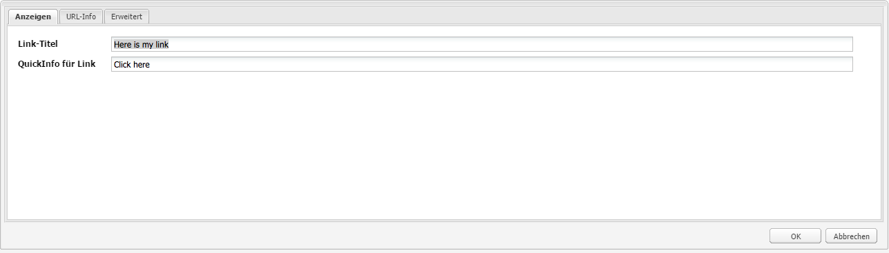

Folgendes können Sie in den Registerkarten **Anzeige**, **URL-Info** oder **Erweitert** konfigurieren:

* **Verknüpfungsbeschriftung** Die Beschriftung des Links. Dies ist der Text, der den Benutzern angezeigt wird.

* **Link-QuickInfo** Mit dieser Option werden weitere Informationen zur Verwendung des Links hinzugefügt.

* ****
LinkTypeWählen Sie in der Dropdown-Liste zwischen einem 
**Benutzerdefinierte** URLs und ein  **adaptives Dokument**. Dieses Feld ist obligatorisch. Entscheiden Sie sich für eine benutzerdefinierte URL, können Sie die URL des Links angeben. Entscheiden Sie sich für ein adaptives Dokument, können Sie den Dokumentenpfad festlegen.

* **Zusätzlicher URL-Parameter** Fügen Sie weitere URL-Parameter hinzu. Klicken Sie auf „Element hinzufügen“, um mehrere Elemente hinzuzufügen.

>[!NOTE]
>
>Sie müssen Informationen im Feld **Link-Typ** auf der Registerkarte **URL Info** eingeben, da die Komponente nicht gespeichert werden kann und folgende Fehlermeldung angezeigt wird:
>
>`Validation failed. Verify the values of the marked fields.`

Im folgenden Beispiel sehen Sie, wie die Komponente „Link (Kampagne)“ dargestellt wird.

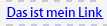

### Zielgerichteter Verweis (Kampagne) {#targeted-reference-campaign}

Mithilfe der Komponente „Zielgerichteter Verweis (Kampagne)“ können Sie einen Verweis auf einen zielgerichteten Abschnitt erstellen.

Navigieren Sie in der Komponente zum gewünschten zielgerichteten Abschnitt, um ihn auszuwählen.

Klicken Sie auf das Dropdown-Menü, um zu dem Abschnitt zu navigieren, auf den Sie verweisen möchten. Wenn Sie fertig sind, klicken Sie auf **OK**.

### Text und Bild (Kampagne)  {#text-image-campaign}

Mit der Komponente „Text und Bild (Kampagne)“ werden ein Textblock und ein Bild hinzugefügt.

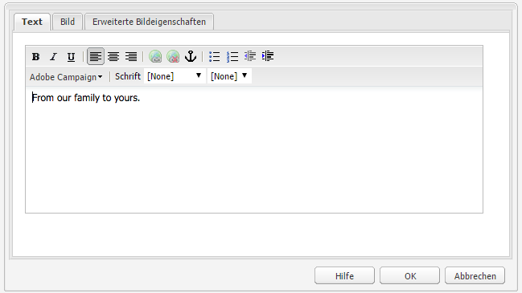

Wie bei den Komponenten „Text und Personalisierung (Kampagne)“ und „Bild (Kampagne)“ können Sie Folgendes konfigurieren:

* **Text**
Geben Sie einen Text ein. Verwenden Sie die Symbolleiste, um die Formatierung zu ändern, Listen zu erstellen und Links hinzuzufügen.

* **Bild**
Ziehen Sie ein Bild aus dem Content Finder oder klicken Sie, um zu einem Bild zu navigieren. Schneiden Sie es gegebenenfalls zu oder drehen Sie es.

* **Bildeigenschaften** (**Erweiterte Bildeigenschaften**)
Sie können Folgendes festlegen:

   * **Titel**
Der Titel des Blocks, der angezeigt wird, wenn Sie mit der Maus darauf zeigen.

   * **Alt -Text**
Alternativer Text, der angezeigt wird, wenn das Bild nicht dargestellt werden kann.

   * **Verknüpfen mit**
Erstellen Sie einen Link zu Assets oder anderen Seiten innerhalb Ihrer Website.

   * **Beschreibung**
Eine Beschreibung des Bildes.

   * **Größe**
Legt die Höhe und Breite des Bildes fest.

>[!NOTE]
>
>Das Feld **ALT-Text** auf der Registerkarte **Erweitert** muss ausgefüllt werden, da die Komponente anderenfalls nicht gespeichert werden kann und folgende Fehlermeldung ausgegeben wird:
>
>`Validation failed. Verify the values of the marked fields.`

Im folgenden Beispiel sehen Sie, wie die Komponente „Text und Bild (Kampagne)“ dargestellt wird.

### Text und Personalisierung (Kampagne) {#text-personalization-campaign}

Mit der Komponente &quot;Text und Personalisierung (Kampagne)&quot;können Sie mithilfe eines WYSIWYG-Editors einen Textblock eingeben, wobei die Funktionen vom [Rich-Text-Editor](/help/sites-authoring/rich-text-editor.md) bereitgestellt werden. Darüber hinaus können Sie mithilfe dieser Komponente Kontextfelder und Personalisierungsblöcke aus Adobe Campaign verwenden. Weitere Informationen hierzu finden Sie unter [Personalisierungen einfügen](/help/sites-classic-ui-authoring/classic-personalization-ac-campaign.md#inserting-personalization).

Über mehrere Symbole können Sie den Text formatieren, darunter Schriftmerkmale, Ausrichtung, Links, Listen und Einzüge: 

Fügen Sie Text so hinzu, wie Sie es im Rich-Text-Editor tun würden. Fügen Sie Personalisierungen hinzu, indem Sie aus dem Adobe Campaign-Dropdown-Menü die gewünschten Optionen auswählen.

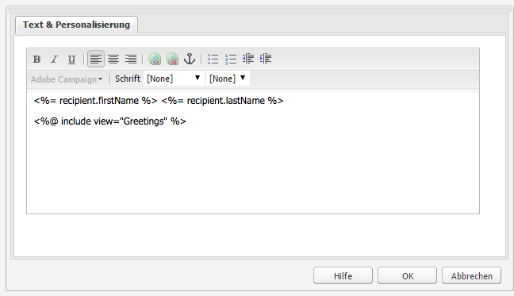

Erstellen Sie Inhalte, indem Sie Text und Kontextfelder oder Personalisierungsblöcke hinzufügen. Wählen Sie anschließend Client Context aus, um die Daten mit den Benutzerrollenprofilen zu testen. Nach der Auswahl eines Profils werden die Personalisierungsfelder automatisch durch Daten des gewählten Profils ersetzt.

>[!NOTE]
>
>Nur die Felder, die im Schema **nms:seedMember** oder einer seiner Erweiterungen festgelegt wurden, werden berücksichtigt. Die Attribute der mit `nms:seedMember` verknüpften Tabellen stehen nicht zur Verfügung.

## Adobe Campaign-Formular-Komponenten {#adobe-campaign-form-components}

Sie können mithilfe der Adobe Campaign-Komponenten Formulare erstellen, die Benutzer ausfüllen, um Newsletter zu abonnieren oder abzubestellen oder ihre Benutzerprofile zu aktualisieren. Weitere Informationen finden Sie unter [Erstellen von Adobe Campaign-Formularen](/help/sites-classic-ui-authoring/classic-personalization-ac-forms.md).

Jedes Komponentenfeld kann mit einem Adobe Campaign-Datenbankfeld verknüpft werden. Die verfügbaren Felder variieren je nach dem enthaltenen Datentyp. Eine genauere Beschreibung finden Sie im Abschnitt [Komponenten und Datentyp](#components-and-data-type). Wenn Sie Ihr Empfängerschema in Adobe Campaign erweitern, werden die neuen Felder in den Komponenten zur Verfügung gestellt, deren Datentypen mit denen der Felder übereinstimmen.

Wenn Sie ein Formular öffnen, das für die Integration mit Adobe Campaign konfiguriert ist, sehen Sie die folgenden Komponenten im Abschnitt **Adobe Campaign**:

* Kontrollkästchen (Kampagne)
* „Datumsfeld (Kampagne)“ und „Datumsfeld/HTML5 (Kampagne)“
* Verschlüsselter Primärschlüssel (Kampagne)
* Fehleranzeige (Kampagne)
* Ausgeblendeter Abstimmschlüssel (Kampagne)
* Numerisches Feld (Kampagne)
* Optionsfeld (Kampagne)
* Abonnement-Checkliste (Kampagne)
* Textfeld (Kampagne)

In diesem Abschnitt werden die Komponenten im Detail beschrieben.

### Komponenten und Datentyp  {#components-and-data-type}

In der folgenden Tabelle werden die Komponenten beschrieben, die verfügbar sind und mit denen Adobe Campaign-Profildaten angezeigt und bearbeitet werden können. Jede Komponente kann einem Adobe Campaign-Profil zugeordnet werden, um dessen Feldwerte anzuzeigen und beim Absenden des Formulars das entsprechende Feld zu aktualisieren. Die unterschiedlichen Komponenten können nur Feldern mit entsprechendem Datentyp zugewiesen werden.

<table>
 <tbody>
  <tr>
   <td>
<strong>Komponente</strong>
 </td>
   <td>
<strong>Datentyp des Adobe Campaign-Felds</strong>
 </td>
   <td>
<strong>Beispielfeld</strong>
 </td>
  </tr>
  <tr>
   <td>
Kontrollkästchen (Kampagne)
 </td>
   <td>
Boolesch
 </td>
   <td>
Nicht mehr kontaktieren (auf beliebigem Kanal)
 </td>
  </tr>
  <tr>
   <td>
Datumsfeld (Kampagne)
 
Datumsfeld/HTM 5 (Kampagne)
 </td>
   <td>
date
 </td>
   <td>
Geburtsdatum
 </td>
  </tr>
  <tr>
   <td>
Numerisches Feld (Kampagne)
 </td>
   <td>
Numerisch (Byte, kurz, lang, doppelt)
 </td>
   <td>
Alter
 </td>
  </tr>
  <tr>
   <td>
Optionsfeld (Kampagne)
 </td>
   <td>
Byte mit zugehörigen Werten
 </td>
   <td>
Geschlecht
 </td>
  </tr>
  <tr>
   <td>
Textfeld (Kampagne)
 </td>
   <td>
Zeichenfolge
 </td>
   <td>
E-Mail
 </td>
  </tr>
 </tbody>
</table>

### Von den meisten Komponenten genutzte Einstellungen  {#settings-common-to-most-components}

Die Adobe Campaign-Komponenten verfügen über Einstellungen, die von allen Komponenten genutzt werden (mit Ausnahme des verschlüsselten Primärschlüssels und des ausgeblendeten Abstimmschlüssels).

Für die meisten Komponenten können Sie Folgendes konfigurieren:

#### Titel und Text  {#title-and-text}

* **Titel**
Wenn Sie einen anderen Namen als Elementnamen verwenden möchten, geben Sie ihn hier ein.

* **Titel ausblenden** Aktivieren Sie diese Option, wenn der Titel nicht angezeigt werden soll.

* **Beschreibung** Fügen Sie eine Beschreibung des Felds hinzu, um Benutzern weitere Informationen zur Verfügung zu stellen.

* **Nur Wert anzeigen** Zeigt nur den Wert an, falls dieser vorhanden ist.

#### Adobe Campaign {#adobe-campaign}

Sie können Folgendes konfigurieren:

* **Zuordnung** Wählen Sie ein Adobe Campaign-Personalisierungsfeld aus, falls gewünscht.

* **Abstimmschlüssel** Aktivieren Sie diese Option, wenn das Feld Teil des Abstimmschlüssels ist.

#### Beschränkungen {#constraints}

* **Erforderlich**  - Aktivieren Sie dieses Kontrollkästchen, um diese Komponente erforderlich zu machen. Das heißt, Benutzer müssen einen Wert eingeben.
* **Erforderliche Nachricht**  - Fügen Sie optional eine Meldung hinzu, dass das Feld erforderlich ist.

#### Stile {#styling}

* **CSS** Geben Sie die CSS-Klassen ein, die Sie für diese Komponente verwenden möchten.

### Kontrollkästchen (Kampagne) {#checkbox-campaign}

Die Komponente „Kontrollkästchen (Kampagne)“ ermöglicht es dem Benutzer, Adobe Campaign-Profilfelder mit booleschem Datentyp zu bearbeiten. Sie können beispielsweise eine Komponente „Kontrollkästchen (Kampagne)“ einfügen, die den Empfänger angeben lässt, dass er oder sie über beliebige Kanäle nicht mehr kontaktiert werden möchte.

Sie können [von den meisten Adobe Campaign-Komponenten genutzte Einstellungen](#settings-common-to-most-components) in der Komponente „Kontrollkästchen (Kampagne)“ bearbeiten.

Im folgenden Beispiel sehen Sie, wie die Komponente „Kontrollkästchen (Kampagne)“ dargestellt wird.

### Datumsfeld (Kampagne) und Datumsfeld/HTML 5 (Kampagne) {#date-field-campaign-and-date-field-html-campaign}

Verwenden Sie das Datumsfeld, damit Empfänger ein Datum (beispielsweise das Geburtsdatum) angeben können. Das Datumsformat entspricht dem Format, das in Ihrer Adobe Campaign-Instanz verwendet wird.

Neben den [von den meisten Adobe Campaign-Komponenten genutzten Einstellungen](#settings-common-to-most-components) können Sie auch Folgendes konfigurieren:

* **Einschränkungen - Einschränkungen**  - Sie können auswählen -  **** Keine oder  **** Datum , um die Beschränkung eines Datums oder keine Beschränkung hinzuzufügen. Wählen Sie „Datum“ aus, müssen Benutzer ihre Angaben im Datumsformat machen.

* **Beschränkungsmeldung**  - Darüber hinaus können Sie eine Beschränkungsmeldung hinzufügen, damit Benutzer wissen, wie ihre Antworten richtig formatiert werden.
* **Formatierung - Breite**  - Passen Sie die Breite des Felds an, indem Sie auf die  **+** -  **und -** Symbole klicken oder tippen oder eine Zahl eingeben.

Im folgenden Beispiel sehen Sie, wie die Komponente „Datumsfeld (Kampagne)“ mit angepasster Breite angezeigt wird.

### Verschlüsselter Primärschlüssel (Kampagne) {#encrypted-primary-key-campaign}

Mit dieser Komponente wird der Name des URL-Parameters festgelegt, der die Kennung eines Adobe Campaign-Profils enthält (in Adobe Campaign Standard bzw. Adobe Campaign 6.1 lauten diese **Hauptressourcenkennung** bzw. **Verschlüsselter Primärschlüssel**).

Jedes Formular, mit dem Adobe Campaign-Profildaten angezeigt und bearbeitet werden, **muss** den verschlüsselten Primärschlüssel enthalten.

In der Komponente „Verschlüsselter Primärschlüssel (Kampagne)“ können Sie Folgendes konfigurieren:

* **Titel und Text - Elementname**  - Standardwert ist encryptedPK. Sie müssen den Elementnamen lediglich ändern, wenn er mit einem anderen Elementnamen des gleichen Formulars in Konflikt steht. Zwei Formularfelder dürfen keinesfalls den gleichen Namen tragen.
* **Adobe Campaign - URL-Parameter**  - Fügen Sie den URL-Parameter für das EPK hinzu. Hierfür können Sie beispielsweise den Wert **epk** verwenden.

Im folgenden Beispiel sehen Sie, wie die Komponente „Verschlüsselter Primärschlüssel (Kampagne)“ dargestellt wird.

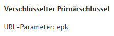

### Fehleranzeige (Kampagne) {#error-display-campaign}

Mit dieser Komponente können Sie Backend-Fehler anzeigen. Damit die Komponente ordnungsgemäß funktioniert, muss die Fehlerhandhabung auf „Weiterleiten“ eingestellt werden.

Im folgenden Beispiel sehen Sie, wie die Komponente „Fehleranzeige (Kampagne)“ dargestellt wird.

### Ausgeblendeter Abstimmschlüssel (Kampagne) {#hidden-reconciliation-key-campaign}

Mit der Komponente Ausgeblendeter Abstimmschlüssel (Kampagne) können Sie einem Formular ausgeblendete Felder als Teil des Abstimmschlüssels hinzufügen.

In der Komponente „Ausgeblendeter Abstimmschlüssel (Kampagne)“ können Sie Folgendes konfigurieren:

* **Titel und Text - Elementname**  - Standardwert ist alignKey. Sie müssen den Elementnamen lediglich ändern, wenn er mit einem anderen Elementnamen des gleichen Formulars in Konflikt steht. Zwei Formularfelder dürfen keinesfalls den gleichen Namen tragen.
* **Adobe Campaign - Zuordnung**  - Zuordnung zu einem Adobe Campaign-Personalisierungsfeld.

Im folgenden Beispiel sehen Sie, wie die Komponente „Ausgeblendeter Abstimmschlüssel (Kampagne)“ dargestellt wird.

### Numerisches Feld (Kampagne) {#numeric-field-campaign}

Mit dem numerischen Feld können Sie es Empfängern ermöglichen, Zahlen (beispielsweise das eigene Alter) einzugeben.

Neben den [von den meisten Adobe Campaign-Komponenten genutzten Einstellungen](#settings-common-to-most-components) können Sie auch Folgendes konfigurieren:

* **Einschränkungen -** Dropdown-Liste Einschränkungen Sie können auswählen -  **** Keine oder  **Numerisch -** , um die Beschränkung einer Zahl oder ohne Einschränkung hinzuzufügen. Wählen Sie die numerische Beschränkung, können Benutzer ausschließlich Zahlen in das Feld eingeben.

* **Beschränkungsmeldung**  - Darüber hinaus können Sie eine Beschränkungsmeldung hinzufügen, damit Benutzer wissen, wie ihre Antworten richtig formatiert werden.
* **Formatierung - Breite**  - Passen Sie die Breite des Felds an, indem Sie auf die  **+** -  **und -** Symbole klicken oder tippen oder eine Zahl eingeben.

Im folgenden Beispiel sehen Sie, wie die Komponente „Numerisches Feld (Kampagne)“ mit konfigurierter Breite angezeigt wird.

### Optionsfeld (Kampagne) {#option-field-campaign}

In dieser Dropdown-Liste können Sie eine Option auswählen, beispielsweise Geschlecht oder Status eines Empfängers.

Sie können [von den meisten Adobe Campaign-Komponenten genutzte Einstellungen](#settings-common-to-most-components) in der Komponente „Optionsfeld (Kampagne)“ bearbeiten. Wählen Sie zum Füllen der Dropdown-Liste das entsprechende Feld aus den Adobe Campaign-Personalisierungsfeldern aus, indem Sie auf das Adobe Campaign-Symbol klicken oder tippen und zum gewünschten Feld navigieren.

Im folgenden Beispiel sehen Sie, wie die Komponente „Optionsfeld (Kampagne)“ dargestellt wird.

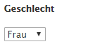

### Abonnement-Checkliste (Kampagne) {#subscriptions-checklist-campaign}

Mithilfe der Komponente **Abonnement-Checkliste (Kampagne)** können Sie die mit einem Adobe Campaign-Profil verknüpften Abonnements bearbeiten.

Wird die Komponente einem Formular hinzugefügt, werden alle verfügbaren Abonnements als Kontrollkästchen angezeigt, aus denen die Benutzer das gewünschte auswählen können. Wenn Benutzer das Formular senden, meldet diese Komponente den Benutzer an oder kündigt ihn von den ausgewählten Diensten ab, je nach dem Formularaktionstyp (**Adobe Campaign: Abonnieren Sie Services** oder **Adobe Campaign: Abmeldung von Services**).

>[!NOTE]
>
>Von der Komponente wird nicht geprüft, welche Services der Benutzer bereits abonniert oder abbestellt hat und welche nicht.

Sie können [von den meisten Adobe Campaign-Komponenten genutzte Einstellungen](#settings-common-to-most-components) in der Komponente „Abonnement-Checkliste (Kampagne)“ bearbeiten. (Für diese Komponente stehen keine Adobe Campaign-Konfigurationen zur Verfügung.)

Im folgenden Beispiel sehen Sie, wie die Komponente „Abonnement-Checkliste (Kampagne)“ dargestellt wird.

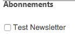

### Textfeld (Kampagne) {#text-field-campaign}

Die Komponente „Textfeld (Kampagne)“ ermöglicht Ihnen die Eingabe von Daten im Zeichenfolgenformat, darunter Vornamen, Nachnamen, Adressen, E-Mail-Adressen und vieles mehr.

Neben den [von den meisten Adobe Campaign-Komponenten genutzten Einstellungen](#settings-common-to-most-components) können Sie auch Folgendes konfigurieren:

* **Einschränkungen - Einschränkung**  - Dropdown - Sie können auswählen -  **Keine**,  **E-Mail**,  **Name**  (keine Umlaute), um die Einschränkung einer E-Mail-Adresse, eines Namens oder einer Einschränkung hinzuzufügen. Entscheiden Sie sich für „E-Mail“, können Benutzer ausschließlich E-Mail-Adressen in das Feld eingeben. Entscheiden Sie sich für „Name“, muss ein Name eingegeben werden (hierbei sind jedoch keine Umlaute gestattet).

* **Beschränkungsmeldung**  - Darüber hinaus können Sie eine Beschränkungsmeldung hinzufügen, damit Benutzer wissen, wie ihre Antworten richtig formatiert werden.
* **Formatierung - Breite**  - Passen Sie die Breite des Felds an, indem Sie auf die  **+** -  **und -** Symbole klicken oder tippen oder eine Zahl eingeben.

Im folgenden Beispiel sehen Sie, wie die Komponente „Textfeld (Kampagne)“ dargestellt wird.

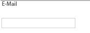
