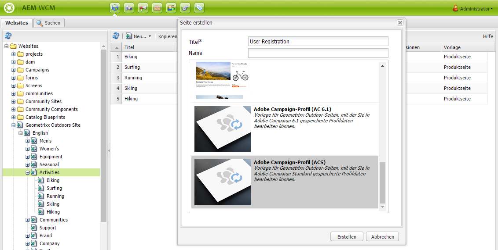

# Erstellen von Adobe Campaign-Formularen in AEM{#creating-adobe-campaign-forms-in-aem}

Mit AEM können Sie Formulare erstellen und bearbeiten, die auf Ihrer Website mit Adobe Campaign interagieren. Bestimmte Felder können in Ihre Formulare eingefügt und der Adobe Campaign-Datenbank zugeordnet werden.

Sie können neue Kontaktanmeldungen, -abmeldungen und Benutzerprofildaten verwalten und gleichzeitig deren Daten in Ihre Adobe Campaign-Datenbank integrieren.

Um Adobe Campaign-Formulare in AEM zu verwenden, müssen Sie die folgenden Schritte ausführen, die in diesem Dokument beschrieben werden:

1. Stellen Sie eine Vorlage zur Verfügung.
1. Erstellen Sie ein Formular.
1. Bearbeiten Sie den Formularinhalt.

Standardmäßig sind drei Formulartypen für Adobe Campaign verfügbar:

* Profil speichern
* Service abonnieren
* Von einem Service abmelden

Diese Formulare definieren einen URL-Parameter, der den verschlüsselten Primärschlüssel eines Adobe Campaign-Profils akzeptiert. Basierend auf diesem URL-Parameter aktualisiert das Formular die Daten des zugehörigen Adobe Campaign-Profils.

Obwohl Sie diese Formulare unabhängig voneinander erstellen, generieren Sie in einem typischen Anwendungsfall einen personalisierten Link zu einer Formularseite innerhalb des Newsletter-Inhalts, damit Empfängerinnen und Empfänger den Link öffnen und Anpassungen an ihren Profildaten vornehmen können (unabhängig davon, ob sie sich abmelden, abonnieren oder ihr Profil aktualisieren).

Das Formular wird basierend auf der Benutzerin bzw. dem Benutzer automatisch aktualisiert. Siehe [Formularinhalt bearbeiten](#editing-form-content), um weitere Informationen zu erhalten.

## Verfügbarmachen von Vorlagen {#making-a-template-available}

Damit Sie für Adobe Campaign spezifische Formulare erstellen können, müssen Sie die verschiedenen Vorlagen in Ihrer AEM-Anwendung verfügbar machen.

Weitere Informationen hierzu finden Sie in der [Vorlagendokumentation](/help/sites-developing/page-templates-static.md#templateavailability).

Überprüfen Sie zunächst, ob die Verbindung zwischen der Authoring- und der Publishing-Instanz und Adobe Campaign funktioniert. Weitere Informationen finden Sie unter [Integration mit Adobe Campaign Standard](/help/sites-administering/campaignstandard.md) oder [Integration mit Adobe Campaign 6.1](/help/sites-administering/campaignonpremise.md).

>[!NOTE]
>
>Stellen Sie sicher, dass die Eigenschaft **acMapping** im Knoten **jcr:content** der Seite auf den Wert **mapRecipient** bzw. **Profil** eingestellt ist, wenn Sie mit Adobe Campaign 6.1.x oder Adobe Campaign Standard arbeiten.
>

### Erstellen von Formularen {#creating-a-form}

1. Beginnen Sie in siteadmin.
1. Durchsuchen Sie die Baumstruktur so lange, bis Sie den Ort finden, an dem Sie das Formular auf der gewünschten Website erstellen möchten.
1. Wählen Sie **Neu** > **Neue Seite...** aus.
1. Wählen Sie entweder die Vorlage **Adobe Campaign-Profil (AC 6.1)** oder **Adobe Campaign-Profil (ACS)** aus und geben Sie die Seiteneigenschaften ein.

   >[!NOTE]
   >
   >Wenn die Vorlage nicht verfügbar ist, lesen Sie den Abschnitt [Verfügbarmachen von Vorlagen](/help/sites-classic-ui-authoring/classic-personalization-ac.md#activatingatemplate) Abschnitt.

1. Klicken Sie auf **Erstellen**, um das Formular zu erstellen.

   

   Sie können dann [den Formularinhalt bearbeiten und konfigurieren](#editing-form-content).

## Bearbeiten von Formularinhalten {#editing-form-content}

Eigens für Adobe Campaign erstellte Formulare haben bestimmte Komponenten. Diese Komponenten bieten die Möglichkeit, jedes Formularfeld mit einem Feld in der Adobe Campaign-Datenbank zu verknüpfen.

>[!NOTE]
>
>Ist die gewünschte Vorlage nicht verfügbar, finden Sie weitere Informationen hierzu unter [Verfügbarmachen von Vorlagen](/help/sites-classic-ui-authoring/classic-personalization-ac.md#activatingatemplate).

In diesem Abschnitt werden nur für Adobe Campaign spezifische Verknüpfungen behandelt. Weitere Informationen und einen allgemeineren Überblick darüber, wie Sie Formulare in Adobe Experience Manager verwenden, finden Sie unter [Komponenten des Bearbeitungsmodus](/help/sites-classic-ui-authoring/classic-page-author-edit-mode.md).

1. Navigieren Sie zu dem Formular, das Sie bearbeiten möchten.
1. Wählen Sie in der Toolbox **Seite** > **Seiteneigenschaften...** aus und navigieren Sie zur Registerkarte **Cloud-Services** des Popup-Fensters.
1. Hinzufügen des Adobe Campaign-Dienstes durch Klicken auf **Dienst hinzufügen** und wählen Sie dann in der Dropdown-Liste des Dienstes die Ihrer Adobe Campaign-Instanz entsprechende Konfiguration aus. Diese Konfiguration wird bei der Einrichtung der Verbindung zwischen den Instanzen durchgeführt. Weitere Informationen finden Sie unter [Verbinden von AEM mit Adobe Campaign](/help/sites-administering/campaignonpremise.md#connecting-aem-to-adobe-campaign).

   >[!NOTE]
   >
   >Entsperren Sie (falls nötig) die Konfiguration, indem Sie auf das Schloss klicken. Der Adobe Campaign-Service kann nun hinzugefügt werden.

1. Greifen Sie auf die allgemeinen Parameter des Formulars zu, indem Sie auf die Schaltfläche **Bearbeiten** klicken, die sich am Anfang des Formulars befindet. Die **Formular** können Sie eine Dankeseite auswählen, zu der der Benutzer nach der Validierung des Formulars weitergeleitet wird.

   Die **Erweitert** Formular können Sie den Formulartyp auswählen. Das Feld **Post-Optionen** ermöglicht Ihnen die Wahl zwischen drei Typen von Adobe Campaign-Formularen:

   * **Adobe Campaign: Profil speichern**: ermöglicht das Erstellen oder Aktualisieren einer Empfängerin oder eines Empfängers in Adobe Campaign (Standardwert).
   * **Adobe Campaign: Abonnieren von Diensten**: ermöglicht das Verwalten der Abonnements einer Empfängerin oder eines Empfängers in Adobe Campaign.
   * **Adobe Campaign: Abmeldung von Diensten**: ermöglicht Ihnen, die Abonnements einer Empfängerin oder eines Empfängers in Adobe Campaign zu stornieren.

   Über das Feld **Aktionskonfiguration** können Sie angeben, ob Sie das Empfängerprofil in der Adobe Campaign-Datenbank erstellen möchten, falls es noch nicht vorhanden ist. Aktivieren Sie hierzu die Option **Nicht vorhandene Benutzer erstellen**.

1. Fügen Sie die ausgewählten Komponenten hinzu, indem Sie sie aus der Toolbox ziehen und im Formular ablegen. Weitere Informationen zu den verfügbaren Adobe Campaign-spezifischen Komponenten finden Sie unter [Adobe-Formularkomponenten](/help/sites-classic-ui-authoring/classic-personalization-ac-components.md).

   

1. Konfigurieren Sie die hinzugefügten Felder durch Doppelklick. Auf der Registerkarte **Adobe Campaign** können Sie das Feld mit einem Feld in der Empfängertabelle von Adobe Campaign verknüpfen. Sie können zudem ebenfalls festlegen, ob das Feld Teil des Abstimmschlüssels ist, mit dessen Hilfe bereits in der Adobe Campaign-Datenbank erfasste Empfänger identifiziert werden können.

   >[!CAUTION]
   >
   >Der **Elementname** muss für jedes Formularfeld unterschiedlich sein. Ändern Sie ihn bei Bedarf.
   >
   >Jedes Formular muss **Verschlüsselter Primärer Schlüssel** zur korrekten Verwaltung der Empfänger in der Adobe Campaign-Datenbank.

1. Aktivieren Sie die Seite, indem Sie in der Toolbox **Seite** > **Seite aktivieren** auswählen. Die Seite wird auf Ihrer Site aktiviert. Sie können sie anzeigen, indem Sie zu Ihrer AEM-Publishing-Instanz wechseln. Die Daten in der Adobe Campaign-Datenbank werden aktualisiert, sobald ein Formular validiert wurde.

## Testen eines Formulars {#testing-a-form}

Nachdem Sie ein Formular erstellt und den Formularinhalt bearbeitet haben, können Sie manuell testen, ob das Formular erwartungsgemäß funktioniert.

>[!NOTE]
>
>Jedes Formular muss eine Komponente des Typs **Verschlüsselter Primärschlüssel** aufweisen. Wählen Sie aus den Komponenten Adobe Campaign aus, sodass nur die entsprechenden Komponenten angezeigt werden.
>
>Obwohl Sie bei diesem Verfahren die Nummer des verschlüsselten Primärschlüssels manuell eingeben, erhalten Benutzerinnen und Benutzer in der Praxis einen Link zu dieser Seite (egal ob sie sich abmelden, abonnieren oder Ihr Profil aktualisieren möchten) in einem Newsletter. Je nach Benutzerin bzw. Benutzer wird der verschlüsselte Primärschlüssel automatisch aktualisiert.
>
>Verwenden Sie zur Herstellung dieser Verknüpfung die Variable **Hauptressourcenkennung** (Adobe Campaign Standard) oder **Verschlüsselte Kennung** (Adobe Campaign 6.1) (beispielsweise in einer Komponente des Typs **Text und Personalisierung (Kampagne)**), die eine Verknüpfung mit dem EPK in Adobe Campaign herstellt.

Dazu müssen Sie den verschlüsselten Primärschlüssel eines Adobe Campaign-Profils manuell abrufen und an die URL anhängen:

1. So rufen Sie den verschlüsselten Primärschlüssel (EPK) eines Adobe Campaign-Profils ab:

   * Navigieren Sie in Adobe Campaign Standard zu **Profile und Zielgruppen** > **Profile**. Hier werden alle vorhandenen Profile aufgeführt. Stellen Sie sicher, dass das Feld **Hauptressourcenkennung** in einer der Spalten angezeigt wird (dies kann durch Klicken oder Tippen auf **Liste konfigurieren** eingestellt werden). Kopieren Sie die Hauptressourcenkennung des gewünschten Profils.
   * Navigieren Sie in Adobe Campaign 6.11 zu **Profile und Ziele** > **Empfänger**. Hier werden alle vorhandenen Profile aufgeführt. Stellen Sie sicher, dass das Feld **Verschlüsselte Kennung** in einer der Spalten angezeigt wird (dies kann durch einen Rechtsklick auf einen Eintrag und die Auswahl von **Liste konfigurieren...** eingestellt werden). Kopieren Sie die verschlüsselte Kennung des gewünschten Profils.

1. Öffnen Sie in AEM die Formularseite in der Veröffentlichungsinstanz und fügen Sie den EPK aus Schritt 1 als URL-Parameter an: Verwenden Sie den gleichen Namen, den Sie zuvor in der EPK-Komponente beim Erstellen des Formulars verwendet haben (Beispiel: `?epk=...`).
1. Mit dem Formular können jetzt die mit dem verknüpften Adobe Campaign-Profil verknüpften Daten und Abonnements geändert werden. Nachdem Sie einige Felder geändert und das Formular übermittelt haben, können Sie in Adobe Campaign überprüfen, ob die entsprechenden Daten aktualisiert wurden.

Die Daten in der Adobe Campaign-Datenbank werden aktualisiert, sobald ein Formular validiert wurde.
