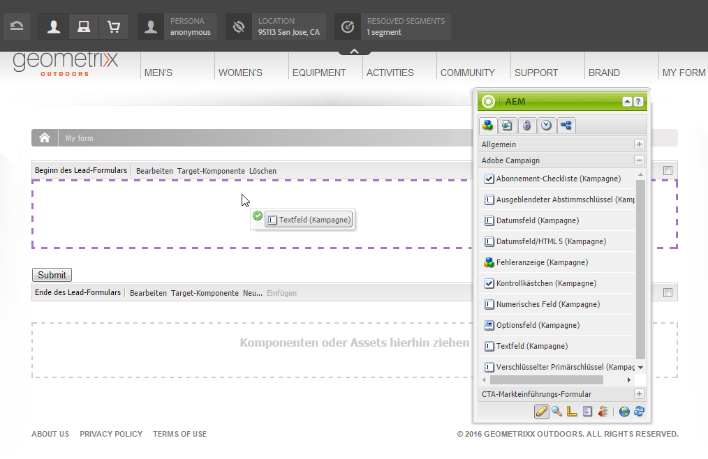

# Erstellen von Adobe Campaign-Formularen in AEM{#creating-adobe-campaign-forms-in-aem}

Mit AEM können Sie Formulare erstellen und bearbeiten, mit denen Sie auf Ihrer Website mit Adobe Campaign interagieren können. Sie können bestimmte Felder in Ihre Formulare einfügen und sie mit der Adobe Campaign-Datenbank verknüpfen.

Zudem können Sie Abonnements neuer Kontakte, Abmeldungen aus Abonnements und Benutzerprofildaten verwalten und diese zeitgleich in die Adobe Campaign-Datenbank integrieren.

Möchten Sie Adobe Campaign-Formulare in AEM nutzen, folgen Sie den in diesem Dokument beschriebenen Schritten:

1. Stellen Sie eine Vorlage bereit.
1. Erstellen Sie ein Formular.
1. Bearbeiten Sie den Formularinhalt.

Drei Formulartypen, die speziell für Adobe Campaign erstellt wurden, sind standardmäßig verfügbar:

* Profil speichern
* Service abonnieren
* Serviceabonnements beenden

Mit diesen Formularen wird ein URL-Parameter definiert, der den verschlüsselten Primärschlüssel eines Adobe Campaign-Profils akzeptiert. Basierend auf diesem URL-Parameter werden die Daten des zugehörigen Adobe Campaign-Profils aktualisiert.

Sie erstellen diese Formulare zwar einzeln, doch werden in typischen Anwendungsfällen personalisierte Verknüpfungen mit einer Formularseite im Newsletterinhalt generiert, sodass Benutzer den Link öffnen und Anpassungen an den Profildaten vornehmen können (beispielsweise Aktualisierung des Benutzerprofils, Abschließen oder Kündigen eines Abonnements).

Das Formular aktualisiert sich, basierend auf dem Benutzer, selbstständig. Weitere Informationen hierzu finden Sie unter [Bearbeiten von Formularinhalt](#editing-form-content).

## Verfügbarmachen von Vorlagen {#making-a-template-available}

Bevor Sie für Adobe Campaign spezifische Formulare erstellen können, müssen Sie verschiedene Vorlagen in Ihrer AEM-Anwendung verfügbar machen.

Weitere Informationen hierzu finden Sie im Abschnitt [Vorlagendokumentation](/help/sites-developing/page-templates-static.md#templateavailability).

Zunächst müssen Sie prüfen, ob die Verbindung zwischen Autoren- und Veröffentlichungsinstanz in Adobe Campaign funktioniert. Weitere Informationen hierzu finden Sie unter [Integration mit Adobe Campaign Standard](/help/sites-administering/campaignstandard.md) und [Integration mit Adobe Campaign 6.1](/help/sites-administering/campaignonpremise.md).

>[!NOTE]
>
>Stellen Sie sicher, dass die Eigenschaft **acMapping** im Knoten **jcr:content** der Seite auf den Wert **mapRecipient** bzw. **Profil** eingestellt ist, wenn Sie mit Adobe Campaign 6.1.x oder Adobe Campaign Standard arbeiten.

### Erstellen von Formularen {#creating-a-form}

1. Starten Sie „siteadmin“.
1. Durchsuchen Sie die Baumstruktur so lange, bis Sie den Ort finden, an dem Sie das Formular auf der gewünschten Website erstellen möchten.
1. Auswählen **Neu** > **Neue Seite...**.
1. Wählen Sie entweder **Adobe Campaign-Profil (AC 6.1)** oder **Adobe Campaign Profile (ACS)** und geben Sie die Seiteneigenschaften ein.

   >[!NOTE]
   >
   >Wenn die Vorlage nicht verfügbar ist, lesen Sie den Abschnitt [Verfügbarmachen von Vorlagen](/help/sites-classic-ui-authoring/classic-personalization-ac.md#activatingatemplate) Abschnitt.

1. Klicken **Erstellen** , um das Formular zu erstellen.

   

   Sie können [den Inhalt des Formulars nun bearbeiten und konfigurieren](#editing-form-content).

## Bearbeiten von Formularinhalt {#editing-form-content}

Für Adobe Campaign erstellte Formulare verfügen über bestimmte Komponenten. Diese Komponenten ermöglichen es Ihnen, jedes Formularfeld mit einem Feld der Adobe Campaign-Datenbank zu verknüpfen.

>[!NOTE]
>
>Wenn die gewünschte Vorlage nicht verfügbar ist, lesen Sie [Verfügbarmachen von Vorlagen](/help/sites-classic-ui-authoring/classic-personalization-ac.md#activatingatemplate).

In diesem Abschnitt werden nur für Adobe Campaign spezifische Verknüpfungen behandelt. Weitere Informationen zur Verwendung von Formularen in Adobe Experience Manager finden Sie unter [Bearbeitungsmodus-Komponenten](/help/sites-classic-ui-authoring/classic-page-author-edit-mode.md).

1. Navigieren Sie zu dem Formular, das Sie bearbeiten möchten.
1. Wählen Sie in der Toolbox **Seite** > **Seiteneigenschaften...** Gehen Sie dann zu **Cloud Services** im Popup-Fenster.
1. Fügen Sie den Adobe Campaign-Dienst hinzu, indem Sie auf **Dienst hinzufügen** und wählen Sie dann in der Dropdown-Liste des Dienstes die Ihrer Adobe Campaign-Instanz entsprechende Konfiguration aus. Diese Konfiguration wird bei der Einrichtung der Verbindung zwischen den Instanzen durchgeführt. Weitere Informationen finden Sie unter [AEM mit Adobe Campaign verbinden](/help/sites-administering/campaignonpremise.md#connecting-aem-to-adobe-campaign).

   >[!NOTE]
   >
   >Entsperren Sie (falls nötig) die Konfiguration, indem Sie auf das Schloss klicken. Der Adobe Campaign-Service kann nun hinzugefügt werden.

1. Greifen Sie mithilfe der **Bearbeiten** -Schaltfläche am Anfang des Formulars. Die **Formular** können Sie eine Dankeseite auswählen, zu der der Benutzer nach der Validierung des Formulars weitergeleitet wird.

   Die **Erweitert** können Sie den Formulartyp auswählen. Die **Beitragsoptionen** gibt Ihnen die Wahl zwischen drei Arten von Adobe Campaign-Formularen:

   * **Adobe Campaign: Profil speichern**: Mit dieser Option können Sie Empfänger in Adobe Campaign erstellen oder aktualisieren (Standardeinstellung).
   * **Adobe Campaign: Services abonnieren**: Mit dieser Option können Sie Abonnements eines Empfängers in Adobe Campaign verwalten.
   * **Adobe Campaign: Abonnement von Services beenden**: Mit dieser Einstellung können Sie die Abonnements eines Empfängers in Adobe Campaign beenden.

   Die **Aktionskonfiguration** -Feld können Sie angeben, ob das Empfängerprofil in der Adobe Campaign-Datenbank erstellt werden soll oder nicht, sofern es noch nicht vorhanden ist. Überprüfen Sie dazu die **Benutzer erstellen, falls nicht vorhanden** -Option.

1. Fügen Sie die ausgewählten Komponenten hinzu, indem Sie sie von der Toolbox in das Formular ziehen. Weitere Informationen über die verschiedenen Adobe Campaign-spezifischen Komponenten finden Sie unter [Adobe-Formular-Komponenten](/help/sites-classic-ui-authoring/classic-personalization-ac-components.md).

   

1. Konfigurieren Sie die hinzugefügten Felder, indem Sie doppelt darauf klicken. Die **Adobe Campaign** -Tab ermöglicht die Zuordnung des Felds zu einem Feld in der Adobe Campaign-Empfängertabelle. Sie können zudem ebenfalls festlegen, ob das Feld Teil des Abstimmschlüssels ist, mit dessen Hilfe bereits in der Adobe Campaign-Datenbank erfasste Empfänger identifiziert werden können.

   >[!CAUTION]
   >
   >Die **Elementname** muss für jedes Formularfeld anders sein. Ändern Sie ihn bei Bedarf.
   >
   >Jedes Formular muss **Verschlüsselter Primärer Schlüssel** -Komponente, um Empfänger in der Adobe Campaign-Datenbank korrekt zu verwalten.

1. Aktivieren Sie die Seite, indem Sie **Seite** > **Seite aktivieren** in der Toolbox. Die Seite wird auf Ihrer Site aktiviert. Sie können sie anzeigen, indem Sie zur AEM-Veröffentlichungsinstanz navigieren. Die Daten der Adobe Campaign-Datenbank werden nach Validierung eines Formulars aktualisiert.

## Testen von Formularen {#testing-a-form}

Nach der Erstellung und Bearbeitung eines Formulars möchten Sie dieses möglicherweise manuell prüfen, um sicherzustellen, dass es wie gewünscht funktioniert.

>[!NOTE]
>
>Sie müssen über eine **Verschlüsselter Primärer Schlüssel** -Komponente in jedem Formular. Wählen Sie aus den Komponenten Adobe Campaign aus, sodass nur die entsprechenden Komponenten angezeigt werden.
>
>Obwohl Sie bei diesem Verfahren die EPK-Nummer manuell eingeben, würden Benutzer in der Praxis im Newsletter einen Link zur Seite erhalten (auf der sie Abonnements abschließen oder beenden und ihr Profil aktualisieren können). Der EPK wird – basierend auf dem Benutzer – automatisch aktualisiert.
>
>Um diesen Link zu erstellen, verwenden Sie die -Variable **Hauptressourcenkennung**(Adobe Campaign Standard) oder **Verschlüsselte Kennung** (Adobe Campaign 6.1) (z. B. in einer **Text und Personalisierung (Kampagne)** -Komponente), die mit dem EPK in Adobe Campaign verknüpft ist.

Hierfür müssen Sie den EPK eines Adobe Campaign-Profils manuell abrufen und an die URL anhängen:

1. So rufen Sie den verschlüsselten Primärschlüssel (EPK) eines Adobe Campaign-Profils ab:

   * In Adobe Campaign Standard - Navigieren Sie zu **Profile und Zielgruppen** > **Profile**, in dem die vorhandenen Profile aufgelistet werden. Stellen Sie sicher, dass in der Tabelle die **Hauptressourcenkennung** in einer Spalte (dies kann durch Klicken/Tippen konfiguriert werden) **Liste konfigurieren**). Kopieren Sie die Hauptressourcenkennung des gewünschten Profils.
   * Navigieren Sie in Adobe Campaign 6.11 zu **Profile und Zielgruppen** >  **Empfänger**, in dem die vorhandenen Profile aufgelistet werden. Stellen Sie sicher, dass in der Tabelle die **Verschlüsselte Kennung** in einer Spalte (dies kann durch Rechtsklick auf einen Eintrag und Auswahl von **Liste konfigurieren..**). Kopieren Sie die verschlüsselte Kennung des gewünschten Profils.

1. Öffnen Sie AEM die Formularseite in der Veröffentlichungsinstanz und hängen Sie das EPK aus Schritt 1 als URL-Parameter an: Verwenden Sie denselben Namen, den Sie zuvor in der EPK-Komponente definiert haben, wenn Sie das Formular erstellen (z. B.: `?epk=...`)
1. Das Formular kann jetzt verwendet werden, um die Daten und Abonnements zu ändern, die dem verknüpften Adobe Campaign-Profil zugeordnet sind. Nach der Bearbeitung einiger Felder und dem Absenden des Formulars können Sie in Adobe Campaign prüfen, ob die Daten entsprechend aktualisiert wurden. 

Die Daten der Adobe Campaign-Datenbank werden nach Validierung eines Formulars aktualisiert.
