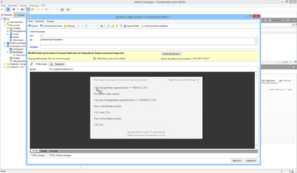

# Targeting von Adobe Campaign{#targeting-your-adobe-campaign}

Um Ihren Adobe Campaign-Newsletter als Ziel festzulegen, müssen Sie zunächst die Segmentierung einrichten, was nur in der klassischen Benutzeroberfläche verfügbar ist. Anschließend können Sie zielgerichtete Erlebnisse für Adobe Campaign erstellen.

## Einrichten der Segmentierung in AEM {#setting-up-segmentation-in-aem}

Im Rahmen der Einrichtung der Segmentierung werden Segmente erstellt sowie eine Marke, Kampagne und Erlebnisse eingerichtet. Sie können ein Segment nur in der klassischen Benutzeroberfläche erstellen. Sie können Marken, Kampagnen und Erlebnisse über die Touch-optimierte Benutzeroberfläche erstellen.

>[!NOTE]
>
>Die Segment-ID muss einer ID in Adobe Campaign zugewiesen werden.

### Erstellen von Segmenten {#creating-segments}

So erstellen Sie Segmente:

1. Öffnen Sie die [Segmentierungskonsole](http://localhost:4502/miscadmin#/etc/segmentation) unter **&lt;host>:&lt;port>/miscadmin#/etc/segmentation**.
1. Erstellen Sie eine neue Seite und geben Sie einen Titel ein, z. B. **AC-Segmente**. Wählen Sie dann die Vorlage **Segment (Adobe Campaign)** aus.
1. Wählen Sie die erstellte Seite in der Strukturansicht auf der linken Seite aus.
1. Erstellen Sie ein Segment, mit dem beispielsweise männliche Benutzer angesprochen werden, indem Sie im soeben erstellten Segment eine Seite mit dem Titel „Männlich“ erstellen und die Vorlage **Segment (Adobe Campaign)** auswählen.
1. Öffnen Sie die erstellte Segmentseite und ziehen Sie per Drag-and-Drop eine **Segment-ID** aus dem Sidekick auf die Seite.
1. Doppelklicken Sie auf das Merkmal, geben Sie die zugewiesene ID des männlichen Segments in Adobe Campaign ein (beispielsweise **MÄNNLICH**) und klicken Sie auf **OK**. Die folgende Meldung sollte angezeigt werden: `targetData.segmentCode == "MALE"`
1. Wiederholen Sie diese Schritte für ein weiteres Segment, beispielsweise eines, mit dem Benutzerinnen angesprochen werden.

### Erstellen einer Marke {#creating-a-brand}

So erstellen Sie eine Marke:

1. Navigieren Sie unter **Sites** zum Ordner **Kampagnen** (beispielsweise We.Retail).
1. Klicken Sie auf **Seite erstellen**, geben Sie einen Titel für die Seite an (beispielsweise We.Retail-Marke) und wählen Sie die Vorlage **Marke** aus.

### Erstellen einer Kampagne {#creating-a-campaign}

So erstellen Sie eine Kampagne:

1. Öffnen Sie die Seite **Marke**, die Sie soeben erstellt haben.
1. Klicken Sie auf **Seite erstellen**, geben Sie einen Titel für Ihre Seite an (beispielsweise „We.Retail-Kampagne“), wählen Sie die Vorlage **Kampagne** aus und klicken Sie auf **Erstellen**.

### Erstellen von Erlebnissen {#creating-experiences}

So erstellen Sie Erlebnisse für Segmente:

1. Öffnen Sie die Seite **Kampagne**, die Sie soeben erstellt haben.
1. Erstellen Sie Erlebnisse für Ihre Segmente, indem Sie auf **Seite erstellen** klicken, und geben Sie einen Titel für Ihre Seite ein, z. B. „Männlich“, wenn Sie ein Erlebnis für das Segment „Männlich“ erstellen, und wählen Sie dann die Vorlage **Erlebnis** aus.
1. Öffnen Sie die erstellte Erlebnisseite.
1. Klicken Sie auf **Bearbeiten** und unterhalb der Segmente auf **Element hinzufügen**.
1. Geben Sie den Pfad zum Segment „Männlich“ ein, z. B. `/etc/segmentation/ac-segments/male`, und klicken Sie auf **OK**. Es wird folgende Meldung angezeigt: *Erlebnis ist ausgerichtet auf: Männlich*.
1. Wiederholen Sie die vorherigen Schritte, um ein Erlebnis für alle Segmente, beispielsweise ein weibliches, zu erstellen.

## Erstellen eines Newsletters mit zielgerichteten Inhalten {#creating-a-newsletter-with-targeted-content}

Nachdem Sie Segmente, eine Marke, eine Kampagne und ein Erlebnis erstellt haben, können Sie einen Newsletter mit zielgerichteten Inhalten erstellen. Nachdem Sie das Erlebnis erstellt haben, verknüpfen Sie Erlebnisse mit Ihren Segmenten.

Sie können den Newsletter mit zielgerichteten Inhalten in der Touch-optimierten und der klassischen Benutzeroberfläche erstellen. Dieses Dokument beschreibt die Vorgehensweise für die Touch-optimierte Benutzeroberfläche.

So erstellen Sie einen Newsletter mit zielgerichtetem Inhalt:

1. Erstellen Sie einen Newsletter mit zielgerichtetem Inhalt: Klicken oder tippen Sie unterhalb der E-Mail-Kampagnen von Geometrixx Outdoors auf **Erstellen** > **Seite** und wählen eine der Adobe Campaign-E-Mail-Vorlagen aus.

   >[!NOTE]
   >
   >[E-Mail-Muster stehen nur in Geometrixx zur Verfügung](/help/sites-developing/we-retail.md#weretail). Laden Sie Geometrixx-Beispielinhalt von Package Share herunter.

1. Fügen Sie im Newsletter eine Text- und Personalisierungskomponente hinzu.
1. Fügen Sie der Text- und Personalisierungs-Komponente Text hinzu, beispielsweise: „Dies ist der Standardtext.“
1. Klicken Sie auf den Pfeil neben **Bearbeiten** und wählen Sie **Targeting** aus.
1. Wählen Sie die entsprechende Marke aus dem Dropdown-Menü aus und klicken Sie auf Ihre Kampagne. (Hierbei handelt es sich um die Marke und Kampagne, die Sie zuvor erstellt haben).
1. Klicken Sie auf **Targeting starten**. Die Segmente werden nun im Zielgruppenbereich angezeigt. Sollte ein Besucher nicht in eines der festgelegten Segmente passen, wird er zum Standarderlebnis weitergeleitet.

   >[!NOTE]
   >
   >Standardmäßig werden die in AEM enthaltenen E-Mail-Beispiele als Zielgruppenbestimmungs-Engine für Adobe Campaign verwendet. Bei benutzerdefinierten Newslettern müssen Sie möglicherweise Adobe Campaign als Zielgruppenbestimmungs-Engine auswählen. Tippen oder klicken Sie bei der Zielgruppenbestimmung in der Symbolleiste auf „+“, geben Sie einen Titel für die neue Aktivität ein und wählen Sie **Adobe Campaign** als Engine für die Zielgruppenbestimmung.

1. Klicken Sie auf **Standard** und dann auf die Komponente „Text und Personalisierung“, die Sie hinzugefügt haben, und Sie sehen eine Zielscheibe mit darin steckendem Pfeil. Klicken Sie auf das Symbol, um diese Komponente als Ziel festzulegen.

   

1. Navigieren Sie zu einem anderen Segment („Männlich“), klicken Sie auf **Angebot hinzufügen** und klicken Sie auf das Pluszeichen (+). Bearbeiten Sie anschließend das Angebot.
1. Navigieren Sie zu einem anderen Segment („Weiblich“), klicken Sie auf **Angebot hinzufügen** und dann auf das Pluszeichen (+). Bearbeiten Sie anschließend dieses Angebot.
1. Klicken Sie auf **Weiter**, um die Zuordnung anzuzeigen, und klicken Sie dann auf **Weiter**, um die Einstellungen anzuzeigen, die nicht für Adobe Campaign gelten, und klicken Sie auf **Speichern**.

   AEM generiert automatisch den richtigen Zielgruppenbestimmungs-Code für Adobe Campaign, wenn der Inhalt in Adobe Campaign für einen Versand genutzt wird.

1. Erstellen Sie in Adobe Campaign einen Versand: Klicken Sie auf **E-Mail-Versand mit AEM-Inhalten**, wählen Sie das passende lokale AEM-Konto aus und bestätigen Sie die Änderungen.

   In der HTML-Ansicht sind die verschiedenen Erlebnisse zielgerichteter Komponenten im Zielgruppenbestimmungs-Code für Adobe Campaign enthalten.

   

   >[!NOTE]
   >
   >Sollten Sie die Segmente auch in Adobe Campaign eingerichtet haben, werden Ihnen beim Klick auf **Vorschau** die Erlebnisse der unterschiedlichen Segmente angezeigt.
