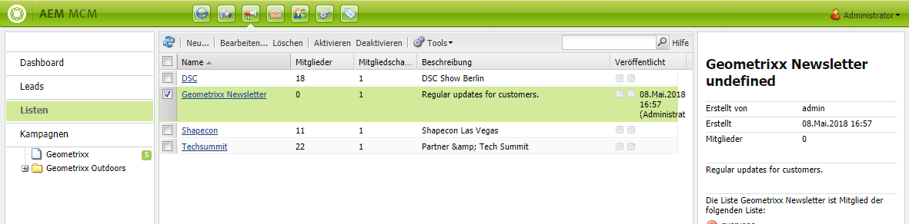
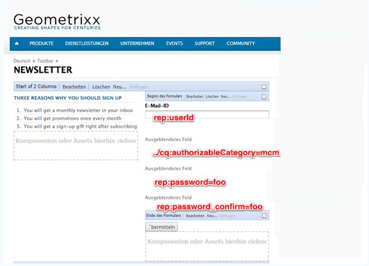
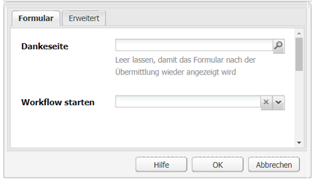
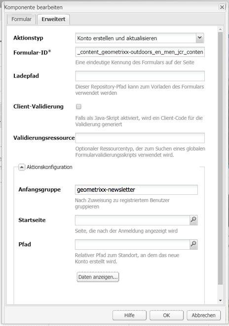
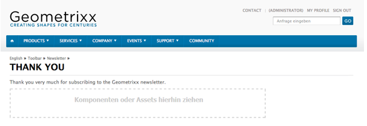
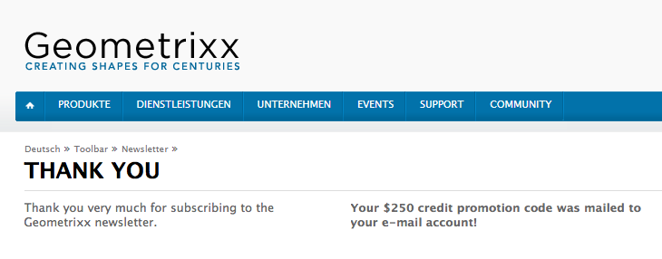

# Erstellen einer effektiven Einstiegsseite für Newsletter{#creating-an-effective-newsletter-landing-page}

Eine effektive Startseite für Ihren Newsletter hilft Ihnen dabei, so viele Personen wie möglich dazu zu animieren, sich für Ihren Newsletter (oder eine andere E-Mail-Marketing-Kampagne) zu registrieren. Sie können die Informationen, die Sie anhand der Registrierungen für Ihren Newsletter erfassen, verwenden, um Leads zu erhalten.

Gehen Sie folgendermaßen vor, um eine effektive Startseite zu erstellen:

1. Erstellen Sie eine Liste für den Newsletter, damit der Newsletter abonniert werden kann.
1. Erstellen Sie das Registrierungsformular. Fügen Sie hierbei einen Workflow-Schritt hinzu, der automatisch die Person, die sich für den Newsletter registriert, zu Ihrer Leadliste hinzufügt.
1. Erstellen Sie eine Bestätigungsseite, auf der Sie sich bei den Benutzern für die Registrierung bedanken und Ihnen möglicherweise eine Werbeaktion anbieten.
1. Fügen Sie Teaser hinzu.

>[!NOTE]
>
>Adobe plant nicht, diese Funktionen (Lead- und Listenverwaltung) weiter auszubauen.
>Es wird deshalb empfohlen, [Adobe Campaign und dessen Integration mit AEM zu nutzen](/help/sites-administering/campaign.md).

## Erstellen einer Liste für einen Newsletter {#creating-a-list-for-the-newsletter}

Erstellen Sie in MCM eine Liste, z. B. **Geometrixx Newsletter**, für den Newsletter, den die Benutzer abonnieren sollten. Informationen zum Erstellen von Listen finden Sie unter [Listen erstellen](/help/sites-classic-ui-authoring/classic-personalization-campaigns.md#creatingnewlists).

Nachfolgend sehen Sie ein Beispiel für eine Liste:

## Erstellen eines Anmeldeformulars {#create-a-sign-up-form}

Erstellen Sie ein Registrierungsformular für den Newsletter, über das Benutzer Tags abonnieren können. Die Geometrixx-Beispielwebsite bietet eine Newsletterseite in der Geometrixx-Symbolleiste, auf der Sie das Formular erstellen können.

Informationen dazu, wie Sie ein eigenes Newsletterformular erstellen, finden Sie in der [Formulardokumentation](/help/sites-authoring/default-components.md#form). Der Newsletter verwendet die Tags aus der Tag-Bibliothek. Informationen zum Hinzufügen weiterer Tags finden Sie unter [Tag-Verwaltung](/help/sites-authoring/tags.md#tagadministration).

Die ausgeblendeten Felder in dem folgenden Beispiel enthalten die minimal erforderlichen Informationen (E-Mail); zusätzlich hierzu können Sie später weitere Felder hinzufügen, was jedoch Auswirkungen auf die Konversionsrate hat.

Das folgende Beispiel ist ein Formular, das unter https://localhost:4502/cf#/content/geometrixx/en/toolbar/newsletter.html erstellt wurde.

1. Erstellen Sie das Formular.

   

1. Klicken Sie in der Formular-Komponente auf **Bearbeiten**, um das Formular so zu konfigurieren, dass der Besucher auf eine Dankeseite (siehe [Erstellen von Dankeseiten](#creating-a-thank-you-page)) geleitet wird.

   

1. Legen Sie die Formularaktion (die Aktion, die ausgeführt wird, wenn Sie das Formular übermitteln) fest und konfigurieren Sie die Gruppe so, dass registrierte Benutzer der zuvor erstellten Liste (z. B. geometrixx-newsletter) zugewiesen werden.

   

### Creating a Thank You Page {#creating-a-thank-you-page}

Wenn Benutzer auf **Jetzt abonnieren** klicken, soll automatisch eine Dankeseite geöffnet werden. Erstellen Sie die Dankeseite auf der Seite des Geometrixx-Newsletters. Nach dem Erstellen des Newsletter-Formulars bearbeiten Sie die Formular-Komponente und fügen den Pfad zu der Dankeseite hinzu.

Nach dem Übermitteln der Anforderung wird der Benutzer zu einer **Danke**-Seite geleitet. Danach erhält er eine E-Mail. Diese Dankeseite wurde unter /content/geometrixx/de/toolbar/newsletter/thank_you erstellt.

### Hinzufügen von Teasern {#adding-teasers}

Fügen Sie [Teaser](/help/sites-classic-ui-authoring/classic-personalization-campaigns.md#teasers) hinzu, um bestimmte Zielgruppen anzusprechen. Sie können beispielsweise der Dankeseite und der Newsletter-Registrierungsseite Teaser hinzufügen.

Gehen Sie folgendermaßen vor, um Teaser für eine effektive Newsletter-Startseite hinzuzufügen:

1. Erstellen Sie einen Teaser-Absatz für ein Registrierungsgeschenk. Wählen Sie **Erste(r)** als Strategie aus und fügen Sie Text hinzu, um den Benutzer zu informieren, dass er ein Geschenk erhält.

   

1. Erstellen Sie einen Teaser-Absatz für die Dankeseite. Wählen Sie **Erste(r)** als Strategie aus und fügen Sie Text hinzu, um den Benutzer zu informieren, dass das Geschenk bereits unterwegs ist.

   

1. Erstellen Sie eine Kampagne mit zwei Teasern; kennzeichnen Sie einen Teaser als &quot;geschäftlich&quot; und belassen Sie den anderen ohne Kennzeichnung.

### Push-Übertragung von Inhalt an Abonnenten  {#pushing-content-to-subscribers}

Übernehmen Sie alle Änderungen an Seiten über die Newsletter-Funktion in MCM. Sie können dann aktualisierte Inhalte an Abonnenten weitergeben.

Weitere Informationen finden Sie unter [Senden von Newslettern](/help/sites-classic-ui-authoring/classic-personalization-campaigns.md#newsletters).
